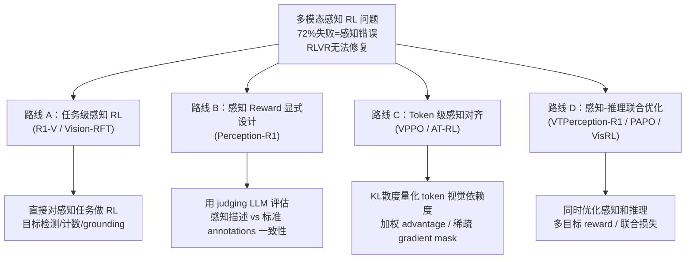

# 多模态感知 RL：从视觉捷径到感知-推理对齐

> **核心命题**：多模态 RLVR 的主流范式（只优化 outcome）系统性地忽视了感知能力，感知错误占失败案例的 70%+ 但不受 reward 约束，导致模型学会"感知错误→猜对"的投机路径。

---

## 一、问题景观

### 1.1 多模态推理的因果链

```
输入 (Image + Text) → [感知] → 视觉理解 → [推理] → CoT → [输出] → 答案
                           ↑                                           ↑
                  感知错误在这里                              RLVR 只在这里给 reward
```

**结构性问题**：outcome reward 只能观察到输出层，无法直接监督感知过程。

### 1.2 实证证据（Perception-R1 的发现）

- **72%** 的 MathVista 错误案例 → 根因是感知错误（Qwen2-VL-7B-IT）
- **68%** 的 MathVerse 错误案例 → 根因是感知错误
- McNemar's test：RLVR 训练前后感知能力无统计显著差异

感知能力不仅不被 RLVR 优化，由于"感知错误也能猜对"的路径存在，感知错误甚至可能被**强化**。

### 1.3 VPPO 的 Token 级发现（2510.09285）

**轨迹级**：模型可以走"语言捷径"——用语言推理模式绕过视觉感知
**Token 级**：视觉 token 的梯度信号被语言 token 稀释

VPPO 通过 KL 散度量化每个 token 的视觉依赖度：

$$S_t = D_{\text{KL}}\left(\pi(y_t | x, V) \| \pi(y_t | x, V')\right)$$

其中 $V'$ 是扰动/遮盖后的图像，$S_t$ 大 = 该 token 强依赖视觉输入。

---

## 二、解法全景

### 2.1 四条技术路线



### 2.2 各工作详细对比

| 工作 | 路线 | 感知监督方式 | 数据量 | 关键结果 |
|------|------|------------|--------|---------|
| **R1-V** | A | verifiable reward（bbox IoU / count EM） | 小量 | SFT 同等性能，泛化更好 |
| **Vision-RFT** | A | 几何 grounding reward（区域重叠） | 中量 | 细粒度感知+推理提升 |
| **Perception-R1** | B | judging LLM 评估 annotation 一致性 | 1,442 | 超 Vision-R1 (200K) |
| **VPPO** | C | KL 散度量化视觉依赖度 | 标准 | Qwen2.5-VL 7B **+19.2%** |
| **AT-RL** | C | anchor token 的视觉锚定 | 标准 | 多模态 GRPO 稳定性 |
| **VTPerception-R1** | D | 视觉+文本双维度感知标注 | 中量 | 感知+推理双提升 |
| **VisRL** | D | intention-guided focus（无 region labels） | 无标注 | 消除 region label 依赖 |
| **PAPO** | D | reverse-KL + entropy regularization | 标准 | 感知和策略耦合学习 |

### 2.3 各路线的核心权衡

**路线 A（任务级感知 RL）**
- 优势：reward 完全 verifiable，无 reward hacking
- 劣势：只适用于有 ground truth label 的感知任务（检测/计数/grounding）
- 代表：R1-V（object detection + counting），Vision-RFT（几何）

**路线 B（显式感知 Reward）**
- 优势：适用范围广（任何多模态推理任务），数据效率极高
- 劣势：依赖 judging LLM 的准确性，annotations 质量是上界
- 代表：Perception-R1

**路线 C（Token 级感知对齐）**
- 优势：不需要额外的感知标注，直接改变梯度流
- 劣势：KL 散度计算开销，需要额外前向传播
- 代表：VPPO（强于此路线），AT-RL

**路线 D（联合优化）**
- 优势：感知和推理不割裂，联合提升
- 劣势：目标函数设计复杂，可能有 trade-off
- 代表：VTPerception-R1，VisRL，PAPO

---

## 三、统一设计原则

### 原则 1：Reward 粒度应与任务因果结构对齐

这是贯穿所有路线的元原则：

```
Tree-GRPO   → group 在状态空间（Agent 步骤），而非输入空间（prompt）
VPPO        → gradient 在视觉依赖 token，而非所有 token
Perception-R1 → reward 在感知准确性，而非仅最终输出
```

**统一洞察**：监督信号的粒度应该与任务的最小有意义单元对齐，而不是与实现方便性对齐。

### 原则 2：感知瓶颈优先于推理瓶颈

对于多模态任务，在推理能力饱和之前，感知能力往往先成为瓶颈。投资感知改善的边际收益 > 继续投资推理改善。

### 原则 3：数据效率来自信号维度增加

Perception-R1（1,442 > Vision-R1 的 200K）揭示：
- 每条数据增加一个感知维度的监督信号
- 等效于数据量的倍增
- **这是"过程监督 > 结果监督"在多模态领域的体现**

---

## 四、与 Agent RL 的交叉

### 4.1 GUI Agent 的感知特殊性

GUI Agent 的感知不是纯粹的"图像理解"，而是**意图导向的感知**：
- 不需要理解整个截图，只需要理解与当前操作意图相关的 UI 元素
- VisRL 的 intention-guided focus 正是针对这个场景

**UI-TARS-2** 的 Working Memory 机制（近 N 步高保真）+ **Episodic Memory**（长期语义压缩），实际上在工程层面解决了 Agent 的感知选择性问题。

### 4.2 感知 Reward 在 Agent RL 中的扩展

```
多模态推理：Image → 感知 → 推理 → 答案（单步）
GUI Agent：截图 → 感知 → 动作 → 截图 → 感知 → ...（多步）
```

在 Agent RL 场景，感知错误的影响会在轨迹中累积：
- 步骤 1 感知错误 → 动作错误 → 环境状态偏移
- 后续步骤基于错误环境状态感知 → 错误 compound

**未被解决的问题**：如何在多步 Agent RL 中设计感知 reward？GiGPO / AgentPRM 关注的是 credit assignment，不是感知准确性。

---

## 五、技术演化时间线

```
2025-02  R1-V / Vision-RFT
         │ 首次将 RLVR 应用到感知任务（检测/计数）
         ↓
2025-06  Perception-R1 (2506.07218)
         │ 统计证明 RLVR 不能改善感知
         │ 引入显式视觉感知 reward
         ↓
2025-09  VTPerception-R1 (2509.24776)
         │ 扩展到视觉+文本双维度感知
         │ VisRL: intention-guided focus
         ↓
2025-10  VPPO (2510.09285)
         │ Token 级 KL 散度量化视觉依赖度
         │ 7B +19.2%（8 benchmarks）
         ↓
2025-xx  PAPO / SRPO
         │ 感知-策略耦合学习
         │ 视觉/文本线索整合增强推理
```

**趋势方向**：
1. 从"间接"（通过 outcome 间接影响感知）→ "直接"（显式感知 reward）
2. 从"任务级"（特定感知任务）→ "通用"（任意多模态推理任务）
3. 从"单步"（多模态推理）→ "多步"（Agent RL 感知，尚未成熟）

---

## 六、落地应用

### 工程选择指南

```
需要纯感知 RL（检测/计数/grounding）？
  → R1-V 或 Vision-RFT（路线 A，reward 完全 verifiable）

有正确 CoT 轨迹数据集？
  → Perception-R1（路线 B，1K 样本即可，数据效率极高）

想改善感知但无标注数据？
  → VPPO（路线 C，无需额外感知数据，修改梯度流）

感知和推理需要联合提升？
  → VTPerception-R1 + VisRL（路线 D，更全面但更复杂）
```

### 面试高频问法

**Q: 多模态 RLVR 和纯语言 RLVR 的主要区别？**
A: 多模态有额外的感知层，而感知错误在 outcome reward 下几乎不可见（感知错误也能猜对）。这导致 RLVR 在多模态领域的提升有天花板——Perception-R1 用 McNemar's test 统计证明了这点（72%的错误来自感知，但 RLVR 无法改善感知）。

**Q: 如何为多模态 Agent 设计感知 reward？**
A: 目前没有成熟方案。单步推理有 Perception-R1（judging LLM 评估 annotation 一致性）和 VPPO（KL 量化视觉依赖度），但多步 Agent 场景中感知错误如何 credit assign 还是开放问题。一个方向是 process reward model（AgentPRM 思路）扩展到感知层。

---

## 推荐阅读

- **[[VPPO-Visually-Perceptive-Policy-Optimization|VPPO]]**：Token 级视觉依赖度，7B +19.2%
- **[[Perception-R1-Visual-Perception-Reward-RLVR|Perception-R1]]**：显式感知 reward，1,442 样本达 SOTA
- **[[UI-TARS-2 论文|UI-TARS-2]]**：GUI Agent 感知的工程级解法
- **延伸**：VTPerception-R1 (2509.24776)、VisRL、PAPO
- **基础**：[Agentic RL Survey §3.6](https://arxiv.org/abs/2509.02547)（感知 Agent 综述）

---

## 启发思考

**这个方向为什么重要**：多模态 AI 的"last mile"问题。推理能力提升容易被 benchmark 测到，但感知错误被掩盖了（猜对了也算对）。这意味着现有多模态 benchmark 对模型真实能力有系统性高估。

**对 soulbox 的启发**：角色扮演 AI 的"感知"是什么？是对用户情绪/意图的理解。如果只有"对话是否令用户满意"这一个 reward，模型可能学会绕过真实理解用户的步骤（通过模板化回应猜对用户满意度），这和多模态感知 RL 的问题结构完全一致。

**未解问题**：感知和推理能力是否存在 trade-off（加了感知 reward，推理 reward 权重被稀释）？Perception-R1 显示两者是互补的，但理论上为什么？
