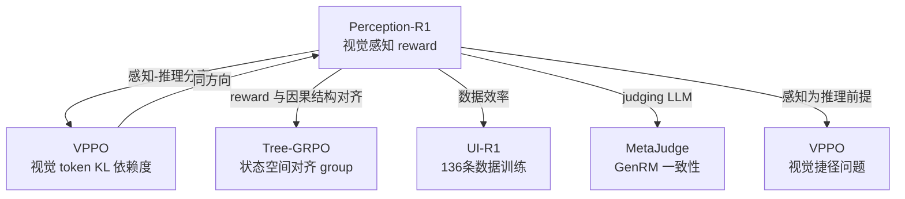

# Perception-R1：多模态 RLVR 的视觉感知 Reward

## 核心问题：RLVR 无法改善感知

**RLVR 训练 MLLM 有一个被系统忽视的结构性缺陷：只优化最终答案正确率，完全忽略感知过程。**

作者通过 **McNemar's test**（统计显著性检验）发现：RLVR 训练前后，模型的多模态感知能力没有统计意义上的改善。感知能力是推理能力的前置条件，感知瓶颈直接限制了 RLVR 的提升上限。

### 感知错误的规模

对错误案例进行人工标注分析：

| Benchmark | 模型 | 因感知错误导致失败的比例 |
|-----------|------|------------------------|
| MathVista | Qwen2-VL-7B-IT | **72%** |
| MathVerse | Qwen2-VL-7B-IT | **68%** |
| MathVista | Qwen2.5-VL-7B-IT | 类似比例 |

**核心失败模式**：模型描述了图像中不存在的几何元素（幻觉），但凭借语言推理模式猜对答案 → RLVR 的 accuracy reward 强化了这条"感知错误→猜对"的错误路径。

### 为什么现有 RLVR 无法修复感知？

```
问题根因：Reward Sparsity for Perception

outcome reward：只在最终答案正确时给正分
                ↓
感知准确性 vs 感知错误 → 在 reward 层面无差异
                ↓
感知错误的路径也能被强化（只要最终猜对）
                ↓
感知能力不受 RL 优化的直接压力
```

---

## 方法：Visual Perception Reward

### 两阶段 Pipeline

**Phase 1：构建视觉标注（离线）**

```
1. 用强 MLLM（如 GPT-4V）生成带正确答案的 CoT 轨迹
2. 用 LLM 从正确 CoT 轨迹中抽取「视觉标注」：
   - 几何图形描述
   - 图表数值
   - 空间关系
   - 视觉元素属性
这些标注被视为「正确感知的参考」
```

**Phase 2：RLVR 训练时的感知 Reward（在线）**

$$R = r_f + r_a + r_p$$

其中：
- $r_f$：Format Reward（结构化 `<think>...</think><answer>...</answer>` 输出）
- $r_a$：Accuracy Reward（最终答案正确性）
- $r_p$：**Visual Perception Reward（新增）**

**Visual Perception Reward 的计算**：

```
对每个模型响应 y：
  1. 从 y 中提取模型描述的视觉信息
  2. 与预存的 visual annotations v 对比
  3. 用 judging LLM 打分：y 与 v 的一致性程度
  4. rp ∈ {0, 1}（或连续分数）
```

关键设计：judging LLM 评估的是**感知准确性**（描述了什么），不是**推理过程**（如何推理）。

### 与其他方案的区别

| 方案 | 监督来源 | 感知奖励 | 备注 |
|------|----------|----------|------|
| 标准 RLVR | ground truth answer | ❌ | 感知是盲区 |
| VPPO (2510.09285) | KL散度（视觉依赖度） | 间接 | token 级视觉依赖量化 |
| **Perception-R1** | judging LLM + visual annotations | **直接** | 明确测量感知准确性 |
| PAPO | reverse-KL + entropy regularization | 间接 | 感知和策略耦合学习 |

---

## 实验结果

### 数据效率

| 方法 | 训练数据量 | MathVista | MathVerse |
|------|----------|-----------|-----------|
| Vision-R1 | 200,000 | baseline | baseline |
| **Perception-R1** | **1,442** | **SOTA（超越 Vision-R1）** | SOTA |

**1/139 的数据量超越了竞争基线**——这直接证明感知 reward 的信息密度远高于 outcome reward。

### 核心 Benchmark 对比（Qwen2.5-VL-7B-IT 基础）

论文报告了 MathVista / MathVerse / MMStar 等多个 benchmark，Perception-R1 在多数 benchmark 上达到 SOTA（具体数字见原论文 Table 1-3，论文 HTML 版本）。

关键结论：**感知能力提升带来的推理提升是真实的**——不仅数字变好，感知错误率显著下降（人工验证）。

---

## 关键洞察

### 洞察 1：感知是推理的硬约束

多模态推理 = 感知 + 推理，但现有 RLVR 只优化后者。感知错误率 ~70% 意味着**70% 的错误案例在输入理解环节就已经失败**，推理再强也无济于事。

**这是当前多模态 RLVR 的系统性天花板。**

### 洞察 2：Reward 设计应与任务因果结构对齐

```
任务因果链：感知 → 推理 → 输出
RLVR 的 reward：              输出 ✅ / ❌
Perception-R1 的 reward：感知 ✅ / ❌ + 输出 ✅ / ❌
```

这和 Tree-GRPO（用任务的状态结构对齐 group）、VPPO（用视觉 token 的 KL 依赖度对齐 gradient）是同一命题的不同表达：**监督信号的粒度和结构应该与任务的因果结构匹配**。

### 洞察 3：数据效率来自信息密度

1,442 vs 200K 的差距揭示：感知 reward 的信息密度极高。每次 training step 同时给出"推理对不对"和"感知对不对"两个维度的信号，相当于把每条数据的信息量翻了一倍（有效的感知维度）。

### 洞察 4：judging LLM 作为弱监督来源

视觉 annotations + judging LLM 构成了一种**无需人工标注的弱监督机制**：
- Annotations 来自模型自己生成的 CoT（bootstrap）
- judging LLM 评估一致性（无需二值 label）
- 整个流程完全自动化

这个范式对需要"软性"reward 的场景有普遍意义。

---

## 局限与未解问题

1. **judging LLM 的可靠性**：判断视觉 annotations 一致性本身是否准确？judging LLM 可能有自己的感知偏差
2. **Visual Annotation 质量上界**：如果强 MLLM 本身也有感知偏差，提取的 annotations 是否可靠？
3. **扩展到视频/3D**：当前仅验证在图像上，视频 Agent 的时序感知是否需要不同设计？
4. **reward 权重敏感性**：$r_p$ 的权重如何调整？感知 reward 过强会不会让模型只关注描述而忽略推理？

---

## 与 Vault 其他笔记的关联



- **[[AI/3-LLM/RL/Other-Algorithms/VPPO-Visually-Perceptive-Policy-Optimization|VPPO]]**：同一问题（视觉捷径）的 token 级解法，两者互补
- **[[AI/2-Agent/Agentic-RL/Tree-GRPO-Tree-Search-LLM-Agent-RL|Tree-GRPO（ICLR 2026）]]**：同一原则——reward 应与因果结构对齐
- **[[AI/2-Agent/Agentic-RL/UI-R1-GUI-Action-Prediction-RL|UI-R1]]**：极致数据效率的另一案例（136条）
- **[[AI/3-LLM/RL/Theory/Rationale-Consistency-GenRM-Deceptive-Alignment|MetaJudge（Rationale Consistency）]]**：judging LLM 评估一致性的类似范式

---

## 落地应用

### 可用场景

1. **多模态数学推理**（论文主战场）：几何证明、图表理解、空间推理
2. **视觉 QA / 文档理解**：凡需要精确感知图像细节才能推理的任务
3. **多模态 Agent**：GUI Agent 的视觉感知步骤（与 UI-TARS-2 Data Flywheel 方向兼容）

### 工程要点

- **Visual Annotation 提取 Prompt**：关键工程细节，需要仔细设计 LLM 提示来精确提取几何/数值/关系信息
- **judging LLM 的选择**：一般用 GPT-4 系或同等能力模型，需要强视觉描述理解能力
- **$r_p$ 权重调优**：建议从小权重开始（$\lambda_p \approx 0.1$），观察感知准确率变化
- **数据构建**：从已有强模型推理数据集提取 CoT（GeomVerse / MathVista train split），annotation 提取成本低

### 面试高频问法

**Q: 为什么现有 RLVR 不能改善多模态感知？**
A: RLVR 只优化最终答案正确率，但感知错误也可以通过语言推理猜对答案，导致"感知错误→猜对"的路径被强化。感知错误的 reward 信号稀疏（outcome 层面看不到）。

**Q: Perception-R1 的 reward 怎么设计的？**
A: 三路 reward：Format + Accuracy + **Visual Perception**。感知 reward = judging LLM 评估模型响应中的视觉描述与标准 visual annotations 的一致性。

**Q: 为什么 1,442 样本能超越 200K 数据？**
A: 增加了感知维度的监督信号，每条数据的有效信息量提升。类比：给 CoT 推理加上过程监督，数据效率会大幅提升——Perception-R1 是对感知维度的过程监督。

---

## 推荐阅读

- **原论文**：[arXiv:2506.07218](https://arxiv.org/abs/2506.07218)（USTC + iFLYTEK）
- **代码**：[github.com/tongxiao2002/Perception-R1](https://github.com/tongxiao2002/Perception-R1)
- **对比**：[[AI/3-LLM/RL/Other-Algorithms/VPPO-Visually-Perceptive-Policy-Optimization|VPPO]]（同方向，token 级视觉依赖度方案）
- **延伸**：VTPerception-R1 (2509.24776)（扩展到文本视觉感知双维度）
- **延伸**：VisRL（intention-guided focus selection 子策略，无需 region labels）
- **元原则**：[[AI/3-LLM/RL/Theory/RL-Signal-Granularity-Causal-Structure-Principle|RL 信号粒度与因果结构匹配原则]] — Perception-R1 是路径4（设计 Reward 层次）的典型实现，与 Tree-GRPO/GiGPO/VPPO 共同印证该元命题

---

## 启发思考

**So What**：这篇论文揭示了多模态 RLVR 的一个普遍性盲点。任何"perception → reasoning → output"的任务链，如果只在 output 层给 reward，都会有类似的感知退化问题。这不仅是多模态的问题——Agent RL 中工具返回内容的理解（perception）、长文档的关键信息提取（perception）同样面临这个问题。

**未解问题**：感知 reward 的上界在哪？当 visual annotation 本身也不完美时，能否用对比学习（负样本 annotations）来提升 reward 的鲁棒性？

**脑暴**：能否把这个框架扩展到 Agent RL？比如给工具调用结果的"理解准确性"加一个 perception reward，防止 Agent 误读工具返回内容后做出错误决策——这和盾卫 Phase 2.3 有内在联系。
