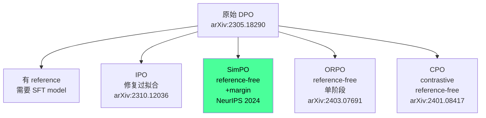

# SimPO: Simple Preference Optimization

> **一句话**：DPO 需要 reference model 计算 ratio，SimPO 用"序列平均 log-prob"直接作为隐式 reward，去掉 reference model，还加了 margin 让 winning/losing 差距更大——更简单，效果更好。

## 问题：DPO 的两个缺陷

**1. Reference model 开销**：DPO 的 reward 是 $\log\frac{\pi_\theta(y|x)}{\pi_{\text{ref}}(y|x)}$，训练时需要同时跑 policy + reference，显存翻倍。

**2. Length bias**：DPO 的 log-prob 是 sequence 累加，长回答天然有更高的绝对 log-prob，导致模型倾向生成更长的回答（即使质量不高）。

## 方法

### 核心改动 1：平均 log-prob 替代 ratio

DPO reward：$r_{\text{DPO}}(x,y) = \beta \log\frac{\pi_\theta(y|x)}{\pi_{\text{ref}}(y|x)}$

SimPO reward：$r_{\text{SimPO}}(x,y) = \frac{\beta}{|y|} \log\pi_\theta(y|x)$

用序列长度归一化，去掉 reference model 依赖，同时缓解 length bias。

### 核心改动 2：Target Reward Margin

普通 DPO 目标（Bradley-Terry）：

$$\mathcal{L}_{\text{DPO}} = -\log\sigma(r(x, y_w) - r(x, y_l))$$

SimPO 目标加 margin $\gamma > 0$：

$$\mathcal{L}_{\text{SimPO}} = -\log\sigma\left(\frac{\beta}{|y_w|}\log\pi_\theta(y_w|x) - \frac{\beta}{|y_l|}\log\pi_\theta(y_l|x) - \gamma\right)$$

$\gamma$ 强制 winning 和 losing 的 reward 差至少为 $\gamma$，避免模型只是"稍微分开"两者就满足。

## 实验结果

在 Mistral / Llama 3 / Gemma 2 系列模型上：

- AlpacaEval 2：比 DPO **+6.4 分**（length-controlled win rate）
- Arena-Hard：比 DPO **+7.5 分**
- Chatbot Arena 真实用户投票：Gemma-2-9B-it + SimPO 在 <10B 模型中**排第一**
- 不增加回答长度（解决了 length bias）

## DPO 家族谱系定位

## 关键洞察

**平均 log-prob = 更好的生成对齐**：DPO 的累积 log-prob 和生成概率（softmax greedy/sampling）不一致；平均 log-prob 正比于每 token 的平均负 cross-entropy，和模型实际的生成偏好更对齐。

**去掉 reference 的代价**：DPO 的 reference 起 regularization 作用，防止 policy 偏离太远。SimPO 没有这个约束，需要通过 $\gamma$（margin）和 $\beta$（temperature scaling）间接控制。

**margin 的直觉**：普通 Bradley-Terry 只要求 $r_w > r_l$，哪怕差 0.001 也满足；$\gamma$ 要求至少差 $\gamma$，相当于强制一个"安全边际"，让模型学到更分明的偏好。

## 局限性

- 没有 reference model 意味着没有 KL 约束，可能导致更激进的 policy shift（需要更小的学习率或更多 epoch 来补偿）
- Margin $\gamma$ 是超参，需要在不同任务上调

## 落地应用

**什么时候用 SimPO：**
- 资源紧张（去掉 reference model 省一半显存）
- 对话质量优化（chat/instruction following）
- 不想写 rejection sampling 流程，直接用离线偏好数据

**工程要点：**
- TRL >= 0.9 已支持 SimPO，`trl.SimPOTrainer`
- $\gamma$ 建议从 0.5 开始调，$\beta = 2.5$
- 数据格式和 DPO 完全一致（chosen/rejected 对），零迁移成本

**面试问法：**
- "SimPO 和 DPO 的区别？" → 去掉 reference model + 平均 log-prob + margin
- "为什么平均 log-prob 比累积 log-prob 好？" → 和生成对齐更好，缓解 length bias
- "reference-free DPO 有哪些方法？" → SimPO / ORPO / CPO（三个方向）

## 推荐阅读

- 原论文：[arXiv:2405.14734](https://arxiv.org/abs/2405.14734)
- 代码：[princeton-nlp/SimPO](https://github.com/princeton-nlp/SimPO)
- 对比：[[DPO-TRL实践|DPO-TRL实践]] / [[IPO-Identity-Preference-Optimization|IPO]] (arXiv:2310.12036) / [[ORPO-Odds-Ratio-Preference-Optimization|ORPO]] (arXiv:2403.07691)
- DPO 全景：[[RLHF-DPO-2026-技术全景|RLHF-DPO-2026-技术全景]]

---

## See Also

### Reference-free 偏好优化谱系（同类算法对照）
- [[ORPO-Odds-Ratio-Preference-Optimization|ORPO]] — 另一种 reference-free 路线：SFT + preference 合一（一阶段），SimPO 是纯偏好优化（两阶段 reference-free）
- [[IPO-Identity-Preference-Optimization|IPO]] — 理论层修正：绕过 Bradley-Terry 假设，SimPO 的 implicit reward 仍基于 B-T 框架；两者是工程 vs 理论的不同切入角度
- [[DPO-TRL实践|DPO-TRL实践]] — 标准 DPO 的工程实现对照，SimPO 与其格式兼容，零迁移成本

### DPO 全景与理论背景
- [[RLHF-DPO-2026-技术全景|RLHF-DPO-2026 技术全景]] — DPO 演进完整谱系，SimPO 属于 reference-free 分支
- [[REBEL-Regret-Based-RL-LLM-Alignment|REBEL]] — Regret-based RL，另一个从不同理论角度绕过 reference model 的方案；与 SimPO 同属"减少 reference model 依赖"方向，但动机不同（intransitive preference vs length bias）
