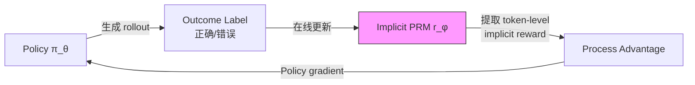

# PRIME: Process Reinforcement through Implicit Rewards

## 一、核心问题

Process Reward Model (PRM) 在 LLM reasoning 的 inference-time scaling 中已被证明优于 outcome reward（arXiv:2305.20050, PRM800K）。但把 PRM 用于 **RL training** 面临严重困难：

1. **标注成本**：step-level process label 需要人工标注每一步的正确性，成本是 outcome label 的 10-100x
2. **Reward hacking**：离线训练的 PRM 在 online RL 中容易被 exploit——policy 偏离训练分布后 PRM 给出虚假高分（arXiv:2502.01456, §1）
3. **开发开销**：传统方案需要先训练一个独立的 PRM，再用它训练 policy——两阶段流程

**PRIME 的命题**：能否在 **没有 process label** 的情况下，利用隐式 process reward 做在线 RL？

---

## 二、核心方法

### 2.1 Implicit Process Reward 的数学基础

PRIME 建立在 Implicit PRM（arXiv:2412.01981）的理论之上：

**核心洞察**：一个经过 outcome-supervised 训练的 reward model，其 token-level logits 本身就隐含了 process reward 信息。

给定 prompt $x$、response $y = (y_1, y_2, ..., y_T)$，outcome reward model $r_\phi$ 的 token-level logit 变化可以被解释为 **隐式 step reward**：

$$r_{\text{implicit}}(x, y_{\leq t}) = \log \frac{P_\phi(\text{correct} | x, y_{\leq t})}{P_\phi(\text{incorrect} | x, y_{\leq t})}$$

即在每个 token 位置，观察 outcome reward model 对"最终正确"概率的变化——这个变化就是该 token 的 process reward。

### 2.2 PRIME 三步框架

**Step 1: Policy Rollout** — 用当前 policy $\pi_\theta$ 生成 K 个 response

**Step 2: Online PRM Update** — 用 rollout 的 outcome label（正确/错误）在线更新 implicit PRM $r_\phi$：

$$\mathcal{L}_{\text{PRM}} = -\mathbb{E}_{(x,y,l)} \left[ l \cdot \log P_\phi(\text{correct} | x, y) + (1-l) \cdot \log P_\phi(\text{incorrect} | x, y) \right]$$

其中 $l \in \{0, 1\}$ 是 outcome label。

**Step 3: Implicit Reward Extraction + RL** — 从更新后的 PRM 提取 token-level implicit process reward，作为 RL 的 dense reward signal。

### 2.3 与 Advantage Function 的兼容

PRIME 的 implicit process reward 可以与多种 advantage 函数组合（arXiv:2502.01456, Table 1）：

$$A_{\text{PRIME}}(x, y, t) = \underbrace{A_{\text{outcome}}(x, y)}_{\text{GRPO/RLOO/etc.}} + \lambda \cdot \underbrace{r_{\text{implicit}}(x, y_{\leq t})}_{\text{dense process signal}}$$

支持的 backbone 包括：
- GRPO advantage（group relative）
- RLOO advantage（leave-one-out）
- PPO advantage（GAE）

**关键创新**：不替换 backbone RL 算法，而是**叠加** dense process reward——工程上是 drop-in 增强。

### 2.4 为什么在线更新 PRM 不 hack？

传统 PRM hacking 根因：policy 在 RL 中偏离 PRM 训练分布 → PRM 泛化失败。

PRIME 的解法：**PRM 随 policy 同步更新**。每一轮 RL 迭代，PRM 都用当前 policy 的 rollout 数据做一步更新：

$$\phi_{t+1} = \phi_t - \alpha \nabla_\phi \mathcal{L}_{\text{PRM}}(\phi_t; \text{rollouts from } \pi_{\theta_t})$$

PRM 始终 on-distribution → 不存在 distribution shift → 不会 hack。

---

## 三、实验结果

### 3.1 主结果（Qwen2.5-Math-7B-Base 出发）

| 模型 | MATH-500 | AMC | AIME | Minerva | GaoKao | OlympiadBench | AVG |
|------|---------|-----|------|---------|--------|--------------|-----|
| SFT baseline | 67.4 | 52.5 | 10.0 | 25.7 | 64.6 | 27.8 | 41.3 |
| + GRPO (outcome only) | 73.8 | 60.0 | 13.3 | 30.9 | 70.4 | 33.1 | 46.9 |
| **+ PRIME** | **79.2** | **67.5** | **20.0** | **36.8** | **76.0** | **39.4** | **53.2** |
| Qwen2.5-Math-7B-Instruct | 82.6 | 62.5 | 16.7 | 35.3 | 74.6 | 36.3 | 51.3 |

**关键数字**：PRIME 用 10% 训练数据超越了 Qwen2.5-Math-7B-Instruct（+1.9% avg），同时 **AIME +3.3pp**。

### 3.2 代码推理（LiveCodeBench）

PRIME 在代码任务上同样有效，PASS@1 提升显著（arXiv:2502.01456, §5.3）。

### 3.3 Ablation: Online vs Offline PRM

| PRM 更新方式 | MATH-500 | AIME |
|-------------|---------|------|
| Offline PRM (固定) | 75.8 | 13.3 |
| Online PRM (PRIME) | **79.2** | **20.0** |

Online 更新 PRM 比 offline 固定 PRM **AIME +6.7pp**——证明在线同步更新是防 hacking 的关键。

---

## 四、批判性分析

### 我的评价

**PRIME 是 2025 年 process reward 领域最重要的工作之一**，理由：

1. **理论优雅**：implicit PRM 的数学推导（token-level logit → process reward）简洁有力，不需要额外假设
2. **工程简洁**：不需要独立 PRM 训练阶段，不需要 step-level 标注，只需 outcome label + 一个额外的 LLM forward pass
3. **兼容性**：与 GRPO/RLOO/PPO 均兼容，是 **additive enhancement** 而非 replacement
4. **开源+开数据**：GitHub 4K+ stars，完整复现

**局限性**：

1. **需要额外 LLM**：implicit PRM 需要一个独立的 reward model forward pass（虽然论文说可以用同一个 LLM 的不同 head，但实践中通常分开）
2. **Outcome label 依赖**：仍然需要 verifiable reward（数学/代码）——在 non-verifiable 场景下需要 GenRM/LLM-as-judge 提供 outcome label
3. **Process reward 准确性**：implicit process reward 的质量依赖于 outcome model 的质量——如果 outcome model 本身有 bias，process reward 继承 bias
4. **未测 agent 场景**：论文仅测了数学和代码，未在 multi-turn agent 任务上验证

### 与 AgentPRM 对比

| 维度 | PRIME | AgentPRM (arXiv:2502.10325) |
|------|-------|--------------------------|
| Process reward 来源 | Implicit（从 outcome model logit 提取）| Explicit（MC rollout 估计 step value）|
| 标注需求 | 仅 outcome label | 仅 outcome label（但需大量 MC rollout）|
| 在线更新 | ✅ Online PRM | ❌ Offline PRM |
| 额外计算 | 1x forward pass | N × rollout（N=10-50）|
| 理论基础 | Token-level logit = process reward | PRM = Q-function（Bellman）|
| 适用域 | 数学/代码 | Agent（multi-turn）|

**核心区别**：PRIME 用 logit 变化"读"出 process reward（信息论视角），AgentPRM 用 MC rollout "估"出 step value（控制论视角）。两者在理论上应该收敛到同一量，但计算开销差异巨大。

---

## 五、落地应用

### 工程要点

- **底座**：需要一个 outcome-supervised reward model 作为 implicit PRM 初始化
- **在线更新频率**：每个 RL iteration 做 1 步 PRM 更新（low overhead）
- **超参**：$\lambda$（process reward weight）是最关键超参，论文推荐 0.5-1.0
- **内存**：需要 policy LLM + PRM LLM 两个模型，但 PRM 可以用较小模型
- **框架**：已集成到 verl / OpenRLHF

### 面试高频问法

1. **"PRIME 和传统 PRM 有什么区别？"** → 传统 PRM 需要 step-level 人工标注 + 离线训练，PRIME 用 outcome label + implicit token logit 在线提取 process reward，无需人工标注
2. **"为什么 online PRM 更新不会被 hack？"** → 因为 PRM 始终用当前 policy rollout 更新，保持 on-distribution；传统 offline PRM 的分布偏移是 hacking 根因
3. **"PRIME 可以和 GRPO 一起用吗？"** → 可以，PRIME 是 additive enhancement，$A = A_{\text{GRPO}} + \lambda \cdot r_{\text{implicit}}$
4. **"Implicit process reward 的数学原理？"** → Outcome model 在每个 token 位置的 logit 变化 = 该 token 对最终正确性的边际贡献 = process reward

---

## 六、启发思考

### So What

PRIME 打通了 "outcome reward → dense process reward" 的桥梁，意味着：
- **不需要专门训练 PRM** 就能获得 step-level 信号
- **Verifiable reward 的价值被放大**：一个 binary correct/incorrect 信号可以被"分解"成 token-level 的梯度
- 这与 [[AI/3-LLM/RL/Theory/RL-Signal-Granularity-Causal-Structure-Principle|信号粒度匹配原则]] 完美契合——PRIME 自动将 sparse outcome reward 细化到 token 粒度

### 未解问题

1. **Non-verifiable domain**：如果 outcome label 来自 GenRM/LLM-judge（有噪声），implicit process reward 的质量会如何退化？
2. **Multi-turn agent**：在 40-step agent trajectory 中，implicit PRM 能否提供有意义的 step-level credit？（与 AgentPRM 的实验设置不同）
3. **Process reward 的 faithfulness**：implicit process reward 是否真的反映了"推理步骤的正确性"，还是仅仅反映了"token 对最终答案的相关性"？
4. **与 tree search 的交互**：PRIME + TreeRL/Tree-GRPO 的组合是否比单独使用更优？

---

## 推荐阅读

- **原始论文**：[arXiv:2502.01456](https://arxiv.org/abs/2502.01456)
- **代码**：[github.com/PRIME-RL/PRIME](https://github.com/PRIME-RL/PRIME)
- **前作 Implicit PRM**：[arXiv:2412.01981](https://arxiv.org/abs/2412.01981)
- **关联笔记**：
  - [[AI/2-Agent/Agentic-RL/AgentPRM-Process-Reward-Models-for-LLM-Agents|AgentPRM]] — MC rollout 显式 step value
  - [[AI/3-LLM/RL/GRPO/GRPO 深度理解|GRPO]] — PRIME 的常用 backbone
  - [[AI/3-LLM/RL/Theory/RL-Signal-Granularity-Causal-Structure-Principle|信号粒度匹配原则]] — PRIME 自动实现信号细化
  - [[AI/3-LLM/RL/Theory/GRPO-改进七维框架分析|GRPO 改进全景]] — PRIME 属于 Token 维度改进
  - [[AI/2-Agent/Agentic-RL/iStar-Implicit-Step-Rewards-Agentic-RL|iStar]] — 另一种 implicit step reward 方案（DPO 视角）
