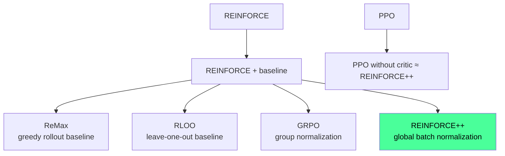

# REINFORCE++: Global Advantage Normalization

> **一句话**：GRPO 的问题在于每个 prompt 的 group 内部归一化，容易过拟合简单 prompt；REINFORCE++ 改为跨整个 global batch 归一化，一行改动，稳定性显著提升。

## 问题：GRPO/RLOO 的 prompt-level 归一化缺陷

GRPO 和 RLOO 都是 critic-free 的方法，通过 group 内多条 rollout 互相作为 baseline。但这带来两个问题：

**1. Prompt-level 过拟合**：同一个 prompt 的多条 rollout 归一化后，容易让模型在简单 prompt 上过拟合（简单 prompt 组内 reward 方差小，梯度噪声大）。

**2. OOD 泛化差**：每个 prompt 独立归一化，不同 prompt 之间的 advantage scale 不一致，导致难题和易题混合训练时梯度不稳定。

## 方法：一个改动

REINFORCE++ 的核心改动只有一处：**用全局 batch 的平均 reward 做 baseline**，而不是每个 prompt group 内部的平均。

advantage 计算：

$$A_{q,o_t} = r(o_{1:t}, q) - \beta \cdot \sum_{i=t}^{T} \text{KL}(i)$$

归一化时用全局 batch 的统计量，而不是 group 内部：

$$A^{norm} = \frac{A - \text{mean}_{\text{batch}}(A)}{\text{std}_{\text{batch}}(A)}$$

**GRPO 对比**：GRPO 是 $\frac{R_i - \text{mean}_{\text{group}}}{\text{std}_{\text{group}}}$（group = 同一 prompt 的多条 rollout）；REINFORCE++ 去掉分母的 $\text{std}_{\text{group}}$，改为 global batch std。

论文关键发现：**分母加 std 会引入训练不稳定性**，尤其对容易 prompt 的过拟合。

## KL 惩罚改进：k2 代替 k3

GRPO 用 k3 估计 KL：

$$\mathcal{L}_{k_3} = \frac{\pi_{\text{ref}}(a_t|s_t)}{\pi_\theta(a_t|s_t)} - \log\frac{\pi_{\text{ref}}(a_t|s_t)}{\pi_\theta(a_t|s_t)} - 1$$

REINFORCE++ 改用 k2 估计（$\log x \cdot \nabla_\theta \log\pi_\theta$），理由：
- k3 是 k2 的线性近似，当 policy 偏离 reference 较远时偏差大
- k3 对 $\pi_{\text{ref}} \gg \pi_{\theta_{\text{old}}}$ 和 $\pi_{\text{ref}} \ll \pi_{\theta_{\text{old}}}$ 有不对称行为

## 与 PPO 的关系

REINFORCE++ = PPO without critic，当 GAE($\lambda=1, \gamma=1$) 时：

$$\text{REINFORCE++} = \text{PPO}(\lambda=1,\gamma=1) - \text{critic network} + \text{global batch normalization}$$

## 谱系定位

## 实验结果

- RLHF 场景（Bradley-Terry RM）：与 PPO 持平或更好，同时无 critic 开销
- 长链 CoT RL：REINFORCE++ > GRPO（OOD 泛化），GRPO 对 curated prompt set 过拟合严重
- Kimi k1.5 在其长链思维 RL 训练中使用了 REINFORCE++ 路线

## 关键洞察

**GRPO 的 group normalization 是 double-edged sword**：group 内比较精确估计了相对优劣，但也造成了跨 prompt 的 scale 不一致和 easy prompt 过拟合。REINFORCE++ 用 global normalization 牺牲了一点 within-group 精度，换来了更好的跨 prompt 稳定性——对 diverse 数据集更重要。

**为什么 k2 比 k3 好**：k3 在 policy 偏离 reference 较远时线性近似失效，且方向不对称。k2 的 log 形式更对称，偏差更小。

## 局限性

- 每个 prompt 只采一条 rollout（节省显存），但相比 GRPO 的 group 内比较失去了 within-prompt 对比信号
- REINFORCE++-Baseline 变体（多条 rollout + global std normalization）可以兼顾两者，但实践中少用

## 落地应用

**什么时候选 REINFORCE++ 而不是 GRPO：**
- 训练数据 prompt 难度分布不均匀（容易被 GRPO 过拟合）
- 长链 CoT RL（GRPO 在长序列上容易 OOD 泛化差）
- 计算资源紧张（一条 rollout/prompt，比 GRPO 省显存）

**工程要点：**
- OpenRLHF 已内置 REINFORCE++，直接配置 `algorithm=reinforce++`
- KL 用 k2 而非 k3（OpenRLHF 默认实现已修正）
- 不需要截断 prompt set（GRPO 和 RLOO 常需要 curating）

**面试问法：**
- "REINFORCE++ 和 GRPO 的区别？" → 归一化粒度：group-level vs global batch-level
- "为什么要用 global normalization？" → 防止 easy prompt 过拟合，提升跨 prompt 训练稳定性
- "Kimi k1.5 用的什么 RL 算法？" → REINFORCE++（长链 CoT 场景）

## 推荐阅读

- 原论文：[arXiv:2501.03262](https://arxiv.org/abs/2501.03262)
- 代码：[OpenRLHF](https://github.com/OpenRLHF/OpenRLHF)
- 谱系对比：[[GRPO 深度理解|GRPO 深度理解]] / [[PPO 原理|PPO 原理]] / [[RLOO-TRL实践|RLOO-TRL实践]]
- 理论统一视角：[From REINFORCE to Dr. GRPO](https://lancelqf.github.io/note/llm_post_training/)

---

## See Also

### GRPO/REINFORCE 算法谱系（直接对照）
- [[GRPO 深度理解|GRPO 深度理解]] — REINFORCE++ 是 GRPO 的 critic-free 替代方案；全局 batch normalization vs group-within-batch normalization 的关键区别
- [[Dr-GRPO-Unbiased-Optimization|Dr. GRPO]] — 同类修复，角度互补：REINFORCE++ 修 advantage 估计的归一化问题，Dr. GRPO 修 length/difficulty 带来的去偏问题；两者可组合使用
- [[PPO 原理|PPO 原理]] — 有 critic 的对照：PPO 用 value network 估计 baseline，REINFORCE++ 用全局平均 reward 作 baseline——计算更简单，性能相当
- [[RLOO-TRL实践|RLOO-TRL实践]] — 另一条 critic-free 路线：Leave-One-Out 估计器，与 REINFORCE++ 的全局归一化各有优劣
- [[GRPO-Improvement-Panorama-2026|GRPO 改进全景]] — 七维框架中，REINFORCE++ 属于"无偏 advantage 估计"维度

### 工程实践
- [[ReMax-RL-Alignment-REINFORCE-Max-Baseline|ReMax]] — 同为 REINFORCE 改进，ReMax 用 greedy rollout 作 baseline（省 46% 内存）；REINFORCE++ 用全局批次均值；内存受限场景首选 ReMax，批次均值更稳定时选 REINFORCE++
