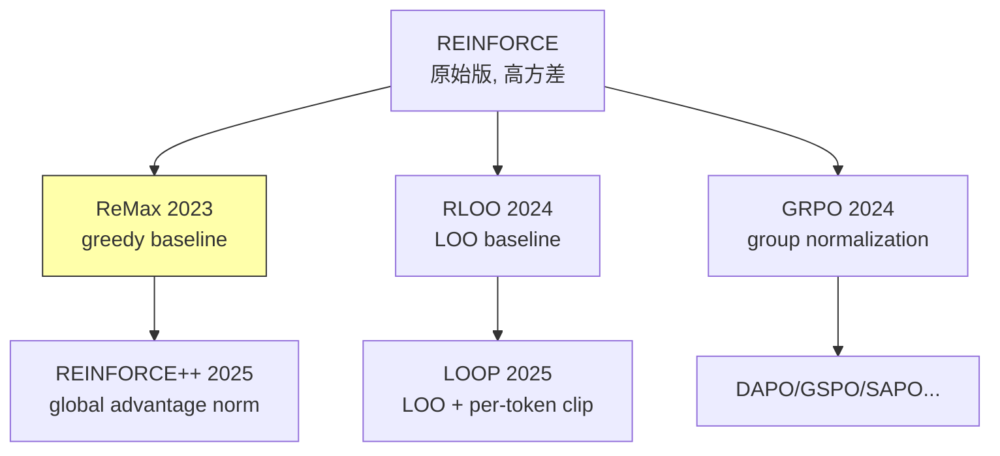

# ReMax: REINFORCE + Max-Rollout Baseline for LLM Alignment

## 一、核心问题

PPO 在 RLHF 中的三大痛点：
1. **Value network 开销**：需要训练一个与 policy 同规模的 critic，内存翻倍
2. **超参敏感**：PPO 有 6+ 关键超参（$\epsilon_\text{clip}$, GAE $\lambda$, value loss coefficient, entropy bonus, learning rate, batch size），调参困难
3. **工程复杂**：value network 的 loss 设计、更新频率、与 policy 的协调——都是额外复杂度

**ReMax 的切入点**：LLM RLHF 有三个 PPO 未利用的特殊属性：
- **Fast simulation**：LLM 生成速度快（vLLM/SGLang）
- **Deterministic transitions**：给定 token 序列，reward 确定
- **Trajectory-level rewards**：只有最终 reward，无中间 reward

---

## 二、核心方法

### 2.1 REINFORCE + Max Baseline

ReMax 的核心极为简洁：

$$\nabla_\theta J(\theta) = \mathbb{E}_{\tau \sim \pi_\theta} \left[ \sum_{t=0}^{T} \nabla_\theta \log \pi_\theta(a_t|s_t) \cdot (R(\tau) - b) \right]$$

其中 baseline $b$ 的选择是关键。ReMax 使用 **greedy rollout reward** 作为 baseline：

$$b = R(\tau^{\text{greedy}})$$

即对同一 prompt，用 greedy decoding（temperature=0）生成一条轨迹，用其 reward 作为 baseline。

**直觉**：greedy rollout 代表"不做探索时的期望表现"，偏离它的方向就是策略改进方向。

### 2.2 为什么 max/greedy baseline 有效？

**方差分析**（arXiv:2310.10505, §3.2）：

$$\text{Var}[R(\tau) - b] = \text{Var}[R(\tau)] - 2\text{Cov}[R(\tau), b] + \text{Var}[b]$$

greedy baseline 与 sampled reward 高度相关（同一 prompt 的不同 decoding），$\text{Cov}$ 项很大，有效减少方差。

**与 RLOO/GRPO 的对比**：

$$b_{\text{ReMax}} = R(\tau^{\text{greedy}})$$
$$b_{\text{RLOO}} = \frac{1}{K-1}\sum_{j \neq k} R(\tau_j) \quad \text{(LOO mean)}$$
$$b_{\text{GRPO}} = \frac{R_k - \mu}{\sigma} \quad \text{(normalized)}$$

ReMax 只需 **1 条额外 greedy rollout**（vs RLOO 需要 K 条 sampled rollout），计算最省。

### 2.3 内存对比

| 方法 | 模型数量 | 7B 模型 GPU 内存 |
|------|---------|----------------|
| PPO | Policy + Value + Ref + RM = 4 | ~160 GB |
| **ReMax** | Policy + Ref + RM = 3 | **~87 GB (−46%)** |
| GRPO | Policy + Ref = 2 | ~64 GB |
| LOOP | Policy only = 1 | ~32 GB |

ReMax 省去 value network，但仍需 reference model（KL penalty）。

---

## 三、实验结果

### AlpacaEval & MT-Bench（Mistral-7B）

| 方法 | AlpacaEval Win Rate | MT-Bench |
|------|-------------------|----------|
| PPO | 93.12% | 7.65 |
| **ReMax** | **94.78%** | **7.74** |
| DPO | 89.34% | 7.25 |

ReMax 以更低的计算成本超越 PPO（arXiv:2310.10505, Table 2）。

### 训练效率

- 7B 模型：ReMax 可在 A800-80GB 上训练，PPO 需要 offloading 才能装下
- 超参：ReMax 去掉了 value loss coefficient、GAE λ、value learning rate、value clip — 4 个超参

---

## 四、批判性分析

### 我的评价

ReMax 是 **REINFORCE 回归主义** 的重要里程碑，但在 2026 年的视角下已被 GRPO/REINFORCE++/RLOO 等方法超越：

**优点**：
1. 概念最简洁——REINFORCE + greedy baseline，无需任何额外网络
2. 首次系统论证了 PPO 的 value network 在 RLHF 中不是必需的
3. 为后续 critic-free 算法（GRPO/RLOO/REINFORCE++）奠基

**局限**：
1. **Greedy baseline 质量依赖 policy**：在训练初期 policy 很弱时，greedy rollout 也很差，baseline 不稳定
2. **单条 baseline**：只用一条 greedy rollout，方差仍高于 GRPO（K 条 rollout 做 group normalization）
3. **仍需 reference model**：内存比 GRPO 多一个 RM 模型
4. **实验规模**：论文在 7B 模型上验证，未见 >32B 的大规模实验

### 在 Critic-Free 算法族谱中的位置

ReMax 是第一个在 LLM RLHF 中证明"不需要 critic"的工作，历史意义大于现实工程价值。

---

## 五、落地应用

### 工程要点

- **适用场景**：资源有限（单机 8×A100）+ 快速验证 RLHF 效果
- **底座要求**：需要 reward model（用 Bradley-Terry 训练的偏好模型）
- **已知用户**：Qwen 团队在早期 alignment 训练中使用过 ReMax 变体（arXiv:2409.12122）

### 面试高频问法

1. **"ReMax 和 PPO 的区别？"** → ReMax 用 greedy rollout reward 作 baseline 替代 value network，省 46% 内存，去掉 4 个超参
2. **"ReMax vs GRPO？"** → ReMax 用 1 条 greedy baseline，GRPO 用 K 条 sampled rollout 做 group normalization；GRPO 方差更低但需更多 rollout
3. **"为什么后来大家用 GRPO 而不是 ReMax？"** → GRPO 的 group normalization 方差更低，且 DeepSeek R1 的成功推广了 GRPO；ReMax 的 greedy baseline 在 policy 弱时不稳定

---

## 六、启发思考

**So What**：ReMax 的核心贡献是 **解放了 RLHF 对 critic 的依赖**，打开了一整个 critic-free 研究线。GRPO、RLOO、REINFORCE++、LOOP 都可以视为 ReMax 思想的不同发展方向。

**未解问题**：
- Greedy baseline vs LOO baseline vs group normalization 的理论方差比较缺乏严格分析
- ReMax 在 multi-turn/agent 场景下的表现未知
- 能否将 ReMax 的 greedy baseline 与 PRIME 的 implicit process reward 结合？

---

## 推荐阅读

- **原始论文**：[arXiv:2310.10505](https://arxiv.org/abs/2310.10505)
- **代码**：[github.com/liziniu/ReMax](https://github.com/liziniu/ReMax)
- **关联笔记**：
  - [[REINFORCE-Plus-Plus-Global-Advantage-Normalization|REINFORCE++]] — ReMax 的演进版
  - [[GRPO 深度理解|GRPO]] — 另一条 critic-free 路线
  - [[LOOP-Leave-One-Out-PPO-Long-Horizon-Agent-RL|LOOP]] — LOO baseline 用于 agent 任务
  - [[PPO 原理|PPO]] — ReMax 试图简化的对象
