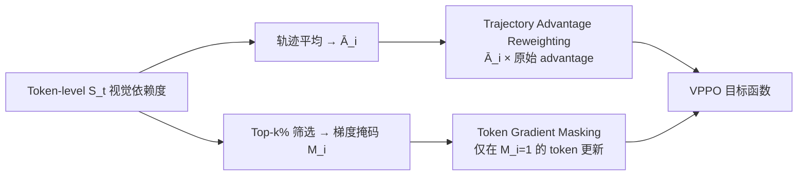
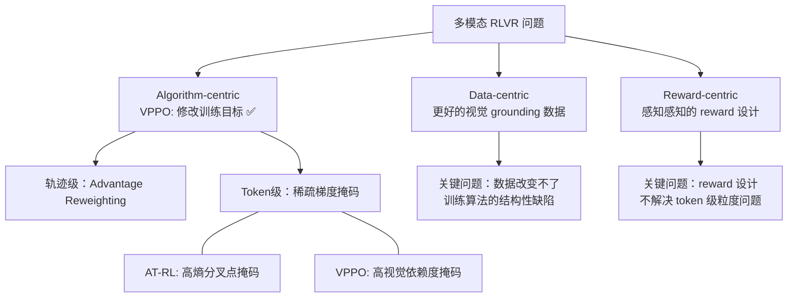

# VPPO：多模态强化学习的视觉感知策略优化

> **核心 Insight**：将 GRPO 的文本 RLVR 直接移植到视觉-语言模型是错的——它把同一个 reward 广播给了所有 token，但多模态推理中真正"在看图"的 token 只占少数。VPPO 识别哪些 token 真正依赖视觉，只在那里集中学习信号。

## 论文基础

| 项目 | 内容 |
|------|------|
| arXiv | [2510.09285](https://arxiv.org/abs/2510.09285) |
| 机构 | 上海 AI Lab + SJTU + CUHK + 南京大学 + 北大 |
| 代码 | [github.com/huaixuheqing/VPPO-RL](https://github.com/huaixuheqing/VPPO-RL) |
| 模型 | Qwen2.5-VL 7B / 32B |
| 基准 | 8 个多模态推理 benchmark |

---

## 1. 问题：文本 RLVR 移植到视觉模型的根本缺陷

### 1.1 标准 GRPO 的两层盲点

在文本 LLM 中，GRPO 把组内归一化后的 advantage $\hat{A}_i$ 广播给轨迹中的每个 token：

$$\mathcal{L}^{\text{GRPO}}(\theta) = \mathbb{E}\left[\frac{1}{G}\sum_{i=1}^{G}\frac{1}{|o_i|}\sum_{t=1}^{|o_i|}\min\left(r_{i,t}(\theta)\hat{A}_i,\ \text{clip}(\cdot)\hat{A}_i\right)\right]$$

这在纯文本推理中尚可接受，但在多模态场景下产生两个根本性问题：

**轨迹级盲点**：所有答对的轨迹得到相同权重，无论它们是真正"在看图"推导出答案，还是仅靠语言先验猜对了——两种路径被一视同仁。

**Token 级盲点**：一条轨迹里绝大多数 token 是纯文本推理（数学步骤、语言连接词等），只有少数 token 真正依赖视觉信息（"OA 和 OB 是半径 → 三角形等腰"这类关键观察）。把同样的梯度信号给所有 token，稀释了视觉感知 token 的学习效率。

### 1.2 经验发现：Token 感知的稀疏性

论文对 CoT 轨迹中每个 token 的**视觉依赖度**做了细粒度分析，发现：

1. **Token 级稀疏分布**：每条轨迹中，只有极少数 token 有高视觉依赖度（它们是真正的"感知 pivot"），大多数 token 视觉依赖度接近零
2. **轨迹级两极分化**：不同轨迹的整体视觉依赖度差异显著——有的轨迹是真正的感知驱动路径，有的是语言捷径（靠先验猜对）

这两个观察共同指向了 VPPO 的设计方向。

---

## 2. VPPO 方法

### 2.1 Token 视觉依赖度定义

**Definition 3.1（Token-level Visual Dependency）**：

给定视觉输入 $I$ 和扰动版本 $I'$（masked/非信息性），在状态 $s_t = (q, o_{<t})$ 下，token $t$ 的视觉依赖度为：

$$\mathcal{S}(s_t, I) := D_{\text{KL}}\left(\pi_\theta(\cdot|s_t, I) \,\|\, \pi_\theta(\cdot|s_t, I')\right)$$

**含义**：
- $\mathcal{S}$ 高：移除图像后，该 token 的预测分布变化大 → 该 token 真正"在看图"
- $\mathcal{S}$ 低：移除图像后，分布几乎不变 → 该 token 仅靠文本先验生成

KL 散度相比 Jensen-Shannon 散度和简单概率差，在 ablation 中表现最优（论文 Appendix F）。

### 2.2 双机制优化

**机制一：轨迹级 Advantage Reweighting**

$$\tilde{A}_i = \bar{\mathcal{S}}_i \cdot \hat{A}_i$$

其中 $\bar{\mathcal{S}}_i = \frac{1}{|o_i|}\sum_t \mathcal{S}(s_t, I)$ 是轨迹整体的平均视觉依赖度。

- 视觉依赖度高的轨迹（真正看图推理）→ advantage 放大 → 学习权重更高
- 视觉依赖度低的轨迹（语言捷径）→ advantage 压缩 → 即使答对也少学
- **效果**：引导模型向真正感知驱动的推理路径靠拢，而非语言先验

**机制二：Token 级稀疏梯度掩码**

$$M_{i,t} = \mathbb{1}\left[\mathcal{S}(s_t, I) \geq \tau_k\right]$$

$\tau_k$ 是 top-$k$% 分位数阈值（$k$ 为超参数）。

$$\mathcal{L}^{\text{VPPO}}(\theta) = \mathbb{E}\left[\frac{1}{G}\sum_{i=1}^{G}\frac{\sum_t M_{i,t} \cdot \mathcal{L}^{\text{token}}_{i,t}}{\sum_t M_{i,t}}\right]$$

- 只有视觉依赖度高的 token（top-k%）参与梯度更新
- 剩余 token 的梯度被掩码为零
- **效果**：降低梯度方差，加速收敛，专注学习"看图推理"的关键时刻

### 2.3 与 GRPO/DAPO 的关系

VPPO 是**插件式**的——可以无缝叠加在 GRPO 或 DAPO 之上：

| 方法 | Trajectory Level | Token Level |
|------|-----------------|-------------|
| GRPO | 均匀 advantage | 均匀梯度 |
| DAPO | 动态采样 | 均匀梯度 |
| **VPPO** | **视觉依赖度加权** | **稀疏梯度掩码** |

---

## 3. 实验结果

### 3.1 主要结果

基于 **Qwen2.5-VL** 系列：

| 规模 | GRPO baseline | VPPO | 提升 |
|------|--------------|------|------|
| 7B | — | — | **+19.2%** average accuracy |
| 32B | — | — | **+7.6%** average accuracy |

**8 个 benchmark**，覆盖：
- 数学推理（含几何）
- 逻辑推理
- 多学科推理
- 感知任务

超越所有主流开源 RL 调优模型。

### 3.2 关键附加发现

- **训练稳定性更优**：稀疏梯度掩码降低了梯度方差，训练曲线更平滑
- **收敛更快**：同样步数下达到更高性能
- **32B 一致有效**：scaling 不影响 VPPO 的优势（虽然大模型绝对提升幅度小于小模型）

---

## 4. 为什么这个工作重要

### 4.1 揭示了多模态 RLVR 的系统性问题

VPPO 的发现是一个**诊断**：当前多模态 RLVR 在做"假的视觉推理训练"——模型可能学到了通过语言先验猜对答案的捷径，而不是真正学会看图推理。这个问题在文本域不存在（只有一个 modality），但在多模态域是 fundamental 的。

没有 VPPO 揭示这个问题之前，大家都以为"多模态 GRPO 就是把图像加进去"，现在知道这还不够。

### 4.2 KL 散度测量视觉依赖度：一个通用工具

$\mathcal{S}(s_t, I) = D_{\text{KL}}(\pi_\theta(\cdot|s_t, I) \| \pi_\theta(\cdot|s_t, I'))$ 这个定义有超越 VPPO 的价值：

- 可以用来**可视化**模型在哪些 token 位置"真正在使用图像"
- 可以用来**调试**多模态模型的推理过程（哪些步骤在靠语言捷径？）
- 可以作为**感知质量评估指标**（测试时不训练的版本）

### 4.3 与 AT-RL 的对比

Vault 已有 [[AI/3-LLM/RL/Other-Algorithms/AT-RL-Anchor-Token-Reinforcement-Learning-Multimodal|AT-RL-Anchor-Token-Reinforcement-Learning-Multimodal]]——那篇工作也是识别"关键 token"然后集中学习。对比：

| 维度 | AT-RL | VPPO |
|------|-------|------|
| 关键 token 定义 | 高熵"分叉点"（文本逻辑） | 高视觉依赖度（感知 pivot） |
| 适用域 | 通用推理（含多模态） | 专门针对多模态视觉推理 |
| 测量方式 | 预测分布熵 | KL 散度（有无图像） |
| 核心创新 | 识别文本推理的关键决策点 | 识别视觉感知的关键时刻 |

两者可以组合：先用 AT-RL 的熵方法找逻辑分叉点，再用 VPPO 的 KL 方法确保这些分叉点确实是视觉驱动的。

---

## 5. 局限与未解问题

1. **计算开销**：每个 token 都需要额外一次前向传播（masked image），训练成本约 2x。如何高效近似 $\mathcal{S}$？
2. **$I'$ 的选择**：用什么作为"非信息性"图像？全黑/全白/高斯噪声会影响结果吗？论文怎么选的？
3. **Top-k 超参数**：$k$（稀疏掩码的百分比）如何确定？不同任务需要不同 $k$ 吗？
4. **视频/3D 感知**：仅验证于静态图像。对视频理解（时序感知）的 Visual Dependency 如何定义？
5. **文本中的"虚假"视觉信号**：如果图像中包含文字（OCR 场景），那些 token 的视觉依赖度应该很高，但不是"推理 pivot"——VPPO 会过度优化这类 token 吗？

---

## 6. 与相关工作的关系

- **[[AI/3-LLM/RL/Other-Algorithms/AT-RL-Anchor-Token-Reinforcement-Learning-Multimodal|AT-RL（Anchor Token RL）]]** — 同样做 token-level 掩码，但基于熵而非视觉依赖度；VPPO 是专门的多模态扩展
- **[[AI/3-LLM/RL/GRPO/GRPO-Improvement-Panorama-2026|GRPO Improvement Panorama]]** — VPPO 是 GRPO 的多模态特化改进，填补 Perception 维度
- **[[AI/2-Agent/Agentic-RL/Tree-GRPO-Tree-Search-LLM-Agent-RL|Tree-GRPO（ICLR 2026）]]** — Tree-GRPO 从 rollout 结构解决 credit assignment；VPPO 从 token 粒度解决 perception credit；两者都在解决 GRPO 的信号粒度问题，正交可组合

---

## 7. 落地应用

### 工程要点

1. **额外前向计算**：$\mathcal{S}$ 的计算需要原始 + masked 图像各做一次前向，可以与 rollout 同批次并行，控制额外开销在可接受范围
2. **Masked Image 选择**：实践建议用 **高斯噪声**（比全黑/全白更接近"去除信息但保留统计特性"），避免异常激活
3. **Top-k 建议**：论文 ablation 表明 k=20% 左右在大多数任务上接近最优，可以从这里开始调参
4. **插件方式**：VPPO 可以叠加在已有的 GRPO/DAPO 训练循环上，不需要改变 reward 设计

### 面试高频问法

- **Q: 多模态 RLVR 和文本 RLVR 的本质区别？** → A: 视觉依赖度问题——并非所有 token 都真正在使用图像，GRPO 的均匀广播会稀释感知学习信号
- **Q: 如何定义 token 是否"在看图"？** → A: KL 散度：$D_{\text{KL}}(\pi_\theta(\cdot|s_t, I) \| \pi_\theta(\cdot|s_t, I'))$——有无图像时预测分布的差异
- **Q: VPPO 的两个机制分别解决什么问题？** → A: 轨迹级 advantage reweighting 解决语言捷径问题；token 级稀疏梯度掩码解决感知信号稀释问题

### 可用场景

- 数学/几何视觉推理（最强场景，严重依赖看图）
- 图表/表格理解（需要精确读取视觉信息）
- 科学图像分析（显微镜、X光等需要 visual grounding 的推理）
- 任何依赖"从图中提取关键事实 → 推理"的 LVLM 任务

---

## 8. 启发思考

**So What？**

VPPO 指向了一个更大的问题：**多模态 LLM 的训练信号设计完全没有考虑 modality 的异质性**。文本 token 和视觉 token 的作用完全不同，但我们用同一套训练目标对待它们。这不仅是 RLVR 的问题——SFT、alignment 都有类似的问题。

**核心洞察**：**奖励信号的粒度应该与任务的因果结构匹配**——这和 Tree-GRPO（group 应在状态空间对齐）、GiGPO（credit assignment 应在 anchor state 级别）的洞察是同一个根本命题的不同表现。

**未解问题**：
1. VPPO 的框架能推广到 audio-language model 吗？"听觉依赖度"如何定义？
2. 如果图像 token 和文字 token 的视觉依赖度都高（图中有文字），如何区分真正的视觉推理？
3. VPPO + Tree-GRPO：树搜索找到感知驱动的轨迹分支，VPPO 在每个分支内进一步聚焦感知 token——理论上应该更强

**魂匣启发**：
- VPPO 的"识别真正关键的输入信号"思路可以用在人格一致性实验上：识别哪些对话 token 是角色真正在"引用"背景故事的关键时刻，而非语言惯性。这是 L3 NCI 指数的 token-level 版本。

---

## 推荐阅读

1. **原始论文**：[arXiv:2510.09285](https://arxiv.org/abs/2510.09285) — VPPO 全文
2. **代码仓库**：[github.com/huaixuheqing/VPPO-RL](https://github.com/huaixuheqing/VPPO-RL)
3. **对比阅读**：[[AI/3-LLM/RL/Other-Algorithms/AT-RL-Anchor-Token-Reinforcement-Learning-Multimodal|AT-RL]] — 文本域的 anchor token 方法
4. **背景理解**：[[AI/3-LLM/RL/GRPO/GRPO-Improvement-Panorama-2026|GRPO Improvement Panorama]] — GRPO 改进全景，VPPO 补充 Perception 维度
5. **Survey 位置**：Agentic RL Survey (2509.02547) §3.6 Perception — VPPO 是该章节的代表工作
6. **互补解法**：[[AI/3-LLM/MLLM/Perception-R1-Visual-Perception-Reward-RLVR|Perception-R1]] — 显式感知 Reward 解法（路线 B）；VPPO 修 token 梯度（路线 C），两者正交可组合
7. **综合视角**：[[AI/3-LLM/MLLM/Multimodal-Perception-RL-综合分析|多模态感知 RL 综合分析]] — 四路线全景，VPPO 是路线 C 代表
8. **元原则**：[[AI/3-LLM/RL/Theory/RL-Signal-Granularity-Causal-Structure-Principle|RL 信号粒度与因果结构匹配原则]] — VPPO 是路径3（修改 Gradient 流）的实现，与 Tree-GRPO/GiGPO/Perception-R1 共同印证该原则
