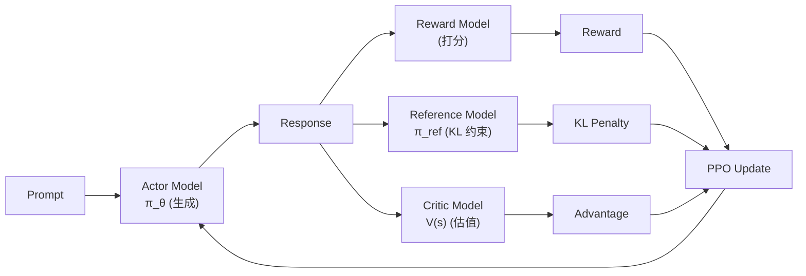

# PPO 原理

> PPO（Proximal Policy Optimization）是 OpenAI 提出的策略梯度算法，核心思想是**通过 clip ratio 限制新旧策略的差异**，在保证训练稳定性的同时最大化期望奖励。

> 来源：Schulman et al., "Proximal Policy Optimization Algorithms" arXiv:1707.06347

## 从 TRPO 到 PPO

TRPO（Trust Region Policy Optimization）用 KL 散度硬约束策略更新：

$$\max_\theta \mathbb{E}\left[\frac{\pi_\theta(a|s)}{\pi_{\theta_{\text{old}}}(a|s)} \hat{A}(s,a)\right] \quad \text{s.t.} \quad D_{\text{KL}}(\pi_{\theta_{\text{old}}} \| \pi_\theta) \leq \delta$$

> 来源：Schulman et al., "Trust Region Policy Optimization" arXiv:1502.05477

TRPO 的问题：需要计算 Fisher 信息矩阵的逆，二阶优化计算量大、实现复杂。

PPO 的解法：**用 clip 函数替代 KL 约束**，把约束优化变成无约束优化。

## PPO-Clip 目标函数

令 $r_t(\theta) = \frac{\pi_\theta(a_t|s_t)}{\pi_{\theta_{\text{old}}}(a_t|s_t)}$ 为概率比（probability ratio），PPO 的目标函数为：

$$L^{\text{CLIP}}(\theta) = \mathbb{E}_t\left[\min\left(r_t(\theta) \hat{A}_t, \;\text{clip}(r_t(\theta), 1-\epsilon, 1+\epsilon) \hat{A}_t\right)\right]$$

> 来源：arXiv:1707.06347, Sec. 3 — 这是 PPO 的核心公式

其中：
- $\hat{A}_t$：优势函数估计（通常用 GAE-λ 计算）
- $\epsilon$：clip 范围，通常取 **0.1-0.2**
- `min` 取较悲观的估计，防止过度更新

**直觉**：当 $\hat{A}_t > 0$（好动作），允许 $r_t$ 增大但不超过 $1+\epsilon$；当 $\hat{A}_t < 0$（坏动作），允许 $r_t$ 减小但不低于 $1-\epsilon$。

## GAE（Generalized Advantage Estimation）

PPO 使用 GAE-λ 估计优势函数：

$$\hat{A}_t^{\text{GAE}(\gamma, \lambda)} = \sum_{l=0}^{\infty} (\gamma \lambda)^l \delta_{t+l}$$

其中 $\delta_t = r_t + \gamma V(s_{t+1}) - V(s_t)$ 是 TD 误差。

- $\lambda = 0$：纯 TD（低方差高偏差）
- $\lambda = 1$：蒙特卡洛（高方差低偏差）
- 通常取 $\lambda = 0.95$，$\gamma = 0.99$

## PPO 在 RLHF 中的应用

> 来源：Ouyang et al., "InstructGPT" arXiv:2203.02155, Sec. 3

在 LLM 对齐中，PPO 的 RLHF 流程需要 **4 个模型**：

> 图：PPO-RLHF 的四模型架构

### 训练目标

$$R_{\text{RLHF}}(s, a) = R_{\text{RM}}(s, a) - \beta \cdot D_{\text{KL}}(\pi_\theta \| \pi_{\text{ref}})$$

- $R_{\text{RM}}$：Reward Model 给出的奖励
- $\beta$：KL 惩罚系数（通常 0.01-0.2）
- [[KL散度|KL 散度]]惩罚防止模型偏离 SFT 基线太远（reward hacking）

### PPO vs GRPO 的核心区别

| 维度 | PPO | [[GRPO 深度理解\|GRPO]] |
|------|-----|------|
| Critic 模型 | 需要（V(s) 估值） | **不需要**（组内相对比较） |
| 模型数量 | 4 个（Actor+Critic+RM+Ref） | 2 个（Actor+Ref） |
| 优势估计 | GAE-λ（依赖 Critic） | 组内 reward z-score 归一化 |
| 显存需求 | ~4x 模型大小 | ~2x 模型大小 |
| 训练稳定性 | 依赖 Critic 质量 | 更稳定（无 Critic 引入的误差） |

## 踩坑记录

1. **Reward hacking**：模型学到 RM 的漏洞（如生成长文本得高分），需要 KL 惩罚 + reward clipping
2. **Critic 训练同步**：Critic 更新太快/太慢都会导致优势估计不准，通常 Critic 学习率设为 Actor 的 2-5 倍
3. **Generation 和 Training 切换**：PPO 需要在 inference（生成 rollout）和 training（梯度更新）间切换，batch size 和 micro-batch 的配置直接影响吞吐
4. **KL 系数 β 动态调节**：固定 β 不一定最优，OpenAI 在 InstructGPT 中使用自适应 β

## 📚 推荐阅读

### 原始论文
- [Proximal Policy Optimization Algorithms](https://arxiv.org/abs/1707.06347) — PPO 原始论文，Sec. 3 的 clip 目标函数
- [Trust Region Policy Optimization](https://arxiv.org/abs/1502.05477) — TRPO，PPO 的理论前驱
- [InstructGPT](https://arxiv.org/abs/2203.02155) — PPO 在 LLM 对齐中的奠基应用

### 深度解读
- [PPO 算法详解（知乎）](https://zhuanlan.zhihu.com/p/512327050) — 中文社区最清晰的 PPO 推导 ⭐⭐⭐⭐
- [The 37 Implementation Details of PPO (ICLR Blog)](https://iclr-blog-track.github.io/2022/03/25/ppo-implementation-details/) — PPO 工程实现的 37 个细节 ⭐⭐⭐⭐⭐

### 实践资源
- [HuggingFace TRL PPOTrainer](https://huggingface.co/docs/trl/ppo_trainer) — 最常用的 PPO-RLHF 实现
- [OpenRLHF](https://github.com/OpenRLHF/OpenRLHF) — 支持 PPO 的高性能 RLHF 框架

## 🔧 落地应用

### 直接可用场景
- **LLM 对齐训练**：InstructGPT/ChatGPT 的经典方案（SFT → RM → PPO）
- **需要精细 reward 控制的场景**：PPO 的 Critic 能提供 per-token 级别的优势估计

### 工程实现要点
- **clip 范围 ε**：通常 0.1-0.2，太大训练不稳，太小收敛慢
- **mini-batch 数量**：PPO 对一批 rollout 做多个 epoch 更新（通常 4 epochs），需要足够的 mini-batch 防止过拟合
- **Generation + Training 资源分配**：verl 的 [[HybridFlow|HybridFlow]] 用 SPMD+MPMD 混合解决此问题

### 面试高频问法
- Q: PPO 的 clip 目标函数怎么理解？为什么不直接用 TRPO？
  A: TRPO 用 KL 散度硬约束（需要 Fisher 矩阵逆），计算昂贵。PPO 用 $\text{clip}(r_t, 1-\epsilon, 1+\epsilon)$ 把策略比 clamp 在 $[1-\epsilon, 1+\epsilon]$ 内，取 `min` 得到悲观估计——效果接近 TRPO 但只需一阶优化，实现简单 10 倍。

## 💡 启发与思考

### So What？对老板意味着什么
- PPO 是理解 RLHF 的"必修课"——即使实际项目中 GRPO 更常用，PPO 的概念框架（policy ratio、clip、advantage）是所有变体的基础
- PPO 的 4 模型架构是 RLHF 工程复杂性的根源——理解它才能理解 GRPO 为什么是简化

### 未解问题与局限
- PPO 的 Critic 模型引入了额外的近似误差——当 Critic 不准时，优势估计偏差会传导到策略更新
- PPO 在 LLM 场景下的 reward hacking 问题是否可以从根本上解决？

### 脑暴：如果往下延伸
- [[GRPO 深度理解|GRPO]] 去掉 Critic 后用组内相对排名替代优势估计——这是否意味着 Critic 在 LLM 场景下本身就不必要？
- 如果把 PPO 的 per-token credit assignment 和 GRPO 的 group comparison 结合，能否得到更好的方法？

## 相关

> 🔗 See also: [[GRPO 深度理解|GRPO 深度理解]] — 无 Critic 的 PPO 替代方案
> 🔗 See also: [[KL散度|KL散度]] — PPO 中 KL 惩罚的数学基础
> 🔗 See also: [[策略梯度方法|策略梯度方法]] — PPO 的理论根基

- [[DPO-TRL实践|DPO]] — 不需要 RL 的偏好优化方法
- [[TRL 概述|TRL 概述]] — PPO/GRPO/DPO Trainer 实现
- [[verl 概述|verl 概述]] — 高性能 RLHF 框架
- [[OpenRLHF|OpenRLHF]] — 支持 PPO 的开源 RLHF 框架
- [[DeepSeek-R1|DeepSeek-R1]] — 使用 GRPO 替代 PPO 的实例
- [[AI/LLM/RL/PPO/PPO-手撕实操-MA-RLHF|PPO-手撕实操（MA-RLHF）]] — **代码路径**：从零实现 PPO actor-critic，含 GAE/clip/KL 惩罚完整代码注解 ⭐⭐⭐⭐⭐
- [[AI/LLM/RL/PPO/RLHF-PPO-完整Pytorch实现|RLHF-PPO 完整 Pytorch 实现]] — **端到端 56-cell Notebook**：四模型架构 + GAE + KL 约束完整链路，配合手撕实操查工程细节 ⭐⭐⭐⭐⭐
- [[AI/LLM/RL/PPO/LLaMA2-Reward-Model实现|LLaMA2 Reward Model 实现]] — **RM 工程**：Bradley-Terry Loss + LLaMA2 RM Head，RLHF 第一步的代码参考
- [[AI/LLM/RL/PPO/MA-RLHF-核心代码注解|MA-RLHF 核心代码注解]] — PPO 在 LLM RLHF 场景的完整训练框架注解
- [[AI/LLM/RL/PPO/PRM-O1-Search-手撕实操|PRM-O1-Search 手撕实操]] — PPO 结合 Process Reward Model 的 O1 风格搜索实现
- [[AI/LLM/RL/PPO/O1-PRM搜索完整实现|O1-PRM 搜索完整实现]] — **MCTS Notebook**：UCT + 树回溯 + PRM 打分完整 MCTS 实现

> 🤖 **PPO 在 Agent 场景的变体**（Critic-free 化方向）：
> - [[LOOP-Leave-One-Out-PPO-Long-Horizon-Agent-RL|LOOP（Apple Research）]] — Leave-One-Out PPO：去掉 Critic（单倍 LLM 显存），用同组其他 rollout 的 outcome 估计 baseline；长 horizon IDA 任务；32B 超 o1 +9pp
> - [[SCoRe-Self-Correction-via-Reinforcement-Learning|SCoRe（DeepMind）]] — 双阶段 PPO 训练 multi-turn 自我纠错：Phase 1 KL 约束初始化 + Phase 2 reward bonus；PPO 用于 behavior collapse 防护
