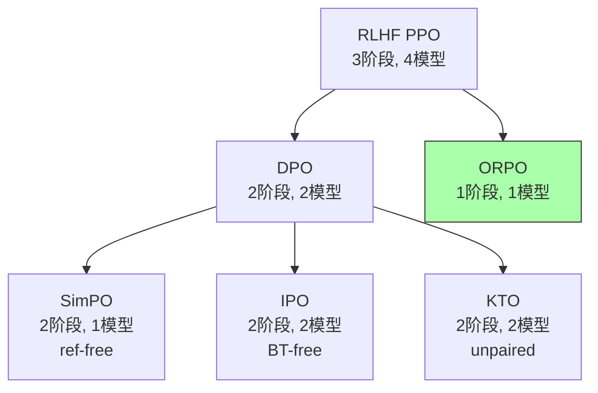

# ORPO: 一阶段 Preference Alignment（无需 SFT + 无需 Reference Model）

## 一、核心问题

标准 RLHF 流程：**SFT → RM → RL**（三阶段）
DPO 简化为：**SFT → DPO**（两阶段）

ORPO 的问题：**能否一步到位**？

观察：SFT 阶段的 NLL loss 会 **同时** 增加 chosen 和 rejected response 的 log-prob——因为 NLL 不区分"好"和"坏"生成，只要 token 出现就增加概率。这意味着 SFT 在某种程度上 **反向** 作用于 alignment。

---

## 二、核心方法

### 2.1 Odds Ratio

定义 response $y$ 在 prompt $x$ 下的 **odds**：

$$\text{odds}_\theta(y|x) = \frac{P_\theta(y|x)}{1 - P_\theta(y|x)}$$

其中 $P_\theta(y|x) = \exp\left(\frac{1}{|y|}\sum_{t=1}^{|y|} \log \pi_\theta(y_t|x, y_{<t})\right)$ 是 length-normalized 生成概率。

两个 response 的 odds ratio：

$$\text{OR}_\theta(y_w, y_l | x) = \frac{\text{odds}_\theta(y_w|x)}{\text{odds}_\theta(y_l|x)}$$

### 2.2 ORPO Loss

$$\mathcal{L}_{\text{ORPO}} = \underbrace{\mathcal{L}_{\text{NLL}}(y_w | x)}_{\text{SFT 部分：生成质量}} + \lambda \cdot \underbrace{\left( -\log \sigma \left( \log \frac{\text{odds}_\theta(y_w|x)}{\text{odds}_\theta(y_l|x)} \right) \right)}_{\text{Preference 部分：odds ratio penalty}}$$

- **第一项**：标准 NLL loss，只在 chosen response 上计算，保证生成质量
- **第二项**：log-sigmoid(log odds ratio)，拉大 chosen vs rejected 的概率差距

**关键设计**：preference penalty 很"温和"——只需要 chosen 的 odds 略大于 rejected 的 odds 即可，不需要极端分离。

### 2.3 为什么 odds ratio 而不是 log-prob ratio？

Odds ratio 有统计学上的好性质（arXiv:2403.07691, §3.2）：
- **不受 base rate 影响**：即使两个 response 的绝对概率都很低，odds ratio 仍能捕捉相对优势
- **对称性**：$\text{OR}(y_w, y_l) = 1/\text{OR}(y_l, y_w)$
- **与 NLL 正交**：NLL 控制绝对概率，OR 控制相对偏好——两个目标不冲突

### 2.4 与 DPO/SimPO 的对比

| 维度 | DPO | SimPO | ORPO |
|------|-----|-------|------|
| 需要 SFT 阶段 | ✅ | ✅ | ❌ |
| 需要 reference model | ✅ | ❌ | ❌ |
| Loss 组成 | BT preference loss | length-normalized implicit reward | NLL + OR penalty |
| 训练阶段 | 2 (SFT → DPO) | 2 (SFT → SimPO) | **1** |

---

## 三、实验结果

### 主要结果（UltraFeedback 数据集）

| 模型 | AlpacaEval 2.0 | IFEval | MT-Bench |
|------|---------------|--------|----------|
| Mistral-7B + SFT + DPO | 9.87% | 61.37% | 7.09 |
| Mistral-7B + SFT + SimPO | 11.05% | — | 7.24 |
| **Mistral-ORPO-7B** | **12.20%** | **66.19%** | **7.32** |

**注意**：ORPO 的优势在于 **一步训练**，总训练计算量更低。在固定训练预算下，ORPO 的效率优势更明显。

### 不同规模模型

论文在 125M → 7B 的 5 个模型规模上验证了 ORPO，均超 SFT+DPO baseline（arXiv:2403.07691, §5）。

---

## 四、批判性分析

### 我的评价

ORPO 的 **工程简洁性** 是其最大卖点，但理论深度不及 IPO/REBEL：

**优点**：
1. **一阶段训练**：省去独立 SFT 阶段，减少 40-50% 训练时间
2. **无 reference model**：训练时只需一个模型，内存占用最低
3. **已集成 TRL**：`trl.ORPOTrainer` 开箱即用
4. **经验证有效**：在 UltraFeedback 上持续优于 SFT+DPO

**局限**：
1. **理论基础薄弱**：为什么 odds ratio 比 log-prob ratio 好？论文缺乏严格理论分析
2. **数据质量敏感**：一步训练意味着 preference data 的噪声直接影响生成质量——DPO 至少有 SFT 阶段兜底
3. **不适合所有场景**：如果 base model 生成质量极差（如从 base model 开始），NLL 和 preference 目标可能冲突
4. **未测 reasoning 场景**：论文仅测 chat alignment，在数学/代码推理上未验证
5. **缺乏 online 扩展**：ORPO 天然是 offline 方法，无法利用 online rollout 数据

### 在 Preference Optimization 谱系中的位置

ORPO 走的是 **极致简化** 路线——一步到位，但代价是理论保证更弱。

---

## 五、落地应用

### 工程要点

- **数据要求**：标准 preference pair $(x, y_w, y_l)$，与 DPO 相同
- **超参**：$\lambda$（OR penalty 权重）是关键，论文推荐 0.1-1.0
- **框架**：`trl.ORPOTrainer`，HuggingFace 官方支持
- **适用场景**：快速 alignment prototype、资源受限场景、小模型

### 面试高频问法

1. **"ORPO 和 DPO 的区别？"** → ORPO 一步训练（SFT + alignment 合一），无需 reference model，无需独立 SFT；DPO 需要先 SFT 再 DPO
2. **"ORPO 为什么用 odds ratio？"** → Odds ratio 不受 base rate 影响，与 NLL loss 正交——NLL 管绝对概率，OR 管相对偏好
3. **"ORPO 有什么缺点？"** → 理论基础弱，数据噪声直接影响生成质量（无 SFT 兜底），不支持 online RL

---

## 六、启发思考

**So What**：ORPO 代表了 alignment 方法论的 **极简主义终点**——不能再简化了（1 阶段 + 1 模型 + 1 loss）。它的成功说明：在数据质量足够高时，复杂的训练流程可能是不必要的。

**未解问题**：
- ORPO 在 base model（非 instruct model）上的表现？需要多少 preference data 才能补偿缺失的 SFT 阶段？
- ORPO + online rejection sampling 的组合？
- 在 RLVR（verifiable reward）场景下 ORPO 是否仍有意义？

---

## 推荐阅读

- **原始论文**：[arXiv:2403.07691](https://arxiv.org/abs/2403.07691)
- **HuggingFace 教程**：`trl.ORPOTrainer`
- **关联笔记**：
  - [[AI/3-LLM/RL/DPO/DPO-TRL实践|DPO]] — ORPO 试图简化的两阶段方法
  - [[AI/3-LLM/RL/DPO/SimPO-Simple-Preference-Optimization-Reference-Free|SimPO]] — reference-free 但仍需 SFT
  - [[AI/3-LLM/RL/Preference-Optimization/IPO-Identity-Preference-Optimization|IPO]] — 理论修正路线
  - [[AI/3-LLM/RL/KTO/KTO-TRL实践|KTO]] — unpaired preference 路线
  - [[AI/3-LLM/RL/对齐技术综述|对齐技术综述]] — 全景路线图
