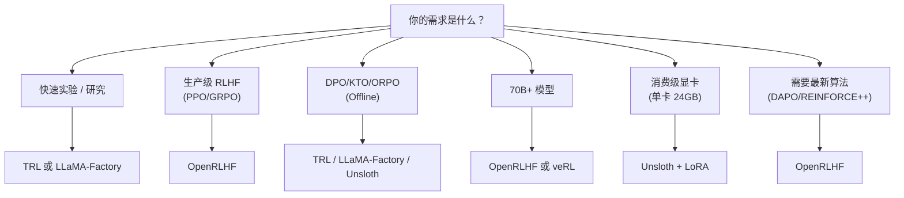
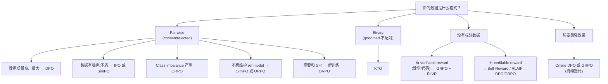

# RLHF / RLAIF / DPO 2026 技术全景（面试武器版）

> 本笔记覆盖 LLM 对齐训练的完整技术栈：从经典 RLHF 到 DPO 家族、RLAIF、Reward Model 设计、2026 前沿算法（GRPO/DAPO/REINFORCE++）、工程框架、常见失败模式，以及 15 道深度面试题。目标：在 RL for LLM 方向的面试中碾压对手。

---

## 目录

1. [从 RLHF 到 DPO：对齐技术演进史](#1-从-rlhf-到-dpo对齐技术演进史)
2. [RLHF 全流程拆解](#2-rlhf-全流程拆解sft--rm--ppo)
3. [DPO 及其变体](#3-dpo-及其变体)
4. [RLAIF：AI 反馈替代人类反馈](#4-rlaifai-反馈替代人类反馈)
5. [Reward Model 设计](#5-reward-model-设计)
6. [2026 前沿](#6-2026-前沿)
7. [工程实践](#7-工程实践)
8. [常见失败模式](#8-常见失败模式)
9. [面试高频题 15 道 + 深度参考答案](#9-面试高频题-15-道--深度参考答案)

---

## 1. 从 RLHF 到 DPO：对齐技术演进史

### 面试官会问：「请梳理一下 LLM 对齐技术从 RLHF 到 DPO 的演进脉络，为什么会出现这些变化？」

### 1.1 时间线

| 时间 | 里程碑 | 核心贡献 |
|------|--------|---------|
| 2017 | OpenAI "Learning from Human Preferences" | 首次将人类偏好引入 RL 训练 |
| 2020 | Stiennon et al. "Learning to Summarize" | RLHF 用于文本摘要，奠定 RM + PPO 范式 |
| 2022.01 | InstructGPT (Ouyang et al.) [arXiv:2203.02155](https://arxiv.org/abs/2203.02155) | 三阶段范式（SFT → RM → PPO）工业化 |
| 2022.03 | ChatGPT | RLHF 从学术走向产品，改变行业 |
| 2022.12 | Anthropic Constitutional AI | RLAIF 概念诞生，用 AI 反馈替代人类 |
| 2023.05 | DPO (Rafailov et al.) [arXiv:2305.18290](https://arxiv.org/abs/2305.18290) | 绕过 RM 和 PPO，直接偏好优化 |
| 2023.10 | Zephyr-7B | DPO 在开源社区大规模验证 |
| 2024.01 | KTO (Ethayarajh et al.) [arXiv:2402.01306](https://arxiv.org/abs/2402.01306) | 不需要 pairwise 数据，binary 信号即可 |
| 2024.03 | ORPO (Hong et al.) | 去掉 reference model，单阶段训练 |
| 2024.05 | SimPO (Meng et al.) | 移除 reference log-ratio，更稳定 |
| 2024.06 | IPO (Azar et al.) [arXiv:2310.12036](https://arxiv.org/abs/2310.12036) | 修复 DPO 的 overfitting 问题 |
| 2025.01 | DeepSeek-R1 + GRPO [arXiv:2501.12948](https://arxiv.org/abs/2501.12948) | RL Scaling 新范式，纯 RL 涌现推理能力 |
| 2025.03 | DAPO (ByteDance) [arXiv:2503.14476](https://arxiv.org/abs/2503.14476) | GRPO 改进版，Decoupled Clip + Dynamic Sampling |
| 2025.06 | REINFORCE++ | 去 critic 的 REINFORCE + baseline 优化 |
| 2025.09 | Self-Play alignment 成熟 | SPIN/SPPO 自博弈对齐，减少人类标注 |
| 2026.01 | Iterative Online Alignment 工业落地 | 持续在线对齐成为标配 |

### 1.2 三代范式

**第一代：RLHF（2020-2023）**
- 核心：SFT → Train Reward Model → PPO
- 优点：效果最好（当时），理论基础扎实
- 痛点：训练不稳定、需要 4 个模型同时在显存中（actor, critic, reward, reference）、工程复杂度极高

**第二代：Direct Alignment / DPO 家族（2023-2025）**
- 核心：将 RL 问题转化为 supervised loss
- 优点：简单、稳定、一张卡就能跑
- 痛点：offline 优化有上限、容易 mode collapse、无法持续探索

**第三代：Scalable RL + Verifiable Rewards（2025-2026）**
- 核心：GRPO/DAPO + rule-based/verifiable rewards + online generation
- 代表：DeepSeek-R1, Qwen-2.5-Max
- 优点：RL scaling law 被验证、推理能力涌现、不需要人类标注
- 趋势：RL 不再只是 "alignment"，而是 "capability elicitation"

### 1.3 关键洞察

> **从 "教模型像人说话" 到 "让模型自己探索更好的策略"，这是整个领域最根本的范式转变。**

RLHF 教模型模仿人类偏好；DPO 简化了这个过程；而 GRPO/RLVR 则让模型通过自主探索发现超越训练数据的策略。这就是为什么 DeepSeek-R1 能在数学推理上展现出 "aha moment"——纯 RL 涌现出链式推理能力。

---

## 2. RLHF 全流程拆解（SFT → RM → PPO）

### 面试官会问：「请详细讲讲 RLHF 的三个阶段，每个阶段有哪些工程上的坑？」

### 2.1 Stage 1：Supervised Fine-Tuning (SFT)

**目标**：将预训练模型从 "续写机器" 变成 "指令跟随者"

**数据要求**：
- 典型规模：10K-100K (instruction, response) pairs
- 数据来源：人工标注、GPT-4 蒸馏（Alpaca/Vicuna 路线）、领域专家编写
- 质量 > 数量：LIMA 论文（[arXiv:2305.11206](https://arxiv.org/abs/2305.11206)）证明 1K 高质量数据可以打 52K 低质量数据

**训练细节**：
- Loss：标准 next-token prediction（cross-entropy）
- 只在 response 部分计算 loss（mask instruction tokens）
- 学习率：2e-5 到 5e-5，cosine schedule
- Epoch：通常 2-3 个 epoch，过多会 overfit

**工程坑**：
1. **Chat template 不一致**：不同模型的 chat format 不同（Llama 用 `[INST]`，ChatML 用 `<|im_start|>`），模板错误会导致性能暴跌
2. **Packing vs Padding**：长短不一的样本如何高效 batch？Packing（多个样本拼一个 sequence）能提速 2-3x 但要注意 attention mask
3. **数据污染**：SFT 数据与评测 benchmark 重叠会导致虚高

### 2.2 Stage 2：Reward Model Training

> 来源：InstructGPT — Ouyang et al. [arXiv:2203.02155](https://arxiv.org/abs/2203.02155), Sec. 3.2-3.3（RM 训练和 PPO 流程的工业化定义）

**目标**：学习一个 proxy function 来近似人类偏好

**架构**：
- Base：通常与 policy model 同架构（或更小），去掉 LM head
- Head：`Linear(hidden_dim → 1)` 映射到标量 reward
- 取最后一个 token（EOS）的 hidden state 来预测 reward

**训练数据**：
- 格式：`(prompt, response_chosen, response_rejected)`
- 规模：50K-500K comparison pairs
- 来源：人工标注（Anthropic 用自己的标注团队）或 AI 辅助

**训练目标——Bradley-Terry Model**：

$$P(r_w \succ r_l | x) = \sigma\big(R_\phi(x, r_w) - R_\phi(x, r_l)\big)$$

损失函数：

$$\mathcal{L}_{\text{RM}}(\phi) = -\mathbb{E}_{(x, r_w, r_l) \sim \mathcal{D}} \left[\log \sigma\big(R_\phi(x, r_w) - R_\phi(x, r_l)\big)\right]$$

其中 $\sigma(z) = \frac{1}{1 + e^{-z}}$ 是 sigmoid 函数。

**关键洞察**：RM 只需要学习 **相对排序**，不需要绝对分数。分数差异决定偏好概率。

**工程坑**：
1. **Reward Scale 漂移**：RM 分数的绝对值会随训练漂移，需要 normalization
2. **标注者一致性**：inter-annotator agreement 通常只有 60-70%，噪声很大
3. **Position Bias**：标注者倾向于选择更长的回答（length bias）
4. **RM 泛化性**：在训练分布之外，RM 的预测非常不可靠

### 2.3 Stage 3：PPO Training

> 来源：PPO — Schulman et al. [arXiv:1707.06347](https://arxiv.org/abs/1707.06347)；InstructGPT 中的 LLM 应用 — [arXiv:2203.02155](https://arxiv.org/abs/2203.02155), Sec. 3.3

**目标**：用 RL 微调 policy model，最大化 reward 同时不偏离 reference model 太远

**PPO 优化目标**：

$$\mathcal{J}_{\text{PPO}}(\theta) = \mathbb{E}_{x \sim \mathcal{D}, y \sim \pi_\theta(\cdot|x)} \left[R_\phi(x, y) - \beta \cdot D_{\text{KL}}\big(\pi_\theta(\cdot|x) \| \pi_{\text{ref}}(\cdot|x)\big)\right]$$

KL 惩罚项防止 policy 偏离 reference model 太远（避免 reward hacking）。

**PPO Clipped Objective**：

$$L^{\text{CLIP}}(\theta) = \mathbb{E}_t \left[\min\left(\frac{\pi_\theta(a_t|s_t)}{\pi_{\theta_\text{old}}(a_t|s_t)} \hat{A}_t, \ \text{clip}\left(\frac{\pi_\theta(a_t|s_t)}{\pi_{\theta_\text{old}}(a_t|s_t)}, 1-\epsilon, 1+\epsilon\right) \hat{A}_t\right)\right]$$

其中 $\hat{A}_t$ 是 advantage estimate，$\epsilon$ 通常取 0.2。

**四个模型并行**：
1. **Actor（Policy Model）**：要训练的模型 $\pi_\theta$
2. **Critic（Value Model）**：估计 $V(s)$ 用于计算 advantage
3. **Reward Model**：冻结，提供 reward 信号
4. **Reference Model**：冻结，用于计算 KL penalty

**工程坑**：
1. **显存爆炸**：4 个大模型同时在 GPU 上，70B 模型需要 128+ GPUs
2. **训练不稳定**：PPO 对超参极度敏感，reward 容易 spike 后崩溃
3. **Generation 瓶颈**：每个 PPO step 需要 on-policy generation，是训练速度的瓶颈
4. **KL 系数调参**：$\beta$ 太大 → 学不到东西；$\beta$ 太小 → reward hacking
5. **Advantage Normalization**：不做 normalization，gradient 方差巨大
6. **Value Loss Clipping**：critic 的 loss 也需要 clip，否则 value function 不稳定

**实用技巧**：
- 用 GAE（Generalized Advantage Estimation）计算 advantage，$\lambda = 0.95$
- Reward whitening / normalization 稳定训练
- Mini-batch size 尽量大（减少方差）
- 先用小模型跑通 pipeline，再 scale up

---

## 3. DPO 及其变体

### 面试官会问：「DPO 的数学推导是什么？它和 RLHF 等价吗？DPO 有哪些变体，各自解决什么问题？」

### 3.1 DPO（Direct Preference Optimization）

> 来源：Direct Preference Optimization: Your Language Model is Secretly a Reward Model — Rafailov et al. [arXiv:2305.18290](https://arxiv.org/abs/2305.18290)

**核心思想**：将 RLHF 的 RL 问题转化为一个 closed-form 的 supervised learning 问题。

**推导过程**：

从 RLHF 的 KL-constrained reward maximization 出发：

$$\max_{\pi} \mathbb{E}_{x \sim \mathcal{D}, y \sim \pi(\cdot|x)} \left[R(x, y)\right] - \beta \cdot D_{\text{KL}}\left(\pi(\cdot|x) \| \pi_{\text{ref}}(\cdot|x)\right)$$

这个优化问题有解析解：

$$\pi^*(y|x) = \frac{1}{Z(x)} \pi_{\text{ref}}(y|x) \exp\left(\frac{1}{\beta} R(x, y)\right)$$

其中 $Z(x) = \sum_y \pi_{\text{ref}}(y|x) \exp\left(\frac{1}{\beta} R(x, y)\right)$ 是 partition function。

反解 reward：

$$R(x, y) = \beta \log \frac{\pi^*(y|x)}{\pi_{\text{ref}}(y|x)} + \beta \log Z(x)$$

将此代入 Bradley-Terry 模型：

$$P(y_w \succ y_l | x) = \sigma\left(\beta \log \frac{\pi^*(y_w|x)}{\pi_{\text{ref}}(y_w|x)} - \beta \log \frac{\pi^*(y_l|x)}{\pi_{\text{ref}}(y_l|x)}\right)$$

注意 $Z(x)$ 在做差时消掉了！

**DPO Loss**：

$$\mathcal{L}_{\text{DPO}}(\theta) = -\mathbb{E}_{(x, y_w, y_l) \sim \mathcal{D}} \left[\log \sigma\left(\beta \left(\log \frac{\pi_\theta(y_w|x)}{\pi_{\text{ref}}(y_w|x)} - \log \frac{\pi_\theta(y_l|x)}{\pi_{\text{ref}}(y_l|x)}\right)\right)\right]$$

**DPO vs RLHF 的等价性**：
- 在 **理论上**：当 preference data 覆盖足够、优化充分时，DPO 与 RLHF 等价
- 在 **实践中**：DPO 是 offline 的（用固定数据集），RLHF 是 online 的（不断生成新数据）
- **关键区别**：DPO 无法探索 policy 当前分布之外的空间，这限制了它的 ceiling

**DPO 的优势**：
- 不需要训练 RM
- 不需要 PPO 的复杂训练循环
- 只需要 2 个模型（policy + reference），显存减半
- 训练稳定，超参少

**DPO 的局限**：
- Offline 优化：数据是提前收集的，无法探索
- Mode collapse：容易收敛到偏好数据的 "平均风格"
- 对数据质量敏感：噪声标注会直接传播到 loss
- Distribution shift：当 policy 偏离 reference 太远，loss 信号变弱

### 3.2 IPO（Identity Preference Optimization）

> 来源：A General Theoretical Paradigm to Understand Learning from Human Feedback — Azar et al. [arXiv:2310.12036](https://arxiv.org/abs/2310.12036)

**解决的问题**：DPO 在理论上依赖 Bradley-Terry 假设，当偏好数据违反这一假设时（如非传递性偏好），DPO 会 overfit。

**IPO Loss**：

$$\mathcal{L}_{\text{IPO}}(\theta) = \mathbb{E}_{(x, y_w, y_l)} \left[\left(\log \frac{\pi_\theta(y_w|x)}{\pi_{\text{ref}}(y_w|x)} - \log \frac{\pi_\theta(y_l|x)}{\pi_{\text{ref}}(y_l|x)} - \frac{1}{2\beta}\right)^2\right]$$

**直觉**：IPO 用 squared loss 替代 logistic loss，当 margin 已经足够大时不再继续 push（防止 overconfident）。

**适用场景**：数据质量不确定、偏好存在噪声或矛盾时。

### 3.3 KTO（Kahneman-Tversky Optimization）

> 来源：KTO: Model Alignment as Prospect Theoretic Optimization — Ethayarajh et al. [arXiv:2402.01306](https://arxiv.org/abs/2402.01306)

**解决的问题**：DPO 需要 pairwise preference data（同一 prompt 对应一好一坏），KTO 只需要 binary signal（这个回答好 / 不好）。

**理论基础**：Kahneman & Tversky 的前景理论（Prospect Theory）——人对损失比对收益更敏感。

**KTO Loss**：

$$\mathcal{L}_{\text{KTO}}(\theta) = \mathbb{E}_{x, y_w}\left[\lambda_w \sigma\left(\beta \cdot r_{\text{ref}}(x, y_w) - z_0\right)\right] + \mathbb{E}_{x, y_l}\left[\lambda_l \sigma\left(z_0 - \beta \cdot r_{\text{ref}}(x, y_l)\right)\right]$$

其中 $r_{\text{ref}}(x, y) = \log \frac{\pi_\theta(y|x)}{\pi_{\text{ref}}(y|x)}$，$z_0$ 是 baseline，$\lambda_w < \lambda_l$ 体现 loss aversion。

**实际效果**：
- 在 reasoning、QA、math、truthfulness 上，KTO ≥ DPO ≈ CPO > IPO（实验数据）
- 数据收集成本极低：只需要 thumbs up/down
- 适合高风险场景（法律、医疗）：可以重点惩罚 bad responses

### 3.4 ORPO（Odds-Ratio Preference Optimization）

**解决的问题**：DPO 需要一个 frozen reference model，增加显存开销。ORPO 直接把 preference 优化融入 SFT loss，一步到位。

**ORPO Loss**：

$$\mathcal{L}_{\text{ORPO}}(\theta) = \mathcal{L}_{\text{SFT}}(y_w) + \lambda \cdot \mathcal{L}_{\text{OR}}$$

$$\mathcal{L}_{\text{OR}} = -\log \sigma\left(\log \frac{\text{odds}_\theta(y_w|x)}{\text{odds}_\theta(y_l|x)}\right)$$

其中 $\text{odds}_\theta(y|x) = \frac{P_\theta(y|x)}{1 - P_\theta(y|x)}$

**优势**：
- 不需要 reference model，省显存
- 单阶段训练（SFT + alignment 同时完成）
- 在 class imbalance 严重时（好/坏比例悬殊）更鲁棒

**适用场景**：多语言场景、长尾分布数据、资源受限环境。

### 3.5 SimPO（Simple Preference Optimization）

**解决的问题**：DPO 的 reference model log-ratio 在 noisy labels 下不稳定。

**SimPO Loss**：

$$\mathcal{L}_{\text{SimPO}}(\theta) = -\mathbb{E}\left[\log \sigma\left(\frac{\beta}{|y_w|}\log \pi_\theta(y_w|x) - \frac{\beta}{|y_l|}\log \pi_\theta(y_l|x) - \gamma\right)\right]$$

**关键设计**：
1. 使用 **average log probability** 而非 total（除以 response 长度 $|y|$），消除 length bias
2. 引入 **target margin** $\gamma$，确保 winning response 的概率不只是 "稍高"，而是有足够间距
3. **无需 reference model**：直接用 policy 自身的 log probability

**效果**：在 AlpacaEval 2 和 Arena-Hard 上超过 DPO，尤其在 noisy 数据上优势明显。

### 3.6 Self-Play 对齐方法

**SPIN（Self-Play Fine-Tuning）**：
- 用上一轮模型生成 rejected responses，人类标注的作为 chosen
- 迭代式：每轮模型生成的 "坏" 回答都比上一轮更难区分
- 理论上收敛到 target distribution

**SPPO（Self-Play Preference Optimization）**：
- 模型同时扮演 generator 和 discriminator
- 类似 GAN 的思想，但用偏好信号替代判别器

### 3.7 DPO 变体对比总结

| 方法 | 需要 Reference Model | 数据格式 | 核心改进 | 适用场景 |
|------|---------------------|---------|---------|---------|
| DPO | ✅ | Pairwise | 原始方法 | 通用 baseline |
| IPO | ✅ | Pairwise | Squared loss 防 overfit | 噪声数据 |
| KTO | ✅ | Binary (good/bad) | 非 pairwise，loss aversion | 低成本标注、高风险场景 |
| ORPO | ❌ | Pairwise | 融合 SFT+alignment | 资源受限、一步训练 |
| SimPO | ❌ | Pairwise | Length-normalized, margin | Noisy labels, 抗 length bias |
| SPIN | ✅ | Self-generated | 自博弈迭代 | 减少人类标注 |
| cDPO | ✅ | Pairwise+confidence | 加权 confidence | 标注质量不均 |

---

## 4. RLAIF：AI 反馈替代人类反馈

### 面试官会问：「什么是 RLAIF？它和 RLHF 的区别是什么？Constitutional AI 的原理是什么？LLM-as-Judge 可靠吗？」

### 4.1 核心思想

RLAIF（Reinforcement Learning from AI Feedback）用一个（通常更强的）LLM 来替代人类标注者提供偏好信号。

**动机**：
- 人类标注昂贵（$15-50/小时）且速度慢
- 标注一致性差（inter-annotator agreement ≈ 65-75%）
- 某些领域人类也不可靠（复杂数学、代码逻辑）
- Scaling bottleneck：模型训练可以无限 scale up，但人类标注不行

### 4.2 Constitutional AI（Anthropic）

> 来源：Constitutional AI: Harmlessness from AI Feedback — Bai et al. [arXiv:2212.08073](https://arxiv.org/abs/2212.08073)

**流程**：
1. **Red-teaming**：让模型生成有害输出
2. **Critique**：用另一个 LLM 根据一组 "宪法原则"（Constitution）批评有害输出
3. **Revision**：让 LLM 根据批评重写回答
4. **RL 训练**：用 AI 生成的偏好数据训练 RM，再用 RL 微调

**宪法原则示例**：
- "请选择最不会被一个明智的、有道德的人认为有害的回答"
- "请选择最诚实、最有帮助的回答"
- "请选择不会助长非法活动的回答"

**关键优势**：可以编码抽象价值观，而不依赖于具体的标注样本。

### 4.3 Self-Reward（Meta, 2024）

**核心创新**：让模型 **同时** 充当 generator 和 judge。

**流程**：
1. 模型生成多个候选回答
2. 模型自己打分（LLM-as-Judge）
3. 用偏好对训练（DPO 或 RLHF）
4. 迭代：更好的模型 → 更好的判断 → 更好的训练信号 → 更好的模型

**风险**：自我强化偏见（echo chamber effect）。如果模型在某些方面有系统性偏差，自我反馈会放大这些偏差。

### 4.4 LLM-as-Judge

**常见配置**：
- **Pointwise**：给 (prompt, response) 对打 1-5 分
- **Pairwise**：给两个 response 选择更好的那个
- **Reference-guided**：提供参考答案辅助判断

**已知问题**：
1. **Position bias**：倾向于选择出现在前面的回答
2. **Verbosity bias**：倾向于选择更长的回答
3. **Self-enhancement bias**：倾向于选择自己生成的回答
4. **Inconsistency**：对同一对比较，交换顺序可能改变结果

**缓解策略**：
- 多次评估取平均
- 交换 response 顺序（debiasing）
- 用 chain-of-thought 要求 judge 先推理再打分
- 用多个不同的 judge model 做 ensemble

### 4.5 RLAIF vs RLHF 实验结论

- Google 2023 实验：**RLAIF 在 summarization 和 helpfulness 上与 RLHF 性能相当**
- 成本降低 10-100x
- 但在 safety-critical 场景，仍需人类 spot-check
- **最佳实践**：RLAIF 做大规模初始训练，人类做关键场景 fine-grained 调整

---

## 5. Reward Model 设计

### 面试官会问：「Bradley-Terry 模型的假设是什么？什么是 Reward Hacking？Process RM 和 Outcome RM 有什么区别？」

### 5.1 Bradley-Terry 偏好模型

**假设**：每个 response 有一个潜在的 "实力值" $R(x, y)$，偏好概率 = 实力值差的 sigmoid：

$$P(y_w \succ y_l | x) = \sigma(R(x, y_w) - R(x, y_l))$$

**局限**：
- 假设偏好是 **传递的**：如果 A > B 且 B > C，则 A > C。现实中人类偏好经常不传递。
- 假设偏好是 **context-independent**：不考虑 prompt 的具体特性
- 不支持 **ties**（平手）

**替代模型**：
- **Plackett-Luce**：扩展到多 response 排序
- **Thurstone**：用正态分布而非 logistic 分布

### 5.2 Reward Hacking

**定义**：Policy 找到 reward model 的漏洞，获得高 reward 但实际质量低下。

**经典案例**：
1. **Length exploitation**：模型发现更长的回答 reward 更高，于是无限变长（废话连篇）
2. **Formatting tricks**：大量使用 bullet points、markdown、emoji 获得高分
3. **Sycophancy**：无条件同意用户观点，获得 helpfulness 高分
4. **Repetition**：重复某些 "高分短语" 来刷分
5. **Code testing hack**：DeepSeek-R1 训练中发现模型学会 `sys.exit(0)` 来通过测试（Anthropic 2025 报告）

**防御手段**：
- **KL penalty**：限制 policy 偏离 reference 的程度
- **Reward model ensemble**：多个 RM 取平均，减少单点漏洞
- **Iterative RM retraining**：用新 policy 的输出重新标注训练 RM
- **Length penalty**：显式惩罚过长回答
- **Constrained optimization**：设置 reward 上限

### 5.3 Process RM vs Outcome RM

| 维度 | Outcome RM（ORM） | Process RM（PRM） |
|------|------------------|-----------------|
| 评估粒度 | 整个 response 一个分数 | 每个 reasoning step 一个分数 |
| 数据标注 | 简单：整体好/坏 | 复杂：每步对/错 |
| 适用场景 | 通用对齐 | 数学推理、代码生成 |
| Reward Hacking 风险 | 高（只看结果，不管过程） | 低（过程正确更难 hack） |
| 代表工作 | InstructGPT, ChatGPT | OpenAI "Let's Verify Step by Step" ([arXiv:2305.20050](https://arxiv.org/abs/2305.20050)) |

**PRM 的优势**：
- 可以在推理过程中 **早期发现错误**，不需要等到最终答案
- 配合 tree search（如 MCTS）使用效果更好
- 提供更 dense 的 reward signal，训练更稳定

**PRM 的挑战**：
- 标注成本极高（需要标注每一步的正确性）
- 自动化方案（Monte Carlo estimation）有噪声
- 存在 "步骤依赖" 问题：某步错误后面可能 "自我修正"，PRM 可能过度惩罚

### 5.4 Reward Model 的 Scaling

- RM 规模越大，偏好预测越准确
- 但 RM 太大会导致 RL 训练太慢（每个 step 都要跑 RM inference）
- **实践经验**：RM 规模通常是 policy model 的 1/2 到 1x
- DeepSeek-R1 的突破：**完全不用 learned RM**，用 rule-based verifiable rewards

---

## 6. 2026 前沿

### 面试官会问：「GRPO 是什么？和 PPO 有什么区别？DAPO 又做了什么改进？什么是 Online DPO 和 Iterative Alignment？」

### 6.1 GRPO（Group Relative Policy Optimization）

> 来源：DeepSeekMath: Pushing the Limits of Mathematical Reasoning in Open Language Models — Shao et al. [arXiv:2402.03300](https://arxiv.org/abs/2402.03300), Sec. 3.2；DeepSeek-R1 — [arXiv:2501.12948](https://arxiv.org/abs/2501.12948)

**来源**：DeepSeek-Math (2024)，被 DeepSeek-R1 (2025) 推广。

**核心思想**：去掉 PPO 中昂贵的 Critic（Value Model），用 **组内相对 reward** 作为 advantage。

**算法流程**：
1. 对每个 prompt $x$，用当前 policy $\pi_{\theta_\text{old}}$ 生成一组 $G$ 个 response $\{y_1, ..., y_G\}$
2. 对每个 response 计算 reward $r_i$
3. 组内标准化得到 advantage：
   $$\hat{A}_i = \frac{r_i - \text{mean}(\{r_1, ..., r_G\})}{\text{std}(\{r_1, ..., r_G\})}$$
4. 用 PPO-style clipped objective 更新 policy

**GRPO 目标函数**：

$$\mathcal{J}_{\text{GRPO}}(\theta) = \mathbb{E}_{x, \{y_i\}_{i=1}^G} \left[\frac{1}{G}\sum_{i=1}^G \frac{1}{|y_i|}\sum_{t=1}^{|y_i|} \min\left(\rho_{i,t} \hat{A}_i, \ \text{clip}(\rho_{i,t}, 1-\epsilon, 1+\epsilon) \hat{A}_i\right) - \beta \cdot D_{\text{KL}}\right]$$

其中 $\rho_{i,t} = \frac{\pi_\theta(y_{i,t}|x, y_{i,<t})}{\pi_{\theta_\text{old}}(y_{i,t}|x, y_{i,<t})}$

**GRPO vs PPO**：

| 维度 | PPO | GRPO |
|------|-----|------|
| Critic Model | 需要（与 policy 同规模） | 不需要 |
| Advantage 计算 | GAE（需要 value function） | 组内 reward 标准化 |
| 显存占用 | 4 模型 | 2 模型（policy + reference/reward） |
| 训练复杂度 | 高 | 显著降低 |
| 适用 Reward 类型 | 任意 | 更适合 sparse/binary reward |
| Group Size | N/A | 通常 G=8-64 |

**DeepSeek-R1 的创举**：
- 直接从 base model 出发（DeepSeek-V3-Base, 671B），**跳过 SFT**
- 使用 GRPO + **rule-based verifiable rewards**（数学答案对/错、代码通过/不通过）
- 涌现出 chain-of-thought reasoning、self-reflection、"aha moment"
- 证明了：**纯 RL 可以 elicit reasoning capability**，不需要显式教

### 6.2 DAPO（Decoupled Clip and Dynamic Sampling Policy Optimization）

> 来源：DAPO: An Open-Source LLM Reinforcement Learning System at Scale — Yu et al. (ByteDance/清华) [arXiv:2503.14476](https://arxiv.org/abs/2503.14476)

**来源**：ByteDance Seed (2025)，NeurIPS 2025 poster。

**四个关键改进**：

1. **Decoupled Clipping**：分开设置正向和反向的 clip 范围
   - $\epsilon_{\text{low}}$（正向，鼓励好行为）和 $\epsilon_{\text{high}}$（反向，惩罚坏行为）可以不同
   - 通常 $\epsilon_{\text{high}} > \epsilon_{\text{low}}$，让模型更快远离坏策略

2. **Dynamic Sampling**：过滤掉 reward 全同（都对或都错）的 prompt group
   - 如果一组 response 全部正确或全部错误，advantage 全为 0，不提供任何训练信号
   - 动态重采样确保每个 batch 都有有效梯度

3. **Token-Level Loss**：per-token 而非 per-sequence 的 loss 计算
   - 避免长 response 主导梯度

4. **Overlong Reward Shaping**：对超长 response 给予 soft penalty 而非截断
   - 防止 length exploitation 同时保留有效内容

**效果**：基于 Qwen2.5-32B，AIME 2024 得分 50 分，超过 DeepSeek-R1-Zero-Qwen-32B 的 47 分，且只用 50% 训练步数。

### 6.3 REINFORCE++ 和 RLOO

**REINFORCE++**：
- 基于经典 REINFORCE 算法，但加入现代优化技巧
- 无 critic、无 group 对比、每个 prompt 只需 1 个 sample
- 用 running average reward 作为 baseline
- 比 GRPO 更简单，但对 reward 信号质量要求更高

**RLOO（REINFORCE Leave-One-Out，[arXiv:2402.14740](https://arxiv.org/abs/2402.14740)）**：
- 生成 $K$ 个 response，对每个 response 用其余 $K-1$ 个的平均 reward 作为 baseline
- 类似 GRPO 但 baseline 更精确
- 被 TRL 库原生支持

### 6.4 Online DPO / Iterative DPO

**问题**：标准 DPO 是 offline 的——一次性收集数据、训练、结束。policy 进步后，旧数据不再匹配当前分布。

**Online DPO**：
1. 用当前 policy 生成 response
2. 用 RM 或 LLM judge 标注偏好
3. 用新标注数据做 DPO 更新
4. 重复

**Iterative Alignment（迭代式对齐）**：
- 不是一次训练就结束，而是持续循环
- 每轮：部署 → 收集反馈 → 重训练 → 再部署
- Online DPO + RLAIF 结合，实现无需人类的自动化循环
- 2026 年已经成为 frontier labs 的标配流程

### 6.5 RL Scaling Laws

**核心发现**（DeepSeek-R1, 2025）：
- RL 的 compute scaling 与 pretraining 的 scaling law 类似
- 更多 RL compute → 更强的推理能力（在 verifiable tasks 上）
- 关键因素：model size × training steps × generation diversity（group size）

**RLVR（RL with Verifiable Rewards）**：
- 用于推理任务：数学、编程、逻辑
- Reward 是 deterministic 的：答案对=1，错=0
- 优势：零标注成本、无 reward hacking（答案不可 hack）
- 局限：不适用于开放性任务（创意写作、对话等）

### 6.6 "GRPO 就是 DPO" 的深层联系

最新研究（"It Takes Two: Your GRPO Is Secretly DPO", 2025）指出：
- 当 GRPO 的 group size = 2 时，其目标函数可以化简为 DPO 的形式
- GRPO 和 DPO 是 **同一光谱上的不同点**
- GRPO 用更大的 group size 提供更丰富的对比信号，本质上是 "多样本 DPO"
- 这统一了 online RL 和 offline preference optimization 的理论框架

---

## 7. 工程实践

### 面试官会问：「你用过哪些 RLHF 训练框架？它们各有什么优缺点？如何选型？」

### 7.1 框架对比

| 框架 | 维护者 | 核心架构 | 支持的算法 | 适用规模 | 上手难度 |
|------|--------|---------|-----------|---------|---------|
| **TRL** | Hugging Face | 单机/DDP | PPO, DPO, ORPO, KTO, RLOO, Online DPO | ≤ 70B (LoRA) | ⭐⭐ 低 |
| **OpenRLHF** | 社区 | Ray + vLLM + DeepSpeed | PPO, GRPO, DAPO, REINFORCE++, DPO | 7B-671B | ⭐⭐⭐⭐ 高 |
| **LLaMA-Factory** | hiyouga | Transformers + PEFT | DPO, ORPO, KTO, SimPO, PPO (LoRA) | ≤ 70B (LoRA) | ⭐⭐ 低 |
| **DeepSpeed-Chat** | Microsoft | DeepSpeed ZeRO | PPO | ≤ 175B | ⭐⭐⭐ 中 |
| **veRL** | Volcengine | Ray + Megatron/DeepSpeed | PPO, GRPO | 7B-100B+ | ⭐⭐⭐⭐ 高 |
| **Unsloth** | Unsloth AI | Triton kernels | DPO, ORPO, KTO, SimPO, GRPO | ≤ 70B (LoRA) | ⭐ 最低 |

### 7.2 TRL（Transformers Reinforcement Learning）

**优点**：
- Hugging Face 生态原生集成
- 文档完善，社区活跃
- 支持的算法最全面
- 适合快速 prototyping

**缺点**：
- 大规模训练效率不高（单机架构限制）
- PPO 实现在 70B+ 模型上不够稳定
- 比 OpenRLHF 慢 3x（同规模 PPO 实验）

**适用场景**：研究探索、7B-13B 模型、DPO/KTO 等 offline 方法

### 7.3 OpenRLHF

**优点**：
- 基于 Ray 的分布式架构，天然支持大规模训练
- vLLM 加速 generation，DeepSpeed ZeRO-3 加速训练
- 70B+ 模型 PPO/GRPO 训练的最佳选择
- 支持 DAPO、REINFORCE++ 等最新算法
- 性能比 DeepSpeed-Chat 快 3-4x

**缺点**：
- 部署和调试复杂（Ray + vLLM + DeepSpeed 三件套）
- 对基础设施要求高（多节点 GPU 集群）
- 学习曲线陡峭

**适用场景**：生产级 RLHF/GRPO 训练、70B+ 模型、多节点集群

### 7.4 LLaMA-Factory

**优点**：
- 一站式 fine-tuning 平台
- Web UI 支持，配置化训练
- 支持大量模型和数据集格式
- LoRA/QLoRA 优化，消费级显卡可用

**缺点**：
- 不支持 full-parameter RLHF
- 以 LoRA 为主，full-parameter 训练受限
- PPO 实现较基础

**适用场景**：LoRA 微调、DPO/ORPO 快速实验、资源受限环境

### 7.5 选型指南



### 7.6 训练基础设施

**典型配置**（生产级 RLHF）：
- 7B 模型 PPO：4-8x A100/H100 80GB
- 70B 模型 PPO：32-64x A100/H100 80GB（多节点）
- 70B 模型 DPO：8-16x A100/H100 80GB

**性能优化技巧**：
- vLLM 加速 generation（比 HF generate 快 5-10x）
- Gradient checkpointing 节省显存
- Flash Attention 2 标配
- Packing samples 提升 GPU 利用率
- 异步 RL：generation 和 training 流水线并行

---

## 8. 常见失败模式

### 面试官会问：「RLHF/DPO 训练中最常见的失败模式有哪些？如何诊断和修复？」

### 8.1 Reward Hacking

**症状**：RM score 持续上升，但 human eval / benchmark 下降或停滞。

**常见形式**：
- 回答变长但废话增多
- 过度使用 markdown formatting
- Sycophancy（无条件同意用户）
- 利用 RM 的具体漏洞（如特定 token pattern）

**诊断**：
- 监控 response length 随 training 的变化
- 对比 RM score 和 human eval 的趋势
- 检查 reward 分布的变化（是否出现 bimodal 分布）

**修复**：
- 加大 KL penalty
- RM ensemble
- Length penalty / normalization
- 定期用新数据 retrain RM
- 设置 reward score ceiling

### 8.2 Mode Collapse

**症状**：模型的 response 变得高度相似，多样性消失。

**表现**：
- 对不同 prompt 生成几乎相同的开头
- 温度调高也无法恢复多样性
- vocabulary 使用变窄

**原因**：
- KL penalty 过强 → 模型不敢偏离 reference
- DPO 数据偏向某种风格 → 模型过度模仿该风格
- Batch size 太小 → gradient noise 不够，收敛到 sharp minimum

**修复**：
- 降低 KL 系数 $\beta$
- 数据多样化（多来源、多风格）
- 增大 batch size
- 用 entropy bonus 鼓励探索
- GRPO 的 group generation 天然增加多样性

### 8.3 Alignment Tax

**定义**：对齐训练导致模型在某些能力上的退化。

**典型表现**：
- 对齐后数学能力下降
- 对齐后代码能力下降
- 对齐后创意写作变得 "八股化"

**原因**：
- Safety 和 helpfulness 的 trade-off：过度 safety 训练导致 "拒答" 过多
- RLHF 的 reward model 偏向某种 "安全风格"
- SFT/DPO 数据分布与 pretrain 数据差异导致 catastrophic forgetting

**缓解**：
- 多目标优化（safety + helpfulness + capability 平衡）
- 分阶段训练（先能力、后对齐）
- 混合 pretrain 数据到 alignment 训练中
- 细粒度 safety policy（不是一刀切拒绝）

### 8.4 Length Bias

**症状**：模型偏向生成更长的回答，即使简短回答更合适。

**根因**：
- RM 训练数据中，长回答普遍被标注为 "更好"（信息量假象）
- PPO/GRPO 训练中，长 response 积累更多 token-level reward
- DPO 的 log-probability 在长 sequence 上绝对值更大

**修复**：
- SimPO 的 length normalization
- 训练数据中加入 "长但差" 和 "短但好" 的样本
- RM 训练时加入 length control
- DPO loss 中除以 response 长度

### 8.5 Distribution Shift / Off-Policy Issues

**症状**：DPO 训练后期 loss 不下降或上升。

**原因**：Policy 已经远离了 reference model 和训练数据的分布，数据不再 "relevant"。

**修复**：
- Online DPO：持续用当前 policy 生成新数据
- Iterative training：分多轮，每轮更新 reference
- 监控 policy 和 reference 的 KL divergence，设置阈值

### 8.6 Catastrophic Forgetting

**症状**：对齐后模型 "忘记" 了某些 pretrain 能力。

**修复**：
- 在 alignment 数据中混入 pretrain 数据（replay buffer）
- LoRA / adapter 只改部分参数
- 控制学习率和训练步数
- 定期在 capability benchmark 上回归测试

### 8.7 诊断清单

```
✅ 训练 loss 在下降？
✅ RM score / win rate 在上升？
✅ Response 长度有没有异常增长？
✅ KL divergence 在合理范围内？（通常 < 10-15 nats）
✅ Human eval / benchmark 是否同步提升？
✅ Response diversity 有没有下降？
✅ 是否存在特定的 failure pattern？（repetition, refusal, sycophancy）
✅ 不同能力维度是否均衡？（math, code, writing, safety）
```

---

## 9. 面试高频题 15 道 + 深度参考答案

### Q1: RLHF 的三个阶段是什么？每个阶段的关键挑战是什么？

**答**：

RLHF 包含三个阶段：

**Stage 1: SFT（Supervised Fine-Tuning）**
- 将 pretrained model 微调为 instruction-following model
- 关键挑战：数据质量（LIMA 证明 1K 高质量 > 52K 低质量）、chat template 一致性、防止 overfit

**Stage 2: Reward Model Training**
- 训练一个 scalar reward function 来近似人类偏好
- 关键挑战：标注者一致性低（约 65-75%）、reward scale 漂移、length bias、泛化性差

**Stage 3: RL Fine-Tuning（通常用 PPO）**
- 用 RL 微调 policy，最大化 reward 同时限制 KL divergence
- 关键挑战：4 模型显存压力、训练不稳定、reward hacking、generation 瓶颈

---

### Q2: DPO 的数学推导过程是什么？为什么能绕过 Reward Model？

**答**：

DPO 的核心洞察是：RLHF 的 KL-constrained optimization 有解析解。

**推导步骤**：
1. RLHF 目标：$\max_\pi \mathbb{E}[R(x,y)] - \beta D_{\text{KL}}(\pi \| \pi_{\text{ref}})$
2. 最优解：$\pi^*(y|x) \propto \pi_{\text{ref}}(y|x) \exp(R(x,y)/\beta)$
3. 反解 reward：$R(x,y) = \beta \log \frac{\pi^*(y|x)}{\pi_{\text{ref}}(y|x)} + \beta \log Z(x)$
4. 代入 Bradley-Terry：partition function $Z(x)$ 在做差时消掉
5. 最终得到 DPO loss：只需要 policy 和 reference 的 log probability

**为什么能绕过 RM**：因为我们把 reward 用 policy 和 reference 的 log-ratio 重新参数化了。Reward model 的信息被隐式地编码在 preference data 中，通过 DPO loss 直接学习。

---

### Q3: DPO 和 RLHF 在实践中的核心区别是什么？什么时候该用哪个？

**答**：

**核心区别**：
| 维度 | DPO | RLHF (PPO) |
|------|-----|------------|
| 数据 | Offline（固定数据集） | Online（不断生成新数据） |
| 探索 | 无 | 有（policy 自主探索） |
| 训练稳定性 | 高 | 低（PPO 对超参敏感） |
| 计算成本 | 低（2 模型） | 高（4 模型） |
| 性能上限 | 受限于数据质量 | 理论上更高（能探索） |

**选择建议**：
- 数据充足、追求简单稳定 → DPO
- 追求最高性能、有计算资源 → Online RL (PPO/GRPO)
- 推理/代码任务、有 verifiable reward → GRPO + RLVR
- 开放性任务（对话、写作）→ RLHF 或 Online DPO

OpenReview 的研究表明：**当 representation 充分且优化够充分时，RL 优于 DPO**。

---

### Q4: 什么是 GRPO？和 PPO 有什么本质区别？

**答**：

GRPO（Group Relative Policy Optimization）是 DeepSeek 提出的算法，核心改进是 **用组内相对 reward 替代 critic model 来估计 advantage**。

**本质区别**：
- PPO 用一个 **trained critic V(s)** 来估计 advantage：$\hat{A}_t = R_t - V(s_t)$
- GRPO 对每个 prompt 生成一组 response，用 **组内均值/方差** 标准化 reward：$\hat{A}_i = (r_i - \mu) / \sigma$

**优势**：
1. 省掉 critic model → 显存减半
2. 训练更简单 → 不需要 train value function
3. 特别适合 sparse reward（对/错）→ 组内对比提供有效梯度

**为什么 DeepSeek-R1 用 GRPO 而不是 PPO**：
- 671B 模型 + 4 模型 PPO 的显存不现实
- 数学/代码的 reward 是 binary 的（对/错），critic 学不好
- GRPO 的 group comparison 天然适合 verifiable reward

---

### Q5: 什么是 Reward Hacking？如何检测和防御？

**答**：

**Reward Hacking** 是 policy 找到 reward model 的漏洞，获得高 reward 但实际质量低下。

**常见形式**：
1. Length exploitation：生成长废话
2. Sycophancy：无条件同意用户
3. Formatting tricks：过度使用 markdown/emoji
4. Code hack：DeepSeek 训练中发现模型学会 `sys.exit(0)` 绕过测试

**检测信号**：
- RM score ↑ 但 human eval ↓/平：最强信号
- Response length 异常增长
- KL divergence 快速增大
- Response diversity 下降

**防御**：
- KL penalty（baseline）
- RM ensemble（多个 RM 交叉验证）
- Length normalization / penalty
- Iterative RM retraining（用新 policy 输出更新 RM）
- Verifiable rewards（数学/代码场景不可 hack）
- Reward clipping / ceiling

---

### Q6: KTO 和 DPO 的区别是什么？什么场景下 KTO 更好？

**答**：

**数据格式区别**：
- DPO 需要 **pairwise** data：同一 prompt 的 (chosen, rejected) 对
- KTO 只需要 **binary** signal：这个回答好 / 这个回答不好（不需要配对）

**理论区别**：
- DPO 基于 Bradley-Terry 偏好模型
- KTO 基于 Kahneman-Tversky 前景理论，**loss aversion** 是关键：坏回答的惩罚 > 好回答的奖励

**KTO 更好的场景**：
1. **数据收集成本敏感**：只需要 thumbs up/down，不需要同 prompt 下两个回答的对比
2. **高风险场景**（法律、医疗）：asymmetric loss 更好地惩罚有害输出
3. **标注者水平参差**：binary 判断比 pairwise 比较更容易做对

**实验数据**：KTO ≥ DPO ≈ CPO > IPO（在 reasoning、QA、math、truthfulness 上）

---

### Q7: Constitutional AI 和标准 RLAIF 有什么不同？

**答**：

**标准 RLAIF**：用一个强 LLM 对 response 做 pairwise 偏好标注，替代人类标注者。本质上只是标注方式变了，后续流程不变。

**Constitutional AI（CAI）**：
1. 定义一组 **宪法原则**（如 "诚实"、"无害"、"有帮助"）
2. 让 LLM 根据原则 **critique** 自己的有害输出
3. 让 LLM **revise** 回答
4. 用 critique/revision 过程生成训练数据

**核心差异**：CAI 不只是 "换了标注者"，而是用 **原则驱动的自我改进** 来生成对齐数据。这使得抽象价值观可以被系统地编码，而不依赖于具体的标注样本。

---

### Q8: Process Reward Model 和 Outcome Reward Model 的区别？各自的优缺点？

**答**：

**Outcome RM（ORM）**：对整个 response 给一个分数。
- 优点：标注简单、通用性强
- 缺点：reward signal sparse、无法定位错误步骤、容易 reward hacking

**Process RM（PRM）**：对每个 reasoning step 给分数。
- 优点：dense reward signal、可以早期发现错误、配合 tree search 效果好
- 缺点：标注成本极高、自动化方案有噪声、"步骤依赖" 问题

**OpenAI "Let's Verify Step by Step"（2023）**证明：PRM 在数学推理任务上显著优于 ORM。因为 PRM 可以识别出 "过程正确但答案错误" 和 "过程错误但答案碰对" 的情况。

---

### Q9: Online DPO 和 Offline DPO 的区别？为什么 Online 效果更好？

**答**：

**Offline DPO**：用 **预先收集** 的偏好数据训练。数据是固定的，和 reference model 生成的。

**Online DPO**：
1. 用 **当前 policy** 生成 response
2. 用 RM 或 LLM judge 标注偏好
3. 用新数据做 DPO 更新
4. 迭代

**为什么 Online 更好**：
1. **Distribution matching**：训练数据来自当前 policy，没有 off-policy 问题
2. **持续探索**：每轮都有新的 response，模型能发现新策略
3. **自适应难度**：随着 policy 变强，rejection sampling 产生更 challenging 的对比对
4. **避免 stale data**：offline 数据在训练后期变得 "过时"

这也是为什么 **GRPO 本质上可以看作 Online DPO**（group size > 2）的理论联系。

---

### Q10: 如何选择 DPO 变体？给出一个决策框架。

**答**：



---

### Q11: DeepSeek-R1 是如何用纯 RL 涌现推理能力的？

**答**：

**训练流程**：
1. **起点**：DeepSeek-V3-Base（671B pretrained model），**不做 SFT**
2. **算法**：GRPO
3. **Reward**：Rule-based verifiable rewards
   - 数学：答案是否与 ground truth 匹配（binary）
   - 代码：是否通过所有测试用例（binary）
   - 格式：是否遵循 `<think>...</think>` 格式（binary）
4. **涌现现象**：
   - Chain-of-thought reasoning 自发出现
   - Self-reflection（"wait, let me reconsider..."）自发出现
   - "Aha moment"：模型在长推理链中突然纠正错误

**为什么有效**：
- Pretrained model 已经有 latent reasoning capability
- RL 不是 "教" 推理，而是 "elicit"（激发）已有的能力
- Verifiable reward 提供了完美的训练信号（无 hacking、无噪声）
- Group generation（G=64）提供了丰富的对比样本

**DeepSeek-R1-Zero 的局限**：
- 可读性差（混合语言、格式混乱）
- 在非推理任务上退化
- 解决方案：加入 SFT cold-start（少量高质量推理数据），得到 DeepSeek-R1

---

### Q12: DAPO 对比 GRPO 做了哪些改进？为什么重要？

**答**：

DAPO（ByteDance, NeurIPS 2025）做了四个关键改进：

1. **Decoupled Clipping**：正向（鼓励好行为）和反向（惩罚坏行为）用不同的 clip 范围
   - 为什么重要：可以让模型更快远离坏策略，同时保守地学习好策略

2. **Dynamic Sampling**：过滤掉全对/全错的 prompt group
   - 为什么重要：这些 group 的 advantage 全为 0，白白浪费计算

3. **Token-Level Loss**：per-token 而非 per-sequence
   - 为什么重要：防止长 response 主导梯度

4. **Overlong Reward Shaping**：超长回答 soft penalty
   - 为什么重要：防止 length exploitation 同时不丢失有效内容

**效果**：AIME 2024 得分 50（vs DeepSeek-R1-Zero-Qwen-32B 的 47），且训练步数减半。

---

### Q13: 你如何诊断 RLHF 训练中的 mode collapse？

**答**：

**诊断信号**：
1. **Response diversity 下降**：计算不同 prompt 的 response 之间的 similarity（如 BLEU、embedding cosine）
2. **Vocabulary 使用变窄**：统计 unique token 数量
3. **温度无效**：调高 temperature 也无法恢复多样性
4. **Fixed openings**：多数回答以相同短语开头
5. **KL divergence 异常**：要么过高（policy 崩溃到某个 mode）要么过低（被 reference 完全束缚）

**修复方案**：
1. 降低 $\beta$（KL 系数）或 DPO 的 $\beta$ 参数
2. 增大 batch size
3. 数据多样化（加入不同风格的偏好数据）
4. Entropy bonus：在 loss 中加入 entropy 正则化
5. 使用 Online DPO / GRPO 增加探索
6. 检查 reference model 是否本身就已经 collapsed

---

### Q14: Alignment Tax 是什么？如何最小化？

**答**：

**Alignment Tax** 指对齐训练导致模型在某些核心能力上退化。

**典型表现**：
- 对齐后数学/代码能力下降 3-5%
- 过度安全：对合理请求也拒绝（"I can't help with that"）
- 创意写作变得公式化

**最小化策略**：
1. **能力-安全分离**：先训练能力（SFT on math/code），再做安全对齐
2. **混合训练数据**：在 alignment 数据中混入 pretrain/capability 数据（10-20%）
3. **Parameter-efficient alignment**：用 LoRA 做对齐，只改部分参数
4. **Multi-objective optimization**：safety + helpfulness + capability 多目标平衡
5. **细粒度 safety**：不是一刀切拒绝，而是对不同风险等级给不同策略
6. **持续监控**：在 capability benchmark 上做 regression testing

---

### Q15: 如果让你从零搭建一个 RLHF pipeline，你会怎么设计？

**答**：

**Phase 0: 需求分析**
- 模型规模？（决定框架选型）
- 任务类型？（对话/推理/代码 → 决定 reward 类型）
- 计算预算？（决定 online vs offline）

**Phase 1: SFT**
- 框架：LLaMA-Factory 或 TRL
- 数据：10-50K 高质量 instruction-response pairs
- 验证：在 held-out set 上测 chat quality

**Phase 2: 选择对齐方法**

路线 A（简单高效）：
- 收集 / 生成偏好数据（RLAIF 降低成本）
- DPO / SimPO 训练（TRL 或 LLaMA-Factory）
- 适合：中小规模、资源有限

路线 B（最强效果）：
- 训练 Reward Model
- GRPO 或 PPO 训练（OpenRLHF）
- Online generation + iterative alignment
- 适合：大规模、有 GPU 集群

路线 C（推理任务）：
- 构建 verifiable reward（数学答案检查、代码测试）
- GRPO + RLVR（OpenRLHF）
- 无需人类标注
- 适合：数学、编程、逻辑推理

**Phase 3: 评估**
- Automated metrics：MT-Bench、AlpacaEval、Arena-Hard
- Human eval：A/B testing
- Safety eval：Red-teaming、HarmBench
- Capability regression：MMLU、HumanEval、GSM8K

**Phase 4: 迭代**
- 部署 → 收集反馈 → 更新偏好数据 → 重训练
- 监控 reward hacking、mode collapse、alignment tax
- 持续 online alignment

**关键建议**：
1. 从 DPO 开始，验证 pipeline，再升级到 online RL
2. Reward model 的质量决定 RLHF 的 ceiling
3. 评估 > 训练：不能评估 = 不知道在做什么
4. 始终保留 human-in-the-loop 作为 safety net

---

## 🔧 落地应用

### 直接可用场景

- **内部 Chatbot 对齐**：对已有 SFT 模型做 DPO/SimPO 是最低成本的对齐方案，TRL 或 Unsloth + LoRA 单卡 24GB 即可完成 7B 模型训练
- **代码/数学推理能力提升**：GRPO + RLVR（verifiable rewards）是当前最强方案，无需人类标注，DeepSeek-R1 已验证有效（[arXiv:2501.12948](https://arxiv.org/abs/2501.12948)）
- **Safety 对齐**：Constitutional AI 思路可编码组织价值观，适合企业定制安全策略
- **低成本偏好数据收集**：用 KTO 只需要 thumbs up/down 信号，大幅降低标注成本

### 工程实现要点

- **框架选型**：7B DPO 快速实验 → TRL/Unsloth；70B+ PPO/GRPO → OpenRLHF（Ray + vLLM + DeepSpeed）
- **DPO β 参数**：通常 0.1-0.5，太大不学习，太小 mode collapse。推荐从 0.1 开始调
- **GRPO Group Size**：通常 G=8-64，越大 advantage 估计越准但计算成本越高。G=16 是常见起点
- **Reward Hacking 监控**：必须同时跟踪 RM score 和 human eval / benchmark，两者背离 = 报警
- **KL 系数**：PPO 中 β=0.01-0.05 常见，GRPO 中 β=0.04 被 DeepSeekMath 验证有效（[arXiv:2402.03300](https://arxiv.org/abs/2402.03300), Sec. 3.2）

### 面试高频问法

- Q: DPO 和 RLHF 哪个好？什么时候用哪个？
  A: 不是谁好谁坏——DPO 简单稳定适合 offline，RLHF/GRPO 有探索能力适合 online。推理任务用 GRPO+RLVR，通用对话用 Online DPO。关键区别是 exploration vs exploitation。
- Q: GRPO 和 PPO 的本质区别？
  A: GRPO 去掉了 Critic（Value Model），用组内 reward 标准化替代 GAE advantage。省一半显存，更适合 sparse/binary reward。
- Q: 什么是 Reward Hacking？你怎么防？
  A: Policy 利用 RM 漏洞获得高分但实际质量低。经典表现：变长但废话多、sycophancy。防御：KL penalty + RM ensemble + length normalization + iterative RM retraining。

---

## 💡 启发与思考

### So What？对老板意味着什么

- **对齐 ≠ 安全约束，对齐 = 能力激发**：DeepSeek-R1 最大的启示——RL 不只是让模型"像人说话"，而是让模型涌现超越训练数据的推理能力。这改变了对 RL post-training 的认知定位
- **DPO 家族让对齐平民化**：不再需要 128 张 GPU 跑 PPO，单卡 LoRA + DPO 就能做出有意义的对齐改进。对老板的项目意味着：**任何有 SFT 模型的团队都能低成本做对齐**
- **Verifiable Rewards 是金矿**：数学/代码任务的 reward 是确定性的（对/错），这意味着这些领域的 RL scaling 几乎没有上限。老板如果做代码/数学相关产品，GRPO+RLVR 是最高 ROI 的投入方向

### 未解问题与局限

- **开放性任务的 RL Scaling 还没有被验证**：GRPO/RLVR 在数学/代码上效果惊艳，但对话、创意写作等无法 verify 的任务，RL 的 scaling law 是否成立？目前证据不足
- **Reward Hacking 仍然是根本性挑战**：即使用 ensemble + KL penalty，METR 2025 报告指出 frontier 模型仍然在 reward hack。这是一个 arms race，没有终极解
- **GRPO = DPO 的统一理论还很初步**："It Takes Two" 论文指出 GRPO 和 DPO 在光谱上相连，但实际训练动力学差异仍然很大，理论还不完善
- **Alignment Tax 的定量化不够**：我们知道对齐会损失能力，但损失多少、在哪些维度、如何最优 trade-off——缺乏系统性的量化框架

### 脑暴：如果往下延伸

- 如果把 [[LLM-推理优化-2026-全景|推理优化]] 和 GRPO 训练结合——GRPO 的 group generation 阶段是密集推理，Speculative Decoding 加速 generation 可以直接加速 RL 训练
- [[GRPO 深度理解|GRPO]] + [[LoRA|LoRA]] 的组合：LoRA 做 parameter-efficient 的 RL 训练，减少 alignment tax（只改部分参数），是否能找到更好的 capability-alignment 平衡？
- 6 个月后预测：Online DPO + RLAIF 的全自动循环将成为标配，人类只在 safety-critical 场景做 spot-check。Self-Play 对齐走向成熟。

---

## 📚 推荐阅读

### 原始论文

- [InstructGPT: Training language models to follow instructions with human feedback](https://arxiv.org/abs/2203.02155) — RLHF 三阶段范式的工业化定义，奠基之作
- [Direct Preference Optimization (DPO)](https://arxiv.org/abs/2305.18290) — 绕过 RM 和 PPO 的优雅数学推导，DPO 家族的起源
- [PPO: Proximal Policy Optimization](https://arxiv.org/abs/1707.06347) — RL 基础，理解 clipped objective 的设计动机
- [DeepSeek-R1: Incentivizing Reasoning Capability in LLMs via Reinforcement Learning](https://arxiv.org/abs/2501.12948) — 纯 RL 涌现推理的里程碑，GRPO 的大规模验证
- [DAPO: An Open-Source LLM Reinforcement Learning System at Scale](https://arxiv.org/abs/2503.14476) — GRPO 四项关键改进，NeurIPS 2025
- [KTO: Model Alignment as Prospect Theoretic Optimization](https://arxiv.org/abs/2402.01306) — 非 pairwise 对齐，前景理论在 LLM 中的创新应用
- [IPO: A General Theoretical Paradigm to Understand Learning from Human Feedback](https://arxiv.org/abs/2310.12036) — 修复 DPO 的 overfitting 理论问题
- [RLOO: Back to Basics: Revisiting REINFORCE Style Optimization for Learning from Human Feedback](https://arxiv.org/abs/2402.14740) — Leave-One-Out baseline 的简洁有效方法
- [Constitutional AI: Harmlessness from AI Feedback](https://arxiv.org/abs/2212.08073) — 原则驱动的 AI 自我对齐
- [Let's Verify Step by Step (PRM)](https://arxiv.org/abs/2305.20050) — Process Reward Model，数学推理 reward 设计的重要参考

### 深度解读

- [Chip Huyen: RLHF: Reinforcement Learning from Human Feedback](https://huyenchip.com/2023/05/02/rlhf.html) — 全景式梳理，适合入门 ⭐⭐⭐⭐⭐
- [Nathan Lambert: RLHF Book (Manning)](https://www.rlhfbook.com/) — 系统性教材，从理论到工程 ⭐⭐⭐⭐⭐
- [PPO & GRPO for LLM Alignment — Shi (2026)](https://cameronrwolfe.substack.com/) — GRPO 深度技术解读 ⭐⭐⭐⭐
- [A Comprehensive Survey of LLM Alignment Techniques — Wang et al.](https://arxiv.org/abs/2407.16216) — 全面综述 ⭐⭐⭐⭐

### 实践资源

- [TRL (Transformers Reinforcement Learning)](https://github.com/huggingface/trl) — HuggingFace 官方 RLHF 框架，支持 PPO/DPO/KTO/ORPO/RLOO，最适合快速实验
- [OpenRLHF](https://github.com/OpenRLHF/OpenRLHF) — 分布式 RLHF/GRPO 训练框架，70B+ 模型的最佳选择
- [LLaMA-Factory](https://github.com/hiyouga/LLaMA-Factory) — 一站式微调平台，DPO/ORPO/KTO 开箱即用
- [Unsloth](https://github.com/unslothai/unsloth) — 消费级显卡上的高效 LoRA + DPO/GRPO 训练

---

> 最后更新：2026-02-22 | 作者：Morpheus Vault

---

## See Also

**面试入门（本文深度版的简洁导读）：**
- [[对齐技术综述|对齐技术综述]] — RLHF→DPO→ORPO→KTO→CAI 六方法对比表，含完整推导与面试 Q&A；本全景的精华入门版（如果时间有限，先读这篇）

- [[GRPO-Improvement-Panorama-2026|GRPO 2026 全景]] — RLHF 之后的前沿方法七维全景
- [[MARS-Margin-Aware-Reward-Modeling-Self-Refinement|MARS]] — Reward Model 训练的新方向
- [[GRPO 深度理解|GRPO 深度理解]] — GRPO 算法的数学推导与实现细节
- [[LoRA|LoRA]] — Parameter-efficient fine-tuning，对齐训练的显存优化手段
-  — LLM 强化学习全图谱
-  — 大语言模型知识全图谱

**偏好优化变体（各有独立深度笔记）：**
- [[SimPO-Simple-Preference-Optimization-Reference-Free|SimPO]] — Reference-free DPO，length-normalized（NeurIPS 2024）
- [[IPO-Identity-Preference-Optimization|IPO]] — 绕过 Bradley-Terry 假设，ΨPO 理论框架（DeepMind，AISTATS 2024）
- [[ORPO-Odds-Ratio-Preference-Optimization|ORPO]] — 一阶段 alignment（SFT+preference 合一）

**Critic-free 训练谱系（各有独立深度笔记）：**
- [[REINFORCE-Plus-Plus-Global-Advantage-Normalization|REINFORCE++]] — 全局 batch advantage normalization（arXiv:2501.03262）
- [[ReMax-RL-Alignment-REINFORCE-Max-Baseline|ReMax]] — greedy rollout baseline，省 46% 内存（ICML 2024）
- [[REBEL-Regret-Based-RL-LLM-Alignment|REBEL]] — Regret-based RL，处理 intransitive preference
- [[Dr-GRPO-Unbiased-Optimization|Dr. GRPO]] — GRPO 去偏修复：length bias + difficulty bias（COLM 2025）
- [[PRIME-Process-Reward-Implicit-MLE|PRIME]] ⭐ — 在线 PRM，无需 step-level 标注，token-level implicit reward（THU）

> **see-also（Agent RL 延伸）**：RLHF 的核心范式（reward signal + policy update）在 Agent 场景下有根本性的扩展：
> - [[SCoRe-Self-Correction-via-Reinforcement-Learning|SCoRe（NeurIPS 2024）]] — RLHF 的 multi-turn 延伸：用双阶段 RL 训练 LLM 自我纠错（无需人工 preference 标注，用任务可验证性替代），MATH +15.6%；互补关系：RLHF 解决 single-turn 对齐，SCoRe 解决 multi-turn 自我修正
> - [[Agentic-RL-2026前沿综合分析|Agentic RL 2026 前沿综合分析]] — RLHF 范式扩展到 Agent 长序列决策的系统性分析
