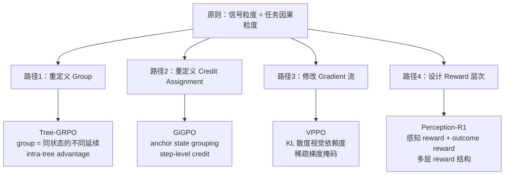

# RL 信号粒度与任务因果结构匹配原则

> **元命题**：RL 的监督信号（group 定义 / credit assignment / reward 粒度 / gradient 掩码）的粒度和结构，应该与任务的**最小有意义因果单元**对齐——而不是与"实现方便性"对齐。
>
> 这是 2025-2026 年 LLM RL 领域四篇独立论文各自发现、共同印证的方法论突破。

---

## 一、四个独立印证

四篇论文在不同任务域、不同技术路线下，各自发现了同一个根本问题，并给出了同一个方向的解法：

| 论文 | 任务域 | 问题 | 解法 | 信号粒度对齐到 |
|------|--------|------|------|--------------|
| **Tree-GRPO**（ICLR 2026）| Agent RL | GRPO 的 group = 同一 prompt 的独立采样，无法对比不同决策路径的质量 | 树搜索 rollout：group = 同一状态的不同延续；intra-tree advantage = step-level preference signal | **任务状态空间**（每个 Agent 步骤）|
| **GiGPO / Long-Horizon CA**| Agent RL | 长 horizon 轨迹的 outcome reward 无法指向具体步骤 | anchor state grouping：在共享关键状态的轨迹子集中计算 advantage | **anchor state**（任务关键决策点）|
| **VPPO** | 多模态 RL | GRPO 的均匀梯度广播给所有 token，视觉感知 token 被稀释 | token-level 视觉依赖度（KL 散度）作为梯度掩码 | **视觉依赖 token**（真正"在看图"的时刻）|
| **Perception-R1** | 多模态 RL | outcome reward 无法约束感知过程，72% 错误源于感知但不受 RL 优化 | 显式视觉感知 reward（judging LLM 评估 annotation 一致性）| **感知层**（推理因果链的上游） |

---

## 二、统一理论框架

### 2.1 问题的根本来源

标准 GRPO 的设计假设是：**同一 prompt 的不同 rollout，它们的差异能反映哪种回答策略更好**。

这个假设在以下条件下成立：
- 任务是 single-step（不涉及时序决策）
- 所有 token 对最终结果的贡献均匀
- modality 是同质的（纯文本）

但现实中，**LLM RL 的主战场恰好违反这三个条件**：

```
Agent RL：多步决策，每步都有独立的因果贡献
多模态 RL：感知 + 推理两个异质阶段
长 horizon RL：信用分配跨越数十步
```

### 2.2 统一原则表述

$$\text{有效监督信号} = f(\text{信号粒度} \leftrightarrow \text{任务因果粒度})$$

当信号粒度 **粗于** 任务因果粒度时：
- 多个不同质量的步骤/token 共享同一个信号
- 模型无法区分"哪里做对了"/"哪里做错了"
- 产生：语言捷径、reward hacking、behavior collapse

当信号粒度 **细于** 任务因果粒度时：
- 过拟合到噪声（每个 token 的信号相互独立，失去上下文）
- 计算代价指数增长
- 产生：梯度不稳定、训练发散

**最优点**：信号粒度 = 任务因果粒度（最小有意义单元）

### 2.3 各任务类型的最小有意义单元

| 任务类型 | 最小有意义因果单元 | 当前标准方法的粒度 | 差距 |
|----------|-------------------|------------------|------|
| 单步推理（数学/代码）| 推理步骤 | trajectory | 1 层 |
| 多步 Agent | Agent action（工具调用） | trajectory | 多层 |
| 多模态推理 | 视觉感知 pivot | token | 中 |
| 长 horizon Agent | anchor state | trajectory | 多层 |
| 对话对齐（RLHF）| preference pair | pair | ≈ 对齐 |

---

## 三、工程实现路径

四篇论文提供了四种可组合的工程实现：



### 组合使用的逻辑

这四条路径**正交**，可以叠加：

- **Tree-GRPO + GiGPO**：树结构提供步骤级 advantage，anchor state 进一步精确 credit
- **VPPO + Perception-R1**：VPPO 修 gradient 流（token 粒度），Perception-R1 修 reward 设计（感知层），两者作用层次不同
- **Tree-GRPO + VPPO**：Agent rollout 用树搜索，每步内的 token 更新用 VPPO 的视觉依赖掩码

---

## 四、为什么现在才被发现？

### 时机原因

1. **任务复杂度升级**：早期 LLM RL 主要是单轮对话对齐（RLHF），信号粒度问题不严重；随着 Agent RL / 多模态 RL 兴起，任务因果链变长、变异质，粒度问题才成为瓶颈
2. **scale 掩盖了粒度问题**：更大的模型能用更强的语言先验掩盖感知缺陷，单步 reward hacking 在大模型上不那么明显
3. **可验证 reward 普及**：RLVR 让研究者能精确测量"什么被优化了"，从而发现"什么没被优化"（感知缺陷在没有 McNemar 这类统计工具前难以察觉）

### 认知跃迁

**2022–2023**：RL 对齐（RLHF）— 信号粒度 = preference pair，和任务粒度基本对齐  
**2024**：单步推理 RL（GRPO，MATH/代码）— 发现 group 内方差问题（全0/全1），但仍是 trajectory 粒度  
**2025–2026**：多步 Agent RL + 多模态 RL — 粒度失配成为主要瓶颈，四路解法同时涌现

这是一个**技术范式的认知临界点**：当任务复杂度超过当前信号粒度的表达能力，新的解法范式集体出现。

---

## 五、对 Vault 的意义

### 作为 W 层（Wisdom）的价值

这个原则不是描述某篇论文，而是从多篇论文中**抽象出的方法论**，直接可用于：

1. **评估新论文**：看到新的 RL 方法时，先问"它的信号粒度是否与任务因果结构对齐？"
2. **设计自己的 RL 训练**：在开始实现之前，先画出任务因果链，确认 reward/group/credit assignment 的粒度设置
3. **诊断 RL 训练失败**：训练不收敛时，检查是否存在信号粒度失配（粗信号 + 复杂因果链 = 训练失败的常见原因）

### 面试武器化

**Q: 为什么 GRPO 在 Agent 任务上效果不如预期？**
A: 信号粒度失配。GRPO 的 group = 同一 prompt 的 trajectory，但 Agent 任务需要 step-level 因果反馈。Tree-GRPO 把 group 定义为同一状态的不同延续，GiGPO 在 anchor state 级别做 credit assignment，两者都是向"任务因果粒度"对齐的解法。

**Q: 多模态 RLVR 和文本 RLVR 最本质的区别？**
A: 任务因果链的异质性。文本任务的因果链是"推理 → 输出"，信号粒度在 trajectory 层基本够用；多模态任务是"感知 → 推理 → 输出"，outcome reward 无法约束上游的感知过程，必须在感知层单独设计信号（Perception-R1）或在 token 粒度识别视觉依赖度（VPPO）。

---

## 推荐阅读

1. **[[Tree-GRPO-Tree-Search-LLM-Agent-RL|Tree-GRPO（ICLR 2026）]]** — 路径1：重定义 Group
2. **[[GiGPO-Group-in-Group-Policy-Optimization|GiGPO（NeurIPS 2025）]]** — 路径2：anchor state credit（独立深度笔记）；综合全景见 [[Long-Horizon-Credit-Assignment专题|Long-Horizon CA 专题]]
3. **[[VPPO-Visually-Perceptive-Policy-Optimization|VPPO]]** — 路径3：视觉依赖 token 梯度掩码
4. **[[Perception-R1-Visual-Perception-Reward-RLVR|Perception-R1]]** — 路径4：显式感知 Reward
5. **[[HiPER-Hierarchical-Plan-Execute-RL-Credit-Assignment|HiPER（ICML 2026）]]** — 路径5：segment-level 信号粒度（hierarchical advantage estimation）——planner 决策的因果单元是整个 subgoal 执行 segment，而非单步 action；HAE 把信号粒度对齐到这个因果结构
6. **[[RAGEN-StarPO-Multi-Turn-RL-Self-Evolution|RAGEN & StarPO]]** — "信号粒度失配 → 训练崩溃"的直接实证：outcome reward 无法驱动 step-level reasoning（Echo Trap = trajectory-level 信号无法区分好坏步骤），是本原则的反面案例
7. **[[Reward-Design-2026-Panorama|Reward Design 2026 全景]]** — 更广泛的 Reward 设计视角
8. **[[AI/LLM/RL/GRPO/GRPO-Improvement-Panorama-2026|GRPO Improvement Panorama]]** — 本原则在 GRPO 视角的对应位置（Token/Diversity维度）
