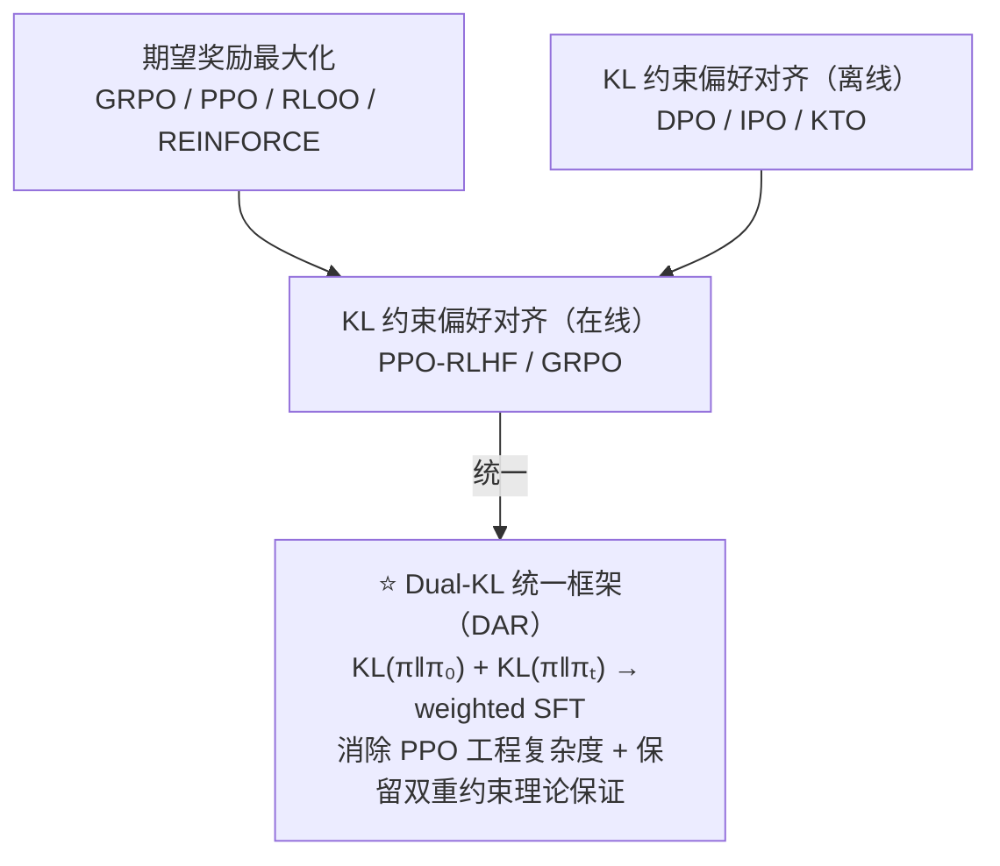

# DAR: Dual-Regularized Advantage Regression

> arXiv:2602.11523 | ICLR 2026 | ★★★★★
> **一句话**：把 RLHF 的两个独立正则化（KL 防 hacking + PPO clip 稳定训练）统一成一个 Dual-KL 框架，推导出 weighted SFT loss，消除 PPO 的工程复杂度，结果超越 GRPO +7.27%。

---

## 一、问题诊断：RLHF 的两个独立创可贴

### 1.1 两大核心挑战

**挑战 1：Reward Hacking**
- 症状：policy 学会让 reward model 打高分，而不是真正满足人类偏好
- 现有解法：KL-divergence 约束 π 不偏离参考策略 π₀（SFT 模型）

$$\mathcal{L}_{hacking} = -r(y) + \beta \cdot KL(\pi \| \pi_0)$$

**挑战 2：不稳定优化**
- 症状：PPO 的 policy ratio ρ = π(y|x)/π_t(y|x) 在大更新时剧烈变化，导致训练崩溃
- 现有解法：clip 机制，约束 ρ 在 [1-ε, 1+ε] 范围内

$$\mathcal{L}_{stable} = -\min(\rho \cdot A, \text{clip}(\rho, 1\pm\epsilon) \cdot A)$$

### 1.2 当前方案的问题

两个问题用**两套独立机制**处理：
- KL 约束 → 针对 π 与 π₀ 的偏离（防 hacking）
- Clip → 针对 π 与 π_t 的偏离（稳定训练）

这两个约束在数学上没有统一，工程上需要同时维护多个超参（β 和 ε），调参困难，理论上也没有保证两者的交互是最优的。

---

## 二、DAR 的统一框架

### 2.1 关键洞察：两个 KL 的等价性

**核心推导**：把 PPO 的 clip 机制**改写为对 π_t 的 KL 约束**。

当 |ρ - 1| 较小时：KL(π || π_t) ≈ ½ E[(ρ - 1)²]

因此 clip 约束近似等价于 KL(π || π_t) ≤ δ。

两个约束可以统一写成 **Dual-KL**：

$$\mathcal{L}_{DAR} = -r(y) + \beta_0 \cdot KL(\pi \| \pi_0) + \beta_t \cdot KL(\pi \| \pi_t)$$

其中：
- β₀ 控制对参考策略 π₀ 的偏离（防 reward hacking）
- β_t 控制对当前策略 π_t 的偏离（稳定训练）

### 2.2 Weighted SFT 推导

对 Dual-KL 目标求最优解（闭式解）：

$$\pi^* \propto \pi_0^{\lambda_0} \cdot \pi_t^{\lambda_t} \cdot \exp\left(\frac{r(y)}{\beta_0 + \beta_t}\right)$$

其中 λ₀ = β₀/(β₀ + β_t)，λ_t = β_t/(β₀ + β_t)。

**关键简化**：训练时用 advantage A 替代 r(y)，取对数近似后得到：

$$\mathcal{L}_{DAR} = -\sum_{t} w_t \cdot \log \pi(y_t | y_{<t}, x)$$

每个 token 的权重 w_t 包含两项：
- λ₀ 项：来自 π₀ 的 importance weight（防 hacking 贡献）
- λ_t 项：来自 π_t 的 importance weight × exp(A)（稳定优化贡献）

**结果**：这是一个 **weighted SFT loss**——不需要 PPO rollout，不需要 critic，直接优化 weighted cross-entropy。

### 2.3 为什么这是"RL-free"

- 不需要 PPO 的 on-policy rollout：使用 offline/少量 rollout 数据
- 不需要 critic 网络：advantage 用 GRPO/RLOO 等 group-based 估计
- 实现等价于 weighted SFT：标准 cross-entropy，只是每个 token 权重不同
- 理论保证：等价于在 Dual-KL 约束下最优化 reward，不是启发式

---

## 三、与现有方法的统一视角

| 方法 | 等价约束 | 特点 |
|------|---------|------|
| PPO-RLHF | KL(π||π₀) + clip(ρ) | 两套机制，复杂工程 |
| GRPO/RLOO | KL(π||π₀) only | 缺稳定性约束 |
| DPO | KL(π||π₀) closed-form | 离线，无法在线更新 |
| **DAR** | **Dual-KL(π||π₀) + KL(π||π_t)** | **统一推导，weighted SFT 实现** |

**关键统一洞察**：
- GRPO 只有 β₀（防 hacking），缺少 β_t（训练稳定性）→ 方差大
- PPO 的 clip 是 β_t 的隐式近似，但和 β₀ 没有统一的理论
- DAR 明确地同时优化两个约束，并用推导而非启发式实现

### 3.1 Reference Resets 的理论解释

**Reference Resets**（定期把 π₀ 更新为当前 π_t）在 Dual-KL 框架下有了清晰解释：

当 π_t 离 π₀ 很远时，β₀ 的约束变得过松（因为 π₀ 已经是"遥远的过去"），Reference Reset 相当于动态更新 π₀ 基准点，重新激活 β₀ 约束的防 hacking 效力。这解释了为什么 Reference Resets 能隐式提高稳定性——它实际上是在做动态 Dual-KL 平衡。

---

## 四、实验结果

### 4.1 RLHF 场景（对话对齐）

GPT-judged win rate vs reference policy：
- PPO-RLHF：baseline
- GRPO：85.15%
- **DAR：92.42%（+7.27% over GRPO）**
- LC%（Length-controlled win rate）：DAR 在控制输出长度后优势更明显

### 4.2 Verifiable Rewards 场景（数学推理）

- **Format hacking 防御**：GRPO 有时会压缩推理 token 成"格式化答案"最大化 reward；DAR 的 β₀ 约束防止偏离 SFT 分布，避免了这种 exploitation
- **LLM-as-Judge 场景**：防止 policy 学会让 judge 打高分的 prompt exploitation

### 4.3 稳定性

- Learning curve 更平滑（相比 GRPO 的 variance spike）
- 整个训练过程中 KL divergence 有界（双重约束保证）

---

## 五、批判性评估

### 优点

- **理论严格**：从 Dual-KL 目标闭式推导，不是启发式设计
- **实现简单**：weighted SFT，不需要 PPO 的复杂工程（critic/GAE/多超参）
- **统一视角价值**：解释了 Reference Resets 为什么有效（之前没有理论解释）
- **ICLR 2026**：顶会验证，理论正确性有评审背书

### 局限

- **λ₀/λ_t 超参仍需调**：虽然减少了 ε，但新增了两个 KL 权重
- **Advantage 估计仍是前提**：DAR 只消除 PPO，但 group rollout 仍然必须
- **Off-policy 误差分析缺失**：weighted SFT 在 off-policy 数据上的理论误差界未给出
- **极端任务（Agent long-horizon）**：验证场景主要是对话和数学，长 horizon agent 任务未覆盖

### 工程判断

**强推（对话对齐场景）**：DAR 是 PPO 的严格替代，实现更简单，结果更好。

**谨慎（Verifiable Rewards）**：主要优势是防 format hacking，不一定在纯粹推理准确率上超过 GRPO（尤其是当 GRPO 已经充分调参时）。

**建议组合**：DAR + GiGPO（step-level credit assignment）可能是 Agent RL 场景的强组合——DAR 解决优化层稳定性，GiGPO 解决信用分配层精度，两者正交。

---

## 六、在 RL 目标函数地图中的位置

**填补了什么空白**：之前在线对齐只有 PPO/GRPO，但两者都是"两套机制的拼接"；DAR 是第一个在理论上统一两套机制的方案，同时让实现反而更简单。

---

## See Also

- [[AI/3-LLM/RL/算法/GRPO 深度理解|GRPO]] — DAR win rate 超越 GRPO +7.27%；GRPO 缺少 β_t 稳定性约束
- [[AI/3-LLM/RL/算法/IPO-Identity-Preference-Optimization|IPO]] — 同样防 DPO/RLHF collapse，但用 MSE 目标（离线）；DAR 是在线版
- [[AI/3-LLM/RL/算法/LAD-Learning-Advantage-Distribution|LAD]] — f-divergence 最一般框架；DAR 用 Dual-KL（f-div 特例），LAD 更一般但 DAR 更实用
- [[AI/2-Agent/Agentic-RL/Long-Horizon-Credit-Assignment专题|Long-Horizon Credit Assignment 专题]] — DAR 解决优化稳定性（训练层），credit assignment 解决精度（信号层），两者正交

*写作时间：2026-02-28 07:52 | arXiv:2602.11523 | ICLR 2026 | ★★★★★*
