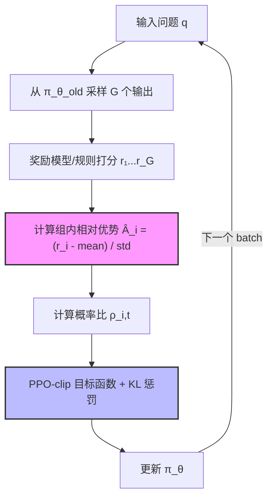

# GRPO 深度理解

> **Brief**：GRPO（Group Relative Policy Optimization）是 DeepSeekMath 提出的 RL 算法，无需单独 Critic 网络，通过同组生成结果的相对对比计算优势值。是 DeepSeek-R1 推理能力的核心训练机制，训练成本比 PPO 低约 50%。
>
> 来源：DeepSeekMath, arXiv:2402.03300, Sec. 3

---

## 1. 核心动机：为什么不用 PPO？

PPO（Proximal Policy Optimization）是 RLHF 的标准算法，但在 LLM 训练中有一个根本性代价：**需要同时维护 4 个模型**：
- $\pi_\theta$（策略模型，在训练）
- $\pi_{\text{ref}}$（参考模型，冻结）
- $V_\phi$（Critic/价值模型，预测基线）
- $r_\phi$（奖励模型）

**GRPO 的核心洞察**：在数学推理这类任务中，我们可以用"组内相对排名"代替价值网络对基线的估计。

> 来源：DeepSeekMath arXiv:2402.03300, Sec. 3.1：We propose GRPO... eliminates the need for an additional critic model.

---

## 2. 算法步骤

### Step 1：分组采样（Group Sampling）

对每个问题 $q$，从当前策略 $\pi_\theta$ 采样 $G$ 个输出：

$$\{o_1, o_2, \ldots, o_G\} \sim \pi_{\theta_{\text{old}}}(\cdot \mid q)$$

$G$ 通常取 8~16（DeepSeekMath 用 $G=8$）。

> 来源：DeepSeekMath arXiv:2402.03300, Sec. 3.2

### Step 2：奖励打分

用奖励模型（或规则函数）对每个输出打分：

$$\{r_1, r_2, \ldots, r_G\}$$

数学题中通常用规则函数：正确 $r_i = 1$，错误 $r_i = 0$。

### Step 3：组内相对优势（Group Relative Advantage）

计算组内标准化优势值（这是 GRPO 区别于 PPO 的核心）：

$$\hat{A}_i = \frac{r_i - \text{mean}(\{r_j\}_{j=1}^G)}{\text{std}(\{r_j\}_{j=1}^G)}$$

**直觉**：不问"这个回答绝对上好不好"，而是问"这个回答在同组里比平均高多少"。mean 是组内基线，std 是归一化因子。

**数值示例**：
$G=4$，奖励 $\{1, 0, 1, 0\}$，则 mean=0.5, std=0.53
正确输出：$\hat{A} = (1-0.5)/0.53 = +0.94$
错误输出：$\hat{A} = (0-0.5)/0.53 = -0.94$

> 来源：DeepSeekMath arXiv:2402.03300, Eq. (3)

### Step 4：策略更新目标函数

$$\mathcal{L}_{\text{GRPO}}(\theta) = \mathbb{E}_{q, \{o_i\}} \left[ \frac{1}{G} \sum_{i=1}^{G} \frac{1}{|o_i|} \sum_{t=1}^{|o_i|} \min\left( \rho_{i,t}(\theta)\, \hat{A}_i,\ \text{clip}(\rho_{i,t}(\theta), 1{-}\epsilon, 1{+}\epsilon)\, \hat{A}_i \right) - \beta\, \mathbb{D}_{\text{KL}}[\pi_\theta \| \pi_{\text{ref}}] \right]$$

其中：
- $\rho_{i,t}(\theta) = \frac{\pi_\theta(o_{i,t} \mid q, o_{i,<t})}{\pi_{\theta_{\text{old}}}(o_{i,t} \mid q, o_{i,<t})}$：概率比（importance sampling ratio）
- $\text{clip}(\cdot, 1{-}\epsilon, 1{+}\epsilon)$：PPO-clip，防止策略步子太大（$\epsilon=0.2$）
- $\beta\, \mathbb{D}_{\text{KL}}[\pi_\theta \| \pi_{\text{ref}}]$：KL 散度惩罚，防止偏离参考模型（$\beta=0.04$，DeepSeekMath）

**KL 散度展开**：

$$\mathbb{D}_{\text{KL}}[\pi_\theta \| \pi_{\text{ref}}] = \frac{\pi_\theta(o \mid q)}{\pi_{\text{ref}}(o \mid q)} - \log \frac{\pi_\theta(o \mid q)}{\pi_{\text{ref}}(o \mid q)} - 1$$

> 来源：DeepSeekMath arXiv:2402.03300, Eq. (4)-(5)

---

## 3. GRPO 算法流程图



---

## 4. GRPO vs PPO 对比

| 维度 | PPO | GRPO |
|------|-----|------|
| 价值网络 | 需要独立 Critic 模型 | ❌ 无需，用组内统计替代 |
| 显存占用 | 4个模型（Actor+Critic+Ref+RM） | 3个模型（Actor+Ref+RM） |
| 训练稳定性 | Critic 训练可能不稳定 | 相对更稳定 |
| 适用场景 | 通用 RL | 有明确对错的任务（数学/代码） |
| 基线估计 | 价值网络学习 | 组内均值（更简单，但方差更大） |

> 来源：DeepSeekMath arXiv:2402.03300 Table 2：GRPO 在数学推理上超越 PPO，同时节省约 50% 计算资源。

---

## 5. 关键超参

| 超参 | 推荐值 | 作用 |
|-----|--------|------|
| $G$（组大小） | 8~16 | 越大基线越准，但显存越贵 |
| $\epsilon$ | 0.2 | PPO clip 范围，控制每步更新幅度 |
| $\beta$ | 0.04（DeepSeekMath）| KL 惩罚强度，越大越保守 |
| 学习率 | 1e-6 ~ 1e-5 | RL 阶段比 SFT 小1-2个数量级 |

> 来源：DeepSeekMath arXiv:2402.03300, Sec. 4 (Experimental Setup)；DeepSeek-R1 arXiv:2501.12948 用了类似超参范围

---

## 🔧 落地应用

### 直接可用场景
- **数学推理训练**：有明确判题标准（正确/错误），GRPO 是首选（DeepSeek-R1 就是这么做的）
- **代码生成 RL**：单元测试通过/失败 = 天然奖励函数，直接套用
- **工具调用 RL**：工具返回结果有确定性 → 用规则函数打分，GRPO 训练

### 工程实现要点（TRL 框架）

```python
from trl import GRPOConfig, GRPOTrainer

config = GRPOConfig(
    num_generations=8,        # G，组大小
    max_new_tokens=512,       # 最大生成长度
    beta=0.04,                # KL 散度惩罚系数
    epsilon=0.2,              # PPO clip 范围
    learning_rate=1e-6,
)
```

> 来源：HuggingFace TRL GRPO Trainer 文档 https://huggingface.co/docs/trl/grpo_trainer

### 常见坑
- **奖励方差太大**：组内全对或全错时 std→0，优势值分母炸掉。解决：加平滑项或检查奖励设计
- **KL 散度爆炸**：$\beta$ 太小时策略飘得很远，生成乱序。解决：监控 KL，$\beta$ 调大
- **组大小 G 的显存**：$G=16$ 意味着一次生成 16 个回答，注意 OOM。解决：gradient_checkpointing=True

### 面试高频问法

- Q: GRPO 和 PPO 的最大区别是什么？
  A: GRPO 去掉了独立的 Critic（价值网络），用同一问题的多个采样结果组内均值作为基线，优势值 $\hat{A}_i = (r_i - \text{mean})/\text{std}$，节省约50%计算资源。代价是只适合有明确对错的任务。

- Q: 为什么 GRPO 的优势值要除以 std 归一化？
  A: 不归一化的话，不同问题的奖励尺度差异很大（简单题全对/全错、难题混合），导致梯度不稳定。归一化后统一量纲，不同批次可比。

---

## 💡 启发与思考

### So What？
GRPO 是"极简主义 RL"的典范：PPO 用复杂的价值网络学基线，GRPO 说"我用统计量代替神经网络"，效果还更好。**这说明：在特定约束下，简单的统计推断往往胜过复杂的神经估计。**

对老板的启示：设计 RL 奖励函数时，优先考虑有明确对错的任务（代码/数学/工具调用），这时 GRPO 比 PPO 更省资源，更稳定。

### 局限与未解问题
- **奖励稀疏问题**：开放性对话任务没有明确对错，GRPO 难以直接用
- **组大小的选择**：$G$ 太小基线估计方差大，$G$ 太大显存贵，最优 $G$ 与任务强相关
- **长链推理中的信用分配**：每个 token 共享同一个组级优势值，长回答中早期 token 的信用分配不准确（→ 见 [[AI/3-LLM/RL/算法/Blockwise-Advantage-Estimation]] 对此的改进）

### 脑暴拓展
- 如果把 GRPO 的"组内相对"思路用到 Reward Model 训练上，是否可以做 Pairwise GRPO？
- GRPO + 多轮对话：每轮结束才有奖励，中间 token 怎么分信用？→ 见 [[AI/2-Agent/Agentic-RL/CM2-Checklist-Rewards-Multi-Turn-Tool-Use-RL]]
- 极端情况：$G=2$ 时 GRPO 退化为什么？（提示：与 DPO 有联系）

> 🔗 See also:
> - [[AI/3-LLM/RL/算法/PPO 原理]] — GRPO 去掉了 PPO 的 Critic，对比学习两者
> - [[AI/3-LLM/RL/算法/Blockwise-Advantage-Estimation]] — 解决 GRPO 长序列信用分配问题
> - [[AI/2-Agent/Agentic-RL/CM2-Checklist-Rewards-Multi-Turn-Tool-Use-RL]] — 多轮 RL 的奖励设计
> - [[AI/3-LLM/RL/算法/QeRL-Quantization-Enhanced-RL]] — GRPO 在量化环境下的稳定性
>
> 🤖 **GRPO 在 Agent 场景的根本性改造**（理论 → 应用的完整链）：
> - [[AI/2-Agent/Agentic-RL/GiGPO-Group-in-Group-Policy-Optimization|GiGPO（NeurIPS 2025）]] — GRPO 在 Agent 训练的核心问题：所有 step 共享 episode-level advantage。GiGPO 用 Anchor State Grouping 实现 step-level credit assignment，内存等于 GRPO
> - [[AI/2-Agent/Agentic-RL/Tree-GRPO-Tree-Search-LLM-Agent-RL|Tree-GRPO（ICLR 2026）]] — 把 GRPO 的线性 rollout 替换为树搜索，共享前缀节省 1/4 预算，双层 advantage（intra-tree + inter-tree）
> - [[AI/2-Agent/Agentic-RL/Multi-Agent-RL-训练专题|Multi-Agent RL 训练专题]] — GRPO 的 grouping 假设在多 agent 场景 break down（不同 agent 有不同 prompt/role），MAGRPO/AT-GRPO 的专门修复方案
> - [[AI/2-Agent/Agentic-RL/TSR-Trajectory-Search-Rollouts-Multi-Turn-RL|TSR（arXiv:2602.11767，ICML 2026）]] — GRPO 的"采样 G 条 rollout"策略假设 rollout 质量均等；TSR 指出 rollout 质量是 multi-turn RL 的真正瓶颈——用训练时树搜索保证每个 rollout 都在当前最优动作路径上，+15% 效果
> - [[AI/2-Agent/Agentic-RL/MIG-Step-Marginal-Information-Gain-Credit-Assignment|MIG（arXiv:2602.01034）]] — GRPO 的 episode-level reward 问题延伸：用信息论量化每步的边际信息增益作为 dense reward，Monotonic Watermark 防止"先降后升"的 reward hacking
> - [[AI/2-Agent/Agentic-RL/SeeUPO-Sequence-Level-Agentic-RL-Convergence-Guarantees|SeeUPO（arXiv:2602.06554）]] ⚠️ **重要理论边界**：正式证明 GRPO 的 variance normalization（除以 σ）在 multi-turn contextual bandit 场景中**破坏收敛性**（不可能定理）；单轮任务 GRPO 仍有收敛保证，多轮 Agent 训练需换 SeeUPO（逆序更新 + 无 variance norm）

---

## 📚 推荐阅读

### 原始论文
- [DeepSeekMath: Pushing the Limits of Mathematical Reasoning in Open Language Models](https://arxiv.org/abs/2402.03300) — GRPO 原始提出，Sec. 3 是核心，必读 ⭐⭐⭐⭐⭐
- [DeepSeek-R1: Incentivizing Reasoning Capability in LLMs via RL](https://arxiv.org/abs/2501.12948) — GRPO 大规模实战，证明推理能力可 RL 激发 ⭐⭐⭐⭐⭐

### 深度解读
- [HuggingFace TRL GRPO Trainer 文档](https://huggingface.co/docs/trl/grpo_trainer) — 官方实现文档，含参数详解 ⭐⭐⭐⭐
- [Understanding GRPO](https://huggingface.co/blog/putting-rl-back-in-rlhf) — HF Blog：把 RL 放回 RLHF ⭐⭐⭐⭐

### 实践资源
- [verl GRPO 训练示例](https://verl.readthedocs.io/en/latest/examples/grpo.html) — 大规模 GRPO 训练框架 ⭐⭐⭐⭐
- [OpenR1 项目](https://github.com/huggingface/open-r1) — 复现 DeepSeek-R1 的开源实现，含 GRPO ⭐⭐⭐⭐⭐

### 代码手撕（理论 → 代码）
- [[Projects/MA-RLHF/lc8-GRPO/lc8-01-GRPO-手撕实操|GRPO-手撕实操]] — **强烈推荐**：从零手写 GRPO 训练循环（advantage 计算/clip/group normalization），MA-RLHF 项目代码注解 ⭐⭐⭐⭐⭐
- [[Projects/MA-RLHF/lc8-GRPO/lc8-02-GRPO-完整Notebook实现|GRPO 完整 Notebook 实现]] — **端到端验证**：组采样 + advantage 归一化 + KL 项完整 Notebook，验证理论细节
- [[Projects/MA-RLHF/lc8-GRPO/lc8-04-GRPO-KL散度三种近似|GRPO KL 散度三种近似]] — k1/k2/k3 Schulman 近似实现对比：精度 vs 计算成本 tradeoff
- [[Projects/MA-RLHF/lc8-PPO/lc8-01-PPO-手撕实操|PPO-手撕实操]] — PPO actor-critic 实现对照，理解 GRPO 为什么能去掉 critic
- [[Projects/MA-RLHF/MA-RLHF-手撕实操-系列索引|MA-RLHF 手撕实操系列索引]] — 架构/推理/Infra/RL 全链路代码实操总索引
