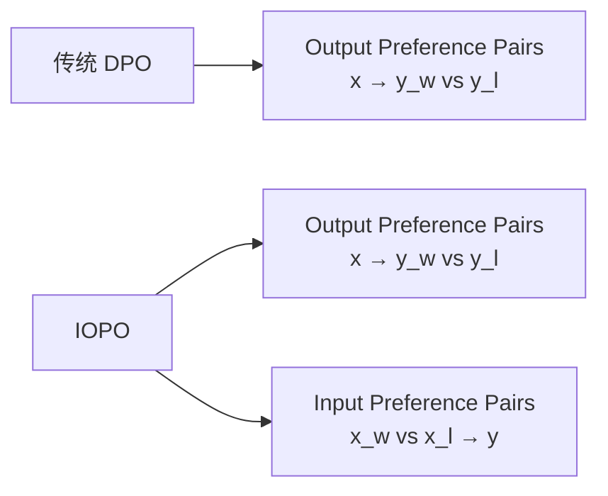

# IOPO: Input-Output Preference Optimization

> **核心一句话**：DPO 只看"哪个输出更好"；IOPO 同时问"哪个输入指令更应该被遵守"——双向偏好信号让模型对复杂指令的理解更深。

## 动机

复杂指令遵循（Complex Instruction Following）的核心困难：指令里包含多个约束（格式+内容+风格+限制），模型容易遗漏或错误优先级排序。

**DPO 的盲点**：DPO 训练的是"给定指令，哪个回答更好"——但它从来不质疑"这条指令的哪些部分最重要"。当指令本身复杂时，模型可能满足了表面要求但忽略了深层约束。

## 核心创新

**Input Preference Pairs 的含义**：
- `x_w`：指令描述清晰、约束完整、优先级明确的版本
- `x_l`：指令描述模糊、约束缺失、优先级混乱的版本
- 训练信号：让模型学会"什么样的指令意图应该被认真对待"

**Trace Benchmark**（配套数据集）：
- 120K 训练数据（复杂多约束指令场景）
- 1K 评测数据（in-domain + out-of-domain）
- 约束类型覆盖：格式/内容/风格/长度/角色等

## 实验结果

| 方法 | In-domain | Out-of-domain |
|------|-----------|--------------|
| SFT | baseline | baseline |
| DPO | +0% | +3.13% vs IOPO |
| **IOPO** | **+8.15% vs SFT** | **+6.29% vs SFT / +3.13% vs DPO** |

OOD 提升更大，说明 input preference 学到的是更通用的指令理解能力。

## 局限

- Input preference pairs 的构建需要额外标注成本
- 目前主要在 NLP 任务验证，Agent 多步指令跟随效果待验证
- 是否能泛化到更长的多轮对话中？（LLMs Get Lost 论文指出多轮退化问题，IOPO 未解决）

## 落地应用

- **复杂提示工程**：模型训练时加入 IOPO，使其对细粒度指令约束更敏感
- **Agent 工具调用**：多条件约束的工具参数填充场景（"用中文/不超过100字/以列表形式"）
- **SFT 替代**：比纯 SFT 显著更好，且比 DPO 更懂指令意图

## See Also

- [[AI/3-LLM/RL/算法/GRPO 深度理解|GRPO]] — 另一主线：不从偏好对学习，而是组内相对优势
- [[AI/3-LLM/RL/实践/RLHF-工程全栈|RLHF 工程全栈]] — 偏好优化的完整技术路线
- [[AI/2-Agent/Fundamentals/Agent-Tool-Use|Agent Tool Use]] — 工具调用场景下复杂指令跟随的实际挑战
