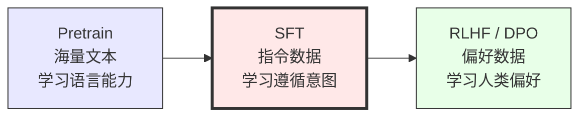
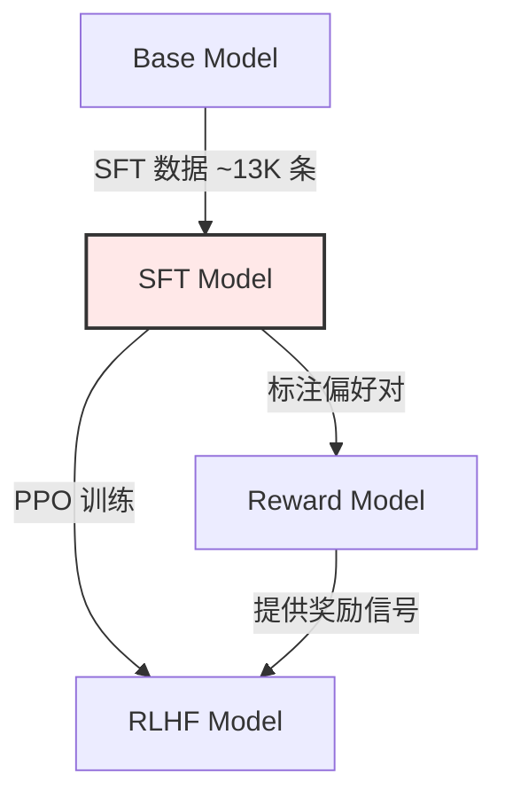

# SFT（Supervised Fine-Tuning）原理与实践

> **Brief**：SFT 是 LLM 三阶段训练（Pretrain → SFT → RLHF/DPO）的关键中间环节。预训练模型是一个强大的文本补全器，但不会"听话"——SFT 用高质量的 instruction-response 对微调，让模型学会遵循人类意图。InstructGPT 论文（arXiv:2203.02155）奠定了这一范式。
>
> 来源：InstructGPT arXiv:2203.02155; LIMA arXiv:2305.11206

---

## 1. SFT 的本质：从文本补全到指令遵循

### 为什么需要 SFT？

预训练模型（如 GPT-3 base）在海量文本上训练，学到了强大的语言能力，但它的行为是**补全文本**而非**回答问题**。

> 来源：InstructGPT arXiv:2203.02155, Sec. 1 明确指出 base model 的输出"不总是有帮助的、真实的、无害的"

```
用户输入: "请解释什么是 Transformer"

Base Model 可能输出:
  "架构，它是由 Google 在 2017 年提出的。Transformer 架构..."  ← 补全风格

SFT Model 输出:
  "Transformer 是一种基于自注意力机制的神经网络架构。
   它的核心创新是..."  ← 回答风格
```

### SFT 在三阶段训练中的位置



> 来源：InstructGPT arXiv:2203.02155, Figure 2 展示了完整的三阶段流程
>
> 🔗 See also: [[RLHF-DPO-2026-技术全景|RLHF-DPO 全景]] — SFT 之后的对齐阶段

---

## 2. SFT 的核心技术

### 2.1 数据格式

SFT 数据的基本格式是 **(instruction, response)** 对：

```json
{
  "instruction": "请用简单的语言解释量子纠缠",
  "input": "",
  "response": "量子纠缠是量子力学中一种奇特的现象..."
}
```

> 来源：Stanford Alpaca 定义了这种 instruction-input-response 三元组格式（https://github.com/tatsu-lab/stanford_alpaca）

#### 对话格式（ChatML）

```
<|im_start|>system
你是一个有帮助的 AI 助手。<|im_end|>
<|im_start|>user
请解释什么是 Transformer。<|im_end|>
<|im_start|>assistant
Transformer 是一种基于自注意力机制的神经网络架构...<|im_end|>
```

### 2.2 Loss Masking

**核心原则：只对 assistant 的回复计算 loss，不对 system/user 计算 loss。**

```python
def create_sft_labels(input_ids, tokenizer):
    """只对 assistant 回复部分计算 loss"""
    labels = input_ids.clone()
    
    # 找到所有 assistant 回复的 span
    assistant_spans = find_assistant_spans(input_ids, tokenizer)
    
    # 非 assistant 部分设为 -100（ignore_index）
    mask = torch.full_like(labels, -100)
    for start, end in assistant_spans:
        mask[start:end] = labels[start:end]
    
    return mask
```

> 来源：这是 InstructGPT 和后续所有 SFT 框架（TRL、LLaMA-Factory 等）的标准做法

**为什么要做 Loss Masking？**
- 如果对 user 输入也计算 loss，模型会学习"复读"用户的话
- System prompt 是固定模板，不需要学习
- 只学习"如何回复"，不学习"如何提问"

### 2.3 训练超参数

| 参数 | 典型值 | 说明 |
|------|--------|------|
| Learning Rate | 1e-5 ~ 5e-5 | 比预训练低 10-100 倍 |
| Epochs | 2-5 | 过多会过拟合 |
| Batch Size | 64-128 | 较大 batch 更稳定 |
| Max Seq Length | 2048-4096 | 视数据长度分布 |
| Weight Decay | 0.01-0.1 | 正则化 |
| Warmup Ratio | 0.03-0.1 | 占总步数的比例 |

> 来源：Alpaca 使用 lr=2e-5, epochs=3; InstructGPT 使用 lr=1.3e-5

---

## 3. LIMA 洞察：数据质量 >> 数据数量

LIMA（Less Is More for Alignment）是 SFT 领域最重要的实证研究之一。

> 来源：LIMA arXiv:2305.11206 (Zhou et al., Meta, 2023)

### 核心发现

**仅 1000 条精心筛选的高质量数据，就能让 LLaMA-65B 达到接近 GPT-4 级别的对话能力。**

| 实验 | 数据量 | 模型 | 效果 |
|------|--------|------|------|
| LIMA | 1,000 条 | LLaMA-65B | 接近 GPT-4（人类评估） |
| Alpaca | 52,000 条 | LLaMA-7B | 中等 |
| Vicuna | 70,000 条 | LLaMA-13B | 较好 |

> 来源：LIMA arXiv:2305.11206, Table 1 和 Figure 3

### LIMA 的"表面对齐假说"（Superficial Alignment Hypothesis）

> "A model's knowledge and capabilities are learnt almost entirely during pretraining, while alignment teaches it which subdistribution of formats should be used when interacting with users."
> — LIMA arXiv:2305.11206, Sec. 1

**核心含义**：SFT 不是在教模型新知识，而是在教模型"用什么格式输出已有知识"。这解释了为什么少量数据就够用——你不需要覆盖所有知识，只需要教会"回答的模式"。

### 数据质量的关键维度

```
高质量 SFT 数据的标准：
├── 多样性：覆盖不同任务类型（问答/摘要/翻译/创作/推理/代码）
├── 回复质量：详细、有结构、准确、有帮助
├── 格式一致性：统一的对话风格和 markdown 格式
├── 难度梯度：从简单到复杂都有覆盖
└── 无噪声：没有矛盾、错误、或低质量回复
```

> 🔗 See also: [[AI/3-LLM/SFT/LoRA|LoRA]] — 参数高效微调，SFT 数据量少时 LoRA 是首选

---

## 4. SFT 数据构造方法

### 4.1 人工标注（最贵但最好）

InstructGPT 使用了 40 名标注员，生成约 13,000 条高质量 SFT 数据。

> 来源：InstructGPT arXiv:2203.02155, Sec. 3.1

成本估算：
- 单条高质量标注：¥50-200（含审核）
- 5000 条数据集：¥25万-100万
- 建议：20% 预算用于标注，80% 用于审核和迭代

### 4.2 Self-Instruct（自动生成）

用 LLM 自己生成 instruction-response 对，然后过滤低质量样本。

> 来源：Self-Instruct arXiv:2212.10560 (Wang et al., 2022)

流程：
1. 用 175 条种子任务（人工编写）
2. 让 GPT-3 生成新的 instruction
3. 对每个 instruction 生成 response
4. 过滤：相似度去重 + 质量筛选
5. 产出 52K 条数据 → Alpaca 数据集

### 4.3 Evol-Instruct（进化式增强）

WizardLM 提出：让 LLM 逐步"进化"指令的复杂度。

> 来源：WizardLM arXiv:2304.12244

```
进化策略：
├── 增加约束 (Add Constraints)
├── 加深推理 (Deepening)
├── 具体化 (Concretizing)
├── 增加推理步骤 (Increase Reasoning Steps)
└── 扩展话题 (Breadth)

示例：
原始: "写一首诗"
进化: "用五言绝句的格式，以'春雨'为题，写一首表达游子思乡之情的诗，
       要求每句至少包含一个典故"
```

### 4.4 强模型蒸馏

用 GPT-4/Claude 等强模型生成 SFT 数据，蒸馏到小模型：

```python
# 用强模型生成多个候选，选最好的
responses = [strong_model.generate(prompt, temperature=0.7) for _ in range(3)]
best_response = quality_ranker(prompt, responses)
```

> Stanford Alpaca 就是用 GPT-3.5 text-davinci-003 生成的 52K 条数据

---

## 5. SFT 工程实践要点

### 5.1 Packing vs Padding

```
Padding: 每个样本独立，短样本补 PAD token
  → 浪费计算（PAD token 不参与 loss 但占显存和计算）

Packing: 多个样本拼接到一个序列中
  → 需要特殊的 attention mask 防止跨样本注意力
  → 训练效率提升 1.5-3x
```

### 5.2 NEFTune 正则化

在 embedding 上加噪声，简单但有效的防过拟合手段。

> 来源：NEFTune arXiv:2310.05914 (Jain et al., 2023)

```python
def neftune_forward(model, input_ids, noise_alpha=5):
    embeddings = model.embed_tokens(input_ids)
    dims = torch.tensor(embeddings.size(1) * embeddings.size(2))
    mag_norm = noise_alpha / torch.sqrt(dims)
    noise = torch.zeros_like(embeddings).uniform_(-mag_norm, mag_norm)
    return model.forward_from_embeddings(embeddings + noise)
```

### 5.3 全量微调 vs LoRA

| 方式 | 优势 | 劣势 | 适用场景 |
|------|------|------|---------|
| 全量微调 | 效果最好 | 显存大、易过拟合 | 数据量大（>50K）+ 显存充足 |
| LoRA | 高效、不易过拟合 | 效果略逊 | 数据量少（<10K）、资源有限 |
| QLoRA | 极致省显存 | 速度较慢 | 单卡微调大模型 |

> 🔗 See also: [[AI/3-LLM/SFT/LoRA|LoRA]] — 参数高效微调的详细原理

---

## 6. 参数高效微调（PEFT）方法综述

以下方法解决同一个核心问题：**如何在不更新全部参数的情况下高效微调大模型？**

| 方法 | 核心思路 | 参数量 | 效果 |
|------|---------|--------|------|
| LoRA | 低秩矩阵分解 | ~0.1% | ★★★★★ |
| Prefix Tuning | 在输入前加可学习前缀 | ~0.1% | ★★★ |
| Prompt Tuning | 在 embedding 层加软提示 | <0.01% | ★★★ |
| Adapter | 在 FFN 后插入小网络 | ~1% | ★★★★ |
| P-Tuning v2 | 每层加 prefix | ~0.1% | ★★★★ |
| BitFit | 只调 bias 项 | <0.1% | ★★ |

> 来源：以上方法的详细对比见知乎"大模型参数高效微调技术原理综述"系列
> - [综述（一）背景](https://zhuanlan.zhihu.com/p/635152813)
> - [综述（五）LoRA、AdaLoRA、QLoRA](https://zhuanlan.zhihu.com/p/636215898)
> - [综述（七）最佳实践](https://zhuanlan.zhihu.com/p/649755252)

完整系列链接：
- [综述（二）BitFit、Prefix Tuning、Prompt Tuning](https://zhuanlan.zhihu.com/p/635686756)
- [综述（三）P-Tuning、P-Tuning v2](https://zhuanlan.zhihu.com/p/635848732)
- [综述（四）Adapter Tuning 及其变体](https://zhuanlan.zhihu.com/p/636038478)
- [综述（六）MAM Adapter、UniPELT](https://zhuanlan.zhihu.com/p/636362246)

---

## 🔧 落地应用

### 什么时候做 SFT？

- **有了 base model，想让它"听话"**：这是 SFT 最核心的应用——将预训练模型转化为能遵循指令的助手
- **垂直领域定制**：医疗/法律/金融等领域，用领域专家标注的 SFT 数据让通用模型变成领域专家
- **格式控制**：需要模型输出 JSON/Markdown/特定模板时，SFT 是最直接的方式
- **多语言适配**：base model 以英文为主时，用中文 SFT 数据增强中文对话能力

### 数据量要求

| 场景 | 推荐数据量 | 关键 |
|------|-----------|------|
| 通用对话 | 1K-10K（高质量） | 多样性 > 数量（LIMA 洞察） |
| 垂直领域 | 5K-50K | 领域覆盖度要够 |
| 格式控制 | 500-2K | 格式一致性最重要 |
| 复杂推理 | 10K-100K | 需要高质量 CoT 数据 |

### SFT 与 RL 的配合

> 来源：InstructGPT arXiv:2203.02155 的完整流程



**关键认知**：
- SFT 教模型"怎么回答"，RLHF/DPO 教模型"什么是好的回答"
- SFT 是 RLHF 的必要前置——不先做 SFT 直接 RLHF 效果很差
- 但 SFT 也不能替代 RLHF：SFT 模型会"讨好式回答"（hallucination、过长回复），需要 RL 纠正

### 面试高频问法

- **Q: SFT 阶段为什么容易过拟合？如何缓解？**
  A: SFT 数据量通常只有几千到几万条（vs 预训练万亿 token），模型参数远大于数据量。缓解：控制 epochs（2-5）、低学习率（1e-5 ~ 5e-5）、NEFTune 正则化、LoRA 减少可训练参数、早停。

- **Q: 为什么要做 Loss Masking？**
  A: 只对 assistant 回复计算 loss。否则模型会学习复读 user 输入、过拟合 system prompt。

- **Q: LIMA 的核心发现是什么？**
  A: "表面对齐假说"——SFT 不是在教模型新知识，而是在教模型用什么格式输出。因此 1000 条高质量数据就足够，关键是多样性和回复质量。

---

## 💡 启发与思考

### So What？

SFT 揭示了一个深刻的认知：**大模型的能力和行为是可以解耦的**。预训练给了模型能力（知识、推理、语言），SFT 只需要极少数据就能改变行为模式。这就像一个博学的人，只需要告诉他"在这个场合应该怎么说话"，而不需要重新教他所有知识。

LIMA 的"表面对齐假说"进一步说明：**对齐不是一个知识问题，而是一个格式问题**。这对 Agent 设计的启示是——与其在每个 Agent 里微调所有知识，不如让 base model 共享知识，只在行为层做轻量定制。

### 局限与未解问题

- **SFT 数据的偏见会被放大**：如果标注数据有系统性偏见（如过于冗长、过于"政治正确"），模型会忠实学习这些偏见
- **SFT 不能纠正预训练的错误知识**：如果 base model 在预训练阶段学到了错误事实，SFT 通常无法修正——它只改变格式，不改变知识
- **SFT 与 RL 的最优切分点仍不明确**：哪些行为该用 SFT 教，哪些该用 RL 教？目前主要靠经验
- **多轮对话中的 SFT 退化**：模型在长对话后期回复质量下降，目前没有完美解决方案

### 脑暴拓展

- **SFT + LoRA 的多任务组合**：每个任务训练一个 LoRA adapter，推理时按需加载 → "MoE-LoRA" 思路（已有相关工作：MoLoRA）
- **LIMA 洞察的极限在哪？**：如果是 100 条数据呢？10 条？有没有一个数据量的下界？
- **SFT 数据能否全自动生成？**：Self-Instruct → Evol-Instruct → 未来是否可以完全闭环，人类只做最终质量把关？

> 🔗 See also:
> - [[AI/3-LLM/RL/DPO/DPO-TRL实践|DPO]] — SFT 之后的对齐方法，比 PPO 更简单
> - [[AI/3-LLM/RL/GRPO/GRPO 深度理解|GRPO]] — DeepSeek 的 RL 方法，SFT 模型是起点
> - [[AI/3-LLM/RL/PPO/PPO 原理|PPO]] — InstructGPT 使用的经典 RL 算法
> - [[AI/3-LLM/Frameworks/TRL/TRL 概述|TRL]] — HuggingFace 的训练框架，支持 SFT+DPO+PPO 全流程

---

## 📚 推荐阅读

### 原始论文
- [Training language models to follow instructions with human feedback (InstructGPT)](https://arxiv.org/abs/2203.02155) — SFT+RLHF 范式的奠基论文，必读中的必读 ⭐⭐⭐⭐⭐
- [LIMA: Less Is More for Alignment](https://arxiv.org/abs/2305.11206) — 证明 1000 条高质量数据足以对齐，颠覆"数据越多越好"的直觉 ⭐⭐⭐⭐⭐
- [Self-Instruct: Aligning Language Models with Self-Generated Instructions](https://arxiv.org/abs/2212.10560) — 自动生成 SFT 数据的开山之作 ⭐⭐⭐⭐
- [WizardLM: Empowering Large Language Models to Follow Complex Instructions](https://arxiv.org/abs/2304.12244) — Evol-Instruct 进化式数据增强 ⭐⭐⭐⭐
- [NEFTune: Noisy Embeddings Improve Instruction Finetuning](https://arxiv.org/abs/2310.05914) — 简单有效的 SFT 正则化技巧 ⭐⭐⭐⭐

### 深度解读
- [大模型参数高效微调技术原理综述（知乎系列）](https://zhuanlan.zhihu.com/p/635152813) — 最全面的中文 PEFT 技术综述 ⭐⭐⭐⭐⭐
- [Stanford Alpaca GitHub](https://github.com/tatsu-lab/stanford_alpaca) — 开源 SFT 的标杆项目，含完整数据和代码 ⭐⭐⭐⭐

### 实践资源
- [HuggingFace TRL SFTTrainer](https://huggingface.co/docs/trl/sft_trainer) — 最易用的 SFT 训练框架，支持 Packing/NEFTune/LoRA ⭐⭐⭐⭐⭐
- [LLaMA-Factory](https://github.com/hiyouga/LLaMA-Factory) — 国产全流程 LLM 微调框架，中文支持极好 ⭐⭐⭐⭐⭐
- [Axolotl](https://github.com/OpenAccess-AI-Collective/axolotl) — 灵活的 SFT 训练配置框架 ⭐⭐⭐⭐

### 代码手撕（理论 → 代码）
- [[AI/3-LLM/SFT/SFT-手撕实操|SFT-手撕实操]] — **必看**：从零实现 SFT 训练循环（数据格式化/loss mask/LoRA 集成），MA-RLHF 项目配套 ⭐⭐⭐⭐⭐
- [[AI/3-LLM/Infra/MA-RLHF-手撕实操-系列索引|MA-RLHF 手撕实操系列索引]] — SFT → PPO → GRPO → DPO 完整对齐链路代码总索引
