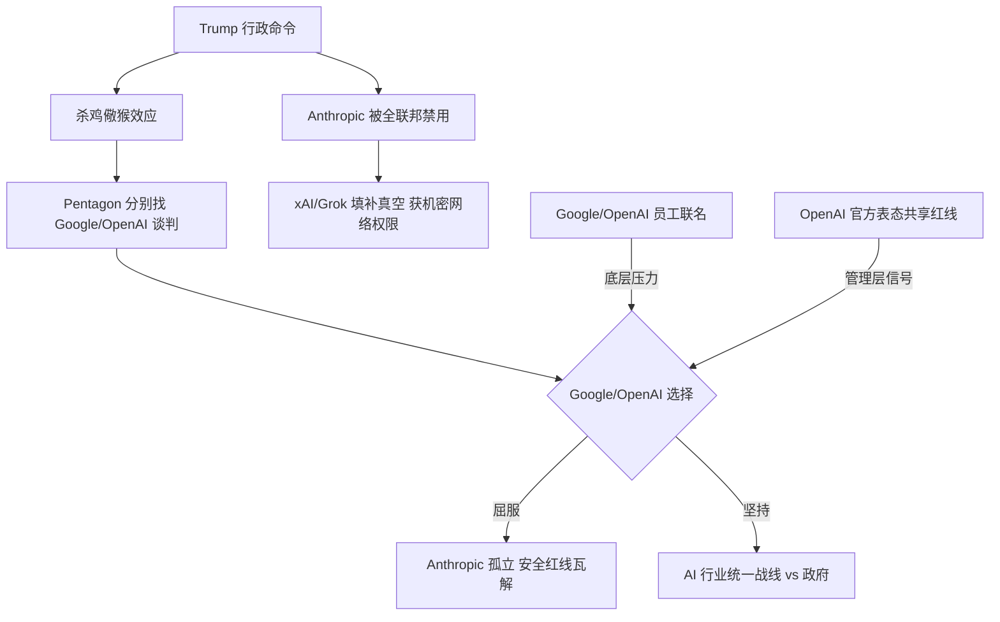
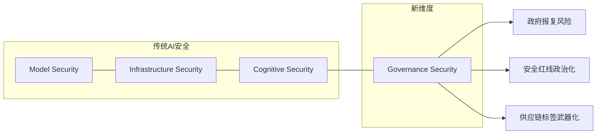

# Anthropic vs Pentagon：全联邦禁令事件全景

> 2026 年 2 月 28 日，Trump 总统下令全联邦政府立即停用 Anthropic——这是 AI 治理史上首次因安全红线争议引发的总统级行政禁令。

## 一、事件时间线

| 时间（北京） | 事件 |
|---|---|
| 2/26 | Pentagon 向 Anthropic 发出最后通牒：取消军事 AI 使用限制，否则标记为 "supply chain risk" |
| 2/27 凌晨 | Dario Amodei 发博客表态"强烈希望继续服务军方"，但两条红线不退让 |
| 2/27 白天 | 谈判破裂。Anthropic 正式拒绝 Pentagon 最终报价："cannot in good conscience accede" |
| 2/27 下午 | Pentagon 高官公开抨击 Anthropic |
| 2/27 晚 | Boeing/Lockheed Martin 被要求评估 Anthropic 供应链暴露面 |
| **2/28 ~05:00** | **Trump 通过 Truth Social 宣布全联邦禁令**（deadline 前约 1 小时） |
| 2/28 05:30 | CNN/NYT/CBS/Politico/CNBC/Fortune 六家同时确认 |
| 2/28 06:01 | 原定 Pentagon deadline 到期（已被 Trump 行政命令越级处理） |
| 2/28 06:15 | OpenAI 公开表态共享 Anthropic 红线；Google/OpenAI 数百员工联名支持 |

## 二、核心争议

**Anthropic 的两条红线**（始终未退让）：
1. **No fully autonomous weapons** — 不允许 Claude 用于完全自主武器系统
2. **No mass domestic surveillance** — 不允许用于大规模国内监控

**Pentagon 的诉求**：对 Claude 的 "all-lawful use" 不设限制

**Trump 行政命令原文**：
> "The Leftwing nut jobs at Anthropic...Therefore, I am directing EVERY Federal Agency in the United States Government to IMMEDIATELY CEASE all use of Anthropic's technology"

Pentagon 获 6 个月过渡期。性质：将技术安全争议政治化为 "woke vs national security" 叙事。

## 三、行业反应

**支持 Anthropic 阵营**：
- OpenAI 官方表态共享同样红线
- Google/OpenAI 数百员工联名公开信
- Pentagon 分化策略曝光后引发行业团结

**受益者**：
- xAI/Grok — 无安全红线争议，直接填补真空，获机密军事网络权限

## 四、多层分析

### 4.1 对 Anthropic 的影响

**短期**：失去全联邦政府市场 + $200M 军方合同。安全品牌在技术社区大幅增值。商业 API 不受直接影响。

**长期**：supply chain risk 标签可能波及企业客户。模型迭代投入可能受收入压力影响。政治风险标签可能吓退保守型企业客户。

### 4.2 反直觉洞察：太安全也是风险

Anthropic 的安全品牌不仅没有保护它，反而使其成为政治靶心：

- **传统假设**：AI 安全 = 竞争优势（获得信任 → 获得合同）
- **新现实**：AI 安全 = 政治脆弱性（拒绝 = 不爱国 → 被惩罚）
- **政策武器化**：行政命令可以绕过正常合同/法律程序，直接封杀

### 4.3 Governance Security — AI 安全的新维度

这个案例为 AI 安全研究引入了全新维度：

传统 AI 安全关注模型层（对齐/越狱/注入）、基础设施层（API/供应链/权限）和认知层（人格/记忆/信任）。Anthropic 事件证明还存在第四层——治理层：政策合规、政治风险、行政命令风险。

## 五、面试武器观点

**Q: AI 安全与商业利益如何平衡？**

Anthropic vs Pentagon 事件（2026.2）是最佳案例。Anthropic 坚持两条红线（no 自主武器 / no 大规模监控），结果被 Trump 行政命令全联邦禁用。短期看是商业损失（$200M+ 政府市场），但 OpenAI 和 Google 员工集体声援说明安全立场有行业共识基础。核心矛盾：安全红线在技术社区是竞争优势，在政治语境下却变成脆弱性。AI 公司需要的不只是技术安全策略，还需要政治风险对冲能力——这是传统 AI Safety 研究完全没覆盖的维度。

## 六、待跟踪

- [ ] Anthropic 正式声明（截至 2/28 06:15 尚未回应）
- [ ] Google/OpenAI 管理层是否跟进表态（员工联名 ≠ 公司立场）
- [ ] "supply chain risk" 标签是否正式落地
- [ ] 法律挑战可能性（行政命令 vs 合同法）
- [ ] 对 Claude API 商业服务的实际影响

---

*活文档。事件仍在发展中，将持续更新。*
