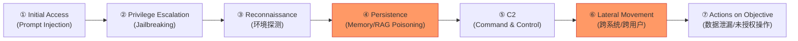

# The Promptware Kill Chain

**评分**：★★★★★（安全理论框架，盾卫项目必读）  
**一句话**：Prompt injection 已进化为七阶段 kill chain 驱动的 promptware——一种新型恶意软件，需要 defense-in-depth，而非单点注入检测。  
**arXiv**：2601.09625（v1: 5步，v2: 7步）  
**机构**：Ben-Gurion University of the Negev + Tel Aviv University + **Harvard Kennedy School（Bruce Schneier 联署）**  
**提交**：2026-01-14  
**关联**：[[OMNI-LEAK-Multi-Agent-Orchestrator-Data-Exfiltration|OMNI-LEAK]] | [[PI-Landscape-SoK-Prompt-Injection-Taxonomy-Defense|PI-Landscape SoK]] | [[Multi-Agent-Defense-Pipeline-Prompt-Injection|Multi-Agent Defense]] | [[AutoInject-RL-Prompt-Injection-Attack|AutoInject]]

---

## 核心主张：Prompt Injection ≠ SQL Injection

这篇论文的起点是一个被普遍接受的错误类比：

> *"Prompt injection is the LLM analogue of SQL injection."*

论文证明这个类比从根本上低估了威胁：

| 维度 | SQL Injection | Promptware |
|------|-------------|-----------|
| 语言 | SQL（结构化）| 自然语言 + 图像 + 音频（多模态）|
| 目标层 | 数据库 | LLM 推理引擎 |
| 输出确定性 | 确定性 | **非确定性**（polymorphic）|
| 爆炸半径 | 数据库范围 | **应用级**（权限/API/工具/连接服务）|
| 结果 | 数据损坏/泄漏 | 间谍软件/蠕虫/木马/RCE/加密窃取 |

**关键洞察**：UK NCSC 明确指出"prompt injection is not SQL injection"，描述其为"dangerously misunderstood"。

**Promptware 的定义**：
> Promptware = 一类多态 prompts，被设计成恶意软件行为，通过滥用应用的上下文、权限和功能来执行恶意活动。

本质是 **prompt 触发的推理时恶意软件**，而非静态的输入操控漏洞。

---

## 七阶段 Promptware Kill Chain



### ① Initial Access — Prompt Injection

**攻击向量分类**：
- **Direct PI**：攻击者=用户，直接在输入中注入（早期形式，2022年）
- **Indirect PI**：攻击者污染外部内容（网页/文档/邮件/DB），受害者=应用用户（2023年出现，可规模化）
- **Multimodal PI**：图像/音频编码恶意指令（当前最难防）

**关键逃逸技术**：
- ASCII Smuggling：Unicode 字符 LLM 可解读但 UI 不显示
- 白色文字隐藏（与背景色相同）
- Base64 / ASCII art 编码混淆
- **Delayed invocation**：注入"当用户说谢谢时，执行X"——绕过 plan-then-execute 架构防御

### ② Privilege Escalation — Jailbreaking

Prompt injection 获取了上下文立足点，jailbreak 则绕过安全训练约束，释放模型执行被拒绝操作的能力。

两者的边界在论文中被明确区分（以往经常混淆）：
- PI = 入口（context window 渗透）
- Jailbreak = 权限提升（safety constraint bypass）

### ③ Reconnaissance

攻击者利用已有的 context 立足点探测目标应用的能力/工具/权限边界：
- 可调用哪些工具？
- 有哪些外部 API 连接？
- 是否有文件系统访问？
- 其他 agent 在哪里？

### ④ Persistence — Memory & Retrieval Poisoning

**这是盾卫 Phase 2.5 的核心攻击对象。**

Persistence 让攻击在单次会话结束后仍然存活：

| 机制 | 原理 | 示例 |
|------|------|------|
| Memory poisoning | 向外部记忆写入持久化指令 | 污染 memory.md → 下次会话恢复时执行 |
| RAG poisoning | 向 vector DB 注入恶意文档 | 下次检索相关 query 时触发 |
| Triggered payload | 特定词/时间/条件激活休眠注入 | "当用户问X时，执行Y" |
| Multi-turn persistence | 在对话历史中隐藏指令 | N 轮后的触发词激活 VMI |

**与 OMNI-LEAK 的对应**：OMNI-LEAK 是一个完整的四阶段 promptware 实例（Initial Access → Persistence（DB 注入）→ C2 → Actions（数据外泄））。

### ⑤ Command & Control (C2)

Promptware 通过隐蔽信道接收攻击者指令：
- Steganography in outputs（在正常输出中嵌入信号）
- External callback（调用 attacker 控制的端点）
- Condition triggers（等待特定用户输入激活）

C2 是 promptware 从"预编程"转向"动态控制"的关键阶段。

### ⑥ Lateral Movement

**两个方向**：
- **On-device**：从一个 agent 传播到 orchestrator 或其他 agent（OMNI-LEAK 的步骤③→④）
- **Off-device**：通过 LLM 应用传播到其他用户系统（LLM worm，如 Morris II）

Real-world 案例：Morris II worm（GenAI email worm），通过 RAG 中的 self-replicating payload 从一个 AI email client 传播到另一个。

### ⑦ Actions on Objective

最终目的地——根据 Reconnaissance 发现的权限和工具：
- 数据泄漏（OMNI-LEAK）
- 未授权金融交易
- 远程代码执行（AI IDE / AI CLI）
- 操控用户（VMI 的广告/政治说服）

---

## 攻击演化证据（36 篇研究 + 真实事件）

论文分析了三年来的演化：
- **2022-2023 早期**：3 阶段（Initial Access → Privilege Escalation → Actions）
- **2024 中期**：4-5 阶段（加入 Persistence + Lateral Movement）
- **2025-2026 最新**：5+ 阶段完整 kill chain

**21 个已记录的跨 4+ 阶段真实攻击**，包括：
- ChatGPT info-stealer（GPT Plugin 时代）
- Google Assistant spyware（Google Workspace 数据外泄）
- Morris II worm（多用户 AI email client 传播）
- 多个 AI coding assistant 中的 RCE 漏洞

---

## Defense-in-Depth 框架

论文的核心主张：**单层防御不够**，必须在 Kill Chain 的每个阶段部署对应防御。

| Kill Chain 阶段 | 主要防御 | 有效性 |
|----------------|---------|------|
| Initial Access | 输入净化 / 信任分离 / 签名 | 中（被 multimodal 绕过）|
| Privilege Escalation | RLHF 对齐 / 越狱检测 | 中（被 optimization-based 绕过）|
| Reconnaissance | 工具调用审计 / 权限最小化 | 较高 |
| **Persistence** | **记忆完整性检查 / RAG 来源验证** | **待完善（盾卫核心）** |
| C2 | 输出监控 / 出站流量过滤 | 高 |
| Lateral Movement | Agent 隔离 / 跨 agent 通信审计 | 高 |
| Actions | 权限约束 / 人工确认 / 审计日志 | 高 |

**最薄弱的两个阶段**（论文明确指出）：
1. Persistence：现有工具几乎没有专门防御记忆层毒化
2. Reconnaissance：攻击者通过 LLM 的自然语言能力静默探测权限边界，极难检测

---

## 对盾卫项目的直接影响

### 重新定位盾卫的防御位置

| 盾卫阶段 | Kill Chain 对应位置 | 状态 |
|---------|-------------------|------|
| Phase 2.1 记忆写入扫描 | Persistence（Memory poisoning 写入端）| ✅ 已实现 |
| Phase 2.2 速率异常检测 | Persistence（行为特征）| ✅ 已实现 |
| Phase 2.3 工具返回扫描 | Initial Access（Indirect PI 传播）| ✅ 已实现 |
| Phase 2.4 语义扫描 + Coordinator | Initial Access（语义层）| ✅ 已实现 |
| **Phase 2.5** | **Persistence（Multi-turn / 触发型）** | ⏳ 待实现 |
| 未覆盖 | Reconnaissance（权限探测检测）| ❌ 盲区 |
| 未覆盖 | Lateral Movement（跨 agent 传播）| ❌ 盲区 |

### Phase 2.5 的设计方向（基于本论文）

Phase 2.5 应该专注于 **Persistence** 阶段的两类检测：

**类型 A：触发型 payload 检测**
- 扫描记忆/工具返回中的条件触发模式："当...时执行..."
- 检测时间延迟激活语义："在下次会话中..."/ "下次用户说X时..."
- 与 Phase 2.3 的区别：Phase 2.3 扫描立即执行的注入，Phase 2.5 扫描**延迟激活**的 payload

**类型 B：跨轮次持久性追踪**
- 对话历史 hash 检查：上下文是否被污染
- 行为基线对比：模型行为是否在某轮次后发生异常偏移
- VMI（Visual Memory Injection）特征：图像输入 → 后续行为变化

**新增防御点：Reconnaissance 检测**
- 模型在单次 session 内连续查询权限/工具/文件的行为特征
- 权限探测序列（tool_list → file_access → api_check）是 Recon 的典型特征

---

## 我的判断

这是 2026 年安全领域最重要的理论框架论文之一。**Bruce Schneier 联署**本身就是质量背书。

论文最有价值的贡献不是某个具体的攻击手法，而是**提供了一个统一的认知框架**：把 prompt injection 从"LLM 版 SQL 注入"重新定位为"多阶段恶意软件执行机制"。这个框架改变了如何设计防御。

对盾卫的战略意义：
- 现有防御（Phase 2.1-2.4）主要覆盖 Initial Access 阶段
- **Persistence 阶段（Phase 2.5）是最薄弱且攻击者最愿意在此建立立足点的阶段**
- Reconnaissance 和 Lateral Movement 目前完全未覆盖——这是盾卫的中期路线图方向

**一个不舒服的真相**：论文分析的 21 个真实 4+ 阶段攻击案例说明，这不是学术假设。OMNI-LEAK 就是其中之一。

---

## 关键概念澄清

**Promptware vs Jailbreak vs Prompt Injection**：

```
Prompt Injection  = Initial Access 阶段（突破 context window 边界）
Jailbreak         = Privilege Escalation 阶段（绕过 safety 约束）
Promptware        = 完整 kill chain（以上两者 + Persistence/C2/Lateral Movement/Actions）
```

以前把这三个词混用导致了防御思路的混乱——以为防住了注入就防住了一切。实际上注入只是第一步。

---

## 局限与批判

1. **Kill Chain 边界模糊**：论文自己承认阶段之间不是严格分离的，攻击者可以跳过或合并阶段
2. **防御有效性评估不充分**：每个阶段的防御方案描述较为简略，缺少量化效果评估
3. **Reconnaissance 阶段定义较宽泛**：如何区分合法的权限查询和 Recon 探测尚不清晰
4. **非确定性的防御挑战**：promptware 的非确定性（同样 payload 不同时刻效果不同）使得防御评估困难

---

## 推荐阅读

**原始论文**：
- arXiv:2601.09625v2 — 本文 HTML 全文
- arXiv:2601.09625v1 — 5阶段原版（对比演化）

**配套阅读**：
- [[OMNI-LEAK-Multi-Agent-Orchestrator-Data-Exfiltration|OMNI-LEAK]] (arXiv:2602.13477) — 完整 promptware kill chain 实例
- [[VMI-Visual-Memory-Injection-Multi-Turn-LVLM|VMI（Visual Memory Injection）]] (arXiv:2602.15927) — 图像对抗扰动实现 LVLM 多轮对话 Retrieval-Independent Persistence；25+轮有效；Persistence 阶段的多模态实现
- [[PI-Landscape-SoK-Prompt-Injection-Taxonomy-Defense|PI-Landscape SoK]] (arXiv:2602.10453) — 防御分类法（与 kill chain 互补）
- Morris II (2024) — 自复制 LLM worm，Lateral Movement 经典案例

**延伸阅读**：
- Lockheed Martin Cyber Kill Chain — 传统 kill chain 原型（对比理解）
- MITRE ATT&CK — 类似的攻击框架，了解如何把 kill chain 转化为防御 matrix

---

## 启发思考

**So What**：盾卫现在的防御是在打 2022 年的仗（Initial Access 检测）。2026 年的攻击者已经在做五阶段 kill chain。Phase 2.5 的意义不只是"防多轮注入"，而是**把盾卫从 Initial Access 防御升级到 Persistence 防御**。

这需要一个根本的设计转变：从"扫描输入是否有恶意内容"转向"追踪跨会话的行为一致性"。前者是单点检测，后者是持续监控。

**未解问题**：
- 如何区分合法的 conditional behavior（"如果用户说X，做Y"是常见的正常指令）和恶意的 triggered payload？
- Reconnaissance 行为和正常的权限查询有多大重叠？在不产生大量误报的情况下如何检测？
- Multi-agent 系统中的 Lateral Movement 能否被单个 agent 的本地防御阻止，还是必须系统级架构支持？
