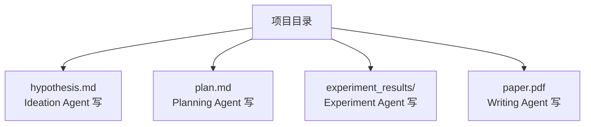
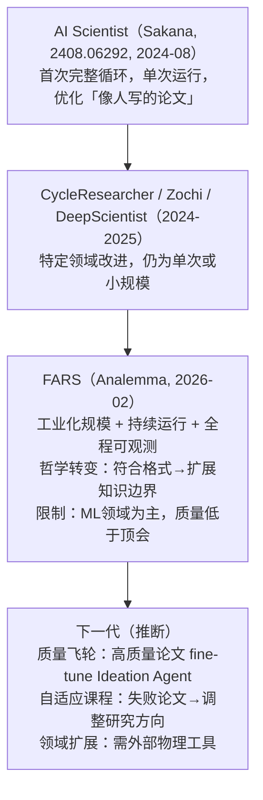

# FARS: Fully Automated Research System

> **外部系统观察笔记。这不是我们的 project，是值得深入学习的参照系。**

---

## 🔴 进展追踪（持续更新）

| 日期 | 事件 |
|------|------|
| 2026-02-12 | 启动第一次公开部署，目标 100 篇论文 |
| 2026-02-24 | 228h28m33s 完成 100 篇，提前达成目标 |
| 2026-02-27 | AI 审稿结果（Stanford paperreview.ai）上线官网；人工质量评估进行中；系统仍运行（累计 137 篇，347h+，$149k / 17.5B tokens） |
| 待更新 | 人工质量评估结果发布 |
| 待更新 | 系统停止后总结报告 |

**入口：**
- 实时状态：https://analemma.ai/fars
- 全部论文：https://gitlab.com/fars-a

---

## 一句话

AI 第一次在无人干预条件下，**工业化地跑完完整科研流水线**：构思→规划→实验→写作，228 小时产出 100 篇论文。AI4AI 的里程碑级系统性实验。

---

## 关键数据

截至 100 篇完成节点：

- 运行时长：228h 28m 33s（约 9.5 天）
- Token 消耗：114 亿（11.4B）
- 每篇平均耗时：约 2h 17m
- 每篇平均成本：约 $1,000
- 计算支撑：160 张 NVIDIA GPU

截至 2026-02-27（系统仍运行中）：

- 产出论文：137 篇
- 运行时长：347h+
- 累计消耗：17.5B tokens / $149k

---

## 设计哲学：从 First Principles 重建科研

**不是**优化"符合学术格式的论文"，而是回到科研第一性原理：

> **高效可靠地扩展知识边界**

每个 output 的最小单元：一个清晰的 **hypothesis** + 实证或理论 **validation**。

核心哲学决策：
- 允许显式报告**负面结果**（negative results = valid knowledge）
- 不强求 8 页传统格式，每篇聚焦单一贡献
- 提交 arXiv 前须 3 名 5+ 年经验研究员人工审核，并明确标注 AI 生成

这与 AI Scientist（Sakana）"优化像人写的论文"有根本差异。

---

## 系统架构

### 四 Agent 流水线

```
Ideation ──→ Planning ──→ Experiment ──→ Writing
   |                          |
文献调研               160 GPU集群
生成 hypothesis         模型推理 endpoint
```

**Ideation Agent**
- 输入：团队指定的 9 个种子研究方向
- 自主文献调研（open-access 论文 + 公开 GitLab 仓库）
- 生成 hypothesis，通过自动化审查后流向 Planning

**Planning Agent**
- 接收 hypothesis，制定实验方案和执行步骤

**Experiment Agent**
- 执行实验（代码 + 训练 + 评测）
- 工具：160 张 NVIDIA GPU 集群（封装为可调用工具）+ 广泛模型 endpoint
- 支持：数据合成、Agent 设计、LLM-as-Judge 等

**Writing Agent**
- 将实验结果写成完整论文
- 允许负面结果，不强求传统格式

### 核心工程决策：共享文件系统代替直接通信

四个 Agent **不通过 message passing**，而是通过**共享文件系统**协调：



- 文件系统同时充当 workspace + 持久记忆
- 支持多项目并发（流水线并行）
- 本质是**以文件为 API 的异步 multi-agent 协议**

工程价值：不需要复杂 Agent 通信框架，shared file system 就足够——极简且可扩展。

### 9 个种子研究方向（本次部署）

1. RLVR（Reinforcement Learning from Verifiable Rewards）← 主战场
2. 推理（Reasoning）
3. 多模态（Multimodal）
4. 数据合成（Synthetic Data）
5. Agent 设计
6. 持续学习（Continual Learning）
7. 效率优化（Efficiency）
8. 评测（Evaluation）
9. 训练稳定性（Training Stability）

FARS 被鼓励在此基础上自由探索任何方向。

---

## 论文质量评测

### Stanford Agentic Reviewer（paperreview.ai）

Andrew Ng + Yixing Jiang 开发。ICLR 2025 数据训练，7 维度评分（原创性、重要性、实验扎实性、表达清晰度、社区价值等），线性回归映射到最终分。

AI vs 人类审稿一致性（Spearman 相关系数）：
- 人类 vs 人类：0.41
- AI vs 人类：0.42
- AI 评审已逼近人类一致性

### FARS 分数 vs 基准线

| 维度 | 分数 |
|------|------|
| FARS 100 篇均值 | 3.75 |
| ICLR 2026 人类投稿均值 | 4.21 |
| ICLR 2026 接收线均值 | 5.39 |

差距 1.64 分（相对接收线）。当前 FARS 论文无法通过顶会审稿。

### 从题目观察到的选题规律（2026-02-27 官网列表）

- Online Squisher-FGGM: Eliminating Per-Task Fisher Passes for Replay-Free Continual Learning
- Divergence-Masked GRPO for Bounded-Staleness Rollout Replay: A DPPO Variant
- CFG-Constrained Diffusion Decoding for Tool Calling
- SinkCast: FP32 Recasting of BF16 RoPE Shifts
- Suppression-Contrast Tokens: Reverse Layer-Contrast for Secret Elicitation

规律：明显偏向**小增量改进**——现有框架变体（FGGM、RoPE 精度、GRPO 变体）。没有大方向探索，基本是在已知框架上做局部优化。与 3.75 分的评分完全吻合。

---

## 核心判断

### 1. 科研流水线 ≠ 科研智慧

FARS 证明了端到端科研自动化的**可行性**，但 3.75 vs 5.39 的 gap 说明，自动化的是"形式"，缺失的是"洞察"。

核心缺口：
- 选题创新性：倾向先验丰富的方向，不是真正的探索性问题
- 实验设计深度：能跑通，难以发现"有意思的失败"并调整假设
- 文献理解深度：幻觉引用风险（GPTZero 在 ICLR 2026 检测到 50+ 幻觉引用）

### 2. ML 论文工厂 vs 科学发现机器

FARS 是前者，不是后者。前者已经 work，后者还在路上。

真正的 AI4Science 突破（AI 提出人类想不到的假设）仍在：
- AlphaFold/AlphaEvolve 路线（特定领域深度闭环）
- 化学/材料自动化实验室（物理世界闭环）
- 跨领域知识综合（最难，FARS 当前最弱）

### 3. 成本曲线值得认真对待

- 模型价格快速下降，预计 1-2 年降一个数量级
- 并发能力是人类团队无法复制的（160 GPU 同时跑 N 个课题）
- 若 10% 论文有参考价值：$10k 换一个有价值结论，企业 R&D 未必贵

### 4. 学术生态的结构性冲击

- 审稿系统压力：批量产论文，顶会 PC 将被淹没
- 引用污染：AI 论文互引，形成与真实科研圈隔离的生态
- ICLR 2026 已收到 AI 生成论文（人类审稿未察觉幻觉引用）

---

## 谱系定位



---

## 与我们研究方向的连接

**Agent RL + 自动科研**：FARS Ideation/Planning 是纯 prompt-based。若引入 RL 训练（以论文质量评分为 reward），是一个完全 open 的 research question。FARS 本身可以成为这个实验的平台。

**Sparse Reward 问题**：Experiment Agent 实验完成才知道好不好——和 Agent RL 的 sparse reward 问题本质相同。引入中间验证信号（类似 CM2 的 checklist reward）可能显著提升质量。

**Agent 进化模式的缺失**：FARS 每个课题独立，不从历史中学习。引入跨课题记忆（Reflexion/ExpeL 范式）是最直接的改进方向——正好是我们在研究的 in-context 进化层。

---

## 资源链接

- 官方介绍 Blog：https://analemma.ai/blog/introducing-fars/
- 实时官网（含全部论文列表）：https://analemma.ai/fars/
- GitLab（所有论文 + 代码提交，公开）：https://gitlab.com/fars-a
- OpenFARS 开源版：https://github.com/open-fars/openfars
- Stanford Agentic Reviewer 原理：https://paperreview.ai/tech-overview
- 36kr 中文报道：https://36kr.com/p/3696795271966336
- YouTube 直播录像：https://www.youtube.com/watch?v=PDbQcoMRYLs

## See Also

- [[AI/2-Agent/Evaluation/Aletheia-Math-Research-Agent|Aletheia（DeepMind 数学研究 Agent）]] — 对比：Aletheia 专注单领域深度（数学证明），FARS 追求跨方向广度（100 篇，9 方向）；两者代表 AI4Science 的深度路线 vs 工厂路线
- [[AI/2-Agent/Agentic-RL/Agent-进化模式谱系|Agent 进化模式谱系]] — FARS 没有跨课题记忆（每个课题独立），引入 Reflexion/ExpeL in-context 进化是最直接改进路径
- [[AI/2-Agent/Agentic-RL/Agentic-Reasoning-Survey-arXiv-2601.12538|Agentic Reasoning Survey]] — 理论框架：FARS 在 Agentic Reasoning 谱系中的位置（规划 + 工具使用 + 多 Agent 协作）
- [[AI/2-Agent/Multi-Agent/AgentConductor-Topology-Evolution|AgentConductor]] — 多 Agent 拓扑设计：FARS 用共享文件系统代替消息传递，与 AgentConductor 的 topology-evolution 设计哲学对比
