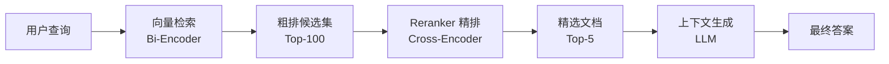

# Reranker 与重排序

Reranker 是 [[RAG-2026-技术全景|RAG]] 系统中的关键组件，用于对初步检索结果进行精准重排序，显著提升检索质量和最终生成效果。与传统的单一检索不同，Reranker 引入了二次排序机制，在召回阶段之后进一步优化候选文档的排序。

## 核心概念

### Bi-Encoder vs Cross-Encoder 架构对比

**Bi-Encoder（双塔模型）**：
- 查询和文档分别编码，通过向量相似度计算排序
- 优势：高效并行计算，适合大规模检索
- 劣势：无法捕获查询-文档间的细粒度交互

```python
# Bi-Encoder 示例
class BiEncoderRetriever:
    def __init__(self, model_name='sentence-transformers/all-MiniLM-L6-v2'):
        self.encoder = SentenceTransformer(model_name)
    
    def encode_docs(self, documents):
        return self.encoder.encode(documents)
    
    def retrieve(self, query, doc_embeddings, top_k=10):
        query_embedding = self.encoder.encode([query])
        similarities = cosine_similarity(query_embedding, doc_embeddings)[0]
        top_indices = similarities.argsort()[-top_k:][::-1]
        return top_indices, similarities[top_indices]
```

**Cross-Encoder（交互式编码）**：
- 查询和文档拼接后联合编码，直接预测相关性分数
- 优势：完全交互建模，精度更高
- 劣势：计算密集，不适合首轮大规模检索

```python
# Cross-Encoder Reranker 示例
from transformers import AutoTokenizer, AutoModelForSequenceClassification
import torch

class CrossEncoderReranker:
    def __init__(self, model_name='BAAI/bge-reranker-base'):
        self.tokenizer = AutoTokenizer.from_pretrained(model_name)
        self.model = AutoModelForSequenceClassification.from_pretrained(model_name)
        self.model.eval()
    
    def rerank(self, query, candidates, top_k=5):
        pairs = [(query, doc) for doc in candidates]
        
        with torch.no_grad():
            inputs = self.tokenizer(
                pairs, padding=True, truncation=True, 
                return_tensors='pt', max_length=512
            )
            scores = self.model(**inputs).logits.squeeze(-1)
        
        # 排序并返回 top_k
        ranked_indices = scores.argsort(descending=True)[:top_k]
        return ranked_indices.tolist(), scores[ranked_indices].tolist()
```

## 主流 Reranker 模型

### 1. BGE-Reranker 系列
- **BAAI/bge-reranker-base**: 通用中英文重排序，平衡效果与效率
- **BAAI/bge-reranker-large**: 更大参数量，更高精度
- 基于 RoBERTa 架构，在 MS-MARCO 等数据集上预训练

### 2. Cohere Rerank API
```python
import cohere

co = cohere.Client(api_key="your-api-key")

def cohere_rerank(query, documents, top_n=5):
    response = co.rerank(
        model="rerank-english-v2.0",
        query=query,
        documents=documents,
        top_n=top_n
    )
    return [(result.document['text'], result.relevance_score) 
            for result in response.results]
```

### 3. ColBERT（Contextualized Late Interaction）
ColBERT 采用 **Late Interaction** 模式，结合了 Bi-Encoder 的效率和 Cross-Encoder 的精度：

```python
# ColBERT Late Interaction 核心机制
def late_interaction_score(query_embeddings, doc_embeddings):
    """
    query_embeddings: [query_len, hidden_dim]
    doc_embeddings: [doc_len, hidden_dim]
    """
    # 计算每个查询 token 与文档所有 token 的最大相似度
    interaction_matrix = torch.matmul(query_embeddings, doc_embeddings.T)  # [query_len, doc_len]
    max_similarities = torch.max(interaction_matrix, dim=1)[0]  # [query_len]
    
    # 对查询中所有 token 的最大相似度求和
    final_score = torch.sum(max_similarities)
    return final_score
```

## 在 RAG Pipeline 中的位置

典型的 RAG + Reranker 流程：



```python
class RAGWithReranker:
    def __init__(self, retriever, reranker, llm):
        self.retriever = retriever
        self.reranker = reranker
        self.llm = llm
    
    def query(self, question, retrieval_k=100, rerank_k=5):
        # 1. 初步检索
        candidates, _ = self.retriever.retrieve(question, top_k=retrieval_k)
        
        # 2. Reranker 精排
        reranked_indices, scores = self.reranker.rerank(
            question, candidates, top_k=rerank_k
        )
        
        # 3. 构建上下文
        context = "\n".join([candidates[i] for i in reranked_indices])
        
        # 4. 生成答案
        prompt = f"基于以下上下文回答问题：\n{context}\n\n问题：{question}"
        return self.llm.generate(prompt)
```

## Late Interaction 详解

Late Interaction 是介于 Bi-Encoder 和 Cross-Encoder 之间的折中方案：

**计算流程**：
1. 查询和文档分别通过 BERT 编码，得到每个 token 的向量表示
2. 计算查询中每个 token 与文档所有 token 的相似度矩阵
3. 对每个查询 token，找到文档中相似度最高的 token（max pooling）
4. 将所有查询 token 的最大相似度求和作为最终分数

**优势**：
- 保留了 token 级别的精细交互信息
- 可预计算文档嵌入，查询时只需计算交互矩阵
- 比全交互模型快，比双塔模型准

## 性能优化策略

### 1. 分层检索
```python
def hierarchical_retrieval(query, corpus, retriever, reranker):
    # 第一层：快速粗排（Bi-Encoder）
    candidates_100 = retriever.retrieve(query, top_k=100)
    
    # 第二层：精细重排（Cross-Encoder）
    final_docs = reranker.rerank(query, candidates_100, top_k=10)
    
    return final_docs
```

### 2. 缓存机制
- 缓存文档嵌入向量，避免重复编码
- 缓存热门查询的 Reranker 结果

### 3. 批处理优化
```python
def batch_rerank(queries, candidate_lists, reranker, batch_size=8):
    all_pairs = []
    pair_to_query = {}
    
    for i, (query, candidates) in enumerate(zip(queries, candidate_lists)):
        for j, doc in enumerate(candidates):
            pair_idx = len(all_pairs)
            all_pairs.append((query, doc))
            pair_to_query[pair_idx] = (i, j)
    
    # 批量计算相似度分数
    scores = reranker.compute_scores(all_pairs, batch_size=batch_size)
    
    # 重组结果
    results = [[] for _ in queries]
    for pair_idx, score in enumerate(scores):
        query_idx, doc_idx = pair_to_query[pair_idx]
        results[query_idx].append((doc_idx, score))
    
    return results
```

## 面试常见问题

**Q1：为什么不直接用 Cross-Encoder 做初步检索，而要分两阶段？**

A：Cross-Encoder 虽然精度高，但计算复杂度为 O(Q×D)，其中 Q 是查询数，D 是文档数。对于百万级文档库，直接使用会导致延迟过高。分两阶段检索利用 Bi-Encoder 的 O(Q+D) 复杂度快速召回候选集，再用 Cross-Encoder 精排少量候选文档，兼顾效率与精度。

**Q2：ColBERT 的 Late Interaction 相比 Early Interaction 有什么优势？**

A：Early Interaction（如传统 Cross-Encoder）需要查询和文档拼接后整体编码，无法复用文档表示。Late Interaction 允许预计算和缓存文档的 token 级嵌入，查询时只需计算交互矩阵，大大提升了推理效率。同时保留了 token 级别的精细交互，效果优于简单的向量相似度计算。

**Q3：如何选择合适的 Reranker 模型？**

A：选择依据包括：1）**准确性需求**：BGE-large > BGE-base > Cohere；2）**延迟要求**：ColBERT > BGE-base > BGE-large；3）**语言支持**：BGE 支持中英文，Cohere 主要英文；4）**部署方式**：开源模型可本地部署，Cohere 需要 API 调用；5）**成本考虑**：开源模型无调用费用，API 模型按调用量计费。

**Q4：Reranker 在什么情况下提升最明显？**

A：提升最明显的场景：1）**语义复杂查询**：含有否定、条件、时间约束等复杂语义；2）**专业领域**：法律、医学等需要精确理解的专业文档；3）**长文档处理**：Bi-Encoder 的向量表示可能丢失细节信息；4）**多意图查询**：单个查询包含多个子问题时，Reranker 能更好地平衡各部分相关性。

**Q5：如何评估 Reranker 的效果？**

A：常用指标包括：1）**MRR（Mean Reciprocal Rank）**：衡量第一个相关结果的排序位置；2）**NDCG@K**：考虑位置权重的累积增益；3）**Precision@K/Recall@K**：前 K 个结果的精确率和召回率；4）**端到端指标**：最终 RAG 系统的回答准确性、相关性评分。建议同时使用 [[AI/3-LLM/LLM 评测体系|LLM 评测体系]] 中的自动评测和人工评估方法。

相关链接：[[RAG-2026-技术全景|RAG]], [[向量数据库选型|向量数据库]], [[文本分块策略|文本分块策略]], [[AI/6-应用/RAG/Advanced RAG|Advanced RAG]], [[AI/3-LLM/LLM 评测体系|LLM 评测体系]]