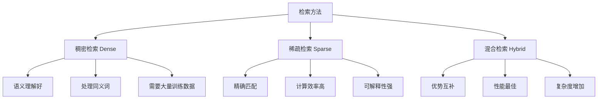

# 检索策略

检索是 [[RAG 原理与架构|RAG]] 系统的核心环节，直接影响最终生成质量。现代检索策略通过多种技术的组合来提升检索精度和召回率。

> 核心出处：DPR（Karpukhin et al., arXiv:2004.04906）、HyDE（Gao et al., arXiv:2212.10496）、BM25（Robertson & Zaragoza, 2009）

## 检索方法分类

### 稠密检索 vs 稀疏检索



#### 1. 稠密检索实现

```python
class DenseRetriever:
    def __init__(self, model_name="sentence-transformers/all-MiniLM-L6-v2"):
        self.encoder = SentenceTransformer(model_name)
        self.vector_db = VectorDatabase()
        
    def encode_documents(self, documents):
        """文档向量化"""
        embeddings = self.encoder.encode(documents, batch_size=32)
        return embeddings
    
    def search(self, query: str, k: int = 10):
        """语义检索"""
        query_embedding = self.encoder.encode([query])
        
        # 向量相似度搜索
        results = self.vector_db.search(
            query_vector=query_embedding,
            k=k,
            metric="cosine"  # cosine, euclidean, dot_product
        )
        
        return results

# 双编码器训练
class DenseRetrievalTrainer:
    def __init__(self, query_encoder, doc_encoder):
        self.query_encoder = query_encoder
        self.doc_encoder = doc_encoder
    
    def train_step(self, queries, pos_docs, neg_docs):
        """对比学习训练"""
        # 编码查询和文档
        query_embs = self.query_encoder(queries)
        pos_doc_embs = self.doc_encoder(pos_docs)
        neg_doc_embs = self.doc_encoder(neg_docs)
        
        # 计算相似度分数
        pos_scores = torch.sum(query_embs * pos_doc_embs, dim=-1)
        neg_scores = torch.sum(query_embs * neg_doc_embs, dim=-1)
        
        # 对比损失
        loss = -torch.log(
            torch.sigmoid(pos_scores - neg_scores)
        ).mean()
        
        return loss
```

#### 2. 稀疏检索实现

```python
class SparseRetriever:
    def __init__(self):
        self.bm25 = None
        self.tfidf = None
        self.corpus = []
        self.tokenizer = self._build_tokenizer()
    
    def _build_tokenizer(self):
        """构建分词器"""
        return lambda text: [
            token.lower() 
            for token in word_tokenize(text) 
            if token.isalnum() and token not in STOP_WORDS
        ]
    
    def index_documents(self, documents):
        """构建稀疏索引"""
        self.corpus = documents
        tokenized_docs = [self.tokenizer(doc) for doc in documents]
        
        # BM25 索引
        self.bm25 = BM25Okapi(tokenized_docs)
        
        # TF-IDF 索引
        self.tfidf = TfidfVectorizer(
            tokenizer=self.tokenizer,
            lowercase=True,
            stop_words='english'
        )
        self.tfidf_matrix = self.tfidf.fit_transform(documents)
    
    def bm25_search(self, query: str, k: int = 10):
        """BM25 检索"""
        tokenized_query = self.tokenizer(query)
        scores = self.bm25.get_scores(tokenized_query)
        
        # 获取 top-k 结果
        top_indices = np.argsort(scores)[::-1][:k]
        results = [
            {
                "doc": self.corpus[i],
                "score": scores[i],
                "index": i
            }
            for i in top_indices
        ]
        return results
    
    def tfidf_search(self, query: str, k: int = 10):
        """TF-IDF 检索"""
        query_vector = self.tfidf.transform([query])
        cosine_scores = cosine_similarity(query_vector, self.tfidf_matrix).flatten()
        
        top_indices = np.argsort(cosine_scores)[::-1][:k]
        results = [
            {
                "doc": self.corpus[i],
                "score": cosine_scores[i],
                "index": i
            }
            for i in top_indices
        ]
        return results

# 现代稀疏检索：SPLADE
class SPLADERetriever:
    def __init__(self, model_name="naver/splade-cocondenser-ensembledistil"):
        self.model = AutoModel.from_pretrained(model_name)
        self.tokenizer = AutoTokenizer.from_pretrained(model_name)
    
    def encode(self, texts):
        """SPLADE 稀疏编码"""
        inputs = self.tokenizer(texts, return_tensors="pt", padding=True, truncation=True)
        
        with torch.no_grad():
            outputs = self.model(**inputs)
            # 获取稀疏表示
            sparse_rep = torch.log(1 + torch.relu(outputs.last_hidden_state)) * inputs.attention_mask.unsqueeze(-1)
            # 池化到词汇表维度
            sparse_rep = torch.max(sparse_rep, dim=1)[0]
        
        return sparse_rep
```

### 混合检索架构

```python
class HybridRetriever:
    def __init__(self, dense_retriever, sparse_retriever, alpha=0.5):
        self.dense_retriever = dense_retriever
        self.sparse_retriever = sparse_retriever
        self.alpha = alpha  # 权重平衡参数
    
    def hybrid_search(self, query: str, k: int = 10):
        """混合检索策略"""
        # 分别进行稠密和稀疏检索
        dense_results = self.dense_retriever.search(query, k=k*2)
        sparse_results = self.sparse_retriever.search(query, k=k*2)
        
        # 结果融合
        fused_results = self.fuse_results(dense_results, sparse_results, k)
        return fused_results
    
    def fuse_results(self, dense_results, sparse_results, k):
        """多种融合策略"""
        # 1. 线性组合
        return self._linear_combination(dense_results, sparse_results, k)
        
        # 2. RRF (Reciprocal Rank Fusion)  
        # return self._reciprocal_rank_fusion(dense_results, sparse_results, k)
        
        # 3. CombSUM
        # return self._comb_sum(dense_results, sparse_results, k)
    
    def _linear_combination(self, dense_results, sparse_results, k):
        """线性组合融合"""
        doc_scores = {}
        
        # 归一化分数
        dense_scores = self._normalize_scores([r.score for r in dense_results])
        sparse_scores = self._normalize_scores([r.score for r in sparse_results])
        
        # 稠密检索结果
        for result, norm_score in zip(dense_results, dense_scores):
            doc_id = result.doc_id
            doc_scores[doc_id] = self.alpha * norm_score
        
        # 稀疏检索结果
        for result, norm_score in zip(sparse_results, sparse_scores):
            doc_id = result.doc_id
            if doc_id in doc_scores:
                doc_scores[doc_id] += (1 - self.alpha) * norm_score
            else:
                doc_scores[doc_id] = (1 - self.alpha) * norm_score
        
        # 排序并返回 top-k
        sorted_results = sorted(doc_scores.items(), key=lambda x: x[1], reverse=True)
        return sorted_results[:k]
    
    def _reciprocal_rank_fusion(self, dense_results, sparse_results, k, k_param=60):
        """RRF 融合：1/(k + rank)"""
        doc_scores = {}
        
        # 稠密检索排名
        for rank, result in enumerate(dense_results):
            doc_id = result.doc_id
            doc_scores[doc_id] = doc_scores.get(doc_id, 0) + 1 / (k_param + rank + 1)
        
        # 稀疏检索排名
        for rank, result in enumerate(sparse_results):
            doc_id = result.doc_id
            doc_scores[doc_id] = doc_scores.get(doc_id, 0) + 1 / (k_param + rank + 1)
        
        sorted_results = sorted(doc_scores.items(), key=lambda x: x[1], reverse=True)
        return sorted_results[:k]
    
    def _normalize_scores(self, scores):
        """分数归一化"""
        min_score, max_score = min(scores), max(scores)
        if max_score == min_score:
            return [1.0] * len(scores)
        return [(score - min_score) / (max_score - min_score) for score in scores]
```

## HyDE (Hypothetical Document Embeddings)

> 来源：Gao et al. "Precise Zero-Shot Dense Retrieval without Relevance Labels" arXiv:2212.10496

HyDE 通过生成假设答案来改进检索效果：

```python
class HyDERetriever:
    def __init__(self, generator_llm, embedding_model, vector_db):
        self.generator = generator_llm
        self.embedding_model = embedding_model
        self.vector_db = vector_db
    
    def retrieve_with_hyde(self, query: str, k: int = 10):
        """HyDE 检索流程"""
        # 1. 生成假设文档
        hypothetical_docs = self.generate_hypothetical_documents(query)
        
        # 2. 编码假设文档
        hyde_embeddings = []
        for doc in hypothetical_docs:
            embedding = self.embedding_model.encode(doc)
            hyde_embeddings.append(embedding)
        
        # 3. 平均池化假设文档向量
        avg_embedding = np.mean(hyde_embeddings, axis=0)
        
        # 4. 使用平均向量检索真实文档
        results = self.vector_db.search(avg_embedding, k=k)
        
        return results, hypothetical_docs
    
    def generate_hypothetical_documents(self, query: str, num_docs: int = 3):
        """生成假设答案文档"""
        prompt_template = """
请为以下问题生成一个详细、准确的答案。答案应该像来自可靠文档一样：

问题：{query}

答案："""
        
        hypothetical_docs = []
        for _ in range(num_docs):
            prompt = prompt_template.format(query=query)
            response = self.generator.generate(
                prompt, 
                temperature=0.7,  # 增加多样性
                max_tokens=256
            )
            hypothetical_docs.append(response)
        
        return hypothetical_docs

# HyDE 变种：Query2Doc
class Query2DocRetriever:
    def __init__(self, generator_llm, embedding_model, vector_db):
        self.generator = generator_llm
        self.embedding_model = embedding_model
        self.vector_db = vector_db
    
    def expand_query_with_doc(self, query: str):
        """查询扩展：生成伪文档片段"""
        expansion_prompt = f"""
根据查询生成可能包含答案的文档片段：

查询：{query}

相关文档可能包含的内容：
"""
        
        expanded_content = self.generator.generate(expansion_prompt, max_tokens=128)
        
        # 合并原查询和扩展内容
        extended_query = f"{query} {expanded_content}"
        return extended_query
```

## Query Expansion & Rewriting

### 查询扩展技术

```python
class QueryExpansion:
    def __init__(self, llm, word_embeddings=None):
        self.llm = llm
        self.word_embeddings = word_embeddings
    
    def expand_with_synonyms(self, query: str):
        """基于同义词的查询扩展"""
        expanded_terms = []
        tokens = query.split()
        
        for token in tokens:
            # 查找同义词
            synonyms = self.get_synonyms(token)
            expanded_terms.extend(synonyms[:2])  # 限制扩展数量
        
        expanded_query = query + " " + " ".join(expanded_terms)
        return expanded_query
    
    def expand_with_llm(self, query: str):
        """LLM 驱动的查询扩展"""
        expansion_prompt = f"""
为以下搜索查询生成2-3个相关的扩展词汇或短语，以提高检索效果：

原查询：{query}

扩展词汇：
1."""
        
        expansion = self.llm.generate(expansion_prompt, max_tokens=50)
        expanded_terms = self.parse_expansion(expansion)
        
        return query + " " + " ".join(expanded_terms)
    
    def expand_with_pseudo_relevance_feedback(self, query: str, initial_results, top_k=3):
        """伪相关反馈扩展"""
        # 从初始检索结果中提取关键词
        top_docs = initial_results[:top_k]
        doc_text = " ".join([doc.content for doc in top_docs])
        
        # 提取高频关键词
        keywords = self.extract_keywords(doc_text, query)
        
        # 构建扩展查询
        expanded_query = query + " " + " ".join(keywords[:5])
        return expanded_query

class QueryRewriting:
    def __init__(self, llm):
        self.llm = llm
        self.rewrite_strategies = [
            self._question_to_statement,
            self._add_context,
            self._specify_intent
        ]
    
    def multi_strategy_rewrite(self, query: str):
        """多策略查询重写"""
        rewritten_queries = [query]  # 包含原查询
        
        for strategy in self.rewrite_strategies:
            rewritten = strategy(query)
            if rewritten != query:
                rewritten_queries.append(rewritten)
        
        return rewritten_queries
    
    def _question_to_statement(self, query: str):
        """问题转陈述句"""
        if query.strip().endswith('?'):
            prompt = f"""
将以下问题转换为陈述句形式，用于更好的文档检索：

问题：{query}
陈述句："""
            
            return self.llm.generate(prompt, max_tokens=30)
        return query
    
    def _add_context(self, query: str):
        """添加上下文信息"""
        prompt = f"""
为以下查询添加相关的上下文信息，使其更具体明确：

原查询：{query}
增强查询："""
        
        return self.llm.generate(prompt, max_tokens=40)
    
    def _specify_intent(self, query: str):
        """明确查询意图"""
        prompt = f"""
识别查询意图并重新表述为更明确的检索查询：

模糊查询：{query}
明确查询："""
        
        return self.llm.generate(prompt, max_tokens=30)

# Step-back Prompting
class StepBackRetrieval:
    def __init__(self, llm, retriever):
        self.llm = llm
        self.retriever = retriever
    
    def step_back_search(self, query: str):
        """后退式检索"""
        # 生成更抽象的查询
        abstract_query = self.generate_abstract_query(query)
        
        # 分别检索原查询和抽象查询
        original_results = self.retriever.search(query, k=5)
        abstract_results = self.retriever.search(abstract_query, k=5)
        
        # 合并结果
        combined_results = self.combine_results(original_results, abstract_results)
        return combined_results
    
    def generate_abstract_query(self, query: str):
        """生成抽象查询"""
        prompt = f"""
将以下具体问题转换为更抽象、更一般的概念性问题：

具体问题：{query}
抽象问题："""
        
        return self.llm.generate(prompt, max_tokens=50)
```

## 多路召回与融合策略

### 多向量检索

```python
class MultiVectorRetriever:
    def __init__(self):
        self.vector_stores = {}
    
    def add_vector_store(self, name: str, store, weight: float = 1.0):
        """添加向量存储"""
        self.vector_stores[name] = {"store": store, "weight": weight}
    
    def multi_vector_search(self, query: str, k: int = 10):
        """多向量存储检索"""
        all_results = {}
        
        for name, config in self.vector_stores.items():
            store = config["store"]
            weight = config["weight"]
            
            # 检索
            results = store.search(query, k=k*2)
            
            # 应用权重
            weighted_results = [
                {**result, "score": result["score"] * weight, "source": name}
                for result in results
            ]
            
            all_results[name] = weighted_results
        
        # 融合所有结果
        final_results = self.fuse_multi_vector_results(all_results, k)
        return final_results

# Ensemble 检索
class EnsembleRetriever:
    def __init__(self, retrievers: List[Tuple[str, Any, float]]):
        """
        retrievers: [(name, retriever_instance, weight), ...]
        """
        self.retrievers = retrievers
    
    def ensemble_search(self, query: str, k: int = 10):
        """集成检索"""
        all_results = []
        
        for name, retriever, weight in self.retrievers:
            try:
                results = retriever.search(query, k=k*2)
                
                # 标准化分数并应用权重
                normalized_results = self.normalize_and_weight(results, weight, name)
                all_results.extend(normalized_results)
                
            except Exception as e:
                print(f"Retriever {name} failed: {e}")
                continue
        
        # 按文档ID聚合分数
        aggregated_scores = self.aggregate_scores(all_results)
        
        # 排序并返回 top-k
        final_results = sorted(
            aggregated_scores.items(), 
            key=lambda x: x[1]["total_score"], 
            reverse=True
        )[:k]
        
        return final_results
    
    def aggregate_scores(self, all_results):
        """聚合多个检索器的分数"""
        doc_scores = {}
        
        for result in all_results:
            doc_id = result["doc_id"]
            score = result["weighted_score"]
            source = result["source"]
            
            if doc_id not in doc_scores:
                doc_scores[doc_id] = {
                    "total_score": 0,
                    "count": 0,
                    "sources": [],
                    "doc": result["doc"]
                }
            
            doc_scores[doc_id]["total_score"] += score
            doc_scores[doc_id]["count"] += 1
            doc_scores[doc_id]["sources"].append(source)
        
        # 可选：使用平均分数而非总和
        for doc_id in doc_scores:
            info = doc_scores[doc_id]
            info["avg_score"] = info["total_score"] / info["count"]
        
        return doc_scores
```

### 分阶段检索

```python
class TwoStageRetrieval:
    def __init__(self, first_stage, second_stage):
        self.first_stage = first_stage  # 粗排
        self.second_stage = second_stage  # 精排
    
    def two_stage_search(self, query: str, k: int = 10, recall_k: int = 100):
        """两阶段检索"""
        # 第一阶段：粗排，快速召回大量候选
        candidates = self.first_stage.search(query, k=recall_k)
        
        # 第二阶段：精排，精细重排序
        if len(candidates) == 0:
            return []
        
        reranked = self.second_stage.rerank(query, candidates)
        return reranked[:k]

class CrossEncoderReranker:
    def __init__(self, model_name="ms-marco-MiniLM-L-12-v2"):
        self.model = CrossEncoder(model_name)
    
    def rerank(self, query: str, documents, k: int = 10):
        """Cross-encoder 重排序"""
        # 构建查询-文档对
        query_doc_pairs = [
            [query, doc.content] for doc in documents
        ]
        
        # 计算相关性分数
        scores = self.model.predict(query_doc_pairs)
        
        # 排序
        doc_score_pairs = list(zip(documents, scores))
        sorted_pairs = sorted(doc_score_pairs, key=lambda x: x[1], reverse=True)
        
        return [doc for doc, _ in sorted_pairs[:k]]

# ColBERT 风格的检索
class ColBERTRetriever:
    def __init__(self, model_name="colbert-base-v2"):
        self.model = ColBERTModel(model_name)
    
    def search(self, query: str, k: int = 10):
        """ColBERT 多向量检索"""
        # 查询编码：每个 token 一个向量
        query_vectors = self.model.encode_query(query)
        
        # 文档检索：使用 MaxSim 操作
        candidate_docs = self.get_candidate_documents()
        
        scores = []
        for doc in candidate_docs:
            doc_vectors = self.model.encode_document(doc.content)
            
            # MaxSim: 每个查询 token 与文档中最相似 token 的分数
            maxsim_scores = []
            for q_vec in query_vectors:
                similarities = torch.matmul(q_vec, doc_vectors.T)
                max_sim = torch.max(similarities)
                maxsim_scores.append(max_sim)
            
            # 查询向量的平均 MaxSim
            total_score = torch.mean(torch.stack(maxsim_scores))
            scores.append(total_score.item())
        
        # 排序并返回 top-k
        doc_score_pairs = list(zip(candidate_docs, scores))
        sorted_results = sorted(doc_score_pairs, key=lambda x: x[1], reverse=True)
        
        return [doc for doc, _ in sorted_results[:k]]
```

## 面试常见问题

### Q1: 稠密检索和稀疏检索各有什么优缺点？
**A**: 稠密检索基于向量语义相似度，能理解同义词和语义关系，但需要大量训练数据且计算开销大。稀疏检索基于精确词汇匹配，计算高效、可解释性强，但无法处理同义词和语义变化。实际应用中通常使用混合检索来互补优势。

### Q2: HyDE 的核心思想是什么，为什么有效？
**A**: HyDE 通过生成假设答案文档来改善检索效果。核心思想是假设答案比问题更接近真实文档的语言风格和内容结构。通过编码生成的假设文档而非原始查询来检索，可以在向量空间中更好地匹配相关文档，特别适合处理复杂查询和领域特定问题。

### Q3: 查询扩展和查询重写的区别是什么？
**A**: 查询扩展是在原查询基础上添加相关词汇或短语，增加检索的召回率；查询重写是将原查询转换为另一种表达形式，改善检索精度。扩展通常用同义词、相关概念，重写则可能改变句式结构（如问题转陈述句）或明确查询意图。

### Q4: 多路召回融合有哪些常见策略？
**A**: 主要策略包括：1）线性组合：加权平均不同检索器的分数；2）RRF：基于排名的倒数融合；3）CombSUM/CombMNZ：分数求和/归一化；4）Learning-to-rank：训练模型学习最优融合权重。RRF 通常效果较好且不需要分数归一化。

### Q5: 两阶段检索的优势是什么？
**A**: 两阶段检索平衡了效率和精度：第一阶段使用高效的粗排方法（如BM25、双塔模型）快速召回大量候选文档；第二阶段使用精确但昂贵的精排方法（如Cross-encoder、ColBERT）重新排序。这种设计在保证检索质量的同时显著降低了计算成本，是大规模系统的标准做法。

---

## 📚 推荐阅读

### 原始论文
- [Dense Passage Retrieval for Open-Domain QA (DPR)](https://arxiv.org/abs/2004.04906) — Karpukhin et al. 2020，稠密检索的里程碑，必读
- [Precise Zero-Shot Dense Retrieval without Relevance Labels (HyDE)](https://arxiv.org/abs/2212.10496) — Gao et al. 2022，零样本检索增强
- [SPLADE: Sparse Lexical and Expansion Model](https://arxiv.org/abs/2107.05720) — Formal et al. 2021，学习式稀疏检索
- [ColBERT: Efficient and Effective Passage Search](https://arxiv.org/abs/2004.12832) — Khattab & Zaharia 2020，Late Interaction 检索

### 深度解读
- [RAG 2026 技术全景](https://arxiv.org/abs/2005.11401) — 检索策略在完整 RAG 架构中的位置 ⭐⭐⭐⭐⭐

### 实践资源
- [Sentence-Transformers](https://www.sbert.net/) — 稠密检索的基础工具
- [rank_bm25 Python 包](https://github.com/dorianbrown/rank_bm25) — BM25 的简洁实现

## 🔧 落地应用

### 直接可用场景
- **企业知识库检索**：Hybrid Search（BM25 + Dense）+ RRF 融合是生产标配
- **电商商品搜索**：精确型号匹配用 BM25，语义理解用 Dense，混合检索效果最佳
- **法律/金融文档检索**：HyDE 对专业领域查询效果显著，Query 重写处理用户口语化表述

### 工程实现要点
- **Hybrid Search 参数**：α=0.5-0.7（偏重语义），用 RRF（k=60）融合最稳定
- **两阶段标配**：Bi-Encoder 召回 Top-50 → Cross-Encoder 精排到 Top-5
- **HyDE 适用边界**：事实性查询效果好，观点性/探索性查询收益有限

### 面试高频问法
- Q: Dense 和 Sparse 检索的本质区别？
  A: Dense 编码语义（"car"≈"automobile"），Sparse 匹配词频（精确关键词），两者互补

## 💡 启发与思考

### So What？对老板意味着什么
- 检索策略是 RAG 中 ROI 最高的优化点——换检索策略比换 LLM 更有效
- 掌握 Hybrid Search + Reranking 是 RAG 工程师的必备技能

### 未解问题与局限
- Query-Document 语义鸿沟仍是根本难题——HyDE/Query Rewrite 缓解但未解决
- ColBERT 的存储开销（每个 token 一个向量）限制了大规模部署

### 脑暴：如果往下延伸
- 结合 [[RAG-2026-技术全景|RAG 2026 全景]] 的 Agentic RAG，Agent 可以动态选择检索策略
- [[Embedding 与向量检索|Embedding 模型]] 的选型直接决定 Dense Retrieval 的上限

> 🔗 See also: [[Embedding 与向量检索]] — Embedding 模型和向量数据库选型
> 🔗 See also: [[RAG 原理与架构]] — 检索策略在完整 RAG 架构中的位置