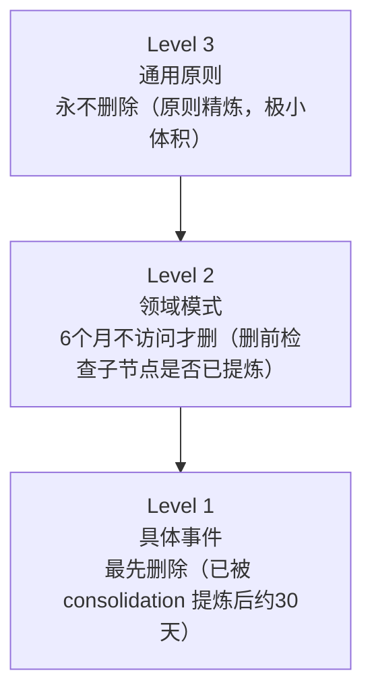

# Agent 记忆的认知科学基础

> 记忆不是硬盘。人类记忆是建构性的、层级性的、会遗忘的——最好的 Agent 记忆系统应该模仿这些"缺陷"，而不是消除它们。

---

## 1. 互补学习系统理论（CLS）

**来源**：McClelland, McNaughton & O'Reilly (1995), *Psychological Review*

这是神经科学对记忆的主流模型，直接映射到 Agent 记忆架构：

| 大脑结构 | 功能 | Agent 对应 | 特征 |
|----------|------|-----------|------|
| **海马体** | 快速编码具体事件 | 实时记忆写入（对话中提取信息） | 高保真、低泛化、快速 |
| **睡眠重放** | 离线重放巩固记忆 | Cron 固化任务（nightly consolidation） | 选择性重放，不是全部 |
| **新皮层** | 慢速提取通用模式 | 抽象阶梯（具体教训→领域模式→通用原则） | 高泛化、低保真、慢速 |

**核心洞察**：两个系统互补而非冗余。海马体快但脆弱（具体记忆容易干扰），新皮层慢但稳健（抽象模式不怕具体细节变化）。Agent 记忆同理：Working Memory（上下文窗口）快但会被截断，Long-term Memory（外部存储）慢但持久。

**工程含义**：
- 记忆写入应该有两条路径：快速路径（直接写 episodic log）+ 慢速路径（consolidation 提炼 semantic memory）
- 不能只有一条路——只有快速路径 = 永远是碎片；只有慢速路径 = 丢失细节

---

## 2. 睡眠固化与抽象提取

**来源**：Diekelmann & Born (2010), *Nature Reviews Neuroscience*

关键实验发现：**睡眠不只是巩固记忆，而是转化记忆**。

实验：让受试者学习一组具体数字序列，序列中隐藏着一个抽象规则。
- 清醒组：记住了具体序列，但很少发现隐藏规则
- 睡眠组：不仅记住序列，还**自发发现了抽象规则**

→ 睡眠促进的不是"记得更牢"，而是"理解得更深"。

**Agent 映射——抽象阶梯（Abstraction Ladder）**：

```
Level 1（具体教训）: "config.patch 操作 accounts 时不能用占位符"
   ↓ 睡眠固化提炼
Level 2（领域模式）: "涉及凭证的配置操作，必须先获取完整现有配置再修改"
   ↓ 进一步抽象
Level 3（通用原则）: "不可逆操作前，确认你拥有完整的当前状态快照"
```

这映射了人类专家的成长路径：
- **初级工程师**记住具体修复方法（Level 1）
- **高级工程师**识别跨场景的模式（Level 2）
- **首席工程师**运用超越具体领域的原则（Level 3）

**bioRxiv 2025 补充**："Sparse episodic replay creates compositional representations in semantic memory"——不需要重放所有记忆，稀疏采样就能自然分解为可复用的语义组件。这验证了选择性固化（不是全量 consolidation）的合理性。

**工程含义**：
- 日常 session-distiller 应在提取原文的基础上，增加 LLM 总结步骤提炼 Level 1 教训
- 每周 cron 聚类相似教训，提炼 Level 2 模式
- 每月从 Level 2 提炼 Level 3 原则，写入 SOUL.md 或 MEMORY.md

---

## 3. 扩散激活理论（Spreading Activation）

**来源**：Collins & Loftus (1975), *Psychological Review*

人类语义记忆不是平铺的词条列表，而是**网络**。当一个概念被激活，激活能量沿关联边传播到邻近概念。

```
"度假" 被激活
   │
   ├──→ "海滩"（高关联）→ "防晒霜"
   ├──→ "朋友推荐的餐厅"（情景关联）
   └──→ "请假"（时间关联）→ "工作压力"
```

传统 Agent 记忆用 embedding 余弦相似度检索——这只能找到**语义相似**的记忆。但因果相关的记忆往往语义不相似：

- "SSL 证书过期" 和 "第二天很焦虑" → embedding 距离远，但因果相关
- "Gateway 停摆 11 小时" 和 "LaunchAgent 标记 stopped 但进程存活" → embedding 距离远，但模式相同

**Synapse 论文**（University of Georgia, 2026, arXiv:2601.02744）将此理论工程化：
- 双触发器：词法匹配 + 语义匹配，同时激活锚点
- 能量有界的图遍历：从锚点出发沿边传播，能量衰减防止过远
- 侧向抑制：抑制噪音节点，保留强信号
- 结果：**多跳推理准确率 +23%，token 消耗减少 95%**

**三种关联边类型**：

| 边类型 | 含义 | 示例 |
|--------|------|------|
| **时间边** | 同一对话/时间窗口内的记忆 | "部署失败"和"投资人会议"在同一天 |
| **语义边** | embedding 相似度 top-N | "SSL 过期"和"TLS 配置错误" |
| **因果边** | 一个事件导致另一个 | "调度冲突"→"焦虑"→"周三早上封闭" |

**工程含义**：
- 记忆系统需要维护轻量级关联图（可以是 SQLite 邻接表，不需要图数据库）
- 检索时先 embedding 找锚点，再沿图边扩展 1-2 跳
- 时间边最容易实现（同一 session 的记忆自动关联），也最有价值

---

## 4. 遗忘的认知科学

### 4.1 遗忘不是 bug

人类遗忘的主流理论不是"存储衰退"，而是**检索竞争**（Anderson, 2003）：旧记忆不是消失了，是被新的、更相关的记忆抑制了。

**进化意义**：遗忘是信息过滤器。记住所有细节的人（如 hyperthymesia 超忆症患者）反而在抽象推理和决策上表现更差——被细节淹没，看不到模式。

### 4.2 遗忘金字塔



**Access-based decay**：每次检索更新 `lastAccessed` 和 `accessCount`，频繁访问的记忆存活更久——这是 ACT-R 理论（Anderson, 1993）的工程化：base-level activation = 使用频率 × 时间衰减。

**空间感知模式**：磁盘超阈值时，从 Level 1 开始清理，永远不动 Level 3。这保证了 Raspberry Pi 和云服务器运行相同架构，只是遗忘速度不同。

### 4.3 记忆的建构性

**来源**：Bartlett (1932), *Remembering*

Bartlett 的经典实验：让英国受试者阅读一个北美原住民故事，然后多次复述。结果：每次复述都在**重新建构**——不熟悉的元素被替换为熟悉的，叙事被简化为符合自己文化框架的版本。

**核心发现**：记忆不是录像回放，是基于当下认知框架的重建。

**Agent 含义**：
- 纯粹的"精确记忆"可能不是最优解
- Level 3 原则之所以有力量，恰恰因为它**丢失了细节**
- 每次涅槃（记忆重构）不只是删字，是用新认知重新审视旧记忆
- → 定期用当前认知水平重新评估 Level 2 摘要，而非只是被动保留

---

## 5. Primacy-Recency Effect 与记忆注入策略

**来源**：Liu et al. (2023), "Lost in the Middle", arXiv:2307.03172

LLM 对上下文窗口中信息的注意力呈 U 型分布：开头和结尾的信息获得最多注意，中间的信息"丢失"。

**对记忆注入的指导**：
- 注入 20 条原始记忆 → 位置 5-15 的信息几乎被忽略
- 注入 3-5 条精炼的层级摘要 → 更少的 context = 更少的 "中间" = 更少的信息丢失
- **最优注入顺序**：Level 3 原则放开头（primacy）→ Level 2 模式放中间 → Level 1 细节放结尾（recency）

**量化收益**：抽象阶梯将典型检索从 5000+ tokens（dumping raw episodes）降至 500-1500 tokens。

---

## 6. 现有 Agent 记忆方案对比

| 方案 | 核心理论 | 存储 | 特色 | 局限 |
|------|----------|------|------|------|
| **OpenClaw memory-lancedb** | 平坦向量检索 | LanceDB | 简洁、开箱即用 | 无层级、无关联、无遗忘 |
| **Hexis**（ehartford） | 5 层记忆 + 图关联 | PG + pgvector + AGE | 最完整的类型分类 | 重基础设施 |
| **agent-memory-ultimate**（globalcaos） | CLS + Spreading Activation | SQLite + sqlite-vec | 全本地、7 阶段实现 | 150 文件，可能过度工程 |
| **mnemon** | 四图知识存储 + BFS | SQLite + Go binary | LLM-supervised，轻量 | 无层级摘要 |
| **Mem0** | 语义记忆 + 实体提取 | SQLite/PG | 25K stars，经过验证 | 无图关联、无固化 |
| **Synapse** | Spreading Activation | 研究原型 | +23% 多跳准确率 | 未工程化 |
| **LangMem SDK** | 三类记忆（episodic/semantic/procedural） | 可插拔 | LangChain 生态 | 无固化 cron |
| **ZEP** | 时间知识图谱 | 自研 | 图 + 时间推理 | 商业产品 |

---

## 7. 对我们军团的启示

基于上述理论，我们的记忆系统升级方向：

1. **抽象阶梯**（CLS 理论 + 睡眠固化）→ 升级 session-distiller，从原文提取进化为三级提炼
2. **Procedural Memory**（操作记忆追踪）→ 结构化记录操作成功率，执行前自动查询
3. **遗忘金字塔**（ACT-R + 检索竞争）→ memory/ 目录自动衰减，Level 3 永不删
4. **关联图**（Spreading Activation）→ 轻量级邻接表，时间边 + 语义边
5. **建构性重评**（Bartlett）→ 涅槃不只是删字，是用新认知重建旧记忆

---

## 参考文献

- McClelland, McNaughton & O'Reilly (1995). Why There Are Complementary Learning Systems in the Hippocampus and Neocortex. *Psychological Review*.
- Diekelmann & Born (2010). The memory function of sleep. *Nature Reviews Neuroscience*.
- Collins & Loftus (1975). A Spreading-Activation Theory of Semantic Processing. *Psychological Review*.
- Anderson (1993). Rules of the Mind. *Lawrence Erlbaum*.（ACT-R 理论）
- Bartlett (1932). *Remembering: A Study in Experimental and Social Psychology*. Cambridge.
- Liu et al. (2023). Lost in the Middle: How Language Models Use Long Contexts. arXiv:2307.03172.
- Jiang et al. (2026). Synapse: Spreading Activation for LLM Agents. arXiv:2601.02744.
- Sarthi et al. (2024). RAPTOR: Recursive Abstractive Processing for Tree-Organized Retrieval. ICLR 2024.
- Shinn et al. (2023). Reflexion: Language Agents with Verbal Reinforcement Learning. NeurIPS 2023.
- Xu et al. (2025). A-MEM: Agentic Memory for LLM Agents. NeurIPS 2025.

---

_创建：2026-02-28 | 源自 OpenClaw Issue #13991 的深度阅读_
