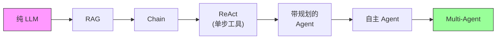
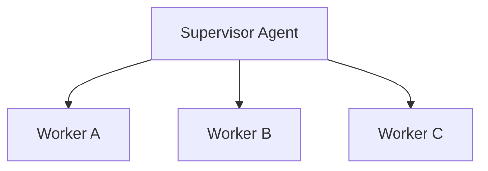
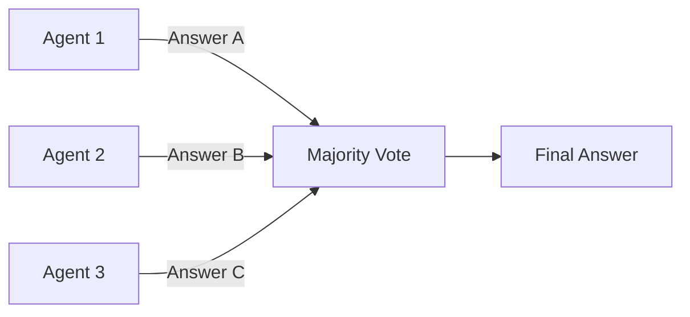
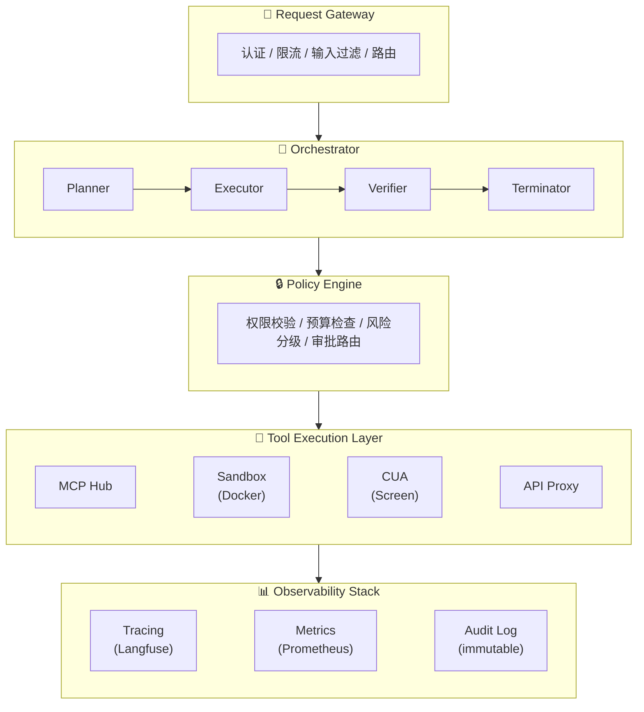

# AI Agent 2026 技术全景（面试武器版）

> **定位**：这不是泛泛综述，而是一份**面试武器库**——围绕面试官会问的核心问题，给出深度回答 + 技术细节 + 加分话术。每一节都可以直接拿来当面试答案用。
>
> **信息源**：综合 2026 年最新 survey（arXiv 2601.01743、2601.12560、2510.25445）、主流框架对比、生产级系统设计指南，以及 Vault 内部笔记（Agent World Model、Agent Skills Security、Evaluating AGENTS.md）。

---

## 目录

1. [Agent 是什么？和传统 RAG/Chain 的本质区别](#1-agent-是什么和传统-ragchain-的本质区别)
2. [主流 Agent 架构对比](#2-主流-agent-架构对比)
3. [Agent 的记忆系统设计](#3-agent-的记忆系统设计)
4. [Tool Use 与 Function Calling 的工程实践](#4-tool-use-与-function-calling-的工程实践)
5. [Multi-Agent 协作模式](#5-multi-agent-协作模式)
6. [Agent 安全与对齐](#6-agent-安全与对齐)
7. [Agent 评测](#7-agent-评测)
8. [2026 年 Agent 方向的关键趋势](#8-2026-年-agent-方向的关键趋势)
9. [实战经验：如何从零搭建一个生产级 Agent 系统](#9-实战经验如何从零搭建一个生产级-agent-系统)
10. [高频面试题 + 参考答案](#10-高频面试题--参考答案)

---

## 1. Agent 是什么？和传统 RAG/Chain 的本质区别

### 面试官会问：「请解释 AI Agent 和传统 RAG pipeline、LangChain 式 Chain 的本质区别」

### 核心概念

AI Agent 是**结合 foundation model 与推理、规划、记忆、工具使用能力的系统**，能在多步执行循环中自主地观察环境、制定计划、调用工具、验证结果（[Xu et al., 2026, arXiv:2601.01743](https://arxiv.org/abs/2601.01743)）。

关键判别标准有三个：

| 维度 | Agent | RAG Pipeline | Chain |
|------|-------|-------------|-------|
| **决策自主性** | 自主决定下一步做什么 | 检索路径预定义 | 步骤序列固定 |
| **环境交互** | 观察 → 行动 → 反馈循环 | 单次检索-生成 | 无环境感知 |
| **时间跨度** | 跨多步维持目标和上下文 | 单次 request-response | 单次 pipeline |
| **适应性** | 根据中间结果动态调整策略 | 无适应 | 无适应 |
| **失败恢复** | 自我反思、重试、换策略 | 无 | 无 |

**一个精确的类比**：
- **Chain** = 生产线上的自动化流水线（每个步骤固定，顺序执行）
- **RAG** = 带搜索引擎的问答系统（检索→注入→生成，路径确定）
- **Agent** = 给了任务目标的实习生（自己决定怎么查、怎么做、做完了没有）

### 技术细节

Agent 的核心执行循环可以用 POMDP（Partially Observable Markov Decision Process）形式化：
- **状态空间 S**：环境状态（DB、文件系统、API 响应等）
- **动作空间 A**：工具调用、代码执行、API 请求
- **观察空间 O**：工具返回值、环境反馈
- **转移函数 T**：工具代码执行导致的状态变化
- **奖励函数 R**：任务是否完成的判定

与 RAG 的关键区别在于**反馈循环的存在**。RAG 是 open-loop（开环控制）：检索→生成，没有验证环节。Agent 是 closed-loop（闭环控制）：执行→观察结果→判断是否需要调整→继续或终止。

Agent 的「agentic 程度」是一个**光谱而非二元**：


> **agentic 程度递增** →

### 面试加分回答

> 「我会强调 agentic 是一个 spectrum，不是 binary。生产系统通常处于中间位置——比如有 human-in-the-loop 审批门禁的 Agent 比完全自主的 Agent 'less agentic'，但这是一个 design choice 而非 technical limitation。
>
> 判断要不要用 Agent 架构，我有四个反面检查：
> 1. 如果能画出完整 flowchart → 用 workflow engine（Temporal/Airflow）
> 2. 如果失败不可逆且后果严重 → 不用 Agent 做 primary actor
> 3. 如果 SLA < 200ms → Agent loop 的延迟不可接受
> 4. 如果无法定义 'done' → Agent 会陷入无限循环
>
> 最好的 Agent 架构往往是从传统系统演进过来的——只在确实需要灵活性的环节引入 agentic 能力。」

---

## 2. 主流 Agent 架构对比

### 面试官会问：「ReAct、Plan-and-Execute、Reflexion、LATS、Multi-Agent 这些架构各有什么特点？什么场景选哪个？」

### 核心概念

2024-2026 年 Agent 架构可以分为**五大范式**：

#### 2.1 ReAct（Reasoning + Acting）

> 来源：[Yao et al., "ReAct: Synergizing Reasoning and Acting in Language Models", arXiv:2210.03629](https://arxiv.org/abs/2210.03629)

**核心思想**：交替进行推理（Thought）和行动（Action），每步都输出思考过程再执行工具调用。

```
Thought: 用户要查北京天气，我需要调用天气 API
Action: weather_api(city="Beijing")
Observation: 晴，25°C
Thought: 已获取结果，可以回答
Answer: 北京今天晴天，25°C
```

**优点**：简单直觉、推理过程可解释、容易 debug
**缺点**：每步都要推理，latency 高；无全局规划，容易走弯路；长任务中容易 "lose the plot"
**适用场景**：步骤少（<5 步）、交互式任务、需要可解释性

#### 2.2 Plan-and-Execute

**核心思想**：先制定完整计划，再逐步执行。Planner 和 Executor 分离。

```
Plan: [1. 搜索航班 → 2. 比价 → 3. 选最便宜的 → 4. 填写信息 → 5. 下单]
Execute Step 1: search_flights(...)
Execute Step 2: compare_prices(...)
...（如果中间发现计划不可行，Replan）
```

**优点**：全局视角、减少冗余步骤、Planner 和 Executor 可以用不同 model（Planner 用强模型，Executor 用快模型）
**缺点**：初始规划可能不准确；replan 代价高；过度规划（over-planning）是常见 failure mode
**适用场景**：复杂多步任务、需要全局优化、步骤数 > 5

#### 2.3 Reflexion

> 来源：[Shinn et al., "Reflexion: Language Agents with Verbal Reinforcement Learning", NeurIPS 2023, arXiv:2303.11366](https://arxiv.org/abs/2303.11366)

**核心思想**：在 ReAct 基础上增加**自我反思**循环。执行失败后，Agent 生成反思（"我哪里做错了？"），将反思写入 memory，下次尝试时参考。

```
Attempt 1: 执行任务 → 失败
Reflection: "我忽略了 API 需要认证，下次应该先获取 token"
Attempt 2: 先获取 token → 执行任务 → 成功
```

**优点**：从失败中学习、不需要微调模型（纯 prompting）、跨 episode 迁移经验
**缺点**：需要多次尝试，cost 翻倍；反思质量依赖模型能力；可能反思出错误结论
**适用场景**：容错度高、可以多次尝试、任务本身有明确的成功/失败信号

#### 2.4 LATS（Language Agent Tree Search）

> 来源：[Zhou et al., "Language Agent Tree Search Unifies Reasoning Acting and Planning in Language Models", arXiv:2310.04406](https://arxiv.org/abs/2310.04406)

**核心思想**：将 MCTS（蒙特卡洛树搜索）引入 Agent 决策。在每个决策点展开多个可能的行动，评估价值，选择最优路径。

```
State → [Action A, Action B, Action C]
         ↓ 评估    ↓ 评估    ↓ 评估
      Value=0.8   Value=0.3  Value=0.6
         ↓ 选择 A
    Next State → [Action D, Action E]
                   ...
```

**优点**：探索性强、能找到更优解、自带 backtracking
**缺点**：计算开销巨大（需要多次 LLM 调用做 evaluation）；不适合实时场景；实现复杂
**适用场景**：搜索密集型任务（代码生成、数学推理）、offline 场景、追求准确率而非速度

#### 2.5 Multi-Agent

**核心思想**：多个专业化 Agent 协作完成任务。每个 Agent 有独立的 role、tools 和 memory。

（详见第 5 节 Multi-Agent 协作模式）

### 架构选型速查表

| 场景 | 推荐架构 | 理由 |
|------|---------|------|
| 简单工具调用 (1-3 步) | ReAct | 快速、可解释 |
| 复杂工作流 (5+ 步) | Plan-and-Execute | 需要全局规划 |
| 代码生成/Debug | Reflexion 或 LATS | 需要试错和自我改进 |
| 实时对话 + 工具 | ReAct | 延迟敏感 |
| 多领域协作 | Multi-Agent | 专业化分工 |
| 研究/探索性任务 | LATS | 需要深度搜索 |

### 面试加分回答

> 「选架构不是选 '最强的'，而是选 '最匹配的'。我的经验是：
>
> 1. **先从最简单的开始**——90% 的生产场景 ReAct 就够了
> 2. **Plan-and-Execute 的最大风险是 over-planning**——我见过 Agent 把 '查个地址' 分解成 47 个子任务
> 3. **Reflexion 的 ROI 很高但需要成功/失败信号**——如果你的任务没有明确的验证方式，反思就无从下手
> 4. **LATS 是研究利器但很少上生产**——每个 decision point 要展开 3-5 个分支，成本是 ReAct 的 10-20x
>
> 实际生产中我倾向**混合架构**：Plan-and-Execute 做高层规划，ReAct 做每步执行，关键节点加 Reflexion。这种分层设计既有全局视角又保持灵活性。」

---

## 3. Agent 的记忆系统设计

### 面试官会问：「Agent 的记忆系统怎么设计？短期记忆、长期记忆、外部记忆分别怎么实现？」

### 核心概念

Agent 的记忆系统通常分为**三层**（类比人类认知科学的记忆模型）：

| 记忆类型 | 类比 | 实现方式 | 持久性 | 容量 |
|---------|------|---------|--------|------|
| **Working Memory** | 工作记忆 / 注意力 | Context window + Scratchpad | 当前 session | 受 context length 限制 |
| **Episodic Memory** | 情景记忆 | 执行轨迹记录 + 向量检索 | 跨 session | 向量数据库存储 |
| **Semantic Memory** | 语义记忆 / 知识 | 长期知识库 + 用户偏好 | 永久 | 无限（外部存储） |

#### Working Memory（工作记忆）

这是 Agent 在**当前任务执行过程中**的上下文：

- **Context window**：对话历史 + system prompt + 工具输出
- **Scratchpad**：Agent 的中间推理笔记（类似 Chain-of-Thought 的中间输出）
- **Task state**：当前任务的进度追踪

**核心挑战**：Context window 是有限资源。生产级 Agent 执行 20+ 步后，context 膨胀会导致：
1. 成本指数级增长（token 计费）
2. Lost-in-the-middle 问题（模型关注头尾，忽略中间信息）
3. 性能下降（context 过长导致推理质量下降）

**工程解法**：
- **Context pruning**：定期裁剪旧的工具输出，保留最近 N 轮
- **Summarization**：将历史步骤压缩为摘要
- **Sliding window + summary**：最近 K 步保留原文，更早的步骤压缩

#### Episodic Memory（情景记忆）

记录 Agent **过去执行任务的经验**，供未来参考：

- **执行轨迹**：(state, action, observation, reward) 序列
- **成功/失败案例**：哪些策略有效，哪些无效
- **Reflexion memories**：自我反思的结论

**实现方式**：
```python
# 典型的 episodic memory 存储
{
    "task": "修复 Django ORM N+1 查询问题",
    "trajectory": [...],
    "outcome": "success",
    "reflection": "先用 django-debug-toolbar 定位慢查询，再用 select_related 优化",
    "embedding": [0.12, -0.34, ...],  # 用于相似任务检索
    "timestamp": "2026-02-19"
}
```

检索时，当 Agent 接到新任务，先在 episodic memory 中搜索相似任务，将相关经验注入 context。

#### Semantic Memory（语义记忆）

Agent 的**长期知识库**，不绑定特定执行 episode：

- **用户偏好**：「用户喜欢简洁回复」「用户的代码风格是...」
- **领域知识**：API 文档、公司内部规范、业务规则
- **World knowledge**：通过 RAG 接入的外部知识

**实现方式**：向量数据库（Pinecone/Weaviate/Chroma）+ 结构化存储（SQL/KV）

### 技术细节

**MemGPT（2023）的创新**（[Packer et al., arXiv:2310.08560](https://arxiv.org/abs/2310.08560)）：借鉴操作系统的**虚拟内存**概念：
- Main context = 内存（快但小）
- External storage = 磁盘（慢但大）
- LLM 自己决定何时 "page in / page out"——自主管理内存换入换出

**Agent World Model（2026，Vault 关联笔记）的做法**：
- 每个环境的状态后端用 **SQLite** 存储，保证状态一致性
- 工具输出作为 observation 进入 working memory
- 通过 MCP 统一接口暴露所有环境状态

### 面试加分回答

> 「记忆系统设计我关注三个核心 trade-off：
>
> 1. **容量 vs 相关性**：不是记得越多越好。注入太多历史经验反而干扰当前决策。我会做 relevance filtering——只注入与当前任务 cosine similarity > 0.8 的经验。
>
> 2. **Context window 管理是 Agent 的头号工程挑战**。我们做过实测（参考 Evaluating AGENTS.md 论文）：context 超过 80K tokens 后，Agent 的任务成功率开始下降。解法是分层：最近 3 步原文保留，3-10 步压缩摘要，10 步以前丢弃工具输出只保留 action+result 摘要。
>
> 3. **记忆更新的时机**：不是每步都写入长期记忆，而是在任务结束后做 reflection，提取 transferable insight 写入。否则记忆库会被噪音淹没。
>
> 实战中我发现最被低估的是 episodic memory——它让 Agent 从 '每次从零开始' 进化到 '越用越好'。」

---

## 4. Tool Use 与 Function Calling 的工程实践

### 面试官会问：「Agent 的 Tool Use 在工程上怎么落地？Function Calling 有哪些坑？」

### 核心概念

Tool Use 是 Agent 区别于纯 LLM 的**关键能力**——将语言理解转化为可执行的动作（早期里程碑：[Schick et al., "Toolformer", arXiv:2302.04761](https://arxiv.org/abs/2302.04761) 证明 LLM 可自主学会调用工具）。核心链路：

```
用户意图 → LLM 理解 → 选择工具 → 生成参数 → 执行 → 解析结果 → 继续推理
```

#### Function Calling 的三种模式

| 模式 | 代表 | 特点 |
|------|------|------|
| **Native Function Calling** | OpenAI / Claude / Gemini | 模型原生支持 JSON schema tool 定义，输出结构化的 function call |
| **ReAct-style** | 开源模型 + prompting | 通过 prompt 描述工具，模型输出文本格式的调用，外部解析 |
| **Code Generation** | 代码执行型 Agent | 模型生成代码来调用工具，更灵活但风险更高 |

#### MCP（Model Context Protocol）—— 2026 年的工具连接标准

MCP 是 Anthropic 于 2024 年 11 月推出、2025 年 12 月捐赠给 Agentic AI Foundation 的**开放协议**（[MCP Specification](https://spec.modelcontextprotocol.io)），类比 Tool Use 领域的 "USB 标准"：

```
MCP Client (Agent)  ←JSON-RPC 2.0→  MCP Server (Tool Provider)
```

**核心设计**：
- **Tools**：可执行的操作（搜索、写文件、调 API）
- **Resources**：可读的数据源（文档、数据库视图）
- **Prompts**：工具提供者建议的 prompt 模板
- **Sampling**：Server 可以请求 Client 的 LLM 进行推理

**为什么 MCP 重要**（Vault 关联：Agent World Model 笔记）：
- Agent World Model 论文用 MCP 作为所有 1,000 个合成环境的统一接口——证明了 MCP 在 Agentic RL 中的可扩展性
- 35,062 个工具通过 MCP 暴露给 Agent，实现了环境的即插即用

### 技术细节

#### 工具选择的工程挑战

当工具数量超过 20 个时，把所有工具描述塞进 context 会导致：
1. **Token 浪费**：每个工具描述 ~100-500 tokens
2. **选择困难**：工具太多，模型选错率上升
3. **Prompt 膨胀**：context 被工具描述占满，留给任务的空间不足

**解法——Progressive Skill Loading**（参考 Vault Agent Skills Security 笔记）：

三级渐进式披露（类似 Skill 架构的设计）：
- **Level 1**：系统启动只加载工具名 + 一行描述（~几十 token/tool）
- **Level 2**：当 Agent 选择某个工具时，加载完整参数 schema
- **Level 3**：执行时按需加载示例和文档

#### Function Calling 的常见坑

| 问题 | 现象 | 解法 |
|------|------|------|
| **参数幻觉** | 模型编造不存在的参数值 | 严格 JSON schema 校验 + enum 约束 |
| **工具选择错误** | 选了功能相近但不对的工具 | 工具命名差异化 + 负面示例 |
| **嵌套调用** | 模型试图一次调用多个工具 | 限制单步单工具 + 并行 tool calling |
| **结果解析失败** | 工具返回非预期格式 | 统一 result schema + 错误处理包装 |
| **幂等性问题** | 重试导致副作用重复执行 | 工具层实现幂等 + 去重 ID |

#### 工具执行的安全沙箱

生产级系统中，工具执行**必须**沙箱化：
- **代码执行**：Docker 容器 / gVisor / 受限 Python 环境
- **API 调用**：通过 proxy 限制网络访问范围
- **文件操作**：chroot / 受限目录
- **Token/Cost 预算**：orchestrator 层硬性限制

### 面试加分回答

> 「Tool Use 的核心工程挑战不是 '让 LLM 调用工具'——这一步 native function calling 已经解决得很好了。真正的难题是三个：
>
> 1. **工具发现与路由**：当你有 100+ 个工具时，怎么让 Agent 高效找到对的那个？我们的做法是两级路由：先用 embedding 搜索缩小到 5-10 个候选，再让 LLM 从候选中精选。
>
> 2. **错误恢复**：工具调用失败是常态（API timeout、rate limit、参数错误）。设计层面必须考虑 retry strategy（指数退避 + 换参数重试 + 降级策略）。我们在 orchestrator 里实现了三层 fallback。
>
> 3. **MCP 正在成为 de facto standard**。2026 年的趋势是所有工具提供者都暴露 MCP 接口，Agent 框架都支持 MCP 消费。这类似于 REST API 统一了 web 服务调用——MCP 正在统一 Agent-Tool 的连接方式。我们在 Agent World Model 的实验中验证了 MCP 在 1,000 个环境、35,000+ 工具规模下的可行性。」

---

## 5. Multi-Agent 协作模式

### 面试官会问：「Multi-Agent 系统有哪些协作模式？各有什么 trade-off？」

### 核心概念

Multi-Agent 系统让多个专业化 Agent 协作完成复杂任务。2026 年主流的协作模式有五种：

#### 5.1 Hierarchical（层级式）



**机制**：一个 Supervisor Agent 分解任务、分配给 Worker Agent、汇总结果
**代表框架**：CrewAI（role-based hierarchy）、LangGraph（supervisor node）
**优点**：职责清晰、容易控制、可观测性好
**缺点**：Supervisor 成为瓶颈和单点故障；Worker 间无法直接沟通

#### 5.2 Debate / Adversarial（辩论式）

```
Agent A → 提出方案
Agent B → 提出反对意见
Agent C → 综合判断
```

**机制**：多个 Agent 就同一问题提出不同观点，通过辩论收敛到更好的答案
**代表**：Society of Mind、DebateGPT
**优点**：减少单个 LLM 的偏见；提高推理质量；自然的错误检测
**缺点**：对话轮次多，cost 高；可能陷入无效争论；收敛不保证

#### 5.3 Voting / Ensemble（投票式）



**机制**：多个 Agent 独立执行相同任务，通过投票或加权选择最终结果
**优点**：简单、robust、减少单次错误的影响
**缺点**：cost 线性增长；不适合需要协作的任务；需要任务有明确的正确/错误标准

#### 5.4 Market Mechanism（市场机制）

```
Task Pool → Agent 竞标 → 中标者执行 → 结果验证 → 奖惩
```

**机制**：Agent 就任务进行竞价，根据能力匹配程度分配任务，执行结果影响未来声誉
**代表**：ChatDev（role-based market）、MetaGPT
**优点**：自然的负载均衡；激励机制驱动质量提升；去中心化
**缺点**：设计复杂；市场效率依赖参与者数量；冷启动问题

#### 5.5 Conversation-based（对话式协作）

```
Agent A ←对话→ Agent B ←对话→ Agent C
```

**机制**：Agent 通过自然语言对话协调工作，类似人类团队的即时通讯
**代表框架**：AutoGen（[Wu et al., arXiv:2308.08155](https://arxiv.org/abs/2308.08155)，conversable agents）
**优点**：灵活、自然、容易加入人类参与者
**缺点**：对话开销大（每轮都是 LLM 调用）；难以保证一致性；debug 困难

### 框架对比（2026 最新）

| 框架 | 核心模式 | 优势 | 劣势 | 适用场景 |
|------|---------|------|------|---------|
| **LangGraph** | Graph-based state machine | 灵活、可控、支持 breakpoint | 学习曲线陡 | 复杂分支工作流 |
| **CrewAI** | Role-based hierarchy | 上手快、Time-to-Production 快 40% | 灵活性不如 LangGraph | 标准业务工作流 |
| **AutoGen** | Conversation-based | 灵活、支持 human-in-loop | 对话开销大、一致性难保证 | 研究实验、开放性任务 |
| **OpenAI Swarm** | Lightweight handoff | 极简、官方支持 | 功能较少、无持久化 | 原型开发 |
| **Semantic Kernel** | Enterprise integration | 深度集成 Microsoft 生态 | 生态锁定 | 企业级 .NET/Azure 场景 |

### 面试加分回答

> 「Multi-Agent 的核心 trade-off 是**协调成本 vs 任务复杂度**。我的选择原则：
>
> 1. **如果一个 Agent 能做完，就不用 Multi-Agent**——每增加一个 Agent，调试复杂度指数增长
> 2. **Hierarchical 是生产环境的默认选择**——因为可观测性最好，出了问题能追踪到具体哪个 Worker
> 3. **Debate 模式在需要高质量推理的场景 ROI 最高**——比如法律分析、代码 review、安全审计
> 4. **框架选择上，LangGraph 做复杂流控，CrewAI 做快速原型**——我们的做法是 LangGraph 做骨架，内部 node 用 CrewAI 组队
>
> 一个关键的 anti-pattern 是：让 Agent 通过自然语言协调精确信息（数字、JSON、代码）。自然语言是 lossy channel——必须用结构化数据传递精确信息，只用自然语言传递意图和判断。」

---

## 6. Agent 安全与对齐

### 面试官会问：「Agent 系统的安全风险有哪些？怎么防护？」

### 核心概念

Agent 的安全问题比纯 LLM 严重 **数量级**——因为 Agent 能**执行动作**。一个被攻击的 chatbot 最多输出有害文本；一个被攻击的 Agent 可以删数据库、转账、发邮件。

#### 六大安全威胁

| 威胁 | 描述 | 严重性 |
|------|------|--------|
| **Prompt Injection（直接）** | 用户在输入中注入恶意指令，劫持 Agent 行为 | 🔴 Critical |
| **Indirect Prompt Injection** | 恶意指令藏在工具返回的数据中（网页、邮件、文档） | 🔴 Critical |
| **Tool Misuse** | Agent 误用工具导致意外副作用（删错文件、发错邮件） | 🟠 High |
| **Supply Chain Attack** | 恶意 Skill/Plugin 包含后门代码 | 🔴 Critical |
| **Data Exfiltration** | Agent 被诱导将敏感数据发送到外部 | 🔴 Critical |
| **Infinite Loop / Resource Exhaustion** | Agent 陷入循环，消耗大量 token/API 调用 | 🟡 Medium |

#### Skill 供应链安全（Vault 关联：Agent Skills Security 笔记）

Agent Skills Security 论文（[Xu et al., arXiv:2602.12430](https://arxiv.org/abs/2602.12430)）揭示了一个严峻现实：**26.1% 的社区 skill 含安全漏洞**。

三类漏洞：
1. **权限过度**：Skill 请求不必要的系统权限
2. **代码注入**：Skill 中的脚本包含恶意代码
3. **数据泄露**：Skill 将敏感信息外传

论文提出的 **Skill Trust and Lifecycle Governance Framework**：
- **注册时**：静态代码分析 + 权限审计
- **运行时**：沙箱执行 + 最小权限原则
- **生命周期**：版本管理 + 漏洞通报 + 自动撤回

### 技术细节

#### 防护四层模型

```
Layer 4: Monitoring & Audit   ← 事后追溯
Layer 3: Policy Engine        ← 执行前验证
Layer 2: Sandbox Execution    ← 隔离执行
Layer 1: Input/Output Guard   ← 输入输出过滤
```

**Layer 1 — Input/Output Guard**：
- 输入过滤：检测 prompt injection 模式（regex + 分类器）
- 输出过滤：阻止 PII 泄露、有害内容生成
- 工具结果过滤：检测工具返回的数据中是否含恶意指令

**Layer 2 — Sandbox Execution**：
- 代码执行：Docker / gVisor 隔离
- 网络访问：白名单制
- 文件系统：只读 + 受限写入路径
- 资源限制：CPU / memory / time 硬上限

**Layer 3 — Policy Engine**（最关键的一层）：
```python
# Policy engine 伪代码
class PolicyEngine:
    def validate_action(self, action: AgentAction) -> PolicyDecision:
        # 1. 动作分类
        risk_level = classify_risk(action)  # read-only | reversible-write | irreversible-write | external-comm
        
        # 2. 权限检查
        if action.tool not in agent.allowed_tools:
            return DENY("Tool not in allowlist")
        
        # 3. 预算检查
        if agent.budget.remaining_tokens < estimate_cost(action):
            return DENY("Budget exhausted")
        
        # 4. 审批路由
        if risk_level >= IRREVERSIBLE_WRITE:
            return REQUIRE_APPROVAL(action)
        
        return ALLOW(action)
```

**Layer 4 — Monitoring & Audit**：
- 全链路 tracing（每个决策点记录 input/output）
- 异常检测（异常工具调用模式、突增的 API 调用）
- 审计日志（不可篡改、支持事后 replay）

### 面试加分回答

> 「Agent 安全我始终强调一个原则：**边界必须是结构性的（structural），不能是提示性的（prompting）**。
>
> 'Please do not access unauthorized data' 在 system prompt 里不算安全措施——LLM 不执行任何东西，它只生成文本。真正的安全是：如果 Agent 尝试调用不在 allowlist 里的工具，Policy Engine 直接 reject，不管 LLM 怎么想的。
>
> 具体的安全设计我用 'defense in depth'：
> 1. Input guard 挡住显式的 prompt injection
> 2. Policy engine 限制动作空间（最小权限）
> 3. Sandbox 隔离执行环境
> 4. Monitoring 做事后检测和告警
>
> 2026 年特别需要关注的是 **Indirect Prompt Injection**——当 Agent 搜索网页、读取邮件、处理文档时，这些外部内容可能包含恶意指令。解法是将工具返回的数据标记为 untrusted，不允许这些数据改变 Agent 的行为规则。这和 web security 里的 XSS 防护是一个思路——不信任用户输入（这里是不信任环境输入）。
>
> 另外，Agent Skills Security 的最新研究显示 26.1% 的社区 skill 有漏洞。Skill 生态正处于 'pre-governance phase'——类似 npm 早期没有安全审计。当下关于验证管线和信任层级的决策会影响未来数年的安全态势。」

---

## 7. Agent 评测

### 面试官会问：「怎么评测一个 Agent 系统的质量？有哪些主流 benchmark？」

### 核心概念

Agent 评测比传统 NLP 评测复杂得多——因为 Agent 是**交互式、非确定性、长链路**的系统。

#### 评测维度

| 维度 | 指标 | 说明 |
|------|------|------|
| **任务完成率** | Success Rate / Pass@K | 端到端完成任务的比例 |
| **效率** | Steps / Tokens / API Calls / Cost | 完成任务消耗的资源 |
| **鲁棒性** | Variance / Retry Rate | 多次运行的一致性 |
| **安全性** | Safety Violation Rate | 是否触发了不安全的动作 |
| **可解释性** | Trace Quality | 决策过程是否可追溯和理解 |

#### 主流 Benchmark

**SWE-bench（代码 Agent）**
- **任务**：解决 GitHub 上真实 Python 仓库的 issue
- **规模**：SWE-bench Lite 300 题，Full 2,294 题，Verified 500 题（人工筛选更高质量）
- **2026 进展**：SWE-bench Pro（Scale AI）增加了更复杂的跨文件修改和架构级重构任务
- **当前 SOTA**：~70%（SWE-bench Verified），但在 Full 集上仍有很大差距
- **价值**：最接近现实的 coding agent 评测

**WebArena（Web Agent）**
- **任务**：在真实网站的自部署副本上完成操作（购物、论坛管理等）
- **环境**：6 个真实网站的完整副本（Reddit、GitLab、购物网站等）
- **指标**：Task Success Rate（基于预定义的验证函数）
- **难度**：2025 年底 SOTA 约 35-40%，远低于人类（~78%）
- **价值**：测试 GUI 理解、多步操作、动态环境交互

**AgentBench（综合能力）**
- **任务**：覆盖 8 个不同环境：操作系统、数据库、知识图谱、数字卡牌、横向移动等
- **价值**：多维度评估 Agent 的泛化能力
- **发现**：不同模型在不同环境的表现差异巨大，没有 "全能冠军"

**GAIA（通用助手）**
- **任务**：466 个现实世界问题（需要推理 + 多模态 + 工具使用）
- **三个难度级别**：Level 1 (简单) / Level 2 (中等) / Level 3 (困难)
- **指标**：Exact Match（答案必须精确）
- **2026 SOTA**：Level 1 ~75%，Level 3 仅 ~30%——对比人类 ~92%
- **价值**：最接近 "通用 AI 助手" 的评测

**AGENTbench（Context Files 评测，Vault 关联 [[Evaluating AGENTS.md]]）**
- **来源**：ETH Zurich，[Gloaguen et al., arXiv:2602.11988](https://arxiv.org/abs/2602.11988)
- **任务**：评估 context files（AGENTS.md/CLAUDE.md）对 coding agent 的实际效果
- **关键发现**：LLM 自动生成的 context files **平均降低成功率 0.5-2%**，开发者手写的也仅提升 ~4%
- **价值**：打破 "context files 总是有用的" 迷信

### 技术细节

#### 评测的核心挑战

1. **非确定性**：同一 Agent 对同一任务多次执行可能得到不同结果（temperature、工具返回变化）
   - 解法：多次运行取统计指标（mean + variance），报告 Pass@K

2. **长链路归因**：任务失败时，是哪一步出了问题？
   - 解法：Trace-level 分析，记录每步的 (state, action, observation)

3. **Hidden costs**：单纯的 success rate 不反映真实成本
   - 解法：报告 cost-adjusted metrics（如 "每解决一个 issue 的美元成本"）

4. **环境可变性**：真实环境（API、网站）会变化，影响可重复性
   - 解法：使用 dockerized 环境副本（WebArena 的做法）

### 面试加分回答

> 「评测 Agent 最大的坑是只看 success rate。我会关注四个指标的组合：
>
> 1. **Pass@1 vs Pass@5**：如果 Pass@1 = 30% 但 Pass@5 = 70%，说明 Agent 能力够但稳定性差——这是一个工程问题而非模型能力问题
> 2. **Cost per success**：某些 Agent 在 SWE-bench 上 70% 成功率但每个 issue 花 $5，另一个 65% 但只花 $0.5——生产环境选后者
> 3. **Failure mode 分布**：是工具调用失败？规划失败？还是理解需求失败？不同 failure mode 有不同的解法
> 4. **Tail performance**：那 30% 失败的 case 是什么特征？是不是特定类型的任务系统性失败？
>
> 实际评测时，我会先用 benchmark 做 sanity check，再在实际业务数据上做 domain-specific eval。Benchmark 告诉你 'Agent 有没有基本能力'，domain eval 告诉你 'Agent 在你的场景能不能用'。
>
> 另外一个重要发现（参考 Evaluating AGENTS.md 论文）：**自动生成的 context files 反而可能降低 Agent 表现**。这提醒我们不要盲目追加 context——less is more。」

---

## 8. 2026 年 Agent 方向的关键趋势

### 面试官会问：「2026 年 Agent 领域有哪些重要趋势？你怎么看未来发展？」

### 核心趋势

#### 趋势 1: Agentic Workflows 进入生产

**现状**：2025 年 Agent 还主要在 demo 阶段；2026 年 Salesforce 报告显示 **83% 的企业已经在至少部分团队部署了 AI Agent**，但 **50% 的 Agent 仍在孤岛运行**（> 来源：[Salesforce Connectivity Report 2026](https://www.salesforce.com/news/stories/connectivity-report-2026/)）。

**关键转变**：从 "单个 Agent 做单个任务" → "Agent 编排进入企业工作流"

Gartner 预测：到 2026 年底，**40% 的企业应用将嵌入 AI Agent**（vs 2025 年 < 5%）。

**工程挑战**：
- 如何将 Agent 接入已有的 workflow engine（Temporal/Airflow）
- 如何处理 Agent 与传统微服务的交互
- 如何在企业级权限体系中管理 Agent 的访问控制

#### 趋势 2: CUA（Computer-Use Agent）

**定义**：Agent 直接操作 GUI——像人一样看屏幕、移鼠标、敲键盘。

**技术栈**：
- **VLM**（Vision-Language Model）做 GUI 理解
- **GUI Grounding**：将自然语言指令映射到屏幕上的具体坐标/元素
- **Action Space**：click(x, y)、type(text)、scroll、keyboard shortcut

**2026 进展**：
- Claude Computer Use（Anthropic）进入 public beta
- OpenAI Operator 推出
- CUA benchmark 涌现（ScreenAgent、OSWorld、WindowsArena）

**为什么重要**：
- 很多企业系统没有 API，只有 GUI——CUA 是唯一的自动化路径
- 与 MCP/Tool Use 互补：有 API 用 API，没 API 用 CUA

#### 趋势 3: MCP 成为 de facto 标准

**2025 年底里程碑**：Anthropic 将 MCP 捐赠给 Agentic AI Foundation（Linux Foundation 下属），成为厂商中立的开放标准。

**2026 年生态**：
- 主流框架全面支持：LangGraph、CrewAI、OpenAI Agents SDK
- 企业工具商开始提供官方 MCP Server（Salesforce、SAP、Jira 等传闻中）
- MCP 管理成为 DevOps 新维度（MCP Gateway、MCP Registry）

**类比**：MCP 之于 Agent = REST 之于 Web Service = LSP 之于 IDE

#### 趋势 4: Agent World Model 与 Environment Scaling

**核心问题**：训练 Agent 的瓶颈不在算法，而在环境。

**Agent World Model 论文（[Wang et al., arXiv:2602.10090](https://arxiv.org/abs/2602.10090)，Vault 关联 [[Agent World Model]]）的突破**：
- 将环境合成从手工作坊推向工业化生产
- 1,000 个合成环境、35,062 个工具、10,000 个任务
- 证明仅在合成环境训练的 Agent 在 OOD benchmark 上强泛化

**2026 趋势**：
- Environment-as-Code：用代码生成训练环境
- Synthetic-to-Real transfer：合成环境训练 → 真实世界部署
- Environment scaling law：更多环境 → 更强 Agent（类比 data scaling law）

#### 趋势 5: Agent 治理与标准化

**驱动力**：EU AI Act 等法规开始涉及 agentic 系统；企业对 Agent 的审计需求急增。

**具体方向**：
- Agent 行为审计 trail（不可篡改的决策日志）
- Agent 权限的 RBAC / ABAC 标准化
- Agent 间通信的标准协议（A2A / Agent-to-Agent）
- Skill/Plugin 安全认证体系（参考 Vault Agent Skills Security 笔记的 Governance Framework）

#### 趋势 6: 推理时计算扩展（Inference-Time Scaling）

**核心思想**：不靠训练更大的模型，而是在推理时投入更多计算来提升 Agent 表现。

**表现形式**：
- Chain-of-Thought 增长到数千 token（"thinking" tokens）
- MCTS-style 搜索（LATS）
- Self-consistency / majority voting
- Iterative refinement

**标志事件**：OpenAI o1/o3 系列、DeepSeek-R1 展示了 inference-time scaling 的巨大潜力。

#### 趋势 7: Post-Transformer 架构探索

**2026 新动向**（面试加分项）：
- **State Space Models（SSM / Mamba）**：线性复杂度处理长序列，适合 Agent 的长 context 需求
- **Mixture of Experts（MoE）**：激活部分参数降低推理成本，适合 Agent 的高频调用场景
- **Hybrid 架构**：Transformer 做复杂推理 + SSM 做长序列处理

### 面试加分回答

> 「2026 年 Agent 的关键词是 '从 demo 到 production'。我关注的核心趋势：
>
> 1. **MCP 标准化**是最重要的基础设施变化——它让 Agent 的工具集从 '每家自己接' 变成 '即插即用'。类比 REST 统一了 web service 调用，MCP 正在统一 Agent-Tool 连接。
>
> 2. **CUA 和 API-based Tool Use 的互补**而非替代。有 API 的系统用 function calling，没 API 的用 CUA。生产级 Agent 需要同时具备两种能力。
>
> 3. **Environment Scaling** 可能是下一个 scaling law。Agent World Model 的工作证明了：更多合成环境 → 更强泛化能力。这暗示了一个类似 data scaling 的规律——但这次的 bottleneck 是 environment diversity 而非 data quantity。
>
> 4. **Agent 治理是 2026 下半年的热点**。当 50% 的企业 Agent 还在孤岛运行时，orchestration 和 governance 的需求会爆发。谁做好了 Agent 的 RBAC + audit trail + policy engine，谁就赢了企业市场。
>
> 我对 2027 的预测：Agent 框架会像 web framework 一样整合——最终剩下 2-3 个主流选择，MCP 成为事实标准，CUA 从实验进入生产。」

---

## 9. 实战经验：如何从零搭建一个生产级 Agent 系统

### 面试官会问：「如果让你从零开始搭建一个生产级的 Agent 系统，你会怎么设计？」

### 核心架构



### 搭建步骤

#### Step 1: 从最简单的 ReAct 开始

**不要一上来就 Multi-Agent**。先用单 Agent + ReAct 验证核心功能：

```python
# Day 1 的最小 Agent
while not done and steps < MAX_STEPS:
    thought = llm.think(context)
    action = llm.select_action(thought, tools)
    result = execute_tool(action)
    context.append(action, result)
    done = llm.check_completion(context)
```

这个版本的目标是**验证端到端链路**：用户输入 → LLM 推理 → 工具调用 → 结果返回。

#### Step 2: 加入 Policy Engine

在 LLM 和工具执行之间插入 Policy Engine：

```python
action = llm.select_action(thought, tools)
decision = policy_engine.validate(action, agent_context)
if decision == DENY:
    context.append(f"Action denied: {decision.reason}")
    continue
elif decision == REQUIRE_APPROVAL:
    await human_approval(action)
result = execute_in_sandbox(action)
```

**关键设计原则**：
- Policy Engine 在 orchestrator **外部**，不受 LLM 控制
- 默认 deny——只允许明确放行的动作
- 预算是硬限制（token、API 调用、时间、金钱）

#### Step 3: 记忆系统

```python
# Working memory: 带 pruning 的 context
context_manager = ContextManager(
    max_tokens=80_000,
    keep_recent=3,  # 最近 3 步保留原文
    summarize_after=3,  # 更早的步骤压缩
)

# Episodic memory: 向量存储
episodic_store = VectorStore(
    collection="agent_episodes",
    embedding_model="text-embedding-3-small"
)

# 每次任务开始前，检索相似经验
similar_episodes = episodic_store.search(task_description, top_k=3)
context.inject(similar_episodes)
```

#### Step 4: 可观测性（最重要的基础设施）

```python
# 每个决策点都记录
tracer.log_event("llm_call", {
    "input_tokens": len(context),
    "prompt_hash": hash(context),
    "model": "claude-opus-4-20250514",
    "thought": thought,
    "selected_action": action,
    "policy_decision": decision,
})

tracer.log_event("tool_execution", {
    "tool": action.tool_name,
    "params": action.params,
    "result_size": len(result),
    "latency_ms": execution_time,
    "success": not result.is_error,
})
```

**没有可观测性就没有 debug**。Agent 的每一步决策都必须可追溯。

#### Step 5: 错误恢复

```python
class RetryStrategy:
    def execute_with_retry(self, action, max_retries=3):
        for attempt in range(max_retries):
            try:
                result = execute_tool(action)
                if result.is_error and attempt < max_retries - 1:
                    # 让 LLM 分析错误并调整参数
                    adjusted_action = llm.fix_action(action, result.error)
                    action = adjusted_action
                    continue
                return result
            except TimeoutError:
                backoff(attempt)
            except RateLimitError:
                wait_and_retry(attempt)
        return fallback_action()
```

#### Step 6: 评测与迭代

```python
# 构建 domain-specific eval suite
eval_suite = [
    {"task": "...", "expected_outcome": "...", "max_steps": 10, "max_cost": 0.5},
    ...
]

# 跑 eval
for case in eval_suite:
    results = [agent.run(case["task"]) for _ in range(5)]  # 5 次取统计
    metrics = {
        "pass_rate": mean([r.success for r in results]),
        "avg_steps": mean([r.steps for r in results]),
        "avg_cost": mean([r.cost for r in results]),
        "failure_modes": categorize_failures([r for r in results if not r.success]),
    }
```

### 常见踩坑

| 坑 | 现象 | 解法 |
|----|------|------|
| **Context 膨胀** | 执行 20+ 步后 Agent 变傻 | 分层 pruning + summarization |
| **无限循环** | Agent 在两个状态间来回跳 | 循环检测 + 硬步数限制 |
| **成本失控** | 单个任务花了 $50 | 严格的 token/cost 预算 |
| **工具调用失败** | API timeout 导致整个任务失败 | 重试策略 + 降级方案 |
| **Over-planning** | Agent 花 5 分钟规划一个 10 秒的任务 | 步数限制 + action-bias prompting |
| **Hallucinated tools** | 模型调用不存在的工具 | 严格的 tool schema 校验 |

### 面试加分回答

> 「从零搭建生产级 Agent 系统，我的核心原则是 '渐进式复杂化'：
>
> **Week 1**：最简 ReAct + 3-5 个核心工具 + 基本 logging。目标是端到端跑通。
> **Week 2**：加 Policy Engine + Sandbox。目标是安全性。
> **Week 3**：加 Memory System + Context Management。目标是长任务支持。
> **Week 4**：加 Observability + Eval Suite。目标是可维护性。
>
> **之后才考虑 Multi-Agent**——只有当证明单 Agent 确实不够时才引入。
>
> 一个被严重低估的投入是 **observability**——生产中 60% 的时间花在 debug 和理解 Agent '为什么这么做' 上。没有全链路 tracing，你面对的是一个黑盒，任何问题都无法定位。
>
> 另一个经验是：**LLM 只占 Agent 系统的 ~20%**。大部分工程 effort 在 orchestrator、policy engine、tool layer、monitoring 这些 '不性感但关键' 的基础设施上。面试中能说清楚这一点，说明你有真正的生产经验。」

---

## 10. 高频面试题 + 参考答案

### 面试官会问的 15 个核心问题

---

#### Q1: Agent 和 Chatbot 的本质区别是什么？

**要点**：Chatbot 是 request-response，Agent 是 goal-directed + multi-step + tool-using + feedback loop。

**加分回答**：「Chatbot 是开环控制（open-loop），Agent 是闭环控制（closed-loop）。Chatbot 生成回复就结束了；Agent 执行动作后还要观察结果、判断是否需要调整策略。这个 feedback loop 是 Agent 的本质。而且 agentic 是一个 spectrum——从简单的 function calling 到完全自主的 multi-agent 系统，中间有很多层级。」

---

#### Q2: 什么时候不该用 Agent 架构？

**要点**：任务确定性强（用 workflow engine）、失败不可逆（不用 Agent 做 primary actor）、延迟要求严格（<200ms）、无法定义完成条件。

**加分回答**：「我看到最多的 anti-pattern 是 '因为 Agent 很酷所以用 Agent'。最好的 Agent 系统往往是从传统系统演进来的——先识别哪些环节确实需要灵活性和自主决策，只在那些环节引入 agentic 能力。能画 flowchart 的部分用 Temporal/Airflow，需要判断力的部分用 Agent。」

---

#### Q3: 如何防止 Agent 陷入无限循环？

**要点**：硬步数限制（orchestrator 层）、循环检测（语义相似度）、预算硬上限、超时机制。

**加分回答**：「四道防线：1) 硬步数限制——不管 Agent 觉得自己有没有完成，超过 N 步就终止；2) 循环检测——跟踪最近 K 步的 action hash 或 embedding 相似度，重复模式触发中断；3) Token/cost 预算——花到上限就停；4) Wall-clock timeout——最终兜底。关键是这些都在 orchestrator 层强制执行，不依赖 LLM 的 '自律'。」

---

#### Q4: 解释 ReAct 架构的工作原理

**要点**：Thought-Action-Observation 循环；交替推理和行动；每步都输出思考过程。

**加分回答**：「ReAct 的核心创新是让 LLM 在行动前先 '说出自己在想什么'（Thought），这有两个好处：1) 提高推理质量（类似 Chain-of-Thought）；2) 提供可解释性（可以看到 Agent 为什么选择这个工具）。缺点是每步都要生成 Thought，增加了 latency。生产中我们通常只在关键决策点要求 Thought，简单步骤直接输出 Action。」

---

#### Q5: Function Calling 和 Tool Use 有什么区别？

**要点**：Function Calling 是模型层面的能力（输出结构化的函数调用），Tool Use 是系统层面的概念（Agent 使用外部工具完成任务）。Function Calling 是 Tool Use 的实现手段之一。

**加分回答**：「Function Calling 是 mechanism，Tool Use 是 capability。Agent 的 Tool Use 可以通过三种方式实现：1) Native Function Calling（模型原生支持）；2) ReAct-style prompting（让模型输出文本格式的调用）；3) Code Generation（生成代码来间接调用工具）。生产中推荐 Native Function Calling，因为结构化输出更可靠，解析更简单。」

---

#### Q6: 如何设计 Agent 的权限系统？

**要点**：四层模型——动作分类（risk level）+ 资源预算 + 范围约束（allowlist）+ 审批门禁。

**加分回答**：「核心原则：边界是 structural 的而不是 prompting 的。我不会在 system prompt 里写 'don't access unauthorized data'——LLM 不执行规则，它只生成文本。我会在 orchestrator 和 tool execution layer 之间放一个 Policy Engine，物理上阻止未授权的动作。每个动作分级：read-only / reversible-write / irreversible-write / external-communication。高风险动作必须经人工审批。预算是硬限制——不管 Agent 有多 '想' 继续。」

---

#### Q7: Multi-Agent 系统中最大的技术挑战是什么？

**要点**：协调开销、状态一致性、debug 复杂度、错误传播。

**加分回答**：「最大的挑战是 debug 复杂度。单 Agent 的行为链是线性的，容易追踪。Multi-Agent 的交互是网状的——A 给 B 的信息影响了 B 给 C 的决策，C 的失败可能根源在 A。实战中我的做法是：1) 全链路 distributed tracing（每个 message 带 trace ID）；2) 每个 Agent 独立的 sandbox 和 log；3) 先用 hierarchical 架构——至少有一个 supervisor 知道全局状态。
>
> 另一个被低估的挑战是 Agent 间用自然语言传递精确信息——这是一个 lossy channel。解法是结构化中间消息格式，只用自然语言传意图。」

---

#### Q8: 解释 MCP（Model Context Protocol）

**要点**：Anthropic 推出的开放协议，标准化 Agent 与外部工具/数据的连接。类比 REST 之于 Web、LSP 之于 IDE。

**加分回答**：「MCP 解决了 Agent 工具集成的 N×M 问题：N 个 Agent 框架 × M 个工具，以前需要 N×M 个适配器。MCP 让工具提供者实现一个 MCP Server，所有支持 MCP 的 Agent 都能用。基于 JSON-RPC 2.0，提供 Tools（可执行操作）、Resources（可读数据）、Prompts（建议的使用方式）和 Sampling（反向 LLM 调用）四种能力。2025 年 12 月 Anthropic 把 MCP 捐给了 Linux Foundation 下的 AAIF，标志着它从 vendor protocol 变成了行业标准。」

---

#### Q9: Agent 的 Context Window 管理有什么策略？

**要点**：滑动窗口 + 摘要、分层 pruning、重要性加权、工具输出截断。

**加分回答**：「这是 Agent 工程最核心的挑战之一。我的策略是分层管理：最近 3 步保留原始输出（需要精确信息做下一步决策），3-10 步压缩为 action+result 摘要（保留关键信息），10 步之前只保留一段总结。工具输出特别需要处理——一个 API 返回 10KB JSON，99% 是噪音。我们会在工具返回层做 result extraction，只把相关字段注入 context。另外，Evaluating AGENTS.md 论文证实了一个反直觉的发现：注入更多 context（如自动生成的 AGENTS.md）可能反而降低 Agent 表现——context quality 比 quantity 更重要。」

---

#### Q10: 如何评估一个 Agent 系统是否可以上线？

**要点**：Task success rate、cost efficiency、safety metrics、latency、failure mode 分析。

**加分回答**：「我有一个 Production Readiness Checklist：
1. **功能**：在 domain eval suite 上 success rate > 阈值（视业务而定）
2. **成本**：每个任务的平均成本在预算内
3. **安全**：零 critical safety violations（在 adversarial test 中）
4. **延迟**：P95 latency 在 SLA 内
5. **可观测性**：每个决策点可追溯
6. **降级**：Agent 失败时有 graceful fallback（不能让用户挂在那里）
7. **Kill switch**：可以随时全局停止 Agent
8. **Human escalation**：Agent 不确定时能自动 escalate 给人
>
> 最后一个但最重要的：**shadow mode 运行至少 1-2 周**——Agent 执行但不实际生效，人工 review Agent 的决策。」

---

#### Q11: Prompt Injection 对 Agent 的威胁比对 Chatbot 大在哪里？

**要点**：Agent 能执行动作（删数据、转账、发邮件），Chatbot 只能生成文本。attack surface 更大（indirect injection 通过工具返回注入），后果更严重。

**加分回答**：「对 Chatbot，最坏情况是输出有害文本。对 Agent，最坏情况是 '用你的银行 API 给我转 10 万块'。而且 Agent 面临 indirect prompt injection——恶意指令不在用户输入里，而是藏在 Agent 搜索到的网页、读取的邮件、处理的文档中。防护的核心是把工具返回的数据标记为 untrusted context，不允许它改变 Agent 的行为规则——类似 web 安全里的 Content Security Policy。」

---

#### Q12: 解释 Agent 领域的 Inference-Time Scaling

**要点**：不靠更大模型，而是在推理时投入更多计算。方法包括 extended CoT、tree search、self-consistency、iterative refinement。

**加分回答**：「传统 scaling law 是 '更多训练数据 + 更大模型 = 更好表现'。Inference-time scaling 是另一条路：同一个模型，在推理时给更多 '思考时间'，也能大幅提升表现。OpenAI o1/o3 和 DeepSeek-R1 验证了这个方向。对 Agent 来说，这特别有意义——Agent 本身就是 'multi-step inference'，每步推理都可以加深。LATS 就是一个例子：在每个决策点做 tree search，用更多推理换取更好的决策。trade-off 是 cost 和 latency，但对很多高价值任务（如 SWE-bench 上修 bug），花 $5 比花 $0.5 能把成功率从 50% 提到 70%，ROI 是正的。」

---

#### Q13: Agent 的 Observability 该怎么建？

**要点**：分层——trace（请求级）、span（步骤级）、event（动作级）。工具选择：Langfuse / LangSmith / Arize Phoenix。

**加分回答**：「Agent observability 和微服务 observability 的核心区别是：Agent 的决策是 probabilistic 的——同一输入可能产生不同输出。所以除了传统的 latency/error rate，还需要记录：1) LLM 每次调用的完整 input/output（用于 replay 和 debug）；2) 工具调用的参数和返回值；3) 记忆检索命中了什么。我用 Langfuse 做 trace，每个 Agent 执行就是一个 trace，每步是一个 span，span 内有 generation event（LLM 调用）和 tool event（工具执行）。这让我能精确定位 '第 7 步选错了工具因为 context 里缺了关键信息'。」

---

#### Q14: 你怎么看 Agent Framework 的选型？

**要点**：LangGraph（复杂流控）、CrewAI（快速原型）、AutoGen（研究实验）、OpenAI Agents SDK（简单场景）。

**加分回答**：「框架选型我看三个维度：1) **控制粒度**——需要精细流控选 LangGraph（graph state machine），快速上线选 CrewAI（role-based, time-to-production 快 40%）；2) **生态绑定**——已在 Azure 生态选 Semantic Kernel，已用 LangChain 选 LangGraph，纯 OpenAI 选 Agents SDK；3) **团队能力**——研究团队选 AutoGen（灵活但需要更多自定义），工程团队选 LangGraph/CrewAI。
>
> 一个务实的做法是 LangGraph 做外层编排（控制整体流程），CrewAI 做内层团队（具体子任务的 agent 协作）。但说实话，对 80% 的生产场景，单 Agent + 好的 orchestrator 就够了，不需要 framework。」

---

#### Q15: 预测一下 2027 年 Agent 领域会是什么样？

**要点**：MCP 成为标准、CUA 进入生产、框架整合、Agent-native 应用涌现、治理法规落地。

**加分回答**：「我的三个预测：
1. **Agent 框架会整合到 2-3 个主流选择**——类似 web framework 从百花齐放到 React/Vue 双雄。目前看 LangGraph 和 CrewAI 最有希望。
2. **Agent-native 应用会出现**——不是 '在现有应用里加 Agent'，而是 '从头为 Agent 设计的应用'。类似 mobile-native app 不是把网站搬到手机上，而是利用手机特性（GPS、摄像头）设计全新体验。
3. **Agent 安全会成为独立赛道**——类似 web 安全从 '后端顺便做' 变成独立领域（OWASP、WAF、pen test）。Agent 安全也会有自己的标准（Agent OWASP Top 10）、工具（Agent WAF）和专业团队。
>
> 最终极的变化可能是：**Agent 将成为新的 'operating system'**——人类通过 Agent OS 与所有数字系统交互，就像今天通过浏览器与 web 交互。」

---

---

## 🔧 落地应用

### 直接可用场景

- **智能客服升级**：从固定 FAQ 流程升级为 Agent 架构——ReAct 处理 1-3 步简单查询，Plan-and-Execute 处理复杂工单（退款+补发+投诉一条龙）。引入 MCP 统一接入 CRM/订单/物流多个后端系统。
- **代码辅助 Agent**：基于 Reflexion 架构搭建 Code Review Agent——执行 lint + 测试，失败后自我反思调整修复方案。SWE-bench 验证的路径，生产级 coding agent 已达 ~70% 成功率。
- **企业知识管理 Agent**：Hierarchical Multi-Agent 架构——Supervisor 理解用户意图，分发给专业 Worker（文档检索 Agent、数据库查询 Agent、API 调用 Agent）。记忆系统用 Episodic Memory 积累"哪种查询用哪个 Worker 效果好"。
- **自动化测试 Agent**：CUA（Computer-Use Agent）操作 GUI 做端到端测试——无需 API 的遗留系统也能自动化。配合 Speculative 验证策略降低误操作风险。

### 工程实现要点

- **起步框架选择**：90% 场景从 ReAct 单 Agent 开始 → 验证端到端后逐步加 Policy Engine → Memory → Observability → 最后才考虑 Multi-Agent
- **MCP 接入成本**：一个 MCP Server 的典型开发周期 2-5 天，但一旦接入所有 MCP Client 都能用——ROI 随接入工具数线性增长
- **安全沙箱必选项**：代码执行用 Docker/gVisor，API 调用走 Proxy 白名单，文件操作限 chroot。Policy Engine 硬性部署在 orchestrator 外部
- **成本控制**：单任务 token 预算硬限制 + 步数上限 + wall-clock timeout 三道防线

### 面试高频问法

- **Q**: 如何从零搭建生产级 Agent 系统？
  **A**: 渐进式——Week 1 最简 ReAct + 5 工具 + logging；Week 2 加 Policy Engine + Sandbox；Week 3 加 Memory + Context Management；Week 4 加 Observability + Eval Suite。之后才考虑 Multi-Agent。（详见第 9 节）
- **Q**: Agent 和 workflow engine（如 Temporal）怎么选？
  **A**: 能画完整 flowchart 的用 workflow engine，需要判断力和灵活性的环节用 Agent。最佳实践是混合：确定性步骤 Temporal 编排，不确定性决策点嵌入 Agent。

---

## 💡 启发与思考

### So What？对老板意味着什么

- **面试核武器**：本文每节直接可作为面试回答框架。Agent 是 2026 年 AI 面试最高频方向，掌握五大架构 + MCP + 安全四层模型 = 面试稳赢。
- **认知升级**：Agent 不是"更强的 chatbot"——它是从开环到闭环的范式转变。理解这一点比记住任何具体架构都重要。
- **技术选型判断力**：90% 场景 ReAct 就够、Multi-Agent 的 debug 复杂度指数增长、MCP 正在统一工具生态——这三个判断在实战中价值巨大。

### 未解问题与局限

- **长任务稳定性**：Agent 执行 50+ 步后的 context 膨胀和"lose the plot"问题尚无根本解法，只有工程缓解（pruning/summarization）
- **安全对齐鸿沟**：Indirect Prompt Injection 的防御仍处于早期——将工具返回标记为 untrusted 是方向，但精确的信任边界划定仍未解决
- **评测困境**：Benchmark 成绩 ≠ 生产效果。AGENTbench 发现自动生成的 context files 反而降低成功率，说明我们对"什么帮助 Agent"的理解仍然粗糙
- **成本可预测性**：Agent 的 token 消耗高度依赖任务复杂度，企业级部署的成本预算难以精确规划

### 脑暴：如果往下延伸

- **Agent + [[AI/LLM/RL/RLHF-DPO-2026-技术全景|RLHF/DPO]]**：用人类反馈直接优化 Agent 决策策略，而非只优化语言输出。Agent World Model 的合成环境 + RLHF 信号 = 下一代 Agent 训练范式？
- **Agent 记忆 + [[AI/LLM/Architecture/Transformer架构深度解析-2026技术全景|Transformer 长上下文]]**：Mamba/SSM 的 O(n) 复杂度 + Agent 的 Episodic Memory = 理论上无限上下文的 Agent？
- **MCP 生态成熟后的终局**：每个 SaaS 都暴露 MCP Server → Agent 成为新的操作系统入口 → "Agent-native 应用"取代传统 GUI 应用？6 个月内可能看到第一批 MCP-native 创业公司。

> 🔗 See also: [[Agent World Model]] — Agent 环境合成与 MCP 大规模验证
> 🔗 See also: [[Agent Skills Security]] — Agent 工具安全治理框架
> 🔗 See also: [[Evaluating AGENTS.md]] — Context Files 对 Agent 效果的实证评估

---

## 📚 推荐阅读

### 原始论文
- [ReAct: Synergizing Reasoning and Acting in Language Models](https://arxiv.org/abs/2210.03629) — Agent 推理+行动交替的奠基论文，必读
- [Toolformer: Language Models Can Teach Themselves to Use Tools](https://arxiv.org/abs/2302.04761) — LLM 自主学习调用工具的里程碑
- [AutoGen: Enabling Next-Gen LLM Applications via Multi-Agent Conversation](https://arxiv.org/abs/2308.08155) — Multi-Agent 对话协作框架，Microsoft 出品
- [Reflexion: Language Agents with Verbal Reinforcement Learning](https://arxiv.org/abs/2303.11366) — Agent 自我反思学习，无需微调
- [Agent World Model](https://arxiv.org/abs/2602.10090) — 2026 年合成环境训练 Agent 的突破性工作 ⭐⭐⭐⭐⭐
- [Agent Skills Security](https://arxiv.org/abs/2602.12430) — 26.1% 社区 skill 有漏洞，安全治理框架 ⭐⭐⭐⭐

### 深度解读
- [HuggingFace Agents Course](https://huggingface.co/learn/agents-course) — 免费系统课程，从零到 Multi-Agent ⭐⭐⭐⭐⭐
- [Anthropic MCP Specification](https://spec.modelcontextprotocol.io) — MCP 协议官方规范，Agent 工具连接标准 ⭐⭐⭐⭐
- [LangGraph 文档](https://langchain-ai.github.io/langgraph/) — 生产级 Agent 编排的事实标准 ⭐⭐⭐⭐
- [Lilian Weng, "LLM Powered Autonomous Agents"](https://lilianweng.github.io/posts/2023-06-23-agent/) — 经典综述博客 ⭐⭐⭐⭐

### 实践资源
- [LangGraph GitHub](https://github.com/langchain-ai/langgraph) — Graph-based Agent 编排，复杂流控首选
- [CrewAI GitHub](https://github.com/crewAIInc/crewAI) — Role-based Multi-Agent，快速原型首选
- [AutoGen GitHub](https://github.com/microsoft/autogen) — 对话式 Multi-Agent，研究实验首选
- [OpenAI Agents SDK](https://github.com/openai/openai-agents-python) — 轻量级 Agent 开发
- [Langfuse](https://langfuse.com/) — Agent Observability 开源方案，生产必备

---

## 参考资料

### 学术论文
- [arXiv 2601.01743] Xu et al., "AI Agent Systems: Architectures, Applications, and Evaluation" (2026)
- [arXiv 2601.12560] "Agentic AI: Architectures, Taxonomies, and Evaluation of LLM Agents" (2026)
- [arXiv 2510.25445] "Agentic AI: A Comprehensive Survey" (2025)
- [arXiv 2602.10090] Wang et al., "Agent World Model" (2026) → [[Agent World Model]]
- [arXiv 2602.12430] Xu et al., "Agent Skills for LLMs" (2026) → [[Agent Skills Security]]
- [arXiv 2602.11988] Gloaguen et al., "Evaluating AGENTS.md" (2026) → [[Evaluating AGENTS.md]]

### 行业报告
- Google Cloud, "AI Agent Trends 2026 Report"
- Salesforce, "Connectivity Report 2026: Multi-Agent Adoption"
- Machine Learning Mastery, "7 Agentic AI Trends to Watch in 2026"

### 面试参考
- Medium, "The Complete Agentic AI System Design Interview Guide 2026"
- DataCamp, "Top 30 Agentic AI Interview Questions and Answers"
- Analytics Vidhya, "30 Agentic AI Interview Questions (2026)"

### 框架与工具
- [MCP Specification](https://modelcontextprotocol.io/specification/2025-11-25) — Model Context Protocol 官方规范
- [LangGraph](https://github.com/langchain-ai/langgraph) — Graph-based agent orchestration
- [CrewAI](https://github.com/crewAIInc/crewAI) — Role-based multi-agent framework
- [AutoGen](https://github.com/microsoft/autogen) — Conversational multi-agent framework
