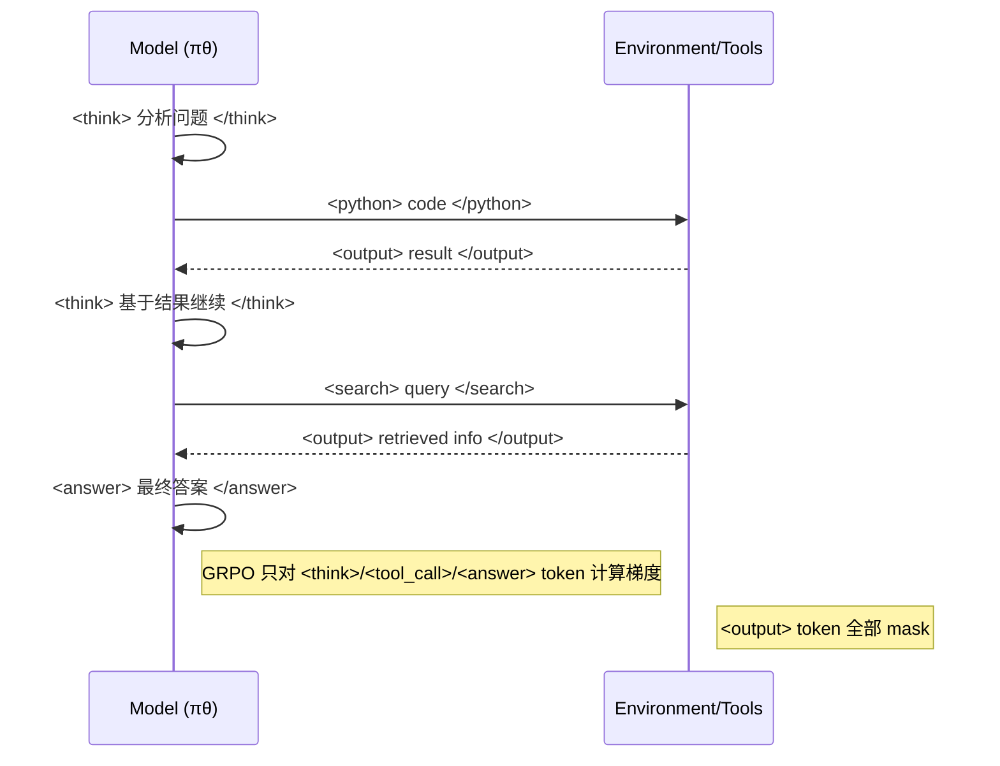
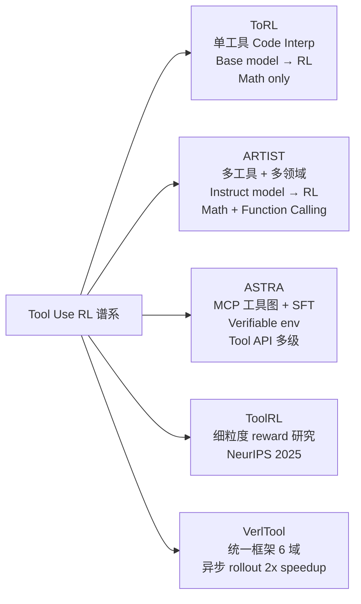

# ARTIST: Agentic Reasoning and Tool Integration in Self-Improving Transformers

> **一句话**：把 `<think>` 推理、`<tool_name>` 调用、`<output>` 结果交织成统一 rollout，用 GRPO 的 outcome reward 训练——工具输出 token **不计入梯度**，只优化模型决策 token。

## 背景与动机

**纯文本 RL 的天花板**：DeepSeek-R1 / GRPO 训练出的 reasoning model 依赖静态内部知识，对计算密集、知识时效性强的任务（AIME 竞赛数学 / 实时 API 调用）力不从心。

**SFT/prompt 的工具集成局限**：现有 TIR（Tool-Integrated Reasoning）方法大多依赖 SFT 从更强模型蒸馏轨迹，固化了工具使用的 surface pattern，无法适应新任务或错误恢复。

**ARTIST 的核心思路**：把工具调用内嵌到 RL rollout 中，模型自主决定**何时、哪个工具、如何调用**，用 outcome reward 驱动——不需要 step-level 监督。

## 框架设计

### 推理轨迹结构

```
<think> 分析问题，确定需要计算... </think>
<python> import sympy; x = symbols('x'); solve(x**2-4,x) </python>
<output> [-2, 2] </output>
<think> 计算结果是 x=-2 或 x=2，代入验证... </think>
<answer> 最终答案 </answer>
```

三段交替循环：
1. **`<think>...</think>`**：模型内部推理文本
2. **`<tool_name>...</tool_name>`**：工具调用（代码、API、搜索）
3. **`<output>...</output>`**：工具执行返回结果

这个结构把"推理"和"行动"无缝交织，工具输出直接成为下一步推理的 context。

### RL 算法：GRPO + Token Masking

**基础**：GRPO（无 critic 网络，group reward 归一化 advantage）

**关键适配——工具输出 Token Masking**：

```python
# 训练时：工具输出 token 的梯度被 mask 掉
loss = sum(
    cross_entropy(logit, token) * mask(token)
    for token in rollout
)
# mask = 1 if token ∈ model-generated
# mask = 0 if token ∈ tool-output (deterministic, not learnable)
```

**为什么需要 masking**：
- 工具输出是**确定性**的（`sympy.solve(x**2-4)` 永远返回 `[-2,2]`）
- 如果让模型对工具输出 token 计算梯度 → 模型会学会"预测工具会返回什么"而不是"何时调用工具"
- Masking 强制模型只学习**调用决策**（when/which/how），而不是模仿工具输出

这和 ToRL 的思路相通（ToRL 只有一种工具，ARTIST 支持多种）。

### Reward Design：三种 Reward

**1. Answer Reward**（主要信号）

$$r_{\text{answer}} = \begin{cases} 1 & \text{答案正确} \\ 0 & \text{答案错误} \end{cases}$$

数学任务用 exact match；function calling 用 API 正确性。

**2. Format Reward**（辅助信号）

$$r_{\text{format}} = \begin{cases} +f & \text{格式正确（标签对齐、工具调用格式）} \\ -f & \text{格式错误} \end{cases}$$

确保模型按照 `<think>/<tool_name>/<output>` 结构生成，而不是随机混用。

**3. Tool Execution Reward**（辅助信号）

$$r_{\text{tool}} = \begin{cases} +t & \text{工具执行成功} \\ -t & \text{执行报错 / 无效调用} \end{cases}$$

对代码执行：语法正确可运行 = 正奖励；RuntimeError/SyntaxError = 负奖励。

**总 Reward**：

$$R = r_{\text{answer}} + r_{\text{format}} + r_{\text{tool}}$$

**与 ToolRL 的对比**：ARTIST 的工具 reward 是粗粒度的（执行成功/失败），而 ToolRL 主张细粒度分项打分（工具名 + 参数名 + 参数值分开评）。ARTIST 论文没有系统消融这个设计，是一个潜在的改进空间。

### Rollout 流程（Multi-Turn）



## 实验结果

### 数学推理（vs 多个 baseline）

| 模型 | AMC | AIME | Olympiad |
|------|-----|------|----------|
| GPT-4o | ~75% | ~13% | ~40% |
| DeepSeek-R1 | ~80% | ~22% | ~50% |
| Qwen2.5-7B base | ~60% | ~8% | ~28% |
| **ARTIST-7B** | **~82%** | **+22% vs base** | **超 GPT-4o** |
| **ARTIST-14B** | **进一步提升** | - | - |

- 复杂任务（AIME/Olympiad）提升最显著
- 简单任务（MATH-500）提升有限：模型内部知识已足够，工具调用反而增加 overhead

**关键发现**：难度越高 → 工具的 marginal value 越大。这说明 ARTIST 的工具调用是**需求驱动**（problem-contingent），不是无差别调用。

### Multi-Turn Function Calling（τ-bench + BFCL v3）

| 任务 | Base | Base+Prompt+Tools | ARTIST |
|------|------|------------------|--------|
| τ-bench-Retail | ~0.30 | ~0.35 | **~0.65+** |
| τ-bench-Airline | ~0.25 | ~0.30 | **~0.60+** |
| BFCL v3 Hard | - | - | 强 gains |

- τ-bench 要求 multi-turn 真实对话 + API 调用（零售客服 / 航空订票场景）
- ARTIST 的 success rate **接近翻倍**（base → ARTIST），远超 prompt engineering

### 量化分析指标

1. **Reward Score（解题质量）**：随训练步数单调上升
2. **Tool Call Count**：复杂任务中工具调用次数增加，简单任务减少 → 说明模型学到了"选择性调用"
3. **Response Length（推理深度）**：ARTIST 生成更长更深的推理链 → deeper thinking

## 涌现的 Agentic 行为（Case Study 分析）

这些都是 outcome reward 导出的涌现能力，未显式训练：

**1. Adaptive Tool Selection（工具自适应选择）**
- 面对符号计算 → 调用 SymPy
- 面对数值计算 → 调用 NumPy
- 面对需要查询 → 调用搜索 API
- 不同问题类型触发不同工具策略

**2. Iterative Self-Correction（迭代自我修正）**
- 工具返回 unexpected result → 模型识别异常 → 调整推理 → 重新调用
- 类似 ToRL 的 Cross-Validation，但 ARTIST 在多工具环境下更复杂

**3. Context-Aware Multi-Step Reasoning**
- 后续工具调用基于前步工具输出的内容进行条件决策
- 非线性推理：工具 A 的结果决定是否调用工具 B

**4. τ-bench 场景涌现行为（Appendix E）**
- **Retail**：自主查询用户订单 → 核对库存 → 条件申请退款（三步 API 链）
- **Airline**：航班查询 → 座位比较 → 用户偏好推断 → 最优 booking（四步 reasoning + API）

## 与 Tool-Use RL 谱系的精确对比



| 维度 | ToRL | ARTIST | ASTRA | ToolRL |
|------|------|--------|-------|--------|
| 工具数量 | 1（code interp）| 多工具（code/search/API）| MCP 工具图 | 通用 API |
| 起点 | Base model | Instruct model | SFT + RL | SFT + RL |
| Reward | Binary outcome | 3-part（Answer+Format+Tool）| Binary + verifiable env | 细粒度分项 |
| Token Masking | 工具输出 mask | 工具输出 mask | N/A（prompt-based）| N/A |
| 评估场景 | AIME 数学 | AIME 数学 + τ-bench | BFCL-V3-MT | 工具调用泛化 |
| 机构 | GAIR/SJTU | Microsoft Research | Beike | ByteDance/其他 |

**ARTIST vs ToRL 本质差异**：
- 工具类型：ToRL 只有 Python interpreter，ARTIST 支持任意工具（通用性更强）
- 训练起点：ToRL 强调 base model（最大化探索自由度），ARTIST 用 Instruct model（稳定性更好）
- Reward 设计：ARTIST 显式添加了 format reward 和 tool execution reward，ToRL 只有 answer reward

## 批判性评估

### 值得肯定
- **Token Masking 设计**：清晰且必要，确保梯度只更新模型决策而非工具输出模仿
- **双域评估**：数学（verifiable）+ function calling（τ-bench，更贴近真实）覆盖面广
- **三种 Reward 的工程实践**：format reward 对 multi-tool 场景的稳定性贡献被分析到

### 局限与待解问题
1. **Reward 设计消融不足**：三种 reward 各自的贡献没有系统消融——format reward 和 tool execution reward 的权重如何选择？
2. **与 ToolRL 对比缺失**：ToolRL 专门研究了 reward 粒度的重要性，ARTIST 没有与之直接对比
3. **工具 diversity 上限**：当工具数量扩展到 10+ 时（如 ASTRA 的 MCP 工具图），ARTIST 的 outcome reward 能否收敛？
4. **Instruct model 起点的代价**：ToRL 证明 base model 能发现更好策略，ARTIST 用 Instruct model 可能继承了 SFT 的次优偏见
5. **τ-bench 得分绝对值偏低**：~65% success rate 在现实部署中仍不足够，多步对话场景失败率随步数指数增长

## 统一设计原则（与 ToRL 对比的更深洞察）

**为什么都需要工具输出 masking？**

当工具执行结果是确定性的，它们不是 policy 的一部分——它们是 environment observation。在 RL 框架里，只有 action（模型生成的 token）需要优化，而 observation（工具输出）是已知的。Token masking 精确地实现了这个区分。

**这和 POMDP 的 observation 概念完全对应**（LOOP 的建模框架）：
- Action = 模型生成的推理 + 工具调用
- Observation = 工具执行结果（`<output>`）
- Policy 优化 → 只更新 action 的生成分布，不更新 observation 的"预测"

## 启发思考

**So What**：ARTIST 的核心贡献不是新算法，而是一个**可复用的工程模板**——如何把任意工具（代码解释器、搜索 API、数据库查询）接入 GRPO 训练环路。Token masking + 3-part reward 是可以直接搬来用的 recipe。

**未解问题**：
- 工具数量增加 → reward 中 tool execution signal 的稀疏性如何处理？
- 能否把 AgentPRM 的 PRM 信号引入 ARTIST 框架，实现真正的 step-level credit？
- ARTIST + GiGPO（anchor state grouping）组合：在 ARTIST 的多工具轨迹中，anchor state 密度有多高？

**面试高频问法**：
- "ARTIST 和 ToRL 最大的区别？" → 多工具 vs 单工具；Instruct vs Base；3-part reward vs binary reward
- "为什么工具输出 token 需要 mask？" → 工具输出是确定性 observation，不是 policy 决策，梯度回传会训成模仿而非调用策略
- "ARTIST 的 reward 设计有哪三种？" → Answer（正确性）+ Format（格式合规）+ Tool Execution（执行成功）

## 推荐阅读

- **原始论文**：[arXiv:2505.01441](https://arxiv.org/abs/2505.01441)（MSR-TR-042025-V1）
- **对比**：[[AI/Agent/Agentic-RL/ToRL-Tool-Integrated-Reinforcement-Learning|ToRL（base model直接RL训工具）]] — base model + 单工具路线
- **对比**：[[AI/Agent/Agentic-RL/ASTRA-Automated-Tool-Agent-Training|ASTRA（MCP工具图+verifiable env）]] — MCP 工具图 + SFT + verifiable env
- **Reward 深入**：[[AI/Agent/Agentic-RL/Tool-Use-RL-训练专题|Tool Use RL 训练专题]] — ToolRL 细粒度 reward 研究
- **Multi-turn 评估**：τ-bench (Yao et al., 2024) — retail/airline 场景
- **函数调用**：BFCL v3 (Yan et al., 2024) — 多类别 function calling benchmark

## 落地应用

**可用场景**：
- 多工具 agent（代码 + 搜索 + API 组合调用）
- 数学/科学推理（symbolic computation + 数值计算交织）
- 客服 agent（τ-bench 风格：多轮对话 + 数据库查询 + 业务操作）

**工程要点**：
- Token masking 实现：训练时对 `<output>...</output>` 之间的 token 设 loss_mask = 0
- 工具执行的异步化：工具调用期间 GPU idle → 需要 batch 级别调度（VerlTool 解决了这个问题）
- Format reward 权重调整：太大会压制 answer reward，建议 f < 0.1 × answer reward

**面试准备**：
- GRPO + token masking 的完整训练流程
- 三种 reward 的定义和权衡
- 与 ToRL/ASTRA 的对比论点

## See Also

- [[AI/Agent/Agentic-RL/ToRL-Tool-Integrated-Reinforcement-Learning]] — ToRL：base model 直接 RL 训单工具（ARTIST 的对比基准，更简洁但工具泛化性差）
- [[AI/Agent/Agentic-RL/ASTRA-Automated-Tool-Agent-Training]] — ASTRA：MCP 工具图 + SFT + verifiable env（更重的工程投入，ARTIST 轻量替代）
- [[AI/Agent/Agentic-RL/Tool-Use-RL-训练专题]] — Tool Use RL 训练专题（ARTIST 的深入背景，ToolRL 细粒度 reward 研究）
- [[AI/Agent/Agentic-RL/Search-R1-Reasoning-Search-Engine-RL]] — Search-R1：专注搜索工具的 GRPO 训练（单工具专项 vs ARTIST 多工具通用）
- [[AI/LLM/RL/GRPO/GRPO 深度理解]] — GRPO 深度理解（ARTIST 的底层算法）
