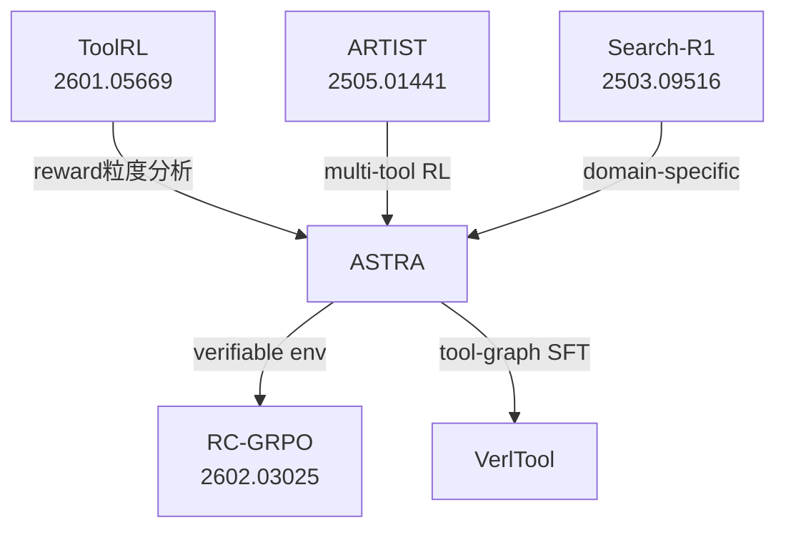

# ASTRA: Automated Synthesis of agentic Trajectories and Reinforcement Arenas

## 一句话定位

**别人都在手工标注工具调用数据，ASTRA 问的是：能否完全自动化整条流水线——从工具文档到 SFT 数据，再到可验证的 RL 环境，最后到 SOTA 模型——无需人工介入？**

答案：可以。

## 核心问题诊断

现有工具调用训练方法的三个根本缺陷：

| 缺陷 | 表现 | ASTRA 解法 |
|------|------|-----------|
| **不可验证的环境** | LLM 模拟工具执行，reward 不稳定 | code-executable rule-verifiable 环境 |
| **单一训练范式** | 只 SFT 或只 RL | SFT cold-start → online RL |
| **离线轨迹分解** | multi-turn 轨迹被切成 single-step | 保留完整 trajectory 学习 long-horizon |

## 两大组件

### 组件一：Trajectory Synthesis（供 SFT）

**数据来源**：MCP Server 工具文档（Smithery + RapidAPI + 内部规范）
- 保留 1,585 个 MCP Servers，包含 **19,036 个工具**，覆盖 **41 个领域**
- 过滤条件：≥3 个工具、描述清晰、可映射 OpenAI tool-calling schema

**工具链构建**：
1. 对每个 MCP Server，LLM 联合合成 task + tool-chain（工具有序调用序列）
2. 聚合为有向**工具转移图** $\widehat{G}^{(s)} = (V^{(s)}, \widehat{E}^{(s)}, w)$，边 $(f_i \to f_j)$ 表示工具共现
3. 在图上做 **length-bounded random walk** 采样候选链

**任务构建与增强**：
$$\mathcal{T}^{(s)} = \mathcal{T}^{(s)}_{\text{chain}} \cup \mathcal{T}^{(s)}_{\text{server}}$$

增强轴：多样性 / 复杂度 / 人格（novice vs expert）

**轨迹质量打分**（5 维度，全自动，无人工标注）：
- QU（Query Understanding）
- QP（Query Planning）  
- TCU（Tool-response Context Understanding）
- TCP（Tool-response Context-conditioned Planning）
- Final Answer Quality

工具失败注入：20% 概率模拟超时/不可达，增强鲁棒性。

---

### 组件二：Environment Synthesis（供 RL）

**关键 insight**：把 QA pairs 的"人类语义推理拓扑"转化为可执行的工具环境

**流程**：
```
QA 数据 → 问题分解 → 工具必要性检查 → 验证 → 环境合成 → 工具合并
```

产出：**code-executable + rule-verifiable 环境**
- 确定性 transition（非 LLM 模拟）
- 支持 step-level process reward（RLVR）
- 独立可并行，无环境间依赖

---

### 训练方法论

**两阶段**：

**阶段 1 — SFT**：在合成轨迹上做监督微调，学习 multi-turn 工具调用的基础能力（广度）

**阶段 2 — Online RL**：在合成环境上做 multi-turn online RL，关键设计：
- **F1-style trajectory-level reward**：同时优化 task completion 和 interaction efficiency（避免冗余调用）
- **Irrelevant-tool mixing**：训练时混入无关工具，增强工具选择的判别能力

$$R_{\text{traj}} = F1(\text{task\_completion}, \text{efficiency})$$

这个 two-stage 方法的直觉：SFT 建立**广度**（静态拓扑），RL 建立**深度**（语义拓扑中的鲁棒性）。

---

## 实验结果（BFCL-V3-MT）

| 模型 | Base | Long Context | Miss Func | Miss Param | **Average** |
|------|------|-------------|-----------|------------|------------|
| Claude-Opus-4.5 | 81.5 | 70.5 | 64.0 | 58.0 | **68.5** |
| GLM-4.6 | 74.5 | 66.5 | 68.0 | 63.0 | **68.0** |
| **ASTRA-32B-Thinking-v1** | 76.5 | 66.5 | 65.5 | 48.5 | **64.3** |
| Gemini-3-Pro-Preview | 69.0 | 64.0 | 63.0 | 56.5 | **63.1** |
| o3 | 68.0 | 63.0 | 63.5 | 54.5 | **62.3** |
| Claude-Sonnet-4.5 | 69.0 | 59.0 | 65.0 | 52.5 | **61.4** |
| **ASTRA-14B-Thinking-v1** | 67.0 | 61.0 | 56.0 | 48.5 | **58.1** |
| Qwen3-32B | 59.0 | 51.5 | 47.5 | 40.5 | **49.6** |

**结论**：ASTRA-32B 以开源 32B 参数超越 o3 和 Claude Sonnet 4.5。Miss Param 维度（缺少参数时的处理）是最大弱点（48.5 vs Opus 的 58.0），说明参数依赖理解还有差距。

---

## 批判性评估

### 真正的贡献

1. **verifiable environment 的系统化解法**：把 QA 语义推理拓扑转化为 code-executable 工具环境，这是工程创新，解决了长期困扰 tool-use RL 的 reward noise 问题
2. **MCP 原生**：对接真实 MCP 生态，而不是玩具工具集，工程价值高
3. **完整流水线开源**：从工具文档到最终模型，复现门槛低

### 值得怀疑的地方

1. **Miss Param 弱点未解释**：ASTRA-32B 在 Miss Param 上只有 48.5，比 Gemini（56.5）和 o3（54.5）都低，论文没有深入分析——可能是合成数据中参数缺失场景不足
2. **跨 MCP Server 工具组合未支持**：论文明确说"we restrict composition to tools within the same MCP server"——但真实 Agent 场景常需要跨 server 工具组合
3. **F1 reward 的 precision/recall 权重未公开**：这个设计细节可能对结果影响显著
4. **BFCL 是否足够**：BFCL-MT 专注函数调用格式正确性，不测长 horizon 任务完成率（如 SWE-bench、WebArena）

### 与现有工作的关系



ASTRA 是在 ToolRL 问题分析基础上做的系统化工程实现，而 RC-GRPO 解决了 ASTRA 训练中 GRPO 的 reward 同质化问题。

---

## 工程要点

```
# 环境规模
MCP Servers: 1,585
Tools: 19,036  
Domains: 41
License: Apache 2.0

# 模型
ASTRA-32B-Thinking-v1 (QwQ-32B 基座)
ASTRA-14B-Thinking-v1 (Qwen2.5-14B 基座)
```

**部署建议**：
- SFT 阶段：用 tool-graph random walk 覆盖工具组合空间，比随机采样更系统
- RL 阶段：F1 reward 避免 agent 为了完成率而多次冗余调用
- 测试：在 Miss Func/Miss Param 场景做额外数据增强

---

## 落地应用

**可用场景**：
- 企业内部工具调用 Agent（有内部 API 文档即可启动流水线）
- MCP 生态 Agent 训练（对接 Smithery 等平台）
- 快速迭代新工具的 Agent 能力（无需人工标注）

**面试高频问法**：
- Q: 工具调用 RL 的 verifiable reward 怎么设计？
  - A: ASTRA 方案：把 QA 分解为可执行工具环境，reward 由代码验证而非 LLM 判断
- Q: SFT 和 RL 在 Agent 训练中各自的角色？
  - A: SFT 建立 cold start 基础（工具格式+基本规划），RL 在 environment 中优化长 horizon 策略

---

## 启发思考

**So What**：ASTRA 证明了工具调用 Agent 的训练可以完全自动化，把对人工标注的依赖降到零。这意味着：任何拥有工具文档的企业，都能以低成本训练自己的 tool-use Agent。

**局限/未解问题**：
1. 跨 MCP Server 工具组合——真实的复杂 Agent 任务不可避免
2. Miss Param 场景的处理——如何让 Agent 主动询问缺失参数，而不是猜测
3. 在 long-horizon 环境（SWE-bench、OSWorld）上的表现未知

**脑暴拓展**：
- 能否把 ASTRA 的 tool-graph 方法扩展到跨 server？需要解决工具间数据流依赖建模
- F1 reward 的 precision = 避免冗余调用，recall = 完成任务——能否加入第三维度：用户等待时间？
- ASTRA + PA-MoE：tool-use 场景中不同阶段（规划/执行/验证）用不同专家，phase-level routing 是否也适用？

---

## 推荐阅读

- 原论文：[arXiv:2601.21558](https://arxiv.org/abs/2601.21558)
- 代码：[LianjiaTech/astra](https://github.com/LianjiaTech/astra)
- 相关工作：[[Tool-Use-RL-训练专题]] | [[CM2-Checklist-Rewards-Multi-Turn-Tool-Use-RL]] | [[PA-MoE-Phase-Aware-Mixture-of-Experts]]
- [[AI/Agent/Agentic-RL/RC-GRPO-Reward-Conditioned-Tool-Calling-RL|RC-GRPO]] — 解决 ASTRA RL 阶段 GRPO reward 同质化崩塌（arXiv:2602.03025）
- 环境工程系统论：[[AI/Agent/Agentic-RL/Agent-RL-环境工程系统论|Agent RL 环境工程系统论]]
