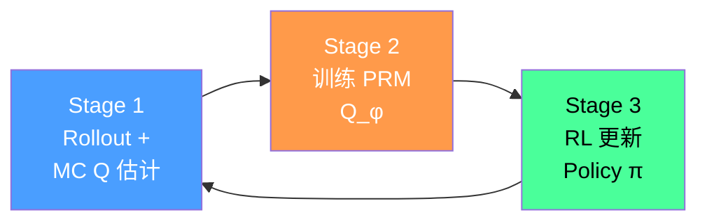
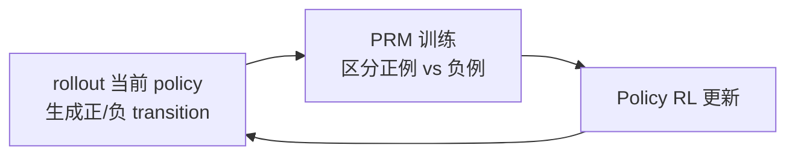
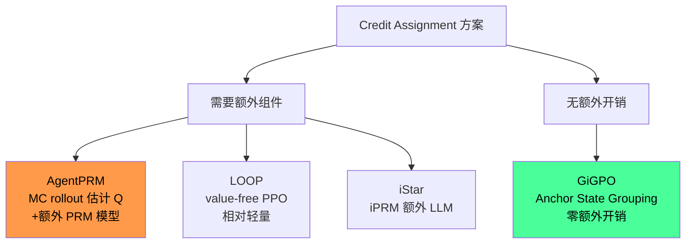

# AgentPRM: Process Reward Models for LLM Agents

> **一句话**：用 Monte Carlo rollout 自动估计 step-level Q 值，训练一个 PRM 作为 critic，从而把 agent 长链稀疏 reward 问题转化为密集 credit 问题。

## 问题定位

LLM Agent 的 RL 训练面临两个核心困难：

1. **长链决策**：每步输出包含推理 + 行动 token，形成两级 MDP（turn-level + token-level）；现有 RLHF 框架只处理 token-level 单轮
2. **稀疏 reward**：outcome reward 只在 episode 末尾给出，无法指导中间步骤的决策

AgentPRM 的核心命题：**把 PRM 建模为 agent 决策的 Q 函数**（state-action value function），提供 step-level 的密集信号。

## 方法：三阶段 Actor-Critic

AgentPRM 把训练拆成三个迭代阶段：

### Stage 1：Monte Carlo Q 估计（关键创新）

对每个 state-action pair $(s_t, a_t)$，用**多条平行 rollout** 估计 Q 值：

$$\hat{Q}(s,a) = \frac{1}{|\mathcal{G}(s,a)|} \sum_{(s_t,a_t)\in\mathcal{D}(s,a)} \sum_{k=t}^{T-1} \gamma^{k-t} r_k$$

其中 $\mathcal{G}(s,a)$ 是所有经过 $(s,a)$ 的轨迹集合（用 hashmap 存储），结果归一化到 $[0,1]$。

**vs MCTS 的区别**：MCTS 需要同步树搜索，难以 scale；这里的 rollout 是**异步并行**的，天然适配 RLHF 基础设施。

### Stage 2：训练 PRM

用 soft binary cross-entropy 训练 PRM $Q_\phi$（将 $\hat{Q}$ 视为 soft label）：

$$\mathcal{L}(Q_\phi) = -\mathbb{E}_{(s,a,\hat{Q})\sim\mathcal{D}}\left[\hat{Q}\log Q_\phi(s,a) + (1-\hat{Q})\log(1-Q_\phi(s,a))\right]$$

注：与 RLHF 中的 reward model 训练几乎一致，区别仅在 label 来源（MC rollout 而非人工偏好标注）。

### Stage 3：Policy RL 更新

用 KL 约束优化，regularize to **上一轮 policy**（不是初始 SFT policy）：

$$\pi_i = \arg\max_{\pi_\theta} \mathbb{E}_{s\sim\mathcal{D},a\sim\pi_\theta}\left[Q_\phi(s,a)\right] - \beta \mathbb{D}_{\text{KL}}\left[\pi_\theta(a|s) \| \pi^{i-1}(a|s)\right]$$

**为什么 regularize to $\pi^{i-1}$ 而非 $\pi_0$**：PRM 是基于 $\pi_{i-1}$ 的 rollout 训练的，偏离太远会导致 PRM 分布外失效——这与 conservative policy iteration 原则一致。

实验中用 **Online DPO** 实现这个 RL 步骤（而非 PPO）。

## InversePRM：无 Outcome Supervision 的变体

当没有 verifiable reward 时（没有 ground truth），InversePRM 改用**专家演示**来训练 PRM：

正例 $\mathcal{D}^+$：专家演示中的 transition  
负例 $\mathcal{D}^-$：policy 自身 rollout 的 transition

**实验结论**：InversePRM 在一次迭代内就接近专家水平，样本效率高于 AgentPRM，且**不需要任何 outcome reward**。

## 三个扩展方向

### 1. 探索改进（Exploration）
- **Reset distribution**：从中间状态重置，而非总是从初始状态开始（提升 state coverage）
- **Steered exploration**：用 LLM 提示引导探索稀少状态（类似 go-explore 思路）

### 2. Reward Shaping
- 在 PRM reward 上叠加 **reference policy 的 log-ratio**（类似 KL reward shaping）
- 低样本量场景下稳定训练，防止 reward hacking

### 3. Model-Predictive Reasoning
- 把 LLM 的 chain-of-thought 视为**内部模拟**（model-predictive planning）
- 理论上可以把 token-level MDP 的 RL 和 turn-level MDP 统一

## 实验结果（ALFWorld）

| 方法 | 模型 | 成功率（In-dist） | 成功率（OOD） |
|------|------|-----------------|--------------|
| ReAct | GPT-4o | 65% | 63% |
| ReAct | Claude Sonnet | 67% | 65% |
| AgentPRM | Llama 3B | **78%** | **75%** |
| AgentPRM + BoN | Llama 3B | **85%** | **82%** |
| InversePRM | Llama 3B | **80%** | **77%** |

**3B 小模型超越 GPT-4o**（通过 step-level credit + iterative training）。

Test-time scaling via **Best-of-N**：用训练好的 PRM 作为 verifier 选 N 个候选中最好的 action——AIME 场景的经典套路在 agent 中同样有效。

## Credit Assignment 谱系定位

**AgentPRM 的代价**：需要一个独立 PRM 模型（与 policy 同规模），以及大量 MC rollout 采样——计算成本比 GiGPO 高得多。

**AgentPRM 的优势**：Q 估计精度高（MC rollout 是无偏估计），不依赖 anchor state 的存在（GiGPO 在开放 state space 中会退化）。

| 方案 | Credit 精度 | 额外开销 | 适用场景 |
|------|------------|---------|---------|
| GRPO | trajectory 级（最低） | 无 | 单轮任务 |
| GiGPO | step 级（高，但需 anchor） | 无 | 结构化环境（ALFWorld/WebShop） |
| AgentPRM | step 级（高，MC 无偏） | 大（PRM + rollout） | 高精度要求，计算充足 |
| iStar | step 级（隐式） | 中（2× LLM） | 无 verifiable reward |
| PPO | step 级（value net 近似） | 大（critic 网络） | 通用但不稳定 |

## 关键洞察

**1. PRM = Q function（形式等价）**  
Agent 场景的 PRM 和 RL 的 state-action value function 在数学上是同一个东西——这不只是比喻，是严格等价。这意味着：所有 Q-function 的工具（reward shaping / target network / 保守更新）都可以直接迁移。

**2. 异步 MC rollout 是 scalability 的关键**  
MCTS 的同步树结构是工程瓶颈；异步 rollout + hashmap 聚合几乎无限制地并行，与 SGLang/vLLM 直接集成。

**3. InversePRM 暗示 demo → PRM 的路径**  
不需要 outcome label，只需要专家轨迹。这对于无法定义 verifiable reward 的 agent 任务（创意写作/open-ended 对话）是关键——与 iStar 的 DPO 路线是同一问题的不同角度。

**4. Reward hacking 是 PRM 的结构性风险**  
当 PRM 被 policy exploit 后，policy 会找到 high-Q 但实际上 wrong 的 action——这要求定期重训 PRM 或引入 reference policy shaping。

## 局限性

- 计算成本高：每轮训练需要 10k 条 rollout + 独立 PRM 训练
- MC 估计在**非常稀疏 reward** 场景（episodic，0/1）下方差大
- 实验仅在 ALFWorld（text game）验证，开放 web/code agent 上的效果未知
- PRM 与 policy 共用同一模型规模假设——实际生产中 PRM 可能需要更大

## 落地应用

**可用场景：**
- 有大量 rollout 计算资源，追求高精度 credit assignment
- 有专家演示数据（InversePRM 路线，无需 verifiable reward）
- 需要 test-time scaling：训练好的 PRM 直接复用为 verifier

**工程要点：**
- Rollout 并行化：用 SGLang/vLLM 批量 inference，SG-Lang 对 batched env stepping 支持好
- Hashmap 聚合：`{hash(s,a) → [trajectory_returns]}`，内存占用与 state coverage 成正比
- KL regularize 到 $\pi^{i-1}$（不是 $\pi_0$）——这一点容易搞错

**面试高频问法：**
- "如何用 Process Reward Model 解决 agent 稀疏 reward？" → AgentPRM 三阶段框架
- "PRM 和 Q function 什么关系？" → 数学等价，PRM 就是 turn-level Q function
- "没有 outcome reward 怎么训练 agent？" → InversePRM：从专家演示中区分正负 transition
- "为什么不用 MCTS？" → 同步 tree expansion 难以 scale；异步 MC rollout 直接兼容 RLHF infra

## 启发思考

**So What**：AgentPRM 证明了一件重要的事——**LLM Agent RL 可以完全在 RLHF 基础设施上实现**，只需要 Stage 1 的 Q 标注这一个新模块。这意味着所有 RLHF 工程积累（并行 rollout / reward shaping / KL 约束 / rejection sampling）都可以直接迁移到 agent 训练。

**未解问题**：
- MC rollout 估计 Q 值的方差问题：低成功率任务（<10%）下，大多数 rollout 的 Q 都是 0，方差极大
- InversePRM 的正负例区分是否足够精确？如果 policy 的 rollout 中混有"好的"轨迹，负例质量下降
- PRM 退化问题：经过多轮迭代后，PRM 可能过拟合到当前 policy 的 distribution，失去泛化能力

**脑暴拓展**：
- AgentPRM + GiGPO 混合：对有 anchor state 的步骤用 GiGPO（零成本），其余步骤用 AgentPRM MC 补充
- InversePRM 的"负例"来源可以扩展：失败案例的 trajectory 也是天然负例，不一定要 rollout 自己生成
- PRM 作为 test-time scaling 的 verifier：与 LOOP 的 value-free 设计正好互补

## 推荐阅读

- **原始论文**：[arXiv:2502.10325](https://arxiv.org/abs/2502.10325)
- **代码**：[github.com/sanjibanc/agent_prm](https://github.com/sanjibanc/agent_prm)（基于 OpenInstruct，轻量 Gym wrapper）
- **对比阅读**：[[AI/Agent/Agentic-RL/GiGPO-Group-in-Group-Policy-Optimization|GiGPO-Group-in-Group-Policy-Optimization]]（零成本 step-level credit）
- **理论统一**：[[AI/Agent/Agentic-RL/iStar-Implicit-Step-Rewards-Agentic-RL|iStar-Implicit-Step-Rewards-Agentic-RL]]（DPO ≡ implicit PRM 的数学证明）
- **长链 RL 应用**：[[AI/Agent/Agentic-RL/LOOP-Leave-One-Out-PPO-Long-Horizon-Agent-RL|LOOP-RL-Long-Horizon-Interactive-Agents]]（value-free PPO，AppWorld）
- **Credit Assignment 全景**：[[AI/Agent/Agentic-RL/Long-Horizon-Credit-Assignment专题|Long-Horizon-Credit-Assignment专题]]
