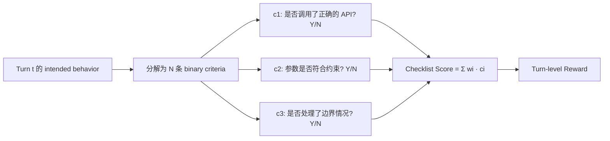
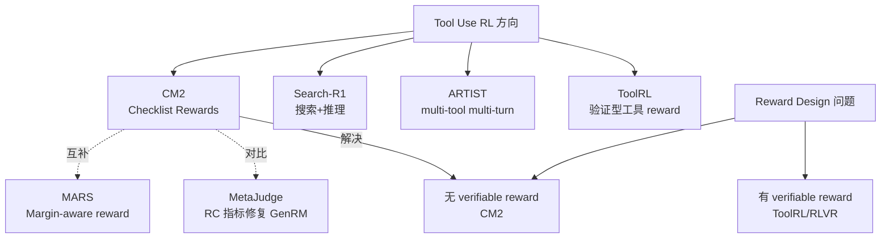

# CM2：Checklist Rewards 解锁 Multi-Turn Multi-Step Tool Use RL

> **一句话**：真实 tool use 任务的目标是 open-ended 的，没有 verifiable reward——CM2 用 Checklist Rewards 把"开放式评判"拆解成"结构化二进制分类"，让 RL 在这类场景下成为可能。

## 问题：为什么 Tool Use RL 很难？

Multi-turn multi-step agentic tool use 面临**三重困难**：

1. **缺乏 verifiable rewards**：不像数学/代码题有确定答案，真实 tool use 目标是 open-ended 的（"帮我安排会议"），很难自动判断是否完成
2. **RL for multi-turn 欠探索**：现有 RL 研究大多针对 single-turn，多轮交互的 credit assignment 更复杂
3. **工具环境成本高**：维护可执行的真实工具环境（数据库/API/Calendar/Email）工程成本极高，限制了规模和覆盖度

CM2 的核心洞察：**reward 的问题不是"无法评判"，而是"评判的粒度太粗"**——把粗粒度的 outcome judgment 拆细就能稳定。

## 核心机制：Checklist Rewards

### 什么是 Checklist Reward？

对每个 turn 的 intended behavior，分解成：
- **细粒度二进制标准**（fine-grained binary criteria）：每条标准只回答 yes/no
- **显式 evidence grounding**：每条标准必须有具体的 evidence 引用（哪条工具调用/哪句话支持结论）
- **结构化 metadata**：标准的类型、权重、依赖关系

### Sparse Reward + Dense Evaluation 解耦

**关键设计**：稀疏赋分（Sparse Reward Assignment）+ 密集评判（Dense Evaluation Criteria）

- **稀疏赋分**：reward 只在关键节点给出（不是每个 token），保持训练稳定性
- **密集评判**：但每个评判点的标准是高维度的（N 条 binary criteria），信息量大

这两个维度独立控制，避免了 dense reward 带来的 reward hacking 和 sparse reward 带来的学习困难。

### Open-ended Judging → Classification

传统方法：让 LLM 直接评分（1-10），判断是否完成任务。
- 问题：评判不稳定，LLM as judge 方差大，难以用作 RL 信号

CM2 方法：把"评判"转为"分类"
- 每条 binary criterion 只需判断 yes/no
- yes/no 的判断 + evidence 要求，让任务退化为结构化分类
- **分类比评分更稳定**，适合作为 RL 训练信号

## LLM-Simulated Tool Environment

不需要维护真实可执行的工具环境——用 LLM 模拟工具行为。

**优势**：
- 任意扩展工具集（不受真实 API 限制）
- 工程成本低（不需要沙箱/Docker/真实数据库）
- 训练数据的工具多样性更高

**局限**：
- LLM 模拟可能不精确（尤其是复杂工具的副作用）
- 真实部署时有 distribution shift

## 实验结果

| Benchmark | CM2 vs SFT | 备注 |
|-----------|------------|------|
| τ-Bench | **+8 points** | 对话式任务评估 |
| BFCL-V4 | **+10 points** | 函数调用基准（更新版） |
| ToolSandbox | **+12 points** | 工具使用沙箱评估 |

- 基础模型：8B Base + SFT → CM2 RL fine-tuning
- RL 数据集：仅 8k 样本（数据效率高）
- **与规模相近的 open-source baseline 持平或超越，包括 judging model 本身**

## 与已有工作的关系

- [[AI/Agent/Agentic-RL/Tool-Use-RL-训练专题|Tool-Use-RL 训练专题]] — CM2 是其中的重要新成员（2602.12268）
- [[AI/LLM/RL/Theory/Rationale-Consistency-GenRM-Deceptive-Alignment|MetaJudge（Rationale Consistency）]] — 同样处理 judge 可靠性问题，从不同角度（GenRM 欺骗性对齐）
- [[AI/LLM/RL/Theory/Reward-Design-2026-Panorama|Reward Design 2026 全景]] — 广义 reward design 视角

## 学者评价

**为什么 ★★★★☆**：

CM2 击中了 tool use RL 的核心痛点——open-ended task 的 reward 设计。Checklist Rewards 的设计思路干净：把"开放评判"转为"结构化分类"，是一个 engineer 友好的工程解法，而不是理论突破。

**真正有价值的**是 Sparse+Dense 解耦原则。这个设计说明 reward 的两个维度（给分频率 vs 评判精度）是独立的——以前经常把它们混为一谈（"要 dense reward"就以为要频繁给分，要精确评判就以为要每步打分）。

**局限**：
- LLM-simulated environment 的 fidelity 问题未充分讨论
- Checklist 本身如何生成？是人工设计还是自动提取？论文需要仔细看
- binary criteria 的权重 $w_i$ 如何设定？有没有 reward hacking 空间？
- 和 ToolRL（turn-level verifiable reward）的边界不清晰：什么情况用哪个？

**与盾卫的联系**：CM2 的 evidence grounding 原则很有意思——强制每个 reward 判断有 evidence，这和盾卫的 attribution tracking 思路一致：每个 policy 决策都应该可追溯到具体依据。

## 面试高频问法

**Q: 如何给 open-ended 的 agentic task 设计 reward？**

没有 verifiable outcome 时，CM2 方案：用 Checklist 把 intended behavior 分解成 binary criteria + evidence grounding，化"评分"为"分类"。关键设计原则：稀疏赋分（训练稳定）+ 密集评判（信息量足够）。

**Q: Tool use RL 的主要挑战是什么？**

三个维度：①无 verifiable reward（CM2 解决）②multi-turn credit assignment（GiGPO/AgentPRM 解决）③工具环境工程成本（LLM-simulated env 或 SWE-bench 类离线评估）

## 落地应用

**可用场景**：
- 任何 open-ended agentic task（客服、日程管理、信息检索）
- 没有明确 ground truth 但有 behavioral specification 的任务
- 需要 RL 但 human annotation 成本高的场景

**工程要点**：
- Checklist 设计质量 = reward quality 上限（garbage in, garbage out）
- LLM-simulated env 需要 periodically 用真实 env 验证
- Evidence grounding 可以大幅减少 reward hacking

## 推荐阅读

- **原始论文**：[arXiv:2602.12268](https://arxiv.org/abs/2602.12268)
- **代码**：[GitHub: CM2-RLCR-Tool-Agent](https://github.com/namezhenzhang/CM2-RLCR-Tool-Agent)
- **同方向**：[[AI/Agent/Agentic-RL/Tool-Use-RL-训练专题|Tool-Use-RL 训练专题]]（ToolRL/ARTIST/Search-R1 对比）
- **Reward 全景**：[[AI/LLM/RL/Theory/Reward-Design-2026-Panorama|Reward Design 2026 全景]]
- **Credit assignment**：[[AI/Agent/Agentic-RL/Long-Horizon-Credit-Assignment专题|Long-Horizon Credit Assignment 专题]]（GiGPO/AgentPRM/LOOP）
- **Rollout 侧双支柱**：[[AI/Agent/Agentic-RL/TSR-Trajectory-Search-Rollouts-Multi-Turn-RL|TSR]]（per-turn 树搜索提升 rollout 质量）— CM2 解决 reward 质量，TSR 解决 rollout 质量，两者共同构成 multi-turn Agent RL 的完整解决方案
