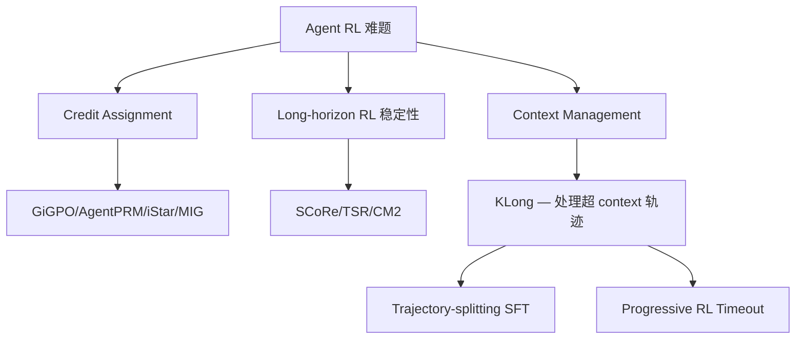

# KLong: Training LLM Agent for Extremely Long-Horizon Tasks

> **arXiv**: 2602.17547 | **年份**: 2026-02-19（4天前）| **机构**: NUS + MIT  
> **评级**: ★★★★☆  
> **关键词**: Extremely Long-horizon, Trajectory-splitting SFT, Progressive RL, PaperBench, MLE-bench

---

## 一、核心问题：Extremely Long-horizon 是一个独立的难度量级

KLong 做了一个值得注意的分类：

| 类型 | 代表 Benchmark | 运行时间 | Assistant Turns |
|------|--------------|---------|----------------|
| Long-horizon | SWE-bench Verified, Terminal-Bench 2.0 | 分钟级 | 20–200 turns |
| **Extremely long-horizon** | **PaperBench, MLE-bench** | **小时级（6–12h）** | **700+ turns** |

关键区别：**Extremely long-horizon 任务的轨迹长度超过 context window**——不是"很长"，是"物理上放不下"。

这意味着：
1. 标准 SFT 无法训练（一个 trajectory 放不进 context）
2. 标准 RL rollout 无法跑完（12 小时完成不了，reward 拿不到）
3. Credit assignment 更加困难（trajectory 太长，稀疏 reward 的 delay 是数千步）

代表任务：**PaperBench**（复现一篇 ML 论文的完整实验代码），需要读论文 + 理解算法 + 写代码 + 跑实验 + debug 循环，典型耗时 6–12 小时，700+ 个 assistant turns。

---

## 二、方法

### 总体框架

```
Base Model
   → [Stage 1] Comprehensive SFT（激活基础 Agent 能力）
   → [Stage 2] Research-Factory（生成极长 horizon 训练数据）
   → [Stage 3] Trajectory-splitting SFT（处理超 context 的轨迹）
   → [Stage 4] Progressive RL（逐步延伸 timeout，稳定训练）
```

### 2.1 Research-Factory：自动化数据生成

KLong 面临的第一个问题：**谁来生成 PaperBench 这样的极长训练轨迹？**

- **搜索 Agent**：从 ICML/NeurIPS/ICLR 近 5 年抓 candidate papers，filtering 基于质量和影响力，PDF 转 Markdown
- **评估 Agent**：自动构建每篇论文的 **rubric tree**（评分树）——分析 paper content + 官方代码，生成结构化评分标准
- 防止 cheating：把官方 GitHub URL 加入 blacklist，agent 不能查官方实现
- 用 Claude 4.5 Sonnet (Thinking) 做 **rejection sampling distillation** 生成高质量轨迹

产出：数千条 extremely long-horizon 轨迹，平均 700+ turns，覆盖论文复现全流程。

### 2.2 Trajectory-splitting SFT：处理超 context 的轨迹

核心问题：轨迹 $\tau = (s_1, a_1, \ldots, s_N, a_N)$ 超过 $L_{\max}$（context window）。

**解决方案**：把轨迹切成重叠的子轨迹，独立训练每一段：

$$\tau^{(i)}_{\text{input}} = [p, s_{t_i}, a_{t_i}, \ldots, s_{t_i+L-1}, a_{t_i+L-1}]$$

三个关键设计：
1. **Pin the prefix $p$**：每个子轨迹都包含完整的任务描述 + 论文阅读段（最重要的全局上下文固定在开头）
2. **Progressive truncation**：后续历史逐步截断（早期历史少保留，近期行为全保留）
3. **Overlapping sub-trajectories**：相邻子轨迹有重叠（保证 contextual continuity，不让历史断裂）

**效果**：assistant turns 从 114.9 → **732.7**（提升 6.4 倍），这才是 extremely long-horizon 的真正规模。

损失函数：

$$\mathcal{L}_{\text{SFT}} = -\sum_{i=1}^{K} \sum_{t=t_i}^{t_i+L-1} \log P_\theta(a_t | \tau^{(i)}_{<t})$$

### 2.3 Progressive RL：解决极长 horizon 的 RL 稳定性

尝试了直接做 end-to-end RL（12 小时 timeout），**效果不好**。

原因：
1. 稀疏 reward + 极长轨迹 = credit assignment 近乎失效
2. 绝大多数 rollout 无法在 timeout 内完成，reward 拿不到
3. Pipeline imbalance：所有 rollout 同时到期 → judge 并发爆炸 → rollout 节点空转

**Progressive RL 解决方案**：按阶段递进延长 timeout

$$T^{(1)} < T^{(2)} < \cdots < T^{(M)}$$

- Stage 1：短 timeout（2小时），学习短期内的有效行为
- Stage 2：中 timeout（4小时），扩展到更长 horizon
- Stage 3：长 timeout（6小时），接近真实任务规模

每个阶段：rollout 到 timeout 强制截断 → trajectory-splitting → GRPO 风格的 group-relative advantage：

$$\hat{A}_t^{(m,i,j)} = Q^{(m,i,j)} - \frac{1}{n \cdot K^{(m)}} \sum_{j'}\sum_{i'} Q^{(m,i',j')}$$

其中 $Q^{(m,i,j)} = \mathcal{J}(\hat{\mathcal{C}}^{m,i,j}, \mathcal{K})$ 是 judge 对该子轨迹复现代码的评分（rubric tree 评估）。

**Infrastructure 优化**：
- 用 partial rollout（当前 rollout 跑着的同时，提前启动下一批）
- Priority judge queue（eval set 优先于 train set 评估，避免训练信号丢失）
- 用 open-source gpt-oss-120b 替代 o3-mini 作 judge（验证 ranking 一致性，降低成本）

---

## 三、实验结果

### PaperBench（主基准）

| 模型 | 规模 | 平均分 |
|------|------|-------|
| Grok 4 | 闭源 | 47.20 |
| GPT-5 Thinking (High) | 闭源 | 52.31 |
| Claude 4.5 Sonnet (Thinking) | 闭源 | **69.75** |
| Qwen3-Thinking 235B | 开源 | 28.72 |
| DeepSeek-V3.2 685B | 开源 | 47.11 |
| Kimi K2 Thinking 1T | 开源 | 51.31 |
| **KLong 106B** | **开源** | **62.59** |

**KLong 106B 超过 Kimi K2 Thinking 1T（体量差近 10 倍）11.28%**。

### Ablation（PaperBench）

| 阶段 | 平均分 | Assistant Turns | 运行时长 |
|------|-------|----------------|---------|
| Baseline（基础 SFT）| 38.63 | 114.9 turns | 1.52h |
| + Trajectory-splitting SFT | 55.92 | 732.7 turns | 8.88h |
| + Progressive RL 2h | 57.29 | ↑ | ↑ |
| + Progressive RL 4h | 58.65 | ↑ | ↑ |
| + Progressive RL 6h | **62.59** | ↑ | ↑ |

- Trajectory-splitting SFT 贡献：**+17.29**（最大增益）
- Progressive RL 贡献：**+6.67**（在 SFT 基础上叠加）

### 泛化能力

训练专门针对 PaperBench，但：
- SWE-bench Verified: 60.80% → **62.80%**（OpenHands scaffolding）
- Terminal-Bench Hard: 14.58% → **16.67%**
- SEC-bench: 5.00% → **7.67%**（CVE + OSS-Fuzz 安全漏洞任务）
- MLE-bench: 多项 Above Median，1 个 Gold Medal

**泛化路径**：极长 horizon 的能力（sustained reasoning + context management + planning-execution loop）是通用的，能迁移到所有需要长期执行的任务。

---

## 四、批判性分析

### ★ 真正贡献

1. **第一篇认真处理 "context window 放不下轨迹" 这个边界问题的 Agent RL 论文**。之前所有工作都假设轨迹可以放进 context，KLong 填了这个空白。

2. **Trajectory-splitting SFT 是一个干净的工程解法**：固定全局 prefix + 渐进截断历史 + 重叠保连续性。逻辑清晰，实现上可行。

3. **Progressive RL 的思路正确**：先从短 horizon 学局部行为，再扩展到长 horizon。这和课程学习（Curriculum Learning）的精神一致，是对极端稀疏 reward 问题的合理 workaround。

4. **Research-Factory pipeline 值得复用**：任意顶会论文 → 自动生成 rubric tree + 轨迹 → RL 训练数据。这是一个可扩展的数据飞轮。

### ⚠ 局限与疑问

1. **Base model 选择**：用 GLM-4.5-Air-Base（智谱的轻量级模型）做 base，但数据由 Claude 4.5 Sonnet (Thinking) distill 生成。这制造了 teacher-student gap——KLong 的上限被 Claude Thinking 的能力锁定了。

2. **Trajectory-splitting 的 credit assignment 问题**：子轨迹独立训练时，advantage 是在子轨迹 group 内计算的，而不是跨整条轨迹的全局 advantage。这可能导致前期子轨迹（刚开始读论文）拿到的信号质量较差。

3. **Judge 依赖**：RL reward 来自 gpt-oss-120b + agent-generated rubric tree。Judge bias 和 rubric quality 直接决定训练信号质量，这是一个 unverifiable chain。

4. **泛化数字偏小**：SWE-bench +2%、Terminal-Bench +2%——提升存在，但不显著。PaperBench 是 training domain，其他是 zero-shot 迁移，差距合理但不能过度解读。

5. **Infrastructure 壁垒**：10,000+ 并发 sandbox，25,000+ Docker 镜像，12 小时 RL rollout——这个基础设施成本极高，绝大多数研究者无法复现完整实验。

---

## 五、与已有工作的关系

### vs LOOP (2502.01600)

LOOP 是 LOO-PPO + AppWorld，轨迹是 long-horizon（数百步）但仍在 context window 内。KLong 解决的是更极端的 case：轨迹本身超过 context window。

### vs TSR (2602.11767)

TSR 在 training-time rollout 阶段引入树搜索，提升轨迹质量；KLong 通过 progressive timeout 解决轨迹过长的 RL 稳定性问题。两者关注的 bottleneck 不同，互补。

### vs SCoRe (2409.12917)

SCoRe 解决 multi-turn self-correction 的初始化（Phase 1 KL 约束）；KLong 解决极长 horizon 的 context overflow。完全不同的问题维度。

### 在 Agent RL 知识谱系中的位置



KLong 是"Context Management for RL Training"方向的开创性工作——之前没有人系统地处理过这个问题。

---

## 六、关键洞察

### 1. "Extremely long-horizon"是不同的问题，不只是"long-horizon 的延伸"

现有工作（LOOP/SCoRe/GiGPO）处理的是"long horizon but fits in context"。KLong 处理的是"context 物理装不下"。这不是量的差异，是质的差异——解法完全不同（需要显式的轨迹分割策略）。

### 2. Progressive timeout 是 curriculum learning 在 RL timeout 维度的应用

先 2h → 4h → 6h timeout，本质是"先让 agent 在短任务上拿到 reward，建立 policy 基础，再扩展 horizon"。这和 PACED-RL 的难度课程化思路异曲同工。

### 3. Research-Factory 揭示了 Agent RL 的数据飞轮

强模型（Claude Thinking）生成轨迹 → rejection sampling 过滤 → 训练弱模型（GLM-4.5-Air）→ 弱模型逐渐逼近强模型。这是 distillation + RL 的标准 pipeline，在 extremely long-horizon 场景的成功应用。

### 4. 基础设施是极长 horizon RL 的真正瓶颈

12 小时 rollout × 数千个并发 sandbox，judge 并发 congestion，pipeline imbalance——这些工程问题不亚于算法本身。KLong 的工程设计（partial rollout + priority queue + 分布式 judge）是同等贡献。

---

## 七、关联笔记

- [[AI/Agent/Agentic-RL/LOOP-Leave-One-Out-PPO-Long-Horizon-Agent-RL]] — long horizon RL（在 context 内）对比
- [[AI/Agent/Agentic-RL/TSR-Trajectory-Search-Rollouts-Multi-Turn-RL]] — training-time tree search 对比
- [[AI/Agent/Agentic-RL/SCoRe-Self-Correction-via-Reinforcement-Learning]] — multi-turn RL 稳定性对比
- [[AI/Agent/Evaluation/Agent评估体系批判-Goodhart法则与Benchmark陷阱]] — PaperBench 的特点分析
- [[AI/Agent/Agentic-RL/Agent-RL-环境工程系统论]] — 基础设施挑战的系统视角
- [[AI/Agent/Agentic-RL/Long-Horizon-Credit-Assignment专题|Long-Horizon Credit Assignment 专题]] — KLong 解决"轨迹放不下"的物理问题；CA专题解决"reward如何归因"的算法问题——同一大难题的两个维度
- [[AI/Agent/Agentic-RL/PA-MoE-Phase-Aware-Mixture-of-Experts|PA-MoE]] — 同为 Agentic RL 训练改进：KLong 解决极长 horizon 上下文+课程问题，PA-MoE 解决参数容量 Simplicity Bias；两者正交可叠加
- [[AI/LLM/RL/Other-Algorithms/Goldilocks-RL-Task-Difficulty-Curriculum|Goldilocks RL]] ⭐ — **同一课程原则的不同实现**：Goldilocks 在样本难度做课程（选什么题），KLong 在时间长度做课程（允许多长的任务）；本质都是"从简单到难"
- [[AI/LLM/RL/Other-Algorithms/DEEP-GRPO-Deep-Dense-Exploration-Pivot-Resampling|DEEP-GRPO]] — 轨迹切割（KLong）和 pivot resampling（DEEP-GRPO）都涉及在长轨迹关键节点处理，思路相通
- [[AI/Agent/Agentic-RL/Agentic-RL-2026前沿综合分析|Agentic RL 2026 前沿综合分析]] — KLong 是极长任务 Agentic RL 训练的实证端，补充理论分析
- [[AI/Agent/Agentic-RL/Agent-RL-训练实战指南|Agent RL 训练实战指南]] — 实战指南的 credit assignment 和 reward 设计章节与 KLong 高度相关
- [[AI/Agent/Agentic-RL/WebAgent-R1-Multi-Turn-RL-Web-Agent|WebAgent-R1（Amazon+UVA）]] — **Context Overflow 的正交解法**：KLong 用 trajectory-splitting（切轨迹），WebAgent-R1 用 dynamic context compression（压缩历史 HTML）；同问题不同思路，可组合
- [[AI/Agent/Agentic-RL/RAGEN-StarPO-Multi-Turn-RL-Self-Evolution|RAGEN & StarPO]] — **KLong 的理论背景**：RAGEN 诊断了 multi-turn RL 训练不稳定（Echo Trap），KLong 在此基础上解决极长 horizon（700+ turns）的 context + curriculum 问题

---

## 八、面试应用

**"如何处理 Agent RL 中轨迹超过 context window 的问题？"**
→ KLong 的答案：Trajectory-splitting SFT（固定全局 prefix + 渐进截断 + 重叠保连续）+ Progressive RL（逐步延伸 timeout，从局部行为到全局策略）。

**"PaperBench 是什么？和 SWE-bench 有什么区别？"**
→ SWE-bench：bug fixing，数十分钟，百级 turns，context 可以装下；PaperBench：论文复现，数小时，数百 turns，轨迹超 context——复杂度差约 10 倍。

---

*写于 2026-02-23 17:46 | 心跳 12*
