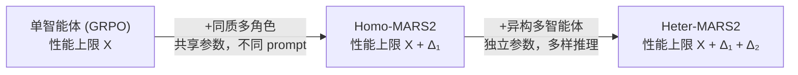
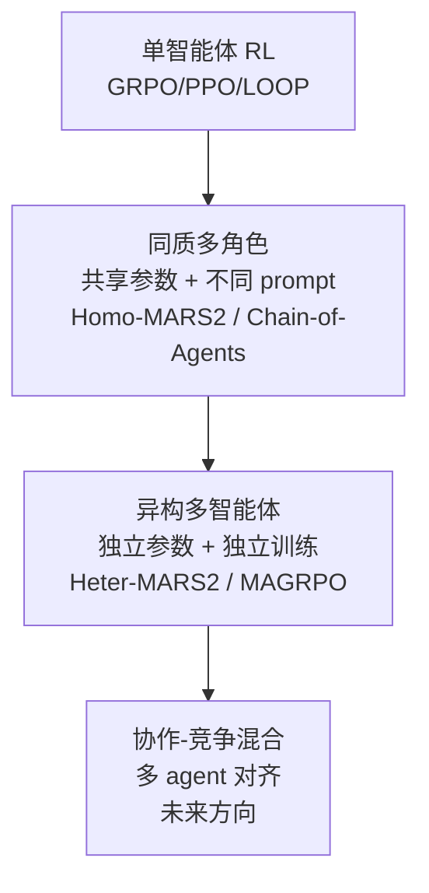

# MARTI-MARS²: Multi-Agent RL 扩展律

## 一、核心命题

**单智能体的性能上限是什么？**

即使无限扩大 test-time compute，单个 agent 的推理受限于：
1. 底座模型的 pre-training 知识边界
2. 同质化的推理路径（一个模型只有一种"思维方式"）
3. 错误修正能力有限（自我修正存在 mode collapse 风险）

**MARS2 的核心断言**：multi-agent 协作是独立于 TTS 的另一个 scaling 维度——通过 RL 训练异构 agent 之间的交互模式，可以突破单 agent 的性能上限。

---

## 二、Multi-Agent Scaling Law（论文最重要贡献）

MARS2 揭示了一个清晰的三阶段扩展律：



**实验证据（代码生成，32B 规模）**：
- 单智能体 GRPO：baseline
- Homo-MARS2（Nemotron-32B × 2，共享参数）：+Δ₁
- Heter-MARS2（Nemotron-32B + Qwen3-32B，独立参数）：+Δ₁+Δ₂，最终 **77.7%**

**为什么异构 > 同质**：
- 同质：差异来自 system prompt 和 context，本质上同一模型的不同"视角"
- 异构：完全不同的预训练数据、架构偏好、推理风格，天然互补错误
- **多样性是 scaling 的独立维度**：论文从语义、算法、认知推理三个层面测量 diversity，异构 agent 的 diversity 显著高于同质

---

## 三、MARS2 训练框架

### 3.1 核心架构：Multi-Agent Tree Search as Learnable Environment

MARS2 把多智能体协作搜索过程**建模为可学习的动态环境**：

```
问题 q
   │
   ▼
Tree Search (深度 d 层)
   ├── Node 1: Agent A₁ → 候选方案 o₁, reward r₁
   ├── Node 2: Agent A₂ → 候选方案 o₂, reward r₂
   ├── Node 3: Agent A₁ → 精炼方案 o₃, reward r₃ (基于 o₁ 失败反馈)
   └── Node 4: Agent A₂ → 精炼方案 o₄, reward r₄ (基于 o₂ 错误)
         │
         ▼
   Group-level advantage 计算（跨所有节点）
         │
         ▼
   各 Agent 的 buffer 分发 → 异步触发参数更新
```

与 GRPO 的关键区别：**GRPO 的 group = 同一问题的多次独立采样；MARS2 的 group = 完整的多智能体轨迹树**。

### 3.2 Group-level Advantage 计算

这是理解 MARS2 的核心数学：

$$\hat{A}_{k,t}^{j_k} = \frac{r_{k,j_k} - \text{mean}(r_{1,j_1}, r_{2,j_2}, \ldots, r_{G_T, j_{G_T}})}{\text{std}(r_{1,j_1}, r_{2,j_2}, \ldots, r_{G_T, j_{G_T}})}$$

- $G_T$：树中总节点数
- $r_{k, j_k}$：智能体 $A_{j_k}$ 在节点 $\mathcal{N}_k$ 生成的代码的 reward
- **所有节点（不同 agent、不同深度）的 reward 归入同一 group 做归一化**

**直觉**：agent $A_j$ 在某个节点的 advantage = 它相对于整个 multi-agent 树的平均表现高了多少。这让每个 agent 既与自己比，也与其他 agent 比——自然形成竞争-协作压力。

### 3.3 优化目标 MARS2+

基础 MARS2 目标在长链推理任务（代码生成）中训练不稳定。MARS2+ 引入三个稳定化机制：

**1. GSPO（Group Sequence Policy Optimization）**：对整个推理链做几何平均 IS ratio，平滑不稳定 token 的影响：
$$s(i, j, \theta_j) = \left(\frac{\pi_{\theta_j}(o_i|x)}{\pi_{\theta_j^{\text{old}}}(o_i|x)}\right)^{1/|o_i|}$$

**2. Overlong Penalty**：对过长输出惩罚，防止 reward hacking 式的"冗余推理"。

**3. TIS（Token Importance Sampling）**：对关键 token 做重要性加权，减少无关 token 的噪声梯度。

目标函数 $\mathcal{J}_{\text{MARS}^2+}(\bm{\Theta})$ 对每个 agent $j$ 分别维护 policy $\theta_j$ 和 reference $\pi_\text{ref}$，加 KL 约束防止 collapse。

### 3.4 异步动态训练（解决数据不均衡）

**问题**：树搜索中不同 agent 被选中的频率不同（基于 Beta prior 动态选择），导致 agent 之间的数据积累速率不均。同步更新 → 快 agent 等慢 agent → 浪费计算。

**MARS2 解法**：每个 agent 维护独立的 experience buffer $\mathcal{B}_j$，buffer 满了就**异步触发参数更新**，不等待其他 agent。

类比：SLIME RL 框架（智谱 GLM-5 用的）的异步思想——generation 和 training 解耦，提高 GPU 利用率。

---

## 四、测试时推理：MARS2-T+

### 4.1 两个核心限制

vanilla TTS（如 AB-MCTS）在多智能体代码生成中的问题：
1. **Insufficient error utilization**：失败后只是"再试一次"，没有利用错误信息
2. **Limited refinement depth**：搜索停在浅层，没有充分利用多 agent 协作的深度

### 4.2 Error-Feedback Integration

节点失败时，提供结构化诊断反馈给下一个 agent：
- **Wrong Answer**：失败的输入输出对 + 期望输出
- **Execution Error**（IndexError/TimeoutError 等）：错误类型 + 详细 traceback
- 关键设计：enhanced feedback **只在精炼阶段注入**，初始探索保持多样性

### 4.3 Dynamic Depth-Guided Exploration

防止搜索停留在浅层，引入深度感知偏置：

$$\bar{r}^{\text{gen}}_k = w(d_k, c_{d_k}) \cdot r^{\text{gen}}_k, \quad w(d_k, c_{d_k}) = \gamma(d_k)^{c_{d_k}}$$

- $\gamma(d_k) \in (0,1)$：深度相关衰减因子，浅层 $\approx 0.98$，随深度增加减小
- 效果：浅层广泛探索，深层引导聚焦——动态平衡 exploration/exploitation

### 4.4 Reward Model Guidance

训练 RM 对最终候选方案打分（弥补测试时只有 public test cases 的稀疏 reward 问题），提供更可靠的方案选择信号。

---

## 五、实验结果

### 主要结果

| 方法 | 规模 | LiveCodeBench |
|------|------|--------------|
| 单智能体 GRPO（baseline）| 32B | —— |
| Homo-MARS2 | 32B × 2（共享参数）| 高于 GRPO |
| **Heter-MARS2** | **Nemotron-32B + Qwen3-32B** | **77.7%** |
| O4-Mini (high) | —— | < 77.7% |
| GPT-5.1 | —— | < 77.7% |

**多规模验证**：8B、14B、32B 三个规模，异构 > 同质 > 单智能体的层次关系在所有规模上成立。

### Diversity 分析

论文设计了三层 diversity 度量：
1. **语义 diversity**：embedding 空间的方案分散程度
2. **算法 diversity**：代码中使用的算法种类（DFS/BFS/DP/贪心等）
3. **认知推理 diversity**：reasoning chain 的路径差异

结论：异构多 agent → 最高 diversity → 最强 TTS 上限。这建立了因果链：**diversity → 更强的错误覆盖 → 更高性能上限**。

---

## 六、批判性分析

### 优点
1. **Scaling Law 的系统性验证**：三阶段（单→同质→异构）的清晰层次，有扎实实验支持
2. **异步动态训练**：解决了异构 agent 数据不均衡的工程问题
3. **测试时 MARS2-T+**：error feedback + depth guidance 的组合非常实用

### 需要质疑的地方
1. **仅在代码生成上验证**：代码生成有天然的 verifiable reward（单元测试），推广到数学/科学推理或开放任务是否成立？
2. **两个 agent 的最优性**：用了两个 32B 模型，计算成本 = 2×。如果把同样计算给一个 64B 单智能体呢？等等效计算预算的对比缺失
3. **异步训练的收敛性**：异步触发更新理论上可能引入 stale gradient 问题，论文没有充分分析
4. **"scaling law"的 claim 略强**：目前只有 2 个 agent 的实验，增加到 4/8 个 agent 是否继续 scale 不清楚

### 与单智能体 RL 的关系
MARS2 并不是替代 GRPO/PPO，而是**在 GRPO 之上加多智能体层**：
- 每个 agent 仍然用 GRPO-style 更新
- 多 agent 的贡献在于产生更多样、更覆盖的 rollout group
- 本质是一种**structured diversity injection**：通过异构 agent 保证 exploration diversity

---

## 七、在 Agent RL 谱系中的位置



**MARS2 填补的空白**：Vault 此前缺乏 Multi-Agent RL 训练框架的系统性记录。MARS2 是这个方向目前最清晰的扩展律分析。

---

## 八、落地应用

### 工程要点
- **两 agent 异构组合**：选择推理风格互补的模型（Nemotron + Qwen3，类似 reasoning model + coding model）
- **树搜索深度**：合理设置 max_depth，太深 → 计算开销大；太浅 → diversity 不充分
- **异步 buffer 阈值**：buffer size 影响每次更新的数据质量，需要根据 rollout 速率调节
- **GSPO + Overlong Penalty 组合**：长链推理必须加这两个稳定器

### 面试高频问法
- "Multi-Agent 和单 Agent RL 有什么本质区别？"→ Diversity 维度：异构 agent 提供不同推理路径，不是计算量堆叠
- "为什么同质多角色不够？"→ 本质是同一模型的不同 prompt，推理路径相关性高，diversity 有限
- "MARS2 如何解决异构 agent 的训练不同步问题？"→ 异步 buffer + 动态触发更新，不等待其他 agent

---

## 九、启发思考

**最重要的洞察**：

MARS2 揭示了一个与 TTS（test-time compute scaling）平行的维度——**训练时的 agent 多样性 scaling**。TTS 是在推理时花更多计算，MARS2 是在训练时用异构 agent 学出更多样的策略。

**未解问题**：
- 多少个异构 agent 才是最优？ 2 → 4 → 8，returns 何时递减？
- 如何在训练时动态调整 Beta prior，最优地选择哪个 agent 做树节点扩展？
- 能否把 MARS2 的 tree-search + multi-agent 机制应用到长 horizon agent（AppWorld/SWE-bench）而不只是代码生成？
- 异构 agent 的"最优组合"是否可以学出来（而非人工选 Nemotron+Qwen3）？Meta-learning for agent selection？

---

## 推荐阅读

- **原始论文**：[arXiv:2602.07848](https://arxiv.org/abs/2602.07848)
- **代码**：[github.com/TsinghuaC3I/MARTI](https://github.com/TsinghuaC3I/MARTI)
- **关联论文**：
  - MAGRPO (2508.04652) — 同方向，cooperative MARL for LLMs
  - Stronger-MAS (2510.11062) — flexible workflow + multi-agent RL
  - M-GRPO (2511.13288) — vertical multi-agent (Deep Research 场景)
- **关联笔记**：
  - [[AI/Agent/Agentic-RL/GiGPO-Group-in-Group-Policy-Optimization|GiGPO]] — step-level credit assignment
  - [[AI/Agent/Agentic-RL/LOOP-Leave-One-Out-PPO-Long-Horizon-Agent-RL|LOOP]] — value-free PPO for long-horizon
  - [[AI/Agent/Agentic-RL/PA-MoE-Phase-Aware-Mixture-of-Experts|PA-MoE]] — phase-level 路由，另一种 agent 多样性视角
  - [[AI/Agent/Agentic-RL/Agentic-RL-2026前沿综合分析|Agentic RL 2026 前沿综合分析]] — Agentic RL 全景
  - [[AI/Agent/Agentic-RL/Tool-Use-RL-训练专题|Tool-Use-RL 训练专题]] — 工具调用 RL 的相关设计
  - [[AI/Agent/Agentic-RL/Multi-Agent-RL-训练专题|Multi-Agent RL 训练专题]] — MAGRPO/AT-GRPO 系列与本文三条路线的系统性对比
