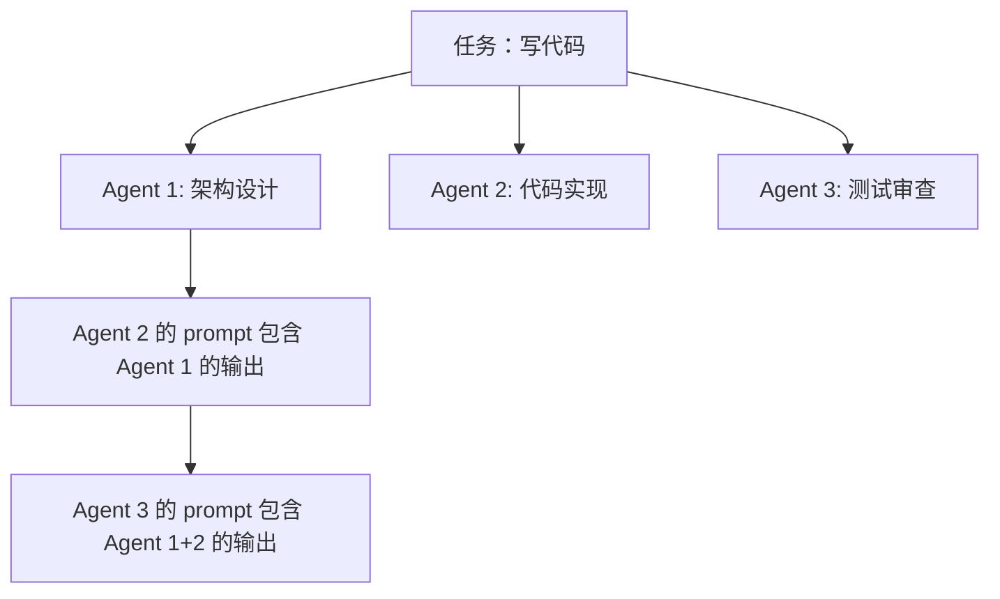
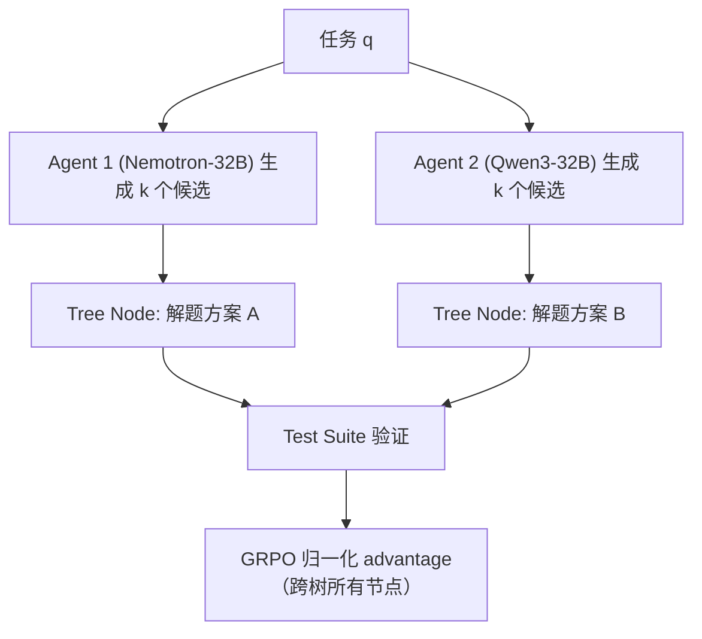
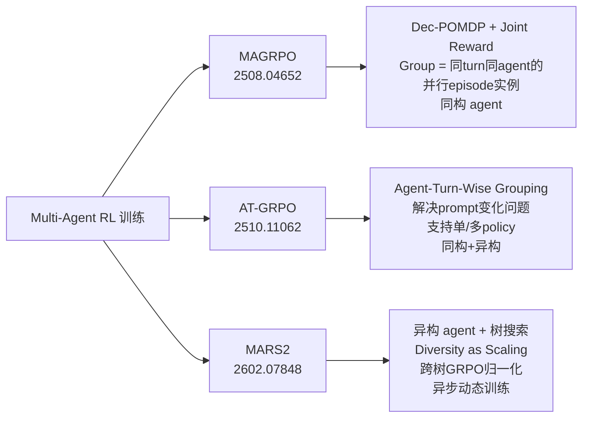

# Multi-Agent RL 训练专题 — 让多个 LLM 协作的 RL 方法论

> **核心命题**：Standard GRPO 的 grouping 假设（同一 prompt 下多个 rollout）在多 agent 场景中 break down——不同 agent 有不同角色、不同 prompt、不同 turn。Multi-Agent RL 需要专门设计的 advantage 估计方法。

---

## 一、为什么 Multi-Agent RL 不同于 Single-Agent RL

### 1.1 Standard GRPO 的假设

GRPO 对同一问题 $q$ 采样 G 个 rollout $\{y_1, ..., y_G\}$，用 group reward 均值+方差归一化计算 advantage：

$$\hat{A}_i = \frac{r_i - \text{mean}(\{r_j\})}{\text{std}(\{r_j\})}$$

**隐含假设**：所有 rollout 面对同一 prompt，policy 是同一个，只是 sampling 的随机性不同。

### 1.2 Multi-Agent 场景的 break-down



**Break-down 的三个维度**：

1. **Prompt 不同**：不同 agent 有不同的 system prompt（角色定义）和不同的 history（前几步的其他 agent 输出）
2. **Turn 不同**：同一 agent 在第 t 轮和第 t+1 轮的 prompt 已经不同（新增了上一轮的 feedback）
3. **Policy 可能不同**：异构 multi-agent 系统（MARS2）中不同 agent 有不同的基础模型

**后果**：把不同 agent 的 rollout 放入同一 group 计算 advantage，比较的是苹果和橙子——advantage 估计有偏。

---

## 二、三条技术路线

### 2.1 MAGRPO：Dec-POMDP + 集中训练/分散执行

**arXiv:2508.04652 | 2025-08-06**

#### 理论框架：Dec-POMDP

把 LLM 协作形式化为 Decentralized Partially Observable MDP：

$$\langle \mathcal{I}, \mathcal{S}, \{\mathcal{O}_i\}, \{\mathcal{A}_i\}, R, T, H \rangle$$

- $\mathcal{I}$：n 个 LLM agent
- $\mathcal{O}_i$：agent i 的 observation（自己的 prompt + history）
- $\mathcal{A}_i$：agent i 的 action（生成的 response）
- $R: \mathcal{S}^{acc} \times \mathcal{A} \rightarrow \mathbb{R}$：**joint reward**（所有 agent 共享同一 reward 信号）
- $T$：状态转移（所有 agent 的联合 action 触发环境更新）

**关键设计选择**：Joint reward（不是 individual reward）+ CTDE（集中训练，分散执行）

#### MAGRPO 算法

```
for episode:
  采样任务
  for turn t = 0 to H-1:
    每个 agent i 生成 G 个 rollout: a_{i,t}^{(1...G)}
    获取 joint reward r_t^{(g)}（联合奖励，所有 agent 共享）
    更新各 agent 历史
  
  反向计算 return: R_t^{(g)} = Σ_{τ=t}^{H-1} r_τ^{(g)}
  估计 advantage:
    Â_t^{(g)} = (R_t^{(g)} - mean_g(R_t)) / std_g(R_t)  # group-level 归一化
  更新各 agent 的 policy: θ_i ← θ_i + α∇J(θ_i)
```

**Advantage 估计**：在 group（G 个并行 rollout）内做相对归一化，group 内的 rollout 来自**同一 turn 的同一 agent**——避免了跨 agent 混合的问题。

$$\hat{A}_t^{(g)} = \frac{R_t^{(g)} - \frac{1}{G}\sum_{g'=1}^G R_t^{(g')}}{\text{std}_g(R_t^{(g)})}$$

**与 GRPO 的对比**：
- GRPO：G 个 rollout 都是对同一问题的独立采样，同一 policy 生成
- MAGRPO：G 个 rollout 是 G 个**并行的 episode 实例**，在每个 episode 内多 agent 协作

**实验结果**：writing + coding 协作任务，fine-tuning 后 agent 学到了有效的分工协作模式（不依赖 prompt engineering）。

**局限**：
- 短 horizon 任务验证（writing/coding 几轮）
- 未处理 agent 异构（不同 policy 网络）时的 advantage 估计问题
- Convergence guarantee 在 non-stationary 环境（多 agent 同时更新）下仍是 open problem

---

### 2.2 AT-GRPO (Stronger-MAS)：Agent-and-Turn-Wise Grouping

**arXiv:2510.11062 | 2025-10-13**

#### 核心问题的精确表述

MAGRPO 的 group 化仍然面临一个问题：即使是同一 turn 的同一 agent，在**不同的 episode rollout**中，该 agent 接收的 prompt 也可能不同（因为前几步其他 agent 的输出不同）。

**AT-GRPO 的解法**：Agent-and-Turn-Wise Grouping

把 grouping 单位定义为 $(i, t)$——第 $i$ 个 agent 在第 $t$ 个 turn 的 group：

$$\hat{A}_{i,t}^{(g)} = \frac{R_{i,t}^{(g)} - \text{mean}_{g'\in G_{i,t}}(R_{i,t}^{(g')})}{\text{std}_{g'\in G_{i,t}}(R_{i,t}^{(g')})}$$

其中 $G_{i,t}$ 是 agent $i$ 在 turn $t$ 的所有 rollout 实例（来自同一 group 内相同 agent/turn 位置的输出）。

**这样的 grouping 解决了什么**：
- 同一 agent、同一 turn 的多个 rollout，有相同的**角色 prompt**
- 但有不同的 **history**（因为前几步其他 agent 输出不同）
- Group 内的比较仍然有语义，reward 差异来自该 agent 在该 turn 的 action 质量差异

#### 训练系统支持

AT-GRPO 还提出了支持 multi-agent workflow rollout 的训练系统：
- **Single-policy regime**：多个 agent 共享同一 policy 网络（参数共享），不同 role 通过 system prompt 区分
- **Multi-policy regime**：不同 agent 有独立 policy 网络，需要协调更新

#### 实验结果（惊人）

| 任务 | Single-Agent RL | AT-GRPO Multi-Agent |
|------|-----------------|---------------------|
| 长 horizon 规划 | 14%~47% | **96%~99.5%** |
| 代码任务 | baseline | **+3.87%~7.62%** |
| 数学推理 | baseline | **+9.0%~17.93%** |

长 horizon 规划的 14% → 96% 跳跃极其惊人——这说明 multi-agent 分工可以把**单 agent 无法完成的长任务**拆解为多 agent 可以协作完成的子任务。

**关键结论**：Multi-agent 分工不是单 agent 的增量改进，而是**突破了单 agent 的 horizon 上限**。

---

### 2.3 MARS2：异构 Multi-Agent + 多样性 Scaling Law

**arXiv:2602.07848 | 上海AI Lab/清华/复旦 | 2026-02-11**
**完整笔记**：[[AI/Agent/Agentic-RL/MARS2-Multi-Agent-Scaling-Law-RL-Code-Generation]]

#### 核心创新：Diversity as a Scaling Dimension

```
单一 agent → 同质多角色 → 异构多 agent
    ↑              ↑              ↑
  baseline    多角色分工      不同基础模型
```

MARS2 的核心发现：**两个 32B 异构 agent（Nemotron + Qwen3）的代码生成能力 > 单个 72B**（等效计算量下）。

这证明 **Diversity = 独立的 scaling 维度**，不能被参数量 scaling 替代。

#### 算法：Multi-Agent Tree Search as Learnable Environment



**Group-level advantage**：跨整个 tree（所有节点、所有 agent）做 GRPO 归一化——这是 MAGRPO 的"跨 agent grouping"的合理版本，因为所有 agent 面对同一任务。

**异步动态训练**：每个 agent 维护独立 buffer，满了就更新，不需要等其他 agent——解决了多 agent 同步训练的瓶颈。

**多样性度量（三层）**：
1. 语义多样性（候选方案的语义距离）
2. 算法多样性（不同算法路径）
3. 认知推理多样性（推理风格差异）

#### 结果

- 2× 32B 异构 MARS2：代码生成 **77.7%**，超 O4-Mini(high) 和 GPT-5.1
- 超越等量参数的同质系统
- **MARS2+**：GSPO + Overlong Penalty + Token-level IS 进一步稳定长链推理

---

## 二点五、第四条路线：稳定性与精确归因（Dr. MAS + SHARP）

*（2026-02-24 补充，这两篇论文从"训练稳定性"和"credit 精确性"两个角度重新定义了问题）*

### Dr. MAS（arXiv:2602.08847，NTU Singapore）— 训练稳定性

**问题精确描述**：当不同 agent 高度专业化后，各 agent 的 reward 分布出现异质性：agent A（负责复杂推理）的 reward 方差大，agent B（负责格式化）的 reward 方差小。

GRPO 的全局 normalization $(μ, σ)$ 对异质 agent 产生梯度放大：

**Lemma 4.2（Dr. MAS）**：梯度二阶矩放大因子 = $(\sigma_k^2 + (\mu_k - \mu)^2)/\sigma^2$，随专业化程度必然趋于爆炸。

**解法**：Per-agent normalization，用 $(\mu_k, \sigma_k)$ 替换全局 $(\mu, \sigma)$，放大因子压回 1。

- 数学推理 +5.6%，多轮搜索 +15.2%
- **详细笔记**：[[AI/Agent/Agentic-RL/Dr-MAS-Stable-RL-Multi-Agent-LLM-Systems|Dr. MAS 精读笔记]]

### SHARP（arXiv:2602.08335，ICML 2026）— Credit 精确归因

**问题精确描述**：即使稳定了训练，global broadcast reward 仍然无法区分 planner 和 worker 的贡献——"谁真正赢得了这场胜利？"

**解法**：Shapley Value + Counterfactual Masking，三层 Reward 设计（见第四节4.2）

**关键洞察：Dr. MAS 和 SHARP 的关系**：
- Dr. MAS 解决的是**梯度稳定性**（训练不爆炸）
- SHARP 解决的是**credit 准确性**（reward 公平）
- 两者都独立发现了 per-agent normalization 的必要性，但出发角度完全不同
- 两者可以组合使用：SHARP 提供 per-agent reward → Dr. MAS 的 per-agent normalization 用这些 reward

**Multi-Agent RL 训练的两层问题**：
```
层1（稳定性）：梯度不爆炸 → Dr. MAS per-agent normalization
层2（准确性）：reward 公平 → SHARP Shapley attribution
两层都解决 → Multi-Agent RL 达到稳定且高效的训练
```

---

## 三、四条路线的统一对比



| 维度 | MAGRPO | AT-GRPO | MARS2 | Dr. MAS | SHARP |
|------|--------|---------|-------|---------|-------|
| Agent 类型 | 同构 | 同构/异构 | **异构** | 多角色 | Planner-Worker |
| 核心问题 | 框架缺失 | Grouping 偏差 | Diversity Scaling | **梯度爆炸** | **Credit 不公**|
| 解法 | Dec-POMDP + CTDE | Agent-Turn grouping | 树搜索 + 异步 | Per-agent norm | Shapley Masking |
| Reward | Joint | Joint | Joint | Joint | **三层分解** |
| 训练稳定性 | 一般 | 一般 | 异步缓解 | **✅ 理论证明** | Per-agent norm |
| Credit 准确性 | ❌ | ❌ | 部分（树对比）| ❌ | **✅ Shapley** |
| 关键数字 | 协作质量提升 | 规划 14%→96% | 77.7% 超 GPT-5.1 | 推理+5.6% | +23.66% vs single |
| 会议 | - | - | - | - | **ICML 2026** |

---

## 四、Multi-Agent RL 的核心技术挑战

### 4.1 Non-Stationarity（非平稳性）

**问题**：当 agent A 在训练时，agent B 也在同时更新。A 优化时看到的"environment"（包含 B 的 policy）是非平稳的——A 的最优策略随 B 的更新而变化。

**现有解法**：
- MAGRPO：joint reward + group归一化，部分缓解（所有 agent 朝同一方向优化）
- MARS2：异步更新（减少同步等待，但引入 off-policy 问题）
- 理论上：无收敛保证（Tan 1993），这是 open problem

### 4.2 Credit Assignment in Multi-Agent（多 agent 信用分配）

**问题**：Joint reward = 1，但 agent A 贡献了 70%，agent B 贡献了 30%——如何公平分配 credit？

**现有解法**：
- MAGRPO/AT-GRPO：不做 credit 分配，joint reward 平均分给所有 agent（可能导致 free-rider problem）
- MARS2：树搜索自然提供了 counterfactual（同一任务不同 agent 的候选对比）
- **SHARP（ICML 2026，arXiv:2602.08335）**：✅ 这个问题现在有了实用答案
  - **Shapley Value + Counterfactual Masking**：博弈论 Shapley 满足四公理，是"公平分配"唯一解
  - 实现：掩码 agent m 的输出，测 outcome delta = m 的边际贡献（指数计算的实用近似）
  - 三层 reward：global accuracy + Shapley 边际贡献 + 工具过程奖励
  - Per-agent normalization（与 Dr. MAS 殊途同归）
  - 结果：MuSiQue/GAIA/WebWalkerQA/FRAMES，+23.66% over single-agent，+14.05% over multi-agent
  - **详细笔记**：[[AI/Agent/Agentic-RL/SHARP-Shapley-Credit-Multi-Agent-Tool-Use-RL|SHARP 精读笔记]]

### 4.3 Role Specialization vs Homogenization

**问题**：multi-agent 训练是否会导致 role collapse——所有 agent 变得相同？

**MARS2 的发现**：异构基座（不同预训练的 LLM）比同构 agent 更能维持 diversity，因为"多样性"被 baked into 模型本身。

**Emergent Specialization**：AT-GRPO 实验中，相同 policy 的 agent 在 joint reward 下自发产生角色分工（无需显式角色 prompt）。

---

## 五、从单 Agent RL 到 Multi-Agent RL 的关键转变

| 概念 | Single-Agent RL | Multi-Agent RL |
|------|-----------------|----------------|
| 环境定义 | 外部 env（工具/API/OS）| 外部 env + 其他 agent |
| State | 任务历史 | 任务历史 + 其他 agent 的历史 |
| Reward | per-agent outcome | joint reward（共享）|
| Policy 更新 | 单 policy 梯度 | 多 policy 联合梯度（非平稳）|
| Credit | GRPO group normalization | joint reward sharing（不完全公平）|
| 收敛 | PPO/GRPO 有保证 | Dec-POMDP 无保证（open problem）|

---

## 六、启发思考与批判

**So What（MAGRPO）**：把 LLM collaboration 形式化为 Dec-POMDP 是重要的理论贡献——给出了清晰的数学框架，让 MARL 社区的成熟算法（MAPPO、QMIX 等）可以接入 LLM 训练。

**So What（AT-GRPO）**：长 horizon 规划 14%→96% 这个数字如果可复现，说明 multi-agent 分工**不只是性能增量，而是能力突破**。单 agent 在 long horizon 受限于 context window 和注意力衰减，multi-agent 分工可以天然地把长任务切分为短任务。

**So What（MARS2）**：Diversity as a scaling dimension 是方法论层面的贡献——2026 年的 scaling 不只是"更大的单一模型"，而是"更多样的 agent 组合"。这对 compute allocation 的决策有直接影响：购买一个 72B 模型，不如购买两个不同的 32B 模型。

**待解问题**：
- Non-stationarity 的理论解：multi-agent 训练的收敛条件是什么？（SeeUPO 对单 agent 多轮给了收敛保证，multi-agent 扩展尚未有人做）
- ~~Credit assignment：如何更公平地分配 joint reward？Shapley Value 的 approximation 方法能用吗？~~ ✅ **SHARP（ICML 2026）已回答**：counterfactual masking 近似 Shapley，+23% 提升
- 最优 agent 数量：2 agents 就够了吗？随 agent 数量增加，通信开销是否超过收益？
- 跨 episode 的 multi-agent 记忆：当 agent 之间需要共享长期状态时，如何处理？

**面试高频问法**：
- "standard GRPO 为什么在 multi-agent 场景 break down？" → 不同 agent 有不同 role/prompt，放入同一 group 比较没有语义
- "MARS2 为什么能超过更大的单一模型？" → Diversity as scaling dimension：异构基座的策略组合比同质 scaling 覆盖更大的解空间
- "Multi-agent joint reward 的问题是什么？" → Free-rider problem：贡献少的 agent 同样得到 reward，credit assignment 不公平
- "如何解决 multi-agent 的 credit assignment 问题？" → SHARP：Shapley Value + Counterfactual Masking，掩码 agent m 测 outcome delta，三层 reward 设计
- "Multi-agent 训练为什么梯度会爆炸？" → Dr. MAS：不同 agent reward 分布异质，全局 normalization 的梯度放大因子 = (σ_k²+(μ_k-μ)²)/σ²，随专业化趋于无穷；解法：per-agent normalization
- "RAGEN 的 Echo Trap 和 Dr. MAS 的梯度爆炸有什么区别？" → 维度不同：RAGEN 是单 agent 内部多轮 reward 同质化（梯度趋零），Dr. MAS 是跨 agent reward 异质化（梯度爆炸）

---

## 七、推荐阅读

- **MAGRPO 原论文**：[arXiv:2508.04652](https://arxiv.org/abs/2508.04652) — Dec-POMDP 框架化 LLM 协作
- **AT-GRPO 原论文**：[arXiv:2510.11062](https://arxiv.org/abs/2510.11062) — Agent-Turn-Wise grouping
- **MARS2 完整笔记**：[[AI/Agent/Agentic-RL/MARS2-Multi-Agent-Scaling-Law-RL-Code-Generation]]
- **Dr. MAS 完整笔记**：[[AI/Agent/Agentic-RL/Dr-MAS-Stable-RL-Multi-Agent-LLM-Systems|Dr. MAS]] — 梯度稳定性 + per-agent normalization
- **SHARP 完整笔记**：[[AI/Agent/Agentic-RL/SHARP-Shapley-Credit-Multi-Agent-Tool-Use-RL|SHARP]] — Shapley credit attribution，ICML 2026
- **AgentConductor**：[[AI/Agent/Multi-Agent/AgentConductor-Topology-Evolution]] — 拓扑演化视角
- **理论基础**：Dec-POMDP (Bernstein et al., 2002) / MAPPO (Yu et al., 2022) / CTDE 框架
- **对比参考**：[[AI/Agent/Agentic-RL/Agentic-RL-2026前沿综合分析]] — Single-Agent RL 全景

> **see-also（credit assignment 维度）**：[[AI/Agent/Agentic-RL/Long-Horizon-Credit-Assignment专题|Long-Horizon Credit Assignment 专题]] — Multi-Agent credit assignment 是 long-horizon CA 的 multi-agent 扩展：不只是"哪个 step 贡献大"，还是"哪个 agent 贡献大"；GiGPO 的 anchor-state grouping 与 AT-GRPO 的 agent-turn grouping 是同一问题的两种近似
>
> **see-also（训练稳定性维度）**：[[AI/Agent/Agentic-RL/Dr-MAS-Stable-RL-Multi-Agent-LLM-Systems|Dr. MAS（NTU，arXiv:2602.08847）]] — 多 agent 角色专业化导致 reward 分布异质，全局 GRPO normalization 梯度爆炸；Agent-Wise normalization 解法；与 RAGEN（单 agent Echo Trap）正交，合起来覆盖 Multi-Agent RL 训练稳定性完整版图
>
> **see-also（diversity scaling 维度）**：[[AI/LLM/Architecture/MoE 深度解析|MoE 深度解析]] — MARS2 的 Diversity scaling law（2×32B 异构 > 1×72B）与 MoE 的 expert diversity 机制有深层联系：两者都是通过路由不同的"专家"（异构 agent / expert 神经元）来覆盖更大的解空间，而非单一巨大模型

---

## 落地应用

**可用场景**：
- 复杂代码库生成（设计/实现/测试三角分工）
- 长 horizon 规划（规划/执行/验证多角色）
- 科研自动化（文献/实验/分析多专家协同）

**工程要点**：
- **Role 设计**：通过 system prompt 分配角色，不需要 hard constraint，RL 会自发分化
- **Joint reward 设计**：任务完成 = 1，否则 = 0；简单 binary 就够（AT-GRPO 验证）
- **Agent 数量**：2-4 个 agent 是实用上限；超过 4 个后通信和同步开销超过收益
- **同构 vs 异构**：
  - 同构：实现简单，参数共享节省显存
  - 异构：更高 diversity，但需要多套训练基础设施

**面试准备**：
- Multi-Agent vs Single-Agent RL 的区别（5个维度）
- MAGRPO / AT-GRPO / MARS2 的 advantage 估计方法区别
- Non-stationarity 问题的描述和现有缓解方法
