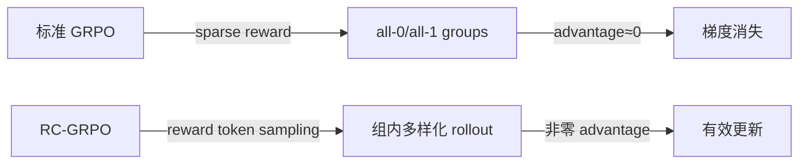

# RC-GRPO: Reward-Conditioned GRPO for Multi-Turn Tool Calling

## 核心问题：GRPO 在 Multi-Turn Tool Use 中的崩塌

GRPO 的基础假设：在一个 group 内，不同 rollout 会有不同 reward，从而形成有效的 advantage。

**但 multi-turn tool calling 破坏了这个假设**：
- 任务非 0 即 1（调用序列要么对要么错）
- Group 内往往大量 rollout 都 fail（all-0），或训练后期大量 rollout 都 succeed（all-1）
- 结果：advantage $= r_i - \bar{r} \approx 0$，**梯度消失，训练停滞**

这不是小 bug，是 sparse + binary reward 场景下 GRPO 的结构性缺陷。

## RC-GRPO 解法：把探索变成可控的 steering

**核心 insight**：与其让 model 随机探索，不如**主动要求它生成不同质量的轨迹**。

### 两阶段设计

**阶段 1 — RCTP（Reward-Conditioned Trajectory Policy）微调**

在混合质量轨迹（正样本 + 负样本）上，将 reward goal token 注入 prompt：

```
<|system|>
...
<|high_reward|>  ← 注入 goal token
<|user|>
请调用工具完成以下任务...
```

- `<|high_reward|>` → 模型学习生成高质量轨迹的 pattern
- `<|low_reward|>` → 模型学习生成低质量轨迹的 pattern（显式学习 failure mode）

类比：就像告诉模型"给我演示一个好的做法"vs"给我演示一个差的做法"——模型学习到两种分布。

**阶段 2 — RC-GRPO RL 训练**

在每个 GRPO group 内，**采样多样化的 reward token**：

$$\text{Group} = \{(\text{rollout}_1, \text{goal}=\texttt{<|high\_reward|>}), (\text{rollout}_2, \text{goal}=\texttt{<|low\_reward|>}), ...\}$$

效果：
- 带 `<|high_reward|>` token 的 rollout 倾向成功 → reward 较高
- 带 `<|low_reward|>` token 的 rollout 倾向失败 → reward 较低
- **组内 reward variance 被人为引入** → advantage 非零 → 梯度有效

这本质上是把 exploration 问题转化为 **controllable generation** 问题。

## 与 GRPO 的对比



**关键等式**：
$$\text{advantage}_i = r_i - \bar{r}_{\text{group}}, \quad \text{其中 RC-GRPO 确保 } \text{Var}(r_{\text{group}}) > 0$$

## 实验结果

**BFCLv4 Multi-Turn Benchmark**（比 BFCLv3 更难）：

- Qwen-2.5-7B-Instruct + RC-GRPO **超过所有闭源 API 模型**
- 相对 baseline GRPO，多任务 setting 下持续提升

（注：论文未提供完整数字表格，benchmark 结果在 paper Figure 中呈现）

## 批判性分析

### 真正的贡献

**问题诊断是正确的**：multi-turn tool use 的 binary sparse reward 确实会导致 GRPO all-0/all-1，这是实际训练中经常被忽视的问题。Reward token conditioning 是优雅的解法，不需要改变 GRPO 的核心算法。

### 值得怀疑的地方

1. **RCTP 质量依赖负样本**：需要有足够好的"坏轨迹"来训练 `<|low_reward|>` conditioning。如果负样本不够多样，阶段 1 的 conditioning 能力有限
2. **goal token 的 leak 问题**：推理时只用 `<|high_reward|>`，但训练时模型同时学了 low 的情况——是否存在分布 gap？
3. **与其他 exploration 方法对比不足**：论文未与 VAM（Verbalized Action Masking）或 DEEP-GRPO 比较，这些也是处理 exploration 的方法

### 与其他工作的关系

| 方法 | 解决探索问题的思路 |
|------|-----------------|
| **RC-GRPO** | reward token conditioning → 强制组内多样性 |
| **DEEP-GRPO** | 难样本重采样 + pivot resampling |
| **IntroLLM** | 温度策略 + 分层探索粒度 |
| **VAM** | verbalized action masking 屏蔽无效动作 |
| **PACED-RL** | 课程学习，动态调整任务难度 |

RC-GRPO 是从 **group diversity** 角度解决的，与其他方法正交，可以组合。

---

## 工程要点

**实施步骤**：
1. 收集混合质量轨迹（正 + 负，比例建议 1:1 或调 class weight）
2. 注入 reward goal token 微调 RCTP（≈ 普通 SFT，只是 prompt 不同）
3. RL 阶段：每次采样 group 时，随机分配 goal token，让一半 rollout 用 high，一半用 low
4. 推理：只用 `<|high_reward|>`

**注意事项**：
- goal token 需要加入 special token vocab，不能用普通词
- RCTP 训练数据必须包含真实的低质量轨迹，不能都是高质量

---

## 落地应用

**可用场景**：
- 任何 binary/sparse reward 的 RL 任务（tool use、code generation、任务规划）
- 特别适合 multi-turn 对话 RL，因为 trajectory 结果通常非 0 即 1

**面试高频问法**：
- Q: GRPO 在 sparse reward 场景下有什么问题？如何解决？
  - A: all-0/all-1 group 导致 advantage 趋零、梯度消失。RC-GRPO 用 reward token conditioning 强制 group 内 reward 多样性；DEEP-GRPO 用难样本重采样；PACED-RL 用课程学习避开极端任务

---

## 启发思考

**So What**：RC-GRPO 揭示了一个被忽视的训练陷阱——GRPO 的 group normalization 假设需要 reward variance，但很多实际任务不满足。把"探索"转化为"controllable steering"是个 elegant 的思路，比暴力调参稳定。

**局限**：
- 需要高质量的负样本（多样的 failure modes）
- Goal token 在推理时的 decoding 温度需要谨慎调整

**脑暴**：能否在 ASTRA 的 F1 reward 框架中用 RC-GRPO？ASTRA 的 RL 阶段正好有 trajectory-level binary-ish reward（完成/未完成），RC-GRPO 可以直接插入。

---

## 推荐阅读

- 原论文：[arXiv:2602.03025](https://arxiv.org/abs/2602.03025)
- [[AI/Agent/Agentic-RL/ASTRA-Automated-Tool-Agent-Training|ASTRA]] — RC-GRPO 解决的是 ASTRA RL 阶段 GRPO 崩塌问题，可直接插入 ASTRA 训练框架
- DEEP-GRPO（另一种 exploration 方案）：[[AI/LLM/RL/Other-Algorithms/DEEP-GRPO-Deep-Dense-Exploration-Pivot-Resampling|DEEP-GRPO]]
- IntroLLM（温度策略驱动探索）：[[AI/LLM/RL/Other-Algorithms/IntroLLM-Introspective-Temperature-Policy-Hierarchical-RL|IntroLLM]]
- VAM（动作空间裁剪探索）：[[AI/LLM/RL/Other-Algorithms/VAM-Verbalized-Action-Masking-Exploration|VAM]]
- 专题：[[AI/Agent/Agentic-RL/Tool-Use-RL-训练专题|Tool-Use-RL 训练专题]] | [[AI/LLM/RL/GRPO/GRPO-Improvement-Panorama-2026|GRPO Improvement Panorama]]
- **行为坍缩防御**：[[AI/Agent/Agentic-RL/SCoRe-Self-Correction-via-Reinforcement-Learning|SCoRe（NeurIPS 2024）]] — 同样处理 multi-turn sparse reward 同质化，RC-GRPO 用 conditioning token，SCoRe 用 reward bonus + KL 约束，路线互补
