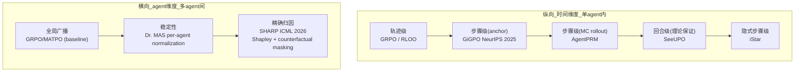

# SHARP: Shapley Credit-based Optimization for Multi-Agent System

> **arXiv**: 2602.08335 | **会议**: **ICML 2026** | **机构**: 多机构（Li Shen 等）| **时间**: 2026-02-09  
> **评分**: ★★★★☆ | **主题**: Multi-Agent Credit Assignment + Tool-Use RL  
> **关键词**: Shapley value, multi-agent credit assignment, tool-integrated planning, counterfactual masking

---

## 一句话定位

SHARP 把博弈论中的 Shapley value 引入 multi-agent LLM 训练，通过**反事实掩码机制**精确量化每个 agent 的边际贡献，解决 multi-agent RL 中 "谁应该获得奖励" 的 credit assignment 难题。ICML 2026。

---

## 问题定义

### Multi-Agent Tool-Integrated Planning (TIP)

**场景**：一个 Planner + N 个 Worker，共用同一个底层模型（shared policy），通过 role-specific system prompt 区分角色。

轨迹结构：
$$\tau = (\tau^0, \tau^1, \tau^2, \ldots, \tau^T)$$
- $\tau^0$：Planner 的 reasoning trace（高层分解）
- $\tau^t$：第 t 个 Worker 的执行轨迹（工具调用序列）

联合轨迹概率：
$$P_\theta(\tau) = P_\theta(\tau^0) \prod_{t=1}^T P_\theta(\tau^t | a_t)$$

**Self-play 范式**：planner 和 worker 共享参数，通过 prompt 区分角色。这类似于 Dr. MAS 中的 heterogeneous agent 设定。

### 核心挑战：Credit Assignment

现有方法的问题：
- **Sparse broadcast reward**（GRPO/MATPO 等）：把 final outcome 广播给所有 agent，无法区分谁真正贡献了什么
- 后果：一个 worker 做得好但 planner 失败 → worker 也收到负奖励；反之亦然
- 梯度信号模糊 → 训练低效，agent 不能发展出专业化能力

---

## SHARP 的核心方法

### 三公理 Reward 设计

SHARP 从三个公理出发设计 reward decomposition：

| 公理 | Reward 分量 | 含义 |
|------|------------|------|
| **Global Alignment** | $R_{\text{acc}}(\tau)$ | 任务终态成功与否，对齐整体目标 |
| **Marginal Attribution** | $R_m^{\text{Shapley}}$ | 每个 agent 的边际贡献（核心创新）|
| **Process Reward** | $R_m^{\text{tool}}$ | 工具调用执行有效性 |

最终 reward：
$$R_{i,m} = R_{i,m}^b + \lambda_s \cdot R_{i,m}^{\text{Shapley}} + \lambda_p \cdot R_{i,m}^{\text{tool}}$$

### 关键创新：Shapley Value + Counterfactual Masking

**Shapley Value 的直觉**：在合作博弈中，player m 的公平贡献 = 在所有可能的 player 排列中，m 加入时带来的平均边际增益。

**对于 multi-agent LLM**：

$$\phi_m = \sum_{S \subseteq \mathcal{M} \setminus \{m\}} \frac{|S|!(|\mathcal{M}|-|S|-1)!}{|\mathcal{M}|!} \left[v(S \cup \{m\}) - v(S)\right]$$

其中 $v(S)$ 是只用 agent 集合 S 时的任务完成度。

**实现：Counterfactual Masking**

直接枚举所有子集 $2^{|\mathcal{M}|}$ 个组合不可行（指数复杂度）。SHARP 用 **counterfactual masking** 近似：

1. 生成完整轨迹 $\tau$
2. 要计算 agent m 的贡献：将 m 的输出从轨迹中**掩码**，用 placeholder 替换
3. 计算有 m 和无 m 时的 outcome 差值：$\Delta_m = r(\tau) - r(\tau \setminus m)$
4. Shapley credit = $\Delta_m$（边际贡献的近似）

**为什么这能 work？**
- 反事实推断（counterfactual）：如果没有 agent m 的贡献，结果会如何？
- 因果隔离：通过掩码精确测量 m 的独立贡献，排除协同效应的干扰

### Per-Agent Advantage Normalization

在 GRPO 框架内，对每个 agent m 独立计算 advantage：

$$\hat{A}_{i,m} = \frac{R_{i,m} - \mu_m}{\sigma_m}$$

其中 $\mu_m, \sigma_m$ 是 agent m 在 trajectory group 内的 reward 均值和标准差。

**注意**：这与 Dr. MAS 的 per-agent normalization 思路相同！两篇论文独立地发现了同一个设计原则：不同 agent 的 reward 分布异质，必须 per-agent 归一化。

---

## 实验结果

**Backbone**：Qwen3-8B（主实验）

**Benchmark 覆盖**（全部 multi-hop 推理/QA/网页操作）：
- MuSiQue（多跳 QA）
- GAIA-text（通用 AI 助手 benchmark）
- WebWalkerQA（网页遍历 QA）
- FRAMES（多文档问答）

**主要结果**：
| 对比方向 | 平均提升 |
|---------|---------|
| vs. 单 agent 方法 | **+23.66%** |
| vs. 多 agent 方法（MATPO 等）| **+14.05%** |
| DocMath-Eval（跨任务泛化）| 强泛化 |
| 8B 模型 scaling law | 14.41 points vs. single-agent |

**额外发现**：协调分析显示 SHARP 将"有害 subagent"比例从 5.48% 降到 4.40%，说明精确 credit 真的改变了 agent 的行为策略。

---

## 与现有工作的关系

### Credit Assignment 谱系中的位置

| 方法 | 层级 | 依赖 | 关键机制 |
|------|------|------|---------|
| GRPO（baseline）| 轨迹级 | 无 | 全局 broadcast |
| GiGPO | 步骤级 | 无 | Anchor State Grouping |
| AgentPRM | 步骤级 | MC rollout | PRM 估计 |
| **SHARP** | **Agent 级**（Multi-Agent）| Counterfactual | Shapley Value |
| Dr. MAS | 算法稳定性 | 无 | Per-agent normalization |
| SeeUPO | 回合级（Turn-level）| 无 | Backward induction |

**SHARP 的独特性**：在 multi-agent 分解（planner+worker）场景下解决横向（不同 agent 之间）的 credit assignment。GiGPO/AgentPRM 解决的是纵向（同一 agent 的不同时间步）credit assignment。

### 与 Dr. MAS 的关联

- Dr. MAS：发现 global normalization 导致梯度爆炸，解法是 per-agent normalization（稳定性视角）
- SHARP：发现 global broadcast reward 导致 credit 模糊，解法是 Shapley-based per-agent reward（准确性视角）
- 两者在 per-agent 设计上殊途同归，但出发点不同

---

## 批判性评价

### 值得关注的点

1. **Shapley value 的选择有理论依据**：Shapley 满足 efficiency + symmetry + dummy + additivity 四公理，是博弈论中"公平分配"的唯一解。将其引入 multi-agent RL credit assignment 有数学基础。

2. **实验结果显著**：+23.66% over single-agent 是大幅提升，而且在 4 个 benchmark 上一致。

3. **ICML 背书**：同行评审质量保证。

### 值得质疑的点

1. **Shapley 计算的近似质量**：counterfactual masking 是 Shapley 的近似，不是精确计算。论文没有验证近似误差，也没有 ablation 对比精确 Shapley vs. masking 近似。

2. **Masking 假设**：把 agent m 的输出掩码后，其他 agent 的行为会改变吗？轨迹 $\tau \setminus m$ 并不是真实的"没有 m 时的轨迹"，而是人工构造的。这是 post-hoc 归因而非因果推断。

3. **三超参调优**：$\lambda_s$（Shapley weight）和 $\lambda_p$（process weight）需要调参，实际工程中可能不稳定。

4. **Self-play 限制**：planner 和 worker 共享同一模型，这限制了模型间专业化分工的上限。异构 agent（不同模型）的 SHARP 是否 work 未验证。

---

## 工程意义

**何时用 SHARP？**
- 有明确 planner-worker 分工的 multi-agent 系统
- 任务可以分解为独立子任务
- 需要 agent 专业化（各自 reward 不同）

**局限场景**：
- 单 agent 场景（无需 credit assignment across agents）
- agent 之间高度耦合（masking 假设崩溃）

---

## Credit Assignment 全景更新（2/24）

---

## See Also

- [[AI/Agent/Agentic-RL/GiGPO-Group-in-Group-Policy-Optimization|GiGPO（NeurIPS 2025）]] — **正交互补**：GiGPO 解决纵向（单 agent 不同时间步）credit，SHARP 解决横向（多 agent 之间）credit；两者可组合
- [[AI/Agent/Agentic-RL/Dr-MAS-Stable-RL-Multi-Agent-LLM-Systems|Dr. MAS（NTU，arXiv:2602.08847）]] — **殊途同归**：Dr. MAS 从稳定性出发（per-agent normalization），SHARP 从准确性出发（Shapley reward）；两者都指向 per-agent 设计原则
- [[AI/Agent/Agentic-RL/Multi-Agent-RL-训练专题|Multi-Agent RL 训练专题]] — MAGRPO/AT-GRPO/MARS2 全图谱，SHARP 是横向 credit 专项深挖
- [[AI/Agent/Agentic-RL/MIG-Step-Marginal-Information-Gain-Credit-Assignment|MIG]] — 同样基于"边际贡献"信息论视角，但 MIG 是纵向单 agent 步骤级，SHARP 是横向 multi-agent 级；两者哲学同源
- [[AI/Agent/Agentic-RL/Long-Horizon-Credit-Assignment专题|Long-Horizon Credit Assignment 专题]] — 完整 CA 谱系，SHARP 是最新加入的横向维度
- [[AI/Agent/Agentic-RL/SeeUPO-Sequence-Level-Agentic-RL-Convergence-Guarantees|SeeUPO（arXiv:2602.06554）]] — turn-level CA 的理论保证版，与 SHARP 的 agent-level CA 处于不同粒度

## 推荐阅读

1. **SHARP 原文**：arXiv:2602.08335 — 重点读 Section 3（方法）和 Appendix A（Shapley 四公理证明）
2. **Shapley (1953)**：原始博弈论论文，理解四公理的历史意义
3. **GiGPO**（arXiv:2505.10978）— 对比纵向 vs 横向 credit assignment 的设计差异
4. **Dr. MAS**（arXiv:2602.08847）— per-agent normalization 的另一个独立发现，对比与 SHARP 的异同

---

*笔记时间：2026-02-24 | 心跳第25次*
