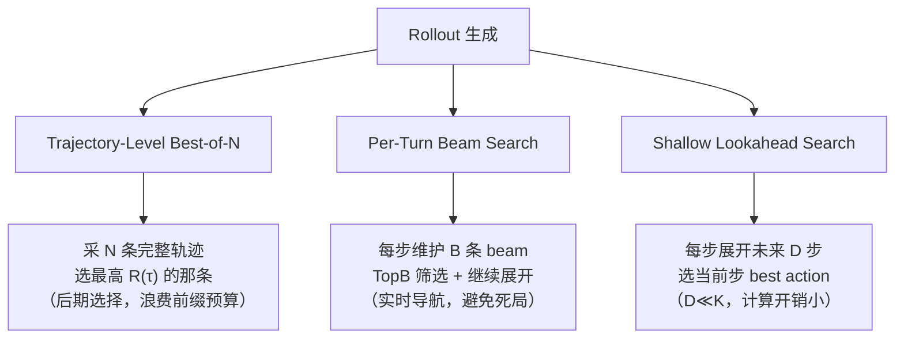
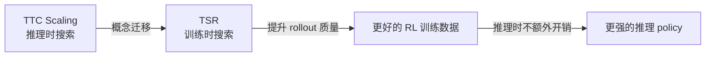

# TSR：把 Test-Time Search 搬到 Training-Time Rollout

> **一句话**：naive rollout 采样是 multi-turn RL 不稳定的根源——TSR 用轻量树搜索优化每步 rollout 生成，让数据质量本身承担稳定训练的责任，而不是修改优化算法。

## 核心问题：Multi-Turn RL 为什么脆？

Multi-turn RL 训练的三个结构性痛点：

### 1. 稀疏/延迟 Reward
Per-turn reward 往往为零，只有 episode 结束才有信号（e.g., WebShop 购买成功）。Naive rollout 产生大量"near-miss"轨迹，这些轨迹的 advantage 估计极不稳定。

### 2. 不可逆陷阱（Irreversible Traps）
很多环境是 prefix-sensitive 的：早期一步错误 → 整个 episode 无法挽回。论文用 Sokoban 的"Corner Trap"展示：把箱子推向墙角后 agent 无论怎么走都无法完成任务，但 naive 采样会一直生成这类死局轨迹。

### 3. 多样性不足 → Mode Collapse（Echo Trap）
On-policy 方法如果重复采样同一成功轨迹，所有动作的相对 advantage ≈ 0 → 梯度消失 → policy 原地踏步。**Echo Trap**：RAGEN 框架中记录的现象，policy performance 在训练中突然崩塌。

## TSR 的设计：把 Search 从推理时移到训练时

**核心思路**：test-time scaling 里的 search（Best-of-N、Beam、Lookahead）能在推理时提升质量，为什么不在训练时的 rollout 生成阶段做同样的事？

### 框架形式化

给定任务 $u$，TSR 运行：

$$\text{TSR}:(\pi_\theta, u, S, K, \mathcal{F}_\phi) \longrightarrow \{\tau_1, \dots, \tau_L\}$$

- $\pi_\theta$：当前 policy
- $S(\tau_{<t}, a_t, o_t) \in \mathbb{R}$：**scoring function**（per-turn 打分，可用 reward、启发式 proxy、语义相似度等）
- $K$：最大 horizon
- $\mathcal{F}_\phi$：搜索策略

关键：**TSR 只改 rollout 生成过程，不改 policy gradient 目标**。

### 三种搜索策略

**Beam Search 是核心**：不像 Best-of-N 在轨迹结束才筛，Beam 在每个 turn 做 TopB 筛选，主动绕过不可逆陷阱。形式化：

$$\mathcal{B}_{t+1} = \text{Top}_B\{(\tau_{<t} \circ a_t) \mid \tau_{<t} \in \mathcal{B}_t, a_t \in \mathcal{A}_t\}$$

### Scoring Function 的适配性

TSR 不假设 reward 可用，scoring function 可以是：
- **Deterministic 环境（Sokoban）**：直接用 per-turn reward
- **Stochastic 环境（FrozenLake）**：risk-aware heuristic（避险启发式）
- **Delayed reward（WebShop）**：progress-based / semantic score（购物进度代理分）

这种抽象让 TSR 适用于 verifiable reward 缺失的场景（和 CM2 互补）。

### Instance Filtering（多样性保障）

TSR 提升 exploitation（搜索高质量轨迹），但不保证 exploration。配套机制：**Uncertainty-based Instance Filtering**：

$$U(u; \pi_\theta) = \text{Std}_{\tau \sim \pi_\theta(\cdot|u)}[R(\tau)]$$

只保留 reward 方差最高的 top-p% task groups（neither trivial successes nor consistent failures），提供最大学习信号。

## 实验结果

**实验设置**：Qwen2.5-0.5B / 3B，基于 RAGEN 框架，PPO + GRPO

| 环境 | 特征 | TSR 提升 |
|------|------|----------|
| Sokoban | Deterministic logic puzzle | 显著，更稳定 |
| FrozenLake | Stochastic, sparse reward | 显著，防止 Echo Trap |
| WebShop | Long-horizon, delayed reward | 显著 |

- **最高 +15% absolute performance**（vs naive rollout baseline）
- **关键发现**：0.5B TSR 模型可媲美 3B naive rollout 模型——搜索换参数
- 训练曲线更平滑（Echo Trap 减少）
- **固定一次性 compute 开销**（训练时多用，推理时不变）

## TSR vs RAGEN Instance Filtering（StarPO）对比

| 特征 | StarPO（拒绝采样风格） | TSR Beam/Lookahead |
|------|----------------------|-------------------|
| 操作粒度 | Trajectory-level（整条选/拒） | Per-turn（每步筛选） |
| 是否避免死局 | 否（进入死局后才筛掉） | 是（Beam 实时绕过） |
| 多样性 | 依靠 instance filtering | 同样需要 instance filtering |
| 计算开销 | 低 | 高（但 one-time） |

TSR Beam > StarPO 的核心在于**主动 per-turn 导航**，而非事后轨迹筛选。

## 与 TTC Scaling 的关系

TSR 是 **test-time compute → train-time compute** 的一次有趣转移：

ConformalThinking 是在推理时控制 compute budget，TSR 是在训练时加大 compute 换 rollout 质量——两者互补，都是"compute 怎么花"的问题。

## 学者评价

**为什么 ★★★★☆**：

TSR 的 insight 简洁有力：**rollout 质量是 multi-turn RL 稳定性的隐性变量，而这个变量以前被完全忽视了**。大家都在改 PPO/GRPO 的损失函数，TSR 说"等等，先把训练数据质量提上去再谈优化"——这是思路层面的转换。

Echo Trap 的诊断（mode collapse 的具体机制：重复成功轨迹 → advantage≈0）是有价值的现象命名，值得关注。

**局限**：
- 训练 compute 增加（虽然是 one-time）：Beam Search branching factor M × beam width B = M×B 倍的 rollout 开销，大规模训练时不可忽视
- Scoring function 设计是隐性工程量：proxy score 的质量决定搜索质量，论文没有充分讨论 bad proxy 的风险
- 环境较简单（Sokoban/FrozenLake/WebShop），是否 scale 到真实 SWE-bench/OSWorld 级别任务尚不清楚

**与 CM2 的关系**：
- CM2 解决 reward 信号的质量（用 checklist）
- TSR 解决 rollout 数据的质量（用搜索）
- 两者是 multi-turn agent RL 的**双支柱**：好的 reward + 好的 rollout

## 面试高频问法

**Q: Multi-turn RL 训练不稳定的根因是什么，有哪些解法？**

三个根因：稀疏 reward / 不可逆陷阱 / 多样性不足。解法：①Credit assignment（GiGPO/AgentPRM/LOOP）②Reward 设计（CM2 Checklist / RLVR）③**Rollout 质量**（TSR：per-turn tree search）。TSR 的特殊价值在于 optimizer-agnostic，正交于前两类。

**Q: Test-Time Compute Scaling 和 Training-Time Compute 有什么关系？**

TTC 是推理时搜索换精度，TSR 是训练时搜索换 rollout 质量。前者影响推理成本，后者影响训练成本但不增加推理成本。TSR 是 TTC 思路的 training 侧移植，verify 了 search 在两个阶段都有效。

## 落地应用

**可用场景**：
- 任何 multi-turn agentic RL 训练（WebShop、OSWorld、SWE-bench、ALFWorld）
- 稀疏 reward 或不可逆环境（Echo Trap 风险高的任务）
- 希望用小模型达到大模型效果（0.5B TSR ≈ 3B naive）

**工程要点**：
- Branching factor M 和 beam width B 是关键 compute 预算参数
- Scoring function 需要针对任务设计（reward available → 直接用；delayed → proxy score）
- 与 instance filtering 配合使用（TSR 负责质量，filtering 负责多样性）

## 推荐阅读

- **原始论文**：[arXiv:2602.11767](https://arxiv.org/abs/2602.11767)
- **框架基础**：RAGEN（训练评测框架，StarPO/Echo Trap 定义来源）
- **互补工作**：[[AI/Agent/Agentic-RL/CM2-Checklist-Rewards-Multi-Turn-Tool-Use-RL|CM2]]（reward 侧 vs rollout 侧双支柱）
- **Credit assignment**：[[AI/Agent/Agentic-RL/Long-Horizon-Credit-Assignment专题|Long-Horizon Credit Assignment 专题]]（GiGPO/AgentPRM/LOOP）
- **TTC 对照**：[[AI/LLM/Inference/ConformalThinking-Risk-Control-Test-Time-Compute|ConformalThinking]]（推理时 compute 控制）
- **综合视角**：[[AI/Agent/Agentic-RL/Agentic-RL-2026前沿综合分析|Agentic RL 2026 综合分析]]
