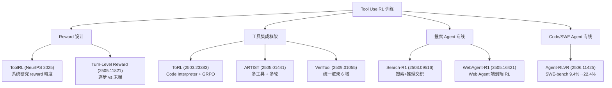
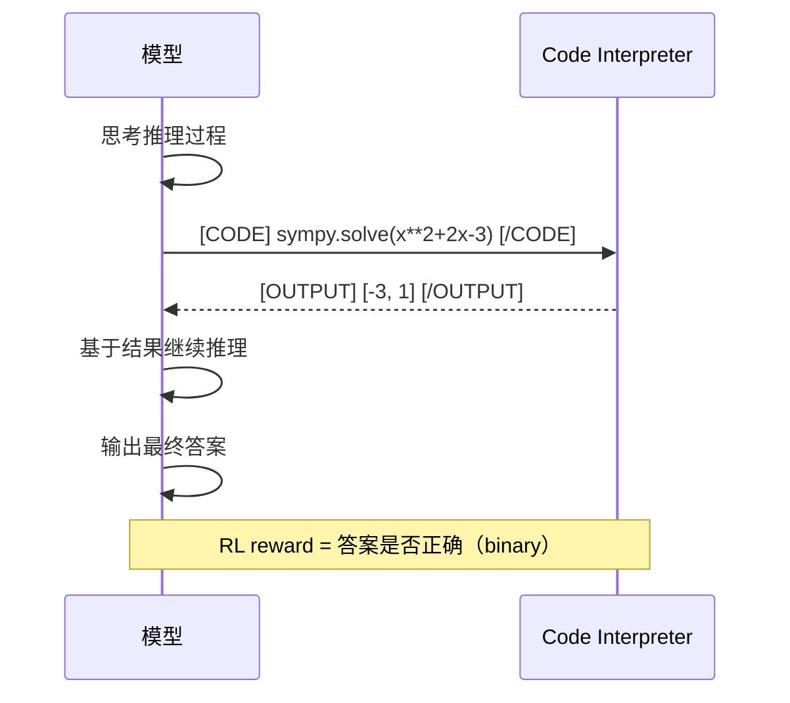
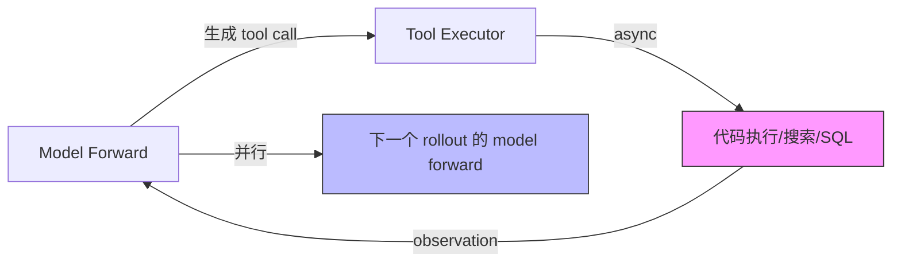
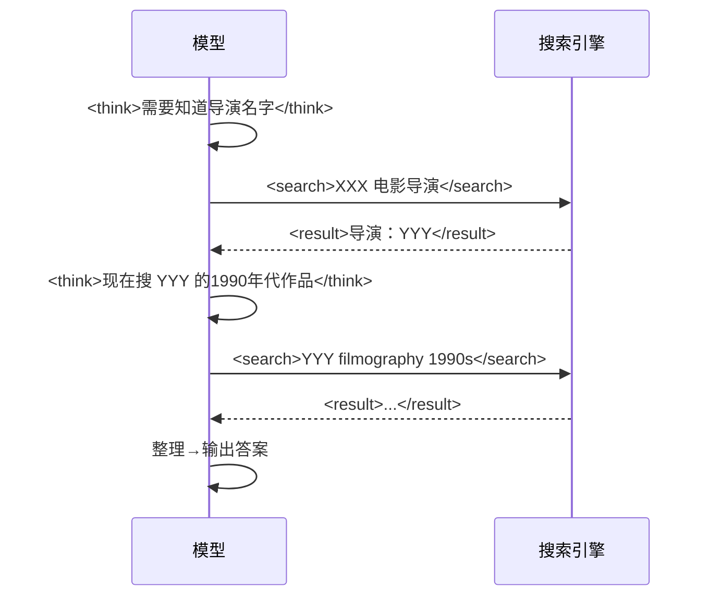
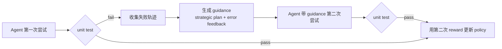
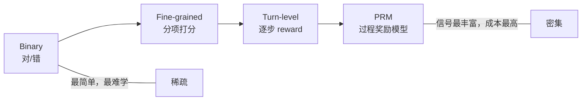

# Tool Use RL 训练专题 — 用 RL 教模型学会使用工具

> 这篇笔记专注**训练**问题：怎么用 RL 让模型真正学会使用工具，而不是靠 SFT 模板化地输出格式。SFT 教格式，RL 教策略——这是根本区别。

---

## 一、为什么 SFT 不够用

传统 Tool Use 训练是 SFT：收集人工标注的"调用示例"，教模型模仿格式。这有三个根本性缺陷：

1. **泛化弱**：只会模仿见过的工具调用模式，遇到 unseen 工具或 edge case 就崩
2. **不会策略性决策**：不知道"什么时候调用工具"，只会"哪里有占位符就填什么"
3. **无法优化多轮**：SFT 是 token 级监督，无法建模"这次调用的结果对最终任务是否有帮助"

**RL 的核心优势**：以结果为导向，让模型自己探索出最优工具调用策略，而不是模仿人类轨迹。ToRL（arXiv 2503.23383）实验证明 RL 训练出的模型会**涌现** SFT 数据里没有的策略——"不确定时才用工具验证，确定时直接推理"。

---

## 二、核心论文图谱



---

## 三、ToolRL — Reward 是 Tool Learning 的一切

**NeurIPS 2025 Poster | OpenReview eOLdGbXT6t**

### 核心贡献

ToolRL 是第一篇系统性研究 Tool Use reward design 的论文，回答：**reward 的什么属性决定了训练成败？**

研究了四个维度：
- **类型**：binary / categorical / continuous
- **粒度**：工具名 / 参数名 / 参数值分项 vs 整体
- **时间结构**：末端 only vs 中间步骤也给
- **量级**：reward 绝对值和比例

### 关键发现：粒度是最关键变量

**为什么 coarse-grained reward 失效**：

任务"查天气 + 订机票"，工具链 $\text{weather\_api}(city) \to \text{book\_flight}(from, to, date)$。

Binary reward（机票订没订上，0/1）的问题：weather 调用对了也得 0，模型无法知道哪步错了，credit assignment 彻底混乱。

**细粒度分项打分方案**（最优）：

$$r_{total} = r_{\text{tool\_name}} + r_{\text{param\_count}} + r_{\text{param\_values}} + r_{\text{outcome}}$$

每项独立评分，权重可调，模型得到精确的定位反馈。

### 结果
- vs base model: **+17%**（arXiv 未公开全文，引自 NeurIPS openreview）
- vs SFT baseline: **+15%**
- 泛化到 unseen 工具和复杂组合

---

## 四、ToRL — Tool-Integrated RL（数学+代码工具）

**arXiv 2503.23383 | GAIR-NLP**
**完整笔记**：[[AI/Agent/Agentic-RL/ToRL-Tool-Integrated-Reinforcement-Learning|ToRL 深度精读]]

### 核心设计

把 Code Interpreter 作为工具，配合 GRPO 训练数学推理（TIR = Tool-Integrated Reasoning）：



Reward 仍是 binary（最终答案对错），但模型在 RL 探索中自然发现了工具的价值。

### 涌现行为（未被显式监督）

1. **Strategic invocation**：不确定时才调用工具，确定时直接推理（节省 token）
2. **Self-regulation**：代码报错 → 自动修改重试，而不是放弃
3. **Dynamic adaptation**：简单问题用分析法，复杂用代码——自主切换

### 效果
- ToRL-7B on AIME 24: **43.3%**（arXiv 2503.23383, Table 2）
- vs RL without tool: **+14%**
- vs 最好 SFT TIR 模型: **+17%**

---

## 五、ARTIST — 多工具 + 多轮 Agent RL

**arXiv 2505.01441 | Microsoft Research, MSR-TR-042025-V1**
**完整笔记**：[[AI/Agent/Agentic-RL/ARTIST-Agentic-Reasoning-Tool-Integration-RL|ARTIST 深度精读]]

### 核心问题

ToRL 只有一种工具。真实 Agent 需要同时解决三个决策：
- 用哪个工具？（工具选择）
- 什么时候用？（时机决策）
- 怎么组合序列？（调用编排）

### 为什么 outcome-based RL 在多工具场景也能 work

多工具 + 多步 + 只用末端 reward，直觉上极度稀疏。ARTIST 的三个原因：

1. **多样化 rollout**：同一问题采多条 trajectory，自然覆盖不同工具组合
2. **GRPO group advantage**：同一问题的不同轨迹相互对比，自然区分好坏组合
3. **工具执行本身是 implicit dense signal**：代码报错 vs 成功输出，提供中间验证

工具集：Python interpreter + SymPy + Search API + Custom domain APIs

### 效果
- 数学推理 benchmark: vs base model **+22%** 绝对提升（arXiv 2505.01441, Table 1）
- Function calling benchmark: 强于所有 SFT baseline

---

## 六、VerlTool — 统一 Agentic RL 框架

**arXiv 2509.01055 | NUS 等**

VerlTool 不是新算法，是解决**工程碎片化**的框架。

**现有问题**：每篇论文自己写一套 codebase，tool 调用是 blocking I/O，GPU 等工具执行→浪费算力。

**核心贡献**：

$$\text{Speedup} \approx 2\times \quad \text{（异步 rollout，工具执行与模型前向并行）}$$



覆盖 6 个 ARLT 域：数学 / 代码 / 搜索 / 数据库 / 多模态 / 通用 agent

---

## 七、Search-R1 — 搜索引擎+推理交织 RL

**arXiv 2503.09516**

### 核心思路：推理边界触发搜索

传统 RAG：检索 → 直接答（固定模式）。Search-R1 用 RL 训练模型自主决定何时搜索：



**何时搜索**是可学的策略，RL 自然习得，而不是固定规则。开源支持本地检索器 + 在线搜索，基于 veRL。

---

## 八、WebAgent-R1 — 端到端多轮 RL for Web Agent

**arXiv 2505.16421 | Amazon + UVA + Georgia Tech**
**完整笔记**：[[AI/Agent/Agentic-RL/WebAgent-R1-Multi-Turn-RL-Web-Agent|WebAgent-R1 深度精读]]

### 问题：Web Agent 的 RL 训练三大难点

1. **Multi-turn 归一化**：GRPO 假设 single-turn，Web 任务有 10-30+ 个 action step，advantage 怎么估计？
2. **Context 爆炸**：每个 step 新增大量 HTML（完整页面可达 100K+ tokens），context window 撑不住
3. **稀疏 reward + cold start**：Web 任务成功率极低（7B 模型 WebArena ~8%），RL 无法启动

### 核心设计：M-GRPO + Dynamic Context Compression + BC 热启动

**M-GRPO（Multi-Turn GRPO）**：

把 GRPO 的 advantage normalization 扩展到多轮，三层归一化：

1. **Group normalization**：同一任务的 N 条 trajectory 间标准化（原始 GRPO）
2. **Step normalization**：同一 trajectory 内各 step 的 advantage 按步数标准化（防止长 trajectory 梯度过大）
3. **Token normalization**：同一 step 内各 token 的贡献按 step 长度归一（防止长 action 主导梯度）

三层独立但协同，确保无论 trajectory 长短、step 长短，梯度量纲一致。这是 HiPER HAE 的简化版（不需要单独 critic）。

**Dynamic Context Compression（DCC）**：

每个 step 前，对历史 HTML observation 进行压缩：
- 保留与当前任务最相关的 DOM 元素（基于 task embedding 相似度）
- 去除已完成步骤的冗余细节（只保留 summary）
- 压缩后 context 维持在 8K-16K tokens 可控范围

关键：压缩是 **deterministic rule-based**，不依赖另一个 LLM，零额外推理开销。

**BC 热启动（Behavior Cloning Warm-up）**：

直接从零 RL 训练 Web agent 几乎不可能（成功率 < 5%，梯度趋零）。流程：
1. 先收集人类专家/强模型（GPT-4o）的轨迹 → SFT/BC 热启动
2. 确保 rollout 成功率 > 10% 后 → 切换到 RL 训练

**Ablation 验证**：去掉 BC 热启动，RL 无法收敛（成功率始终 < 5%，梯度方差爆炸）。BC 热启动是 WebAgent-R1 最关键的 prerequisite。

### Off-Policy 盲区 — RL 必须覆盖的 case

**核心论证**：存在一类 task 只有 on-policy RL 才能学好。

例：logout → edit → login 序列（先退出，再编辑，再登录）。SFT 数据里几乎没有人类主动 logout 然后编辑再 login 的示例（human label 会直接编辑），但这是某些任务的最优路径。

On-policy RL rollout 会自然探索到这条路径，发现它能拿到高 reward → 加强该策略。SFT 永远学不到这个，因为没有 demonstration。

这个例子证明了 RL 相对于 SFT 的**不可替代性**——不只是数量问题，是**覆盖不同策略空间**。

### 效果

| 模型 | 方法 | WebArena score |
|------|------|----------------|
| Llama-8B | SFT only | 8.5% |
| Llama-8B | WebAgent-R1 | **44.8%** |
| Qwen-3B | WebAgent-R1 | 33.9% |
| OpenAI o3 | - | ~41% |
| **Llama-8B WebAgent-R1** | **vs o3** | **+3.8%** |

8B 模型 8.5% → 44.8%，**+36.3 绝对值**，超 o3。

### 关键洞察：三层归一化的设计哲学

M-GRPO 三层归一化背后是同一个原则：**梯度应该只来自「这个 action 相对其他 action 好坏多少」，而不受 trajectory 长度、step 长度、token 数量的数值影响**。

这和 Dr. MAS 的 per-agent normalization、RAGEN 的 decoupled clipping 是同一主旋律——normalization 是 RL for LLM 的核心工程问题。

---

## 九、Agent-RLVR — SWE-bench 9.4% → 22.4%

**arXiv 2506.11425**

### 问题：普通 RLVR 在 SWE-bench 上无法启动

SWE-bench pass rate < 10%（7B 模型）→ 90%+ 的 rollout reward = 0 → RL 梯度趋近于零，根本学不动。

### Guidance Rewards 解法

受人类教学法（老师给提示和纠错）启发：



**Guidance 类型**（arXiv 2506.11425, Section 3）：
- High-level plan：这个 bug 大概在哪里
- Error feedback：上次哪里失败了
- Environment cues：unit test 报错信息的解读

### 效果
- Qwen-2.5-72B: 9.4% → **22.4%** pass@1，SWE-bench Verified（arXiv 2506.11425, Table 1）
- Guidance 数据训练 test-time reward model → 进一步到 **27.8%**

**核心洞察**：Guidance rewards 本质是**稀疏信号密集化**——把 unit test 的 binary signal 和过程 guidance 结合。可推广到所有"任务太难导致 RL 无法启动"的场景。

---

## 十、Turn-Level Reward — 逐步 Credit Assignment

**arXiv 2505.11821 | Morgan Stanley + UMN**

### 问题：trajectory-level reward 淹没了关键错误

```
Step 1: 搜索财报 → 正确  
Step 2: 计算PE ratio → 算错（关键错误！）  
Step 3: 对比竞对 → 还行  
Step 4: 生成报告 → reward = 0（因为PE错了）

传统：全步骤共享 advantage = 0，步骤1和3的正确贡献被掩盖
```

### Turn-Level Advantage 公式

$$V_t = r_t^{\text{turn}} + \gamma \cdot r_{t+1}^{\text{turn}} + \gamma^2 \cdot r_{t+2}^{\text{turn}} + \cdots + \gamma^k \cdot R_{\text{final}}$$

两类 turn reward：
1. **Verifiable**：代码执行是否报错 / SQL 是否有合法返回
2. **LLM-as-judge**：搜索结果相关性 / 推理是否有进展

### 效果（arXiv 2505.11821）
- vs trajectory-level baseline：更稳定、更快收敛
- verifiable + LLM-judge 组合优于单独使用任一

---

## 十一、综合设计空间

### Reward 设计谱系



**选型建议**：
- 有明确 verifiable 结果 → Binary + Fine-grained tool score（ToolRL 方案）
- 任务太难 RL 启动不了 → Guidance reward（Agent-RLVR）或 Turn-level
- Open-ended → LLM-as-judge turn reward（注意 judge 一致性）

### 训练流程三选一

| 方案 | 适用 | 代表工作 |
|------|------|---------|
| 直接 RLVR（no warm-up） | 任务成功率 >5%，简单工具 | ToRL |
| SFT cold-start → RL | 长任务，需要收敛快 | KLong, WebAgent-R1-CoT |
| SFT → RL → Guidance RL | 超难任务，reward 极稀疏 | Agent-RLVR |

### 工程关键指标（必须 track）

- **GPU 利用率** vs 工具等待时间比（VerlTool 异步 rollout 2x 提升）
- **rollout 成功率**（成功拿到正向 reward 的比例，< 5% 则 RL 无法学习）
- **工具调用分布**（是否坍缩只用一种工具）
- **turn-level reward 曲线**（不只看末端）

---

## 十二、启发思考

### So What

Tool Use RL 的根本意义：LLM 从"知识检索机"进化为"策略性问题解决者"。ToRL 涌现出的 strategic tool invocation 说明 RL 能发现 SFT 数据里没有的有效策略——这是**能力上限的突破**，不只是性能提升。

### 局限与未解问题

1. **工具数量扩展**：现有工作多数 <10 个工具。现实生产场景可能有数百个工具，工具选择本身变成一个检索问题，RL 如何 scale？
2. **副作用问题**：工具调用有真实副作用（发邮件/数据库修改），RL 训练中如何安全 rollback？需要沙箱 + 事务机制
3. **跨任务 tool policy 泛化**：在任务 A 学的工具使用策略，迁移到任务 B 有多少？目前研究不足
4. **Reward hack 的工具版**：模型可能学会找到"看起来调用了工具"但不实际执行的伪调用

### 脑暴拓展

- **工具调用 + 记忆系统**：长任务 agent 需要跨调用记忆哪些工具有效，这和记忆模块怎么结合？
- **元工具学习（Meta-Tool Learning）**：能不能训练 agent 学会"使用新工具说明书"来自动掌握新工具，无需 fine-tune？
- **工具 curriculum**：先教简单工具 → 再教工具组合 → 再教异常处理，类似 KLong 的渐进式训练

---

## 十三、落地应用

### 可用场景

| 场景 | 推荐方案 | 关键点 |
|------|---------|-------|
| 内部 API agent | ToolRL reward 设计 | 参数正确性细粒度打分 |
| 代码 agent（SWE） | Agent-RLVR guidance | 解决 reward 极稀疏问题 |
| 搜索增强推理 | Search-R1 框架 | interleaved 搜索策略学习 |
| 企业客服 agent | VerlTool + Corecraft | 异步 rollout + 高保真环境 |
| Web 自动化 | WebAgent-R1 | behavior cloning warm-up 必须 |
| 全自动工具 Agent 构建 | [[AI/Agent/Agentic-RL/ASTRA-Automated-Tool-Agent-Training\|**ASTRA**]] (2601.21558) | MCP server → SFT 轨迹 + RL verifiable env，无人工标注，32B 超 o3 |
| GRPO reward 同质化 | [[AI/Agent/Agentic-RL/RC-GRPO-Reward-Conditioned-Tool-Calling-RL\|**RC-GRPO**]] (2602.03025) | reward token conditioning 强制组内多样性，7B 超闭源模型 |

### 工程要点

1. **异步 rollout 是必须的**：同步 rollout GPU 利用率 <30%，工具执行期间全部浪费
2. **Docker 隔离**：每个 rollout 需要独立容器，防止状态污染
3. **Reward 稳定性验证**：上线前跑 1000 条 rollout，检查 reward 分布是否合理
4. **监控工具调用多样性**：entropy 坍缩是 tool use RL 的特有失效模式

### 面试高频问法

**Q1: SFT 和 RL 训练 Tool Use 的根本区别？**
> SFT 训练模型**模仿**格式，RL 训练模型**策略性决策**何时用工具。ToRL（2503.23383）证明 RL 能涌现"不确定才用工具"的策略，这是 SFT 数据里没有的，说明 RL 触及了 SFT 达不到的能力上限。

**Q2: Tool Use RL 的 reward 怎么设计？**
> 三个维度：(1) **粒度**——ToolRL 表明分项打分（工具名/参数名/值各自评分）比 binary reward 高 15%，因为细粒度解决了 credit assignment；(2) **时机**——Turn-level reward（2505.11821）把 advantage 从 trajectory-level 降到步骤级；(3) **类型**——优先 verifiable rule-based，实在不行才用 LLM-as-judge，注意一致性问题。

**Q3: 任务太难（SWE-bench < 10%）RL 怎么训练？**
> Agent-RLVR（2506.11425）的 guidance rewards：agent 先失败一次，收集轨迹，加入 strategic plan + error feedback 作为 guidance，带 guidance 第二次尝试，用第二次 reward 更新 policy。实质是**稀疏信号密集化**，Qwen-2.5-72B 从 9.4% 升到 22.4%。

**Q4: 工具调用异步执行的工程方案？**
> VerlTool（2509.01055）的异步 rollout：工具执行（代码/搜索/SQL）和模型 forward pass 并行，消除 blocking I/O，实测近 2x speedup。关键是把工具调用抽象为标准化 async API，与 VeRL 框架上游对齐。

---

## 推荐阅读

### 原始论文
- **ToolRL** (NeurIPS 2025): https://openreview.net/forum?id=eOLdGbXT6t
- **ToRL**: https://arxiv.org/abs/2503.23383 | 代码: https://github.com/GAIR-NLP/ToRL | 深度笔记: [[AI/Agent/Agentic-RL/ToRL-Tool-Integrated-Reinforcement-Learning|ToRL 深度精读笔记（涌现行为三类型 + 工程四决策）]]
- **ARTIST**: https://arxiv.org/abs/2505.01441
- **VerlTool**: https://arxiv.org/abs/2509.01055
- **Search-R1**: https://arxiv.org/abs/2503.09516 | 代码: https://github.com/PeterGriffinJin/Search-R1
- **WebAgent-R1**: https://arxiv.org/abs/2505.16421 | [[AI/Agent/Agentic-RL/WebAgent-R1-Multi-Turn-RL-Web-Agent|独立精读笔记]] — BC热启动+M-GRPO+Dynamic Context Compression
- **Agent-RLVR**: https://arxiv.org/abs/2506.11425
- **Turn-Level Reward**: https://arxiv.org/abs/2505.11821
- [[AI/Agent/Agentic-RL/ASTRA-Automated-Tool-Agent-Training|**ASTRA**]] (2026-01): https://arxiv.org/abs/2601.21558 | 代码: https://github.com/LianjiaTech/astra — 全自动 SFT+RL 流水线，MCP 工具图合成轨迹 + verifiable 环境，32B 超过 o3
- [[AI/Agent/Agentic-RL/RC-GRPO-Reward-Conditioned-Tool-Calling-RL|**RC-GRPO**]] (2026-02): https://arxiv.org/abs/2602.03025 — reward token conditioning 解决 multi-turn GRPO reward 同质化，7B 超闭源
- [[AI/Agent/Agentic-RL/CM2-Checklist-Rewards-Multi-Turn-Tool-Use-RL|**CM2**]] (2026-02): https://arxiv.org/abs/2602.12268 — **Unverifiable reward 路线**：Checklist Rewards（binary criteria decomposition），Sparse assign + Dense criteria 设计，LLM-simulated 工具环境；tau-Bench +8，BFCL-V4 +10，ToolSandbox +12

### 相关 Vault 笔记
- [[AI/Agent/LLM工具调用与Function-Calling-2026技术全景|LLM工具调用与Function-Calling-2026技术全景]] — 工具调用原理/MCP/生产实践
- [[AI/Agent/Agentic-RL/Agent-RL-环境工程系统论|Agent-RL-环境工程系统论]] — 训练环境设计 + Reward 工程
- [[AI/Agent/Agentic-RL/Long-Horizon-Credit-Assignment专题|Long-Horizon-Credit-Assignment专题]] — Credit Assignment 全图谱
- [[AI/Agent/Agentic-RL/VerlTool 论文|VerlTool 论文]] — VerlTool 单独深读
- [[AI/Agent/Agentic-RL/Agentic-RL-2026前沿综合分析|Agentic-RL-2026前沿综合分析]] — 四大维度综合框架
