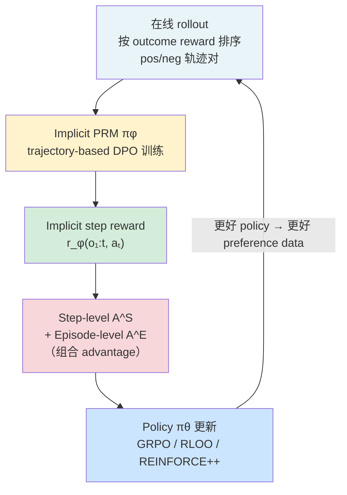
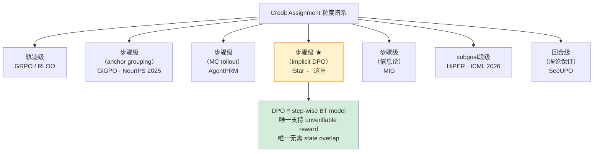

# iStar: Implicit Step Rewards for Agentic RL

**arXiv**: 2509.19199 (v3: 2025-09-28)  
**机构**: Tongyi Lab (Alibaba) + 中科院自动化所  
**作者**: Xiaoqian Liu, Ke Wang, Yuchuan Wu, Fei Huang, Yongbin Li 等  
**评分**: ★★★★★  
**关键词**: credit assignment, implicit PRM, DPO≡PRM, agentic RL, step reward, unverifiable reward

---

## 一句话 TL;DR

用 **trajectory-based DPO** 训练一个隐式 PRM（不需要人工 step 标注），生成 step 级 reward，与 episode 级 outcome reward 组合后做 policy 更新。**核心理论**：DPO 目标 ≡ Bradley-Terry 模型下的 step-wise reward function。可插入任何 RL 算法（GRPO/RLOO/REINFORCE++），在 unverifiable reward 场景下同样有效。

---

## 动机与问题

### Agent RL 的 credit assignment 三重难题

1. **Sparse & delayed reward**：只有 episode 结束才有 reward，长序列中每步贡献无法区分
2. **长序列非马尔可夫性**：每步 = CoT + action（整段 token），token 级 credit 方差极大
3. **Unverifiable reward**：社交对话等开放环境无法验证中间步骤好坏（如 SOTOPIA）

### 现有方案的局限

| 方案 | 问题 |
|------|------|
| 手工标注 step labels | 昂贵、有偏、易 reward hacking |
| LLM-as-judge step reward | 噪声大、跨域不一致 |
| Token-level implicit PRM (PRIME) | 粒度过细 → 多轮 RL 方差大、不稳定 |
| 同状态分组 (GiGPO) | 依赖状态重访，开放语言环境中稀少 |

**iStar 的定位**：无需标注、无需额外 rollout、粒度恰当（step 级不是 token 级）、适用 unverifiable reward。

---

## 核心方法：iStar

### 架构：两组件交替训练



**自强化循环**：更好的 policy → 更好的 preference data → 更准确的 implicit PRM → 更好的 step reward → 更好的 policy

### Implicit Step Reward 定义

$$r_\phi(o_{1:t}, a_t) = \beta \log \frac{\pi_\phi(a_t | o_{1:t}, x)}{\pi_{\theta_{\text{old}}}(a_t | o_{1:t}, x)}$$

- $\pi_\phi$：implicit PRM（被训练来偏好好的 action）
- $\pi_{\theta_{\text{old}}}$：policy 的前一个 snapshot（充当 reference）
- 正值 = PRM 认为这步 action 有贡献；负值 = 应该被抑制

**与 DPO implicit reward 的区别**：
- 普通 DPO implicit reward：$\beta \log \frac{\pi(y_t|y_{<t})}{\pi_{\text{ref}}(y_t|y_{<t})}$（token 级，reference 固定）
- iStar：$\beta \log \frac{\pi_\phi(a_t|o_{1:t})}{\pi_{\theta_{\text{old}}}(a_t|o_{1:t})}$（**step 级**，reference 是 rolling old policy）

### 训练 Implicit PRM：Trajectory-based DPO

$$\mathcal{J}_{\text{PRM}}(\phi) = -\mathbb{E}\left[\log\sigma\left(\beta\log\frac{\pi_\phi(\tau^+|x)}{\pi_{\theta_{\text{old}}}(\tau^+|x)} - \beta\log\frac{\pi_\phi(\tau^-|x)}{\pi_{\theta_{\text{old}}}(\tau^-|x)}\right)\right]$$

**与标准 DPO 的两个关键差异**：
1. Reference = $\pi_{\theta_{\text{old}}}$（滚动更新），而非固定初始 policy
2. 偏好来自**轨迹对**而非单轮 response 对

### 核心理论：DPO ≡ step-wise BT model

**Theorem（3.2节）**：

最优 implicit PRM $\pi_\phi^*$ 满足：

$$\mathbb{P}(\tau_1 \succ \tau_2) = \sigma\!\left(\sum_{t=1}^T r_{\phi^*}(o_{1:t}^1, a_t^1) - \sum_{t=1}^T r_{\phi^*}(o_{1:t}^2, a_t^2)\right)$$

即轨迹偏好 = 各步 implicit step reward 之和的 Bradley-Terry 比较。

**推论**：trajectory-based DPO 自动学到的是 **step-wise reward function**，不是 trajectory-level reward。这是无需 step 标注就能得到 step 级信号的理论基础。

**关系链**：
```
trajectory-based DPO objective
  ↓ (最优解)
step-wise reward BT model
  ↓ (等价)
implicit step reward: r* = β log π*_φ/π_old
```

这与 Zhong et al. 的 token-level DPO≡PRM 结论类似，但 iStar 把粒度从 token 提升到 step——这是关键，因为 step 粒度避免了多轮 RL 的高方差。

### 组合 Advantage 计算

**Episode-level advantage**（GRPO 风格）：
$$A^E(\tau_i) = \frac{r_o(\tau_i) - \text{mean}(R_o)}{\text{std}(R_o)}$$

**Step-level advantage**：
$$A^S(a_t^i) = \frac{r_\phi(a_t^i) - \text{mean}(R_s)}{\text{std}(R_s)}$$

**Final advantage**：
$$A(a_t^i) = A^E(\tau_i) + \alpha A^S(a_t^i)$$

$\alpha$ 是平衡两级 advantage 的超参。这个线性组合让 policy 同时看到：
- "这条轨迹整体好不好"（episode level）
- "这步 action 具体好不好"（step level）

### Policy 更新

标准 GRPO-style surrogate，step 级 importance ratio：
$$\rho_\theta(a_t^i) = \frac{\pi_\theta(a_t^i | \mathbf{o}_t^i, \mathbf{x})}{\pi_{\theta_{\text{old}}}(a_t^i | \mathbf{o}_t^i, \mathbf{x})}$$

注意：step 级 IS ratio（而非 token 级）与 step 级 implicit reward 对齐，降低多轮 RL 的训练噪声。

---

## 实验结果

### 三个 benchmark

| 任务 | 类型 | 特殊挑战 |
|------|------|---------|
| WebShop | text-only, multi-step 电商 | 多步决策 |
| VisualSokoban | multimodal + spatial reasoning | 不可逆错误，长视野规划 |
| SOTOPIA | 开放社交对话 | **Unverifiable reward**（GPT-4o 评分）|

### 核心数值（与 GiGPO 对比）

- **WebShop（Qwen2.5-7B）**：iStar > GiGPO（具体数值：iStar 94.7% score @165 steps，vanilla RLOO 同分需 ~2x 步数）
- **VisualSokoban**：iStar > GiGPO（最大收益，因 iStar 无需状态重访）
- **SOTOPIA（Hard scenarios）**：
  - Self-chat：6.92 → 8.06（+14% goal completion）
  - vs GPT-4o：6.68 → 7.16（**+48%**，unverifiable reward 场景）

### iStar vs GiGPO

| 维度 | GiGPO | iStar |
|------|-------|-------|
| step credit 来源 | 同状态 anchor grouping | implicit PRM（无需状态重访）|
| 适用环境 | 结构化（状态重叠多）| 任意，包括开放语言环境 |
| Unverifiable reward | 不适用 | ✅ |
| 额外 rollout | 无 | 无 |
| 理论保证 | 无偏梯度（GiGPO paper）| DPO≡step-BT model |

### iStar vs PRIME（token-level implicit PRM）

PRIME 用 token 级 process reward，早期表现与 iStar 相近，但**多轮 RL 后停滞并震荡**。原因：token 级粒度在长序列中方差过大。iStar 的 step 级粒度是关键设计选择。

### 样本效率

WebShop：iStar 在 **105 步**达到 vanilla RLOO 的最终分数（**~2x sample efficiency**）。

### 探索动态

Step reward 先提升（捕捉局部 action heuristics），episode reward 随后跟上（组合成全局高回报轨迹）。Episode 长度同步下降（以更少步骤完成任务）。

### 消融实验关键结论

- "w/ ground-truth step rewards"（VisualSokoban 提供原始 step penalty）反而不如 iStar——手工 step labels 有偏
- "w/ merged rewards"（直接把 step reward 加到 outcome reward）效果差——两级 advantage 的解耦设计有价值
- "w/ token-level process rewards"（PRIME 风格）确认了 step 级 > token 级的稳定性优势

---

## 我的评价

### 为什么这篇是 ★★★★★

1. **理论核心干净**：DPO ≡ step-wise PRM 这条推导链很 elegant，且有实际意义——免去了 step 标注的工程代价
2. **真正解决了开放环境 credit assignment**：SOTOPIA 的 unverifiable reward 实验是关键，GiGPO 在这里根本无法使用
3. **两级 advantage 的解耦设计**：episode（全局方向）+ step（局部导航）的组合，比单纯叠加更干净
4. **Rolling reference（$\pi_{\theta_{\text{old}}}$）的设计**：避免了 reference model 与 current policy 分布漂移，这是工程上的重要细节

### 我有疑问的地方

1. **PRM 与 policy 共享参数 or 独立？** 论文不够明确。如果共享，会有 PRM 和 policy 目标冲突；如果独立，显存代价翻倍
2. **$\alpha$ 的敏感性**：合并两级 advantage 的权重 $\alpha$，论文给了 ablation 但没有给出跨任务的选择指导
3. **冷启动问题**：iStar 依赖 pos/neg trajectory pair，早期 policy 很弱时所有轨迹都是 negative，初始 preference pair 质量如何？

### 在 Credit Assignment 地图中的位置



## See Also

**Credit Assignment 谱系（直接对比对象）：**
- [[AI/Agent/Agentic-RL/GiGPO-Group-in-Group-Policy-Optimization|GiGPO（NeurIPS 2025）]] — **直接对比**：anchor grouping → step-level CA，但依赖 state overlap；iStar 在 GiGPO 无法使用的开放环境（SOTOPIA）才是必选方案
- [[AI/Agent/Agentic-RL/AgentPRM-Process-Reward-Models-for-LLM-Agents|AgentPRM]] — 同为 step-level，MC rollout 显式估计 step value（需 verifiable reward）；iStar DPO 隐式学习（无需标注，支持 unverifiable）
- [[AI/Agent/Agentic-RL/MIG-Step-Marginal-Information-Gain-Credit-Assignment|MIG]] — 同为 step-level，信息论视角（边际信息增益）；与 iStar 正交：MIG 定义"这步贡献多少新信息"，iStar 定义"这步 DPO 偏好多高"
- [[AI/Agent/Agentic-RL/HiPER-Hierarchical-Plan-Execute-RL-Credit-Assignment|HiPER（ICML 2026）]] — segment-level CA（比 step 粗）；iStar 是 step 级更细粒度；两者可组合（segment 框架内用 iStar 做 step reward）
- [[AI/Agent/Agentic-RL/SHARP-Shapley-Credit-Multi-Agent-Tool-Use-RL|SHARP（ICML 2026）]] — **横向** multi-agent CA（Shapley 博弈论）；iStar 是**纵向**单 agent step CA；两者正交互补

**理论关联（KL-reg 框架）：**
- [[AI/LLM/RL/Other-Algorithms/PRIME-Process-Reward-Implicit-MLE|PRIME]] — **单轮 implicit PRM 前驱**：token-level 粒度（iStar 的多轮 step-level 版）；PRIME 在多轮 RL 后震荡，iStar step 粒度解决高方差
- [[AI/LLM/RL/Other-Algorithms/OAPL-Off-Policy-RL-LLM-Reasoning|OAPL]] — **深层联系**：OAPL 的 $\hat{V}^*=\beta\log\frac{1}{G}\sum\exp(r/\beta)$ 与 iStar 的 $r=\beta\log\frac{\pi_\phi}{\pi_{\text{old}}}$ 在 KL-regularized RL 框架下同根，值得深挖

**Unverifiable Reward 生态：**
- [[AI/Agent/Agentic-RL/CM2-Checklist-Rewards-Multi-Turn-Tool-Use-RL|CM2（arXiv:2602.12268）]] — **同为 unverifiable reward，互补路线**：iStar 用隐式 DPO step-level reward（有 DPO≡BT 理论保证，适用对话/社交），CM2 用 explicit checklist（工程直接，适用 multi-turn tool-use）；两篇合起来覆盖了 unverifiable reward 的两种主流工程方向

**综述导航：**
- [[AI/Agent/Agentic-RL/Long-Horizon-Credit-Assignment专题|Long-Horizon Credit Assignment 专题]] ⭐ — iStar 在 CA 完整谱系中的位置（GiGPO/AgentPRM/MIG/iStar/HiPER/SeeUPO 六方案全图）
- [[AI/Agent/Agentic-RL/Agentic-RL-2026前沿综合分析|Agentic RL 2026 前沿综合分析]] — iStar 在五大维度综合框架中的定位

## 推荐阅读

1. **原文**：[arXiv:2509.19199](https://arxiv.org/abs/2509.19199) — iStar: Implicit Step Rewards for Agentic RL
2. **理论基础**：[[AI/LLM/RL/Other-Algorithms/PRIME-Process-Reward-Implicit-MLE|PRIME]] — token-level DPO=PRM 的前驱理论，理解 iStar 的数学根基
3. **对比阅读**：[[AI/Agent/Agentic-RL/GiGPO-Group-in-Group-Policy-Optimization|GiGPO]] — 同为 step-level CA，anchor grouping vs implicit DPO 两种路线对比
4. **全景导航**：[[AI/Agent/Agentic-RL/Long-Horizon-Credit-Assignment专题|Long-Horizon CA 专题]] — 所有 step-level 方案的统一对照表

---

## 实用价值

**适用场景**：
- 任何 multi-turn agent task（WebShop/WebArena 类）
- 无法设计 verifiable step reward 的开放任务（对话/社交/创意）
- 想给 GRPO/RLOO 加 step credit 但不想跑额外 rollout

**工程成本**：
- 需要维护一个 implicit PRM（额外 LLM，或共享参数）
- 需要构造 trajectory pos/neg pair（outcome reward 排序）
- 比 GiGPO 重，比 AgentPRM（MC rollout）轻

---

## Tags

`#agent-rl` `#credit-assignment` `#implicit-PRM` `#DPO` `#step-reward` `#unverifiable-reward` `#multi-turn-rl` `#SOTOPIA` `#WebShop` `#Tongyi`
