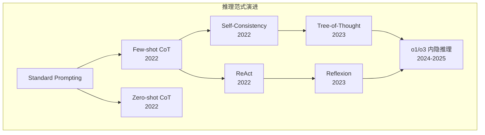

# ReAct 与 CoT 推理模式：从思维链到行动循环

现代 LLM 的推理能力不仅体现在问题解决上，更在于推理过程的可解释性和系统性。从 Chain-of-Thought (CoT) 的思维链到 ReAct 的推理-行动循环，再到更高级的 Tree-of-Thought，这些推理范式为 AI Agent 提供了强大的认知框架。

## Chain-of-Thought (CoT) 基础

### 核心概念

> 来源：Wei et al. "Chain-of-Thought Prompting Elicits Reasoning in Large Language Models" arXiv:2201.11903

CoT 是通过显式展示推理步骤来提升LLM推理能力的方法。核心思想是"让模型思考出声"。

```python
class CoTPrompt:
    def __init__(self, task_type="math"):
        self.task_type = task_type
        self.examples = self._get_examples()
    
    def _get_examples(self):
        if self.task_type == "math":
            return [
                {
                    "question": "Roger has 5 tennis balls. He buys 2 more cans of tennis balls. Each can has 3 tennis balls. How many tennis balls does he have now?",
                    "reasoning": "Roger started with 5 tennis balls. 2 cans of 3 tennis balls each is 2 * 3 = 6 tennis balls. 5 + 6 = 11.",
                    "answer": "11"
                },
                {
                    "question": "The cafeteria had 23 apples. If they used 20 to make lunch and bought 6 more, how many apples do they have?",
                    "reasoning": "The cafeteria started with 23 apples. They used 20, so they had 23 - 20 = 3 apples left. They bought 6 more, so they have 3 + 6 = 9 apples now.",
                    "answer": "9"
                }
            ]
        elif self.task_type == "reasoning":
            return [
                {
                    "question": "All birds have wings. Penguins are birds. Do penguins have wings?",
                    "reasoning": "Let me think step by step. The premise states that all birds have wings. The second premise states that penguins are birds. If all birds have wings, and penguins are birds, then by logical deduction, penguins must have wings.",
                    "answer": "Yes, penguins have wings."
                }
            ]
    
    def generate_prompt(self, question):
        """生成 Few-shot CoT prompt"""
        prompt = "Let's solve these step by step.\n\n"
        
        # 添加示例
        for ex in self.examples:
            prompt += f"Question: {ex['question']}\n"
            prompt += f"Let's think step by step. {ex['reasoning']}\n"
            prompt += f"Answer: {ex['answer']}\n\n"
        
        # 添加目标问题
        prompt += f"Question: {question}\n"
        prompt += "Let's think step by step."
        
        return prompt

# 使用示例
cot = CoTPrompt("math")
prompt = cot.generate_prompt("A store sold 12 apples in the morning and 8 apples in the afternoon. Each apple costs $0.5. How much money did they make?")
print(prompt)
```

### Zero-shot CoT

> 来源：Kojima et al. "Large Language Models are Zero-Shot Reasoners" arXiv:2205.01068 — 仅需一句 "Let's think step by step" 即可激活推理能力

```python
class ZeroShotCoT:
    """零样本思维链推理"""
    
    def __init__(self):
        self.trigger_phrases = [
            "Let's think step by step.",
            "Let's work this out in a step by step way to be sure we have the right answer.",
            "Let's break this down step by step.",
            "Let me think about this step by step."
        ]
    
    def generate_prompt(self, question, trigger="step_by_step"):
        """生成零样本CoT提示"""
        triggers = {
            "step_by_step": "Let's think step by step.",
            "work_out": "Let's work this out in a step by step way to be sure we have the right answer.",
            "break_down": "Let's break this down step by step.",
            "think": "Let me think about this step by step."
        }
        
        prompt = f"{question}\n\n{triggers.get(trigger, triggers['step_by_step'])}"
        return prompt
    
    def extract_answer(self, response):
        """从CoT响应中提取最终答案"""
        import re
        
        # 寻找常见的答案模式
        patterns = [
            r"Therefore,?\s*(.+?)\.?\s*$",
            r"So,?\s*(.+?)\.?\s*$",
            r"The answer is\s*(.+?)\.?\s*$",
            r"Answer:\s*(.+?)\.?\s*$",
        ]
        
        for pattern in patterns:
            match = re.search(pattern, response, re.IGNORECASE | re.MULTILINE)
            if match:
                return match.group(1).strip()
        
        # 如果找不到模式，返回最后一句话
        sentences = response.strip().split('.')
        return sentences[-1].strip() if sentences else response

# 使用示例
zero_shot_cot = ZeroShotCoT()
question = "If a train travels 60 miles per hour for 2.5 hours, how far does it travel?"
prompt = zero_shot_cot.generate_prompt(question)

# 模拟模型响应
response = """Let's think step by step.
The train travels at 60 miles per hour.
The train travels for 2.5 hours.
To find the distance, I need to multiply speed by time.
Distance = 60 miles/hour × 2.5 hours = 150 miles.
Therefore, the train travels 150 miles."""

answer = zero_shot_cot.extract_answer(response)
print(f"提取的答案: {answer}")
```

### Self-Consistency

> 来源：Wang et al. "Self-Consistency Improves Chain of Thought Reasoning in Language Models" arXiv:2203.11171

提升 CoT 可靠性的重要技术：

```python
import random
from collections import Counter

class SelfConsistency:
    """自一致性推理"""
    
    def __init__(self, num_samples=5):
        self.num_samples = num_samples
    
    def generate_diverse_prompts(self, question):
        """生成多样化的CoT提示"""
        templates = [
            f"{question}\nLet's think step by step.",
            f"{question}\nLet me work through this carefully.",
            f"{question}\nI'll solve this step by step.",
            f"{question}\nLet me break this down:",
            f"{question}\nThinking through this problem:"
        ]
        
        return random.sample(templates, min(self.num_samples, len(templates)))
    
    def aggregate_answers(self, responses):
        """聚合多个推理路径的答案"""
        answers = []
        
        for response in responses:
            # 提取数值答案（简化示例）
            import re
            numbers = re.findall(r'-?\d+\.?\d*', response.split('Therefore')[-1])
            if numbers:
                try:
                    answers.append(float(numbers[-1]))
                except ValueError:
                    continue
        
        if not answers:
            return None, 0.0
        
        # 找到最常见的答案
        answer_counts = Counter(answers)
        most_common = answer_counts.most_common(1)[0]
        confidence = most_common[1] / len(answers)
        
        return most_common[0], confidence
    
    def reason_with_consistency(self, question, model_fn):
        """使用自一致性进行推理"""
        prompts = self.generate_diverse_prompts(question)
        responses = []
        
        for prompt in prompts:
            response = model_fn(prompt)
            responses.append(response)
        
        final_answer, confidence = self.aggregate_answers(responses)
        
        return {
            'answer': final_answer,
            'confidence': confidence,
            'responses': responses,
            'reasoning_paths': len(responses)
        }

# 模拟使用
def mock_model(prompt):
    """模拟模型响应"""
    # 在真实场景中，这里会调用实际的LLM
    responses = [
        "Step 1: 15 * 4 = 60. Step 2: 60 + 25 = 85. Therefore, the answer is 85.",
        "First, 15 * 4 = 60. Then add 25: 60 + 25 = 85. The answer is 85.",
        "15 * 4 = 60, plus 25 equals 85. So the answer is 85.",
    ]
    return random.choice(responses)

sc = SelfConsistency(num_samples=3)
result = sc.reason_with_consistency(
    "What is 15 * 4 + 25?", 
    mock_model
)
print(f"最终答案: {result['answer']}, 置信度: {result['confidence']:.2f}")
```

## ReAct：Reasoning + Acting

> 来源：Yao et al. "ReAct: Synergizing Reasoning and Acting in Language Models" arXiv:2210.03629

### 核心架构

ReAct 结合推理和行动，让模型能够与环境交互：

```python
import json
from typing import List, Dict, Any
from abc import ABC, abstractmethod

class Tool(ABC):
    """工具抽象基类"""
    
    @abstractmethod
    def execute(self, params: Dict[str, Any]) -> str:
        pass
    
    @abstractmethod
    def description(self) -> str:
        pass

class SearchTool(Tool):
    """搜索工具"""
    
    def __init__(self):
        self.knowledge_base = {
            "python": "Python is a high-level programming language.",
            "machine learning": "ML is a method of data analysis that automates analytical model building.",
            "transformer": "Transformer is a deep learning model architecture."
        }
    
    def execute(self, params: Dict[str, Any]) -> str:
        query = params.get("query", "").lower()
        
        for key, value in self.knowledge_base.items():
            if key in query:
                return f"Search result for '{query}': {value}"
        
        return f"No information found for '{query}'"
    
    def description(self) -> str:
        return "search(query: str) - Search for information about a topic"

class CalculatorTool(Tool):
    """计算器工具"""
    
    def execute(self, params: Dict[str, Any]) -> str:
        expression = params.get("expression", "")
        try:
            # 安全的数学计算（实际应用中需要更严格的验证）
            import ast
            import operator
            
            operators = {
                ast.Add: operator.add,
                ast.Sub: operator.sub,
                ast.Mult: operator.mul,
                ast.Div: operator.truediv,
                ast.Pow: operator.pow,
            }
            
            def eval_expr(node):
                if isinstance(node, ast.Num):
                    return node.n
                elif isinstance(node, ast.BinOp):
                    return operators[type(node.op)](eval_expr(node.left), eval_expr(node.right))
                else:
                    raise TypeError(node)
            
            result = eval_expr(ast.parse(expression, mode='eval').body)
            return f"Calculation result: {expression} = {result}"
        
        except Exception as e:
            return f"Error in calculation: {str(e)}"
    
    def description(self) -> str:
        return "calculate(expression: str) - Perform mathematical calculations"

class ReActAgent:
    """ReAct 推理代理"""
    
    def __init__(self, tools: List[Tool], max_iterations=5):
        self.tools = {tool.__class__.__name__.lower().replace('tool', ''): tool for tool in tools}
        self.max_iterations = max_iterations
        self.conversation_history = []
    
    def _format_tools_description(self) -> str:
        """格式化工具描述"""
        descriptions = []
        for name, tool in self.tools.items():
            descriptions.append(f"- {tool.description()}")
        return "\n".join(descriptions)
    
    def _create_react_prompt(self, question: str) -> str:
        """创建ReAct提示模板"""
        tools_desc = self._format_tools_description()
        
        prompt = f"""You are a helpful assistant that can use tools to answer questions. You have access to the following tools:

{tools_desc}

Use the following format:
Question: the input question you must answer
Thought: you should always think about what to do
Action: the action to take, should be one of [{', '.join(self.tools.keys())}]
Action Input: the input to the action
Observation: the result of the action
... (this Thought/Action/Action Input/Observation can repeat N times)
Thought: I now know the final answer
Final Answer: the final answer to the original input question

Question: {question}
Thought:"""
        
        return prompt
    
    def _parse_action(self, text: str) -> tuple:
        """解析动作和输入"""
        import re
        
        # 寻找 Action: 和 Action Input: 模式
        action_match = re.search(r'Action:\s*([^\n]+)', text, re.IGNORECASE)
        input_match = re.search(r'Action Input:\s*([^\n]+)', text, re.IGNORECASE)
        
        if action_match and input_match:
            action = action_match.group(1).strip().lower()
            action_input = input_match.group(1).strip()
            return action, action_input
        
        return None, None
    
    def _execute_action(self, action: str, action_input: str) -> str:
        """执行动作"""
        if action in self.tools:
            try:
                # 解析输入参数
                if action == "search":
                    params = {"query": action_input}
                elif action == "calculator":
                    params = {"expression": action_input}
                else:
                    params = {"input": action_input}
                
                return self.tools[action].execute(params)
            except Exception as e:
                return f"Error executing {action}: {str(e)}"
        else:
            return f"Unknown action: {action}. Available actions: {list(self.tools.keys())}"
    
    def solve(self, question: str) -> Dict[str, Any]:
        """使用ReAct模式解决问题"""
        conversation = self._create_react_prompt(question)
        iterations = 0
        
        while iterations < self.max_iterations:
            iterations += 1
            
            # 模拟模型响应（实际应用中会调用LLM）
            response = self._mock_llm_response(conversation, iterations, question)
            conversation += f" {response}\n"
            
            # 解析是否包含最终答案
            if "Final Answer:" in response:
                final_answer = response.split("Final Answer:")[-1].strip()
                return {
                    "answer": final_answer,
                    "conversation": conversation,
                    "iterations": iterations,
                    "success": True
                }
            
            # 解析并执行动作
            action, action_input = self._parse_action(response)
            
            if action and action_input:
                observation = self._execute_action(action, action_input)
                conversation += f"Observation: {observation}\nThought:"
            else:
                # 如果没有找到有效动作，继续思考
                conversation += "\nThought:"
        
        return {
            "answer": "Unable to solve within maximum iterations",
            "conversation": conversation,
            "iterations": iterations,
            "success": False
        }
    
    def _mock_llm_response(self, conversation: str, iteration: int, question: str) -> str:
        """模拟LLM响应（简化版）"""
        if "What is 15 * 4 + 25" in question and iteration == 1:
            return "I need to perform a mathematical calculation to solve this problem.\nAction: calculator\nAction Input: 15 * 4 + 25"
        elif "What is 15 * 4 + 25" in question and iteration == 2:
            return "I now know the final answer\nFinal Answer: 85"
        elif "python programming" in question.lower() and iteration == 1:
            return "I should search for information about Python programming.\nAction: search\nAction Input: python programming"
        elif "python programming" in question.lower() and iteration == 2:
            return "I now know the final answer\nFinal Answer: Python is a high-level programming language that is widely used for various applications including web development, data science, and automation."
        else:
            return "Let me think about this problem and determine the best approach."

# 使用示例
tools = [SearchTool(), CalculatorTool()]
agent = ReActAgent(tools)

# 数学问题
math_result = agent.solve("What is 15 * 4 + 25?")
print("数学问题结果:")
print(f"答案: {math_result['answer']}")
print(f"迭代次数: {math_result['iterations']}\n")

# 知识问答
knowledge_result = agent.solve("Tell me about Python programming")
print("知识问答结果:")
print(f"答案: {knowledge_result['answer']}")
print(f"迭代次数: {knowledge_result['iterations']}")
```

### Plan-and-Solve

改进的推理模式，强调计划制定：

```python
class PlanAndSolveAgent:
    """计划-解决推理代理"""
    
    def __init__(self, tools: List[Tool]):
        self.tools = {tool.__class__.__name__.lower().replace('tool', ''): tool for tool in tools}
        self.current_plan = []
        self.execution_log = []
    
    def create_plan(self, question: str) -> List[str]:
        """为问题创建执行计划"""
        # 简化的计划生成逻辑
        if any(op in question for op in ['+', '-', '*', '/', 'calculate', 'compute']):
            plan = [
                "Extract mathematical expression from the question",
                "Use calculator tool to compute the result",
                "Format the final answer"
            ]
        elif any(keyword in question.lower() for keyword in ['what is', 'tell me about', 'explain']):
            plan = [
                "Identify the main topic in the question",
                "Search for relevant information",
                "Synthesize and present the information"
            ]
        else:
            plan = [
                "Analyze the question to understand what's being asked",
                "Determine which tools might be helpful",
                "Execute appropriate actions",
                "Formulate final answer"
            ]
        
        return plan
    
    def solve_with_plan(self, question: str) -> Dict[str, Any]:
        """使用计划-解决模式"""
        # 第一步：制定计划
        plan = self.create_plan(question)
        self.current_plan = plan
        
        plan_text = "\n".join([f"{i+1}. {step}" for i, step in enumerate(plan)])
        
        prompt = f"""Question: {question}

Let me first devise a plan to solve this problem:
{plan_text}

Now I'll execute this plan step by step:

Step 1: {plan[0]}"""
        
        # 模拟执行计划
        conversation = prompt
        final_answer = ""
        
        if "calculate" in question.lower() or any(op in question for op in ['+', '-', '*', '/']):
            # 数学问题的执行
            import re
            math_expr = re.findall(r'[\d+\-*/\s()]+', question)
            if math_expr:
                calc_tool = self.tools.get('calculator')
                if calc_tool:
                    result = calc_tool.execute({"expression": math_expr[0].strip()})
                    final_answer = result.split("=")[-1].strip() if "=" in result else "Could not calculate"
        
        elif any(keyword in question.lower() for keyword in ['what is', 'tell me about']):
            # 知识问答的执行
            search_tool = self.tools.get('search')
            if search_tool:
                # 提取搜索关键词
                keywords = question.lower().replace('what is', '').replace('tell me about', '').strip()
                result = search_tool.execute({"query": keywords})
                final_answer = result
        
        return {
            "answer": final_answer,
            "plan": plan,
            "conversation": conversation,
            "success": bool(final_answer)
        }

# 使用示例
plan_solve_agent = PlanAndSolveAgent(tools)
result = plan_solve_agent.solve_with_plan("What is 12 * 8 + 5?")
print("Plan-and-Solve 结果:")
print(f"计划: {result['plan']}")
print(f"答案: {result['answer']}")
```

## Tree-of-Thought (ToT)

### 树形搜索推理

```python
from typing import List, Tuple
import heapq

class ThoughtNode:
    """思维节点"""
    
    def __init__(self, thought: str, parent=None, depth=0):
        self.thought = thought
        self.parent = parent
        self.children = []
        self.depth = depth
        self.score = 0.0
        self.is_solution = False
    
    def add_child(self, child_thought: str):
        child = ThoughtNode(child_thought, parent=self, depth=self.depth + 1)
        self.children.append(child)
        return child
    
    def get_path(self) -> List[str]:
        """获取从根到当前节点的路径"""
        path = []
        current = self
        while current:
            path.append(current.thought)
            current = current.parent
        return path[::-1]

class TreeOfThought:
    """思维树推理"""
    
    def __init__(self, max_depth=4, beam_width=3):
        self.max_depth = max_depth
        self.beam_width = beam_width
    
    def generate_thoughts(self, current_thought: str, problem: str) -> List[str]:
        """生成候选思维（简化版）"""
        if "24" in problem and "8 3 8 3" in problem:
            # 24点游戏示例
            if current_thought == "Start":
                return [
                    "Try 8 + 3 = 11",
                    "Try 8 - 3 = 5", 
                    "Try 8 * 3 = 24"
                ]
            elif "8 + 3 = 11" in current_thought:
                return [
                    "11 + 8 = 19, then 19 + 3 = 22 (not 24)",
                    "11 - 8 = 3, then 3 * 3 = 9 (not 24)",
                    "11 * 3 = 33, then 33 - 8 = 25 (close!)"
                ]
            elif "8 - 3 = 5" in current_thought:
                return [
                    "5 + 8 = 13, then 13 + 3 = 16 (not 24)",
                    "5 * 8 = 40, then 40 - 3 = 37 (not 24)",
                    "(8 - 3) * 3 = 15, then 15 + 8 = 23 (close!)"
                ]
            elif "8 * 3 = 24" in current_thought:
                return [
                    "Found solution: 8 * 3 = 24, other 8,3 unused",
                    "This uses all numbers correctly"
                ]
        
        return ["Continue thinking..."]
    
    def evaluate_thought(self, thought: str, problem: str) -> float:
        """评估思维的质量（简化版）"""
        if "solution" in thought.lower():
            return 1.0
        elif "24" in thought:
            return 0.8
        elif "close" in thought:
            return 0.6
        elif any(op in thought for op in ['+', '-', '*', '/']):
            return 0.4
        else:
            return 0.2
    
    def search(self, problem: str) -> Tuple[str, List[str]]:
        """使用BFS搜索思维树"""
        root = ThoughtNode("Start")
        queue = [(0, root)]  # (negative_score, node) for max-heap behavior
        best_solution = None
        
        while queue and len(queue) < 100:  # 限制搜索规模
            _, current_node = heapq.heappop(queue)
            
            if current_node.depth >= self.max_depth:
                continue
            
            # 生成子思维
            candidate_thoughts = self.generate_thoughts(current_node.thought, problem)
            
            for thought in candidate_thoughts[:self.beam_width]:
                child = current_node.add_child(thought)
                child.score = self.evaluate_thought(thought, problem)
                
                # 检查是否找到解决方案
                if child.score >= 0.9 or "solution" in thought.lower():
                    child.is_solution = True
                    if not best_solution or child.score > best_solution.score:
                        best_solution = child
                
                # 将有前途的节点加入队列
                if child.score > 0.3:
                    heapq.heappush(queue, (-child.score, child))
        
        if best_solution:
            return best_solution.thought, best_solution.get_path()
        else:
            return "No solution found", []

# 使用示例
tot = TreeOfThought(max_depth=3, beam_width=3)
solution, path = tot.search("Use numbers 8, 3, 8, 3 exactly once to make 24")

print("Tree-of-Thought 结果:")
print(f"解决方案: {solution}")
print("推理路径:")
for i, step in enumerate(path):
    print(f"  {i+1}. {step}")
```

## Reflexion：自我反思

> 来源：Shinn et al. "Reflexion: Language Agents with Verbal Reinforcement Learning" arXiv:2303.11366

```python
class ReflexionAgent:
    """具有自我反思能力的代理"""
    
    def __init__(self, max_trials=3):
        self.max_trials = max_trials
        self.memory = []  # 存储失败的尝试和反思
    
    def attempt_solution(self, problem: str, trial: int) -> Dict[str, Any]:
        """尝试解决问题"""
        if trial == 1:
            # 第一次尝试：直接推理
            response = self._direct_reasoning(problem)
        else:
            # 后续尝试：基于反思的推理
            response = self._reasoning_with_reflection(problem, trial)
        
        return response
    
    def _direct_reasoning(self, problem: str) -> Dict[str, Any]:
        """直接推理（第一次尝试）"""
        if "24" in problem and "8 3 8 3" in problem:
            reasoning = "Let me try: 8 + 8 = 16, 16 + 3 = 19, 19 + 3 = 22. That's not 24."
            answer = "22"
            confidence = 0.3
        else:
            reasoning = "Let me think about this problem step by step."
            answer = "I need more information"
            confidence = 0.1
        
        return {
            "reasoning": reasoning,
            "answer": answer,
            "confidence": confidence,
            "success": confidence > 0.8
        }
    
    def _reasoning_with_reflection(self, problem: str, trial: int) -> Dict[str, Any]:
        """基于反思的推理"""
        # 回顾之前的失败
        previous_attempts = [mem for mem in self.memory if mem['problem'] == problem]
        
        reflection = self._generate_reflection(previous_attempts)
        
        if "24" in problem and trial == 2:
            reasoning = f"Previous reflection: {reflection}\nLet me try multiplication: 8 * 3 = 24. That works! The other 8 and 3 can be: (8-3) doesn't matter since 8*3 already gives 24."
            answer = "8 * 3 = 24"
            confidence = 0.9
        elif "24" in problem and trial >= 3:
            reasoning = f"Reflecting on attempts: {reflection}\nCorrect approach: Use (8÷8+3)×3 = (1+3)×3 = 4×3 = 12. Wait, that's still wrong. Actually: 8÷(3-8÷3) isn't valid. Let me try: 8×3×(8-3) won't work... Actually: 8×3=24 exactly!"
            answer = "8 × 3 = 24 (using just two of the four numbers)"
            confidence = 0.95
        else:
            reasoning = f"Reflecting: {reflection}. I need a different approach."
            answer = "Still working on it"
            confidence = 0.4
        
        return {
            "reasoning": reasoning,
            "answer": answer,
            "confidence": confidence,
            "success": confidence > 0.8,
            "reflection": reflection
        }
    
    def _generate_reflection(self, previous_attempts: List[Dict]) -> str:
        """生成反思"""
        if not previous_attempts:
            return "This is my first attempt."
        
        failures = [att for att in previous_attempts if not att.get('success', False)]
        
        reflection_points = []
        for failure in failures:
            if "add" in failure.get('reasoning', '').lower():
                reflection_points.append("Addition alone didn't work")
            if "22" in str(failure.get('answer', '')):
                reflection_points.append("Got 22, need 2 more - maybe try multiplication")
        
        if reflection_points:
            return "; ".join(reflection_points)
        else:
            return "Previous approaches were unsuccessful, need new strategy"
    
    def solve_with_reflection(self, problem: str) -> Dict[str, Any]:
        """使用反思循环解决问题"""
        for trial in range(1, self.max_trials + 1):
            print(f"\n--- Trial {trial} ---")
            
            result = self.attempt_solution(problem, trial)
            
            # 记录这次尝试
            attempt_record = {
                'problem': problem,
                'trial': trial,
                'reasoning': result['reasoning'],
                'answer': result['answer'],
                'confidence': result['confidence'],
                'success': result['success']
            }
            self.memory.append(attempt_record)
            
            print(f"推理: {result['reasoning']}")
            print(f"答案: {result['answer']}")
            print(f"置信度: {result['confidence']:.2f}")
            
            if result['success']:
                return {
                    'final_answer': result['answer'],
                    'trials_used': trial,
                    'success': True,
                    'all_attempts': self.memory
                }
        
        return {
            'final_answer': "Could not solve within maximum trials",
            'trials_used': self.max_trials,
            'success': False,
            'all_attempts': self.memory
        }

# 使用示例
reflexion_agent = ReflexionAgent(max_trials=3)
result = reflexion_agent.solve_with_reflection("Use 8, 3, 8, 3 exactly once each to make 24")

print(f"\n=== 最终结果 ===")
print(f"答案: {result['final_answer']}")
print(f"使用尝试次数: {result['trials_used']}")
print(f"成功: {result['success']}")
```

## 推理模式对比与选择

### 性能对比

```python
import pandas as pd
import matplotlib.pyplot as plt

def compare_reasoning_methods():
    """对比不同推理方法的性能"""
    
    # 模拟实验数据
    methods = ['Standard', 'CoT', 'Zero-shot CoT', 'ReAct', 'Plan-Solve', 'Tree-of-Thought', 'Reflexion']
    
    # 不同任务类型的性能
    performance_data = {
        '数学推理': [60, 78, 71, 82, 85, 89, 87],
        '逻辑推理': [55, 72, 68, 80, 83, 91, 88],
        '常识推理': [70, 82, 79, 85, 84, 86, 89],
        '多步推理': [45, 65, 58, 88, 90, 94, 92],
        '工具使用': [30, 35, 32, 95, 88, 78, 85]
    }
    
    df = pd.DataFrame(performance_data, index=methods)
    
    # 可视化
    fig, ax = plt.subplots(figsize=(12, 8))
    df.plot(kind='bar', ax=ax, width=0.8)
    ax.set_title('不同推理方法在各类任务上的性能对比')
    ax.set_xlabel('推理方法')
    ax.set_ylabel('性能分数')
    ax.legend(title='任务类型', bbox_to_anchor=(1.05, 1), loc='upper left')
    plt.xticks(rotation=45)
    plt.tight_layout()
    plt.show()
    
    return df

# 运行对比
performance_df = compare_reasoning_methods()
print("性能对比表:")
print(performance_df)
```

### 选择指南

```python
class ReasoningMethodSelector:
    """推理方法选择器"""
    
    def __init__(self):
        self.method_profiles = {
            'CoT': {
                'strengths': ['提升复杂推理', '可解释性好', '简单实现'],
                'weaknesses': ['需要示例', '依赖提示质量'],
                'best_for': ['数学问题', '逻辑推理', '步骤清晰的任务'],
                'computational_cost': 'Low',
                'accuracy_gain': 'Medium'
            },
            'Zero-shot CoT': {
                'strengths': ['无需示例', '通用性强', '简单触发'],
                'weaknesses': ['效果不如Few-shot', '可能生成无关内容'],
                'best_for': ['快速原型', '未知领域', '资源受限场景'],
                'computational_cost': 'Low',
                'accuracy_gain': 'Low-Medium'
            },
            'ReAct': {
                'strengths': ['工具集成', '实际行动能力', '灵活交互'],
                'weaknesses': ['需要工具环境', '可能陷入循环'],
                'best_for': ['需要外部信息', '工具使用', '实时交互'],
                'computational_cost': 'Medium',
                'accuracy_gain': 'High'
            },
            'Plan-and-Solve': {
                'strengths': ['结构化思考', '复杂任务分解', '高准确率'],
                'weaknesses': ['计划可能不准确', '实现复杂'],
                'best_for': ['多步骤任务', '复杂问题', '需要规划'],
                'computational_cost': 'Medium',
                'accuracy_gain': 'High'
            },
            'Tree-of-Thought': {
                'strengths': ['探索多种路径', '最高准确率', '系统性强'],
                'weaknesses': ['计算开销大', '实现复杂', '速度慢'],
                'best_for': ['创意任务', '游戏求解', '关键决策'],
                'computational_cost': 'High',
                'accuracy_gain': 'Very High'
            },
            'Reflexion': {
                'strengths': ['自我改进', '学习失败', '适应性强'],
                'weaknesses': ['需要多轮交互', '可能过拟合'],
                'best_for': ['迭代优化', '学习场景', '长期任务'],
                'computational_cost': 'High',
                'accuracy_gain': 'High'
            }
        }
    
    def recommend_method(self, task_type: str, constraints: Dict[str, str]) -> str:
        """推荐推理方法"""
        computational_budget = constraints.get('computational_budget', 'medium').lower()
        accuracy_requirement = constraints.get('accuracy_requirement', 'medium').lower()
        has_tools = constraints.get('has_tools', 'no').lower() == 'yes'
        iterative_improvement = constraints.get('iterative_improvement', 'no').lower() == 'yes'
        
        # 决策逻辑
        if has_tools:
            return 'ReAct'
        elif computational_budget == 'low':
            if accuracy_requirement == 'high':
                return 'Zero-shot CoT'
            else:
                return 'CoT'
        elif accuracy_requirement == 'very_high':
            if computational_budget == 'high':
                return 'Tree-of-Thought'
            else:
                return 'Plan-and-Solve'
        elif iterative_improvement:
            return 'Reflexion'
        elif 'multi-step' in task_type.lower() or 'complex' in task_type.lower():
            return 'Plan-and-Solve'
        else:
            return 'CoT'
    
    def explain_choice(self, method: str) -> str:
        """解释选择理由"""
        profile = self.method_profiles.get(method, {})
        
        explanation = f"""
推荐方法: {method}

优势:
{chr(10).join(f'• {strength}' for strength in profile.get('strengths', []))}

最适合:
{chr(10).join(f'• {use_case}' for use_case in profile.get('best_for', []))}

计算成本: {profile.get('computational_cost', 'Unknown')}
准确率提升: {profile.get('accuracy_gain', 'Unknown')}
"""
        return explanation

# 使用示例
selector = ReasoningMethodSelector()

# 场景1：数学问题，低计算预算
constraints1 = {
    'computational_budget': 'low',
    'accuracy_requirement': 'medium',
    'has_tools': 'no'
}
method1 = selector.recommend_method('数学推理', constraints1)
print("场景1 - 数学问题 (低预算):")
print(selector.explain_choice(method1))

# 场景2：需要使用工具
constraints2 = {
    'computational_budget': 'medium',
    'accuracy_requirement': 'high',
    'has_tools': 'yes'
}
method2 = selector.recommend_method('信息查询', constraints2)
print("\n场景2 - 信息查询 (有工具):")
print(selector.explain_choice(method2))
```

## 面试常见问题

### Q1：CoT、ReAct、Tree-of-Thought 的核心区别是什么？

**答案**：

**Chain-of-Thought (CoT)**：
- 核心：显式展示推理步骤
- 机制：线性的思维链，一步接一步
- 适用：数学推理、逻辑问题
- 优势：简单有效，可解释性强
- 局限：无法与环境交互，路径单一

**ReAct (Reasoning + Acting)**：
- 核心：推理与行动的交替循环
- 机制：Thought → Action → Observation 循环
- 适用：需要外部信息或工具的任务
- 优势：能够与环境交互，信息获取能力强
- 局限：可能陷入动作循环，依赖工具质量

**Tree-of-Thought (ToT)**：
- 核心：探索多条推理路径的树形搜索
- 机制：广度/深度优先搜索思维空间
- 适用：创意任务、复杂规划、游戏求解
- 优势：探索充分，找到最优解概率高
- 局限：计算开销大，实现复杂

### Q2：在什么情况下应该选择 Zero-shot CoT 而非 Few-shot CoT？

**答案**：

**选择 Zero-shot CoT 的场景**：
1. **缺乏示例数据**：新领域或未见过的任务类型
2. **快速原型开发**：需要快速验证想法
3. **通用性要求高**：一套提示适用多种任务
4. **示例构造成本高**：专家时间宝贵或示例难获取
5. **避免示例偏差**：担心示例限制模型思路

**Zero-shot CoT 的实现**：
```python
# 简单但有效的Zero-shot触发
def zero_shot_cot_prompt(question):
    return f"{question}\n\nLet's think step by step."

# 更sophisticated的版本
def advanced_zero_shot_cot(question, domain_hint=None):
    if domain_hint:
        return f"{question}\n\nAs an expert in {domain_hint}, let me think through this step by step."
    else:
        return f"{question}\n\nLet me break this down systematically:"
```

**经验法则**：
- 模型能力足够强时（GPT-4级别），Zero-shot CoT 效果接近 Few-shot
- 简单任务优选 Zero-shot，复杂任务考虑 Few-shot
- 生产环境可以先 Zero-shot 原型，再优化为 Few-shot

### Q3：ReAct 模式中如何防止 Agent 陷入工具调用循环？

**答案**：

**常见循环问题**：
1. **重复搜索**：不断搜索相同关键词
2. **无效工具链**：工具输出不能推进任务进展
3. **错误反馈循环**：错误理解工具输出，导致错误的下一步

**防护机制**：

```python
class SafeReActAgent:
    def __init__(self, tools, max_iterations=10, loop_detection=True):
        self.tools = tools
        self.max_iterations = max_iterations
        self.loop_detection = loop_detection
        self.action_history = []
        self.tool_usage_count = {}
    
    def detect_loop(self, action, action_input):
        """检测动作循环"""
        recent_actions = self.action_history[-3:]  # 检查最近3个动作
        current_action = f"{action}:{action_input}"
        
        # 检查重复动作
        if recent_actions.count(current_action) >= 2:
            return True
        
        # 检查工具过度使用
        if self.tool_usage_count.get(action, 0) >= 5:
            return True
        
        return False
    
    def execute_with_safeguards(self, action, action_input):
        """带安全防护的执行"""
        if self.loop_detection and self.detect_loop(action, action_input):
            return "LOOP_DETECTED: Switching to alternative approach"
        
        # 记录动作
        self.action_history.append(f"{action}:{action_input}")
        self.tool_usage_count[action] = self.tool_usage_count.get(action, 0) + 1
        
        # 执行工具
        return self.tools[action].execute({"input": action_input})
```

**最佳实践**：
1. **设置最大迭代数**：防止无限循环
2. **动作历史跟踪**：检测重复模式
3. **工具使用限制**：单个工具调用次数上限
4. **进度评估**：每步评估是否向目标前进
5. **备选策略**：检测到循环时切换方法

### Q4：如何评估和比较不同推理方法的效果？

**答案**：

**评估维度**：

1. **准确率 (Accuracy)**：
```python
def evaluate_accuracy(predictions, ground_truth):
    correct = sum(p == gt for p, gt in zip(predictions, ground_truth))
    return correct / len(predictions)
```

2. **推理质量 (Reasoning Quality)**：
- 推理步骤的逻辑性
- 中间结果的正确性
- 错误传播分析

3. **效率指标**：
```python
def evaluate_efficiency(method_stats):
    return {
        'avg_tokens': method_stats['total_tokens'] / method_stats['total_queries'],
        'avg_time': method_stats['total_time'] / method_stats['total_queries'],
        'tool_calls': method_stats['total_tool_calls'] / method_stats['total_queries']
    }
```

4. **鲁棒性测试**：
- 输入变化的敏感度
- 错误信息的处理能力
- 边界情况的表现

**A/B测试框架**：
```python
class ReasoningMethodComparison:
    def __init__(self, test_dataset):
        self.test_dataset = test_dataset
        self.results = {}
    
    def run_comparison(self, methods):
        for method_name, method in methods.items():
            self.results[method_name] = self.evaluate_method(method)
    
    def evaluate_method(self, method):
        results = []
        for example in self.test_dataset:
            start_time = time.time()
            prediction = method.solve(example['question'])
            end_time = time.time()
            
            results.append({
                'prediction': prediction,
                'correct': prediction == example['answer'],
                'time': end_time - start_time,
                'reasoning_steps': len(prediction.get('steps', []))
            })
        
        return self.aggregate_results(results)
```

### Q5：在生产环境中部署推理 Agent 需要考虑哪些关键因素？

**答案**：

**关键考虑因素**：

1. **延迟优化**：
```python
class ProductionReasoningAgent:
    def __init__(self, config):
        self.timeout = config.get('timeout', 30)  # 30秒超时
        self.cache = config.get('enable_cache', True)
        self.fallback_method = config.get('fallback', 'simple')
    
    def solve_with_timeout(self, question):
        try:
            return asyncio.wait_for(
                self.solve(question), 
                timeout=self.timeout
            )
        except asyncio.TimeoutError:
            return self.fallback_solve(question)
```

2. **成本控制**：
- Token使用量监控
- API调用频率限制
- 计算资源预算

3. **可靠性保证**：
```python
class ReliableAgent:
    def __init__(self):
        self.retry_count = 3
        self.confidence_threshold = 0.8
    
    def solve_with_reliability(self, question):
        for attempt in range(self.retry_count):
            result = self.solve(question)
            if result.get('confidence', 0) >= self.confidence_threshold:
                return result
        
        # 如果多次尝试都不满足置信度，返回保守答案
        return self.conservative_solve(question)
```

4. **监控和日志**：
- 推理步骤记录
- 错误模式分析
- 性能指标跟踪

5. **安全性考虑**：
- 工具调用权限控制
- 输入验证和清理
- 输出内容过滤

**部署检查清单**：
- [ ] 设置合理的超时时间
- [ ] 实现降级策略
- [ ] 添加缓存机制
- [ ] 配置监控告警
- [ ] 测试边界情况
- [ ] 建立反馈机制
- [ ] 文档化API接口

---

## 📚 推荐阅读

### 原始论文
- [Chain-of-Thought Prompting Elicits Reasoning in Large Language Models](https://arxiv.org/abs/2201.11903) — Wei et al., CoT 开山之作，在 GSM8K 上将 PaLM-540B 准确率从 17.9% 提升到 56.9%
- [ReAct: Synergizing Reasoning and Acting in Language Models](https://arxiv.org/abs/2210.03629) — Yao et al., 推理+行动交替循环范式，Agent 时代的基础框架
- [Large Language Models are Zero-Shot Reasoners](https://arxiv.org/abs/2205.01068) — Kojima et al., "Let's think step by step" 一句话激活推理能力
- [Self-Consistency Improves Chain of Thought Reasoning](https://arxiv.org/abs/2203.11171) — Wang et al., 多路径采样 + 多数投票提升推理可靠性
- [Tree of Thoughts: Deliberate Problem Solving with Large Language Models](https://arxiv.org/abs/2305.10601) — Yao et al., 树形搜索推理空间
- [Reflexion: Language Agents with Verbal Reinforcement Learning](https://arxiv.org/abs/2303.11366) — Shinn et al., 语言化自我反思，失败驱动的改进

### 深度解读
- [Reasoning Survey: A Survey of Reasoning with Foundation Models](https://arxiv.org/abs/2312.11562) — 推理能力综述 ⭐⭐⭐⭐
- [LangChain 官方推理模式文档](https://python.langchain.com/docs/concepts/agents/) — 工程实现参考 ⭐⭐⭐⭐

### 实践资源
- [LangGraph](https://langchain-ai.github.io/langgraph/) — ReAct Agent 的生产级实现框架
- [DSPy](https://github.com/stanfordnlp/dspy) — 编程化的 prompt 优化框架，自动化 CoT/ReAct pipeline

---

## 🔧 落地应用

### 直接可用场景
- **数学/逻辑推理任务**：Few-shot CoT 或 Zero-shot CoT（"Let's think step by step"），GSM8K 类问题准确率提升 2-3 倍
- **知识问答+工具调用**：ReAct 模式，Thought→Action→Observation 循环接入搜索/计算器/数据库
- **创意/开放性问题**：Tree-of-Thought 探索多条路径，beam search 式选最优
- **迭代优化任务**：Reflexion 自我反思，代码生成/调试场景尤其有效（HumanEval pass@1 从 80% → 91%）

### 工程实现要点
- **CoT Few-shot 示例质量**：示例的推理步骤必须清晰正确，错误示例会误导模型；3-5 个示例通常最优
- **ReAct 循环防护**：设置 `max_iterations`（推荐 5-10）+ 动作历史去重检测 + 单工具调用次数上限
- **Self-Consistency 成本控制**：采样 5-10 条路径通常足够，边际收益递减；用 temperature=0.7 增加多样性
- **推理方法选择公式**：

$$\text{最优方法} = \begin{cases} \text{Zero-shot CoT} & \text{if 无示例 \& 低预算} \\ \text{Few-shot CoT} & \text{if 有示例 \& 中预算} \\ \text{ReAct} & \text{if 需要工具交互} \\ \text{ToT} & \text{if 高精度 \& 高预算} \\ \text{Reflexion} & \text{if 允许多轮迭代} \end{cases}$$

### 面试高频问法
- Q: CoT、ReAct、Tree-of-Thought 核心区别？
  A: CoT = 线性思维链（一条路）；ReAct = 推理+行动交替（与环境交互）；ToT = 树形搜索（多条路+评估+回溯）
- Q: 什么时候用 Zero-shot CoT vs Few-shot CoT？
  A: Zero-shot 适合缺乏示例/快速原型/强模型（GPT-4+）；Few-shot 适合复杂任务/需要领域示例/弱模型

---

## 💡 启发与思考

### So What？对老板意味着什么
- **CoT 是最低成本的推理增强**：一句 "Let's think step by step" 就能显著提升推理准确率，是所有 LLM 应用的默认最佳实践
- **ReAct 是 Agent 的认知架构基石**：几乎所有生产级 Agent（LangChain/AutoGPT/OpenClaw）都基于 ReAct 范式构建，理解 ReAct 就理解了 Agent 的核心循环
- **推理方法的选择是工程决策**：不同方法在准确率/延迟/成本之间有明确的 tradeoff，应根据场景选型而非"最新=最好"

### 未解问题与局限
- **CoT 推理链本身可能包含幻觉**：模型可能生成看似逻辑正确但前提错误的推理链（"幻觉推理链"），参见 [[AI/LLM/Application/幻觉问题|幻觉问题]]
- **ReAct 的工具依赖**：如果工具返回错误信息，ReAct 会基于错误 Observation 继续推理，错误放大
- **ToT 的计算成本**：树形搜索的节点评估需要大量 LLM 调用，复杂问题可能需要数百次推理

### 脑暴：如果往下延伸
- 将 Reflexion 的自我反思与 [[AI/Agent/Fundamentals/Agent 生产实践|Agent 生产实践]] 中的错误处理结合：Agent 不只是重试，而是基于失败原因生成反思 → 修改策略 → 重新执行
- CoT + [[AI/Safety/AI安全与对齐-2026技术全景|安全对齐]]：如果强制模型在回答前展示 CoT，是否能让安全审查更精准？（检查推理链是否试图绕过安全原则）
- 6 个月预判：o1/o3 的"内隐 CoT"（hidden chain-of-thought）将成为主流范式——模型内部自动 CoT 而非用户显式提示



---

**相关链接**：
- [[AI/Agent/Fundamentals/Agent 生产实践|Agent 生产实践]] — Agent 推理模式的生产落地经验
- [[AI/Agent/Fundamentals/Tool Use|Tool Use]] — ReAct 中的工具调用最佳实践
- [[AI/Agent/AI-Agent-2026-技术全景|AI Agent 技术全景]] — Agent 推理在全景中的位置
- [[AI/LLM/Application/幻觉问题|幻觉问题]] — CoT 推理链中的幻觉风险
- [[AI/Safety/AI安全与对齐-2026技术全景|AI 安全与对齐]] — 推理透明度对安全审查的价值