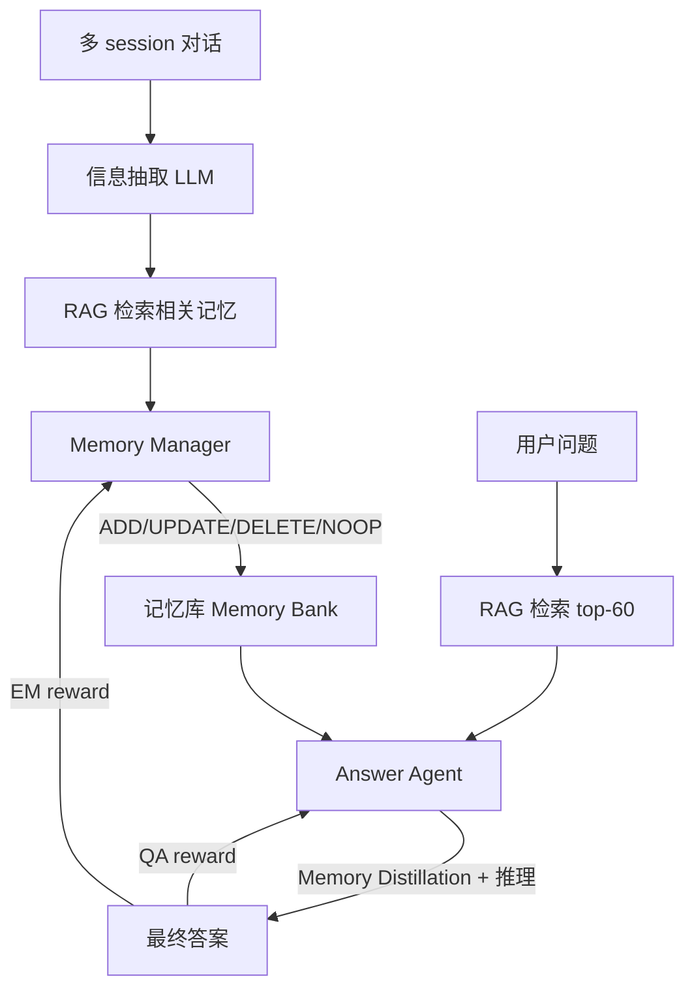
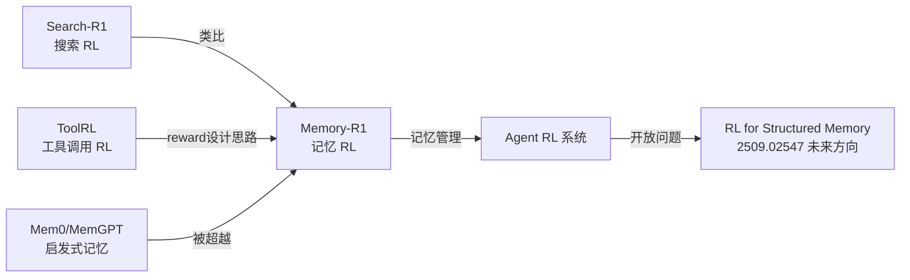

# Memory-R1: RL 驱动的 LLM 记忆管理

## 核心问题：为什么 LLM 记忆系统需要 RL？

LLM 本质上是**无状态**的——每次输入都从零处理，不能跨 session 积累信息。外部记忆库（memory bank）是主流解法，但当前实现都是启发式的：

**三个根本缺陷**：

| 问题 | 表现 | 危害 |
|------|------|------|
| **操作决策无学习信号** | CRUD 操作靠 prompt 指令，无 feedback | 简单场景也出错（覆盖 vs 合并）|
| **检索无过滤机制** | 60 条检索结果直接喂给模型 | 无关信息干扰，注意力被噪声占据 |
| **无长期优化** | 当前操作不考虑对未来问答的影响 | 短视决策，积累错误 |

**经典失败案例**（图 1）：
- Turn 1："I adopted a dog named Buddy"  → ADD "Andrew has dog Buddy"
- Turn 2："I adopted another dog named Scout"  → 启发式系统：DELETE + ADD（误以为是矛盾）→ 信息丢失
- Memory-R1 的 Memory Manager：UPDATE → "Andrew adopted two dogs, Buddy and Scout" ✓

---

## Memory-R1 架构：两个专门化 RL Agent

### Agent 1：Memory Manager

**任务**：对每条新信息决定记忆操作

$$o_i \sim \pi_\theta(\cdot \mid x, \mathcal{M}_{\text{old}}), \quad o_i \in \{\texttt{ADD}, \texttt{UPDATE}, \texttt{DELETE}, \texttt{NOOP}\}$$

**训练算法**：PPO 或 GRPO（两者均有实现）

**Reward 设计**（关键）：
$$R_{\text{answer}} = \mathrm{EM}(y_{\text{pred}}, y_{\text{gold}})$$

不直接评判记忆操作的好坏，而是看**记忆操作后 Answer Agent 能否回答正确**。这是 outcome-driven reward 的典型运用——避免了给每个记忆操作手工标注的需要。

训练时 Answer Agent **冻结**，避免 credit assignment 混乱。

---

### Agent 2：Answer Agent

**任务**：从 RAG 检索的 60 条候选记忆中蒸馏出相关记忆，生成答案

$$y \sim \pi_{\text{ans}}(\cdot \mid q, \mathcal{M}_{\text{ret}})$$

**Memory Distillation**：不是全量使用 60 条检索结果，而是先 filter（只选真正相关的），再 reason（基于筛选后的记忆推理）。

**Reward**：同样是 Exact Match 或 F1 分数。

---

## RL 算法细节

**PPO** for Memory Manager：

$$\mathcal{J}(\theta) = \mathbb{E}\left[\min\left(\rho_\theta A,\; \text{clip}(\rho_\theta, 1-\epsilon, 1+\epsilon) A\right)\right]$$

其中 $A$ = 记忆操作后 Answer Agent 正确率提升。

**GRPO** for Memory Manager：

$$\mathcal{J}(\theta) = \mathbb{E}\left[\frac{1}{G}\sum_{i=1}^G \rho_\theta^{(i)} A_i - \beta\,\mathbb{D}_{\text{KL}}[\pi_\theta \| \pi_{\text{ref}}]\right]$$

$$A_i = \frac{r_i - \text{mean}(\mathbf{r})}{\text{std}(\mathbf{r})}$$

在本任务中，GRPO 表现优于 PPO——可能因为 memory operation 的 group 内 reward variance 足够（不是 binary sparse reward 场景），GRPO 的无 value function 优势更明显。

---

## 实验结果

**训练规模**：**仅 152 条 QA pairs**（极度数据高效）

**Benchmark**：LoCoMo（长对话记忆推理）、MSC、LongMemEval

**主要 baseline**：Mem0、MemGPT、A-Mem、LangMem、LOCOMO model

| 指标 | Memory-R1-GRPO vs Mem0（LLaMA-3.1-8B） |
|------|----------------------------------------|
| F1 | **+28%** |
| BLEU-1 | **+34%** |
| LLM-as-a-Judge | **+30%** |

（早期版本报告 +48%/+69%/+37%，v5 修正为上表数字）

**泛化性**：
- 跨 benchmark：LoCoMo / MSC / LongMemEval 全部有效
- 跨模型规模：LLaMA-3.1-8B、Qwen-2.5-7B 等，3B-14B 规模均有效
- 跨问题类型：单跳 / 多跳 / 时序推理

---

## 批判性分析

### 真正的贡献

**框架层面的 insight**：把记忆管理从"prompt engineering"提升为"可学习策略"，这是概念上的跨越。outcome reward（Answer EM）不需要标注 memory 操作本身，既解决了标注瓶颈，又把目标直接对齐到下游任务。

**数据效率**是这篇的核心卖点：152 条 QA 就能训练有效 Memory Manager，说明 RL 确实在找到结构性规律，而不是 memorize 数据。

### 值得怀疑的地方

1. **两 agent 解耦的代价**：Memory Manager 训练时 Answer Agent 冻结，Answer Agent 训练时 Memory Manager 冻结。这种解耦避免了联合训练的复杂性，但两个 agent 的能力可能不对齐，且最优的联合解不等于两个独立最优解的组合
2. **LoCoMo 是对话记忆 benchmark，不是任务执行 benchmark**：真实 Agent 场景（工具调用、SWE）中的记忆问题更复杂，"什么值得记"不只是对话信息提取
3. **Memory Bank 的规模限制**：当记忆库条目变多时，RAG 检索的精度下降，60 条候选 → 有用记忆比例降低，这个问题未深入讨论
4. **UPDATE 操作的合并逻辑**：论文没有详细说明 merge 函数如何实现，这是实际部署的关键细节

### 与 Vault 中已有工作的关系

Memory-R1 的意义类似 Search-R1 在搜索领域的地位——证明 RL 能让 LLM 学会**策略性使用外部资源**，而不只是被动消费。

---

## 与盾卫项目的关联（原创洞察）

Memory-R1 的 Memory Manager RL 框架值得盾卫项目关注：

- Memory Manager 学会了**主动过滤**（NOOP 决策 = 不写入），这和 memory_guard.py 的防御目标一致：不让恶意内容写入记忆
- 但 Memory-R1 的 Memory Manager 是 reward-driven 的（以答对题为目标），没有 security-aware 的约束
- **安全 gap**：如果攻击者注入的信息能让 Answer Agent 产生错误答案（adversarial QA pair），Memory Manager 可能反而学会优先存储这些"有用的"（但实际有害的）记忆

这是 Memory-R1 框架的安全边界，也是盾卫 Phase 2.3+ 需要考虑的扩展点。

---

## 工程要点

**数据准备**：
- 只需要多 session 对话 + QA 对（不需要操作级标注）
- 152 条够用，但 diversity 比数量重要（覆盖 ADD/UPDATE/DELETE 各类场景）

**训练建议**：
- Memory Manager 和 Answer Agent 分开训练（降低 credit assignment 复杂性）
- GRPO 优于 PPO（本任务 reward variance 足够）
- 冻结 Answer Agent 训 Memory Manager 时，Answer Agent 需要足够好（否则 reward signal 噪声太大）

**部署**：
- RAG 检索 top-k 建议动态调整，而非固定 60
- Memory Distillation 是推理时的关键步骤，不要省略

---

## 落地应用

**可用场景**：
- 个人助手 / 长对话 chatbot（跨 session 记忆）
- 企业知识库 Agent（动态更新、去重合并）
- 多模态 Agent 的知识积累模块

**面试高频问法**：
- Q: 外部记忆库的管理如何避免启发式规则的局限？
  - A: Memory-R1 用 RL 训练 Memory Manager，outcome reward = 下游 QA 正确率，自动学习 ADD/UPDATE/DELETE/NOOP 策略，无需手工标注操作
- Q: 记忆 Agent 的 reward 怎么设计？
  - A: 关键是 downstream task reward（QA EM/F1），不是记忆操作本身的评分，这样避免了标注瓶颈且目标对齐

---

## 启发思考

**So What**：Memory-R1 将记忆管理从"工程问题"重新定义为"学习问题"。外部记忆库 CRUD 的决策从此可以靠 RL 自动优化，而不是写规则。这意味着任何有外部存储的 Agent 都可以用类似框架提升记忆质量。

**局限**：
- 两 agent 解耦训练不是最优
- 对话记忆和任务执行记忆（代码/工具调用历史）的需求差异大，需要不同设计
- 大规模记忆库（1000+ 条）的 RAG 精度问题未解决

**脑暴**：
- Memory Manager + Safety Judge 联合设计：在 RL reward 中加入 safety 约束（如果 Memory 被 injection，reward 扣分）
- 把 Memory Distillation 做成 process reward：不只是最终答案正确，而是过滤步骤本身也可验证
- Memory-R1 + [[AI/Agent/Agentic-RL/ASTRA-Automated-Tool-Agent-Training|ASTRA]]：ASTRA 合成工具调用轨迹时，把调用历史写入 Memory，Memory Manager 学会哪些工具调用经验值得保留

---

## 推荐阅读

- 原论文：[arXiv:2508.19828](https://arxiv.org/abs/2508.19828)
- LoCoMo Benchmark（多 session 对话记忆评测）：[EMNLP 2024](https://arxiv.org/abs/2402.17908)
- Mem0（被超越的 baseline）：[mem0.ai](https://mem0.ai)
- 相关 Vault 笔记：[[AI/Agent/Agentic-RL/Tool-Use-RL-训练专题|Tool Use RL 训练专题]] | [[AI/Agent/Agentic-RL/Agent-RL-环境工程系统论|Agent RL 环境工程系统论]] | [[AI/Agent/Agent Memory 机制|Agent Memory 机制]]
- Agentic RL Survey 记忆章节：[2509.02547 §3.3](https://arxiv.org/html/2509.02547v4#S3.SS3)
- 未来方向：RL for Structured Memory（图结构记忆 RL，survey 预测的下一个热点）
