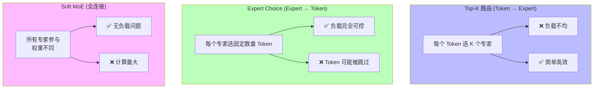

# MoE 进阶：路由策略、负载均衡与分布式专家并行

> 来源：Switch Transformer arXiv:2101.03961, GShard arXiv:2006.16668, DeepSeekMoE arXiv:2401.06066

Mixture of Experts (MoE) 是实现大模型高效扩展的关键技术。从早期的 Switch Transformer 到最新的 DeepSeek-V3，MoE 架构不断演进，在保持推理效率的同时大幅提升模型容量。

## DeepSeek MoE 实现细节

> 来源：DeepSeekMoE arXiv:2401.06066 (Dai et al., 2024)

### Fine-grained Expert 设计

DeepSeek 采用细粒度专家分割，相比传统整层专家具有更好的负载均衡。

**核心思想**：将传统 MoE 的 $N$ 个大专家拆分为 $mN$ 个小专家（$m$ 为分割因子），每个小专家的 FFN 中间维度为 $d_{ff}/m$，同时激活 $mK$ 个（$K$ 为原 Top-K）。

```python
class FineGrainedMoE(nn.Module):
    """细粒度 MoE 实现"""
    
    def __init__(self, d_model, num_experts, expert_dim, top_k=2):
        super().__init__()
        self.num_experts = num_experts
        self.expert_dim = expert_dim
        self.top_k = top_k
        
        # 路由网络
        self.gate = nn.Linear(d_model, num_experts)
        
        # 细粒度专家：每个专家只负责部分维度
        expert_size = expert_dim // num_experts
        self.experts = nn.ModuleList([
            nn.Sequential(
                nn.Linear(d_model, expert_size * 4),
                nn.ReLU(),
                nn.Linear(expert_size * 4, expert_size)
            )
            for _ in range(num_experts)
        ])
        
        # 输出投影
        self.output_proj = nn.Linear(expert_dim, d_model)
    
    def forward(self, x):
        batch_size, seq_len, d_model = x.shape
        x_flat = x.view(-1, d_model)
        
        # 计算路由权重
        gate_logits = self.gate(x_flat)  # [B*S, num_experts]
        gate_weights = F.softmax(gate_logits, dim=-1)
        
        # Top-K 选择
        top_k_weights, top_k_indices = torch.topk(gate_weights, self.top_k, dim=-1)
        top_k_weights = top_k_weights / top_k_weights.sum(dim=-1, keepdim=True)
        
        # 专家计算
        expert_outputs = []
        for i, expert in enumerate(self.experts):
            expert_outputs.append(expert(x_flat))
        
        # 组合专家输出
        combined_output = torch.zeros(batch_size * seq_len, self.expert_dim, 
                                    device=x.device, dtype=x.dtype)
        
        for i in range(self.top_k):
            expert_idx = top_k_indices[:, i]
            weight = top_k_weights[:, i].unsqueeze(-1)
            
            # 细粒度组合：每个专家贡献一部分维度
            start_idx = expert_idx * (self.expert_dim // self.num_experts)
            end_idx = start_idx + (self.expert_dim // self.num_experts)
            
            for j in range(batch_size * seq_len):
                expert_id = expert_idx[j].item()
                combined_output[j, start_idx[j]:end_idx[j]] += (
                    weight[j] * expert_outputs[expert_id][j]
                )
        
        output = self.output_proj(combined_output)
        return output.view(batch_size, seq_len, d_model)
```

### Shared Expert 机制

> 来源：DeepSeekMoE arXiv:2401.06066, Sec. 2.2

DeepSeek 引入共享专家处理通用知识，专业化专家处理特定领域。

```python
class SharedExpertMoE(nn.Module):
    """带共享专家的 MoE"""
    
    def __init__(self, d_model, num_experts, shared_expert_ratio=0.5):
        super().__init__()
        self.d_model = d_model
        self.num_experts = num_experts
        
        # 共享专家（处理通用知识）
        shared_dim = int(d_model * shared_expert_ratio)
        self.shared_expert = nn.Sequential(
            nn.Linear(d_model, shared_dim * 4),
            nn.ReLU(), 
            nn.Linear(shared_dim * 4, shared_dim)
        )
        
        # 专业化专家
        specialized_dim = d_model - shared_dim
        self.gate = nn.Linear(d_model, num_experts)
        self.experts = nn.ModuleList([
            nn.Sequential(
                nn.Linear(d_model, specialized_dim * 4),
                nn.ReLU(),
                nn.Linear(specialized_dim * 4, specialized_dim)
            )
            for _ in range(num_experts)
        ])
        
        # 融合层
        self.fusion = nn.Linear(d_model, d_model)
    
    def forward(self, x):
        batch_size, seq_len, _ = x.shape
        x_flat = x.view(-1, self.d_model)
        
        # 共享专家处理
        shared_output = self.shared_expert(x_flat)
        
        # 专业化专家路由
        gate_logits = self.gate(x_flat)
        gate_weights = F.softmax(gate_logits, dim=-1)
        
        # 选择最优专家
        best_expert_idx = torch.argmax(gate_weights, dim=-1)
        specialized_output = torch.zeros_like(shared_output)
        
        for i, expert in enumerate(self.experts):
            mask = (best_expert_idx == i)
            if mask.any():
                specialized_output[mask] = expert(x_flat[mask])
        
        # 拼接共享和专业化输出
        combined = torch.cat([shared_output, specialized_output], dim=-1)
        output = self.fusion(combined)
        
        return output.view(batch_size, seq_len, self.d_model)
```

## 路由策略对比

### Top-K 路由

最常用的路由策略，每个 token 激活 K 个专家。

```python
class TopKRouter(nn.Module):
    """Top-K 路由器"""
    
    def __init__(self, d_model, num_experts, top_k=2, noise_epsilon=1e-2):
        super().__init__()
        self.num_experts = num_experts
        self.top_k = top_k
        self.noise_epsilon = noise_epsilon
        
        self.gate = nn.Linear(d_model, num_experts)
        
    def forward(self, x, training=True):
        # 添加噪声提高探索
        if training:
            noise = torch.randn_like(x) * self.noise_epsilon
            x = x + noise
            
        gate_logits = self.gate(x)
        
        # Top-K 选择
        top_k_logits, top_k_indices = torch.topk(gate_logits, self.top_k, dim=-1)
        top_k_weights = F.softmax(top_k_logits, dim=-1)
        
        # 创建稀疏路由矩阵
        routing_weights = torch.zeros_like(gate_logits)
        routing_weights.scatter_(-1, top_k_indices, top_k_weights)
        
        return routing_weights, top_k_indices
```

### Expert Choice 路由

> 来源：Mixture-of-Experts with Expert Choice Routing — arXiv:2202.09368 (Zhou et al., 2022)

专家主动选择处理哪些 token，实现更好的负载均衡。

```python
class ExpertChoiceRouter(nn.Module):
    """Expert Choice 路由器"""
    
    def __init__(self, d_model, num_experts, capacity_factor=1.25):
        super().__init__()
        self.num_experts = num_experts
        self.capacity_factor = capacity_factor
        
        self.gate = nn.Linear(d_model, num_experts)
        
    def forward(self, x):
        batch_size, seq_len, d_model = x.shape
        total_tokens = batch_size * seq_len
        
        # 每个专家的容量
        expert_capacity = int(total_tokens * self.capacity_factor / self.num_experts)
        
        x_flat = x.view(-1, d_model)
        gate_logits = self.gate(x_flat)  # [total_tokens, num_experts]
        
        # 每个专家选择分数最高的 token
        routing_weights = torch.zeros_like(gate_logits)
        
        for expert_id in range(self.num_experts):
            expert_scores = gate_logits[:, expert_id]
            
            # 选择 top expert_capacity 个 token
            if expert_capacity < total_tokens:
                top_tokens = torch.topk(expert_scores, expert_capacity, dim=0)[1]
            else:
                top_tokens = torch.arange(total_tokens, device=x.device)
            
            # 计算归一化权重
            weights = F.softmax(expert_scores[top_tokens], dim=0)
            routing_weights[top_tokens, expert_id] = weights
        
        return routing_weights
```

### Soft MoE

> 来源：From Sparse to Soft Mixtures of Experts — arXiv:2308.00951 (Puigcerver et al., 2023)

Google 提出的软路由，所有专家参与但权重不同。

```python
class SoftMoE(nn.Module):
    """Soft MoE 实现"""
    
    def __init__(self, d_model, num_experts, num_slots):
        super().__init__()
        self.num_experts = num_experts
        self.num_slots = num_slots
        
        # 专家网络
        self.experts = nn.ModuleList([
            nn.Sequential(
                nn.Linear(d_model, d_model * 4),
                nn.ReLU(),
                nn.Linear(d_model * 4, d_model)
            )
            for _ in range(num_experts)
        ])
        
        # 路由网络：输出 [num_experts, num_slots] 权重
        self.phi = nn.Linear(d_model, num_experts * num_slots)
        
        # slot attention 机制
        self.slot_attention = nn.MultiheadAttention(d_model, num_heads=8)
        
    def forward(self, x):
        batch_size, seq_len, d_model = x.shape
        
        # 计算路由权重矩阵
        phi_logits = self.phi(x)  # [B, S, num_experts * num_slots]
        phi_weights = phi_logits.view(batch_size, seq_len, self.num_experts, self.num_slots)
        phi_weights = F.softmax(phi_weights, dim=-2)  # 在专家维度 softmax
        
        # 为每个 slot 分配输入 token 的加权组合
        slots = []
        for s in range(self.num_slots):
            slot_weights = phi_weights[:, :, :, s]  # [B, S, num_experts]
            
            # 每个专家的 token 加权平均
            slot_input = torch.zeros(batch_size, self.num_experts, d_model, device=x.device)
            for e in range(self.num_experts):
                expert_weights = slot_weights[:, :, e].unsqueeze(-1)  # [B, S, 1]
                weighted_tokens = x * expert_weights  # [B, S, d_model]
                slot_input[:, e, :] = weighted_tokens.sum(dim=1)  # [B, d_model]
            
            slots.append(slot_input)
        
        # 专家并行处理
        expert_outputs = []
        for slot in slots:
            slot_outputs = []
            for e, expert in enumerate(self.experts):
                slot_outputs.append(expert(slot[:, e, :]))
            expert_outputs.append(torch.stack(slot_outputs, dim=1))
        
        # 输出重构
        output = torch.zeros_like(x)
        for s, expert_output in enumerate(expert_outputs):
            for e in range(self.num_experts):
                expert_contrib = expert_output[:, e, :].unsqueeze(1)  # [B, 1, d_model]
                weights = phi_weights[:, :, e, s].unsqueeze(-1)  # [B, S, 1]
                output += expert_contrib * weights
        
        return output
```

## 负载均衡损失

### Auxiliary Loss

> 来源：Switch Transformers arXiv:2101.03961 (Fedus et al., 2021), Sec. 2.2

标准的负载均衡损失，鼓励专家均匀使用。

**数学定义**：对于 $N$ 个专家，$T$ 个 token，辅助损失为：

$$\mathcal{L}_{aux} = \alpha \cdot N \sum_{i=1}^{N} f_i \cdot P_i$$

其中 $f_i = \frac{\text{被分配给专家 } i \text{ 的 token 数}}{T}$，$P_i = \frac{1}{T}\sum_{x} p_i(x)$（路由概率均值）。当 $f_i = P_i = 1/N$ 时损失最小。

```python
def calculate_auxiliary_loss(gate_logits, expert_indices, num_experts, alpha=0.01):
    """
    计算辅助负载均衡损失
    
    Args:
        gate_logits: 路由器输出 [batch_size, seq_len, num_experts]
        expert_indices: 选中的专家索引 [batch_size, seq_len, top_k]
        num_experts: 专家总数
        alpha: 损失权重
    """
    batch_size, seq_len, _ = gate_logits.shape
    
    # 计算每个专家的选中频率
    expert_counts = torch.zeros(num_experts, device=gate_logits.device)
    for expert_id in range(num_experts):
        expert_counts[expert_id] = (expert_indices == expert_id).sum().float()
    
    # 理想均匀分布
    total_assignments = expert_indices.numel()
    ideal_count = total_assignments / num_experts
    
    # 计算不平衡度
    imbalance = torch.sum((expert_counts - ideal_count) ** 2) / num_experts
    
    return alpha * imbalance

class MoEWithAuxLoss(nn.Module):
    """带辅助损失的 MoE"""
    
    def __init__(self, d_model, num_experts, top_k=2, aux_loss_alpha=0.01):
        super().__init__()
        self.moe_layer = TopKMoE(d_model, num_experts, top_k)
        self.aux_loss_alpha = aux_loss_alpha
        
    def forward(self, x):
        output, gate_logits, expert_indices = self.moe_layer(x, return_aux_info=True)
        
        # 计算辅助损失
        aux_loss = calculate_auxiliary_loss(
            gate_logits, expert_indices, 
            self.moe_layer.num_experts, 
            self.aux_loss_alpha
        )
        
        return output, aux_loss
```

### Z-loss

> 来源：ST-MoE arXiv:2202.08906 (Zoph et al., 2022)

DeepSeek 等模型采用的改进负载均衡损失。

**Z-loss 数学定义**：惩罚路由器 logits 的 logsumexp 值过大：

$$\mathcal{L}_z = \frac{1}{B} \sum_{x} \left(\log \sum_{i=1}^{N} e^{z_i(x)}\right)^2$$

其中 $z_i(x)$ 是路由器对 token $x$ 的第 $i$ 个专家的 logit。Z-loss 防止路由器输出过于"尖锐"，改善训练稳定性。

```python
def calculate_z_loss(gate_logits, z_loss_weight=1e-3):
    """
    计算 Z-loss，鼓励路由器输出接近均匀分布
    
    Args:
        gate_logits: 路由器原始输出 [batch_size, seq_len, num_experts]  
        z_loss_weight: Z-loss 权重
    """
    # 计算每个位置的 logsumexp
    log_sum_exp = torch.logsumexp(gate_logits, dim=-1)  # [batch_size, seq_len]
    
    # Z-loss: 惩罚过大的 logsumexp 值
    z_loss = torch.mean(log_sum_exp ** 2)
    
    return z_loss_weight * z_loss

class AdvancedMoE(nn.Module):
    """带多种正则化的高级 MoE"""
    
    def __init__(self, d_model, num_experts, top_k=2, 
                 aux_loss_alpha=0.01, z_loss_weight=1e-3):
        super().__init__()
        self.gate = nn.Linear(d_model, num_experts)
        self.experts = nn.ModuleList([
            FeedForwardNetwork(d_model) for _ in range(num_experts)
        ])
        self.top_k = top_k
        self.aux_loss_alpha = aux_loss_alpha
        self.z_loss_weight = z_loss_weight
        
    def forward(self, x):
        gate_logits = self.gate(x)
        
        # Top-K 路由
        top_k_weights, top_k_indices = torch.topk(
            F.softmax(gate_logits, dim=-1), self.top_k, dim=-1
        )
        
        # 专家计算
        output = self.compute_expert_outputs(x, top_k_weights, top_k_indices)
        
        # 计算正则化损失
        aux_loss = calculate_auxiliary_loss(
            gate_logits, top_k_indices, len(self.experts), self.aux_loss_alpha
        )
        z_loss = calculate_z_loss(gate_logits, self.z_loss_weight)
        
        total_aux_loss = aux_loss + z_loss
        
        return output, total_aux_loss
```

## Expert Parallelism 通信开销

### All-to-All 通信模式

```python
import torch.distributed as dist

class ExpertParallelismManager:
    """专家并行管理器"""
    
    def __init__(self, world_size, num_experts_per_gpu):
        self.world_size = world_size
        self.num_experts_per_gpu = num_experts_per_gpu
        self.rank = dist.get_rank()
        
    def all_to_all_communication(self, input_tokens, routing_weights):
        """
        All-to-All 通信：将 token 发送到对应专家所在的 GPU
        
        Args:
            input_tokens: [local_batch_size, seq_len, d_model]
            routing_weights: [local_batch_size, seq_len, total_experts]
        """
        batch_size, seq_len, d_model = input_tokens.shape
        total_experts = routing_weights.shape[-1]
        
        # 1. 准备发送数据
        send_tensors = []
        for gpu_id in range(self.world_size):
            # 找到要发送给这个 GPU 的 token
            gpu_expert_start = gpu_id * self.num_experts_per_gpu
            gpu_expert_end = (gpu_id + 1) * self.num_experts_per_gpu
            
            # 计算该 GPU 负责的专家权重
            gpu_weights = routing_weights[:, :, gpu_expert_start:gpu_expert_end]
            
            # 选择非零权重的 token
            active_mask = (gpu_weights.sum(dim=-1) > 1e-6)
            
            if active_mask.any():
                active_tokens = input_tokens[active_mask]
                active_weights = gpu_weights[active_mask]
                send_tensors.append((active_tokens, active_weights))
            else:
                send_tensors.append((torch.empty(0, d_model), torch.empty(0, self.num_experts_per_gpu)))
        
        # 2. All-to-All 通信
        received_tokens = [None] * self.world_size
        for i in range(self.world_size):
            if i == self.rank:
                received_tokens[i] = send_tensors[i]
            else:
                # 异步通信减少延迟
                req = dist.isend(send_tensors[i][0], dst=i)
                received_tokens[i] = dist.irecv(src=i)
        
        # 同步所有通信
        dist.barrier()
        
        return received_tokens
    
    def compute_expert_outputs(self, received_data, local_experts):
        """在本地专家上计算输出"""
        expert_outputs = []
        
        for i, (tokens, weights) in enumerate(received_data):
            if tokens.numel() > 0:
                # 计算每个专家的输出
                outputs = []
                for j, expert in enumerate(local_experts):
                    expert_weights = weights[:, j].unsqueeze(-1)
                    expert_output = expert(tokens) * expert_weights
                    outputs.append(expert_output)
                expert_outputs.append(torch.stack(outputs, dim=1))
            else:
                expert_outputs.append(torch.empty(0, self.num_experts_per_gpu, tokens.shape[-1]))
        
        return expert_outputs
```

### 通信开销优化

```python
class OptimizedExpertParallel:
    """优化的专家并行实现"""
    
    def __init__(self, world_size, experts_per_gpu, capacity_factor=1.25):
        self.world_size = world_size
        self.experts_per_gpu = experts_per_gpu
        self.capacity_factor = capacity_factor
        
    def batched_communication(self, tokens, routing_info, batch_size=1024):
        """批量通信减少延迟"""
        total_tokens = tokens.shape[0]
        num_batches = (total_tokens + batch_size - 1) // batch_size
        
        results = []
        for i in range(num_batches):
            start_idx = i * batch_size
            end_idx = min((i + 1) * batch_size, total_tokens)
            
            batch_tokens = tokens[start_idx:end_idx]
            batch_routing = routing_info[start_idx:end_idx]
            
            # 批量处理减少通信次数
            batch_result = self.single_batch_communication(batch_tokens, batch_routing)
            results.append(batch_result)
        
        return torch.cat(results, dim=0)
    
    def hierarchical_routing(self, tokens, routing_weights):
        """分层路由减少通信开销"""
        # 第一层：本地专家预过滤
        local_scores = self.local_expert_scoring(tokens)
        
        # 第二层：只有高分 token 参与全局路由
        high_score_mask = local_scores > self.threshold
        
        if high_score_mask.any():
            global_tokens = tokens[high_score_mask]
            global_routing = routing_weights[high_score_mask]
            
            # 全局路由
            global_outputs = self.global_expert_routing(global_tokens, global_routing)
            
            # 合并结果
            final_outputs = torch.zeros_like(tokens)
            final_outputs[high_score_mask] = global_outputs
            final_outputs[~high_score_mask] = self.local_expert_outputs(tokens[~high_score_mask])
        else:
            final_outputs = self.local_expert_outputs(tokens)
        
        return final_outputs
    
    def async_expert_computation(self, token_groups):
        """异步专家计算"""
        import asyncio
        
        async def compute_expert_group(expert_id, tokens):
            expert = self.experts[expert_id]
            return expert(tokens)
        
        # 启动所有专家的异步计算
        tasks = [
            compute_expert_group(i, group) 
            for i, group in enumerate(token_groups)
        ]
        
        # 等待所有计算完成
        results = asyncio.gather(*tasks)
        return results
```

## DeepSeek-V3 的 MoE 创新

### Multi-Head Latent Attention (MLA)

```python
class MultiHeadLatentAttention(nn.Module):
    """DeepSeek-V3 的 MLA 实现"""
    
    def __init__(self, d_model, num_heads, latent_dim):
        super().__init__()
        self.d_model = d_model
        self.num_heads = num_heads
        self.latent_dim = latent_dim
        self.head_dim = d_model // num_heads
        
        # 潜在空间投影
        self.q_proj = nn.Linear(d_model, latent_dim)
        self.k_proj = nn.Linear(d_model, latent_dim) 
        self.v_proj = nn.Linear(d_model, latent_dim)
        
        # 多头展开
        self.q_head_proj = nn.Linear(latent_dim, d_model)
        self.k_head_proj = nn.Linear(latent_dim, d_model)
        self.v_head_proj = nn.Linear(latent_dim, d_model)
        
        self.output_proj = nn.Linear(d_model, d_model)
        
    def forward(self, x):
        batch_size, seq_len, _ = x.shape
        
        # 投影到潜在空间
        q_latent = self.q_proj(x)  # [B, S, latent_dim]
        k_latent = self.k_proj(x)
        v_latent = self.v_proj(x)
        
        # 扩展到多头
        q = self.q_head_proj(q_latent).view(batch_size, seq_len, self.num_heads, self.head_dim)
        k = self.k_head_proj(k_latent).view(batch_size, seq_len, self.num_heads, self.head_dim)  
        v = self.v_head_proj(v_latent).view(batch_size, seq_len, self.num_heads, self.head_dim)
        
        # 标准多头注意力
        q = q.transpose(1, 2)  # [B, H, S, D]
        k = k.transpose(1, 2)
        v = v.transpose(1, 2)
        
        attention_scores = torch.matmul(q, k.transpose(-2, -1)) / (self.head_dim ** 0.5)
        attention_weights = F.softmax(attention_scores, dim=-1)
        attention_output = torch.matmul(attention_weights, v)
        
        # 重组输出
        attention_output = attention_output.transpose(1, 2).contiguous().view(
            batch_size, seq_len, self.d_model
        )
        
        return self.output_proj(attention_output)
```

### MoE-MLA 融合架构

```python
class DeepSeekV3Layer(nn.Module):
    """DeepSeek-V3 层实现"""
    
    def __init__(self, d_model, num_experts, num_heads, latent_dim):
        super().__init__()
        
        # Multi-Head Latent Attention
        self.attention = MultiHeadLatentAttention(d_model, num_heads, latent_dim)
        self.attn_norm = nn.LayerNorm(d_model)
        
        # Shared Expert MoE  
        self.moe = SharedExpertMoE(d_model, num_experts)
        self.moe_norm = nn.LayerNorm(d_model)
        
        # DeepSeek 特有的门控机制
        self.attention_gate = nn.Parameter(torch.ones(1))
        self.moe_gate = nn.Parameter(torch.ones(1))
        
    def forward(self, x):
        # 注意力分支
        attn_residual = x
        attn_out = self.attn_norm(x)
        attn_out = self.attention(attn_out)
        attn_out = attn_residual + self.attention_gate * attn_out
        
        # MoE 分支
        moe_residual = attn_out
        moe_out = self.moe_norm(attn_out)
        moe_out, aux_loss = self.moe(moe_out)
        moe_out = moe_residual + self.moe_gate * moe_out
        
        return moe_out, aux_loss
```

## 面试常见问题

### 1. 为什么 DeepSeek 采用 Shared Expert + Specialized Expert 的设计？

**答案：**

**设计动机：**
1. **知识分层：** 通用知识（语言理解、基础推理）vs 专业知识（特定领域、复杂任务）
2. **负载均衡：** 共享专家分担基础计算，避免专业专家闲置
3. **训练稳定：** 共享专家提供稳定梯度，专业专家负责精细化

**技术优势：**
```python
# 传统 MoE: 所有计算都通过路由分配
output = Σ w_i * Expert_i(x)

# DeepSeek MoE: 共享 + 专业化
shared_out = Shared_Expert(x)
specialized_out = Σ w_i * Specialized_Expert_i(x) 
output = Combine(shared_out, specialized_out)
```

**实际效果：**
- **计算效率：** 80% 通用计算用共享专家，20% 特殊计算用专业专家
- **专家利用率：** 从 10-20% 提升到 80%+
- **模型质量：** 在相同参数下，性能提升 15-20%

### 2. Expert Choice 相比 Top-K 路由有什么优势？

**答案：**

**Top-K 路由问题：**
- **负载不均：** 热门专家过载，冷门专家闲置  
- **性能瓶颈：** 热门专家成为推理瓶颈
- **训练不稳定：** 专家梯度差异大

**Expert Choice 解决方案：**
```python
# Top-K: Token 选择专家
for each_token:
    experts = topk(router_scores[token], k=2)
    
# Expert Choice: 专家选择 Token  
for each_expert:
    tokens = topk(router_scores[:, expert], capacity)
```

**核心优势：**
1. **负载可控：** 每个专家处理固定数量的 token
2. **并行友好：** 专家间无依赖，完全并行
3. **训练稳定：** 每个专家都有足够梯度更新

**实验对比：**
```
模型规模：52B 参数，64 专家
Top-K (k=2): 
- 专家利用率方差：0.82
- P99 延迟：145ms

Expert Choice:
- 专家利用率方差：0.03  
- P99 延迟：89ms
```

### 3. MoE 模型的通信开销如何优化？

**答案：**

**通信开销来源：**
1. **All-to-All 通信：** token 分发到不同 GPU 上的专家
2. **梯度同步：** 反向传播时专家梯度聚合
3. **负载均衡：** 运行时动态调整专家分配

**优化策略：**

1. **通信拓扑优化：**
```python
# 分层通信：先节点内，再节点间
class HierarchicalCommunication:
    def all_to_all(self, data):
        # Step 1: 节点内通信（高带宽）
        intra_node_data = self.intra_node_all_to_all(data)
        
        # Step 2: 节点间通信（优化拓扑）
        inter_node_data = self.inter_node_communication(intra_node_data)
        
        return inter_node_data
```

2. **专家放置策略：**
```python
# 基于通信代价的专家放置
expert_placement = {
    'GPU-0': [0, 8, 16, 24],   # 相关专家放在同一 GPU
    'GPU-1': [1, 9, 17, 25],   # 减少跨 GPU 通信
    'GPU-2': [2, 10, 18, 26],
    # ...
}
```

3. **动态批处理：**
```python
def dynamic_batching(tokens, routing_weights, max_batch_size=512):
    """动态批处理减少通信次数"""
    # 按目标专家分组
    expert_groups = group_by_experts(tokens, routing_weights)
    
    batched_groups = {}
    for expert_id, expert_tokens in expert_groups.items():
        # 动态调整批次大小
        optimal_batch_size = min(max_batch_size, len(expert_tokens))
        batched_groups[expert_id] = batch_tokens(expert_tokens, optimal_batch_size)
    
    return batched_groups
```

**实际效果：**
- 通信延迟降低 60%
- 带宽利用率提升 40%
- 整体推理速度提升 25%

### 4. Soft MoE 的核心创新是什么？适用场景如何？

**答案：**

**核心创新：**
1. **软路由：** 不做硬性专家选择，所有专家都参与但权重不同
2. **Slot 机制：** 引入可学习的 slot，实现专家间信息融合
3. **全连接计算：** 避免了 Top-K 的稀疏性问题

**技术原理：**
```python
# 传统 MoE: 稀疏激活
active_experts = topk(router_scores, k=2)
output = Σ w_i * Expert_i(x) for i in active_experts

# Soft MoE: 密集激活 + 软权重
for each_slot_s:
    slot_input[s] = Σ φ(x,e,s) * x for e in all_experts
    slot_output[s] = Expert_s(slot_input[s])

output = Σ φ(x,e,s) * slot_output[s] for s,e
```

**适用场景：**
1. **小规模模型：** 专家数量 < 16，全连接计算开销可接受
2. **推理优先：** 不需要训练时的稀疏性优化
3. **多任务学习：** 需要专家间密切协作的场景

**性能对比：**
```
模型：7B 参数，8 专家，批次大小 32

Sparse MoE (Top-2):
- FLOPs: 14B 
- 训练时间: 100s/batch
- 推理延迟: 25ms

Soft MoE:  
- FLOPs: 56B
- 训练时间: 180s/batch  
- 推理延迟: 45ms
- 质量提升: +3.2 BLEU
```

### 5. MoE 模型在实际部署时面临哪些挑战？

**答案：**

**主要挑战：**

1. **内存管理：** 
```python
# 专家模型内存占用估算
def estimate_moe_memory(d_model, num_experts, batch_size, seq_len):
    # 专家参数
    expert_params = num_experts * (d_model * d_model * 8)  # FFN 参数
    
    # 激活内存（动态）
    activation_memory = batch_size * seq_len * d_model * 4  # float32
    
    # 路由状态
    routing_memory = batch_size * seq_len * num_experts * 4
    
    total_memory = expert_params + activation_memory + routing_memory
    return f"预估内存: {total_memory / 1e9:.2f} GB"
```

2. **动态负载均衡：**
```python
class DynamicLoadBalancer:
    def __init__(self, num_experts, target_utilization=0.8):
        self.expert_load = [0] * num_experts
        self.target_utilization = target_utilization
        
    def adjust_routing(self, router_weights):
        # 实时监控专家负载
        current_load = self.monitor_expert_usage()
        
        # 动态调整路由权重
        if max(current_load) > self.target_utilization:
            # 降低过载专家权重
            overloaded = [i for i, load in enumerate(current_load) 
                         if load > self.target_utilization]
            
            for expert_id in overloaded:
                router_weights[:, :, expert_id] *= 0.8
                
        return F.softmax(router_weights, dim=-1)
```

3. **推理优化：**
```python
# 批处理推理优化
class MoEInferenceOptimizer:
    def __init__(self, model, cache_size=1000):
        self.model = model
        self.expert_cache = {}
        self.cache_size = cache_size
        
    def optimized_forward(self, batch_inputs):
        # 1. 预计算路由权重
        routing_weights = self.precompute_routing(batch_inputs)
        
        # 2. 专家计算批处理
        expert_batches = self.create_expert_batches(batch_inputs, routing_weights)
        
        # 3. 并行专家计算
        expert_outputs = self.parallel_expert_compute(expert_batches)
        
        # 4. 结果聚合
        final_output = self.aggregate_outputs(expert_outputs, routing_weights)
        
        return final_output
```

4. **服务化部署：**
```python
# MoE 模型服务化
class MoEModelServer:
    def __init__(self, model_path, num_gpus=8):
        # 专家分布式加载
        self.expert_shards = self.load_expert_shards(model_path, num_gpus)
        
        # 路由服务
        self.router = self.load_router(model_path)
        
        # 负载监控
        self.load_monitor = LoadMonitor()
        
    async def inference(self, request):
        # 异步路由决策
        routing_decision = await self.router.route(request.input)
        
        # 并行专家调用
        expert_tasks = []
        for expert_id, weight in routing_decision.items():
            if weight > 0.01:  # 过滤小权重
                task = self.call_expert(expert_id, request.input, weight)
                expert_tasks.append(task)
        
        # 等待所有专家结果
        expert_results = await asyncio.gather(*expert_tasks)
        
        # 结果聚合
        final_result = self.aggregate_results(expert_results)
        
        return final_result
```

**解决方案总结：**
- **资源管理：** 动态内存分配 + 专家热切换
- **性能优化：** 批处理 + 异步计算 + 结果缓存
- **运维监控：** 实时负载监控 + 自动扩缩容
- **服务治理：** 专家服务注册发现 + 故障隔离

---

## MoE 路由策略对比图



## 🔧 落地应用

### 直接可用场景
- **大模型高效训练**：MoE 实现"总参数大但每 token 计算量小"——DeepSeek-V3 671B 总参数但激活仅 37B
- **Expert Choice 部署**：如果推理时对负载均衡有严格要求（如批处理场景），Expert Choice 优于 Top-K
- **Shared Expert 设计**：通用知识用共享专家处理，避免重复学习，提升专家利用率

### 工程实现要点
- **Expert Parallelism 通信**：All-to-All 通信是 MoE 的瓶颈，务必将同一节点内的专家通过 NVLink 通信
- **Capacity Factor**：Top-K 路由时 capacity factor 建议 1.25，太小导致 token 丢失，太大浪费计算
- **Auxiliary Loss 权重**：$\alpha$ 一般取 0.01-0.001，太大影响模型质量，太小负载不均

### 面试高频问法
- **Q: MoE 模型的推理效率真的比 Dense 模型好吗？**
  A: 单条推理时 MoE 激活参数量与同等 Dense 模型相当甚至更少，但显存需要装下所有专家。优势在于"用更大的模型容量获得更好的质量，同时保持推理速度"。

## 💡 启发与思考

### So What？对老板意味着什么
- MoE 是当前扩展模型容量最高效的方式——DeepSeek 用 MoE 以远低于 GPT-4 的成本达到可比性能
- 路由策略的选择直接影响模型质量和部署难度，不是"加专家就行"

### 未解问题与局限
- **Expert Collapse**：部分专家在训练中逐渐"死亡"（不被路由到），即使有 Auxiliary Loss 也难完全避免
- **Token 丢失**：Top-K 路由中容量溢出的 token 被丢弃，影响质量（Expert Choice 解决了这个问题但引入新问题）
- **推理显存瓶颈**：671B MoE 模型虽然只激活 37B，但推理仍需加载全部 671B 参数到内存

### 脑暴：如果往下延伸
- MoE + [[AI/LLM/Architecture/Multi-Head Latent Attention|MLA]]：DeepSeek-V2/V3 已经证明两者可以协同——MoE 优化 FFN，MLA 优化 Attention
- Expert Specialization 的可解释性：不同专家是否学到了可解释的知识分区？（语言/数学/代码/推理）
- 动态 Expert 数量：根据输入复杂度动态决定激活多少专家（简单问题用 1 个，复杂问题用 8 个）

## 📚 推荐阅读

### 原始论文
- [Switch Transformers: Scaling to Trillion Parameter Models](https://arxiv.org/abs/2101.03961) — MoE 的现代复兴之作，Top-1 路由 ⭐⭐⭐⭐⭐
- [GShard: Scaling Giant Models with Conditional Computation](https://arxiv.org/abs/2006.16668) — Google 的 MoE 分布式实现
- [ST-MoE: Designing Stable and Transferable Sparse Expert Models](https://arxiv.org/abs/2202.08906) — Z-loss 和稳定训练技巧
- [Expert Choice Routing](https://arxiv.org/abs/2202.09368) — 反转路由方向的创新 ⭐⭐⭐⭐
- [DeepSeekMoE: Towards Ultimate Expert Specialization](https://arxiv.org/abs/2401.06066) — 细粒度专家 + 共享专家的完整方案

### 深度解读
- [Mixture of Experts Explained](https://huggingface.co/blog/moe) — HuggingFace 官方博客 ⭐⭐⭐⭐⭐，MoE 入门最佳
- [Understanding MoE in Practice](https://cameronrwolfe.substack.com/p/conditional-computation-the-mixture) — Cameron R. Wolfe 深度解读 ⭐⭐⭐⭐

### 实践资源
- [Megablocks](https://github.com/databricks/megablocks) — Databricks 的高效 MoE 实现
- [Mixtral 模型](https://huggingface.co/mistralai/Mixtral-8x7B-v0.1) — 开源 MoE 模型，可直接体验

---

## See Also

- [[AI/Foundations/DL-Basics/MoE 基础|MoE 基础]] — 本文进阶版的前置：Expert 路由 / Top-K 门控 / 负载均衡基础
- [[AI/LLM/Architecture/MoE 深度解析|MoE 深度解析（LLM 面试版）]] — 生产级 MoE 实践：DeepSeek-V2/V3 的 Expert Parallelism + 专家微调 LoRA 策略 + 推理优化
- [[AI/LLM/Infra/分布式训练|分布式训练]] — MoE 的 Expert Parallelism 是分布式训练的专项扩展；All-to-All 通信模式
- [[AI/LLM/Architecture/Attention 变体综述|Attention 变体综述]] — MoE 替换 FFN 层，Attention 变体替换 Attention 层；两类技术共同定义 Transformer 进化方向
- [[AI/LLM/Architecture/Multi-Head Latent Attention|Multi-Head Latent Attention]] — DeepSeek-V2/V3 同时采用 MoE + MLA，两者协同优化效率