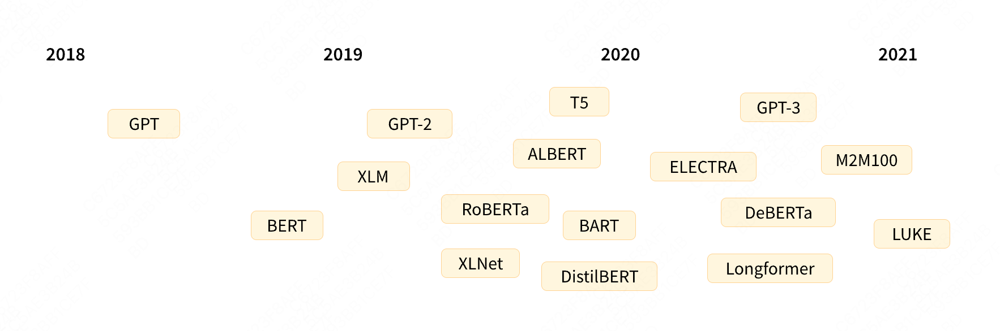
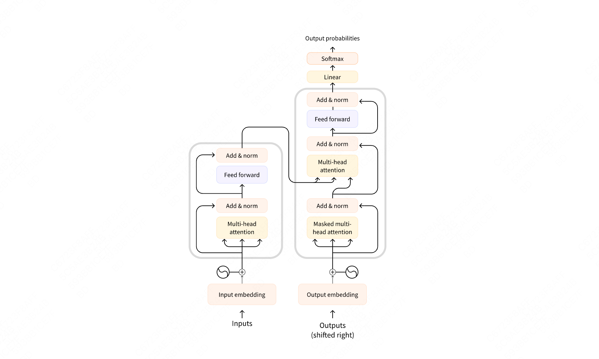

# Transformer 通识

# 一、背景

**仿生学 / 哲学思想**：人类感知的一个重要特性是，人们不会一次处理整个场景。相反，人类有选择地将注意力集中在视觉空间的某些部分上，以在需要的时间和地点获取信息，并随着时间的推移将不同注视点的信息结合起来，建立场景的内部表示，指导未来的眼球运动和决策。

Transformer 架构最初是为翻译而设计的。在训练期间，编码器接收特定语言的输入（句子），而解码器需要输出对应语言的翻译。在编码器中，注意力层可以使用一个句子中的所有单词。

Transformers 大致时间线

- 18 年 GPT
- 19 年 BERT、GPT2、BART、T5
- 20年 GPT3
大体上可以分为三类：

- GPT-like （也被称作**自回归 Transformer** 模型）
- BERT-like （也被称作**自动编码 Transformer** 模型）
- BART/T5-like （也被称作**序列到序列的 Transformer** 模型）
整体上训练有两块 **预训练** 和 **迁移学习**：

- 预训练（Pretraining）：通过大量文本无监督学习语言的模式、对语言形成**统计规律上**的理解，但特定任务表现不好
- 迁移学习（transfer learning）
- 因果语言建模（causal language modeling）：根据过去的 n 个单词预测 n+1
- 掩码语言建模（masked language modeling）：本质上就是做完形填空，这个比较经典的就是 masked auto encoder。
# 二、入门

这些部件中的每一个都可以独立使用，具体取决于任务：

- Encoder-only 模型：适用于需要理解输入的任务，如句子分类和命名实体识别。
- Decoder-only 模型：适用于生成任务，如文本生成。
- Encoder-decoder 模型 或者 sequence-to-sequence 模型：适用于需要根据输入进行生成的任务，如翻译或摘要。

# 

编码器模型仅使用 Transformer 模型的编码器部分。在每次计算过程中，注意力层都能访问整个句子的所有单词，这些模型通常具有“双向”（向前/向后）注意力，被称为自编码模型。

这些模型的预训练通常会使用某种方式破坏给定的句子（例如：通过随机遮盖其中的单词），并让模型寻找或重建给定的句子。

- Encoder：编码器模型适用于需要理解完整句子的任务，例如：句子分类、命名实体识别（以及更普遍的单词分类）和阅读理解后回答问题。该系列模型的典型代表有：
- [ALBERT](https%3A%2F%2Fhuggingface.co%2Ftransformers%2Fmodel_doc%2Falbert)
- [BERT](https%3A%2F%2Fhuggingface.co%2Ftransformers%2Fmodel_doc%2Fbert)
- [DistilBERT](https%3A%2F%2Fhuggingface.co%2Ftransformers%2Fmodel_doc%2Fdistilbert)
- [ELECTRA](https%3A%2F%2Fhuggingface.co%2Ftransformers%2Fmodel_doc%2Felectra)
- [RoBERTa](https%3A%2F%2Fhuggingface.co%2Ftransformers%2Fmodel_doc%2Froberta)
- Decoder：解码器模型仅使用 Transformer 模型的解码器部分。在每个阶段，对于给定的单词，注意力层只能获取到句子中位于将要预测单词前面的单词。这些模型通常被称为自回归模型。模型的预训练通常围绕预测句子中的下一个单词进行。这些模型最适合处理文本生成的任务。该系列模型的典型代表有：
- [CTRL](https%3A%2F%2Fhuggingface.co%2Ftransformers%2Fmodel_doc%2Fctrl)
- [GPT](https%3A%2F%2Fhuggingface.co%2Fdocs%2Ftransformers%2Fmodel_doc%2Fopenai-gpt)
- [GPT-2](https%3A%2F%2Fhuggingface.co%2Ftransformers%2Fmodel_doc%2Fgpt2)
- [Transformer XL](https%3A%2F%2Fhuggingface.co%2Ftransformers%2Fmodel_doc%2Ftransfor-xl)
- Encoder + Decoder：编码器-解码器模型（也称为序列到序列模型）同时使用 Transformer 架构的编码器和解码器两个部分。在每个阶段，编码器的注意力层可以访问输入句子中的所有单词，而解码器的注意力层只能访问位于输入中将要预测单词前面的单词。
- 这些模型的预训练可以使用训练编码器或解码器模型的方式来完成，但通常会更加复杂。例如， [T5](https%3A%2F%2Fhuggingface.co%2Ft5-base) 通过用单个掩码特殊词替换随机文本范围（可能包含多个词）进行预训练，然后目标是预测被遮盖单词原始的文本。序列到序列模型最适合于围绕根据给定输入生成新句子的任务，如摘要、翻译或生成性问答。
- 该系列模型的典型代表有：
- [BART](https%3A%2F%2Fhuggingface.co%2Ftransformers%2Fmodel_doc%2Fbart)
- [mBART](https%3A%2F%2Fhuggingface.co%2Ftransformers%2Fmodel_doc%2Fmbart)
- [Marian](https%3A%2F%2Fhuggingface.co%2Ftransformers%2Fmodel_doc%2Fmarian)
- [T5](https%3A%2F%2Fhuggingface.co%2Ftransformers%2Fmodel_doc%2Ft5)
# 三、注意力机制

## 注意力机制

注意力机制计算过程就是序列中元素交换信息的过程。注意力机制的输入是一个序列或者集合，注意力机制会从输入中选择性提取信息，据此**计算出一组权重**。

这组权重代表了各个信息的**重要程度**，使用这种权重与原始信息相乘就得到了注意力处理后的加权信息。

## 自注意力机制

自注意力机制的目的是为**当前单词创建抽象的、丰富的表征**。这个表征是本单词被相同序列中的其它单词所影响的结果。

经过自注意力机制处理之后，现在每个新单词都**融入了其它单词的部分信息**，这是一种数据依赖的加权平均，这种表征更加丰富。如果非要将自注意力机制和之前的注意力机制进行对比的话：

- 自注意力机制中的query相当于注意力机制中的解码器隐藏状态。
- 自注意力机制中的key和value相当于注意力机制中的编码器隐藏状态。
## 注意力模型

注意力模型的内部流程如下图所示，该模型的目标是生成V中向量的加权平均值，具体计算流程如下。

- 标号1是输入（两个输入），从输入生成的特征向量F会进一步生成键矩阵K和值矩阵V。
- 标号2使用矩阵K和查询向量q作为输入，通过相似度计算函数来计算注意力得分向量e。q表示对信息的请求，表示矩阵K的第列对于q的重要性。
- 标号3通过对齐层（比如softmax函数）进一步处理注意力分数，进而得到注意力权重a。
- 标号4利用注意力权重a和矩阵V进行计算，得到上下文向量c。

因为此处提到了Q、K、V这三个术语，我们先用文本翻译为例来做初步介绍。

从上文的分析可知，序列中的每个单词都需要了解序列中其它单词的信息，从而才能确定彼此间的相互关系。因此每个单词都要去询问其它单词：**咱俩之间是否密切**？其它单词回复关系密切与否。

拿到相互关系后，每个单词会据此把其它单词的信息吸收进来做**信息融合**。上述操作其实是一种**搜索+合并的运算**，我们需要找到一个适合的机制将这种运算进行落地。而上图注意力模型中，有两个输入：q（正在处理的序列）和 F（被关注的序列），F 又分别转换为 K 和 V ，这三个变量综合起来使用就可以满足我们的需求。

- Q（查询矩阵）：目标序列的每个元素把自己的特征总结到一个向量query之中，可以理解为某个单词像其它单词发出询问。目标序列所有元素的query构成了查询矩阵Q。
- K（键矩阵）：源序列的每个元素都会把自己的特征总结到一个向量key之中。可以理解为某个单词的特征，或者说某个单词依据自己特征来回答其它单词的提问。目标序列所有元素的key构成了键矩阵K。
- V（值矩阵）：源序列的每个单词的实际值（最终提供的信息）是向量value。源序列所有元素的value构成了值矩阵V。
## 注意力 seq2seq 案例

注意力机制的任务应该是找到**解码器当前隐向量**和**编码器所有隐向量之间的相互关系**。按照上述思路，注意力机制的计算总体可以分为两步：

1. 在所有**输入信息上计算注意力分布**。编码器不只是传递最后一个隐藏状态，**而是传入所有的隐藏状态到解码器**。
1. 根据注意力分布来计算输入信息的加权平均。需要注意，这是一种数据依赖的加权平均，是一种灵活、高效的全局池化操作。
具体我们又可以把这两步拆解为5个详细步骤，具体如下：

1. **encoder 编码**：**针对输入序列中的每个单词，编码器都会输出一个隐状态向量，表示该单词及其上下文信息的表示。**
1. **计算注意力系数**：对于解码器输出的每个词Yi，计算隐向量与当前 Decoder 输出的Yi相关性大小。因此会在解码器输出每一个预测值之前，会针对编码器输出的所有语义向量<C1,C2,C3,C4>来计算一些 Attention Score。
1. **计算概率分布**：将对齐系数 softmax进行归一化，得到**注意力权重**，**放大高分隐藏状态，抑制低分隐藏状态。**
1. **计算当前上下文向量Context**。使用注意力权重w作为权重，对编码器所有的向量<C1,C2,C3,C4>进行加权求和，得到解码器当前时刻的上下文语义向量Context。注意力权重表示每个输入单词对于当前输出单词的重要程度。上下文向量表示当前输出单词所需的源语言信息。
1. **更新解码器隐状态Hi。**
1. **Decoder 计算输出预测词：**把解码器前一次的输出、解码器当前状态和解码器当前时刻的上下文语义向量Context这三者作为输入得到解码器本次的输出。这个输出是一个概率分布，表示每个可能的目标语言单词作为当前输出单词的概率。然后做一个概率值到目标词表的映射（如果注意力机制时用于分类模型，那就是做一个到各个分类的映射），便可以得到下一个输出单词。