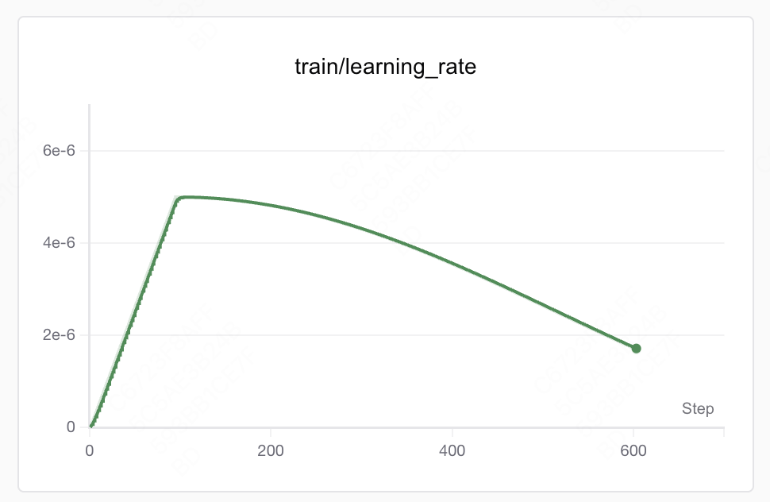

# 学习率

# 以 TRL 为例

看到“先线性上升，然后缓慢衰减”的学习率曲线，是典型的“Warmup + 余弦退火（cosine decay）”调度器行为。你的配置里明确写了：

- warmup_ratio=0.1 → 训练前10%的优化步数做线性预热（从0线性升到基准学习率）
- lr_scheduler_type='cosine' → 预热结束后，用余弦退火把学习率从基准学习率逐步衰减到接近0

为什么会先线性上升？

- 线性预热的公式（简化）是：lr(step) = base_lr × step / warmup_steps
- 预热通常用来稳定早期训练，避免一开始梯度爆炸或不稳定收敛
为什么后面是“缓慢衰减”？

- 余弦退火的形状决定了它开始阶段衰减比较缓，到了中段加快，末段又放缓，整体看是“先慢后快再慢”的光滑曲线
- 常见公式（简化）：
lr(t) = 0.5 × base_lr × [1 + cos(π × progress)]

其中 progress 是从 0 到 1 的归一化训练进度（预热之后的那一段）

哪些参数决定了这条曲线的样子？

- lr_scheduler_type：决定衰减的形状（cosine/linear/constant等）
- warmup_ratio 或 warmup_steps：决定线性上升的步数（0.1 就是总训练步数的 10%）
- learning_rate：曲线的“峰值”（预热末的基准学习率）
- 总训练步数（很关键！）：
- 由数据量、批大小和并行度共同决定
- 粗略计算：
total_steps ≈ ceil(num_samples / (per_device_train_batch_size × world_size)) / gradient_accumulation_steps × num_train_epochs

- total_steps 越大，预热段（按比例算）越长，cosine 退火也更“平滑悠长”
- gradient_accumulation_steps：相当于减少每个 epoch 的优化步数，从而拉长每一步学习率的“时间”（因为总步数变少）
- per_device_train_batch_size、world_size（多卡数）、num_train_epochs、数据集大小：都通过 total_steps 间接影响 warmup 和衰减的跨度与节奏
- 其它参数如 adam_beta1/2、weight_decay、max_grad_norm、optim（adamw_torch_fused）等不改变学习率调度的形状，但会影响收敛行为
所以，出现该曲线的直接原因是：

- warmup_ratio=0.1 → 先线性爬升到 5e-6
- lr_scheduler_type='cosine' → 随后按余弦退火从 5e-6 平滑降到接近 0
- 具体“上升多少步/衰减多少步”由 total_steps 决定，total_steps 又取决于数据量、per_device_train_batch_size=32、gradient_accumulation_steps=1、num_train_epochs=1、以及并行度（GPU 数
# 主流学习率

主流可选的学习率调度方式与适用建议

- constant / constant_with_warmup：恒定学习率（可叠加warmup）。适合短程微调、小数据、或你要对超参数非常稳健、避免后期学习率过低的场景
- linear：线性下降（通常配 warmup）。简单稳健，长短程训练都常用，拥护者很多（尤其 NLP 微调）
- cosine：你现在用的方案。光滑，常被用在长程训练、预训练或中大型微调；通常收敛稳定，末期有更细致的探索
- cosine_with_restarts：带周期重启的余弦退火（SGDR）。适用于需要多次“复活”学习率进行跳出局部最优、长训练或多阶段数据的场景
- polynomial（多项式衰减）：在一些 CV/NLP 预训练中也常见，可设置末尾的最小 LR（lr_end）和衰减幂次（power），比 linear 更平滑
- ReduceLROnPlateau（按指标停滞自适应降 LR）：不是基于步数/epoch，而是基于验证指标；适合训练曲线波动较大、难以预设时间表的任务
- StepLR / Exponential：经典方案：分段阶梯下降或指数下降。简单可控，但不如 cosine/linear 平滑
- OneCycleLR：常见于快速收敛、稳健性好的训练策略（先升后降、 sometimes 超过 base LR），需要更仔细的超参设定
---

## See Also

- [[AI/Foundations/Training/Training Loss 分析|Training Loss 分析]] — 学习率对 loss 曲线的直接影响
- [[AI/Foundations/Training/Scaling Laws|Scaling Laws]] — μP 等学习率 scaling 方法
- [[AI/Foundations/ML-Basics/损失函数|损失函数]] — loss landscape 的几何直觉与学习率选择
- [[AI/Foundations/_MOC|Foundations MOC]] — ML 基础全图谱
