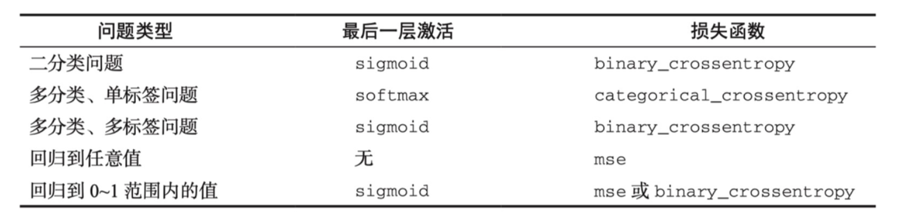

# 损失函数

简易经验

- 对于二分类问题，可以使用**二元交叉熵**（binary cross-entropy）损失函数；
- 对于多分类问题，可以用**分类交叉熵**（categorical cross-entropy）损失函数；
- 对于回归问题， 可以用**均方误差**（mean-squared error）损失函数；

---

### 基本概念

损失函数（Loss Function）又叫做误差函数，用来衡量算法的运行情况，估量模型的预测值与真实值的不一致程度，是一个非负实值函数。

- 问题：为什么要非负，这个是通常的设定，理论上，目标函数存在一个下界，在优化过程当中，如果优化算法能够使目标函数不断减小，根据单调有界准则，这个优化算法就能证明是收敛有效的。 只要设计的目标函数有下界，基本上都可以，代价函数非负更为方便。
### 常见损失函数

1. **0-1损失函数** 如果预测值和目标值相等，值为0，如果不相等，值为1。 一般的在实际使用中，相等的条件过于严格，可适当放宽条件：
1. **绝对值损失函数** 和0-1损失函数相似，绝对值损失函数表示为： 
1. **平方损失函数** ，这点可从最小二乘法和欧几里得距离角度理解。最小二乘法的原理是，最优拟合曲线应该使所有点到回归直线的距离和最小。
1. **对数损失函数** 。常见的逻辑回归使用的就是对数损失函数，有很多人认为逻辑回归的损失函数是平方损失，其实不然。逻辑回归它假设样本服从伯努利分布（0-1分布），进而求得满足该分布的似然函数，接着取对数求极值等。逻辑回归推导出的经验风险函数是最小化负的似然函数，从损失函数的角度看，就是对数损失函数。形式上等价于二分类的交叉熵损失函数。
1. **指数损失函数** 指数损失函数的标准形式为： 。例如AdaBoost就是以指数损失函数为损失函数。
1. **Hinge损失函数** Hinge损失函数的标准形式如下： 。统一的形式： 。其中y是预测值，范围为(-1,1)，t为目标值，其为-1或1。在线性支持向量机中，形式类似 **Hinge损失函数。**