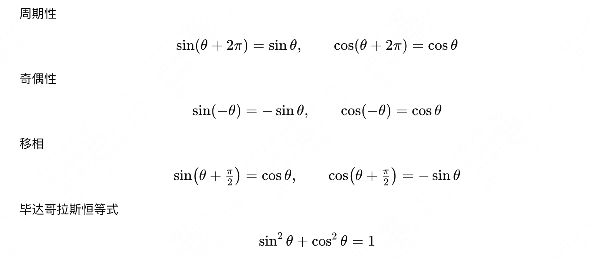
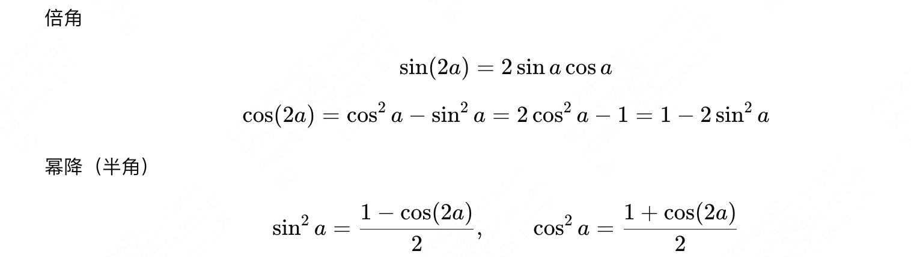

# 三角函数速查

# 一、基本公式

# 二、和差公式

# 三、倍角

# 四、积和

# 五、欧拉公式

---

## See Also

- [[AI/Foundations/Math/向量微积分|向量微积分]] — 傅里叶变换/旋转编码的数学基础
- [[AI/LLM/Architecture/Transformer 位置编码|Transformer 位置编码]] — RoPE 使用三角函数编码位置信息
- [[AI/Foundations/_MOC|Foundations MOC]] — 数学基础全图谱
