# 向量微积分

- 泰勒级数：无限逼近原函数
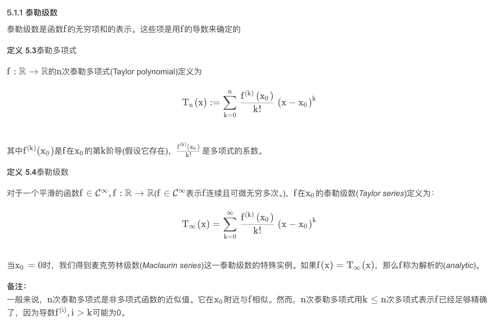

- 微分和链式法则
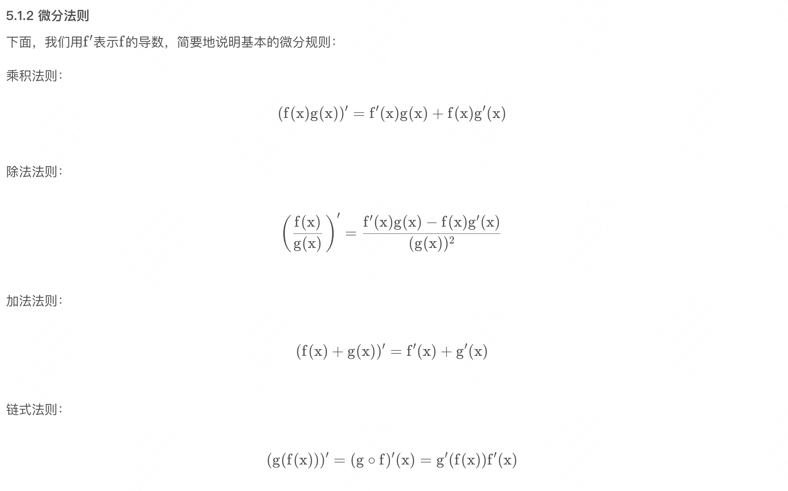

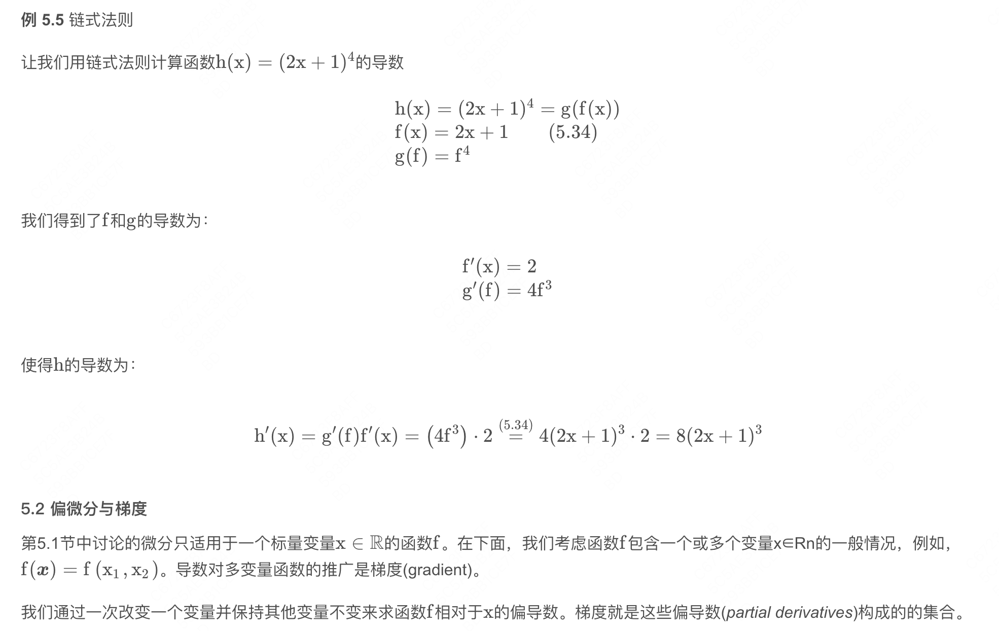

- 偏导数和梯度

- 偏微分和链式法则
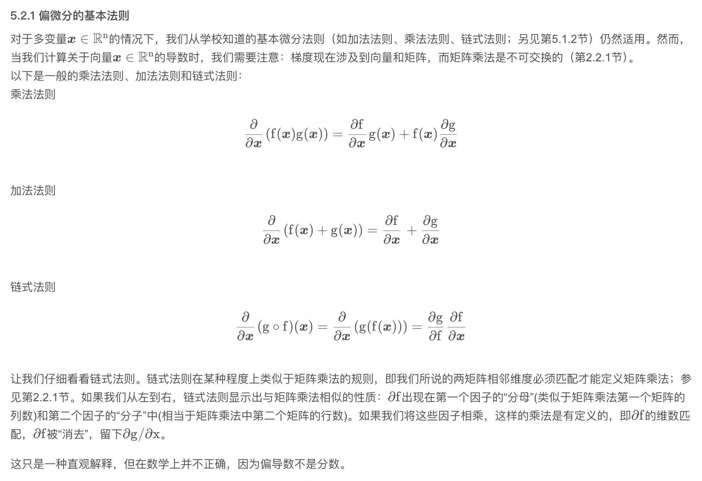

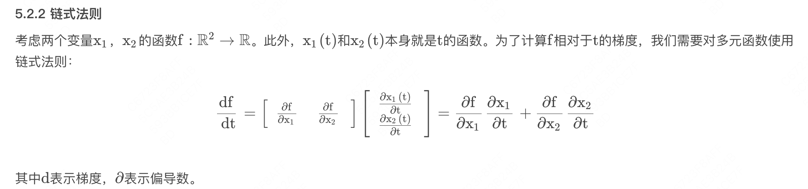

- 向量的梯度-雅可比矩阵

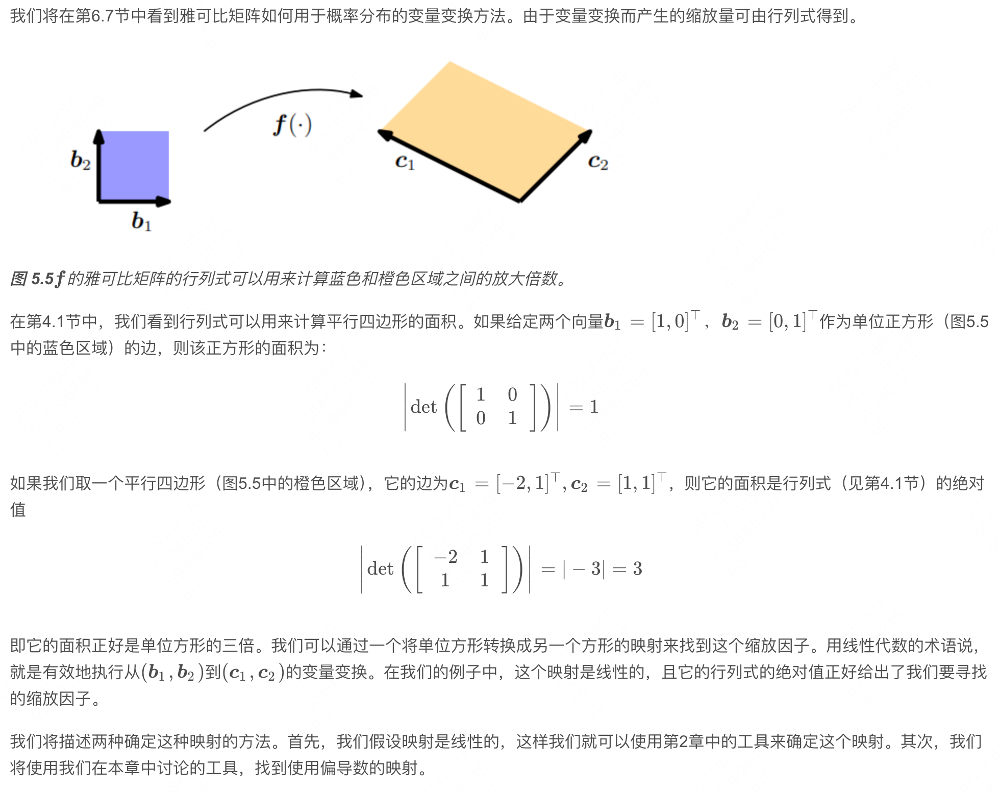

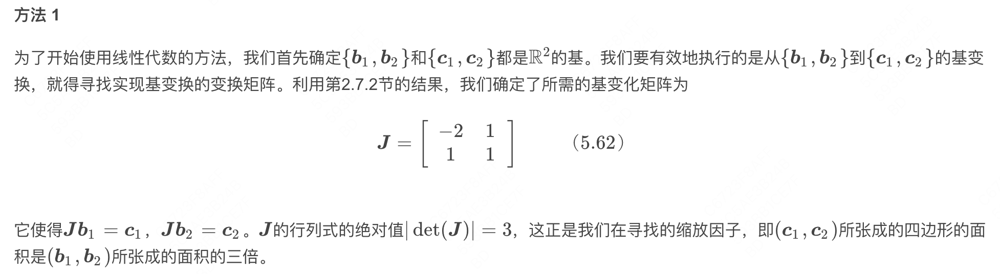

- 向量值函数梯度-计算案例
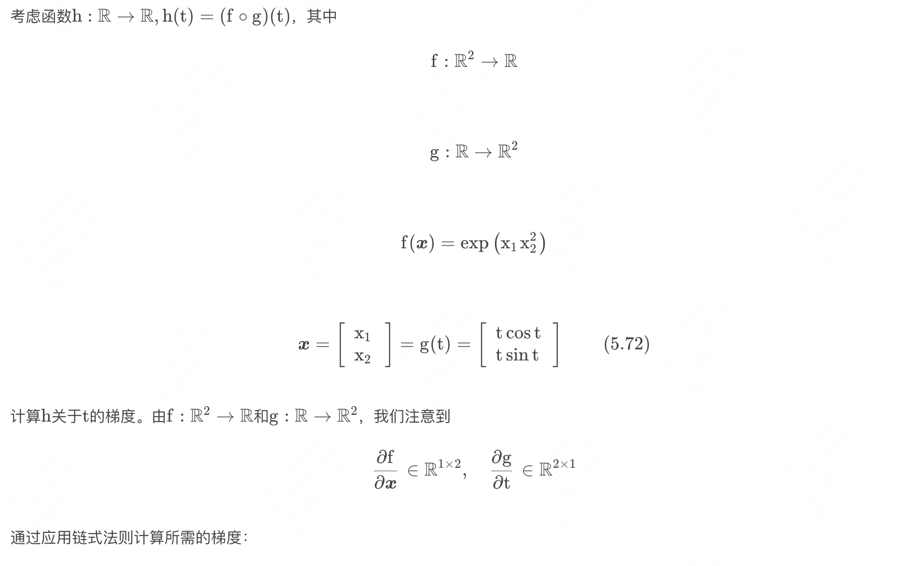

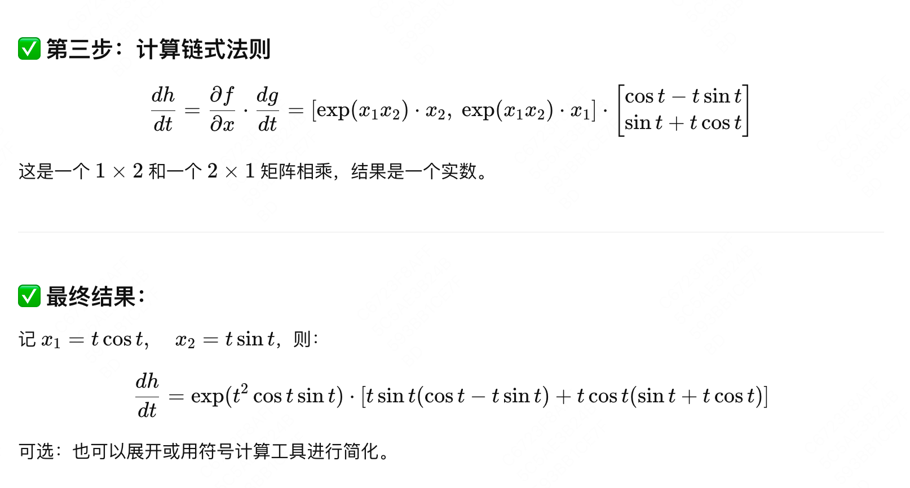

- 矩阵相对向量的梯度
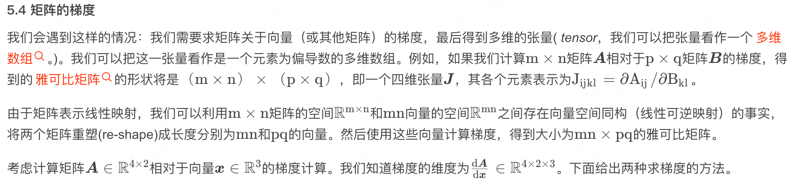

- 向量相对矩阵的梯度

- 矩阵相对矩阵的梯度

- 计算梯度常见的恒等式
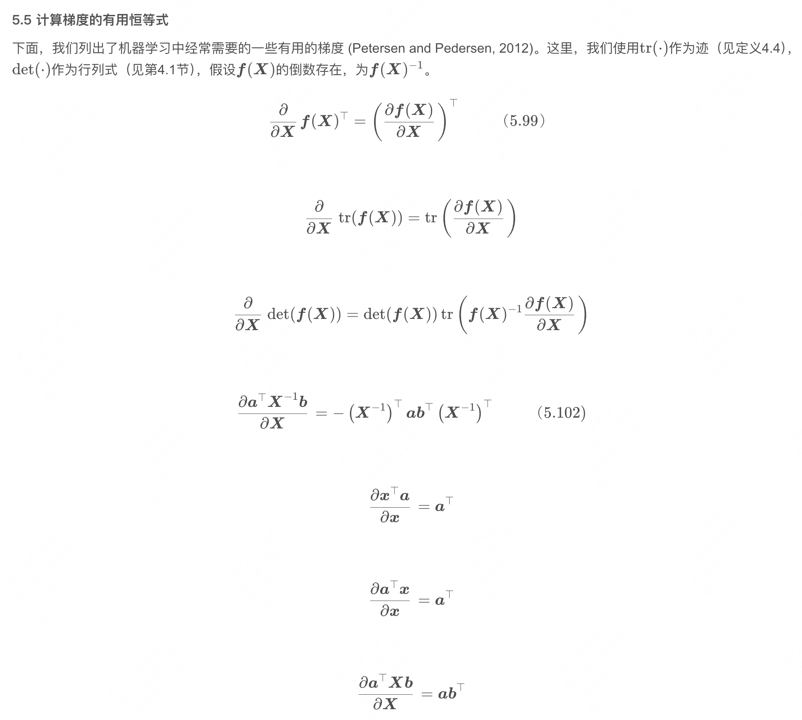

- 高阶导数

- 反向传播推导
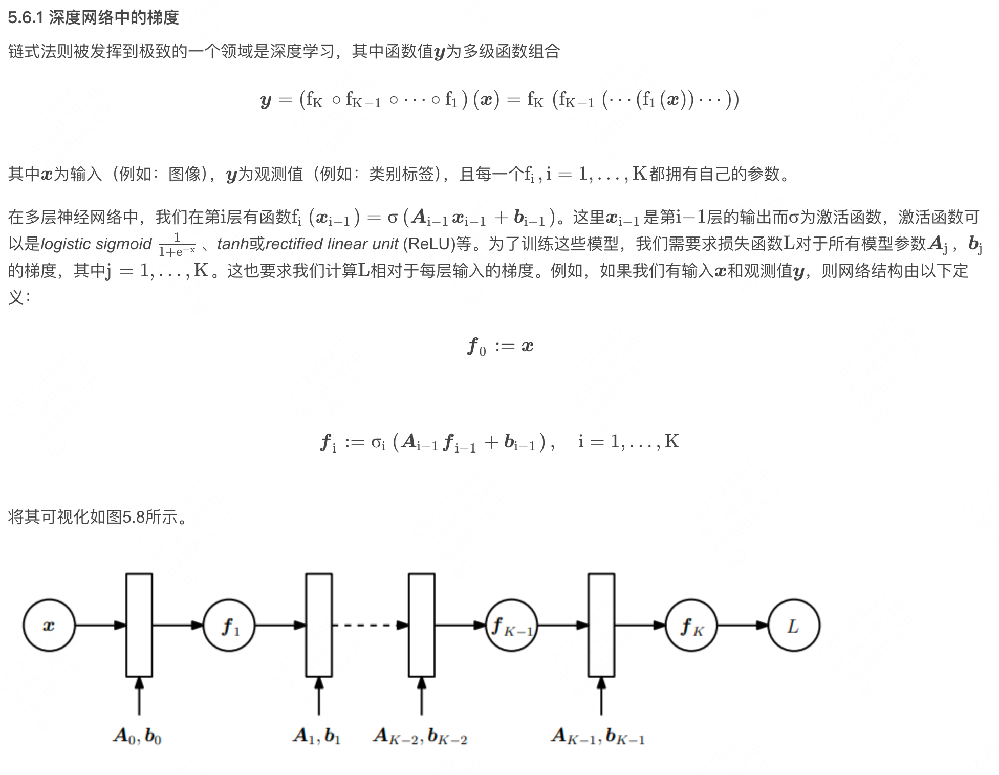

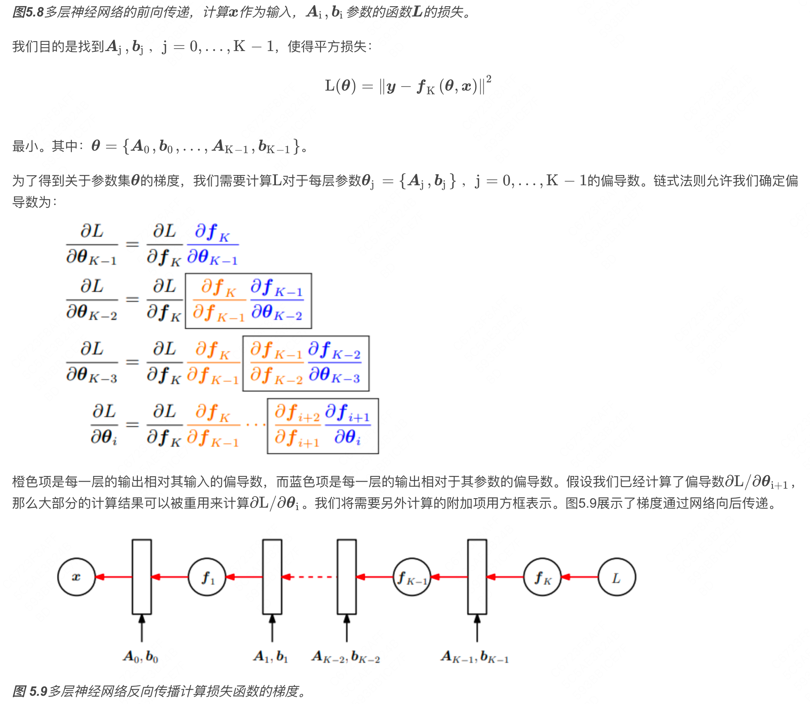

---

## See Also

- [[AI/Foundations/Math/线性代数|线性代数]] — 矩阵·向量空间，与微积分共同构成神经网络数学底座
- [[AI/Foundations/Training/Training Loss 分析|Training Loss 分析]] — 梯度下降的直接应用：loss landscape 与优化轨迹
- [[AI/Foundations/Training/Scaling Laws|Scaling Laws]] — 微积分视角理解参数规模与 loss 的幂律关系
- [[AI/Foundations/目录|Foundations MOC]] — 数学基础全图谱
