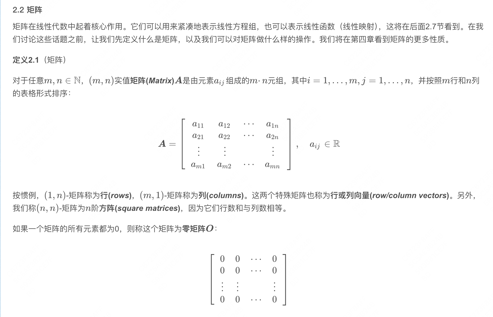
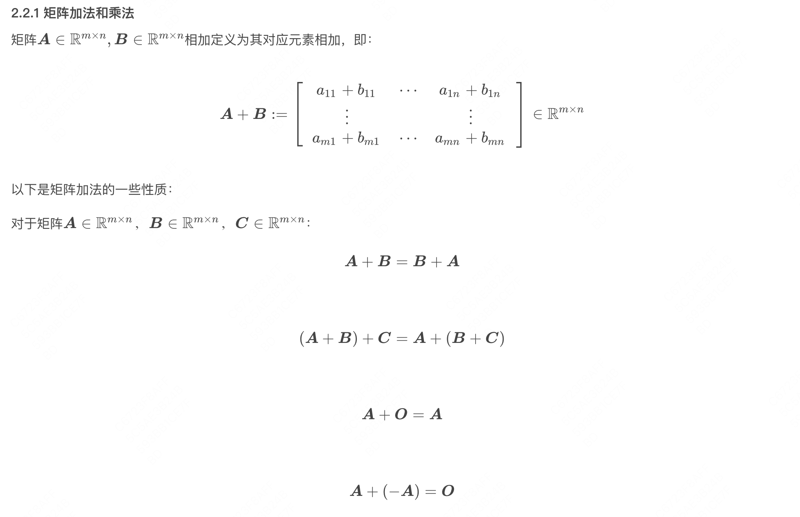
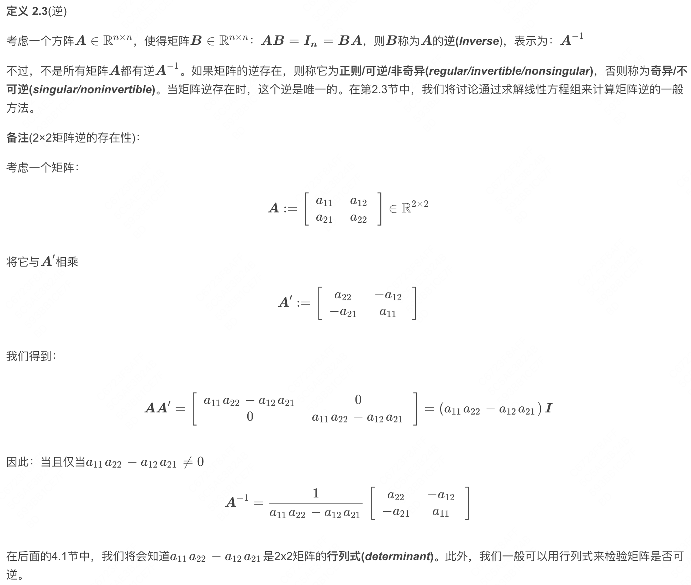
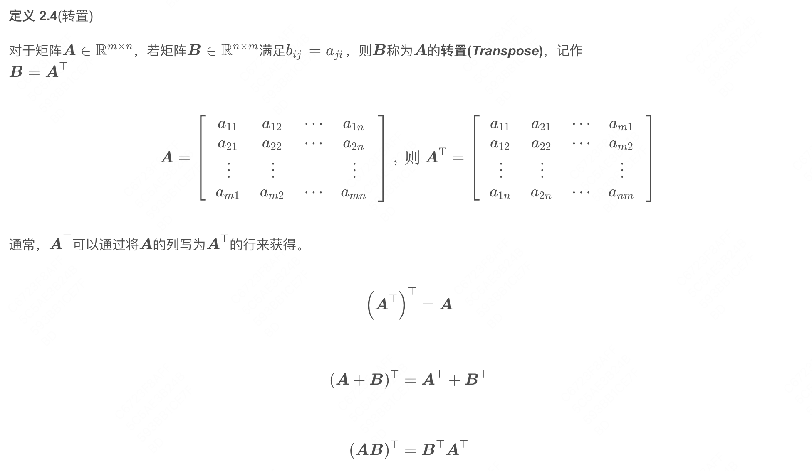
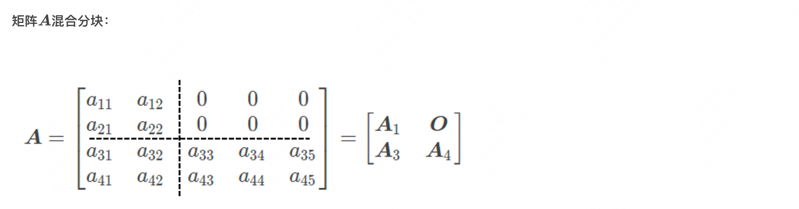
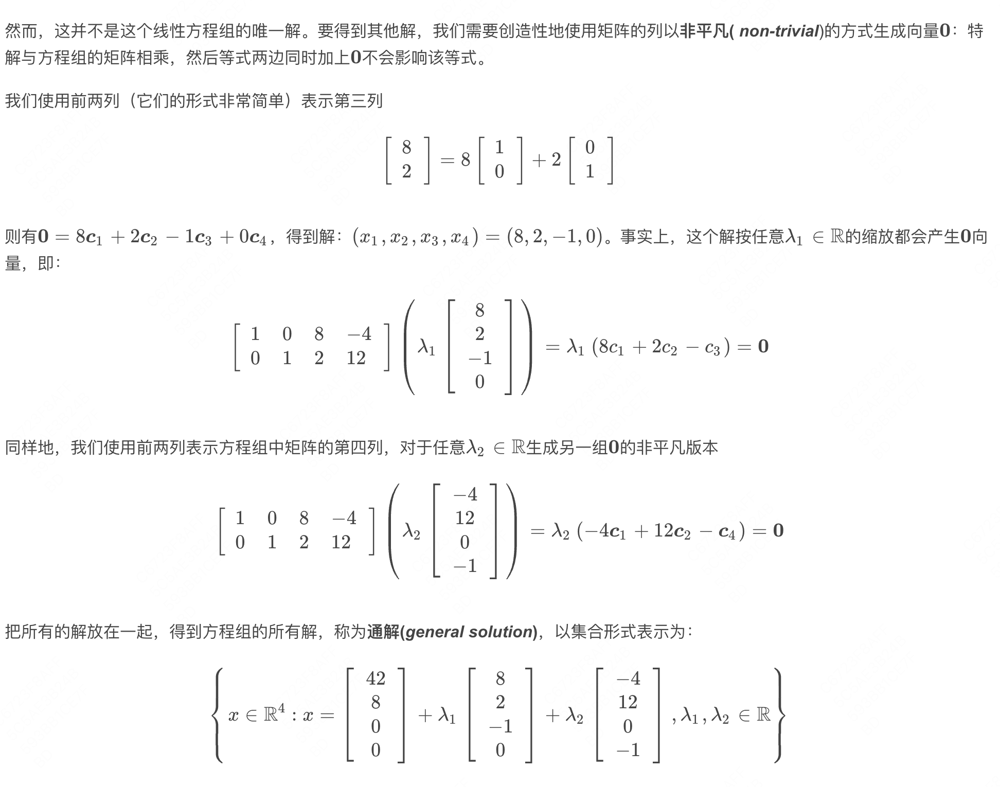
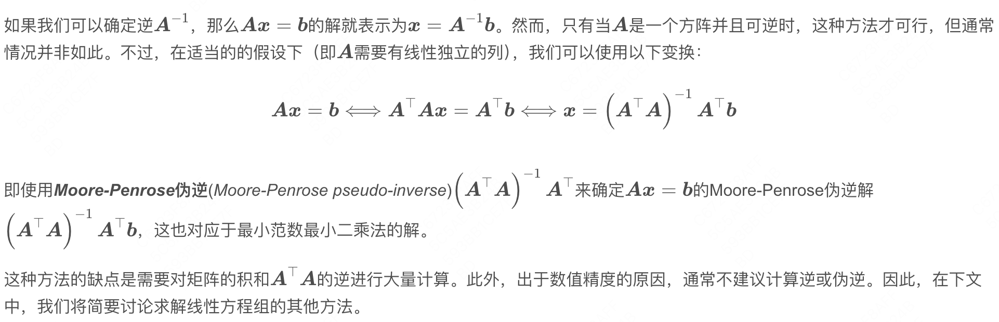
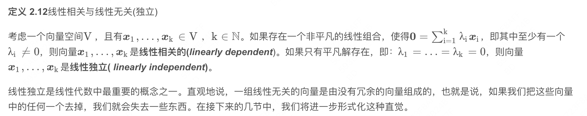
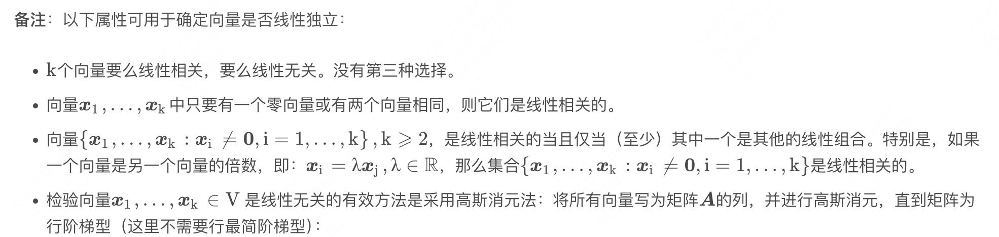
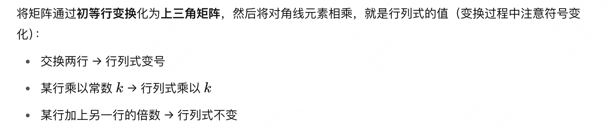

# 线性代数

https://blog.csdn.net/weixin_44378835/category_9707298.html

- 线性方程组：唯一解、无穷解、有解

- 矩阵

- 矩阵加法

- 矩阵乘法

- **扩展问题：如何计算更节省成本？**需要看计算次数，比如 (m*n) · (n*p) 矩阵相乘，结果矩=矩阵一共需要 m * p 个位置，每个位置需要 n 次乘法 + (n-1)次加法，根据这个公式计算成本，乘法浮点运算更消耗成本。

- 逆和转置

- 分块矩阵

- 矩阵求解

- 线性独立

- 矩阵的秩

- 行列式-高斯消元法

---

## See Also

- [[AI/Foundations/Math/向量微积分|向量微积分]] — 梯度·偏导·链式法则，与线性代数共同构成深度学习数学基础
- [[AI/Foundations/DL-Basics/Transformer|Transformer 通识]] — 线性代数的直接应用：QKV 矩阵乘法、注意力机制
- [[AI/Foundations/Training/Scaling Laws|Scaling Laws]] — 参数矩阵规模如何影响模型性能
- [[AI/Foundations/目录|Foundations MOC]] — 数学基础全图谱
