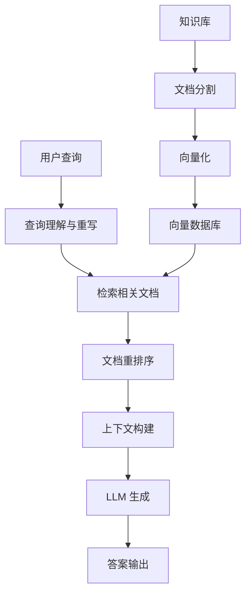

# RAG 原理与架构

RAG (Retrieval-Augmented Generation) 通过检索外部知识增强大语言模型的生成能力，是解决 LLM 知识局限性、幻觉问题的核心技术架构。

## RAG 核心流程



### 基础实现

```python
class BasicRAG:
    def __init__(self, embedding_model, llm, vector_db):
        self.embedding_model = embedding_model
        self.llm = llm
        self.vector_db = vector_db
    
    def query(self, question: str, top_k: int = 5):
        """基础 RAG 查询流程"""
        # 1. Retrieve：检索相关文档
        query_embedding = self.embedding_model.encode(question)
        retrieved_docs = self.vector_db.search(
            query_embedding, 
            k=top_k
        )
        
        # 2. Augment：构建增强上下文  
        context = "\n".join([doc.content for doc in retrieved_docs])
        
        prompt = f"""根据以下信息回答问题：

背景信息：
{context}

问题：{question}

答案："""
        
        # 3. Generate：LLM 生成答案
        response = self.llm.generate(prompt)
        return response, retrieved_docs

# 构建知识库
class KnowledgeBase:
    def __init__(self, embedding_model, vector_db):
        self.embedding_model = embedding_model
        self.vector_db = vector_db
    
    def index_documents(self, documents: List[str]):
        """将文档索引到向量数据库"""
        for doc in documents:
            # 文档分割
            chunks = self.chunk_document(doc, chunk_size=512)
            
            for chunk in chunks:
                # 向量化
                embedding = self.embedding_model.encode(chunk)
                
                # 存储到向量数据库
                self.vector_db.insert(
                    id=generate_id(),
                    vector=embedding,
                    content=chunk,
                    metadata={"source": doc.source}
                )
    
    def chunk_document(self, doc: str, chunk_size: int):
        """文档分割策略"""
        # 简单滑动窗口分割
        chunks = []
        words = doc.split()
        
        for i in range(0, len(words), chunk_size):
            chunk = " ".join(words[i:i + chunk_size])
            chunks.append(chunk)
            
        return chunks
```

## RAG 架构演进

### Naive RAG

最初的 RAG 架构，流程简单但存在明显局限：

**优点：**
- 实现简单，易于理解
- 快速原型验证

**问题：**
- 检索精度低：单一向量相似度判断
- 上下文利用差：简单拼接文档
- 缺乏推理能力：无法处理复杂查询

### Advanced RAG

针对 Naive RAG 的问题，引入预处理和后处理优化：

```python
class AdvancedRAG:
    def __init__(self, embedding_model, llm, vector_db, reranker):
        self.embedding_model = embedding_model
        self.llm = llm
        self.vector_db = vector_db
        self.reranker = reranker
        
    def query(self, question: str):
        # 预检索：查询增强
        enhanced_queries = self.query_expansion(question)
        
        all_docs = []
        for query in enhanced_queries:
            # 检索
            query_embedding = self.embedding_model.encode(query)
            docs = self.vector_db.search(query_embedding, k=20)
            all_docs.extend(docs)
        
        # 去重
        unique_docs = self.deduplicate_documents(all_docs)
        
        # 重排序
        reranked_docs = self.reranker.rerank(question, unique_docs)
        
        # 构建上下文
        context = self.build_context(reranked_docs[:5])
        
        # 生成答案
        response = self.generate_with_citation(question, context)
        
        return response
    
    def query_expansion(self, question: str):
        """查询扩展"""
        # 方法1: LLM 生成相关问题
        expansion_prompt = f"""
        基于问题：{question}
        生成3个相关的搜索查询，用于检索更全面的信息：
        """
        expanded = self.llm.generate(expansion_prompt)
        
        # 方法2: 同义词扩展
        synonyms = self.get_synonyms(question)
        
        return [question] + expanded.split('\n') + synonyms
    
    def build_context(self, docs):
        """智能上下文构建"""
        # 按相关性排序
        sorted_docs = sorted(docs, key=lambda x: x.score, reverse=True)
        
        # 控制上下文长度
        context_parts = []
        total_tokens = 0
        max_tokens = 4000
        
        for doc in sorted_docs:
            doc_tokens = len(doc.content.split())
            if total_tokens + doc_tokens > max_tokens:
                break
                
            context_parts.append(f"文档{len(context_parts)+1}: {doc.content}")
            total_tokens += doc_tokens
        
        return "\n\n".join(context_parts)
```

### Modular RAG

模块化架构，支持灵活的组件组合和流程定制：

```python
class ModularRAG:
    def __init__(self):
        self.modules = {}
        self.pipeline = []
    
    def add_module(self, name: str, module):
        """添加模块"""
        self.modules[name] = module
    
    def set_pipeline(self, pipeline: List[str]):
        """设置处理流水线"""
        self.pipeline = pipeline
    
    async def process(self, query: str):
        """按流水线执行模块"""
        context = {"query": query, "documents": [], "response": ""}
        
        for module_name in self.pipeline:
            module = self.modules[module_name]
            context = await module.process(context)
        
        return context["response"]

# 示例模块
class QueryRewriteModule:
    def __init__(self, llm):
        self.llm = llm
    
    async def process(self, context):
        original_query = context["query"]
        
        # 查询重写
        rewrite_prompt = f"""
        将以下查询重写为更适合检索的形式：
        原查询：{original_query}
        重写查询：
        """
        
        rewritten = await self.llm.generate(rewrite_prompt)
        context["rewritten_query"] = rewritten
        return context

class HybridRetrievalModule:
    def __init__(self, dense_retriever, sparse_retriever):
        self.dense_retriever = dense_retriever
        self.sparse_retriever = sparse_retriever
    
    async def process(self, context):
        query = context.get("rewritten_query", context["query"])
        
        # 稠密检索
        dense_docs = await self.dense_retriever.search(query, k=10)
        
        # 稀疏检索 
        sparse_docs = await self.sparse_retriever.search(query, k=10)
        
        # 融合结果
        all_docs = self.fusion_strategy(dense_docs, sparse_docs)
        context["documents"] = all_docs
        
        return context
    
    def fusion_strategy(self, dense_docs, sparse_docs):
        """结果融合策略 - RRF (Reciprocal Rank Fusion)"""
        doc_scores = {}
        
        # 稠密检索结果
        for rank, doc in enumerate(dense_docs):
            doc_id = doc.id
            doc_scores[doc_id] = doc_scores.get(doc_id, 0) + 1 / (rank + 1)
        
        # 稀疏检索结果  
        for rank, doc in enumerate(sparse_docs):
            doc_id = doc.id
            doc_scores[doc_id] = doc_scores.get(doc_id, 0) + 1 / (rank + 1)
        
        # 按融合分数排序
        sorted_docs = sorted(doc_scores.items(), key=lambda x: x[1], reverse=True)
        return [self.get_doc_by_id(doc_id) for doc_id, _ in sorted_docs]

# 配置 Modular RAG
rag = ModularRAG()
rag.add_module("query_rewrite", QueryRewriteModule(llm))
rag.add_module("retrieval", HybridRetrievalModule(dense_retriever, sparse_retriever))
rag.add_module("rerank", RerankModule(reranker))
rag.add_module("generation", GenerationModule(llm))

rag.set_pipeline(["query_rewrite", "retrieval", "rerank", "generation"])
```

## 关键组件拆解

### 1. 文档处理组件

```python
class DocumentProcessor:
    def __init__(self):
        self.chunking_strategies = {
            "fixed": self.fixed_size_chunking,
            "semantic": self.semantic_chunking,
            "recursive": self.recursive_chunking
        }
    
    def semantic_chunking(self, text: str, similarity_threshold: float = 0.5):
        """基于语义的智能分块"""
        sentences = self.split_sentences(text)
        embeddings = self.embedding_model.encode(sentences)
        
        chunks = []
        current_chunk = [sentences[0]]
        
        for i in range(1, len(sentences)):
            similarity = cosine_similarity(embeddings[i-1], embeddings[i])
            
            if similarity < similarity_threshold:
                # 语义跳跃，开始新块
                chunks.append(" ".join(current_chunk))
                current_chunk = [sentences[i]]
            else:
                current_chunk.append(sentences[i])
        
        chunks.append(" ".join(current_chunk))
        return chunks
    
    def recursive_chunking(self, text: str, max_size: int = 1000):
        """递归分块，保持语义完整性"""
        if len(text) <= max_size:
            return [text]
        
        # 尝试在段落边界分割
        paragraphs = text.split('\n\n')
        if len(paragraphs) > 1:
            return self._recursive_split(paragraphs, max_size)
        
        # 尝试在句子边界分割
        sentences = text.split('.')
        if len(sentences) > 1:
            return self._recursive_split(sentences, max_size)
        
        # 强制分割
        return [text[i:i+max_size] for i in range(0, len(text), max_size)]
```

### 2. 检索组件架构

```python
class RetrievalEngine:
    def __init__(self):
        self.retrievers = {}
        self.fusion_method = "rrf"  # reciprocal rank fusion
    
    def add_retriever(self, name: str, retriever):
        self.retrievers[name] = retriever
    
    async def hybrid_search(self, query: str, retrievers: List[str] = None):
        if retrievers is None:
            retrievers = list(self.retrievers.keys())
        
        results = {}
        for retriever_name in retrievers:
            retriever = self.retrievers[retriever_name]
            results[retriever_name] = await retriever.search(query)
        
        return self.fuse_results(results)
    
    def fuse_results(self, results: Dict[str, List]):
        """多路检索结果融合"""
        if self.fusion_method == "rrf":
            return self._reciprocal_rank_fusion(results)
        elif self.fusion_method == "weighted":
            return self._weighted_fusion(results)
        else:
            raise ValueError(f"Unknown fusion method: {self.fusion_method}")
```

### 3. 生成组件优化

```python
class GenerationModule:
    def __init__(self, llm):
        self.llm = llm
        self.prompt_templates = {
            "qa": self._build_qa_prompt,
            "summarization": self._build_summary_prompt,
            "reasoning": self._build_reasoning_prompt
        }
    
    def _build_qa_prompt(self, question: str, context: str):
        return f"""你是一个专业的问答助手。请基于提供的背景信息回答问题。

要求：
1. 答案必须基于背景信息，不要编造内容
2. 如果信息不足，请明确说明  
3. 提供具体的引用出处

背景信息：
{context}

问题：{question}

答案："""
    
    def generate_with_reasoning(self, question: str, context: str):
        """带推理链的生成"""
        reasoning_prompt = f"""
        分析以下问题和背景信息，按步骤推理：

        1. 问题分析：这个问题在问什么？
        2. 信息梳理：背景信息中哪些部分相关？
        3. 逻辑推理：如何从信息推导出答案？
        4. 结论总结：最终答案是什么？

        背景信息：{context}
        问题：{question}
        
        逐步推理：
        """
        
        reasoning = self.llm.generate(reasoning_prompt)
        
        # 基于推理生成最终答案
        answer_prompt = f"""
        基于以下推理过程，提供简洁明确的最终答案：
        
        推理过程：{reasoning}
        问题：{question}
        
        最终答案：
        """
        
        return self.llm.generate(answer_prompt), reasoning
```

## 典型应用场景

### 1. 企业知识问答

```python
class EnterpriseRAG:
    def __init__(self):
        self.document_types = {
            "policy": PolicyProcessor(),
            "technical": TechnicalDocProcessor(),  
            "faq": FAQProcessor()
        }
    
    def build_enterprise_kb(self, documents):
        """构建企业知识库"""
        for doc in documents:
            processor = self.document_types[doc.type]
            processed_chunks = processor.process(doc)
            
            for chunk in processed_chunks:
                # 添加企业特定元数据
                chunk.metadata.update({
                    "department": doc.department,
                    "access_level": doc.access_level,
                    "last_updated": doc.last_updated
                })
                
                self.vector_db.insert(chunk)
```

### 2. 代码问答系统

```python
class CodeRAG:
    def __init__(self):
        self.code_parsers = {
            "python": PythonParser(),
            "javascript": JSParser(),
            "java": JavaParser()
        }
    
    def index_codebase(self, repo_path: str):
        """索引代码库"""
        for file_path in self.scan_code_files(repo_path):
            language = self.detect_language(file_path)
            parser = self.code_parsers[language]
            
            # 解析代码结构
            functions = parser.extract_functions(file_path)
            classes = parser.extract_classes(file_path)
            
            # 为每个代码单元创建索引
            for func in functions:
                embedding = self.code_embedding_model.encode(
                    func.signature + func.docstring + func.body
                )
                
                self.vector_db.insert(
                    vector=embedding,
                    content=func.body,
                    metadata={
                        "type": "function",
                        "name": func.name,
                        "file": file_path,
                        "language": language,
                        "signature": func.signature
                    }
                )
```

## 面试常见问题

### Q1: RAG 相比直接使用 LLM 有什么优势？
**A**: RAG 主要解决了 LLM 的几个核心问题：1）知识截止：可以获取最新信息；2）幻觉问题：基于检索到的真实文档回答；3）领域知识：可以注入私有或专业知识；4）可解释性：提供信息来源和引用；5）成本控制：无需重新训练大模型。

### Q2: Naive RAG、Advanced RAG 和 Modular RAG 的主要区别？
**A**: Naive RAG 是基础流程（检索→拼接→生成），存在检索精度低、上下文利用差等问题。Advanced RAG 引入查询增强、重排序、结果融合等优化。Modular RAG 采用模块化架构，支持灵活的组件组合和流程定制，可以根据具体场景选择最优的模块组合。

### Q3: 如何评估 RAG 系统的性能？
**A**: RAG 评估包括多个维度：1）检索质量：Recall@K、Precision@K、MRR；2）生成质量：BLEU、ROUGE、BERTScore；3）端到端性能：Answer Accuracy、F1 Score；4）用户体验：响应时间、相关性评分；5）可信度：事实准确性、来源可靠性。需要结合自动化指标和人工评估。

### Q4: RAG 中的检索策略有哪些？
**A**: 主要包括：1）稠密检索：基于向量相似度（BERT、Sentence-BERT）；2）稀疏检索：基于关键词匹配（BM25、TF-IDF）；3）混合检索：结合稠密和稀疏方法；4）分阶段检索：粗排+精排；5）[[检索策略]]：HyDE、Query Expansion、Multi-vector等高级策略。

### Q5: RAG 系统在生产环境中的主要挑战是什么？
**A**: 主要挑战包括：1）延迟控制：检索和生成的平衡；2）成本优化：向量数据库和 LLM 调用成本；3）数据更新：实时性与一致性；4）质量保证：检索精度和生成质量；5）规模扩展：大规模知识库的索引和查询效率；6）安全隐私：敏感信息的访问控制和数据泄露防护。