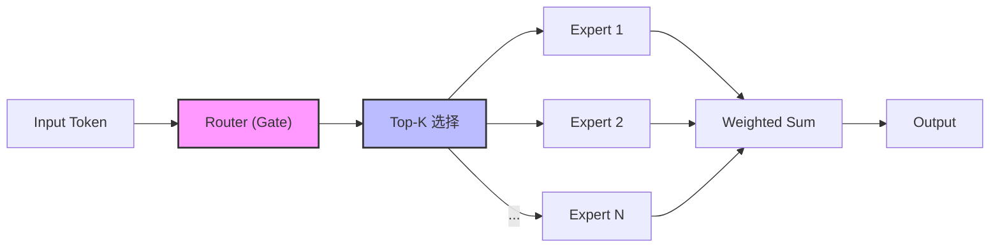
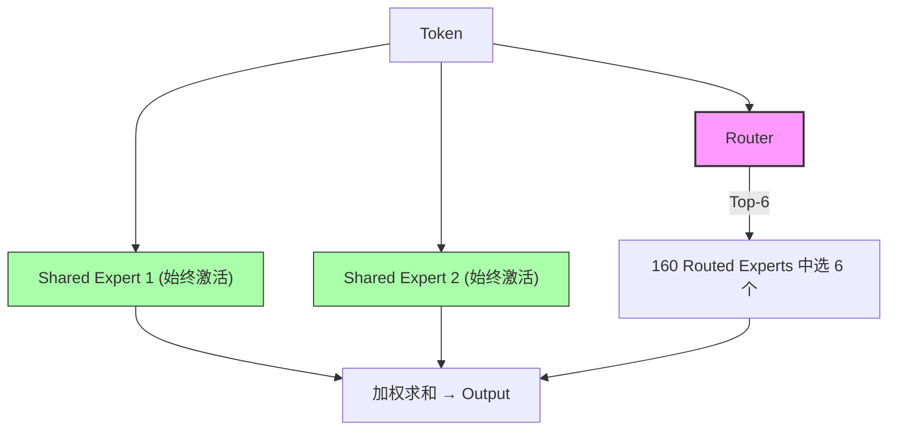
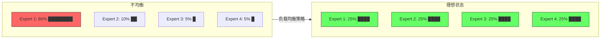
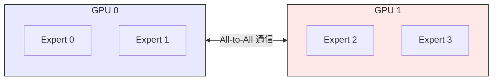

# MoE (Mixture of Experts) 深度解析

> **Brief**：MoE 通过条件计算（Conditional Computation）实现"大参数量、低计算量"——每个 token 只激活 Top-K 个专家，推理 FLOPs 远低于等参数 Dense 模型。核心挑战是负载均衡，DeepSeek-V3 用 Auxiliary-Loss-Free Dynamic Bias 优雅解决。
>
> 来源：Switch Transformers arXiv:2101.03961; DeepSeek-V3 arXiv:2412.19437

---

## 1. MoE 核心思想

MoE 的核心是**条件计算（Conditional Computation）**：不是每个输入都激活所有参数，而是根据输入动态选择一部分"专家"来处理。

> 来源：条件计算的思想最早由 Bengio et al. (2013) 提出，MoE 层由 Shazeer et al. (2017, arXiv:1701.06538) 引入 Transformer。

### 基本结构



关键公式：

$$y = \sum_{i=1}^{N} g_i(x) \cdot E_i(x)$$

其中 $g_i(x)$ 是路由权重（大部分为 0，只有 Top-K 非零），$E_i(x)$ 是第 $i$ 个专家的输出。

> 来源：Shazeer et al. arXiv:1701.06538, Eq. (1)

### 优劣势

| 优势 | 劣势 |
|------|------|
| 同等 FLOPs 下参数量更大 → 更强表达力 | 需要所有参数加载到显存 |
| 预训练效率高（同质量更快收敛） | 微调容易过拟合 |
| 推理时只激活子集 → FLOPs 低 | 路由不均衡导致效率下降 |
| 可扩展性强 | 通信开销大（分布式训练） |

> 以 Mixtral 8x7B 为例：总参数 47B（非 56B，因为非 FFN 层共享），每次推理只激活约 12B 参数。
> 来源：Mixtral arXiv:2401.04088, Sec. 1
>
> 参见 [[AI/Foundations/DL-Basics/MoE 基础|MoE 基础]] 了解更多基础概念。

## 2. 路由机制演进

### 2.1 经典 Top-K 路由

最早的 Switch Transformer (Google, 2021) 使用 Top-1 路由：

```python
# 经典 Top-K Router
def top_k_route(x, W_gate, k=2):
    logits = x @ W_gate  # [batch, num_experts]
    topk_values, topk_indices = torch.topk(logits, k)
    weights = F.softmax(topk_values, dim=-1)
    return weights, topk_indices
```

问题：容易出现**路由坍塌（Route Collapse）**——Router 倾向于总是选择少数几个专家。

> 来源：Switch Transformers arXiv:2101.03961, Sec. 2.2 讨论了路由坍塌问题并引入 capacity factor 缓解

### 2.2 DeepSeek-V2：细粒度专家 + 共享专家

DeepSeek-V2 (2024) 引入了 **DeepSeekMoE** 架构的关键创新：

> 来源：DeepSeekMoE arXiv:2401.06066; DeepSeek-V2 arXiv:2405.04434

#### 细粒度专家分割
- 不同于 Mixtral 的 8 个大专家，DeepSeek-V2 使用 **160 个小专家**
- 每个 token 激活 6 个路由专家 + **2 个共享专家（Shared Experts）**
- 共享专家始终激活，处理通用知识；路由专家处理特化知识



#### Multi-head Latent Attention (MLA)
- 压缩 KV Cache：将 Key-Value 压缩到低秩隐空间
- 显存从标准 MHA 的 **100%** 降到约 **5-10%**
- 这也是 [[AI/LLM/Inference/vLLM|vLLM]] 等推理框架需要适配的关键特性

> 来源：DeepSeek-V2 arXiv:2405.04434, Sec. 3.1 (Multi-head Latent Attention)

### 2.3 DeepSeek-V3：无辅助损失负载均衡

DeepSeek-V3 (2024-12) 在 MoE 架构上做出了突破性改进：

> 来源：DeepSeek-V3 arXiv:2412.19437

#### 架构规格
- 总参数：**671B**，每 token 激活 **37B**
- 256 个路由专家 + 1 个共享专家
- 每 token 激活 8 个路由专家

#### Auxiliary-Loss-Free 负载均衡

传统方法使用辅助损失（auxiliary loss）惩罚不均衡的路由，但这会损害模型性能：

```python
# 传统方式：辅助损失（Switch Transformer 提出）
L_balance = α * Σ(f_i * P_i)  # f_i=实际分配比例, P_i=路由概率
# 问题：α 的权衡 —— 太大损害性能，太小不起作用
```

> 来源：Switch Transformers arXiv:2101.03961, Eq. (4)-(6) 定义了 auxiliary loss

DeepSeek-V3 的创新——**动态偏置项（Dynamic Bias）**：

```python
# DeepSeek-V3: Auxiliary-Loss-Free Balancing
def route_with_bias(x, W_gate, bias):
    """每个专家维护一个偏置项，动态调整"""
    logits = x @ W_gate + bias  # bias 用于路由决策
    # 注意：bias 只影响路由选择，不影响权重计算
    topk_indices = torch.topk(logits, k=8).indices
    # 权重计算时不包含 bias
    weights = F.softmax((x @ W_gate)[topk_indices], dim=-1)
    return weights, topk_indices

# 动态更新 bias：
# 如果专家 i 过载 → 降低 bias_i
# 如果专家 i 空闲 → 提高 bias_i
```

核心洞察：**将路由决策（用 bias 调节）与权重计算（不用 bias）解耦**。

> 来源：DeepSeek-V3 arXiv:2412.19437, Sec. 3.2 (Auxiliary-Loss-Free Load Balancing)

#### Multi-Token Prediction (MTP)
- 每个位置预测下一个 token 的同时，额外预测后续 1-2 个 token
- 在训练时提供更丰富的监督信号
- 推理时可用于 [[AI/LLM/Inference/推理优化|Speculative Decoding]]

> 来源：DeepSeek-V3 arXiv:2412.19437, Sec. 3.4

### 2.4 DeepSeek-V3.2 的 RL 训练改进

针对 MoE 模型的 RL 训练：

- **Keep Routing**：在 rollout 时记录专家激活模式，训练时强制使用相同路由
- 确保梯度更新只作用于实际产生答案的专家
- **Off-policy Sequence Masking**：丢弃策略偏移过大的序列

## 3. 负载均衡详解

负载均衡是 MoE 工程中最核心的挑战：

### 3.1 为什么需要负载均衡？



不均衡后果：过载专家成为瓶颈，空闲专家未充分训练。

### 3.2 负载均衡策略对比

| 策略 | 方法 | 优点 | 缺点 | 来源 |
|------|------|------|------|------|
| Auxiliary Loss | 添加负载均衡损失函数 | 简单直接 | 超参敏感，损害性能 | Switch Transformer arXiv:2101.03961 |
| Expert Choice | 专家选择 token 而非 token 选专家 | 完美均衡 | 因果模型不适用 | Zhou et al. arXiv:2202.09368 |
| Token Drop | 超载专家丢弃 token | 强制均衡 | 信息丢失 | GShard arXiv:2006.16668 |
| **Dynamic Bias** (V3) | 偏置项动态调整 | 无性能损害 | 实现复杂 | DeepSeek-V3 arXiv:2412.19437 |
| Capacity Factor | 限制每个专家处理量上限 | 可控 | 需要仔细调参 | Switch Transformer arXiv:2101.03961 |

### 3.3 分布式训练中的 All-to-All 通信

MoE 的分布式训练需要 **Expert Parallelism**：



路由后 token 需要发送到对应 GPU 上的专家处理。

DeepSeek-V3 的通信优化：
- **FP8 量化通信**：将 All-to-All 通信数据从 FP16 → FP8，带宽减半
- **重叠计算与通信**：在计算当前层时预取下一层的通信数据
- 训练成本仅 **$5.58M**（2048 × H800, 2个月），极致工程优化

> 来源：DeepSeek-V3 arXiv:2412.19437, Sec. 4 (Training Infrastructure)

## 4. 工程实践要点

### 4.1 MoE 训练 Checklist

```yaml
训练配置:
  num_experts: 256          # DeepSeek-V3 规模
  num_shared_experts: 1     # 共享专家
  top_k: 8                  # 每 token 激活数
  expert_capacity_factor: 1.25  # 容量因子
  load_balance_strategy: "dynamic_bias"  # V3 方式

通信优化:
  expert_parallel_size: 8   # EP 并行度
  communication_dtype: "fp8" # 量化通信
  overlap_comm_compute: true
```

### 4.2 推理部署注意事项

- **显存需求**：即使只激活部分专家，所有参数都要加载
- DeepSeek-V3 671B → 需要约 **350GB+ 显存**（FP8 量化后约 ~170GB）
- [[AI/LLM/Inference/vLLM|vLLM]] 已支持 DeepSeek-V3 的 MoE 推理
- Expert offloading：冷门专家可以 offload 到 CPU/SSD

## 5. 面试常见问题

**Q1: MoE 和 Dense 模型，相同 FLOPs 下谁更强？**
A: MoE 更强。因为 MoE 可以在相同计算量下拥有更大的参数量（更多知识容量），只是每次推理只用一部分。Switch Transformer 论文（arXiv:2101.03961）实验表明 MoE 在同等 FLOPs 下预训练收敛更快、性能更强。

**Q2: DeepSeek-V3 的 auxiliary-loss-free 负载均衡怎么工作的？**
A: 给每个专家加一个 bias 项，影响路由决策但不影响权重计算。如果专家过载就降 bias、空闲就升 bias。关键是路由决策和权重计算的解耦。（来源：DeepSeek-V3 arXiv:2412.19437, Sec. 3.2）

**Q3: 为什么 DeepSeek 用细粒度专家（160/256个小专家）而不是 Mixtral 那样的 8 个大专家？**
A: 细粒度专家提供更灵活的知识组合方式。8 个大专家 → 每次选 2 个只有 $C(8,2)=28$ 种组合；160 个小专家选 6 个 → 组合数 $C(160,6) \approx 2.1 \times 10^{10}$，表达力远超。（来源：DeepSeekMoE arXiv:2401.06066, Sec. 2）

**Q4: MoE 微调为什么容易过拟合？**
A: 因为每个专家看到的数据量少（总数据被 $K/N$ 稀释），而参数量又大。解决方案：使用 [[AI/LLM/SFT/LoRA|LoRA]] 微调、冻结 Router、增加正则化。

**Q5: 路由坍塌（Route Collapse）是什么？如何检测和解决？**
A: 路由器持续只选少数专家，其他专家得不到训练。检测：监控每个专家的 token 接收量分布。解决：负载均衡损失/Dynamic Bias/Expert Choice Routing。

---

## 🔧 落地应用

### 什么时候用 MoE？
- **预训练大规模模型**：希望模型容量大但推理 FLOPs 可控，MoE 是首选架构（Mixtral 8x7B、DeepSeek-V3 都是 MoE）
- **多任务/多领域模型**：不同专家可以自然特化为不同领域（代码专家、数学专家、语言专家），比 Dense 更高效
- **推理成本敏感场景**：相同质量下 MoE 推理 FLOPs 更低（DeepSeek-V3 671B 参数但只激活 37B）

### 什么时候不用 MoE？
- **显存受限**：MoE 总参数量大，所有专家都要加载，对推理显存不友好
- **小模型场景**：7B 以下模型用 MoE 收益不明显，路由开销占比太高
- **微调场景**：MoE 微调容易过拟合，优先考虑 LoRA 或冻结路由层

### 部署工程要点
- **Expert Parallelism (EP)**：大 MoE 模型必须跨 GPU 分布专家，需要高速 All-to-All 通信
- **KV Cache 优化**：MLA（DeepSeek-V2/V3）大幅压缩 KV Cache，vLLM 需要专门适配
- **Expert Offloading**：对推理延迟不敏感的场景，可以把冷门专家 offload 到 CPU/SSD，节省 GPU 显存
- **量化部署**：FP8 量化可将 DeepSeek-V3 从 ~350GB 压缩到 ~170GB，适配 8×H100

### 面试加分项
- 能画出 MoE 的 Router → Expert → Weighted Sum 流程
- 能解释 Auxiliary Loss vs Dynamic Bias 的 trade-off
- 能说明 Expert Parallelism 中 All-to-All 通信的瓶颈和优化

---

## 💡 启发与思考

### So What？
MoE 证明了一个深刻的设计哲学：**不是所有知识都需要同时参与计算**。这和人脑的工作方式类似——面对数学题时，你不需要激活语言翻译区域的神经元。DeepSeek-V3 用 671B 参数但只激活 37B 就在多个基准上超越 GPT-4o，这说明"稀疏激活 + 大容量"可能是比"密集计算 + 小容量"更优的 scaling 路线。

对老板的启示：在系统设计中，"条件计算"是一个通用思路——不要让所有模块处理所有请求，而是根据请求类型路由到专门的模块。这个思路可以用在 Agent 架构、微服务路由等场景。

### 局限与未解问题
- **推理显存瓶颈**：MoE 的总参数量大，即使只激活部分专家也需要全部加载，这限制了端侧部署
- **专家特化的可解释性**：路由器到底学会了什么？每个专家到底特化了什么知识？目前缺乏系统性研究
- **MoE + RL 的稳定性**：在 RL 训练中专家路由可能震荡，DeepSeek-V3.2 的 Keep Routing 是一个 workaround，但不是根本解决
- **长上下文中的路由一致性**：一段连贯的论述中不同 token 可能路由到不同专家，这会影响一致性吗？

### 脑暴拓展
- MoE 的"专家 + 路由"思路能否用在 Agent 系统中？多个专业 Agent + 一个 Router Agent = Agent MoE？
- 如果每个专家附加一个 LoRA，能否实现 MoE-LoRA 混合微调？（已有相关工作：MoLoRA）
- DeepSeek 的 Dynamic Bias 是否可以迁移到推荐系统的流量分配？

> 🔗 See also:
> - [[AI/Foundations/DL-Basics/MoE 基础]] — 入门概念
> - [[AI/LLM/Architecture/DeepSeek-R1]] — 推理能力，GRPO 训练
> - [[AI/LLM/Architecture/DeepSeek Engram]] — 条件记忆新维度
> - [[AI/LLM/Infra/分布式训练]] — Expert Parallelism 的分布式实现
> - [[AI/LLM/Infra/DeepSpeed]] — MoE 训练支持

---

## 📚 推荐阅读

### 原始论文
- [Switch Transformers: Scaling to Trillion Parameter Models with Simple and Efficient Sparsity](https://arxiv.org/abs/2101.03961) — MoE 在 Transformer 中的里程碑工作，Top-1 路由 + Capacity Factor，必读 ⭐⭐⭐⭐⭐
- [GShard: Scaling Giant Models with Conditional Computation and Automatic Sharding](https://arxiv.org/abs/2006.16668) — Google 的大规模 MoE 工程化方案，Token Drop 思路 ⭐⭐⭐⭐
- [DeepSeekMoE: Towards Ultimate Expert Specialization in Mixture-of-Experts Language Models](https://arxiv.org/abs/2401.06066) — 细粒度专家 + 共享专家的提出 ⭐⭐⭐⭐⭐
- [DeepSeek-V3 Technical Report](https://arxiv.org/abs/2412.19437) — 671B MoE 的完整工程细节，Dynamic Bias + MTP + FP8 训练 ⭐⭐⭐⭐⭐

### 深度解读
- [Mixture of Experts Explained (HuggingFace Blog)](https://huggingface.co/blog/moe) — 最佳入门向解读，含代码 ⭐⭐⭐⭐⭐
- [Mixtral of Experts (Mistral AI)](https://arxiv.org/abs/2401.04088) — Mixtral 8x7B 技术报告，开源 MoE 的代表 ⭐⭐⭐⭐

### 实践资源
- [Megablocks](https://github.com/databricks/megablocks) — Databricks 的高效 MoE 训练库 ⭐⭐⭐⭐
- [DeepSpeed MoE](https://www.deepspeed.ai/tutorials/mixture-of-experts/) — 微软 DeepSpeed 的 MoE 训练教程 ⭐⭐⭐⭐
- [vLLM MoE 推理](https://docs.vllm.ai/) — 支持 Mixtral/DeepSeek MoE 推理的框架 ⭐⭐⭐⭐
