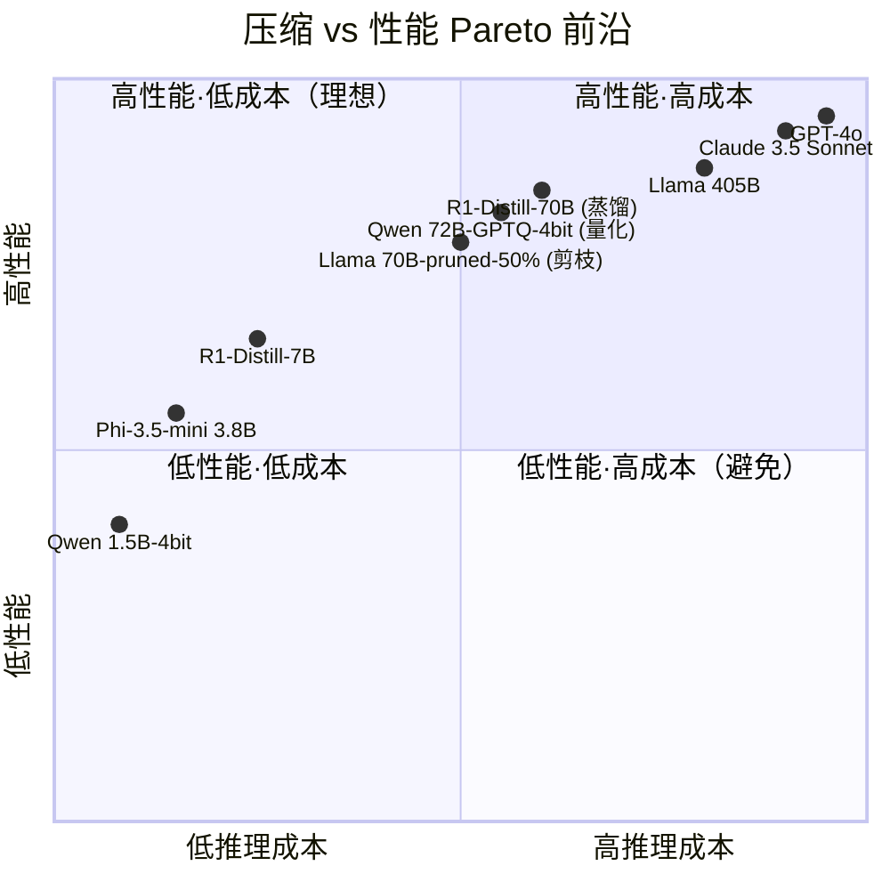
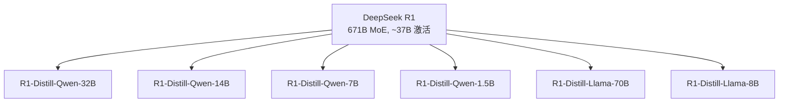
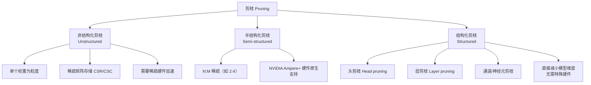
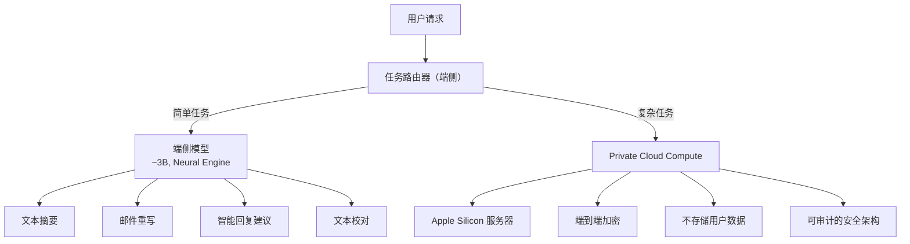

# 知识蒸馏与模型压缩 — 2026 技术全景

> 面试武器库 #18 | 最后更新：2026-02-21

> [!note] 正式版本
> 此文件位于 `AI/LLM/Efficiency/`（正式路径）。根目录存在同名副本（Scholar 路径问题），已标记为过期副本。

---

## 目录

1. [概述：为什么需要模型压缩](#1-概述为什么需要模型压缩)
2. [知识蒸馏 Knowledge Distillation](#2-知识蒸馏-knowledge-distillation)
3. [量化 Quantization](#3-量化-quantization)
4. [剪枝 Pruning](#4-剪枝-pruning)
5. [低秩分解 Low-Rank Factorization](#5-低秩分解-low-rank-factorization)
6. [架构效率优化](#6-架构效率优化)
7. [推理优化系统](#7-推理优化系统)
8. [端侧部署](#8-端侧部署)
9. [2026 前沿趋势](#9-2026-前沿趋势)
10. [Benchmark 与评估](#10-benchmark-与评估)
11. [面试题](#11-面试题)
12. [参考文献](#参考文献)

---

## 1. 概述：为什么需要模型压缩

### 1.1 LLM 部署成本的残酷现实

2026 年的大模型格局可以用一组数字概括：

| 模型 | 参数量 | FP16 显存 | 推理单次成本 | 最低 GPU 配置 |
|------|--------|-----------|-------------|--------------|
| GPT-4 (推测) | ~1.8T MoE | ~3.2 TB | ~$0.03/1K tokens | 8×H100 80GB |
| Llama 3.1 405B | 405B | ~810 GB | ~$0.005/1K tokens | 8×A100 80GB |
| DeepSeek R1 | 671B MoE | ~1.3 TB | ~$0.002/1K tokens | 8×H100 80GB |
| Llama 3.1 70B | 70B | ~140 GB | ~$0.001/1K tokens | 2×A100 80GB |
| Qwen 2.5 7B | 7B | ~14 GB | <$0.0001/1K tokens | 单张 RTX 4090 |

**核心矛盾**：最强的模型需要最贵的硬件，但 99% 的应用场景并不需要 GPT-4 级别的能力。模型压缩的本质是**在性能-成本 Pareto 前沿上找到更优的点**。

### 1.2 压缩的四重动力

**成本驱动**：一个 70B 模型的推理成本是 7B 模型的 ~10 倍。对于日均百万请求的服务，这意味着每月数十万美元的差异。

**延迟驱动**：自回归解码是 memory-bound 的——模型越大，每次前向传播需要加载的权重越多，延迟越高。对于实时对话、代码补全等场景，用户可感知的延迟阈值是 ~200ms/token。

**隐私驱动**：数据不出设备（on-device inference）是 2026 年的核心趋势。Apple Intelligence、Google Gemini Nano 都在推动端侧推理——但手机只有 6-12 GB 可用内存。

**能耗驱动**：训练一次 GPT-4 级模型的碳排放约等于 5 辆汽车的终身排放。推理阶段的总能耗更大——全球 AI 推理预计 2026 年消耗 ~85 TWh 电力（相当于荷兰全国用电量）。

### 1.3 压缩 vs 性能的 Pareto 前沿



**关键洞察**：不同压缩技术占据 Pareto 前沿的不同区域：
- **蒸馏**：在小模型区间效果最好（把大模型的"知识"浓缩进小模型）
- **量化**：在同架构下压缩比最高（4-bit 量化可节省 ~75% 显存，性能损失 <2%）
- **剪枝**：在中等压缩比时效率最优（30-50% 稀疏度通常可无损）
- **组合方法**：蒸馏 + 量化 + 剪枝 = 2026 年的最佳实践

### 1.4 2026 年格局：端侧部署需求爆发

| 部署场景 | 内存限制 | 延迟要求 | 典型模型规格 |
|---------|---------|---------|-------------|
| 云端（H100/A100） | 80-640 GB | 无严格限制 | 70B-405B FP16/INT8 |
| 边缘服务器（T4/L4） | 16-24 GB | <100ms/token | 7B-13B INT4 |
| 笔记本/PC（RTX 4060） | 8-16 GB | <200ms/token | 3B-7B INT4 |
| 手机（iPhone 16/Pixel 9） | 6-8 GB 可用 | <300ms/token | 1.5B-3B INT4 |
| 浏览器（WebGPU） | 2-4 GB | <500ms/token | <1B INT4 |
| MCU/IoT | <512 KB | 实时 | 微型模型（~1M params） |

**2026 年的关键变化**：
1. **Apple Intelligence** 在 iPhone 16 Pro 上运行 ~3B 参数的端侧模型，处理文本摘要、邮件重写等任务
2. **Google Gemini Nano** 2.0 集成到 Pixel 9/Chrome，支持端侧 RAG
3. **Qualcomm/MediaTek** 的 NPU 专门优化 INT4/INT8 推理，能效比 GPU 高 5-10 倍
4. **llama.cpp** 生态已经成为社区标准，GGUF 格式支持从服务器到手机的全平台部署

---

## 2. 知识蒸馏 Knowledge Distillation

### 2.1 经典 KD：Hinton 2015

知识蒸馏的核心思想来自 Hinton et al. (2015) 的奠基性论文 *"Distilling the Knowledge in a Neural Network"*。其核心洞察是：**Teacher 模型的 soft label 包含比 hard label 更丰富的信息**。

**温度缩放（Temperature Scaling）**：

标准 softmax 输出：

$$p_i = \frac{\exp(z_i)}{\sum_j \exp(z_j)}$$

带温度的 softmax：

$$p_i^{(T)} = \frac{\exp(z_i / T)}{\sum_j \exp(z_j / T)}$$

当 $T > 1$ 时，输出分布变得更"平"，暴露了类间的相似性结构（dark knowledge）。例如，在图像分类中，teacher 对 "猫" 图片的 soft label 可能是 `[猫: 0.7, 豹: 0.15, 狗: 0.1, ...]`，这告诉 student "猫和豹比猫和汽车更像"——这种信息在 one-hot label 中完全丢失。

**蒸馏损失函数**：

$$\mathcal{L}_{KD} = \alpha \cdot \mathcal{L}_{CE}(y, p_s) + (1 - \alpha) \cdot T^2 \cdot D_{KL}(p_t^{(T)} \| p_s^{(T)})$$

其中：
- $\mathcal{L}_{CE}(y, p_s)$：student 与 ground truth 之间的交叉熵
- $D_{KL}(p_t^{(T)} \| p_s^{(T)})$：teacher 和 student soft label 之间的 KL 散度
- $\alpha$：两个损失的平衡系数（通常 0.1-0.5）
- $T^2$：补偿温度缩放对梯度幅度的影响

**为什么 $T^2$ 是必要的**：当 $T$ 增大时，softmax 输出的梯度按 $1/T^2$ 缩小。乘以 $T^2$ 确保 KD loss 的梯度量级与 CE loss 可比。

### 2.2 特征蒸馏

经典 KD 只使用最终输出层的信息，特征蒸馏则利用中间层表示：

| 方法 | 核心思想 | 蒸馏什么 |
|------|---------|---------|
| FitNets (Romero 2014) | 匹配中间层特征 | 隐藏层激活值 |
| PKT (Passalis 2018) | 概率知识转移 | 特征空间的概率分布 |
| Attention Transfer (Zagoruyko 2016) | 匹配注意力图 | 注意力权重矩阵 |
| NST (Huang 2017) | 神经风格转移 | Gram 矩阵（特征相关性） |
| CRD (Tian 2019) | 对比表示蒸馏 | 跨模型的互信息 |
| VID (Ahn 2019) | 变分信息蒸馏 | 信息瓶颈 |

**FitNets** 的典型实现：

```python
import torch
import torch.nn as nn

class FeatureDistillationLoss(nn.Module):
    def __init__(self, student_dim, teacher_dim):
        super().__init__()
        # 维度不匹配时用线性投影对齐
        self.projector = nn.Linear(student_dim, teacher_dim)
    
    def forward(self, student_feat, teacher_feat):
        projected = self.projector(student_feat)
        return nn.functional.mse_loss(projected, teacher_feat.detach())

# 蒸馏训练循环
for batch in dataloader:
    # Teacher 前向（不计算梯度）
    with torch.no_grad():
        teacher_logits, teacher_feats = teacher(batch, return_features=True)
    
    # Student 前向
    student_logits, student_feats = student(batch, return_features=True)
    
    # 多层特征蒸馏
    feat_loss = sum(
        feat_criterion(s_feat, t_feat) 
        for s_feat, t_feat in zip(student_feats, teacher_feats)
    )
    
    # 总损失 = 任务损失 + 输出蒸馏 + 特征蒸馏
    loss = task_loss + alpha * kd_loss + beta * feat_loss
```

### 2.3 LLM 蒸馏的特殊挑战

将 KD 应用到 LLM 时，面临几个经典 CV 蒸馏中不存在的问题：

**挑战 1：Teacher 太大，无法同时加载**

经典 KD 需要 teacher 和 student 同时在 GPU 上前向传播。但如果 teacher 是 405B（~810 GB），student 是 7B（~14 GB），你需要 ~824 GB 显存——即使 8 张 H100 也刚刚够。

**解决方案**：
- **离线蒸馏**：先用 teacher 生成所有训练数据的 soft labels，存到磁盘，再用这些 soft labels 训练 student
- **分布式蒸馏**：teacher 跨多节点并行，通过网络传递 logits/features
- **渐进蒸馏**：405B → 70B → 7B，逐级蒸馏，每级的 teacher-student 对显存需求可控

**挑战 2：词表大小导致存储爆炸**

LLM 的词表通常有 32K-128K tokens。存储每个 token position 的完整 logit 向量（128K × FP32 = 512 KB/position）× 数百万训练序列 = 数 PB 级别的存储需求。

**解决方案**：
- **Top-K logits**：只存储 top-K（如 K=100）个 logit 值及其索引
- **Token-level sampling**：随机采样部分 position 进行蒸馏
- **在线蒸馏 + Gradient Checkpointing**：分批次加载 teacher 权重

**挑战 3：自回归生成的 exposure bias**

训练时用 teacher forcing，但推理时 student 自回归生成——每一步的误差会累积（exposure bias）。这在蒸馏中比标准训练更严重，因为 student 在训练时"看到"的是 ground truth context，但推理时看到的是自己的（可能有误的）输出。

### 2.4 序列级蒸馏 vs Token 级蒸馏

| 维度 | Token 级蒸馏 | 序列级蒸馏 |
|------|------------|-----------|
| 监督信号 | 每个位置的 logit 分布 | 完整序列（teacher 生成） |
| 存储需求 | 高（V × L × N） | 低（只存文本） |
| 暴露偏差 | 存在 | 缓解（student 训练在 teacher 序列上） |
| 多样性 | 继承训练数据 | 可通过采样增加 |
| 实现复杂度 | 高（需要 logits） | 低（只需 API 访问） |

**Token 级蒸馏**（word-level KD）：
$$\mathcal{L}_{\text{token-KD}} = \sum_{t=1}^{L} D_{KL}\left(p_{\text{teacher}}(\cdot | x_{<t}) \| p_{\text{student}}(\cdot | x_{<t})\right)$$

**序列级蒸馏**（sequence-level KD, Kim & Rush 2016）：
1. 用 teacher 对每条输入生成 K 个候选输出
2. 选择最佳输出（beam search / 奖励模型排序）
3. 用这些 (input, teacher_output) 对标准微调 student

**序列级蒸馏的优势**：
- 不需要 teacher 的 logits，只需要文本输出
- 天然适合黑盒蒸馏（teacher 只提供 API）
- 可以结合 rejection sampling：生成多个输出，只用最好的训练

### 2.5 黑盒蒸馏（API Distillation）

黑盒蒸馏是 2024-2026 年最流行的 LLM 蒸馏范式：**用闭源大模型的 API 输出训练开源小模型**。

**典型流程**：

```
1. 准备 prompt 数据集（如 FLAN、ShareGPT、用户场景数据）
2. 调用 GPT-4 / Claude API 生成高质量回答
3. 数据清洗 & 质量过滤
4. 用 (prompt, API_response) 对微调开源小模型
```

**代表性工作**：

| 项目 | Teacher | Student | 关键发现 |
|------|---------|---------|---------|
| Alpaca (Stanford 2023) | GPT-3.5 / text-davinci-003 | LLaMA 7B | 52K 指令数据即可显著提升 |
| Vicuna (LMSYS 2023) | GPT-4 对话 | LLaMA 13B | ~70K ShareGPT 对话 |
| WizardLM (2023) | GPT-3.5/4 | LLaMA 7B-70B | Evol-Instruct 增强复杂度 |
| Orca 2 (Microsoft 2023) | GPT-4 | LLaMA 13B | 思维链蒸馏（CoT distillation） |
| OpenHermes 2.5 (2024) | GPT-4 + 多源 | Mistral 7B | 混合多个 teacher |

**法律与伦理争议**：大多数闭源 API 的使用条款（ToS）禁止用输出训练竞争模型。OpenAI 的条款明确禁止"用 API 输出开发竞争性 AI 模型"。这意味着严格来说，Alpaca/Vicuna 等项目可能违反了 ToS。2025-2026 年，这个灰色地带逐渐清晰化：
- OpenAI 推出了 Model Spec 和蒸馏许可证
- Anthropic 允许在特定条件下使用 Claude 输出进行研究
- 社区转向使用完全开源 teacher（如 DeepSeek R1）进行蒸馏

### 2.6 自蒸馏（Self-Distillation）

自蒸馏是指**模型蒸馏自身**——听起来矛盾，但实际上非常有效。

**几种变体**：

**1. 深层 → 浅层**（Born-Again Networks, Furlanello 2018）：
- 训练一个模型到收敛
- 用它的 soft labels 从头训练一个**同架构**的新模型
- 新模型通常比原模型更好！（类似于 label smoothing 的效果）

**2. 层内自蒸馏**（Self-Distillation with No Labels, Zhang 2019）：
- 深层的特征蒸馏到浅层
- 每个 classifier head 都可以作为不同层的"teacher"

**3. LLM 自蒸馏**：
- **自我改进（Self-Play / Self-Improve）**：模型生成数据 → 过滤 → 训练自身
- **SPIN（Self-Play Fine-Tuning）**：模型与自身旧版本"对弈"，逐轮提升
- **West-of-N Sampling**：生成 N 个回答，选最好的重训（类似 ReST / RAFT）

### 2.7 2026 前沿：DeepSeek R1 蒸馏链与推理蒸馏

**DeepSeek R1 蒸馏链** 是 2025 年最重要的蒸馏实践之一：



**核心创新**：不仅蒸馏"知识"，更蒸馏"推理过程"（reasoning distillation）。

**方法论**：
1. **数据生成**：R1 在数学、编程、逻辑等任务上生成 **包含完整思维链（CoT）** 的输出
2. **CoT 蒸馏**：Student 不仅学习最终答案，还学习推理过程
3. **强化学习增强**：蒸馏后再用 RL（如 GRPO）进一步提升推理能力

**性能数据**（Red Hat 量化基准）：

| 模型 | MATH-500 | AIME 2024 | GPQA Diamond |
|------|----------|-----------|-------------|
| R1-Distill-Qwen-32B (BF16) | 94.3% | 72.6% | 62.1% |
| R1-Distill-Qwen-32B (W8A8 FP) | 94.1% | 72.4% | 61.8% |
| R1-Distill-Qwen-32B (W4A16 INT) | 93.8% | 70.0% | 60.5% |
| R1-Distill-Qwen-7B (BF16) | 92.8% | 55.5% | 49.1% |
| R1-Distill-Qwen-1.5B (BF16) | 83.9% | 28.9% | 33.8% |

**关键发现**：
- **蒸馏 + RL > 纯 RL**：先蒸馏再 RL 的效果显著优于直接在小模型上做 RL
- **推理蒸馏有效保留推理链**：R1-Distill-Qwen-7B 在数学推理上超过很多 70B 级别的非推理模型
- **量化兼容性好**：FP W8A8 量化几乎无损，INT W4A16 有轻微下降但仍然可用
- **1.5B 是端侧甜区**：R1-Distill-Qwen-1.5B 在手机上可实时运行，数学推理仍有 84% MATH-500

**推理蒸馏的技术细节**：

```python
# 推理蒸馏的核心：不只蒸馏答案，蒸馏整个推理过程
def generate_reasoning_data(teacher, prompts):
    """用 teacher 生成包含 CoT 的训练数据"""
    data = []
    for prompt in prompts:
        # 关键：要求 teacher 生成完整推理链
        response = teacher.generate(
            prompt,
            system="Please think step by step. Show your reasoning process.",
            temperature=0.7,  # 适度多样性
            max_tokens=8192   # 推理链可能很长
        )
        # 格式: <think>推理过程</think>\n\n最终答案
        data.append({
            "prompt": prompt,
            "response": response,  # 包含完整 CoT
        })
    return data

# Student 训练时直接在 CoT 输出上做 SFT
# 然后可选地加 RL（如 GRPO）进一步优化
```

---

## 3. 量化 Quantization

### 3.1 量化基础

量化将模型权重（和/或激活值）从高精度浮点数映射到低比特整数，是 2026 年最广泛使用的压缩技术。

**均匀量化公式**：

$$x_q = \text{round}\left(\frac{x}{s}\right) + z$$

$$\hat{x} = s \cdot (x_q - z)$$

其中 $s$ 是缩放因子（scale），$z$ 是零点（zero-point）。

**对称 vs 非对称量化**：

| 类型 | 零点 | 范围 | 适用场景 |
|------|------|------|---------|
| 对称 | $z = 0$ | $[-\alpha, \alpha]$ | 权重（通常对称分布） |
| 非对称 | $z \neq 0$ | $[\beta, \alpha]$ | 激活值（可能不对称） |

**量化粒度**：

| 粒度 | 描述 | 精度 | 开销 |
|------|------|------|------|
| Per-tensor | 整个张量一组 $s, z$ | 最低 | 最小 |
| Per-channel/Per-row | 每个输出通道一组 | 中等 | 较小 |
| Per-group (group_size=128) | 每 128 个元素一组 | 较高 | 中等 |
| Per-element | 每个元素独立 | 最高 | 最大 |

2026 年的主流 LLM 量化采用 **per-group** 粒度，group_size=128 是甜区。

### 3.2 训练后量化（PTQ）

PTQ 不需要重新训练，只需少量校准数据（通常几百条样本），是 LLM 量化的主流方案。

#### 3.2.1 GPTQ (Frantar et al., 2022)

GPTQ（[arXiv:2210.17323](https://arxiv.org/abs/2210.17323)）是第一个成功将 LLM 量化到 4-bit 且保持可用性的方法。

**核心思想**：逐层量化，用 Hessian 信息指导量化顺序，通过更新未量化权重来补偿已量化权重的误差。

**算法流程**：

```
对每一层的权重矩阵 W:
1. 计算 Hessian 矩阵 H = 2 X^T X（X 是校准数据的激活值）
2. 对 H 进行 Cholesky 分解
3. 逐列处理（按 Hessian 对角线排序）:
   a. 量化当前列: w_q = quantize(w)
   b. 计算量化误差: δ = w - w_q
   c. 用 Hessian 行信息更新剩余未量化列:
      W[:, remaining] -= δ * H[current, remaining] / H[current, current]
```

**关键洞察**：GPTQ 继承自 OBQ（Optimal Brain Quantization），而 OBQ 来自经典的 OBS（Optimal Brain Surgeon）。核心思想是：**量化一个权重后，最优的补偿策略可以通过 Hessian 矩阵闭式求解**。

**GPTQ 的实际性能**：

| 模型 | 精度 | PPL (WikiText-2) | 显存 | 吞吐量 |
|------|------|-----------------|------|--------|
| LLaMA-2-70B FP16 | 16-bit | 3.32 | 140 GB | 基线 |
| LLaMA-2-70B GPTQ-4bit | 4-bit | 3.47 | 35 GB | ~3.5× |
| LLaMA-2-70B GPTQ-3bit | 3-bit | 3.85 | 27 GB | ~4.5× |

#### 3.2.2 AWQ (Lin et al., 2023)

AWQ（Activation-Aware Weight Quantization, Lin et al., [arXiv:2306.00978](https://arxiv.org/abs/2306.00978)）的核心观察是：**并非所有权重同等重要**。

**关键洞察**：权重的重要性取决于对应的激活值幅度。如果某个输入通道的激活值通常很大，那么该通道对应的权重即使微小的量化误差也会被放大。

**方法**：

$$\hat{W} = \text{Quantize}(W \cdot \text{diag}(s)) \cdot \text{diag}(s)^{-1}$$

其中 $s$ 是 per-channel 的缩放因子，通过以下方式确定：

1. 收集校准数据，计算每个输入通道的平均激活幅度 $\bar{a}_j$
2. 对于激活幅度大的通道，增大其权重的 scale（使量化更精确）
3. 推理时反向缩放输出以保持等价性

```python
# AWQ 的核心：activation-aware scaling
def compute_awq_scales(weight, activations, group_size=128):
    """
    weight: [out_features, in_features]
    activations: [num_samples, in_features]
    """
    # 计算每个输入通道的平均激活幅度
    act_scales = activations.abs().mean(dim=0)  # [in_features]
    
    # 按 group 处理
    scales = []
    for i in range(0, weight.shape[1], group_size):
        group_act = act_scales[i:i+group_size]
        group_weight = weight[:, i:i+group_size]
        
        # 搜索最优 alpha（通常在 [0, 1] 之间）
        best_alpha = grid_search_alpha(group_weight, group_act)
        
        # scale = act_scales ^ alpha
        s = group_act.pow(best_alpha)
        scales.append(s)
    
    return torch.cat(scales)
```

**AWQ vs GPTQ 的核心差异**：

| 维度 | GPTQ | AWQ |
|------|------|-----|
| 方法论 | 基于 Hessian 的误差补偿 | 基于激活感知的权重缩放 |
| 校准数据 | 需要（数百条） | 需要（数百条） |
| 量化速度 | 较慢（逐列处理） | 较快（只需计算 scale） |
| 适用场景 | 通用，3-4 bit | 4-bit 为主 |
| 硬件友好 | 中等（需要特殊 kernel） | 较好（简单缩放） |
| 推理加速 | 需要 Marlin/ExLlama kernel | 原生与 TensorRT-LLM 集成 |

#### 3.2.3 SqueezeLLM (Kim et al., 2023)

SqueezeLLM 的创新点是 **非均匀量化 + 稀疏异常值处理**：

1. **灵敏度加权的非均匀量化**：用 K-means 风格的聚类，但考虑 Fisher 信息矩阵加权
2. **Dense-and-Sparse 分解**：将少数异常值（outlier）单独存储为稀疏矩阵，其余权重统一量化

#### 3.2.4 QuIP# (Tseng et al., 2024)

QuIP# 实现了 2-bit 量化的突破：

1. **随机正交变换**：在量化前对权重矩阵施加随机正交旋转，使权重分布更均匀（消除异常值）
2. **格量化（Lattice Quantization）**：使用 E8 格（8维最密堆积格）代替均匀量化，理论上更接近率失真界
3. **向量量化**：将多个权重分组为向量，联合量化

### 3.3 量化感知训练（QAT）

QAT 在训练过程中模拟量化效果，让模型"学会"适应低精度。

**STE（Straight-Through Estimator）**：

量化操作不可微分（round 函数），QAT 使用直通估计器：

前向传播：$\hat{w} = \text{Quantize}(w)$

反向传播：$\frac{\partial \mathcal{L}}{\partial w} \approx \frac{\partial \mathcal{L}}{\partial \hat{w}}$（直接传递梯度，忽略 round 操作）

#### LLM-QAT (Liu et al., 2023)

LLM-QAT 将 QAT 应用于 LLM，关键创新：
- **数据无关蒸馏**：用 teacher（FP16 模型）生成训练数据，避免需要原始训练数据
- **同时量化权重和 KV-Cache**：不仅量化权重，还量化 KV 缓存以减少推理显存
- **渐进量化**：先 8-bit → 再 4-bit，逐步降低精度

#### PEQA (Kim et al., 2024)

PEQA（Parameter-Efficient Quantization-Aware Training）：
- 先 PTQ 量化权重
- 然后只训练每个量化 group 的 scale 和 zero-point 参数（参数极少）
- 本质是量化版的 "adapter tuning"

### 3.4 低比特前沿：4-bit → 2-bit → 1.58-bit

**4-bit 量化（2024-2026 主流）**：

4-bit 已成为 LLM 部署的黄金标准：
- PPL 退化通常 < 0.5（对 7B+ 模型）
- 显存节省 ~75%
- 配合优化 kernel（Marlin、ExLlama v2），推理速度可接近 FP16

**2-bit 量化（研究前沿）**：

| 方法 | 技术路线 | LLaMA-2-7B PPL | 可用性 |
|------|---------|----------------|--------|
| GPTQ 2-bit | 标准 GPTQ | ~12.5 | 退化严重 |
| QuIP# 2-bit | 格量化 + 随机旋转 | ~6.5 | 接近可用 |
| AQLM 2-bit | 加性量化（多码本） | ~6.2 | 可用 |
| HQQ 2-bit | 半二次量化 | ~7.1 | 可用 |

**1.58-bit（BitNet b1.58, Ma et al., 2024）**：

BitNet b1.58 是一种**从头训练**的极低比特模型架构（不是 PTQ）：

- 权重只有三个值：$\{-1, 0, +1\}$（三值量化，$\log_2 3 \approx 1.58$ bit）
- 矩阵乘法完全变成加减法，无需乘法器
- 理论能效比 FP16 提升 ~40 倍

```
传统 FP16 矩阵乘法: y = W @ x
  → 需要乘法和加法

BitNet b1.58: y = W_{ternary} @ x
  → W 只有 {-1, 0, 1}
  → y_i = sum(x_j for W_ij=1) - sum(x_j for W_ij=-1)
  → 纯加减法！
```

**BitNet 的训练**：
1. 使用 absmax 量化函数将权重约束到 {-1, 0, +1}
2. 激活值使用 absmax 量化到 INT8
3. 训练时用 STE 传递梯度

**2026 年 BitNet 进展**：
- Microsoft Research 发布 `bitnet.cpp`：专用推理引擎，在 CPU 上实现 BitNet 推理
- 在 Apple M2 上，BitNet b1.58 3.9B 达到 ~5.1 tokens/s（非 GPU）
- 能效比 FP16 等效模型高 ~41.2 倍（论文数据）
- 挑战：目前只能从头训练，无法将现有 FP16 模型转换为 BitNet

### 3.5 混合精度量化

不同层/头对量化的敏感度不同，混合精度量化为每个组件分配最合适的比特宽度：

**基本原则**：
- **第一层和最后一层更敏感**：通常保持 8-bit 或更高
- **Attention 层比 FFN 层更敏感**：Attention 的量化误差对输出影响更大
- **某些 head 可以更激进量化**：通过 head-wise 灵敏度分析确定

**灵敏度度量**：

1. **Hessian trace**：$\text{sensitivity}_l = \text{tr}(\mathbf{H}_l)$
2. **Fisher 信息**：$\text{sensitivity}_l = \text{tr}(\mathbb{E}[\nabla_{\theta_l} \log p \cdot (\nabla_{\theta_l} \log p)^T])$
3. **经验法**：逐层量化，测量 PPL 变化

```python
# 混合精度量化的灵敏度分析
def analyze_layer_sensitivity(model, calibration_data, bit_options=[2, 3, 4, 8]):
    sensitivities = {}
    
    for layer_name, layer in model.named_modules():
        if not is_quantizable(layer):
            continue
        
        results = {}
        for bits in bit_options:
            # 量化单层，其余保持 FP16
            quantized_model = quantize_single_layer(model, layer_name, bits)
            ppl = evaluate_ppl(quantized_model, calibration_data)
            results[bits] = ppl
        
        sensitivities[layer_name] = results
    
    return sensitivities
    
# 根据灵敏度分配比特宽度（在总比特预算内优化）
def allocate_bits(sensitivities, target_avg_bits=4.0):
    # 动态规划或贪心算法
    # 目标：最小化总 PPL 退化，约束平均比特 = target
    ...
```

### 3.6 KV-Cache 量化

KV-Cache 是 LLM 推理的内存瓶颈。对于 LLaMA-2-70B，单个序列（4K tokens）的 KV-Cache：

$$\text{KV size} = 2 \times n\_layers \times n\_heads \times head\_dim \times seq\_len \times \text{bytes}$$
$$= 2 \times 80 \times 8 \times 128 \times 4096 \times 2 = 13.4 \text{ GB}$$

批量推理时，KV-Cache 甚至可能超过模型本身的显存占用。

#### KIVI (Liu et al., 2024)

KIVI 的核心发现：**Key 和 Value 缓存的量化特性不同**。

- **Key cache**：per-channel 量化（沿 head_dim 维度）效果更好
- **Value cache**：per-token 量化（沿 seq_len 维度）效果更好

原因：Key 的不同 channel 有非常不同的数值范围（受 RoPE 位置编码影响），而 Value 的不同 token 之间差异更大。

**KIVI 实现**：Key 用 2-bit per-channel 量化，Value 用 2-bit per-token 量化，最近的 residual tokens 保持 FP16（滑动窗口）。

#### KVQuant (Hooper et al., 2024)

KVQuant 进一步优化：
- **Per-channel 的 Key 量化**（与 KIVI 一致）
- **非均匀量化**（NUQ）：使用 sensitivity-weighted K-means
- **Dense-and-Sparse 量化**：异常值单独存储
- 实现 <0.1 PPL 退化的 3-bit KV-Cache 量化

### 3.7 2026 量化生态

**GGUF/GGML 生态（llama.cpp）**：

| GGUF 量化类型 | 比特数 | bpw | 质量评价 |
|---|---|---|---|
| Q2_K | 2-bit, K-quant | ~2.6 | 极端压缩 |
| Q3_K_S/M/L | 3-bit | ~3.3 | 小模型勉强可用 |
| **Q4_K_S/M** ★ | **4-bit** | **~4.5** | **质量/大小最优甜区** |
| Q5_K_S/M | 5-bit | ~5.5 | 接近 FP16 质量 |
| Q6_K | 6-bit | ~6.5 | 几乎无损 |
| Q8_0 | 8-bit | ~8.5 | 近无损 |
| IQ2_XXS/XS/S/M | imatrix | ~2.0-2.5 | importance-matrix 引导 |

**bpw = bits per weight（每权重比特数）**

**主流量化工具链**：

| 工具 | 后端 | 方法 | 平台支持 |
|------|------|------|---------|
| llama.cpp | CPU/GPU/Metal | GGML quant | 全平台 |
| AutoGPTQ | CUDA | GPTQ | NVIDIA GPU |
| AutoAWQ | CUDA | AWQ | NVIDIA GPU |
| ExLlamaV2 | CUDA | EXL2 (可变比特) | NVIDIA GPU |
| vLLM | CUDA | GPTQ/AWQ/FP8 | NVIDIA GPU |
| TensorRT-LLM | CUDA | INT4/INT8/FP8 | NVIDIA GPU |
| ONNX Runtime | CPU/GPU/NPU | INT4/INT8 | 全平台 |
| MLC-LLM | GPU/Metal/Vulkan | INT4 | 移动+桌面 |
| Core ML | Apple Neural Engine | Palettization/INT4 | Apple 设备 |

---

## 4. 剪枝 Pruning

### 4.1 剪枝概述

剪枝通过移除模型中"不重要"的权重/结构来压缩模型，核心假设是**彩票假设（Lottery Ticket Hypothesis）**：在过参数化网络中存在一个稀疏子网络，它的性能与完整网络相当。

**剪枝分类**：



### 4.2 非结构化剪枝

#### SparseGPT (Frantar & Alistarh, 2023)

SparseGPT（Frantar & Alistarh, [arXiv:2301.00774](https://arxiv.org/abs/2301.00774)）是第一个能在单次前向传播中将 LLM 剪枝到 50-60% 稀疏度且几乎无损的方法。

**核心思想**：与 GPTQ 类似，利用 Hessian 信息进行最优的权重移除和误差补偿。

**算法**：

```
对每一层的权重矩阵 W（大小 [d_out, d_in]）:
1. 计算 Hessian H = 2 X^T X
2. 对 H 进行 Cholesky 分解
3. 逐列处理:
   a. 对当前列，找到幅度最小的权重 → 设为 0（剪枝）
   b. 计算移除误差
   c. 用 Hessian 行信息更新剩余权重以补偿误差
4. 结果：稀疏的 W'，使得 ||WX - W'X||_F 最小
```

**SparseGPT vs 简单幅度剪枝**：

| 方法 | LLaMA-7B 50% 稀疏 PPL | LLaMA-7B 60% 稀疏 PPL |
|------|----------------------|----------------------|
| Magnitude Pruning | 25.7 | 154.2 |
| SparseGPT | 8.2 | 10.4 |
| 原始 FP16 | 5.68 | 5.68 |

**关键优势**：SparseGPT 只需一个校准集（~128 条样本）和约 1 小时的计算时间（对 175B 模型），不需要重新训练。

#### Wanda (Sun et al., 2023)

Wanda（**W**eight **and** **A**ctivation pruning, Sun et al., [arXiv:2306.11695](https://arxiv.org/abs/2306.11695)）更简单但出奇地有效：

**核心思想**：权重重要性 = |权重| × |对应激活值|

$$\text{importance}(W_{ij}) = |W_{ij}| \cdot \|\mathbf{X}_{:,j}\|_2$$

其中 $\mathbf{X}_{:,j}$ 是第 $j$ 个输入特征在校准数据上的激活值。

**为什么这么简单的方法能工作**：
- 纯幅度剪枝忽略了激活值的影响——一个很小的权重如果对应的激活值总是很大，它也可能很重要
- Wanda 通过乘以激活幅度来修正这个偏差
- 不需要 Hessian 计算，速度比 SparseGPT 快 ~100 倍

```python
# Wanda 剪枝实现
def wanda_pruning(weight, activations, sparsity=0.5):
    """
    weight: [d_out, d_in]
    activations: [N, d_in] 校准数据的激活值
    """
    # 计算每列的激活幅度
    act_norms = activations.norm(dim=0)  # [d_in]
    
    # 重要性 = |权重| * 激活幅度
    importance = weight.abs() * act_norms.unsqueeze(0)  # [d_out, d_in]
    
    # 按行剪枝（每行独立保留 top-(1-sparsity) 的权重）
    threshold = torch.quantile(importance, sparsity, dim=1, keepdim=True)
    mask = importance > threshold
    
    return weight * mask
```

### 4.3 结构化剪枝

非结构化剪枝产生稀疏矩阵，需要特殊硬件/软件支持。结构化剪枝直接移除整个结构（头、层、通道），输出的是一个更小但密集的模型。

#### LLM-Pruner (Ma et al., 2023)

LLM-Pruner 基于**依赖图分析**进行结构化剪枝：

1. **构建依赖图**：分析模型中哪些参数是耦合的（如 Attention 的 Q/K/V 和 O 投影的对应维度）
2. **分组修剪**：计算每个结构组的重要性（基于梯度 × 权重）
3. **一次剪枝 + LoRA 恢复**：剪枝后用少量数据 + LoRA 微调恢复性能

#### SliceGPT (Ashkboos et al., 2024)

SliceGPT 通过**旋转不变性**实现层宽度缩减：

1. 对每层计算 PCA（主成分分析），找到最重要的方向
2. 在网络中插入正交变换矩阵 Q
3. 由于 RMSNorm 的旋转不变性，Q 可以被吸收到相邻层
4. 然后直接"切片"掉最不重要的维度

结果：可以将 LLaMA-2-70B 缩减 25%（每层宽度减少 25%），PPL 仅增加 ~0.5。

#### ShortGPT (Men et al., 2024)

ShortGPT 的核心发现：**LLM 中很多层是冗余的**。

**Block Influence (BI) Score**：

$$\text{BI}(l) = 1 - \frac{\mathbb{E}\left[\cos(\mathbf{h}_l, \mathbf{h}_{l+1})\right]}{1}$$

如果第 $l$ 层的输入和输出高度相似（余弦相似度接近 1），则该层的"影响"很小，可以移除。

实验发现：LLaMA-2-70B 的中间 ~25% 层可以直接移除，性能损失很小。这暗示 LLM 存在严重的深度冗余。

### 4.4 2:4 稀疏（N:M Sparsity）

NVIDIA 从 Ampere 架构（A100）开始提供 **2:4 稀疏** 的硬件加速：在每 4 个连续权重中，恰好 2 个为零。

**硬件实现**：
- Sparse Tensor Core 利用 2:4 模式，只加载和计算非零权重
- 理论加速 2×，实际加速 ~1.5-1.8×
- 存储：只需存储非零值 + 2-bit 索引

**2:4 稀疏训练流程**：

```python
# NVIDIA ASP (Automatic Sparsity) 示例
import torch
from apex.contrib.sparsity import ASP

model = load_pretrained_model()
optimizer = torch.optim.Adam(model.parameters())

# 1. 正常训练几个 epoch
train(model, data, epochs=3)

# 2. 计算 2:4 剪枝 mask
ASP.prune_trained_model(model, optimizer)

# 3. 稀疏微调（mask 固定，只训练非零权重）
train(model, data, epochs=2)

# 结果：2:4 稀疏模型，Sparse Tensor Core 加速推理
```

**Hopper 架构（H100）的改进**：
- 支持结构化稀疏 + FP8 的组合
- 2:4 稀疏 × FP8 量化 = 理论 4× 加速（相比 FP16 Dense）

### 4.5 剪枝 + 微调恢复

剪枝后通常需要微调来恢复性能。2026 年的最佳实践：

| 恢复策略 | 数据需求 | 计算成本 | 效果 |
|---------|---------|---------|------|
| 无恢复 | 0 | 0 | 基线（通常可接受到 50% 稀疏） |
| LoRA 微调 | 少量（几千条） | 低 | 可恢复大部分损失 |
| 全量微调 | 大量 | 高 | 最佳恢复，但不实际（大模型） |
| 知识蒸馏恢复 | 可用 teacher 生成 | 中等 | 效果好，尤其对高压缩比 |

---

## 5. 低秩分解 Low-Rank Factorization

### 5.1 SVD 分解

任何矩阵 $W \in \mathbb{R}^{m \times n}$ 都可以分解为：

$$W = U \Sigma V^T$$

取前 $r$ 个奇异值（$r < \min(m, n)$），得到最优的秩 $r$ 近似：

$$W \approx U_r \Sigma_r V_r^T = (U_r \Sigma_r^{1/2})({\Sigma_r^{1/2} V_r^T}) = AB$$

其中 $A \in \mathbb{R}^{m \times r}$，$B \in \mathbb{R}^{r \times n}$。

**压缩比**：原始参数量 $mn$，分解后 $r(m+n)$。当 $r < \frac{mn}{m+n}$ 时有压缩效果。

**LLM 中的 SVD 压缩**：

```python
import torch

def svd_compress_layer(weight, rank_ratio=0.5):
    """将线性层用 SVD 压缩"""
    U, S, Vh = torch.linalg.svd(weight, full_matrices=False)
    
    r = int(min(weight.shape) * rank_ratio)
    
    # 截断到前 r 个奇异值
    A = U[:, :r] @ torch.diag(S[:r].sqrt())
    B = torch.diag(S[:r].sqrt()) @ Vh[:r, :]
    
    return A, B  # 两个更小的矩阵替代一个大矩阵

# 替换推理：y = x @ W^T  →  y = (x @ B^T) @ A^T
```

**实际效果**：
- 对 LLM 的 FFN 层，50% 秩压缩（r = d/2）通常导致 1-3% 的性能下降
- 对 Attention 层（Q/K/V/O），SVD 效果较差（这些权重的秩已经比较低）
- 常与量化组合：SVD 分解后再量化分解出的小矩阵

### 5.2 LoRA 作为隐式低秩压缩

LoRA（Low-Rank Adaptation, Hu et al. 2021）虽然主要是一种微调方法，但从压缩角度看：

$$W' = W + \Delta W = W + BA$$

其中 $B \in \mathbb{R}^{d \times r}$，$A \in \mathbb{R}^{r \times d}$，$r \ll d$。

**LoRA 作为压缩的视角**：
- 微调后，可以将 LoRA 权重合并到基础权重中：$W' = W + BA$
- 如果有多个 LoRA adapter（多任务），可以共享基础权重，只存储不同的 $\Delta W$
- **参数量**：一个 rank-16 的 LoRA adapter 对 4096×4096 的权重矩阵只需 $2 \times 4096 \times 16 = 131K$ 参数（原始 16.8M 的 0.78%）

**LoRA 与压缩的组合**：

| 组合方案 | 描述 |
|---------|------|
| QLoRA | 4-bit 量化基础模型 + FP16 LoRA adapter |
| LoRA + Pruning | 剪枝后用 LoRA 恢复性能 |
| LoRA 合并 + 量化 | 合并 LoRA → 全量化 |
| SVD + LoRA | SVD 压缩后用 LoRA 补偿 |

### 5.3 TensorGPT / Kronecker 分解

**Tensor Train 分解（TensorGPT, Xu et al. 2023）**：

将嵌入矩阵分解为 Tensor Train 格式：

$$\mathbf{E}(i_1, i_2, ..., i_d) = G_1(i_1) \cdot G_2(i_2) \cdot ... \cdot G_d(i_d)$$

其中每个 $G_k$ 是小矩阵。对于词嵌入（vocabulary × hidden_dim），TT 分解可以实现 ~10-100× 压缩。

**Kronecker 分解**：

$$W \approx \sum_{k=1}^{K} A_k \otimes B_k$$

其中 $\otimes$ 是 Kronecker 积。优点是结构化、可利用快速 Kronecker 乘法。

### 5.4 低秩分解 + 量化

2026 年的最佳实践是组合使用：

| 方案 | 分解 | 参数量/存储 | 压缩效果 |
|---|---|---|---|
| **原始** | $W \in \mathbb{R}^{4096 \times 4096}$ | 16.8M 参数 = 33.6MB (FP16) | 基线 |
| **SVD (rank=2048)** | $W \approx A \cdot B$，$A \in \mathbb{R}^{4096 \times 2048}$，$B \in \mathbb{R}^{2048 \times 4096}$ | 16.8M 参数 | ❌ 无压缩（r 太大） |
| **SVD (rank=1024) + INT4** | $A_q \in \mathbb{R}^{4096 \times 1024}$，$B_q \in \mathbb{R}^{1024 \times 4096}$，均 INT4 | 1.05MB + 1.05MB = 2.1MB | ✅ **16× 压缩** |

---

## 6. 架构效率优化

### 6.1 MoE（Mixture of Experts）作为"稀疏压缩"

MoE 是一种**条件计算**（conditional computation）范式：模型有很多参数（高容量），但每次推理只激活一部分（低计算量）。

**Transformer-MoE 架构**：

```
标准 Transformer Block:
  Input → Attention → FFN → Output

MoE Transformer Block:
  Input → Attention → Router → [Expert_1, Expert_2, ..., Expert_N] → Output
                       ↓         (每个 token 只选 top-K 个 expert)
                    Gating
```

**典型 MoE 配置（DeepSeek V3/R1 为例）**：

| 参数 | 值 |
|------|-----|
| 总参数量 | 671B |
| 激活参数量 | ~37B |
| Expert 数量 | 256 |
| Top-K | 8 |
| Expert 大小 | 每个 ~2.6B（FFN 部分） |
| 共享 Expert | 1（始终激活） |

**MoE 为什么是"压缩"**：

从信息论角度，MoE 实现了**激活稀疏**：
- 总参数 671B → 每 token 只激活 37B（~5.5%）
- 等效于 ~18× 的"计算压缩"
- 推理成本约等于一个 37B Dense 模型
- 但知识容量远超 37B（因为不同 token 可以使用不同 expert）

**MoE 的部署挑战**：
- **内存**：虽然计算量小，但所有 expert 权重都需要在显存中
- **Load Balancing**：如果 token 分配不均匀，部分 expert 过载而其他空闲
- **通信开销**：分布式推理时，expert 可能在不同 GPU 上，all-to-all 通信是瓶颈
- **量化不友好**：不同 expert 的权重分布可能不同，统一量化效果差

### 6.2 GQA/MQA（Grouped/Multi-Query Attention）

标准 Multi-Head Attention（MHA）中，每个 head 都有独立的 Q、K、V 投影。GQA/MQA 减少 K、V 的 head 数量以节省 KV-Cache。

| 变体 | Q heads | KV heads | KV-Cache 大小 | 效果 |
|------|---------|----------|-------------|------|
| MHA | H | H | 基线 | 基线 |
| MQA | H | 1 | H× 缩减 | 速度快，质量有损 |
| GQA | H | G (H/G组) | H/G× 缩减 | 速度/质量最优平衡 |

**2026 年的模型几乎都用 GQA**：

| 模型 | Q heads | KV heads | KV 压缩比 |
|------|---------|----------|----------|
| LLaMA 3 70B | 64 | 8 | 8× |
| Qwen 2.5 72B | 64 | 8 | 8× |
| Gemma 2 27B | 32 | 16 | 2× |
| Mistral 7B | 32 | 8 | 4× |

GQA 直接减少了 KV-Cache 的大小，这对长序列推理至关重要：

```
KV-Cache 大小 (MHA, LLaMA-2-70B, 4K 上下文):
  = 2 × 80 layers × 64 heads × 128 dim × 4096 tokens × 2 bytes
  = 10.7 GB

KV-Cache 大小 (GQA-8, LLaMA-3-70B, 4K 上下文):
  = 2 × 80 × 8 × 128 × 4096 × 2
  = 1.34 GB (8× 压缩!)
```

### 6.3 线性注意力 / State Space Models（Mamba）

标准 Attention 的复杂度是 $O(L^2 d)$（L 是序列长度），SSM 将其降低到 $O(L \cdot d)$。

**Mamba（Gu & Dao, 2023）** 的核心：

选择性 SSM（Selective State Space Model）：

$$h_t = A_t h_{t-1} + B_t x_t$$
$$y_t = C_t h_t$$

其中 $A_t, B_t, C_t$ 是**输入依赖的**（selective），这是 Mamba 区别于之前 SSM（如 S4）的关键创新。

**Mamba 作为"压缩"**：
- 无需 KV-Cache（状态 $h$ 大小固定，不随序列长度增长）
- 推理内存 $O(d)$ vs Transformer 的 $O(L \cdot d)$
- 生成速度与序列长度无关

**2026 年格局**：
- 纯 Mamba 模型（Mamba-2 3B/7B）在某些任务上接近同大小 Transformer
- 混合架构（Jamba：Mamba + Transformer 层交替）在长序列任务上表现优异
- NVIDIA 和学术界在推动 Mamba-Transformer 混合架构
- 但在推理任务（reasoning）上，纯 SSM 仍然弱于 Transformer

### 6.4 投机解码（Speculative Decoding）

投机解码不压缩模型本身，而是用小模型加速大模型的推理。

**核心原理**（Leviathan et al. 2022, Chen et al. 2023）：

```
经典自回归：每生成一个 token 需要一次大模型前向
  Large Model: [t1] → [t2] → [t3] → [t4] → ...
  总时间: 4 × latency_large

投机解码：
  1. 小模型（draft model）快速生成 K 个候选 token:
     Small Model: [t1, t2, t3, t4] (一次性快速生成)
  
  2. 大模型（target model）一次性验证所有 K 个 token:
     Large Model: verify([t1, t2, t3, t4]) → 接受前 3 个，拒绝 t4
  
  3. 从拒绝点重新采样:
     Large Model: sample t4' → 输出 [t1, t2, t3, t4']
  
  总时间: latency_small + latency_large ≈ latency_large
  有效吞吐: 4 tokens / latency_large ≈ 4×
```

**关键保证**：投机解码的输出分布与原始大模型**完全一致**——这是通过 rejection sampling 保证的：

$$p_{\text{accept}}(x) = \min\left(1, \frac{p_{\text{target}}(x)}{p_{\text{draft}}(x)}\right)$$

**投机解码的变体**：

| 方法 | Draft Model | 特点 |
|------|-------------|------|
| 标准投机解码 | 独立小模型 | 需要额外模型 |
| Self-Speculative | 跳过部分层 | 不需要额外模型 |
| Medusa (Cai et al. 2024) | 多个 prediction head | 并行预测多个位置 |
| Eagle (Li et al. 2024) | 自回归 draft head | 准确率更高 |
| Lookahead Decoding | N-gram 缓存 | 无需额外模型 |

### 6.5 早退（Early Exit）

**思想**：不是所有输入都需要经过所有层。"简单"的输入在浅层就能得到准确结果。

```
Layer 1 → Exit? → 否 → Layer 2 → Exit? → 否 → ... → Layer N → 输出
           ↓ 是                     ↓ 是
         输出(fast)             输出(medium)
```

**置信度度量**：
- 熵阈值：如果中间层的预测分布熵低于阈值，则提前退出
- 余弦相似度：如果相邻层的输出几乎相同，后续层可以跳过

**挑战**：
- 训练时需要在每层添加分类头（增加训练复杂度）
- 动态退出导致批次内不同样本计算量不同（batch 效率下降）
- 对 LLM 的效果有限（语言模型的"难度"不像分类任务那样容易判断）

---

## 7. 推理优化系统

### 7.1 vLLM（PagedAttention）

vLLM（Kwon et al., 2023）是 2024-2026 年最流行的 LLM 推理引擎，核心创新是 **PagedAttention**。

**问题**：传统 KV-Cache 管理需要预分配连续显存，导致严重的内存碎片和浪费（平均约 60-80% 的 KV-Cache 空间被浪费）。

**PagedAttention 的思想**：借鉴操作系统的**虚拟内存**机制，将 KV-Cache 分成固定大小的 **block**，按需分配。

```
传统 KV-Cache 分配:
Request 1: [████████████░░░░░░░░]  (实际用 12 blocks, 预分配 20)
Request 2: [██████░░░░░░░░░░░░░░]  (实际用 6 blocks, 预分配 20)
→ 内存利用率: 18/40 = 45%

PagedAttention:
Block Table:
Request 1: [0→B3, 1→B7, 2→B1, 3→B9, ...]  (逻辑块→物理块映射)
Request 2: [0→B2, 1→B5, 2→B4, ...]

物理内存:
[B1][B2][B3][B4][B5][B6][B7][B8][B9]...
→ 无碎片，按需分配，内存利用率 ~98%
```

**PagedAttention 的额外好处**：
- **Copy-on-Write**：多个请求共享相同前缀时，KV-Cache 物理块可以共享（如系统 prompt）
- **Parallel Sampling**：beam search 的不同 beam 共享前缀的 KV-Cache

**vLLM 性能**：
- 相比 HuggingFace Transformers，吞吐量提升 2-24×
- 相比 TGI（Text Generation Inference），吞吐量提升 2-5×
- 支持 GPTQ/AWQ/FP8 量化
- 支持 Tensor Parallelism 多 GPU 推理

### 7.2 TensorRT-LLM / TGI / SGLang

| 框架 | 开发者 | 核心优势 | 量化支持 | 适用场景 |
|------|--------|---------|---------|---------|
| vLLM | UC Berkeley | PagedAttention, 易用 | GPTQ/AWQ/FP8 | 通用推理服务 |
| TensorRT-LLM | NVIDIA | 极致优化 kernel | INT4/INT8/FP8 | NVIDIA GPU 最优性能 |
| TGI | HuggingFace | 集成生态好 | GPTQ/AWQ/EETQ | HF 模型快速部署 |
| SGLang | Stanford | RadixAttention, 结构化生成 | GPTQ/AWQ/FP8 | Agent/结构化输出 |
| llama.cpp | 社区 | CPU 推理, 全平台 | GGUF 所有格式 | 端侧/CPU 部署 |

**SGLang** 的创新：
- **RadixAttention**：用 Radix Tree 管理 KV-Cache 的前缀共享
- 对于 Agent 场景（大量请求共享系统 prompt + 工具描述），效率极高
- 支持约束解码（JSON mode、regex-guided）

### 7.3 Flash Attention / Flash Decoding

**Flash Attention**（Dao et al., 2022, 2023）是 2023-2026 年影响最大的系统优化之一。

**问题**：标准 Attention 需要 $O(L^2)$ 的中间矩阵（Attention Score Matrix），显存占用巨大。

**Flash Attention 的核心思想**：利用 GPU **SRAM（片上内存）** 的局部性，避免将中间结果写入 HBM（全局显存）。

```
标准 Attention 的内存访问:
1. 计算 Q@K^T → 写入 HBM (L×L 矩阵)
2. 从 HBM 读取 → Softmax → 写入 HBM
3. 从 HBM 读取 → 乘以 V → 写入 HBM
→ 3 次 HBM 读写, O(L^2) 显存

Flash Attention:
1. 将 Q, K, V 分成 blocks
2. 对每个 block:
   a. 从 HBM 加载到 SRAM
   b. 在 SRAM 中计算 QK^T, softmax, @V
   c. 使用 online softmax 累加结果
3. 只写最终结果回 HBM
→ 1 次 HBM 读写, O(L) 显存 (不存储中间 attention 矩阵)
```

**Flash Attention 的加速效果**：
- Attention 计算加速 2-4×
- 长序列时加速更明显（因为避免了 $O(L^2)$ 显存瓶颈）
- Flash Attention 2：进一步优化 warp 级并行，再提升 ~2×
- Flash Attention 3（Hopper 架构专属）：利用 Tensor Memory Accelerator (TMA)，又提升 ~1.5-2×

**Flash Decoding**（Dao et al., 2023）：

针对 **decode 阶段**（单 token 自回归生成）的优化：
- Decode 阶段的 Attention 是 (1, L) × (L, d)，计算量很小但 KV-Cache 的读取是瓶颈
- Flash Decoding 在 sequence 维度并行化（split-KV），然后 reduce
- 对长上下文（32K+ tokens）的 decode 速度提升显著

### 7.4 Continuous Batching

**问题**：静态 batching 中，一个 batch 内的请求必须等最长的序列完成才能释放。

**Continuous Batching**（也叫 Iteration-level Scheduling）：
- 每次迭代（每生成一个 token），都可以动态添加/移除请求
- 已完成的请求立即释放资源，新请求立即加入
- 显著提高 GPU 利用率

```
静态 Batching:
Time  R1: [████████████████████]
      R2: [████████░░░░░░░░░░░░]  ← 等 R1 完成才释放
      R3:                    [████████████]  ← 等整个 batch 完成才能开始
      GPU利用率: ~50-60%

Continuous Batching:
Time  R1: [████████████████████]
      R2: [████████]
      R3:          [████████████]  ← R2 完成后立即加入
      R4:                   [████████]
      GPU利用率: ~85-95%
```

**2026 年所有主流框架（vLLM、TGI、TensorRT-LLM、SGLang）都支持 Continuous Batching。**

### 7.5 KV-Cache 优化

除了量化（3.6 节）外，KV-Cache 还有多种优化方案：

**1. KV-Cache 压缩（Token Dropping）**：

| 方法 | 策略 | 描述 |
|------|------|------|
| H2O (Zhang et al. 2023) | Heavy Hitter Oracle | 保留 attention score 最高的 token + 最近的 token |
| Scissorhands (Liu et al. 2023) | 重要 token 检测 | 利用 attention 模式剪枝不重要的 token |
| StreamingLLM (Xiao et al. 2023) | Attention Sink | 保留开头几个 token（attention sink）+ 滑动窗口 |

**StreamingLLM** 的核心发现：即使不看内容，开头的几个 token 总是获得高 attention score（"attention sink"现象）。保留这些 sink token + 最近的 N 个 token 就能实现无限长序列推理。

**2. KV-Cache Offload**：
- 将不活跃的 KV-Cache 从 GPU 显存转移到 CPU 内存或 SSD
- 需要时再加载回来
- InfiniGen、FlexGen 等框架实现了高效的 offload pipeline

**3. KV-Cache 共享（Prompt Caching）**：
- 多个请求共享相同的 system prompt KV-Cache
- vLLM 的 automatic prefix caching
- SGLang 的 RadixAttention
- 对于 Agent 场景（大量重复的工具描述），可以节省 ~30-50% 计算

---

## 8. 端侧部署

### 8.1 手机端部署

**2026 手机 AI 芯片对比**：

| 芯片 | NPU 算力 (INT8 TOPS) | 内存带宽 | 可用 RAM | 典型模型规格 |
|------|---------------------|---------|---------|------------|
| Apple A18 Pro | 38 TOPS | ~400 GB/s (统一内存) | 6-8 GB | 3B INT4 |
| Qualcomm Snapdragon 8 Gen 4 | 75 TOPS | ~77 GB/s (LPDDR5X) | 8-12 GB | 3B-7B INT4 |
| MediaTek Dimensity 9400 | 50 TOPS | ~67 GB/s (LPDDR5X) | 8-12 GB | 3B INT4 |
| Samsung Exynos 2500 | 42 TOPS | ~60 GB/s (LPDDR5X) | 8-12 GB | 3B INT4 |

**MLC-LLM**（Machine Learning Compilation for LLM）：

MLC-LLM 是最成熟的跨平台端侧 LLM 部署框架：
- 基于 TVM（Tensor Virtual Machine）编译优化
- 支持 CUDA/Metal/Vulkan/OpenCL/WebGPU
- 支持 INT4/INT8 量化
- 一次编译，多平台部署

```bash
# MLC-LLM 模型编译 & 部署示例
# 1. 量化模型
mlc_llm convert_weight \
  --model-type llama \
  --quantization q4f16_1 \
  --source HuggingFace/Qwen2.5-3B-Instruct

# 2. 编译为特定平台
mlc_llm compile \
  --target iphone       # or android, metal, vulkan, webgpu
  --opt O3
  
# 3. 在 iOS 上运行 (通过 Swift API)
# 或在 Android 上运行 (通过 Kotlin API)
```

**Apple Core ML**：

Apple 的端侧策略特别值得分析：

1. **Palettization（调色板量化）**：将权重聚类到 K 个簇（如 K=16 → 4-bit），存储索引+码本
2. **Mixed-bit Palettization**：不同层不同比特宽度（灵敏度感知）
3. **Neural Engine 优化**：Apple Neural Engine 专门优化小模型推理
4. **Stateful KV-Cache**：Core ML 支持 stateful prediction，高效管理 KV 缓存

**Apple Intelligence（2024-2026）**：
- 端侧模型 ~3B 参数，INT4 量化
- 处理 text summarization、rewriting、smart reply 等任务
- "隐私为先"：数据不出设备，模型在 Neural Engine 上运行
- 复杂任务回退到 Private Cloud Compute（Apple Silicon 服务器）

### 8.2 浏览器端部署

**WebLLM**：基于 WebGPU 在浏览器中运行 LLM。

```javascript
// WebLLM 使用示例
import { CreateMLCEngine } from "@anthropic/webllm";

const engine = await CreateMLCEngine("Qwen2.5-1.5B-Instruct-q4f16_1-MLC");

const reply = await engine.chat.completions.create({
  messages: [{ role: "user", content: "Hello!" }],
});

console.log(reply.choices[0].message.content);
```

**限制**：
- WebGPU 内存通常 2-4 GB（浏览器限制）
- 计算速度约为原生 GPU 的 30-50%
- 模型下载耗时（首次加载需要下载 1-4 GB 的量化模型）

**ONNX Runtime Web**：
- 支持 WebGL/WebGPU/WASM 后端
- 可运行 ONNX 格式的量化模型
- 适合小型专用模型（分类器、NER 等）

### 8.3 嵌入式 / TinyML

**MCU 上的语言模型**——这听起来疯狂，但在 2025-2026 年已经成为现实：

| 平台 | RAM | Flash | 可运行的模型 |
|------|-----|-------|------------|
| ESP32-S3 | 512 KB + 8 MB PSRAM | 16 MB | 数十M参数（1-bit）|
| STM32H7 | 1 MB | 2 MB | 微型 RNN/Transformer |
| Raspberry Pi 5 | 4-8 GB | SD Card | 1.5B-3B INT4 |
| Jetson Orin Nano | 8 GB | 128 GB NVMe | 7B INT4 |

**TinyML 语言模型**：
- **llama2.c**（Karpathy）：纯 C 实现的 Transformer 推理，可编译到任何平台
- **TinyStories 模型**：在故事生成上训练的 ~33M 参数模型，可在 MCU 上运行
- **BitNet 1.58-bit**：权重只有 {-1, 0, 1}，理论上可以在 MCU 上用纯整数运算推理

### 8.4 Apple Intelligence / Google Gemini Nano 的端侧策略

**Apple Intelligence 端侧架构**：



**Google Gemini Nano 策略**：
- Gemini Nano 1（1.8B）和 Nano 2（3.25B）
- 集成到 Android AICore 系统服务
- 应用通过 Android ML API 调用，无需自行管理模型
- 支持的任务：摘要、smart reply、实体识别、文本分类
- Chrome 浏览器也集成了 Gemini Nano（Prompt API）
- Gemini Nano 2.0（2025）：支持多模态（图像理解）

---

## 9. 2026 前沿趋势

### 9.1 1-bit LLM（BitNet b1.58）的工程化进展

**从论文到部署**：

2024 年初 Microsoft Research 发布 BitNet b1.58 论文，2025-2026 年开始工程化：

**bitnet.cpp**（2024 Q4 发布）：
- 专为 1.58-bit 模型设计的推理框架
- 在 CPU 上运行（不需要 GPU！）
- 核心优化：用 lookup table 替代矩阵乘法
- Apple M2 Ultra 上实测：BitNet b1.58 3.9B 约 5.1 tokens/s
- 能效比 llama.cpp (FP16) 高 ~5-7 倍

**2026 年的挑战**：
1. **训练基础设施**：BitNet 需要从头训练（不能从现有模型转换），训练框架不成熟
2. **规模验证**：最大的公开 BitNet 模型只有 ~3.9B，70B+ 规模是否保持优势未知
3. **任务泛化**：在数学推理、代码生成等复杂任务上的表现待验证
4. **硬件支持**：当前没有针对三值运算的专用硬件（FPGA 原型存在）

**展望**：如果 BitNet 在 70B+ 规模上验证成功，它可能根本性改变 LLM 部署——任何一台笔记本甚至手机都可以运行大型模型。

### 9.2 推理蒸馏（Reasoning Distillation）

**DeepSeek R1 → 小模型的推理蒸馏** 是 2025 年最具影响力的蒸馏实践：

**核心发现**：
- 单纯在小模型上做 RL（如 GRPO）训练推理能力，效果有限
- 先用大模型生成推理链数据，然后蒸馏到小模型，效果显著更好
- **蒸馏 > RL for small models**：对于 <32B 的模型，蒸馏带来的推理能力提升远超直接 RL

**技术路线**：

```
阶段 1: Teacher 生成推理数据
  DeepSeek R1 671B → 生成数百万条 (问题, <think>推理链</think>, 答案) 三元组
  
阶段 2: Student SFT
  Qwen 2.5 / Llama 3 系列 → 在推理数据上做 SFT
  关键: Student 学习生成 <think>...</think> 标签内的推理过程
  
阶段 3: RL 增强（可选）
  在 SFT 基础上用 GRPO + 规则奖励（如数学正确性）进一步优化
  
结果: R1-Distill-Qwen-7B 在 MATH-500 上 92.8%
       (超过很多 70B 非推理模型!)
```

**推理蒸馏的开放问题**：
- **推理能力是否可以无限蒸馏？** 从 671B → 7B 可以，从 7B → 1.5B 就有显著下降
- **推理链长度 vs 小模型容量**：小模型生成的推理链可能过长或不连贯
- **领域泛化**：在数学上蒸馏的推理能力是否能迁移到代码/逻辑推理？

### 9.3 训练时压缩 vs 训练后压缩的融合

**2026 年的趋势是模糊两者的边界**：

| 方案 | 描述 | 代表工作 |
|------|------|---------|
| 训练时量化感知 | 训练中模拟低精度 | BitNet, LLM-QAT |
| 训练时稀疏 | 训练中引入结构化稀疏 | 2:4 sparsity training |
| 训练后量化 | 训练完成后量化 | GPTQ, AWQ |
| 训练后剪枝 | 训练完成后剪枝 | SparseGPT, Wanda |
| **融合方案** | 训练时预留压缩友好的结构 | SparsityGPT, QuIP-aware training |

**新兴方向**：
- **压缩感知预训练**：在预训练时就考虑量化/剪枝友好性（如 loss 中加入权重分布的正则化）
- **可压缩性作为训练目标**：训练时优化"量化后 PPL"而非仅优化"FP16 PPL"
- **硬件约束感知训练**：根据目标硬件的特性（如 NPU 的算子支持）定制模型架构

### 9.4 硬件-软件协同设计

**NVIDIA Blackwell 架构（B100/B200, 2025）**：
- FP4 Tensor Core：原生支持 4-bit 浮点运算
- 2× HBM3e 带宽（相比 H100）
- 专用 decompression engine：对量化权重的即时解压
- NVLink 5.0：900 GB/s GPU 间通信

**Apple Neural Engine**：
- 专为小模型（1-3B）优化的矩阵引擎
- 支持 INT8/INT4 和调色板量化
- 与 Unified Memory 深度集成（零拷贝）
- 能效比 GPU 高 ~15 倍（对小模型推理）

**专用 AI 加速器**：
- **Groq LPU**：确定性执行，超低延迟（~180 tokens/s for LLaMA 3 70B）
- **Cerebras CS-3**：整个晶圆级芯片，850,000 cores
- **SambaNova**：Dataflow 架构，适合推理

---

## 10. Benchmark 与评估

### 10.1 压缩后性能保持率

**关键度量**：

| 指标 | 描述 | 计算方式 |
|------|------|---------|
| PPL Degradation | 困惑度退化 | $\Delta \text{PPL} = \text{PPL}_{\text{compressed}} - \text{PPL}_{\text{original}}$ |
| Relative PPL | 相对困惑度 | $\text{PPL}_{\text{compressed}} / \text{PPL}_{\text{original}}$ |
| Accuracy Retention | 准确率保持率 | $\text{Acc}_{\text{compressed}} / \text{Acc}_{\text{original}} \times 100\%$ |
| Bits-per-Weight (bpw) | 每权重比特数 | 总模型大小(bits) / 参数量 |
| Compression Ratio | 压缩比 | 原始大小 / 压缩后大小 |

**典型基准线（LLaMA-2-7B）**：

| 方法 | bpw | WikiText-2 PPL | MMLU (5-shot) | 显存 |
|------|-----|----------------|--------------|------|
| FP16 (baseline) | 16.0 | 5.47 | 45.3% | 13.5 GB |
| INT8 (absmax) | 8.0 | 5.48 | 45.2% | 6.8 GB |
| GPTQ-4bit | 4.5 | 5.62 | 44.8% | 3.8 GB |
| AWQ-4bit | 4.5 | 5.60 | 44.9% | 3.8 GB |
| GPTQ-3bit | 3.5 | 6.15 | 43.1% | 3.0 GB |
| QuIP#-2bit | 2.3 | 6.53 | 40.5% | 2.0 GB |
| SparseGPT 50% | 8.0* | 5.92 | 44.3% | 6.8 GB* |
| Wanda 50% | 8.0* | 6.42 | 43.6% | 6.8 GB* |

*注：非结构化稀疏不减少存储大小（除非配合稀疏格式或硬件），但减少计算量。

### 10.2 延迟/吞吐/内存 Trade-off 曲线

| 推理框架 | 吞吐量排名 | 延迟 | 内存占用 |
|---|---|---|---|
| TensorRT-LLM | ⭐⭐⭐⭐⭐ | 最低 | FP16: 基线 |
| vLLM-FP8 | ⭐⭐⭐⭐ | 低 | INT8: ~50% |
| vLLM-AWQ-4bit | ⭐⭐⭐⭐ | 低 | INT4: ~25% |
| llama.cpp-Q4 | ⭐⭐⭐ | 中 | Q4: ~25% |
| WebLLM | ⭐⭐ | 高 | Q2/1.58b: ~12-6% |

**2026 年典型推理性能（LLaMA 3 70B，单请求，prompt 1K tokens，A100 80GB）**：

| 配置 | 首 token 延迟 | 生成速度 | GPU 数量 |
|------|-------------|---------|---------|
| FP16, TensorRT-LLM | ~150 ms | ~45 tok/s | 2×A100 |
| FP8, vLLM | ~120 ms | ~55 tok/s | 1×A100 |
| AWQ-4bit, vLLM | ~100 ms | ~65 tok/s | 1×A100 |
| GPTQ-4bit, ExLlama | ~90 ms | ~70 tok/s | 1×A100 |
| AWQ-4bit, TensorRT-LLM | ~80 ms | ~80 tok/s | 1×A100 |

### 10.3 常用评估方法

**语言建模质量**：
- **Perplexity (PPL)**：WikiText-2/C4/PTB 上的困惑度，最常用的量化评估指标
- **Zero-shot / Few-shot Accuracy**：MMLU、ARC、HellaSwag、WinoGrande 等

**推理能力**：
- **MATH-500**：数学推理（量化后退化最明显的维度之一）
- **HumanEval / MBPP**：代码生成
- **GPQA Diamond**：研究生级别的科学推理
- **AIME 2024**：竞赛数学

**效率指标**：
- **Tokens per Second (tok/s)**：生成速度
- **Time to First Token (TTFT)**：首 token 延迟
- **Peak Memory**：峰值显存占用
- **Power Consumption (W)**：功耗（端侧尤其重要）

**量化特有评估**：
- **Layer-wise quantization error**：逐层量化误差分析
- **Outlier analysis**：异常值分布分析
- **Task-specific degradation**：不同任务的退化程度可能差异很大

**Benchmark 工具**：

```bash
# lm-evaluation-harness (EleutherAI)
lm_eval --model hf \
  --model_args pretrained=model_path,quantized=True \
  --tasks mmlu,hellaswag,arc_easy,winogrande \
  --batch_size 16

# llmperf (Anyscale) - 推理性能测试
python benchmark_serving.py \
  --backend vllm \
  --model llama-3-70b-awq \
  --num-prompts 100 \
  --request-rate 10
```

---

## 11. 面试题

### 面试题 1：请解释知识蒸馏中 temperature scaling 和 soft label 的作用原理

**参考答案**：

知识蒸馏中的 temperature scaling（温度缩放）是通过修改 softmax 函数来控制输出概率分布的"软度"。标准 softmax 为 $p_i = \exp(z_i) / \sum_j \exp(z_j)$，带温度的版本为 $p_i^{(T)} = \exp(z_i/T) / \sum_j \exp(z_j/T)$，其中 $T$ 是温度参数。

当 $T=1$ 时是标准 softmax，输出接近 one-hot（"硬"标签）。当 $T>1$ 时，分布变得更平滑（"软"标签），各类别的概率差距缩小。这种软标签包含了 Hinton 所谓的 **dark knowledge**（暗知识）。

**Dark knowledge 的本质**：考虑一个训练好的 teacher 网络在图像分类时的输出。对于一张猫的图片，teacher 的 logits 可能是 [猫:10.5, 豹:5.2, 狗:3.8, 汽车:-8.1, ...]。使用标准 softmax（T=1），输出几乎是 [猫:0.99, 其他≈0]——与 one-hot label 没有区别。但使用 T=5 的 soft label，输出变成 [猫:0.45, 豹:0.20, 狗:0.15, ...]，这告诉 student "猫和豹比猫和汽车更相似"。这种类间关系的信息正是 soft label 的核心价值。

**蒸馏损失中 $T^2$ 的必要性**：在 KD 损失中，KL 散度项需要乘以 $T^2$。原因是当 $T$ 增大时，softmax 输出的梯度按 $1/T^2$ 的比例缩小（可以通过对 softmax 求导证明）。乘以 $T^2$ 补偿了这个缩小，确保蒸馏损失的梯度量级与标准交叉熵损失可比，不会因为温度的选择而导致训练不稳定。

**温度选择的实践指导**：$T$ 的选择需要权衡。$T$ 太小，soft label 接近 hard label，丧失暗知识的优势；$T$ 太大，分布过于均匀，有用信号被噪声淹没。经验上，$T$ 在 2-20 之间效果较好。对于 LLM 蒸馏，由于词表很大（32K-128K），通常用较低的温度（T=1-3），因为即使不提高温度，大词表上的概率分布本身就不会太尖锐。

**对比学习视角的补充**：近年来有研究表明，KD 的效果也可以部分归因于正则化——soft label 提供了一种隐式的 label smoothing，防止 student 过拟合。CRD（Contrastive Representation Distillation）等方法进一步证明，蒸馏的效果不只来自 logit 层面的匹配，中间层特征的互信息最大化也是关键。

---

### 面试题 2：PTQ（训练后量化）和 QAT（量化感知训练）各有什么优劣？在什么场景下选择哪种？

**参考答案**：

**PTQ（Post-Training Quantization）** 在模型训练完成后对权重（和可选的激活值）进行量化，不修改训练过程。只需要一个小的校准数据集（通常几百到几千条样本）来确定量化参数（scale 和 zero-point）。

**QAT（Quantization-Aware Training）** 在训练过程中插入模拟量化节点（fake quantization），使模型在训练时就"感知"到量化误差，学会对低精度更鲁棒。

**优劣对比**：

| 维度 | PTQ | QAT |
|------|-----|-----|
| 数据需求 | 校准集（几百条） | 完整训练数据 |
| 计算成本 | 低（分钟-小时级） | 高（等同于训练） |
| 精度（8-bit） | 几乎无损 | 无损 |
| 精度（4-bit） | 有轻微退化 | 退化更小 |
| 精度（2-bit） | 退化显著 | 可以有效缓解 |
| 适用模型大小 | 任意 | 受训练成本限制 |

**场景选择指导**：

对于 LLM（参数量 7B+），**PTQ 是默认选择**。原因很简单：QAT 需要重新训练整个模型，对 70B 模型意味着数千 GPU-hours 的成本，且需要原始训练数据（通常不可得）。而 PTQ 方法（如 GPTQ、AWQ）在 4-bit 精度下已经能保持 >98% 的性能，性价比极高。

QAT 的适用场景：(1) 目标精度极低（2-bit 或 1.58-bit），PTQ 无法保持可接受质量时；(2) 部署量极大（数百万设备），训练时的额外成本可以通过推理侧节省摊销；(3) 从头训练新模型时可以直接集成 QAT（如 BitNet b1.58）。

**混合方案**：2026 年的实践中出现了一种折中方案——先 PTQ 量化，然后用少量数据 + LoRA 微调来恢复损失（如 PEQA）。这兼顾了 PTQ 的低成本和 QAT 的高质量，在 4-bit 和 3-bit 场景下表现优异。

---

### 面试题 3：GPTQ 和 AWQ 的原理差异是什么？各自的优缺点是什么？

**参考答案**：

**GPTQ** 和 **AWQ** 都是将 LLM 权重量化到 4-bit（或更低）的 PTQ 方法，但它们的核心思路完全不同。

**GPTQ 的原理**：GPTQ 继承自 Optimal Brain Surgeon（OBS）和 Optimal Brain Quantization（OBQ）的思想。其核心是逐层（layer-wise）求解最优量化问题。对于每一层的权重矩阵 $W$，目标是找到量化后的 $\hat{W}$ 使得 $\|WX - \hat{W}X\|_F^2$ 最小（$X$ 是校准数据的激活值）。

GPTQ 逐列处理权重矩阵：(1) 量化当前列的权重；(2) 计算量化误差；(3) 用 Hessian 矩阵 $H = 2X^TX$ 的信息来更新尚未量化的列，以补偿当前列的量化误差。关键洞察是：如果我们知道 Hessian，最优的误差补偿可以闭式求解。这使得 GPTQ 在较低比特（3-bit、2-bit）下仍能保持较好质量。

**AWQ 的原理**：AWQ 的出发点完全不同。它观察到权重的重要性取决于对应输入通道的激活幅度——如果某个输入通道的激活值通常很大，那么即使该通道权重的微小量化误差也会被放大，产生大的输出误差。

AWQ 的解决方案是 per-channel scaling：对重要通道（激活幅度大）的权重乘以一个大于 1 的 scale 因子 $s$，使这些权重的量化粒度更细（更精确）。推理时再除以 $s$ 恢复等价性。$s$ 的最优值通过在校准数据上搜索 $\alpha$（$s = \text{act\_scale}^\alpha$）得到。

**核心差异总结**：

GPTQ 是"误差补偿"策略——量化造成的误差通过调整其他权重来补偿。AWQ 是"预防"策略——在量化前通过 rescaling 让重要权重不容易受到量化误差影响。

**实践差异**：GPTQ 的量化过程更慢（需要逐列处理 + Cholesky 分解），AWQ 更快（只需计算 scale + grid search）。但 GPTQ 在 3-bit 和 2-bit 等极低比特下通常优于 AWQ，因为误差补偿在高量化噪声下更有效。在 4-bit 主流场景下，两者性能接近，AWQ 在推理速度上稍有优势（因为其 kernel 实现更简单）。

**工程生态**：2026 年，AWQ 与 NVIDIA TensorRT-LLM 的集成更好（NVIDIA 官方推荐），vLLM 同时支持两者，llama.cpp 社区更偏好自己的 GGML 量化方案。

---

### 面试题 4：BitNet b1.58 是如何工作的？它与传统的训练后量化有什么本质区别？

**参考答案**：

**BitNet b1.58** 是 Microsoft Research 在 2024 年提出的极低比特大语言模型架构。其核心创新是将线性层的权重限制为三个值 $\{-1, 0, +1\}$——对应 $\log_2 3 \approx 1.58$ bits per weight。

**工作原理**：

BitNet b1.58 使用 **absmean 量化函数** 将权重离散化：

$$\tilde{W} = \text{RoundClip}\left(\frac{W}{\gamma + \epsilon}, -1, 1\right)$$

其中 $\gamma = \frac{1}{nm}\sum_{ij}|W_{ij}|$ 是权重的平均绝对值。RoundClip 函数将值四舍五入到最近的 $\{-1, 0, +1\}$ 并裁剪到 $[-1, 1]$ 范围。

激活值则使用 absmax 量化到 INT8：

$$\tilde{x} = \text{Quant}(x) = \text{Clip}\left(\left\lfloor \frac{x \cdot Q_b}{\gamma_x} \right\rceil, -Q_b + \epsilon, Q_b - \epsilon\right)$$

其中 $Q_b = 2^{b-1}$（b=8 时 $Q_b=128$），$\gamma_x = \max(|x|)$。

**矩阵乘法的变化**：当权重只有 $\{-1, 0, +1\}$ 时，$Y = \tilde{W} \tilde{x}$ 完全不需要乘法运算：

- $W_{ij} = +1$: $Y_i \mathrel{+}= x_j$（加法）
- $W_{ij} = -1$: $Y_i \mathrel{-}= x_j$（减法）
- $W_{ij} = 0$: 跳过

这意味着理论上可以用纯加减法+位移来实现推理，硬件实现极其简单，能效比传统浮点运算高数十倍。

**训练方法**：BitNet b1.58 使用 Straight-Through Estimator (STE) 进行训练。前向传播使用量化后的权重 $\tilde{W}$，反向传播时梯度"直通"量化操作，直接更新全精度的 latent weights $W$。训练过程与标准 Transformer 类似，只是在每次前向传播前对权重进行量化。

**与传统 PTQ 的本质区别**：

这是最关键的点。传统 PTQ（如 GPTQ/AWQ）是**对已训练好的 FP16 模型进行后处理**——模型在训练时"不知道"自己会被量化，PTQ 只能在事后尽量减少量化误差。而 BitNet b1.58 是**从头在低精度下训练**——模型在训练的每一步都感知到三值约束，因此权重的分布会自然适应这种极低精度。

类比：PTQ 像是把一幅油画强行转成黑白照片（信息丢失不可避免），而 BitNet 训练像是直接用黑白胶片拍照（构图和光影一开始就针对黑白优化）。

**2026 年的现实约束**：BitNet 目前最大的局限是只能从头训练，无法将现有的 LLaMA/Qwen 等模型转换为 BitNet。这意味着巨大的训练成本投入。此外，目前公开的 BitNet 模型最大约 3.9B 参数，是否在 70B+ 规模上仍然保持优势是未验证的关键问题。

---

### 面试题 5：请解释 SparseGPT 的剪枝原理，它是如何在一次前向传播中实现近乎无损的 50% 稀疏化的？

**参考答案**：

**SparseGPT**（Frantar & Alistarh, 2023）是第一个能在不重训练的情况下将 LLM 剪枝到 50% 稀疏度且几乎不损失性能的方法。其核心思想来源于 Optimal Brain Surgeon (OBS) 框架。

**问题定义**：对于每一层的权重矩阵 $W$，给定校准数据的激活矩阵 $X$，目标是找到稀疏的 $\hat{W}$ 使得 layer-wise 重构误差最小：

$$\hat{W} = \arg\min_{\hat{W}: \text{sparse}} \|WX - \hat{W}X\|_F^2$$

**朴素方法的问题**：最简单的剪枝方法是 magnitude pruning（删除绝对值最小的权重）。但这忽略了一个关键事实：**权重的重要性不仅取决于其绝对值，还取决于输入数据**。一个绝对值很小的权重如果对应的输入通道经常产生大激活值，它实际上可能很重要。

**SparseGPT 的做法**：

核心是 OBS 框架。当我们将权重 $w_q$（第 q 列的某个元素）设为 0 时，最优的误差补偿更新为：

$$\delta_q = -\frac{w_q}{[H^{-1}]_{qq}} \cdot (H^{-1})_{:,q}$$

其中 $H = 2X^TX$ 是 Hessian 矩阵。含义是：删除一个权重后，用 Hessian 信息计算其他权重应如何调整以最小化整体误差。

**SparseGPT 的关键创新是效率优化**：

原始 OBS 的复杂度是 $O(d^3)$ per weight，对大型矩阵不可行。SparseGPT 做了以下优化：

1. **逐列处理**：将权重矩阵按列分组处理（而非逐个权重），利用 Cholesky 分解的增量更新
2. **局部补偿**：一列的剪枝误差主要通过更新后续列来补偿（前面已处理的列不再修改）
3. **与量化统一**：剪枝和量化可以在同一个框架中同时进行（设为 0 就是剪枝，round 就是量化）

这使得整体复杂度降低到 $O(d_{row} \cdot d_{col}^2)$——对于 175B 参数的模型只需约 1 小时。

**为什么 50% 稀疏几乎无损**：LLM 的权重矩阵是**过参数化**的——大量权重对输出的贡献微乎其微。SparseGPT 通过 Hessian 信息精确识别这些不重要的权重，并在删除后最优地调整剩余权重。50% 的稀疏度在误差补偿后产生的 PPL 增加通常只有 0.3-0.5（对 7B+ 模型）。

**局限性**：非结构化稀疏（SparseGPT 的默认模式）在当前硬件上不直接带来推理加速——需要 2:4 稀疏模式或专门的稀疏计算库才能获得实际加速。SparseGPT 也支持 2:4 稀疏模式，但性能会比非结构化模式差一些（因为约束更强）。

---

### 面试题 6：为什么说 MoE（Mixture of Experts）是一种"压缩"？它的稀疏性和传统剪枝有什么区别？

**参考答案**：

MoE 可以被视为一种**动态的、输入依赖的压缩**，这与传统剪枝（静态压缩）有本质区别。

**MoE 作为压缩的理解**：

以 DeepSeek V3 为例：671B 总参数，但每个 token 只激活 ~37B 参数。从计算角度看，这等价于一个 37B 的 Dense 模型——即 MoE 实现了约 18× 的"计算压缩"。但这 37B 激活参数不是固定的——不同 token 会激活不同的 expert 组合，因此模型的有效知识容量远超 37B Dense 模型。

**MoE 的"压缩"本质是条件计算**：

| 属性 | 传统剪枝 | MoE |
|------|---------|-----|
| 压缩类型 | 静态（所有输入共享同一稀疏模式） | 动态（每个输入选择不同子网络） |
| 知识容量 | 降低（参数被永久移除） | 保持（所有 expert 都保留知识） |
| 计算节省 | 取决于稀疏模式和硬件 | Top-K routing 保证固定计算量 |
| 内存需求 | 减少（参数少了） | 不减少（所有 expert 权重都在显存中） |
| 训练方式 | 通常后处理 | 需要从训练时就使用 MoE 架构 |

**与传统剪枝的关键区别**：

传统剪枝是"一刀切"——对所有输入都使用相同的稀疏子网络。如果一个权重被剪掉了，无论什么输入都无法使用它。MoE 则是"因材施教"——编程相关的 token 激活编程 expert，数学相关的 token 激活数学 expert。这使得 MoE 在同等计算预算下能存储和使用更多知识。

**MoE 的内存困境**：MoE 节省计算但不节省内存——这是它和剪枝的另一个关键区别。DeepSeek R1 (671B) 虽然推理计算量只等于 ~37B Dense，但你仍然需要 ~1.3 TB 显存来存储所有 expert 权重。这也是为什么 MoE 模型特别需要量化——4-bit 量化可以将 1.3 TB 降到 ~335 GB，使得在 4×H100 上部署成为可能。

---

### 面试题 7：请详细解释投机解码（Speculative Decoding）的原理，它是如何保证输出分布与原始模型一致的？

**参考答案**：

投机解码是一种**用小模型加速大模型推理**的技术，其关键特性是：输出的概率分布与直接使用大模型**完全一致**——不是近似，是数学上严格等价。

**基本流程**：

1. **Draft 阶段**：小模型（draft model，如 1B 参数）快速自回归生成 K 个候选 token $x_1, x_2, ..., x_K$
2. **Verify 阶段**：大模型（target model，如 70B）对这 K 个 token **并行**计算条件概率 $p_{\text{target}}(x_i | x_{<i})$
3. **Accept/Reject**：从左到右逐个验证每个 token

**验证的核心——Rejection Sampling**：

对于第 $i$ 个候选 token $x_i$，计算接受概率：

$$p_{\text{accept}} = \min\left(1, \frac{p_{\text{target}}(x_i | x_{<i})}{p_{\text{draft}}(x_i | x_{<i})}\right)$$

- 如果 $p_{\text{target}}(x_i) \geq p_{\text{draft}}(x_i)$：一定接受（大模型认为至少同样合理）
- 如果 $p_{\text{target}}(x_i) < p_{\text{draft}}(x_i)$：以 $p_{\text{target}} / p_{\text{draft}}$ 的概率接受

**被拒绝时怎么办**：如果 $x_i$ 被拒绝，从修正分布中重新采样：

$$p_{\text{resample}}(x) = \text{norm}\left(\max(0, p_{\text{target}}(x) - p_{\text{draft}}(x))\right)$$

这个修正分布确保了最终的采样分布等于 $p_{\text{target}}$。直觉理解：拒绝采样"砍掉"了 $p_{\text{draft}}$ 中超出 $p_{\text{target}}$ 的部分，重采样"补上"了 $p_{\text{target}}$ 中超出 $p_{\text{draft}}$ 的部分，两者加起来恰好等于 $p_{\text{target}}$。

**为什么能加速**：关键在于 Verify 阶段是**并行**的。大模型对 K 个位置的 forward pass 耗时与单个位置几乎相同（self-attention 的 prefill 阶段）。如果 K 个 token 中有 M 个被接受（M ≤ K），那么一次大模型 forward pass 生成了 M+1 个 token（M 个接受的 + 1 个重采样的），加速比约为 $(M+1)$ / (1 + K × 小模型时间/大模型时间)。

**实际加速效果**：当 draft model 与 target model 的分布越接近（acceptance rate 越高），加速越大。典型场景下，LLaMA-2-7B 作为 LLaMA-2-70B 的 draft model，acceptance rate 约 70-85%，实际加速 2-3×。

---

### 面试题 8：KV-Cache 量化面临哪些特殊挑战？KIVI 方法是如何解决 Key 和 Value 的不对称量化问题的？

**参考答案**：

KV-Cache 量化面临的挑战与权重量化有本质不同，原因在于 KV-Cache 的数据特性和生命周期不同。

**挑战 1：动态范围**。权重是训练后固定的，可以精确计算量化参数。但 KV-Cache 是推理时动态生成的，每个新 token 都会产生新的 K 和 V 值，其范围可能随输入变化。这意味着量化参数要么预设（可能不准确），要么动态更新（增加计算开销）。

**挑战 2：异常值更严重**。LLM 的 Key/Value 中存在显著的异常值（outlier），尤其是 Key 缓存。这些异常值通常出现在特定的 head 维度上（受 RoPE 位置编码影响），幅度可能是普通值的 10-100 倍。使用统一的 per-tensor 量化时，这些异常值会"撑大"量化范围，导致大量正常值的精度极低。

**挑战 3：在线量化的延迟**。与权重量化（离线一次性完成）不同，KV-Cache 需要在推理的每一步进行量化。量化操作本身的延迟不能忽略。

**挑战 4：累积误差**。在长序列生成中，早期的 KV 缓存会被后续所有 token 的 attention 计算使用。早期 KV 的量化误差会在整个序列中累积和放大。

**KIVI 的解决方案**：

KIVI (Liu et al., 2024) 的核心发现是 **Key 和 Value 的最优量化维度不同**：

- **Key Cache** 的异常值主要出现在特定的 **channel（head_dim）维度**：某些 channel 的值始终偏大（与 RoPE 位置编码的旋转角度相关）。因此 Key 应使用 **per-channel 量化**（沿 head_dim 维度，每个 channel 独立的 scale/zero-point）。
- **Value Cache** 的异常值主要出现在特定的 **token 位置**：某些位置（特别是序列开头的 "attention sink" token）的 Value 值偏大。因此 Value 应使用 **per-token 量化**（沿 seq_len 维度，每个 token 独立的 scale/zero-point）。

**KIVI 的实现细节**：
1. Key: 2-bit per-channel 量化（每个 channel 有独立的 scale/zero-point）
2. Value: 2-bit per-token 量化（每个 token 位置有独立的 scale/zero-point）
3. 最近的 $r$ 个 token 的 KV 保持 FP16（"残差缓冲区"），因为最新的 token 对当前生成最重要
4. 推理时，attention 计算分为两部分：FP16 部分（最近 $r$ 个）+ 量化部分（历史）

这种非对称设计使 KIVI 在 2-bit 量化下实现了几乎无损的生成质量（PPL 退化 < 0.3），同时将 KV-Cache 的内存占用减少了约 8 倍。

---

### 面试题 9：蒸馏、量化、剪枝这三种压缩方法如何组合使用？请设计一个实际的 LLM 压缩 pipeline。

**参考答案**：

**组合压缩是 2026 年的最佳实践**。三种方法的作用维度不同，可以正交组合。

**典型 LLM 压缩 pipeline**：

```
阶段 1: 蒸馏（知识压缩）
  Teacher: DeepSeek R1 671B
  Student: Qwen 2.5 7B
  方法: 序列级蒸馏 + CoT 推理链蒸馏
  效果: 7B 模型获得远超其参数量应有的能力
  ↓
阶段 2: 结构化剪枝（架构压缩）
  对蒸馏后的 7B 模型做层剪枝/头剪枝
  移除 ~20% 的冗余层/头
  使用 LoRA 微调恢复
  效果: ~5.6B 有效参数，性能损失 < 2%
  ↓
阶段 3: 量化（精度压缩）
  对剪枝后的模型做 AWQ-4bit 量化
  KV-Cache 用 KIVI 2-bit 量化
  效果: 模型 ~2.8 GB，KV-Cache 内存减少 8×
  ↓
最终结果:
  原始: 671B FP16 → ~1.3 TB，需要 8×H100
  最终: ~5.6B 4-bit → ~2.8 GB，可在手机运行
  性能保持: MATH-500 从 97.3% 降到 ~88% (仍然很强)
```

**组合的顺序很重要**：

推荐顺序：**蒸馏 → 剪枝 → 量化**

原因：
1. **蒸馏应该最先**：蒸馏改变了模型的"知识内容"，后续的剪枝和量化在蒸馏后的权重分布上进行更有效
2. **剪枝在量化之前**：剪枝改变了模型结构（参数量），量化在剪枝后的紧凑结构上进行更高效
3. **量化应该最后**：量化是对最终权重的精度压缩，如果之后再剪枝/蒸馏，量化参数就失效了

**不推荐的组合**：
- ❌ 先量化再剪枝：量化后的权重幅度信息失真，难以判断重要性
- ❌ 先剪枝再蒸馏：剪枝后模型容量降低，蒸馏效果变差
- ⚠️ 蒸馏 + 量化（跳过剪枝）：在大多数场景下足够好，剪枝是可选的

**2026 年的实际方案对比**：

| 方案 | 操作 | 模型大小 | 适用场景 |
|------|------|---------|---------|
| 仅量化 | AWQ-4bit | 原始 × 0.25 | 最简单，通用 |
| 蒸馏 + 量化 | R1→7B + AWQ-4bit | ~3 GB | 高性价比 |
| 蒸馏 + 剪枝 + 量化 | R1→7B→剪枝→4bit | ~2.5 GB | 极致端侧 |
| 蒸馏 + 2:4稀疏 + 量化 | R1→7B→2:4→INT8 | ~3.5 GB | A100 推理加速 |

---

### 面试题 10：端侧 LLM 部署面临哪些核心挑战？如何在 6 GB 内存的手机上运行一个有用的语言模型？

**参考答案**：

端侧部署面临五大核心挑战：

**1. 内存约束**：手机的可用内存通常只有 4-6 GB（总 RAM 8-12 GB，系统和应用占用大部分）。一个 7B FP16 模型需要 14 GB——完全无法加载。即使 4-bit 量化后的 7B 模型也需要 ~3.5 GB 权重 + KV-Cache + 运行时开销，逼近极限。

**2. 计算能力**：手机的 NPU/GPU 算力约 30-75 TOPS (INT8)，远低于 A100 的 624 TOPS。这限制了 prefill 速度（处理长 prompt）。Decode 阶段受内存带宽限制，手机的 LPDDR5X 带宽约 60-77 GB/s，远低于 A100 的 2 TB/s HBM。

**3. 热管理**：手机的散热能力有限，持续高功率推理会导致热降频。在真实场景中，模型推理速度可能在 30 秒后下降 30-50%。

**4. 模型下载和存储**：用户不愿意为 AI 功能下载几 GB 的模型。需要增量更新、模型共享等机制。

**5. 多样化硬件适配**：不同手机芯片（Apple ANE、Qualcomm HTP、MediaTek APU、Samsung NPU）的计算特性差异大，需要针对性优化。

**在 6 GB 内存手机上的实际方案**：

```
目标: iPhone 16 (8 GB RAM, ~6 GB 可用)

模型选择: Qwen 2.5 1.5B 或 DeepSeek R1 Distill Qwen 1.5B

量化: Q4_K_M (GGUF) → ~1.0 GB 权重
KV-Cache: 2K context × 32 layers × 2 (KV) × 16 heads × 128 dim × FP16
         ≈ 256 MB (FP16) 或 ~64 MB (INT4 KV量化)

总内存: ~1.5 GB（权重 + KV + 运行时）→ 6 GB 内存充裕

推理速度: 
  Apple ANE: ~15-20 tok/s (prefill ~500 tok/s)
  CPU (NEON): ~8-12 tok/s

实际体验: 可实时生成文本，响应延迟 < 1秒
```

**优化技巧**：
1. **分块加载（Layer-wise Loading）**：不同时加载所有层，按需从闪存加载到内存
2. **KV-Cache 压缩**：使用 StreamingLLM（attention sink + 滑动窗口）限制上下文长度
3. **NPU 优先**：将矩阵乘法 offload 到 Neural Engine（能效比 GPU/CPU 高 10-15×）
4. **批量 decode**：多个请求合并推理（对于系统级 AI 服务如 Apple Intelligence）
5. **投机解码变体**：用更小的模型（如 0.5B）做 draft，1.5B 做 target

---

### 面试题 11：DeepSeek R1 的推理蒸馏方法是什么？为什么"蒸馏 > 直接 RL"对小模型更有效？

**参考答案**：

**DeepSeek R1 的推理蒸馏**是将大模型的**推理能力**（而非仅仅知识）迁移到小模型的过程。

**方法概述**：

DeepSeek R1 (671B MoE) 首先通过大规模 RL（使用 GRPO 算法）获得强大的推理能力。然后通过蒸馏将这种能力传递给 Qwen 2.5 和 LLaMA 3 系列的小模型（1.5B 到 70B）。

**具体步骤**：
1. **数据生成**：R1 在数十万道数学、编程、逻辑题上生成带有完整思维链（Chain of Thought）的回答。格式为 `<think>step-by-step reasoning</think>\n\nFinal Answer: ...`
2. **SFT 蒸馏**：将生成的 (问题, 思维链+答案) 对用于 supervised fine-tuning 小模型
3. **可选 RL 增强**：蒸馏后可以对小模型进一步做 RL（如 GRPO），使用基于规则的奖励（如数学答案的正确性）

**关键区别——推理蒸馏 vs 标准蒸馏**：

标准蒸馏只让 student 学习 teacher 的最终输出（答案）。推理蒸馏让 student 学习**整个推理过程**——这意味着 student 学会了"如何思考"，而不仅仅是"答案是什么"。

这类似于教学中的区别：
- 标准蒸馏 ≈ 只给学生答案抄
- 推理蒸馏 ≈ 给学生完整的解题过程学习

**为什么"蒸馏 > 直接 RL"对小模型更有效**：

DeepSeek 团队的实验明确表明：对于 <32B 参数的模型，蒸馏的效果显著优于直接 RL 训练推理能力。原因有几个方面：

1. **小模型的 RL 探索空间受限**：RL 需要模型通过试错来发现好的推理策略。小模型的表示能力有限，很难通过随机探索找到有效的推理路径。而蒸馏直接"告诉"小模型正确的推理路径，大大降低了学习难度。

2. **RL 的信号稀疏性**：对于数学推理，奖励通常是最终答案的对错（0 或 1）。小模型在 RL 初期几乎全部生成错误答案，缺乏有效的学习信号。蒸馏提供了密集的 token 级别监督信号。

3. **推理链的复杂度超出小模型的自发发现能力**：R1 生成的推理链通常包含 500-2000 tokens 的精细推理步骤。要让一个 7B 模型通过 RL "自己发明"这样精细的推理模式几乎不可能。但如果给它看足够多的例子（蒸馏），它可以学会模仿。

4. **知识缺失 vs 推理缺失**：小模型不仅缺乏推理能力，还缺乏知识。RL 只能提升推理策略（policy），不能填补知识空白。蒸馏数据中同时包含了知识和推理过程。

**性能数据佐证**：
- Qwen 2.5 7B + 直接 RL (GRPO): MATH-500 ~78%
- R1 Distill Qwen 7B (蒸馏): MATH-500 ~92.8%
- R1 Distill Qwen 7B + RL: MATH-500 ~93.5%

蒸馏带来的提升（~15%）远大于 RL 在蒸馏基础上的增量提升（~0.7%）。

---

### 面试题 12：请详细解释 vLLM 的 PagedAttention 原理，它是如何解决 KV-Cache 内存碎片问题的？

**参考答案**：

**PagedAttention** 是 vLLM 的核心创新，解决了 LLM 推理中 KV-Cache 内存管理的严重效率问题。

**问题背景**：

在自回归 LLM 推理中，每个请求需要维护一个 KV-Cache（存储所有已生成 token 的 Key 和 Value 向量）。传统实现中，为每个请求**预分配**一个连续的内存块来存储 KV-Cache。

问题在于：请求的最终输出长度事先未知。系统通常按**最大可能长度**（如 2048 tokens）预分配，但大多数请求只生成几十到几百 tokens。这导致了严重的**内部碎片**——预分配的内存大部分被浪费。

研究测量表明，传统系统中 KV-Cache 的**有效内存利用率只有 20-40%**——即 60-80% 的 GPU 显存被浪费在空的 KV-Cache 预分配空间中。

**PagedAttention 的核心思想**：

PagedAttention 借鉴了操作系统中**虚拟内存和分页机制**的思想：

1. **物理内存分块**：将 GPU 显存划分为固定大小的 **physical blocks**（如每个 block 存储 16 个 token 的 KV）
2. **逻辑-物理映射**：每个请求维护一个 **block table**（类似页表），记录逻辑 block 到物理 block 的映射
3. **按需分配**：只有当请求实际生成了新 token（需要存储新的 KV）时才分配新的物理 block
4. **非连续存储**：一个请求的 KV-Cache 不需要在物理上连续——通过 block table 索引即可

**具体实现**：

```
请求 A (已生成 35 tokens, block_size=16):
  Block Table: [逻辑0→物理7, 逻辑1→物理3, 逻辑2→物理12(部分填充)]
  
  物理内存布局:
  Block 3:  [A的token 16-31的KV]
  Block 7:  [A的token 0-15的KV]
  Block 12: [A的token 32-35的KV | 空闲空间]

请求 B (已生成 18 tokens):
  Block Table: [逻辑0→物理1, 逻辑1→物理9(部分填充)]
  
注意：
- 物理 block 不需要连续
- 最后一个 block 可以部分填充
- 不浪费任何预分配空间
```

**Attention 计算的改造**：

标准 Attention 假设 KV 在内存中连续。PagedAttention 需要修改 attention kernel：

```python
# 伪代码：PagedAttention kernel
def paged_attention(query, key_cache, value_cache, block_table, context_len):
    """
    query: [num_heads, head_dim]  (当前 token)
    key_cache: [num_blocks, block_size, num_heads, head_dim]  (全局物理池)
    value_cache: [num_blocks, block_size, num_heads, head_dim]
    block_table: [max_blocks_per_seq]  (逻辑→物理映射)
    """
    output = zeros(num_heads, head_dim)
    
    for block_idx in range(num_blocks_used):
        physical_block = block_table[block_idx]
        
        # 从非连续的物理 block 中加载 K, V
        k_block = key_cache[physical_block]    # [block_size, num_heads, head_dim]
        v_block = value_cache[physical_block]
        
        # 计算 attention scores
        scores = query @ k_block.T  # [num_heads, block_size]
        
        # 累加 attention output
        output += softmax(scores) @ v_block
    
    return output
```

**额外好处**：

1. **Copy-on-Write（共享前缀）**：如果多个请求共享相同的 system prompt，它们的 KV-Cache 的前 N 个 block 可以指向**相同的物理 block**。只有当某个请求开始生成不同内容时，才复制对应的 block（类似 Linux fork 的 CoW 机制）。

2. **Beam Search 优化**：beam search 中不同 beam 共享大部分前缀，PagedAttention 通过共享物理 block 避免了重复存储，内存使用从 O(beam_width × seq_len) 降到接近 O(seq_len)。

3. **内存利用率 ~98%**：由于按需分配 + 块级粒度，碎片几乎只存在于每个序列最后一个 block 的未填满部分，浪费比例约为 block_size / (2 × avg_seq_len) ≈ 1-2%。

**性能影响**：PagedAttention 使 vLLM 在相同硬件上可以同时服务 2-4× 更多的并发请求，吞吐量提升 2-24×（相比 HuggingFace Transformers 的朴素实现）。

---

## 参考文献

1. Hinton, G., Vinyals, O., & Dean, J. (2015). "Distilling the Knowledge in a Neural Network." *arXiv:1503.02531*

2. Romero, A., et al. (2014). "FitNets: Hints for Thin Deep Nets." *arXiv:1412.6550*

3. Kim, Y. & Rush, A. M. (2016). "Sequence-Level Knowledge Distillation." *EMNLP 2016*

4. Frantar, E., et al. (2022). "GPTQ: Accurate Post-Training Quantization for Generative Pre-trained Transformers." *arXiv:2210.17323*

5. Lin, J., et al. (2023). "AWQ: Activation-aware Weight Quantization for LLM Compression and Acceleration." *arXiv:2306.00978*

6. Kim, S., et al. (2023). "SqueezeLLM: Dense-and-Sparse Quantization." *arXiv:2306.07629*

7. Tseng, A., et al. (2024). "QuIP#: Even Better LLM Quantization with Hadamard Incoherence and Lattice Codebooks." *arXiv:2402.04396*

8. Ma, S., et al. (2024). "The Era of 1-bit LLMs: All Large Language Models are in 1.58 Bits." *arXiv:2402.17764*

9. Liu, Z., et al. (2024). "KIVI: A Tuning-Free Asymmetric 2bit Quantization for KV Cache." *arXiv:2402.02750*

10. Hooper, C., et al. (2024). "KVQuant: Towards 10 Million Context Length LLM Inference with KV Cache Quantization." *arXiv:2401.18079*

11. Frantar, E. & Alistarh, D. (2023). "SparseGPT: Massive Language Models Can Be Accurately Pruned in One-Shot." *arXiv:2301.00774*

12. Sun, M., et al. (2023). "A Simple and Effective Pruning Approach for Large Language Models." *arXiv:2306.11695* (Wanda)

13. Ma, X., et al. (2023). "LLM-Pruner: On the Structural Pruning of Large Language Models." *NeurIPS 2023*

14. Ashkboos, S., et al. (2024). "SliceGPT: Compress Large Language Models by Deleting Rows and Columns." *arXiv:2401.15024*

15. Men, X., et al. (2024). "ShortGPT: Layers in Large Language Models are More Redundant Than You Expect." *arXiv:2403.03853*

16. Kwon, W., et al. (2023). "Efficient Memory Management for Large Language Model Serving with PagedAttention." *SOSP 2023*

17. Dao, T., et al. (2022). "FlashAttention: Fast and Memory-Efficient Exact Attention with IO-Awareness." *NeurIPS 2022*

18. Leviathan, Y., et al. (2022). "Fast Inference from Transformers via Speculative Decoding." *arXiv:2211.17192*

19. Cai, T., et al. (2024). "Medusa: Simple LLM Inference Acceleration Framework with Multiple Decoding Heads." *arXiv:2401.10774*

20. DeepSeek AI. (2025). "DeepSeek-R1: Incentivizing Reasoning Capability in LLMs via Reinforcement Learning." *arXiv:2501.12948*

21. Gu, A. & Dao, T. (2023). "Mamba: Linear-Time Sequence Modeling with Selective State Spaces." *arXiv:2312.00752*

22. Hu, E., et al. (2021). "LoRA: Low-Rank Adaptation of Large Language Models." *arXiv:2106.09685*

23. Xiao, G., et al. (2023). "Efficient Streaming Language Models with Attention Sinks." *arXiv:2309.17453* (StreamingLLM)

24. Zhang, S., et al. (2023). "H2O: Heavy-Hitter Oracle for Efficient Generative Inference of Large Language Models." *NeurIPS 2023*

25. Liu, Z., et al. (2023). "LLM-QAT: Data-Free Quantization Aware Training for Large Language Models." *arXiv:2305.17888*

26. Shazeer, N. (2019). "Fast Transformer Decoding: One Write-Head is All You Need." *arXiv:1911.02150* (MQA)

27. Ainslie, J., et al. (2023). "GQA: Training Generalized Multi-Query Transformer Models from Multi-Head Checkpoints." *arXiv:2305.13245*

---

> **编写说明**：本笔记覆盖知识蒸馏、量化、剪枝、低秩分解、架构优化、推理系统、端侧部署等模型压缩全链路。面试题 12 道，每道含详细参考答案。截至 2026 年 2 月的技术格局。
---

---

## 📚 推荐阅读

### 原始论文
- [Distilling the Knowledge in a Neural Network](https://arxiv.org/abs/1503.02531) (Hinton et al., 2015) — 知识蒸馏奠基之作，soft label 和温度缩放的核心思想
- [GPTQ: Accurate Post-Training Quantization for Generative Pre-trained Transformers](https://arxiv.org/abs/2210.17323) (Frantar et al., 2022) — 首个成功的 LLM 4-bit PTQ 方法
- [AWQ: Activation-aware Weight Quantization](https://arxiv.org/abs/2306.00978) (Lin et al., 2023) — 激活感知量化，工业界广泛采用
- [SparseGPT: Massive Language Models Can Be Accurately Pruned in One-Shot](https://arxiv.org/abs/2301.00774) (Frantar & Alistarh, 2023) — LLM 一次性剪枝的突破
- [A Simple and Effective Pruning Approach for LLMs (Wanda)](https://arxiv.org/abs/2306.11695) (Sun et al., 2023) — 简单高效的权重+激活剪枝
- [The Era of 1-bit LLMs: All Large Language Models are in 1.58 Bits (BitNet b1.58)](https://arxiv.org/abs/2402.17764) (Ma et al., 2024) — 三值量化的极限探索
- [DistilBERT, a distilled version of BERT](https://arxiv.org/abs/1910.01108) (Sanh et al., 2019) — NLP 蒸馏的经典实践
- [DeepSeek-R1: Incentivizing Reasoning Capability in LLMs via RL](https://arxiv.org/abs/2501.12948) (DeepSeek AI, 2025) — 推理蒸馏链的标杆

### 深度解读
- [A Survey on Knowledge Distillation of Large Language Models](https://arxiv.org/abs/2402.13116) — LLM 蒸馏综述，2024 年全面梳理 ⭐⭐⭐⭐⭐
- [A Comprehensive Survey on LLM Pruning](https://arxiv.org/abs/2402.07116) — LLM 剪枝全面综述 ⭐⭐⭐⭐
- [TheBloke's Quantization Guide](https://huggingface.co/TheBloke) — 社区最全的 GGUF/GPTQ 量化模型集合 ⭐⭐⭐⭐

### 实践资源
- [llama.cpp](https://github.com/ggerganov/llama.cpp) — GGUF 量化推理的社区标准，全平台支持
- [AutoGPTQ](https://github.com/AutoGPTQ/AutoGPTQ) — GPTQ 量化一键工具
- [AutoAWQ](https://github.com/casper-hansen/AutoAWQ) — AWQ 量化一键工具
- [vLLM](https://github.com/vllm-project/vllm) — 支持 GPTQ/AWQ/FP8 的高性能推理引擎

---

## 🔧 落地应用

### 直接可用场景
- **云端推理成本优化**：70B 模型 GPTQ-4bit → 显存从 140GB 降到 35GB，单卡 A100 可服务，成本降 75%+
- **端侧部署**：7B 模型 Q4_K_M → ~4GB，可在 iPhone 16 Pro / RTX 4060 上运行。适合隐私敏感场景（本地文档助手、代码补全）
- **蒸馏构建领域专家**：用 GPT-4/Claude 生成领域数据 → 蒸馏到 7B 开源模型 → 部署成本降 100 倍，效果保留 80-90%
- **推理加速 Pipeline**：Speculative Decoding（小模型草稿+大模型验证）+ KV-Cache 量化 + PagedAttention → 综合 3-5× 吞吐提升

### 工程实现要点
- **量化方法选择**：4-bit 部署首选 AWQ（推理速度快、TensorRT-LLM 集成好）或 GPTQ（通用、3-bit 也可用）；社区分享首选 GGUF Q4_K_M
- **蒸馏数据质量 > 数量**：50K 高质量 teacher 输出 > 500K 低质量输出。数据清洗和过滤是 ROI 最高的环节
- **剪枝实践建议**：50% 非结构化稀疏是安全线；结构化剪枝（层剪枝/头剪枝）后必须 LoRA 恢复微调
- **常见坑**：GPTQ 量化需要校准数据（128-256 条），校准数据的领域与目标领域偏差大会导致量化质量下降；BitNet 无法从现有 FP16 模型转换，只能从头训练

### 面试高频问法
- Q: 知识蒸馏的 soft label 为什么比 hard label 好？温度 T 的作用是什么？
  A: soft label 包含类间相似性信息（dark knowledge），如"猫与豹比猫与汽车更像"。T>1 使分布更平，暴露这些信息。T² 补偿系数确保梯度量级可比。
- Q: GPTQ 和 AWQ 的核心区别？
  A: GPTQ 基于 Hessian 信息逐列量化+误差补偿（更精确但较慢），AWQ 基于激活值感知的权重缩放（更快、硬件友好）。4-bit 下两者质量接近，AWQ 推理集成更好。
- Q: 4-bit 量化为什么能几乎无损？理论极限在哪？
  A: LLM 权重分布近似高斯，冗余度高。4-bit 足以捕获主要信息（PPL 退化<0.5）。2-bit 是当前可用下限（QuIP#/AQLM），1.58-bit（BitNet）需要从头训练。

---

## 💡 启发与思考

### So What？对老板意味着什么
- **部署成本不再是借口**：4-bit 量化让 70B 级模型可单卡部署，7B 模型可端侧运行。"模型太大部署不了"这个说法在 2026 年已经过时
- **蒸馏是小团队的武器**：没有 H100 集群也能打造强模型——用 API 蒸馏 + 开源基座 + 领域数据，小团队可以构建领域专家级别的 7B 模型
- **压缩技术组合是王道**：蒸馏（知识浓缩）+ 量化（精度压缩）+ 剪枝（结构精简）三合一，是 2026 年部署最佳实践

### 未解问题与局限
- **量化的理论基础薄弱**：为什么 4-bit 几乎无损？目前没有严格的理论解释，更多是经验发现
- **蒸馏的法律灰区**：用闭源 API 输出训练模型是否违反 ToS？社区正在转向全开源 teacher（DeepSeek R1），但法律边界仍不清晰
- **端侧推理的用户体验**：手机上 3B 模型的生成质量与 GPT-4 差距仍然很大。端侧 LLM 目前只适合简单任务（摘要、改写），复杂推理仍需云端
- **BitNet 的工程成熟度**：1.58-bit 理论上能效比提升 40 倍，但目前只能从头训练，无法迁移现有模型，实际部署还需 2-3 年

### 脑暴：如果往下延伸
- **蒸馏 + RL 的深度融合**：DeepSeek R1 的蒸馏链证明了推理能力可以蒸馏，结合 [[AI/LLM/RL/RLHF-DPO-2026-技术全景|RLHF/GRPO]] 在蒸馏后进一步强化，可能是打造"小而强"模型的最优路径
- **动态量化精度**：不同 query 难度不同，简单 query 用 2-bit 快速响应，复杂 query 用 8-bit 精确推理——adaptive precision inference
- **[[AI/Agent/IMAGINE — 多Agent蒸馏到单模型|IMAGINE]] 式 Agent 蒸馏**：把多 Agent 系统的集体行为蒸馏进单一模型，从"多专家协作"到"一个通才"，可能改变 Agent 系统的部署范式

---

## See Also

- [[AI/Foundations/Inference/模型剪枝与知识蒸馏|模型剪枝与知识蒸馏]] — Foundations 基础版
- [[AI/LLM/Inference/量化综述|量化技术综述]] — 量化的专项深度版
- [[AI/Agent/IMAGINE — 多Agent蒸馏到单模型|IMAGINE]] — 知识蒸馏的前沿应用：MAS → 单模型行为蒸馏
- [[AI/LLM/目录|LLM MOC]] — 大语言模型知识全图谱
