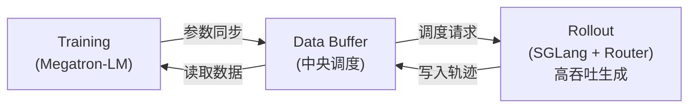

# Slime: 异步 RL Post-Training 框架

> THUDM (智谱 Seed 团队) | GitHub: https://github.com/THUDM/slime
> 定位: LLM post-training framework for RL Scaling
> 用于训练 GLM-4.5 → GLM-4.6 → GLM-4.7 → GLM-5

## 核心问题

传统 RL 训练 LLM 的痛点：**generation 阶段占 >90% 训练时间**，且存在 long-tail bottleneck — 少数慢/复杂 trajectory 拖住整个 batch。

同步 RL pipeline（如 OpenRLHF/veRL）的问题：
- 生成、评估、更新三阶段是 lockstep 的
- 一个慢 trajectory = 整个 batch 等待
- 对 Agent 任务（多步、长 horizon）问题更严重

## 架构设计

**三模块异步解耦架构：**

### 1. Training Module (Megatron-LM)
- 负责主训练循环
- 从 Data Buffer 读取数据
- 训练完成后同步参数到 Rollout 模块
- 支持 Megatron 全部参数（TP/PP/DP 并行策略）

### 2. Rollout Module (SGLang + Custom Router)
- 使用 SGLang 推理引擎做高吞吐数据生成
- Custom router 做请求分发
- 生成 trajectories + rewards/verifier 输出
- 结果写入 Data Buffer

### 3. Data Buffer (中央调度)
- 管理 prompt 初始化
- 存储 rollout 生成的数据
- 自定义数据生成接口
- **核心解耦点** — Training 和 Rollout 通过 Buffer 异步通信

## 关键创新: APRIL

**Active Partial Rollouts for Improved Learning**

解决 long-tail generation bottleneck 的系统级优化：
- 智能 over-provisioning requests — 多发请求，取先完成的
- Active management of partial completions — 不等最慢的
- 对 RL training 中 >90% 时间占比的 generation 阶段做针对性加速
- 使 trajectory 可以独立生成，打破 lockstep 约束

## 支持的模型

- **GLM 系列**: GLM-4.5, 4.6, 4.7, 5 (原生)
- **Qwen3 系列**: Qwen3Next, Qwen3MoE, Qwen3, Qwen2.5 系列
- **DeepSeek V3 系列**: V3, V3.1, R1
- **Llama 3**

## 支持的训练模式

- **SFT** — 监督微调
- **RL (GRPO/PPO 等)** — 强化学习 post-training
- **Agentic RL** — 多步 Agent 任务 RL（核心场景）
- 支持 adaptive verifiable environments
- 支持 multi-turn compilation feedback loops

## 基于 Slime 的项目

| 项目 | 方向 | 亮点 |
|------|------|------|
| **P1** | Physics Olympiad RL | 多阶段 RL + adaptive learnability adjustment |
| **RLVE** | Adaptive Verifiable Environments | 400 个可验证环境联合训练, 动态难度调整 |
| **TritonForge** | GPU Kernel Generation | SFT → RL 两阶段, multi-turn compilation feedback |
| **APRIL** | RL Training Acceleration | Active partial rollouts, 解决 >90% 时间瓶颈 |
| **qqr (hilichurl)** | Open-Ended Agents | ArenaRL + MCP, tournament-based ranking, 阿里 NLP |

## 与其他 RL 框架对比

| 维度 | Slime | OpenRLHF | veRL | TRL |
|------|-------|----------|------|-----|
| 训练引擎 | Megatron-LM | DeepSpeed | Megatron/FSDP | HuggingFace |
| 推理引擎 | SGLang (native) | vLLM | vLLM | - |
| 异步架构 | ✅ 核心特性 | ❌ 同步 | ❌ 同步 | ❌ |
| Agent RL | ✅ 专门优化 | 部分 | 部分 | ❌ |
| MoE 支持 | ✅ (GLM-5 744B) | ✅ | ✅ | 有限 |
| APRIL | ✅ | ❌ | ❌ | ❌ |
| 生产验证 | GLM-5 级别 | 多家公司 | 多家公司 | 研究为主 |

## 技术深度分析

### 为什么异步对 Agentic RL 特别重要

Agent 任务特性：
1. **长 horizon** — 单个 trajectory 可能涉及多轮 tool call / environment interaction
2. **方差大** — 有的 trajectory 3 步完成，有的要 30 步
3. **环境交互慢** — 不像 math 题可以快速验证，Agent 需要真实环境反馈

同步框架下，30 步的 trajectory 会阻塞所有 3 步 trajectory 的训练。Slime 的异步解耦让快的先训、慢的后补。

### 与 GLM-5 的配合

GLM-5 的 Agent 能力（SWE-bench 77.8、Vending Bench #1 开源）直接受益于 Slime 的：
- 高吞吐异步 rollout → 更多 Agent trajectory 探索
- APRIL → generation 瓶颈缩小 → 更快的 RL 迭代
- Multi-turn feedback → 代码编译、文档生成等多步反馈

### 局限与疑问

1. **开源程度** — 框架代码开源，但 GLM-5 具体 RL 训练 recipe (reward model, prompt distribution) 未公开
2. **硬件绑定** — GLM-5 在华为昇腾训练，Slime 的华为芯片适配程度不明确
3. **社区生态** — 相比 OpenRLHF/veRL，社区使用量尚小，但有阿里 NLP (qqr) 等外部项目

## 对老板的意义

1. **RL 框架选型** — 如果做 Agentic RL，Slime 的异步架构值得关注，尤其是长 horizon 任务
2. **APRIL 思路可借鉴** — active partial rollouts 的思想可以移植到其他框架
3. **SGLang-native** — 如果推理端用 SGLang，Slime 的集成最自然
4. **面试相关** — "如何解决 RL training 中 generation bottleneck" 是好问题，APRIL 是标准答案之一

## 相关笔记

- [[AI/LLM/Frameworks/OpenRLHF/OpenRLHF]] — 对比框架
- [[AI/LLM/Frameworks/verl/verl 概述]] — 对比框架
- [[AI/LLM/RL/GRPO/GRPO 深度理解|GRPO]] — Slime 支持的 RL 算法之一
- [[AI/Frontiers/2026年2月模型潮]] — GLM-5 所在的模型发布背景

---
*Created: 2026-02-16 | Source: GitHub README + VentureBeat + TechBuddies 交叉验证*
