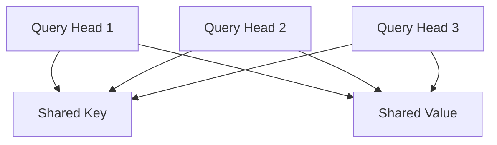

# KV Cache 原理与优化

## 基本原理

KV Cache 是大语言模型推理优化的核心技术，用于缓存 [[Transformer]] 架构中的 Key 和 Value 矩阵，避免重复计算。

### 为什么需要缓存 K/V

在 [[Attention 详解]] 机制中，每个时间步的计算公式为：

```
Attention(Q, K, V) = softmax(QK^T / √d_k)V
```

对于自回归生成，当前步的 Query 需要与所有历史 token 的 Key/Value 进行注意力计算。如果不缓存：

```python
# 低效版本：每次重新计算所有 K/V
def attention_without_cache(tokens, model):
    for i, token in enumerate(tokens):
        # 重新计算前 i 个 token 的 K/V - O(n²) 复杂度
        k_all = model.compute_k(tokens[:i+1])  
        v_all = model.compute_v(tokens[:i+1])
        q_current = model.compute_q(token)
        output = attention(q_current, k_all, v_all)
```

使用 KV Cache 后：

```python
# 高效版本：增量更新缓存
def attention_with_cache(token, kv_cache, model):
    k_new = model.compute_k(token)
    v_new = model.compute_v(token) 
    
    # 仅计算当前 token 的 K/V，追加到缓存
    kv_cache['k'].append(k_new)  # O(1) 复杂度
    kv_cache['v'].append(v_new)
    
    q_current = model.compute_q(token)
    return attention(q_current, kv_cache['k'], kv_cache['v'])
```

## 显存占用计算

KV Cache 的显存占用公式：

```
Memory_KV = 2 × batch_size × seq_len × num_layers × num_heads × head_dim × precision_bytes

其中：
- 2: K 和 V 两个矩阵
- precision_bytes: FP16=2, FP32=4, INT8=1
```

**具体案例 - LLaMA-2 7B：**

```python
# LLaMA-2 7B 参数
num_layers = 32
num_heads = 32  
head_dim = 128
precision = 2  # FP16

# 计算不同序列长度的显存占用
def calculate_kv_memory(batch_size, seq_len):
    memory_gb = (2 * batch_size * seq_len * num_layers * 
                 num_heads * head_dim * precision) / (1024**3)
    return memory_gb

# seq_len=2048, batch_size=1
print(f"2K序列: {calculate_kv_memory(1, 2048):.2f} GB")  # ~1.07 GB
print(f"4K序列: {calculate_kv_memory(1, 4096):.2f} GB")  # ~2.14 GB  
print(f"8K序列: {calculate_kv_memory(1, 8192):.2f} GB")  # ~4.29 GB
```

## 优化方法

### 1. Multi-Query Attention (MQA)

MQA 让所有头共享同一组 K/V，减少缓存大小：



显存减少：`1/num_heads` 倍

### 2. Grouped-Query Attention (GQA)

GQA 是 MQA 的改进版，将头分组共享 K/V：

```python
# GQA 实现示例
class GroupedQueryAttention:
    def __init__(self, num_q_heads, num_kv_heads, head_dim):
        self.num_q_heads = num_q_heads
        self.num_kv_heads = num_kv_heads
        self.group_size = num_q_heads // num_kv_heads
        
    def forward(self, q, k, v):
        # K/V 头数减少，但保持质量
        k_grouped = k.repeat_interleave(self.group_size, dim=1)
        v_grouped = v.repeat_interleave(self.group_size, dim=1)
        return attention(q, k_grouped, v_grouped)
```

### 3. PagedAttention

[[vLLM]] 采用的虚拟内存管理，将连续的 KV Cache 拆分为固定大小的块：

```python
class PagedKVCache:
    def __init__(self, block_size=16):
        self.block_size = block_size
        self.physical_blocks = []  # 实际存储
        self.page_table = {}       # 逻辑到物理的映射
        
    def allocate_sequence(self, seq_id, seq_len):
        # 按需分配物理块
        num_blocks = math.ceil(seq_len / self.block_size)
        allocated_blocks = self.get_free_blocks(num_blocks)
        self.page_table[seq_id] = allocated_blocks
```

优势：消除内存碎片，支持动态批处理

### 4. 量化 KV Cache

将 KV Cache 从 FP16 量化到 INT8/INT4：

```python
def quantize_kv_cache(k_cache, v_cache, bits=8):
    """KV Cache 量化"""
    if bits == 8:
        # INT8 量化
        k_scale = k_cache.abs().max() / 127
        v_scale = v_cache.abs().max() / 127
        k_int8 = torch.round(k_cache / k_scale).clamp(-128, 127).to(torch.int8)
        v_int8 = torch.round(v_cache / v_scale).clamp(-128, 127).to(torch.int8)
        return k_int8, v_int8, k_scale, v_scale
    
def dequantize_kv_cache(k_int8, v_int8, k_scale, v_scale):
    """反量化"""
    k_fp16 = k_int8.to(torch.float16) * k_scale
    v_fp16 = v_int8.to(torch.float16) * v_scale
    return k_fp16, v_fp16
```

### 5. Sliding Window Attention

保持固定窗口大小的 KV Cache，超出部分丢弃：

```python
class SlidingWindowKVCache:
    def __init__(self, window_size=2048):
        self.window_size = window_size
        self.k_cache = []
        self.v_cache = []
    
    def update(self, k_new, v_new):
        self.k_cache.append(k_new)
        self.v_cache.append(v_new)
        
        # 保持窗口大小
        if len(self.k_cache) > self.window_size:
            self.k_cache.pop(0)
            self.v_cache.pop(0)
```

## 实际应用

主流推理框架的 KV Cache 策略：

- **[[vLLM]]**: PagedAttention + GQA
- **TensorRT-LLM**: INT8 KV Cache + MQA 
- **TGI**: Continuous Batching + KV Cache 复用
- **llama.cpp**: GGUF 格式 + INT4 KV Cache

## 面试常见问题

### Q1: 为什么 KV Cache 能显著提升推理速度？
**A**: 自回归生成中，每个新 token 都需要与所有历史 token 做注意力计算。不用缓存需要重复计算历史 K/V 矩阵（O(n²)复杂度），使用缓存后只需计算当前 token（O(1)复杂度）。对长序列提速尤其明显。

### Q2: KV Cache 显存占用为什么这么大？
**A**: 以 7B 模型为例，4K 序列的 KV Cache 需要约 2GB 显存。原因：需要为每一层、每个注意力头、序列中每个位置存储 K 和 V 向量。公式：2 × seq_len × num_layers × num_heads × head_dim × precision_bytes。

### Q3: MQA 和 GQA 的区别是什么？
**A**: MQA（Multi-Query Attention）所有查询头共享一组 K/V，大幅减少缓存但可能影响质量。GQA（Grouped-Query Attention）是折中方案，将查询头分组，每组共享 K/V，既减少了缓存又保持了模型质量。

### Q4: PagedAttention 解决了什么问题？
**A**: 传统 KV Cache 需要预分配连续内存，导致内存碎片和浪费。PagedAttention 将连续的逻辑序列拆分为固定大小的块，按需分配物理内存，实现了类似操作系统虚拟内存的管理，提高了内存利用率。

### Q5: KV Cache 量化的挑战是什么？
**A**: 主要挑战是精度损失。K/V 矩阵的数值分布和重要性与权重不同，量化策略需要特别设计。通常需要 per-channel 或 per-group 量化，并可能需要混合精度（如关键位置保持 FP16）。