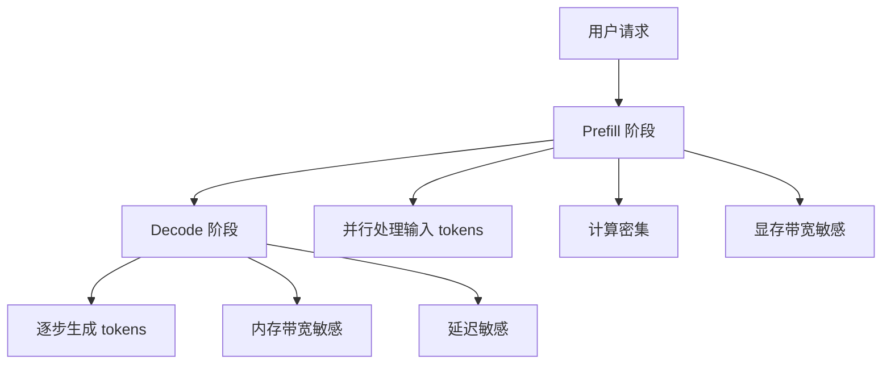

> [!info] 另有面试版
> Foundations 精简版：[[AI/Foundations/Inference/推理服务架构]]

# 推理服务架构

现代大语言模型推理服务面临高并发、低延迟、高吞吐的挑战，需要精心设计的架构来优化资源利用和用户体验。

## Continuous Batching 原理

传统静态批处理等待整个 batch 完成后才开始新请求，造成资源浪费。Continuous Batching 支持请求动态加入和离开。

### 传统 Static Batching 的问题

```python
# 静态批处理：所有请求必须同时开始和结束
class StaticBatching:
    def __init__(self, batch_size=8):
        self.batch_size = batch_size
        self.pending_requests = []
    
    def process_batch(self):
        if len(self.pending_requests) < self.batch_size:
            return  # 等待 batch 填满
        
        batch = self.pending_requests[:self.batch_size]
        self.pending_requests = self.pending_requests[self.batch_size:]
        
        # 所有请求必须生成到最长序列才能结束
        max_length = max(req.max_tokens for req in batch)
        for step in range(max_length):
            outputs = model.forward(batch)
            # 即使某些请求已完成，也必须继续计算
```

**问题：**
- 短请求被长请求阻塞，增加延迟
- GPU 利用率随请求完成逐渐下降
- 吞吐量受最长请求限制

### Continuous Batching 解决方案

```python
class ContinuousBatching:
    def __init__(self, max_batch_size=32):
        self.max_batch_size = max_batch_size
        self.active_requests = []
        self.pending_requests = []
    
    def iteration_step(self):
        # 1. 移除已完成的请求
        self.active_requests = [req for req in self.active_requests if not req.finished]
        
        # 2. 从等待队列中添加新请求
        while (len(self.active_requests) < self.max_batch_size and 
               self.pending_requests):
            new_req = self.pending_requests.pop(0)
            self.active_requests.append(new_req)
        
        # 3. 对当前活跃批次进行推理
        if self.active_requests:
            batch_tokens = [req.get_next_token_ids() for req in self.active_requests]
            outputs = model.forward(batch_tokens)
            
            # 4. 更新每个请求状态
            for req, output in zip(self.active_requests, outputs):
                req.add_generated_token(output)
                if req.should_stop():
                    req.finished = True
    
    def run_continuous(self):
        while self.active_requests or self.pending_requests:
            self.iteration_step()
            time.sleep(0.001)  # 避免忙等
```

**优势：**
- 请求动态加入/离开，提高 GPU 利用率
- 短请求无需等待长请求完成  
- 吞吐量显著提升（2-24x 根据请求长度分布）

## Prefill/Decode 分离架构

大语言模型推理分为两个阶段，计算特性完全不同：



### Disaggregated Inference 实现

```python
class DisaggregatedInference:
    def __init__(self):
        self.prefill_cluster = PrefillCluster()  # 高算力节点
        self.decode_cluster = DecodeCluster()    # 高内存带宽节点
        self.kv_cache_store = DistributedKVStore()
    
    async def process_request(self, request):
        # Prefill 阶段：并行处理输入序列
        prefill_result = await self.prefill_cluster.process(
            prompt=request.prompt,
            request_id=request.id
        )
        
        # 存储 KV Cache 到分布式存储
        await self.kv_cache_store.store(
            request.id, 
            prefill_result.kv_cache
        )
        
        # Decode 阶段：自回归生成
        decode_result = await self.decode_cluster.process(
            request_id=request.id,
            first_token=prefill_result.first_token,
            kv_cache_ref=prefill_result.kv_cache_ref
        )
        
        return decode_result

class PrefillCluster:
    """高计算集群：A100/H100 等高 FLOPS 设备"""
    def __init__(self):
        self.devices = ["A100-1", "A100-2", "H100-1"] 
    
    async def process(self, prompt, request_id):
        # 并行处理所有输入 tokens
        input_ids = tokenize(prompt)
        
        # 一次性计算所有位置的 attention
        with torch.no_grad():
            outputs = model(input_ids, use_cache=True)
            kv_cache = outputs.past_key_values
            logits = outputs.logits[-1]  # 最后一个位置的 logits
        
        first_token = sample_token(logits)
        
        return PrefillResult(
            first_token=first_token,
            kv_cache=kv_cache,
            kv_cache_ref=f"kv_{request_id}"
        )

class DecodeCluster:
    """高内存带宽集群：专为 decode 优化"""
    def __init__(self):
        self.devices = ["T4-1", "T4-2", "V100-1"]  # 内存带宽优化
    
    async def process(self, request_id, first_token, kv_cache_ref):
        # 加载 KV Cache
        kv_cache = await self.kv_cache_store.load(kv_cache_ref)
        
        generated_tokens = [first_token]
        current_token = first_token
        
        while not should_stop(current_token, generated_tokens):
            # 只计算当前 token 的 attention
            with torch.no_grad():
                outputs = model(
                    input_ids=current_token.unsqueeze(0),
                    past_key_values=kv_cache,
                    use_cache=True
                )
                
                kv_cache = outputs.past_key_values  # 更新 cache
                logits = outputs.logits[0, -1]      # 最新 token 的 logits
                
            current_token = sample_token(logits)
            generated_tokens.append(current_token)
        
        return generated_tokens
```

**优势：**
- 专用硬件：Prefill 用高算力，Decode 用高带宽
- 资源利用：不同阶段可独立扩容
- 延迟优化：Decode 集群专门优化单 token 延迟

## Chunked Prefill

当输入序列很长时，Prefill 阶段本身也需要优化：

```python
class ChunkedPrefill:
    def __init__(self, chunk_size=2048):
        self.chunk_size = chunk_size
    
    def prefill_long_sequence(self, input_ids):
        """分块处理长序列的 Prefill"""
        if len(input_ids) <= self.chunk_size:
            return self.standard_prefill(input_ids)
        
        # 分割成多个 chunk
        chunks = [input_ids[i:i+self.chunk_size] 
                  for i in range(0, len(input_ids), self.chunk_size)]
        
        kv_cache = None
        
        for i, chunk in enumerate(chunks):
            chunk_outputs = model(
                input_ids=chunk,
                past_key_values=kv_cache,
                use_cache=True
            )
            
            # 累积 KV Cache
            kv_cache = chunk_outputs.past_key_values
            
            # 在 chunk 间让出 GPU 给 decode 任务
            if i < len(chunks) - 1:
                await self.yield_to_decode_tasks()
        
        # 返回最终状态
        return PrefillResult(
            logits=chunk_outputs.logits[-1],  # 最后一个位置
            kv_cache=kv_cache
        )
    
    async def yield_to_decode_tasks(self):
        """在 chunk 间隙处理 decode 任务"""
        decode_tasks = self.get_pending_decode_tasks()
        for task in decode_tasks[:self.max_interleaved]:
            await task.process_one_step()
```

**优势：**
- 长序列 Prefill 与 Decode 交错执行
- 降低首 token 延迟（TTFT - Time To First Token）
- 更好的资源利用率

## 主流推理框架对比

### vLLM 架构

```python
# vLLM 核心特性
class vLLMEngine:
    def __init__(self):
        self.scheduler = ContinuousBatchingScheduler()
        self.model_executor = ModelExecutor()
        self.kv_cache_manager = PagedKVCacheManager()  # [[KV Cache]] PagedAttention
    
    def add_request(self, request):
        """添加新请求"""
        seq_group = SequenceGroup(request)
        self.scheduler.add_seq_group(seq_group)
    
    def step(self):
        """执行一步推理"""
        # 调度：决定哪些请求参与当前步骤
        scheduler_output = self.scheduler.schedule()
        
        # 执行：运行模型推理
        model_output = self.model_executor.execute_model(
            seq_group_metadata_list=scheduler_output.scheduled_seq_groups,
            blocks_to_swap_in=scheduler_output.blocks_to_swap_in,
            blocks_to_swap_out=scheduler_output.blocks_to_swap_out,
            blocks_to_copy=scheduler_output.blocks_to_copy,
        )
        
        # 更新：处理输出并更新状态
        self.scheduler.update_with_output(model_output)
```

**特点：**
- PagedAttention：虚拟内存管理 [[KV Cache]]
- Continuous Batching：动态批处理
- 高吞吐量优化

### TensorRT-LLM 架构

```python
# TensorRT-LLM 特性
class TensorRTLLMEngine:
    def __init__(self):
        self.engine = build_tensorrt_engine()  # 编译优化的引擎
        self.in_flight_batching = InflightBatching()  # 在途批处理
        self.kv_cache_pool = KVCachePool()
    
    def generate(self, requests):
        """TensorRT-LLM 生成"""
        # 构建批次
        batch = self.in_flight_batching.prepare_batch(requests)
        
        # TensorRT 推理
        with torch.cuda.stream(self.compute_stream):
            outputs = self.engine.run(
                input_ids=batch.input_ids,
                sequence_lengths=batch.sequence_lengths,
                kv_cache_blocks=batch.kv_cache_blocks
            )
        
        return self.process_outputs(outputs, batch)
```

**特点：**
- TensorRT 编译优化：kernel fusion, [[量化技术综述]] 支持
- In-flight Batching：类似 Continuous Batching
- CUDA 内核深度优化

### TGI (Text Generation Inference) 架构

```python
# TGI 核心架构
class TGIServer:
    def __init__(self):
        self.model = load_model_with_optimization()
        self.batch_manager = AdaptiveBatchManager()
        self.token_streamer = TokenStreamer()  # 流式返回
    
    async def generate_stream(self, request):
        """流式生成"""
        request_id = self.batch_manager.add_request(request)
        
        async for token in self.token_streamer.stream(request_id):
            yield ServerSentEvent(
                data=token,
                event="token"
            )
        
        yield ServerSentEvent(
            data="",
            event="done"
        )
```

**特点：**
- Rust 高性能后端
- 流式响应：实时返回 token
- Hugging Face 生态集成

## 性能对比

| 框架 | 吞吐量 | 延迟 | 内存效率 | 部署难度 |
|------|--------|------|----------|----------|
| [[vLLM]] | ⭐⭐⭐⭐⭐ | ⭐⭐⭐ | ⭐⭐⭐⭐⭐ | ⭐⭐⭐ |
| TensorRT-LLM | ⭐⭐⭐⭐ | ⭐⭐⭐⭐⭐ | ⭐⭐⭐⭐ | ⭐⭐ |
| TGI | ⭐⭐⭐ | ⭐⭐⭐⭐ | ⭐⭐⭐ | ⭐⭐⭐⭐ |

## 面试常见问题

### Q1: Continuous Batching 相比 Static Batching 有什么优势？
**A**: Static Batching 要求所有请求同时开始和结束，导致短请求被长请求阻塞，GPU 利用率随请求完成而下降。Continuous Batching 支持请求动态加入和离开，短请求可以提前完成，新请求可以即时加入，显著提升吞吐量（通常 2-24倍）和降低平均延迟。

### Q2: 为什么要将 Prefill 和 Decode 阶段分离？
**A**: Prefill 是计算密集型（并行处理所有输入tokens），适合高FLOPS设备；Decode 是内存带宽密集型（自回归生成），适合高带宽设备。分离后可以：1）专用硬件优化各阶段；2）独立扩容；3）Decode 集群专门优化单token延迟；4）更好的资源利用率。

### Q3: Chunked Prefill 解决了什么问题？
**A**: 长序列的 Prefill 会阻塞 Decode 任务，影响在线服务的延迟。Chunked Prefill 将长输入分块处理，在 chunk 间隙让出 GPU 给 Decode 任务，实现 Prefill 和 Decode 的交错执行，降低首token延迟（TTFT）并提升整体服务质量。

### Q4: vLLM 的 PagedAttention 有什么创新？
**A**: PagedAttention 将连续的 KV Cache 逻辑序列拆分为固定大小的物理块，实现了类似操作系统虚拟内存的管理。解决了传统 KV Cache 的内存碎片问题，支持动态内存分配，提高内存利用率，并支持高效的 Continuous Batching。

### Q5: 如何选择适合的推理框架？
**A**: 根据场景需求选择：1）vLLM：高吞吐量场景，内存受限环境；2）TensorRT-LLM：延迟敏感应用，有 NVIDIA GPU 和工程资源；3）TGI：快速原型和部署，需要流式响应，与 HuggingFace 生态集成。考虑因素包括硬件环境、性能要求、开发维护成本等。