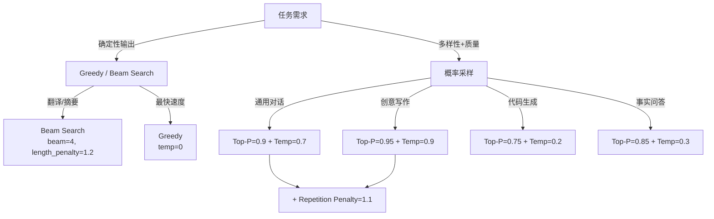

> [!info] 另有面试版
> Foundations 精简版：[[AI/Foundations/Inference/采样策略]]

# 采样策略

采样策略决定了语言模型如何从词汇表中选择下一个 token，直接影响生成文本的质量、多样性和连贯性。本文详细分析主流采样方法的原理、实现和应用场景。

## 基础采样方法

### Greedy Decoding
选择概率最高的 token，确定性但缺乏多样性：

```python
import torch
import torch.nn.functional as F

def greedy_decode(model, input_ids, max_length=50):
    """贪心解码实现"""
    model.eval()
    generated = input_ids.clone()
    
    with torch.no_grad():
        for _ in range(max_length):
            # 获取下一个 token 的概率分布
            outputs = model(generated)
            logits = outputs.logits[:, -1, :]  # [batch_size, vocab_size]
            
            # 选择概率最高的 token
            next_token = torch.argmax(logits, dim=-1, keepdim=True)
            
            # 拼接到生成序列
            generated = torch.cat([generated, next_token], dim=1)
            
            # 检查是否生成结束符
            if next_token.item() == model.config.eos_token_id:
                break
    
    return generated

# 使用示例
def compare_greedy_vs_sampling():
    """对比贪心解码和随机采样的结果"""
    prompt = "The future of artificial intelligence"
    input_ids = tokenizer.encode(prompt, return_tensors='pt')
    
    # 贪心解码（重复运行结果相同）
    for i in range(3):
        greedy_output = greedy_decode(model, input_ids, max_length=20)
        greedy_text = tokenizer.decode(greedy_output[0], skip_special_tokens=True)
        print(f"Greedy {i+1}: {greedy_text}")
    
    # 随机采样（每次结果不同）
    for i in range(3):
        sampling_output = model.generate(
            input_ids, 
            max_length=input_ids.shape[1] + 20,
            do_sample=True,
            temperature=1.0,
            pad_token_id=tokenizer.eos_token_id
        )
        sampling_text = tokenizer.decode(sampling_output[0], skip_special_tokens=True)
        print(f"Sampling {i+1}: {sampling_text}")
```

### Beam Search
维护多个候选序列，平衡质量和多样性：

```python
class BeamSearchDecoder:
    def __init__(self, model, tokenizer, beam_size=4, length_penalty=1.0):
        self.model = model
        self.tokenizer = tokenizer
        self.beam_size = beam_size
        self.length_penalty = length_penalty
    
    def beam_search(self, input_ids, max_length=50, early_stopping=True):
        """Beam Search 解码实现"""
        batch_size = input_ids.shape[0]
        vocab_size = self.model.config.vocab_size
        
        # 初始化 beams: [batch_size * beam_size, seq_len]
        beams = input_ids.repeat(self.beam_size, 1)
        beam_scores = torch.zeros(batch_size * self.beam_size, device=input_ids.device)
        beam_lens = torch.full((batch_size * self.beam_size,), input_ids.shape[1], 
                              dtype=torch.long, device=input_ids.device)
        
        # 完成的序列
        completed_sequences = []
        completed_scores = []
        
        for step in range(max_length):
            # 获取当前 beams 的概率分布
            with torch.no_grad():
                outputs = self.model(beams)
                logits = outputs.logits[:, -1, :]  # [batch_size * beam_size, vocab_size]
            
            # 计算累积分数
            log_probs = F.log_softmax(logits, dim=-1)  # [batch_size * beam_size, vocab_size]
            
            # 对于第一步，只从第一个 beam 扩展
            if step == 0:
                next_scores = log_probs[0].flatten()  # [vocab_size]
            else:
                # 累积分数：当前分数 + 新 token 分数
                next_scores = beam_scores.unsqueeze(1) + log_probs  # [batch_size * beam_size, vocab_size]
                next_scores = next_scores.flatten()  # [batch_size * beam_size * vocab_size]
            
            # 选择 top beam_size 个候选
            top_scores, top_indices = torch.topk(next_scores, self.beam_size, sorted=True)
            
            # 确定新的 beams 和 tokens
            beam_indices = top_indices // vocab_size  # 来自哪个 beam
            token_indices = top_indices % vocab_size  # 选择的 token
            
            # 更新 beams
            new_beams = beams[beam_indices]
            new_beams = torch.cat([new_beams, token_indices.unsqueeze(1)], dim=1)
            
            # 检查完成的序列
            eos_mask = (token_indices == self.tokenizer.eos_token_id)
            
            if eos_mask.any() and early_stopping:
                # 计算长度惩罚
                completed_lens = beam_lens[beam_indices[eos_mask]] + 1
                length_penalties = ((5 + completed_lens) / 6) ** self.length_penalty
                final_scores = top_scores[eos_mask] / length_penalties
                
                completed_sequences.extend(new_beams[eos_mask].tolist())
                completed_scores.extend(final_scores.tolist())
            
            # 保留未完成的 beams
            continuing_mask = ~eos_mask
            beams = new_beams[continuing_mask]
            beam_scores = top_scores[continuing_mask]
            beam_lens[continuing_mask] += 1
            
            # 如果所有序列都完成了
            if beams.shape[0] == 0:
                break
        
        # 如果还有未完成的序列，也添加到完成列表
        if beams.shape[0] > 0:
            remaining_lens = beam_lens[:beams.shape[0]]
            length_penalties = ((5 + remaining_lens) / 6) ** self.length_penalty
            final_scores = beam_scores / length_penalties
            
            completed_sequences.extend(beams.tolist())
            completed_scores.extend(final_scores.tolist())
        
        # 按分数排序并返回最佳结果
        if completed_sequences:
            best_idx = max(range(len(completed_scores)), key=lambda i: completed_scores[i])
            return torch.tensor([completed_sequences[best_idx]], device=input_ids.device)
        else:
            return beams[:1]  # 返回第一个未完成的序列
    
    def diverse_beam_search(self, input_ids, num_groups=2, diversity_penalty=0.5):
        """多样化 Beam Search，生成多样化的结果"""
        group_size = self.beam_size // num_groups
        all_groups_sequences = []
        
        for group_id in range(num_groups):
            # 为每个组运行独立的 beam search
            group_beams = self.beam_search(input_ids, max_length=50)
            
            # 应用多样性惩罚（避免与之前组相似）
            if group_id > 0:
                # 计算与已生成序列的相似性，并惩罚相似的候选
                pass  # 简化实现，实际中需要计算 n-gram 重复等指标
            
            all_groups_sequences.append(group_beams)
        
        return all_groups_sequences

# 使用示例
def demonstrate_beam_search():
    """演示 Beam Search 的效果"""
    prompt = "The key to successful machine learning is"
    input_ids = tokenizer.encode(prompt, return_tensors='pt')
    
    decoder = BeamSearchDecoder(model, tokenizer, beam_size=4)
    
    # 标准 beam search
    result = decoder.beam_search(input_ids, max_length=30)
    text = tokenizer.decode(result[0], skip_special_tokens=True)
    print(f"Beam Search: {text}")
    
    # 多样化 beam search
    diverse_results = decoder.diverse_beam_search(input_ids, num_groups=2)
    for i, result in enumerate(diverse_results):
        text = tokenizer.decode(result[0], skip_special_tokens=True)
        print(f"Diverse Group {i+1}: {text}")
```

## 温度和概率采样

### Temperature Scaling

> 来源：标准 softmax temperature 技术，在 GPT-2（Radford et al., 2019）中广泛采用

控制生成的随机性：

```python
def temperature_sampling(logits, temperature=1.0):
    """温度采样实现"""
    if temperature == 0:
        # temperature=0 等价于贪心解码
        return torch.argmax(logits, dim=-1)
    
    # 应用温度缩放
    scaled_logits = logits / temperature
    
    # 计算概率分布
    probabilities = F.softmax(scaled_logits, dim=-1)
    
    # 从分布中采样
    next_token = torch.multinomial(probabilities, num_samples=1)
    
    return next_token.squeeze(-1)

def analyze_temperature_effects():
    """分析不同温度值的效果"""
    prompt = "Today is a beautiful day because"
    input_ids = tokenizer.encode(prompt, return_tensors='pt')
    
    temperatures = [0.1, 0.7, 1.0, 1.5, 2.0]
    
    for temp in temperatures:
        print(f"\n=== Temperature: {temp} ===")
        
        # 生成多个样本观察多样性
        for i in range(3):
            generated = model.generate(
                input_ids,
                max_length=input_ids.shape[1] + 15,
                do_sample=True,
                temperature=temp,
                pad_token_id=tokenizer.eos_token_id
            )
            
            text = tokenizer.decode(generated[0], skip_special_tokens=True)
            continuation = text[len(prompt):].strip()
            print(f"  Sample {i+1}: {continuation}")

# 动态温度调整
class DynamicTemperatureDecoder:
    """动态调整温度的解码器"""
    
    def __init__(self, model, tokenizer, initial_temp=1.0):
        self.model = model
        self.tokenizer = tokenizer
        self.initial_temp = initial_temp
        
    def adaptive_temperature(self, step, total_steps, confidence_score=None):
        """根据生成步骤和置信度动态调整温度"""
        # 策略1：随着生成进行逐渐降低温度（增加确定性）
        progress = step / total_steps
        base_temp = self.initial_temp * (1 - 0.5 * progress)
        
        # 策略2：根据模型置信度调整
        if confidence_score is not None:
            # 置信度高时降低温度，置信度低时提高温度
            confidence_factor = 1.0 + (1.0 - confidence_score) * 0.5
            base_temp *= confidence_factor
        
        return max(0.1, min(2.0, base_temp))  # 限制在合理范围内
    
    def generate_with_dynamic_temp(self, input_ids, max_length=50):
        """使用动态温度生成文本"""
        generated = input_ids.clone()
        
        for step in range(max_length):
            with torch.no_grad():
                outputs = self.model(generated)
                logits = outputs.logits[:, -1, :]
                
                # 计算置信度（最大概率值）
                probs = F.softmax(logits, dim=-1)
                confidence = torch.max(probs, dim=-1)[0].item()
                
                # 动态调整温度
                current_temp = self.adaptive_temperature(step, max_length, confidence)
                
                # 采样下一个 token
                next_token = temperature_sampling(logits, current_temp)
                generated = torch.cat([generated, next_token.unsqueeze(0)], dim=1)
                
                if next_token.item() == self.tokenizer.eos_token_id:
                    break
        
        return generated
```

### Top-K Sampling

> 来源：Fan et al., "Hierarchical Neural Story Generation", arXiv:1805.04833

限制候选 token 数量：

```python
def top_k_sampling(logits, k=50, temperature=1.0):
    """Top-K 采样实现"""
    if k <= 0:
        # k=0 表示不限制，使用所有 tokens
        return temperature_sampling(logits, temperature)
    
    # 找到 top-k 个最高概率的 tokens
    top_k_logits, top_k_indices = torch.topk(logits, k, dim=-1)
    
    # 对 top-k logits 应用温度并采样
    if temperature != 1.0:
        top_k_logits = top_k_logits / temperature
    
    # 计算 top-k 的概率分布
    top_k_probs = F.softmax(top_k_logits, dim=-1)
    
    # 从 top-k 中采样
    sampled_index = torch.multinomial(top_k_probs, num_samples=1)
    
    # 映射回原始 token indices
    next_token = top_k_indices.gather(-1, sampled_index)
    
    return next_token.squeeze(-1)

def compare_k_values():
    """对比不同 k 值的效果"""
    prompt = "The most important aspect of deep learning is"
    input_ids = tokenizer.encode(prompt, return_tensors='pt')
    
    k_values = [1, 5, 20, 50, 0]  # 0 表示无限制
    
    for k in k_values:
        print(f"\n=== Top-K = {k if k > 0 else 'Unlimited'} ===")
        
        for i in range(3):
            generated = model.generate(
                input_ids,
                max_length=input_ids.shape[1] + 20,
                do_sample=True,
                top_k=k if k > 0 else None,
                temperature=0.8,
                pad_token_id=tokenizer.eos_token_id
            )
            
            text = tokenizer.decode(generated[0], skip_special_tokens=True)
            continuation = text[len(prompt):].strip()
            print(f"  Sample {i+1}: {continuation}")
```

### Top-P (Nucleus) Sampling

> 来源：Holtzman et al., "The Curious Case of Neural Text Degeneration", arXiv:1904.09751

动态调整候选集大小：

```python
def top_p_sampling(logits, p=0.9, temperature=1.0):
    """Top-P (Nucleus) 采样实现"""
    if p >= 1.0:
        return temperature_sampling(logits, temperature)
    
    # 应用温度
    if temperature != 1.0:
        logits = logits / temperature
    
    # 计算概率并排序
    probs = F.softmax(logits, dim=-1)
    sorted_probs, sorted_indices = torch.sort(probs, descending=True, dim=-1)
    
    # 计算累积概率
    cumulative_probs = torch.cumsum(sorted_probs, dim=-1)
    
    # 找到累积概率超过 p 的位置
    sorted_indices_to_remove = cumulative_probs > p
    
    # 保持至少一个 token（即使第一个 token 的概率就超过了 p）
    sorted_indices_to_remove[..., 1:] = sorted_indices_to_remove[..., :-1].clone()
    sorted_indices_to_remove[..., 0] = 0
    
    # 将要移除的 tokens 的概率设为 0
    sorted_probs[sorted_indices_to_remove] = 0.0
    
    # 重新归一化
    sorted_probs = sorted_probs / sorted_probs.sum(dim=-1, keepdim=True)
    
    # 从过滤后的分布中采样
    sampled_sorted_index = torch.multinomial(sorted_probs, num_samples=1)
    
    # 映射回原始索引
    next_token = sorted_indices.gather(-1, sampled_sorted_index)
    
    return next_token.squeeze(-1)

class AdaptiveTopPSampler:
    """自适应 Top-P 采样器"""
    
    def __init__(self, min_p=0.7, max_p=0.95):
        self.min_p = min_p
        self.max_p = max_p
    
    def adaptive_p_value(self, logits, base_p=0.9):
        """根据概率分布的熵动态调整 p 值"""
        probs = F.softmax(logits, dim=-1)
        
        # 计算分布的熵
        entropy = -torch.sum(probs * torch.log(probs + 1e-10), dim=-1)
        max_entropy = torch.log(torch.tensor(probs.shape[-1], dtype=torch.float))
        
        # 标准化熵 (0-1 范围)
        normalized_entropy = entropy / max_entropy
        
        # 熵高时增加 p (更多多样性)，熵低时减少 p (更保守)
        adaptive_p = base_p + (normalized_entropy - 0.5) * 0.2
        adaptive_p = torch.clamp(adaptive_p, self.min_p, self.max_p)
        
        return adaptive_p.item()
    
    def sample(self, logits, base_p=0.9, temperature=1.0):
        """使用自适应 p 值进行采样"""
        adaptive_p = self.adaptive_p_value(logits, base_p)
        return top_p_sampling(logits, adaptive_p, temperature)

def demonstrate_top_p_effects():
    """演示 Top-P 采样的效果"""
    prompt = "In the near future, artificial intelligence will"
    input_ids = tokenizer.encode(prompt, return_tensors='pt')
    
    p_values = [0.5, 0.7, 0.9, 0.95, 0.99]
    
    for p in p_values:
        print(f"\n=== Top-P = {p} ===")
        
        for i in range(3):
            generated = model.generate(
                input_ids,
                max_length=input_ids.shape[1] + 25,
                do_sample=True,
                top_p=p,
                temperature=0.8,
                pad_token_id=tokenizer.eos_token_id
            )
            
            text = tokenizer.decode(generated[0], skip_special_tokens=True)
            continuation = text[len(prompt):].strip()
            print(f"  Sample {i+1}: {continuation}")
```

## 高级采样技术

### Min-P Sampling（新方法）
基于相对概率阈值的采样：

```python
def min_p_sampling(logits, min_p=0.05, temperature=1.0):
    """
    Min-P 采样：保留概率大于最大概率 * min_p 的 tokens
    相比 Top-P 更稳定，不会因为分布平坦而包含过多低质量 tokens
    """
    if temperature != 1.0:
        logits = logits / temperature
    
    # 计算概率
    probs = F.softmax(logits, dim=-1)
    
    # 找到最大概率
    max_prob = torch.max(probs, dim=-1, keepdim=True)[0]
    
    # 计算阈值
    threshold = max_prob * min_p
    
    # 过滤低于阈值的 tokens
    filtered_probs = torch.where(probs >= threshold, probs, 0.0)
    
    # 重新归一化
    filtered_probs = filtered_probs / filtered_probs.sum(dim=-1, keepdim=True)
    
    # 采样
    next_token = torch.multinomial(filtered_probs, num_samples=1)
    
    return next_token.squeeze(-1)

def compare_p_methods():
    """对比 Top-P 和 Min-P 的差异"""
    prompt = "The breakthrough in quantum computing"
    input_ids = tokenizer.encode(prompt, return_tensors='pt')
    
    print("=== Top-P vs Min-P 对比 ===")
    
    # Top-P 采样
    print("\nTop-P (p=0.9):")
    for i in range(3):
        generated = model.generate(
            input_ids,
            max_length=input_ids.shape[1] + 20,
            do_sample=True,
            top_p=0.9,
            temperature=0.8,
            pad_token_id=tokenizer.eos_token_id
        )
        text = tokenizer.decode(generated[0], skip_special_tokens=True)
        print(f"  Sample {i+1}: {text[len(prompt):].strip()}")
    
    # Min-P 采样（需要自定义实现）
    print("\nMin-P (min_p=0.05):")
    # 注意：这需要自定义解码循环，因为 transformers 库可能不支持 min-p
    for i in range(3):
        generated = input_ids.clone()
        for _ in range(20):
            with torch.no_grad():
                outputs = model(generated)
                logits = outputs.logits[:, -1, :]
                next_token = min_p_sampling(logits, min_p=0.05, temperature=0.8)
                generated = torch.cat([generated, next_token.unsqueeze(0)], dim=1)
                if next_token.item() == tokenizer.eos_token_id:
                    break
        
        text = tokenizer.decode(generated[0], skip_special_tokens=True)
        print(f"  Sample {i+1}: {text[len(prompt):].strip()}")
```

### Typical Sampling

> 来源：Meister et al., "Typical Decoding for Natural Language Generation", arXiv:2202.00666

基于条件熵的采样：

```python
def typical_sampling(logits, tau=0.95, temperature=1.0):
    """
    Typical Sampling：选择信息量接近期望的 tokens
    基于论文 "Typical Sampling for Natural Language Generation"
    """
    if temperature != 1.0:
        logits = logits / temperature
    
    # 计算概率
    probs = F.softmax(logits, dim=-1)
    
    # 计算每个 token 的信息量 (-log p)
    info = -torch.log(probs + 1e-10)
    
    # 计算期望信息量（分布的熵）
    expected_info = torch.sum(probs * info, dim=-1, keepdim=True)
    
    # 计算每个 token 信息量与期望的差异
    info_diff = torch.abs(info - expected_info)
    
    # 保留信息量接近期望的 tokens（差异小于阈值）
    percentile_threshold = torch.quantile(info_diff, tau, dim=-1, keepdim=True)
    typical_mask = info_diff <= percentile_threshold
    
    # 过滤概率
    filtered_probs = torch.where(typical_mask, probs, 0.0)
    filtered_probs = filtered_probs / filtered_probs.sum(dim=-1, keepdim=True)
    
    # 采样
    next_token = torch.multinomial(filtered_probs, num_samples=1)
    
    return next_token.squeeze(-1)

def analyze_typical_sampling():
    """分析 Typical Sampling 的特性"""
    # 创建一个已知分布的例子
    vocab_size = 1000
    
    # 模拟不同类型的概率分布
    distributions = {
        'uniform': torch.ones(vocab_size) / vocab_size,
        'peaked': F.softmax(torch.randn(vocab_size) * 3, dim=0),  # 尖锐分布
        'flat': F.softmax(torch.randn(vocab_size) * 0.5, dim=0)   # 平坦分布
    }
    
    for dist_name, probs in distributions.items():
        logits = torch.log(probs + 1e-10)
        
        print(f"\n=== {dist_name.capitalize()} Distribution ===")
        
        # 计算分布的熵
        entropy = -torch.sum(probs * torch.log(probs + 1e-10))
        print(f"Entropy: {entropy:.4f}")
        
        # 分析不同方法选择的 tokens 数量
        methods = {
            'Top-50': lambda x: torch.topk(x, 50)[1].shape[0],
            'Top-P 0.9': lambda x: (torch.cumsum(torch.sort(F.softmax(x, dim=0), descending=True)[0], dim=0) <= 0.9).sum().item(),
            'Min-P 0.05': lambda x: (F.softmax(x, dim=0) >= F.softmax(x, dim=0).max() * 0.05).sum().item(),
            'Typical 0.95': lambda x: len(get_typical_tokens(x, 0.95))
        }
        
        for method_name, method_func in methods.items():
            try:
                count = method_func(logits)
                print(f"{method_name}: {count} tokens selected")
            except:
                print(f"{method_name}: calculation failed")

def get_typical_tokens(logits, tau=0.95):
    """获取 typical sampling 选择的 tokens（用于分析）"""
    probs = F.softmax(logits, dim=-1)
    info = -torch.log(probs + 1e-10)
    expected_info = torch.sum(probs * info, dim=-1, keepdim=True)
    info_diff = torch.abs(info - expected_info)
    percentile_threshold = torch.quantile(info_diff, tau, dim=-1, keepdim=True)
    return torch.where(info_diff <= percentile_threshold)[0]
```

### Mirostat Sampling

> 来源：Basu et al., "Mirostat: A Neural Text Decoding Algorithm that Directly Controls Perplexity", ICLR 2021

动态调整采样以维持目标困惑度：

```python
class MirostatSampler:
    """
    Mirostat 采样器：通过动态调整 tau 维持目标困惑度
    基于论文 "Mirostat: A Neural Text Decoding Algorithm that Directly Controls Perplexity"
    """
    
    def __init__(self, target_surprise=5.0, learning_rate=0.1, initial_tau=10.0):
        self.target_surprise = target_surprise  # 目标惊异度（接近目标困惑度）
        self.learning_rate = learning_rate
        self.tau = initial_tau  # 当前截断阈值
        
    def mirostat_v1(self, logits, temperature=1.0):
        """Mirostat v1: 基于排序后的概率进行截断"""
        if temperature != 1.0:
            logits = logits / temperature
        
        probs = F.softmax(logits, dim=-1)
        sorted_probs, sorted_indices = torch.sort(probs, descending=True)
        
        # 计算累积概率
        cumsum_probs = torch.cumsum(sorted_probs, dim=-1)
        
        # 找到截断点：累积概率达到 (1 - 1/tau)
        cutoff = 1.0 - 1.0 / self.tau
        cutoff_idx = torch.searchsorted(cumsum_probs, cutoff)
        cutoff_idx = max(1, cutoff_idx.item())  # 至少保留一个 token
        
        # 截断并重新归一化
        truncated_probs = sorted_probs[:cutoff_idx]
        truncated_probs = truncated_probs / truncated_probs.sum()
        
        # 采样
        sampled_idx = torch.multinomial(truncated_probs, num_samples=1)
        selected_token = sorted_indices[sampled_idx]
        
        # 计算选中 token 的惊异度
        selected_prob = sorted_probs[sampled_idx]
        surprise = -torch.log2(selected_prob).item()
        
        # 更新 tau
        error = surprise - self.target_surprise
        self.tau = self.tau - self.learning_rate * error
        self.tau = max(1.0, self.tau)  # tau 不能小于 1
        
        return selected_token, surprise
    
    def mirostat_v2(self, logits, temperature=1.0):
        """Mirostat v2: 直接基于概率阈值"""
        if temperature != 1.0:
            logits = logits / temperature
        
        probs = F.softmax(logits, dim=-1)
        
        # 计算阈值：概率必须大于 1/tau
        threshold = 1.0 / self.tau
        
        # 过滤低概率 tokens
        filtered_probs = torch.where(probs >= threshold, probs, 0.0)
        
        # 如果没有 token 满足条件，选择概率最高的
        if filtered_probs.sum() == 0:
            filtered_probs = torch.zeros_like(probs)
            max_idx = torch.argmax(probs)
            filtered_probs[max_idx] = 1.0
        else:
            filtered_probs = filtered_probs / filtered_probs.sum()
        
        # 采样
        selected_token = torch.multinomial(filtered_probs, num_samples=1)
        
        # 计算惊异度
        selected_prob = probs[selected_token]
        surprise = -torch.log2(selected_prob).item()
        
        # 更新 tau
        error = surprise - self.target_surprise
        self.tau = self.tau - self.learning_rate * error
        self.tau = max(1.0, self.tau)
        
        return selected_token, surprise

def demonstrate_mirostat():
    """演示 Mirostat 采样的效果"""
    prompt = "The evolution of machine learning has led to"
    input_ids = tokenizer.encode(prompt, return_tensors='pt')
    
    # 创建 Mirostat 采样器
    sampler = MirostatSampler(target_surprise=3.0)  # 目标困惑度约为 8
    
    print("=== Mirostat Sampling ===")
    
    # 生成文本并监控困惑度
    generated = input_ids.clone()
    surprises = []
    taus = []
    
    for step in range(30):
        with torch.no_grad():
            outputs = model(generated)
            logits = outputs.logits[:, -1, :]
            
            next_token, surprise = sampler.mirostat_v2(logits, temperature=0.8)
            generated = torch.cat([generated, next_token], dim=1)
            
            surprises.append(surprise)
            taus.append(sampler.tau)
            
            if next_token.item() == tokenizer.eos_token_id:
                break
    
    # 显示结果
    text = tokenizer.decode(generated[0], skip_special_tokens=True)
    print(f"Generated: {text}")
    print(f"Average surprise: {np.mean(surprises):.2f}")
    print(f"Final tau: {sampler.tau:.2f}")
    
    # 绘制惊异度变化
    import matplotlib.pyplot as plt
    
    plt.figure(figsize=(12, 4))
    
    plt.subplot(1, 2, 1)
    plt.plot(surprises, label='Actual Surprise')
    plt.axhline(y=sampler.target_surprise, color='r', linestyle='--', label='Target Surprise')
    plt.xlabel('Generation Step')
    plt.ylabel('Surprise')
    plt.legend()
    plt.title('Surprise Control')
    
    plt.subplot(1, 2, 2)
    plt.plot(taus)
    plt.xlabel('Generation Step')
    plt.ylabel('Tau Value')
    plt.title('Tau Adaptation')
    
    plt.tight_layout()
    plt.show()
```

## 重复惩罚机制

### Repetition Penalty
避免生成重复内容：

```python
def apply_repetition_penalty(logits, input_ids, penalty=1.2):
    """
    应用重复惩罚：降低已出现 tokens 的概率
    penalty > 1.0 表示惩罚，< 1.0 表示鼓励
    """
    # 获取已出现的 tokens
    unique_tokens = torch.unique(input_ids)
    
    # 对已出现的 tokens 应用惩罚
    for token in unique_tokens:
        if logits[token] > 0:
            logits[token] = logits[token] / penalty
        else:
            logits[token] = logits[token] * penalty
    
    return logits

def apply_frequency_penalty(logits, input_ids, penalty=0.1):
    """
    频率惩罚：根据 token 出现频率进行惩罚
    """
    # 计算每个 token 的出现次数
    token_counts = torch.bincount(input_ids.flatten(), minlength=logits.shape[-1])
    
    # 应用频率惩罚
    frequency_penalties = token_counts.float() * penalty
    adjusted_logits = logits - frequency_penalties
    
    return adjusted_logits

def apply_presence_penalty(logits, input_ids, penalty=0.5):
    """
    存在惩罚：对任何已出现过的 token 应用固定惩罚
    """
    # 创建存在掩码
    presence_mask = torch.zeros_like(logits, dtype=torch.bool)
    unique_tokens = torch.unique(input_ids)
    presence_mask[unique_tokens] = True
    
    # 应用存在惩罚
    adjusted_logits = logits.clone()
    adjusted_logits[presence_mask] -= penalty
    
    return adjusted_logits

class AdaptiveRepetitionController:
    """自适应重复控制器"""
    
    def __init__(self, base_penalty=1.2, max_penalty=2.0, window_size=50):
        self.base_penalty = base_penalty
        self.max_penalty = max_penalty
        self.window_size = window_size
    
    def calculate_repetition_score(self, input_ids):
        """计算序列的重复程度"""
        sequence = input_ids.flatten()
        
        if len(sequence) < 4:
            return 0.0
        
        # 计算 n-gram 重复
        repetition_scores = []
        
        for n in range(2, min(6, len(sequence)//2 + 1)):  # 2-gram 到 5-gram
            ngrams = []
            for i in range(len(sequence) - n + 1):
                ngrams.append(tuple(sequence[i:i+n].tolist()))
            
            # 计算重复率
            total_ngrams = len(ngrams)
            unique_ngrams = len(set(ngrams))
            repetition_rate = 1.0 - (unique_ngrams / total_ngrams) if total_ngrams > 0 else 0.0
            repetition_scores.append(repetition_rate)
        
        return np.mean(repetition_scores) if repetition_scores else 0.0
    
    def adaptive_penalty(self, input_ids):
        """根据当前重复程度自适应调整惩罚强度"""
        # 只考虑最近的一定长度内容
        recent_ids = input_ids[:, -self.window_size:] if input_ids.shape[1] > self.window_size else input_ids
        
        repetition_score = self.calculate_repetition_score(recent_ids)
        
        # 根据重复程度调整惩罚
        adaptive_strength = self.base_penalty + (self.max_penalty - self.base_penalty) * repetition_score
        
        return min(adaptive_strength, self.max_penalty)

def demonstrate_repetition_control():
    """演示重复控制的效果"""
    prompt = "The importance of education cannot be overstated. Education is"
    input_ids = tokenizer.encode(prompt, return_tensors='pt')
    
    # 不同重复控制策略的对比
    strategies = [
        ("No Control", {}),
        ("Repetition Penalty", {"repetition_penalty": 1.2}),
        ("Frequency + Presence", {"frequency_penalty": 0.1, "presence_penalty": 0.5}),
    ]
    
    for strategy_name, params in strategies:
        print(f"\n=== {strategy_name} ===")
        
        generated = model.generate(
            input_ids,
            max_length=input_ids.shape[1] + 30,
            do_sample=True,
            temperature=0.8,
            top_p=0.9,
            pad_token_id=tokenizer.eos_token_id,
            **params
        )
        
        text = tokenizer.decode(generated[0], skip_special_tokens=True)
        print(f"Result: {text}")
        
        # 分析重复程度
        controller = AdaptiveRepetitionController()
        repetition_score = controller.calculate_repetition_score(generated)
        print(f"Repetition Score: {repetition_score:.3f}")
```

## 不同任务的采样参数推荐

### 任务导向的采样配置

```python
class TaskSpecificSampler:
    """针对不同任务的采样配置"""
    
    @staticmethod
    def get_config(task_type, quality_priority="balanced"):
        """
        根据任务类型和质量优先级返回采样配置
        
        Args:
            task_type: 'creative', 'factual', 'code', 'chat', 'translation'
            quality_priority: 'speed', 'quality', 'creativity', 'balanced'
        """
        
        base_configs = {
            'creative': {
                'do_sample': True,
                'temperature': 0.8,
                'top_p': 0.9,
                'top_k': None,
                'repetition_penalty': 1.1,
                'length_penalty': 1.0,
                'typical_p': 0.95
            },
            'factual': {
                'do_sample': True,
                'temperature': 0.3,
                'top_p': 0.85,
                'top_k': 40,
                'repetition_penalty': 1.15,
                'length_penalty': 1.1,
                'num_beams': 2
            },
            'code': {
                'do_sample': True,
                'temperature': 0.2,
                'top_p': 0.75,
                'top_k': 20,
                'repetition_penalty': 1.05,
                'length_penalty': 1.0,
                'typical_p': 0.9
            },
            'chat': {
                'do_sample': True,
                'temperature': 0.7,
                'top_p': 0.9,
                'top_k': None,
                'repetition_penalty': 1.1,
                'frequency_penalty': 0.05,
                'presence_penalty': 0.1
            },
            'translation': {
                'do_sample': False,
                'num_beams': 4,
                'length_penalty': 1.2,
                'early_stopping': True,
                'repetition_penalty': 1.0
            }
        }
        
        config = base_configs.get(task_type, base_configs['factual']).copy()
        
        # 根据质量优先级调整
        if quality_priority == "speed":
            config.update({
                'do_sample': False,
                'num_beams': 1,
                'temperature': None,
                'top_p': None
            })
        elif quality_priority == "quality":
            config.update({
                'num_beams': max(config.get('num_beams', 1), 4),
                'temperature': config.get('temperature', 0.7) * 0.8,
                'length_penalty': 1.2
            })
        elif quality_priority == "creativity":
            config.update({
                'temperature': min(config.get('temperature', 0.7) * 1.3, 2.0),
                'top_p': min(config.get('top_p', 0.9) + 0.05, 0.99),
                'typical_p': 0.98
            })
        
        return config
    
    @staticmethod
    def generate_with_task_config(model, tokenizer, prompt, task_type, 
                                max_length=100, quality_priority="balanced"):
        """使用任务特定配置生成文本"""
        input_ids = tokenizer.encode(prompt, return_tensors='pt')
        config = TaskSpecificSampler.get_config(task_type, quality_priority)
        
        # 添加通用参数
        config.update({
            'max_length': input_ids.shape[1] + max_length,
            'pad_token_id': tokenizer.eos_token_id,
            'eos_token_id': tokenizer.eos_token_id
        })
        
        # 生成文本
        with torch.no_grad():
            output = model.generate(input_ids, **config)
        
        generated_text = tokenizer.decode(output[0], skip_special_tokens=True)
        return generated_text[len(prompt):].strip()

# 实际应用示例
def demonstrate_task_specific_sampling():
    """演示针对不同任务的采样效果"""
    
    tasks_and_prompts = {
        'creative': "Once upon a time in a magical forest,",
        'factual': "The capital of France is",
        'code': "def fibonacci(n):",
        'chat': "How are you feeling today?",
        'translation': "Translate to French: Hello, how are you?"
    }
    
    sampler = TaskSpecificSampler()
    
    for task_type, prompt in tasks_and_prompts.items():
        print(f"\n=== {task_type.upper()} TASK ===")
        print(f"Prompt: {prompt}")
        
        for priority in ['speed', 'balanced', 'quality']:
            result = sampler.generate_with_task_config(
                model, tokenizer, prompt, task_type, 
                max_length=50, quality_priority=priority
            )
            print(f"{priority.capitalize()}: {result}")

# 参数优化工具
class SamplingOptimizer:
    """采样参数优化器"""
    
    def __init__(self, model, tokenizer, evaluation_prompts):
        self.model = model
        self.tokenizer = tokenizer
        self.evaluation_prompts = evaluation_prompts
    
    def evaluate_config(self, config, metric='diversity'):
        """评估采样配置的效果"""
        results = []
        
        for prompt in self.evaluation_prompts:
            input_ids = self.tokenizer.encode(prompt, return_tensors='pt')
            
            # 生成多个样本
            samples = []
            for _ in range(5):
                with torch.no_grad():
                    output = self.model.generate(input_ids, **config)
                text = self.tokenizer.decode(output[0], skip_special_tokens=True)
                continuation = text[len(prompt):].strip()
                samples.append(continuation)
            
            # 计算指标
            if metric == 'diversity':
                # 计算样本间的多样性
                diversity_score = self._calculate_diversity(samples)
                results.append(diversity_score)
            elif metric == 'coherence':
                # 评估连贯性（简化实现）
                avg_length = np.mean([len(s.split()) for s in samples])
                coherence_score = min(avg_length / 20, 1.0)  # 假设合理长度约20词
                results.append(coherence_score)
        
        return np.mean(results)
    
    def _calculate_diversity(self, samples):
        """计算样本多样性"""
        if len(samples) < 2:
            return 0.0
        
        # 使用 Jaccard 相似度计算多样性
        diversities = []
        for i in range(len(samples)):
            for j in range(i+1, len(samples)):
                words_i = set(samples[i].lower().split())
                words_j = set(samples[j].lower().split())
                
                if len(words_i | words_j) == 0:
                    similarity = 1.0
                else:
                    similarity = len(words_i & words_j) / len(words_i | words_j)
                
                diversity = 1.0 - similarity
                diversities.append(diversity)
        
        return np.mean(diversities)
    
    def grid_search(self, param_ranges):
        """网格搜索最优参数"""
        from itertools import product
        
        best_score = -1
        best_config = None
        
        # 生成所有参数组合
        param_names = list(param_ranges.keys())
        param_values = [param_ranges[name] for name in param_names]
        
        for values in product(*param_values):
            config = dict(zip(param_names, values))
            config.update({
                'max_length': 80,
                'do_sample': True,
                'pad_token_id': self.tokenizer.eos_token_id
            })
            
            try:
                score = self.evaluate_config(config)
                print(f"Config: {config} -> Score: {score:.3f}")
                
                if score > best_score:
                    best_score = score
                    best_config = config.copy()
            
            except Exception as e:
                print(f"Failed config {config}: {e}")
        
        return best_config, best_score

# 使用优化器
def optimize_sampling_params():
    """优化采样参数"""
    prompts = [
        "The future of technology is",
        "In a world where AI dominates,",
        "The most important lesson I learned is"
    ]
    
    optimizer = SamplingOptimizer(model, tokenizer, prompts)
    
    # 定义搜索空间
    param_ranges = {
        'temperature': [0.5, 0.7, 0.9, 1.1],
        'top_p': [0.8, 0.9, 0.95],
        'top_k': [20, 40, None],
        'repetition_penalty': [1.0, 1.1, 1.2]
    }
    
    best_config, best_score = optimizer.grid_search(param_ranges)
    
    print(f"\n最优配置: {best_config}")
    print(f"最优分数: {best_score:.3f}")
```

## 面试常见问题

### Q1: Temperature 参数如何影响生成质量？什么时候使用不同的温度值？

**答案：**
1. **作用机制**：Temperature 通过除法操作缩放 logits，改变概率分布的尖锐程度
2. **影响效果**：
   - 低温度（0.1-0.5）：输出确定性强，重复性高，适合事实性任务
   - 中温度（0.6-0.9）：平衡创造性和连贯性，适合一般对话和写作
   - 高温度（1.0-2.0）：输出随机性强，创造性高，适合创意写作
3. **动态调整**：可根据生成进度、模型置信度动态调整温度值

### Q2: Top-P 和 Top-K 采样各有什么优缺点？如何选择？

**答案：**
1. **Top-K 采样**：
   - 优点：固定候选数量，计算简单，避免极低质量词汇
   - 缺点：无法适应概率分布的差异，可能包含不合适的词汇
2. **Top-P 采样**：
   - 优点：动态调整候选集大小，适应不同的概率分布
   - 缺点：在概率分布平坦时可能包含过多低质量候选
3. **选择建议**：通常 Top-P 更通用，但可结合使用（先 Top-K 过滤，再 Top-P 选择）

### Q3: 为什么需要重复惩罚？有哪些不同的惩罚策略？

**答案：**
1. **必要性**：
   - 语言模型容易陷入重复循环
   - 提高生成文本的多样性和可读性
2. **惩罚策略**：
   - **Repetition Penalty**：对已出现 token 按比例惩罚
   - **Frequency Penalty**：根据出现频率线性惩罚
   - **Presence Penalty**：对任何已出现 token 固定惩罚
3. **选择原则**：创意任务用轻度惩罚，事实性任务用中度惩罚

### Q4: Beam Search 与采样方法各有什么适用场景？

**答案：**
1. **Beam Search 适用场景**：
   - 翻译、摘要等质量优先的任务
   - 需要确定性输出的应用
   - 较短文本生成
2. **采样方法适用场景**：
   - 创意写作、对话系统
   - 需要多样性的长文本生成
   - 探索性文本生成
3. **混合策略**：可以用 Beam Search 获得多个候选，再通过其他指标选择

### Q5: 如何为新的应用场景设计采样策略？

**答案：**
1. **分析任务特点**：
   - 确定性 vs 创造性需求
   - 事实准确性要求
   - 多样性 vs 连贯性权衡
2. **实验验证**：
   - A/B 测试不同参数组合
   - 人工评估生成质量
   - 自动指标（BLEU、ROUGE 等）辅助
3. **迭代优化**：
   - 收集用户反馈
   - 分析失败案例
   - 持续调整参数配置
4. **动态策略**：考虑根据上下文、用户偏好动态调整采样参数

---

## 采样方法决策树



### 核心数学公式

**Temperature Scaling**：$p_i = \frac{\exp(z_i / T)}{\sum_j \exp(z_j / T)}$

- $T \to 0$：退化为 argmax（greedy）
- $T = 1$：原始分布
- $T \to \infty$：趋近均匀分布

**Top-P (Nucleus)**：选择最小集合 $V_p$ 使 $\sum_{x_i \in V_p} P(x_i | x_{<i}) \geq p$

**Min-P**：保留 $P(x_i) \geq P_{\max} \times \text{min\_p}$ 的 tokens

---

## 🔧 落地应用

### 直接可用场景
- **API 服务参数设置**：OpenAI/Claude API 的 `temperature`、`top_p` 直接影响输出质量，默认推荐 `temp=0.7, top_p=0.9`
- **代码补全**：`temp=0.2, top_p=0.75`——低温度确保语法正确性，较窄 nucleus 避免奇怪补全
- **角色扮演/创意写作**：`temp=0.9, top_p=0.95, presence_penalty=0.3`——高温度增加创意，存在惩罚避免重复

### 工程实现要点
- Temperature 和 Top-P 可以**叠加使用**：先 temperature scaling 再 nucleus filtering，这是 HuggingFace 的默认行为
- Repetition Penalty 的实现：对 logit > 0 的已出现 token 除以 penalty，对 logit < 0 的乘以 penalty
- Min-P 比 Top-P 更稳定——不会在分布平坦时包含过多低质量 token，推荐作为 Top-P 的替代

### 面试高频问法
- Q: Temperature=0.7 和 Top-P=0.9 同时设置，哪个先生效？
  A: Temperature 先 scale logits，然后在 scaled 后的概率分布上做 Top-P filtering
- Q: 为什么 Beam Search 不适合开放式生成？
  A: Beam Search 倾向生成高概率但平庸的文本（"I don't know" 型），缺乏多样性和创造性

---

## 💡 启发与思考

### So What？对老板意味着什么
- **采样参数是 LLM 应用的"最后一公里"调优**——模型再好，采样参数不对输出也会烂。这是开发者最容易忽视但影响巨大的环节
- **没有万能参数**——必须根据具体任务调参，创意写作和代码生成的最优参数完全不同

### 未解问题与局限
- 动态温度调整（如 Mirostat）理论优雅但工程实现复杂，主流 API 尚未支持
- 重复惩罚可能在需要重复的场景（如代码中的变量名）产生副作用
- 超长生成（>2000 tokens）时采样质量会逐渐退化，目前没有好的解决方案

### 脑暴：如果往下延伸
- 如果把 [[AI/LLM/RL/强化学习与RLHF应用-2026全景|MCTS]] 搜索和采样策略结合，可以在推理时做 tree search + 采样的混合——对每个推理步骤做 MCTS 扩展，对最终回复做 nucleus sampling
- 自适应采样（根据生成内容的语义类型自动切换参数）可能是下一个突破方向——代码段自动降温，叙述段自动升温

---

## 📚 推荐阅读

### 原始论文
- [The Curious Case of Neural Text Degeneration (Top-P)](https://arxiv.org/abs/1904.09751) — Nucleus Sampling 的奠基论文，揭示了 greedy/beam search 导致的退化问题
- [Hierarchical Neural Story Generation (Top-K)](https://arxiv.org/abs/1805.04833) — Top-K sampling 的早期应用
- [Mirostat](https://arxiv.org/abs/2007.14966) — 直接控制困惑度的自适应采样，理论优雅
- [Typical Decoding](https://arxiv.org/abs/2202.00666) — 基于信息论的采样方法

### 深度解读
- [HuggingFace Generation Docs](https://huggingface.co/docs/transformers/generation_strategies) — 各种采样策略的 API 使用指南 ⭐⭐⭐⭐⭐
- [How to Generate Text (Patrick von Platen)](https://huggingface.co/blog/how-to-generate) — 采样策略的直观解释和可视化 ⭐⭐⭐⭐

### 实践资源
- [llama.cpp Sampling](https://github.com/ggerganov/llama.cpp) — 支持 Min-P、Mirostat v1/v2 等高级采样
- [Ollama Modelfile](https://github.com/ollama/ollama/blob/main/docs/modelfile.md) — 本地模型采样参数配置指南

---

## See Also

> 🔗 See also: [[AI/LLM/Inference/KV Cache|KV Cache]] — 采样策略与 KV Cache 管理的交互（Speculative Decoding 中的 KV Cache 回滚）
> 🔗 See also: [[AI/LLM/RL/强化学习与RLHF应用-2026全景|RL 与 RLHF]] — MCTS + LLM 推理搜索是采样策略的高级形式
> 🔗 See also: [[AI/LLM/Inference/Continuous Batching|Continuous Batching]] — 采样策略影响生成长度分布，进而影响 batching 效率
> 🔗 See also: [[AI/LLM/Inference/模型部署实践|模型部署实践]] — 采样参数是部署配置的关键部分